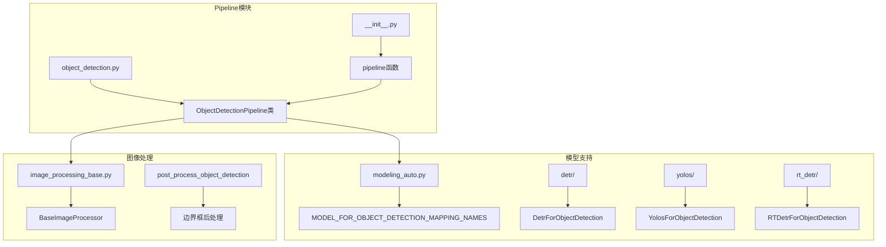
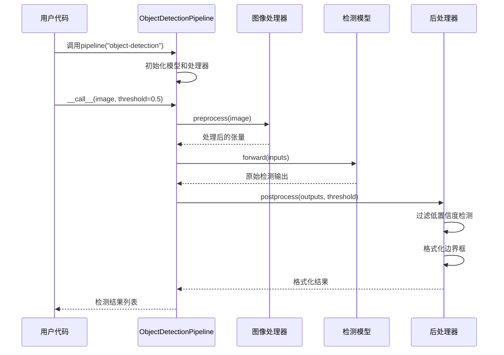
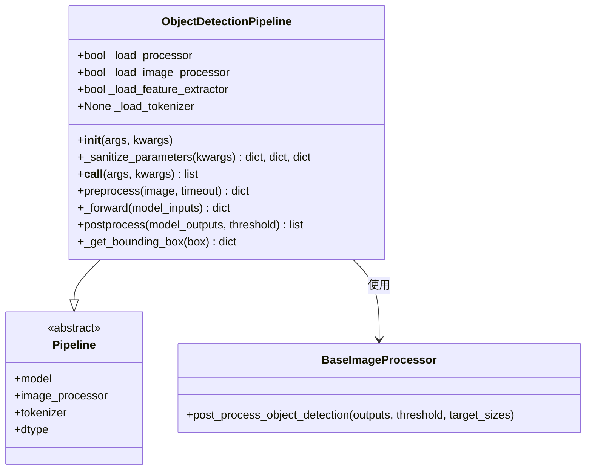
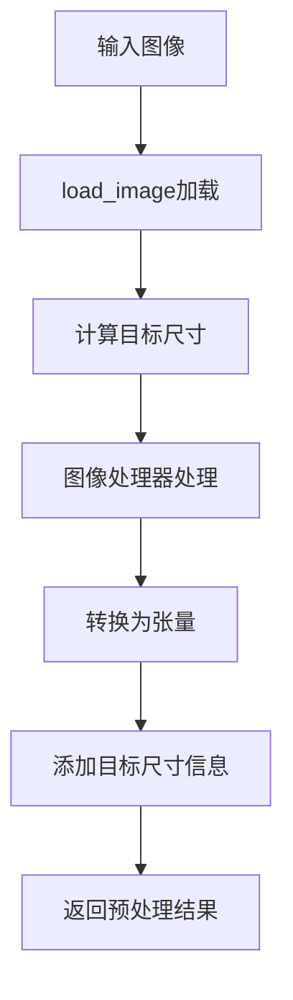
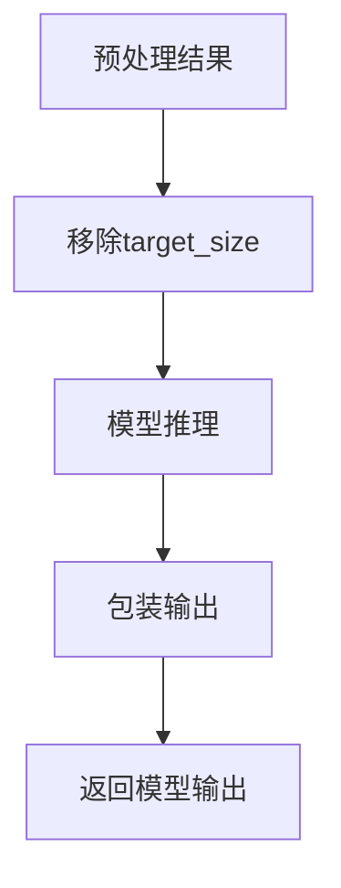
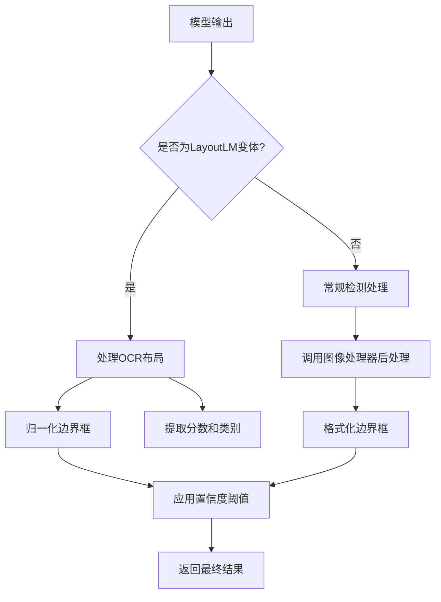
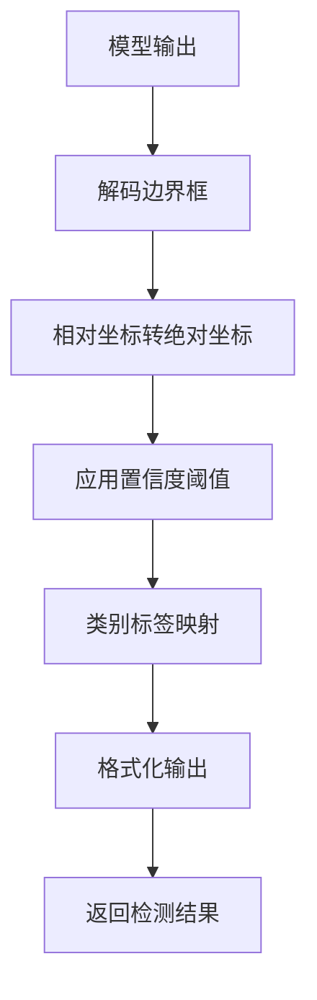
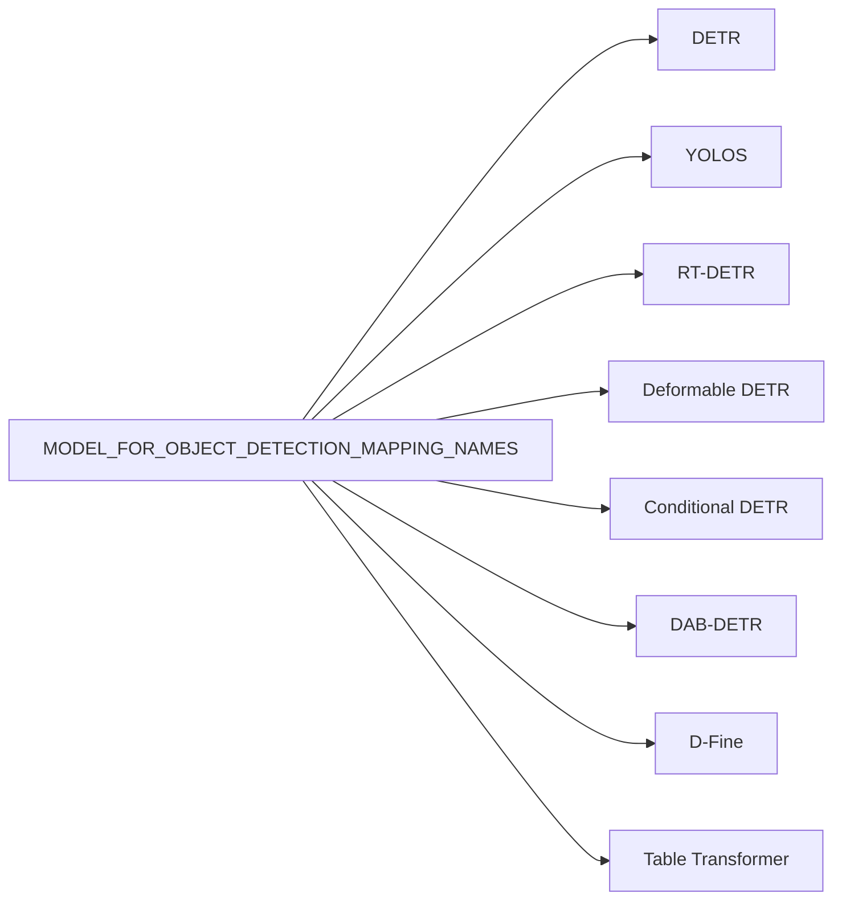

# 目标检测Pipeline

<cite>
**本文档中引用的文件**
- [object_detection.py](file://src/transformers/pipelines/object_detection.py)
- [test_pipelines_object_detection.py](file://tests/pipelines/test_pipelines_object_detection.py)
- [run_object_detection.py](file://examples/pytorch/object-detection/run_object_detection.py)
- [modeling_auto.py](file://src/transformers/models/auto/modeling_auto.py)
- [image_processing_base.py](file://src/transformers/image_processing_base.py)
- [modeling_yolos.py](file://src/transformers/models/yolos/modeling_yolos.py)
- [__init__.py](file://src/transformers/pipelines/__init__.py)
</cite>

## 目录
1. [简介](#简介)
2. [项目结构](#项目结构)
3. [核心组件](#核心组件)
4. [架构概览](#架构概览)
5. [详细组件分析](#详细组件分析)
6. [模型支持](#模型支持)
7. [配置选项](#配置选项)
8. [使用示例](#使用示例)
9. [最佳实践](#最佳实践)
10. [故障排除指南](#故障排除指南)
11. [总结](#总结)

## 简介

ObjectDetectionPipeline是Hugging Face Transformers库中的一个强大工具，专门用于执行目标检测任务。该Pipeline能够预测图像中对象的边界框位置、类别标签和置信度评分，支持多种先进的检测架构，包括DETR、YOLOS、RT-DETR等。

该Pipeline的核心优势在于：
- 统一的接口设计，支持多种检测模型
- 自动处理图像预处理和后处理流程
- 支持批量推理和单张图像推理
- 灵活的置信度阈值控制
- 完整的边界框坐标输出格式

## 项目结构

ObjectDetectionPipeline在transformers库中的组织结构如下：



**图表来源**
- [object_detection.py](file://src/transformers/pipelines/object_detection.py#L1-L50)
- [modeling_auto.py](file://src/transformers/models/auto/modeling_auto.py#L1120-L1145)

**章节来源**
- [object_detection.py](file://src/transformers/pipelines/object_detection.py#L1-L198)
- [modeling_auto.py](file://src/transformers/models/auto/modeling_auto.py#L1120-L1145)

## 核心组件

ObjectDetectionPipeline的核心组件包括以下几个关键部分：

### 1. 基础Pipeline类
ObjectDetectionPipeline继承自基础Pipeline类，提供了统一的接口和生命周期管理。

### 2. 模型映射系统
通过MODEL_FOR_OBJECT_DETECTION_MAPPING_NAMES字典，Pipeline能够自动识别和加载支持的目标检测模型。

### 3. 图像处理器
集成了专门的图像处理器，负责图像预处理和检测结果的后处理。

### 4. 后处理逻辑
实现了复杂的后处理逻辑，包括置信度过滤、边界框格式转换等。

**章节来源**
- [object_detection.py](file://src/transformers/pipelines/object_detection.py#L25-L50)
- [modeling_auto.py](file://src/transformers/models/auto/modeling_auto.py#L1120-L1145)

## 架构概览

ObjectDetectionPipeline的整体架构采用分层设计，确保了高度的模块化和可扩展性：



**图表来源**
- [object_detection.py](file://src/transformers/pipelines/object_detection.py#L100-L150)

## 详细组件分析

### ObjectDetectionPipeline类分析

ObjectDetectionPipeline类是整个目标检测Pipeline的核心，包含了完整的处理流程：



**图表来源**
- [object_detection.py](file://src/transformers/pipelines/object_detection.py#L25-L198)

#### 预处理阶段（Preprocessing）

预处理阶段负责将输入图像转换为模型可以接受的格式：



**图表来源**
- [object_detection.py](file://src/transformers/pipelines/object_detection.py#L100-L120)

#### 前向传播阶段（Forward Pass）

前向传播阶段将预处理后的数据传递给检测模型：



**图表来源**
- [object_detection.py](file://src/transformers/pipelines/object_detection.py#L122-L135)

#### 后处理阶段（Postprocessing）

后处理阶段是最复杂的部分，负责将原始模型输出转换为用户友好的格式：



**图表来源**
- [object_detection.py](file://src/transformers/pipelines/object_detection.py#L137-L180)

**章节来源**
- [object_detection.py](file://src/transformers/pipelines/object_detection.py#L100-L180)

### 图像处理器后处理机制

图像处理器负责将模型的原始输出转换为标准的边界框格式：



**图表来源**
- [image_processing_base.py](file://src/transformers/image_processing_base.py#L1-L100)

**章节来源**
- [image_processing_base.py](file://src/transformers/image_processing_base.py#L1-L199)

## 模型支持

ObjectDetectionPipeline支持多种先进的目标检测模型架构：

### 支持的模型架构

| 模型名称 | 架构特点 | 主要用途 |
|---------|---------|---------|
| DETR | Transformer-based检测器 | 通用目标检测 |
| YOLOS | Vision Transformer检测器 | 高精度检测 |
| RT-DETR | 实时DETR | 实时检测 |
| Deformable DETR | 可变形DETR | 大尺度检测 |
| Conditional DETR | 条件DETR | 条件检测 |
| DAB-DETR | 动态锚框DETR | 动态检测 |

### 模型映射配置



**图表来源**
- [modeling_auto.py](file://src/transformers/models/auto/modeling_auto.py#L1120-L1145)

**章节来源**
- [modeling_auto.py](file://src/transformers/models/auto/modeling_auto.py#L1120-L1145)

## 配置选项

ObjectDetectionPipeline提供了多个配置选项来控制检测行为：

### 核心配置参数

| 参数名 | 类型 | 默认值 | 描述 |
|-------|------|--------|------|
| threshold | float | 0.5 | 置信度阈值，低于此值的检测将被过滤 |
| timeout | float | None | 网络图像下载超时时间 |
| device | str/int | None | 计算设备设置 |
| batch_size | int | 1 | 批量处理大小 |

### 输出格式规范

每个检测结果包含以下字段：

| 字段名 | 类型 | 描述 |
|-------|------|------|
| score | float | 检测置信度分数，范围[0,1] |
| label | str | 检测到的对象类别标签 |
| box | dict | 边界框坐标信息 |

边界框坐标格式：
```python
{
    "xmin": int,  # 左上角x坐标
    "ymin": int,  # 左上角y坐标
    "xmax": int,  # 右下角x坐标
    "ymax": int   # 右下角y坐标
}
```

**章节来源**
- [object_detection.py](file://src/transformers/pipelines/object_detection.py#L50-L100)

## 使用示例

### 基础使用示例

```python
# 加载DETR模型进行目标检测
from transformers import pipeline

# 创建检测器
detector = pipeline("object-detection", model="facebook/detr-resnet-50")

# 单张图像检测
results = detector("https://example.com/image.jpg")
# 输出示例：[{'score': 0.998, 'label': 'cat', 'box': {'xmin': 100, 'ymin': 50, 'xmax': 300, 'ymax': 250}}]

# 批量图像检测
batch_results = detector([
    "image1.jpg",
    "image2.jpg",
    "image3.jpg"
])
```

### 不同模型的使用

```python
# 使用YOLOS模型
yolos_detector = pipeline("object-detection", model="huggingface/yolos-tiny")

# 使用RT-DETR模型
rt_detector = pipeline("object-detection", model="PaddlePaddle/rt-detr-r50")

# 自定义置信度阈值
high_confidence_results = detector("image.jpg", threshold=0.8)
```

### 处理不同输入格式

```python
from PIL import Image
import requests
from io import BytesIO

# PIL Image对象
image = Image.open("local_image.jpg")
results = detector(image)

# 本地文件路径
results = detector("/path/to/local/image.jpg")

# 网络图像URL
response = requests.get("https://example.com/image.jpg")
image_bytes = BytesIO(response.content)
results = detector(image_bytes)

# 批量处理
batch_images = [
    Image.open("image1.jpg"),
    "https://example.com/image2.jpg",
    "/path/to/image3.jpg"
]
results = detector(batch_images)
```

### 高级配置示例

```python
# 设置设备和批处理大小
detector = pipeline(
    "object-detection",
    model="facebook/detr-resnet-50",
    device=0,  # GPU设备
    batch_size=4
)

# 自定义超时设置
results = detector("large_image.jpg", timeout=30.0)

# 处理大量检测结果
results = detector("crowded_scene.jpg", threshold=0.3)
```

**章节来源**
- [test_pipelines_object_detection.py](file://tests/pipelines/test_pipelines_object_detection.py#L88-L113)
- [run_object_detection.py](file://examples/pytorch/object-detection/run_object_detection.py#L1-L100)

## 最佳实践

### 1. 小物体检测优化

对于小物体检测，建议采用以下策略：

```python
# 使用高分辨率模型
small_object_detector = pipeline(
    "object-detection",
    model="facebook/detr-resnet-101"
)

# 降低置信度阈值以捕获更多小物体
results = small_object_detector(
    "scene_with_small_objects.jpg",
    threshold=0.2
)
```

### 2. 密集场景处理

处理密集场景时，需要注意内存和性能：

```python
# 分块处理大图像
def process_large_image(image_path, chunk_size=800):
    from PIL import Image
    import numpy as np
    
    image = Image.open(image_path)
    width, height = image.size
    
    results = []
    for y in range(0, height, chunk_size):
        for x in range(0, width, chunk_size):
            # 提取图像块
            box = (x, y, min(x + chunk_size, width), min(y + chunk_size, height))
            chunk = image.crop(box)
            
            # 处理图像块
            chunk_results = detector(chunk)
            
            # 转换坐标到原图空间
            for result in chunk_results:
                result['box']['xmin'] += x
                result['box']['ymin'] += y
                result['box']['xmax'] += x
                result['box']['ymax'] += y
            
            results.extend(chunk_results)
    
    return results
```

### 3. 遮挡情况处理

对于遮挡严重的场景，可以结合其他技术：

```python
# 结合语义分割结果
from transformers import pipeline as seg_pipeline

# 创建分割器
segmenter = seg_pipeline("image-segmentation", model="facebook/deeplabv3-xception65")

# 处理遮挡场景
def detect_with_context(image_path):
    detector = pipeline("object-detection", model="facebook/detr-resnet-50")
    segmenter = seg_pipeline("image-segmentation", model="facebook/deeplabv3-xception65")
    
    # 获取分割掩码
    segmentation_results = segmenter(image_path)
    
    # 获取检测结果
    detection_results = detector(image_path)
    
    # 结合上下文信息
    filtered_results = []
    for detection in detection_results:
        # 检查检测区域是否被遮挡
        if not is_occluded(detection['box'], segmentation_results):
            filtered_results.append(detection)
    
    return filtered_results
```

### 4. 性能优化技巧

```python
# 模型缓存和重用
detector_cache = {}

def get_cached_detector(model_name):
    if model_name not in detector_cache:
        detector_cache[model_name] = pipeline("object-detection", model=model_name)
    return detector_cache[model_name]

# 批量处理优化
def batch_process_images(image_paths, batch_size=8):
    detector = pipeline("object-detection", model="facebook/detr-resnet-50")
    
    results = []
    for i in range(0, len(image_paths), batch_size):
        batch = image_paths[i:i + batch_size]
        batch_results = detector(batch)
        results.extend(batch_results)
    
    return results
```

### 5. 输出格式自定义

```python
def format_detection_results(results, include_confidence=False):
    """自定义输出格式"""
    formatted_results = []
    
    for result in results:
        detection = {
            "category": result['label'],
            "confidence": result['score'],
            "bbox": {
                "x": result['box']['xmin'],
                "y": result['box']['ymin'],
                "width": result['box']['xmax'] - result['box']['xmin'],
                "height": result['box']['ymax'] - result['box']['ymin']
            }
        }
        
        if not include_confidence:
            del detection['confidence']
        
        formatted_results.append(detection)
    
    return formatted_results
```

## 故障排除指南

### 常见问题及解决方案

#### 1. 内存不足错误

**问题描述**：处理大图像或大批量数据时出现内存不足。

**解决方案**：
```python
# 减少批处理大小
detector = pipeline("object-detection", model="facebook/detr-resnet-50", batch_size=1)

# 使用CPU而非GPU
detector = pipeline("object-detection", model="facebook/detr-resnet-50", device=-1)

# 处理大图像时分块处理
def process_large_image_efficiently(image_path):
    # 实现图像分块处理逻辑
    pass
```

#### 2. 检测精度问题

**问题描述**：检测结果不准确或漏检。

**解决方案**：
```python
# 调整置信度阈值
results_high = detector("image.jpg", threshold=0.7)  # 更严格的阈值
results_low = detector("image.jpg", threshold=0.3)   # 更宽松的阈值

# 使用更高精度的模型
high_precision_detector = pipeline("object-detection", model="facebook/detr-resnet-101")
```

#### 3. 输入格式问题

**问题描述**：输入图像格式不被支持。

**解决方案**：
```python
from PIL import Image
import numpy as np

def normalize_input(image):
    """标准化输入格式"""
    if isinstance(image, str):
        # 文件路径
        return Image.open(image)
    elif isinstance(image, bytes):
        # 字节流
        return Image.open(BytesIO(image))
    elif isinstance(image, np.ndarray):
        # NumPy数组
        return Image.fromarray(image)
    elif isinstance(image, Image.Image):
        # PIL图像
        return image
    else:
        raise ValueError(f"Unsupported image type: {type(image)}")
```

#### 4. 模型加载失败

**问题描述**：无法加载指定的检测模型。

**解决方案**：
```python
# 检查模型可用性
from transformers import AutoModelForObjectDetection, AutoImageProcessor

try:
    model = AutoModelForObjectDetection.from_pretrained("facebook/detr-resnet-50")
    processor = AutoImageProcessor.from_pretrained("facebook/detr-resnet-50")
    detector = pipeline("object-detection", model=model, image_processor=processor)
except Exception as e:
    print(f"Model loading failed: {e}")
    # 尝试备用模型
    detector = pipeline("object-detection", model="huggingface/yolos-tiny")
```

### 性能监控

```python
import time
import psutil

def monitor_detection_performance(image_path):
    """监控检测性能"""
    start_time = time.time()
    start_memory = psutil.Process().memory_info().rss / 1024 / 1024  # MB
    
    results = detector(image_path)
    
    end_time = time.time()
    end_memory = psutil.Process().memory_info().rss / 1024 / 1024  # MB
    
    print(f"处理时间: {end_time - start_time:.2f}秒")
    print(f"内存使用: {end_memory - start_memory:.2f}MB")
    print(f"检测数量: {len(results)}")
    
    return results
```

**章节来源**
- [test_pipelines_object_detection.py](file://tests/pipelines/test_pipelines_object_detection.py#L216-L298)

## 总结

ObjectDetectionPipeline是Hugging Face Transformers库中一个功能强大且易于使用的工具，它为开发者提供了统一的目标检测解决方案。通过本文档的详细介绍，我们可以看到：

### 主要优势

1. **统一接口**：支持多种检测模型，提供一致的使用体验
2. **自动化处理**：自动完成图像预处理和结果后处理
3. **灵活配置**：支持置信度阈值、设备选择等多维度配置
4. **批量处理**：高效处理单张和批量图像输入
5. **格式标准化**：提供统一的输出格式，便于后续处理

### 技术特点

1. **模块化设计**：清晰的分层架构，便于维护和扩展
2. **类型安全**：完善的类型注解和参数验证
3. **性能优化**：支持GPU加速和批处理优化
4. **错误处理**：健壮的异常处理机制

### 应用场景

ObjectDetectionPipeline适用于各种目标检测应用场景：
- 实时视频分析
- 批量图像处理
- 学术研究和实验
- 生产环境部署
- 边缘设备推理

### 发展方向

随着计算机视觉技术的发展，ObjectDetectionPipeline将继续演进：
- 支持更多先进的检测架构
- 优化移动端和边缘设备性能
- 增强对复杂场景的处理能力
- 提供更丰富的后处理选项

通过掌握ObjectDetectionPipeline的使用方法和最佳实践，开发者可以快速构建高质量的目标检测应用，为各种视觉任务提供强大的技术支持。