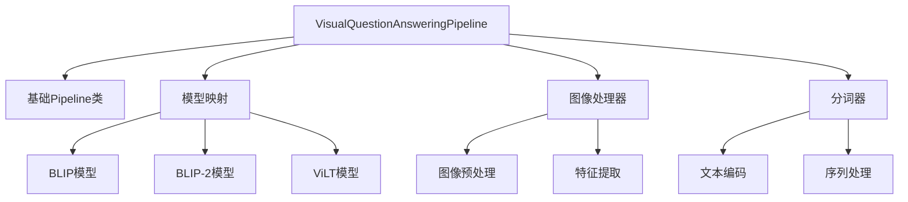
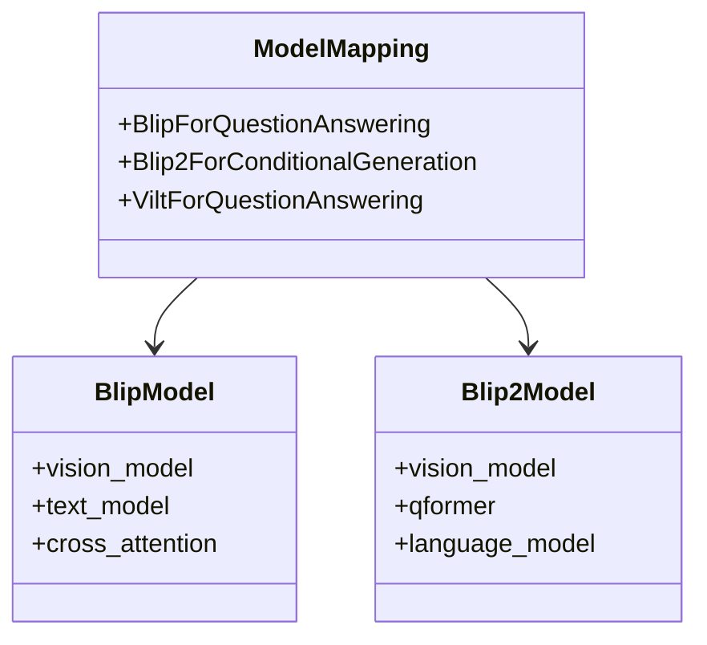
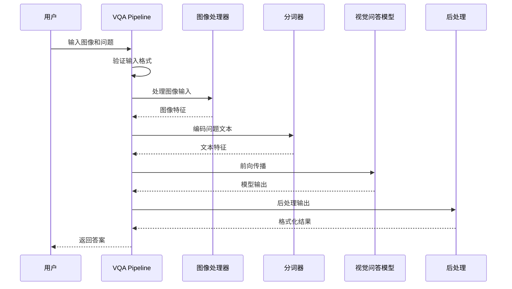
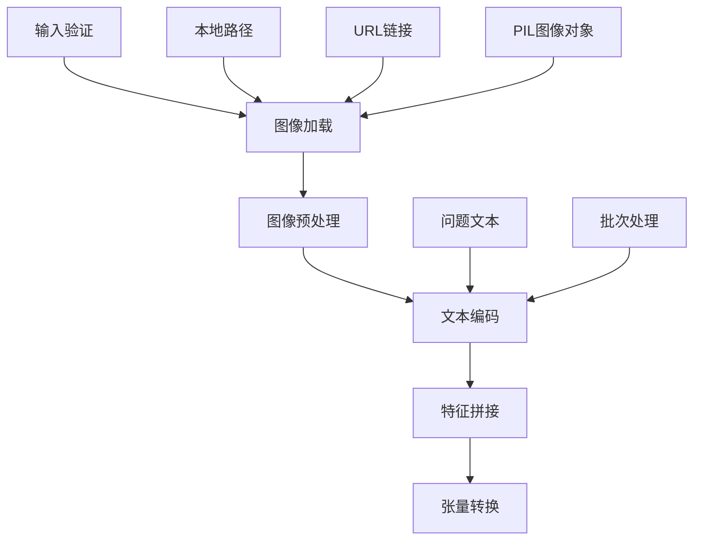
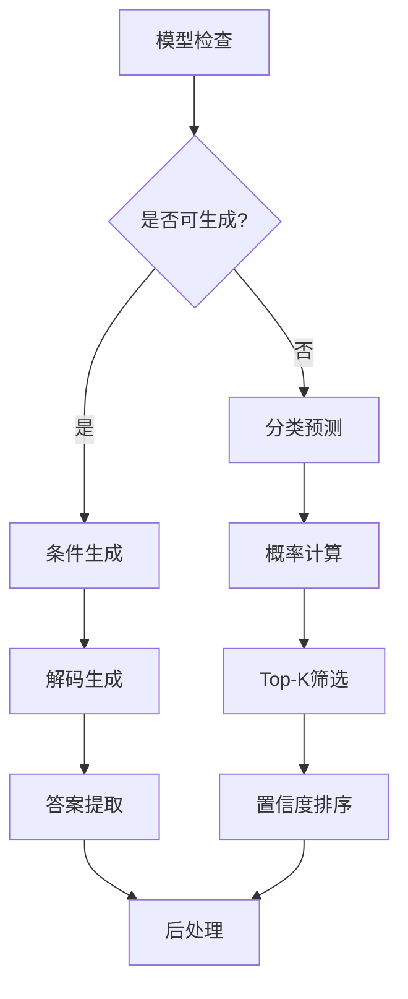
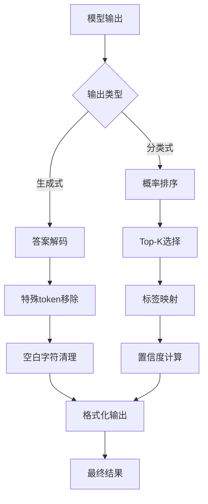
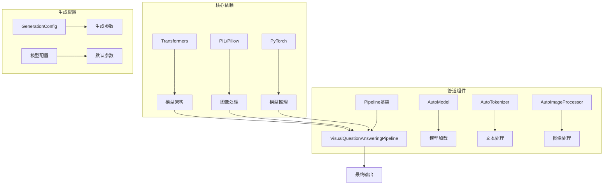

# 视觉问答Pipeline

<cite>
**本文档中引用的文件**
- [visual_question_answering.py](file://src/transformers/pipelines/visual_question_answering.py)
- [modeling_auto.py](file://src/transformers/models/auto/modeling_auto.py)
- [test_pipelines_visual_question_answering.py](file://tests/pipelines/test_pipelines_visual_question_answering.py)
- [base.py](file://src/transformers/pipelines/base.py)
- [modeling_blip.py](file://src/transformers/models/blip/modeling_blip.py)
- [modeling_blip_2.py](file://src/transformers/models/blip_2/modeling_blip_2.py)
- [configuration_blip.py](file://src/transformers/models/blip/configuration_blip.py)
- [configuration_blip_2.py](file://src/transformers/models/blip_2/configuration_blip_2.py)
</cite>

## 目录
1. [简介](#简介)
2. [项目结构](#项目结构)
3. [核心组件](#核心组件)
4. [架构概览](#架构概览)
5. [详细组件分析](#详细组件分析)
6. [依赖关系分析](#依赖关系分析)
7. [性能考虑](#性能考虑)
8. [故障排除指南](#故障排除指南)
9. [结论](#结论)

## 简介

VisualQuestionAnsweringPipeline（视觉问答Pipeline）是Hugging Face Transformers库中的一个强大组件，专门用于处理多模态视觉问答任务。该Pipeline能够融合图像和文本输入，通过深度学习模型实现复杂的视觉推理和自然语言回答生成。

视觉问答任务涉及理解图像内容并回答与之相关的问题。例如，给定一张包含猫的图片，系统可以回答"图片中有几只猫？"或"这些动物是什么？"等问题。这种能力在智能助手、教育工具、无障碍技术等领域具有重要应用价值。

## 项目结构

VisualQuestionAnsweringPipeline位于transformers库的管道模块中，与其他管道组件共享统一的架构设计：

**图表来源**
- [visual_question_answering.py](file://src/transformers/pipelines/visual_question_answering.py#L20-L211)
- [modeling_auto.py](file://src/transformers/models/auto/modeling_auto.py#L1414-L1420)

**章节来源**
- [visual_question_answering.py](file://src/transformers/pipelines/visual_question_answering.py#L1-L50)
- [modeling_auto.py](file://src/transformers/models/auto/modeling_auto.py#L1414-L1420)

## 核心组件

### VisualQuestionAnsweringPipeline类

VisualQuestionAnsweringPipeline是视觉问答任务的主要入口点，继承自基础Pipeline类并实现了特定的多模态处理逻辑。

#### 主要特性

1. **多模态输入支持**：同时处理图像和文本输入
2. **灵活的调用方式**：支持多种输入格式
3. **生成式和分类式两种模式**：根据模型类型自动选择推理方式
4. **批量处理能力**：支持单个或多个图像-问题对的批量推理

#### 输入格式支持

Pipeline支持以下输入格式：
- 单个图像和问题：`pipeline(image=image, question=question)`
- 字典格式：`pipeline({"image": image, "question": question})`
- 批量输入：`pipeline([{"image": img, "question": q}])`
- 数据集格式：使用KeyDataset进行高效批量处理

**章节来源**
- [visual_question_answering.py](file://src/transformers/pipelines/visual_question_answering.py#L20-L211)

### 模型映射系统

系统通过MODEL_FOR_VISUAL_QUESTION_ANSWERING_MAPPING_NAMES定义了支持的模型类型：

**图表来源**
- [modeling_auto.py](file://src/transformers/models/auto/modeling_auto.py#L1414-L1420)

**章节来源**
- [modeling_auto.py](file://src/transformers/models/auto/modeling_auto.py#L1414-L1420)

## 架构概览

VisualQuestionAnsweringPipeline采用模块化架构设计，将复杂的多模态处理分解为清晰的阶段：

**图表来源**
- [visual_question_answering.py](file://src/transformers/pipelines/visual_question_answering.py#L150-L211)

## 详细组件分析

### 输入预处理阶段

预处理阶段负责将原始输入转换为模型可接受的格式：

**图表来源**
- [visual_question_answering.py](file://src/transformers/pipelines/visual_question_answering.py#L150-L170)

#### 图像处理流程

图像处理包括以下步骤：
1. **图像加载**：支持本地文件、网络URL和PIL对象
2. **尺寸标准化**：调整图像大小以匹配模型要求
3. **归一化**：将像素值标准化到模型期望范围
4. **张量转换**：转换为PyTorch张量格式

#### 文本编码流程

文本编码过程：
1. **问题预处理**：清理和标准化问题文本
2. **分词处理**：使用专用分词器进行tokenization
3. **序列填充**：确保批次内序列长度一致
4. **注意力掩码**：生成注意力权重

**章节来源**
- [visual_question_answering.py](file://src/transformers/pipelines/visual_question_answering.py#L150-L170)

### 模型推理阶段

模型推理阶段根据模型类型采用不同的处理策略：

**图表来源**
- [visual_question_answering.py](file://src/transformers/pipelines/visual_question_answering.py#L172-L190)

#### 生成式模型（如BLIP-2）

对于支持生成式推理的模型（如BLIP-2），Pipeline会：
1. **设置生成配置**：使用默认的max_new_tokens=256
2. **条件生成**：基于图像和问题生成答案
3. **解码处理**：将生成的token序列解码为自然语言

#### 分类式模型（如ViLT）

对于分类式模型，Pipeline执行：
1. **前向传播**：计算所有可能答案的概率
2. **sigmoid激活**：将logits转换为概率
3. **Top-K筛选**：选择最可能的答案
4. **标签映射**：将索引转换为实际标签

**章节来源**
- [visual_question_answering.py](file://src/transformers/pipelines/visual_question_answering.py#L172-L190)

### 输出后处理阶段

后处理阶段负责将模型输出转换为用户友好的格式：

**图表来源**
- [visual_question_answering.py](file://src/transformers/pipelines/visual_question_answering.py#L192-L211)

**章节来源**
- [visual_question_answering.py](file://src/transformers/pipelines/visual_question_answering.py#L192-L211)

## 依赖关系分析

VisualQuestionAnsweringPipeline依赖于多个关键组件：

**图表来源**
- [visual_question_answering.py](file://src/transformers/pipelines/visual_question_answering.py#L1-L15)
- [base.py](file://src/transformers/pipelines/base.py#L1-L50)

### 关键依赖项

1. **PyTorch**：提供张量操作和模型推理功能
2. **PIL/Pillow**：处理图像加载和基本操作
3. **Transformers库**：提供预训练模型和处理器
4. **NumPy**：支持数值计算和数组操作

**章节来源**
- [visual_question_answering.py](file://src/transformers/pipelines/visual_question_answering.py#L1-L15)

## 性能考虑

### 推理速度优化

1. **模型量化**：支持INT8和FP16量化以减少内存占用
2. **设备优化**：自动检测GPU可用性并进行设备分配
3. **批处理**：支持批量推理以提高吞吐量
4. **缓存机制**：重用中间计算结果

### 内存管理

1. **动态内存分配**：根据输入大小动态调整内存使用
2. **梯度检查点**：在内存受限环境中启用
3. **模型分片**：支持大模型的分片加载

### 并行处理

1. **数据并行**：支持多GPU推理
2. **模型并行**：大型模型的分布式推理
3. **流水线并行**：不同层在不同设备上执行

## 故障排除指南

### 常见问题及解决方案

#### 1. 模型加载失败
**症状**：无法加载指定的VQA模型
**原因**：模型名称错误或网络连接问题
**解决方案**：
- 验证模型名称的正确性
- 检查网络连接状态
- 使用本地模型文件

#### 2. 图像格式不兼容
**症状**：图像处理过程中出现错误
**原因**：图像格式不被支持或损坏
**解决方案**：
- 确保图像格式为常见格式（JPEG、PNG等）
- 验证图像文件完整性
- 使用PIL重新保存图像

#### 3. 内存不足错误
**症状**：推理过程中出现OOM错误
**原因**：模型过大或批次尺寸不当
**解决方案**：
- 减小批次大小
- 启用模型量化
- 使用CPU进行推理

#### 4. 输出质量不佳
**症状**：生成的答案不准确或不相关
**原因**：模型选择不当或输入格式问题
**解决方案**：
- 尝试不同的预训练模型
- 优化问题表述
- 调整生成参数

**章节来源**
- [test_pipelines_visual_question_answering.py](file://tests/pipelines/test_pipelines_visual_question_answering.py#L50-L100)

## 结论

VisualQuestionAnsweringPipeline代表了多模态AI技术的重要进展，它成功地将计算机视觉和自然语言处理结合起来，为复杂的视觉理解任务提供了强大的解决方案。

### 主要优势

1. **易用性**：简洁的API设计使得复杂的多模态任务变得简单
2. **灵活性**：支持多种输入格式和模型类型
3. **扩展性**：模块化设计便于添加新的模型和功能
4. **性能**：优化的推理流程确保高效的处理能力

### 应用前景

视觉问答技术在以下领域具有广阔的应用前景：
- 智能客服系统
- 教育辅助工具
- 无障碍技术支持
- 医疗影像分析
- 自动驾驶系统

随着模型架构的不断改进和计算资源的持续发展，VisualQuestionAnsweringPipeline将继续在推动人工智能技术普及方面发挥重要作用。