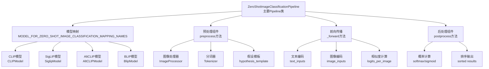
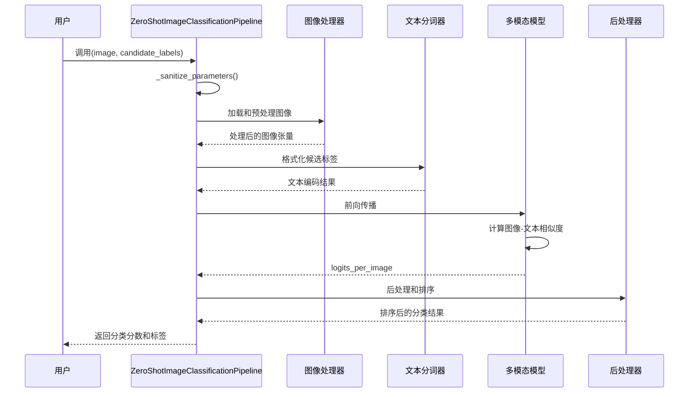
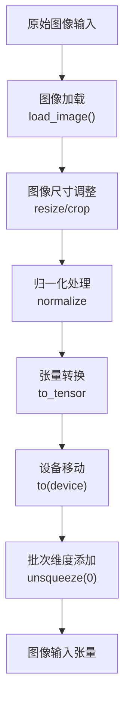
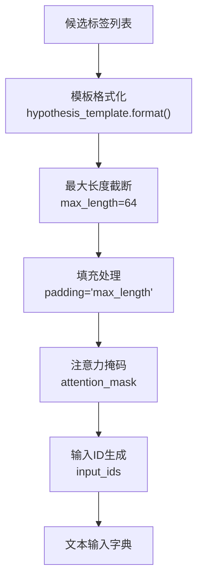
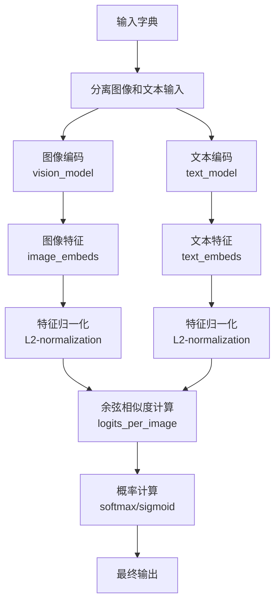
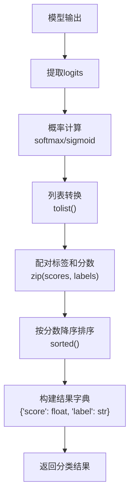
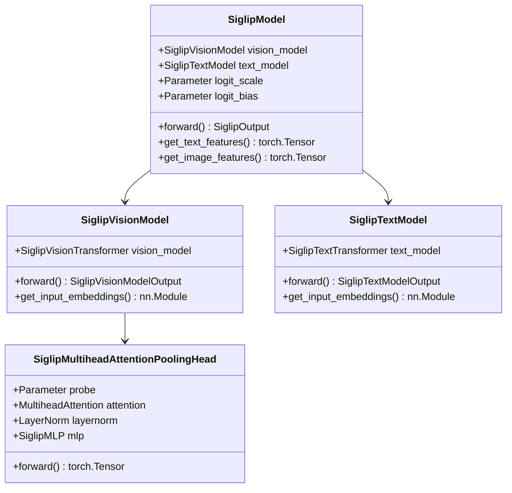
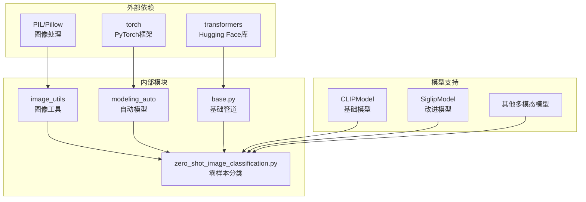

# 零样本图像分类Pipeline

<cite>
**本文档中引用的文件**
- [zero_shot_image_classification.py](file://src/transformers/pipelines/zero_shot_image_classification.py)
- [modeling_auto.py](file://src/transformers/models/auto/modeling_auto.py)
- [modeling_siglip.py](file://src/transformers/models/siglip/modeling_siglip.py)
- [test_pipelines_zero_shot_image_classification.py](file://tests/pipelines/test_pipelines_zero_shot_image_classification.py)
- [configuration_siglip.py](file://src/transformers/models/siglip/configuration_siglip.py)
</cite>

## 目录
1. [简介](#简介)
2. [项目结构](#项目结构)
3. [核心组件](#核心组件)
4. [架构概览](#架构概览)
5. [详细组件分析](#详细组件分析)
6. [依赖关系分析](#依赖关系分析)
7. [性能考虑](#性能考虑)
8. [故障排除指南](#故障排除指南)
9. [结论](#结论)

## 简介

零样本图像分类Pipeline是Hugging Face Transformers库中的一个创新功能，它利用CLIP和SigLIP等多模态预训练模型实现无需训练即可对新类别进行分类的能力。这个Pipeline通过结合视觉编码器和文本编码器，能够理解图像内容并将其与用户提供的候选标签进行语义匹配。

该Pipeline的核心优势在于其"零样本"特性：用户无需提供任何标注数据，只需定义候选标签集合，系统就能根据这些标签对图像进行分类。这种能力在处理开放域分类任务、长尾分布问题和动态标签场景时具有重要价值。

## 项目结构

零样本图像分类Pipeline的实现分布在多个模块中，形成了清晰的分层架构：

**图表来源**
- [zero_shot_image_classification.py](file://src/transformers/pipelines/zero_shot_image_classification.py#L29-L201)
- [modeling_auto.py](file://src/transformers/models/auto/modeling_auto.py#L1675-L1689)

**章节来源**
- [zero_shot_image_classification.py](file://src/transformers/pipelines/zero_shot_image_classification.py#L1-L203)
- [modeling_auto.py](file://src/transformers/models/auto/modeling_auto.py#L1675-L1689)

## 核心组件

### ZeroShotImageClassificationPipeline类

这是整个零样本图像分类系统的核心类，继承自基础Pipeline类，专门负责处理图像分类任务。

#### 主要特性：
- **多模态支持**：同时处理图像和文本输入
- **批量处理**：支持单张和批量图像分类
- **灵活的标签格式**：接受字符串列表作为候选标签
- **多种模型兼容**：支持CLIP、SigLIP、AltCLIP等多种模型

#### 关键属性：
- `_load_processor = False`：不加载通用处理器
- `_load_image_processor = True`：加载图像处理器
- `_load_feature_extractor = False`：不加载特征提取器  
- `_load_tokenizer = True`：加载分词器

**章节来源**
- [zero_shot_image_classification.py](file://src/transformers/pipelines/zero_shot_image_classification.py#L29-L81)

### 模型映射系统

系统支持多种零样本图像分类模型：

| 模型类型 | 模型名称 | 特点 |
|---------|---------|------|
| CLIP | CLIPModel | 基础多模态模型，平衡图像和文本理解 |
| SigLIP | SiglipModel | 改进的CLIP变体，更好的图像-文本对齐 |
| AltCLIP | AltCLIPModel | 多语言支持的CLIP变体 |
| BLIP | BlipModel | 结合视觉和语言预训练的模型 |

**章节来源**
- [modeling_auto.py](file://src/transformers/models/auto/modeling_auto.py#L1675-L1689)

## 架构概览

零样本图像分类Pipeline采用经典的多阶段处理架构：

**图表来源**
- [zero_shot_image_classification.py](file://src/transformers/pipelines/zero_shot_image_classification.py#L110-L201)

## 详细组件分析

### 预处理阶段

预处理阶段负责将原始输入转换为模型可接受的格式：

#### 图像预处理流程：

#### 文本预处理流程：

**图表来源**
- [zero_shot_image_classification.py](file://src/transformers/pipelines/zero_shot_image_classification.py#L110-L140)

**章节来源**
- [zero_shot_image_classification.py](file://src/transformers/pipelines/zero_shot_image_classification.py#L110-L140)

### 模型前向传播

模型前向传播阶段执行核心的多模态特征提取和相似度计算：

#### CLIP vs SigLIP的差异处理：
- **CLIP模型**：使用`softmax`计算分类概率
- **SigLIP模型**：使用`sigmoid`计算二分类概率

**图表来源**
- [zero_shot_image_classification.py](file://src/transformers/pipelines/zero_shot_image_classification.py#L142-L160)

**章节来源**
- [zero_shot_image_classification.py](file://src/transformers/pipelines/zero_shot_image_classification.py#L142-L160)

### 后处理阶段

后处理阶段负责将原始模型输出转换为用户友好的分类结果：

#### 输出格式化流程：

**图表来源**
- [zero_shot_image_classification.py](file://src/transformers/pipelines/zero_shot_image_classification.py#L162-L180)

**章节来源**
- [zero_shot_image_classification.py](file://src/transformers/pipelines/zero_shot_image_classification.py#L162-L180)

### SigLIP模型架构分析

SigLIP（Scalable Vision-Language Pretraining）是零样本图像分类的重要模型之一，其架构特点包括：

#### 视觉编码器特点：
- **多头注意力池化**：使用特殊的probe token进行特征聚合
- **位置编码插值**：支持不同分辨率图像的处理
- **层归一化**：在每个子层后应用归一化

#### 文本编码器特点：
- **Flash注意力**：支持高效的注意力计算
- **截断正态分布初始化**：改进的权重初始化策略
- **无因果掩码**：区别于传统Transformer的双向编码

**图表来源**
- [modeling_siglip.py](file://src/transformers/models/siglip/modeling_siglip.py#L800-L999)

**章节来源**
- [modeling_siglip.py](file://src/transformers/models/siglip/modeling_siglip.py#L800-L999)

## 依赖关系分析

零样本图像分类Pipeline的依赖关系体现了现代深度学习框架的设计原则：

**图表来源**
- [zero_shot_image_classification.py](file://src/transformers/pipelines/zero_shot_image_classification.py#L1-L20)
- [modeling_auto.py](file://src/transformers/models/auto/modeling_auto.py#L1-L50)

**章节来源**
- [zero_shot_image_classification.py](file://src/transformers/pipelines/zero_shot_image_classification.py#L1-L20)
- [modeling_auto.py](file://src/transformers/models/auto/modeling_auto.py#L1-L50)

## 性能考虑

### 批处理优化

系统支持批量处理以提高效率：

- **内存管理**：自动处理批次大小，避免内存溢出
- **设备优化**：智能选择GPU/CPU设备
- **异步处理**：支持超时控制和非阻塞操作

### 模型选择建议

根据不同场景选择合适的模型：

| 场景 | 推荐模型 | 原因 |
|------|---------|------|
| 实时应用 | SigLIP小型模型 | 更快的推理速度 |
| 高精度需求 | CLIP大型模型 | 更好的分类准确性 |
| 多语言支持 | AltCLIP模型 | 支持多种语言标签 |
| 移动端部署 | 轻量化模型 | 减少计算资源消耗 |

### 提示工程最佳实践

有效的提示工程可以显著提升分类效果：

1. **标签描述清晰**：使用具体而非模糊的标签描述
2. **数量控制**：合理控制候选标签数量（建议10-50个）
3. **语义一致性**：确保标签之间语义上不冲突
4. **模板优化**：根据具体任务调整假设模板

## 故障排除指南

### 常见问题及解决方案

#### 内存不足错误
- **原因**：大批次或高分辨率图像
- **解决方案**：减小批次大小或降低图像分辨率

#### 分类结果质量差
- **原因**：候选标签设计不当
- **解决方案**：重新设计标签描述，增加语义多样性

#### 模型加载失败
- **原因**：模型权重下载或缓存问题
- **解决方案**：检查网络连接，清理缓存

**章节来源**
- [test_pipelines_zero_shot_image_classification.py](file://tests/pipelines/test_pipelines_zero_shot_image_classification.py#L50-L100)

## 结论

零样本图像分类Pipeline代表了多模态AI技术的重要进展，它突破了传统监督学习的限制，为开放域图像理解提供了强大工具。通过CLIP和SigLIP等先进模型的支持，该Pipeline能够在无需标注数据的情况下实现高质量的图像分类。

### 技术优势总结：
1. **零样本学习**：无需训练即可处理新类别
2. **多模态融合**：有效结合视觉和语言信息
3. **灵活部署**：支持多种模型和应用场景
4. **易于使用**：简洁的API设计

### 应用前景：
- **动态分类**：适应不断变化的分类需求
- **跨领域应用**：适用于医疗、电商、安防等多个领域
- **实时处理**：支持流媒体和实时分析场景

随着多模态预训练技术的不断发展，零样本图像分类Pipeline将在人工智能应用中发挥越来越重要的作用，为开发者提供更加强大和便捷的图像理解工具。