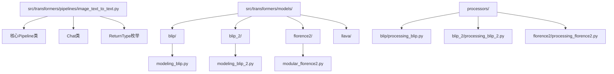
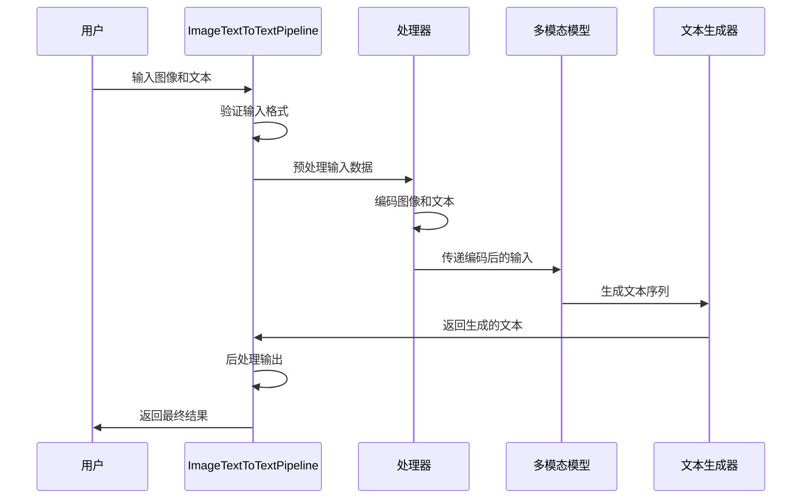
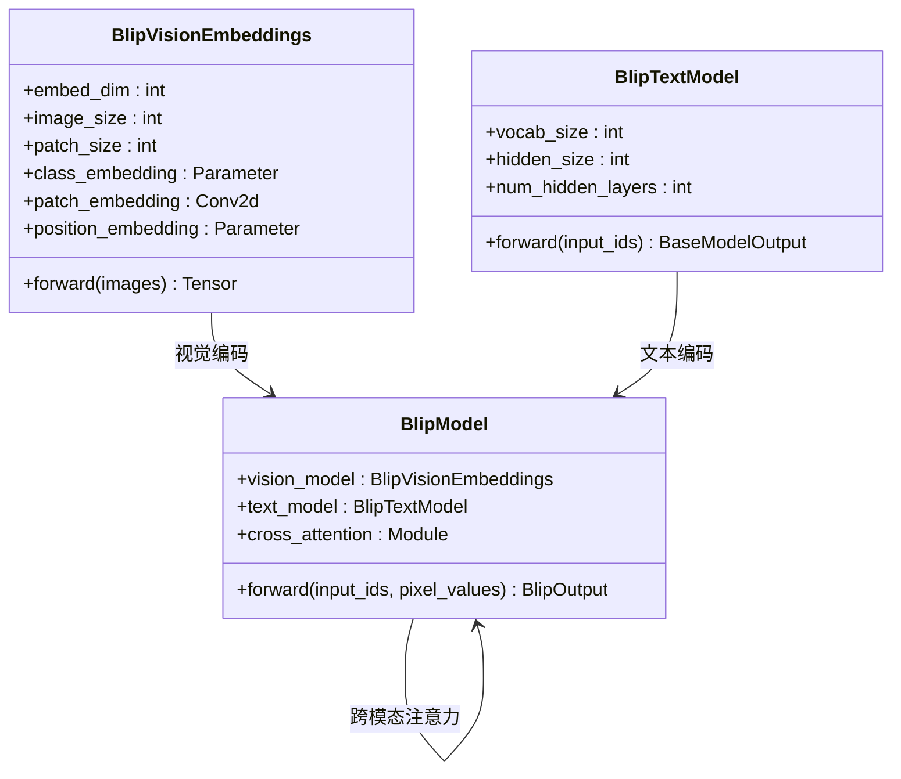
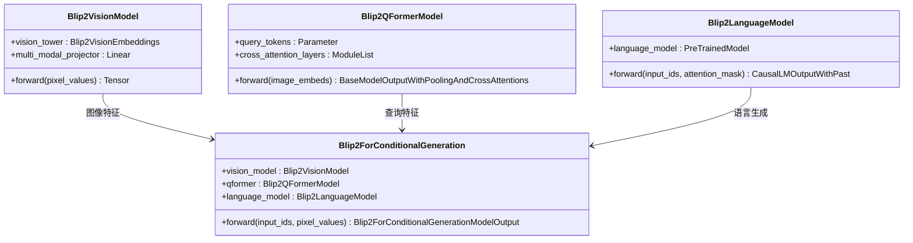
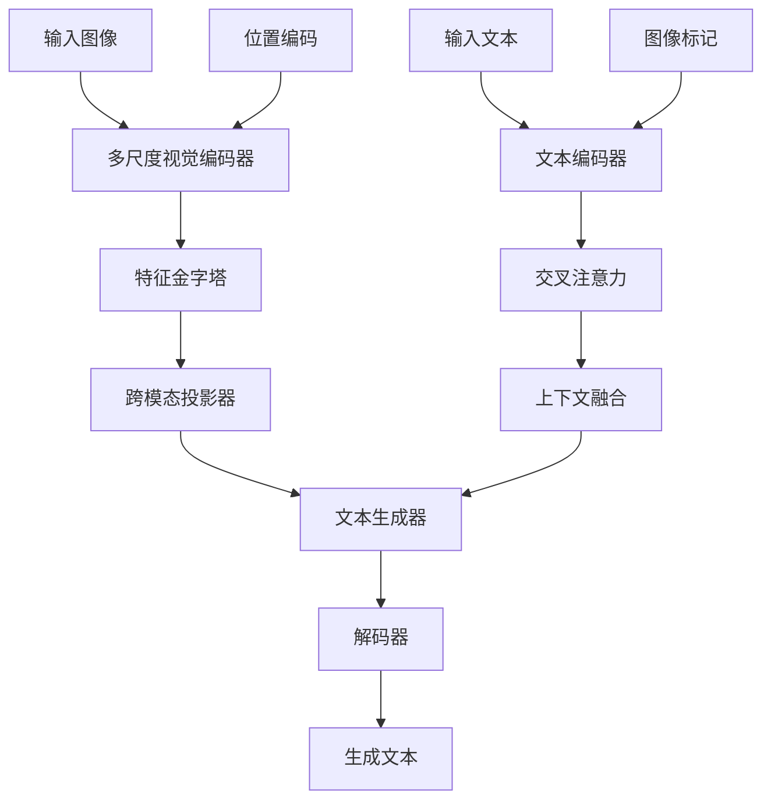
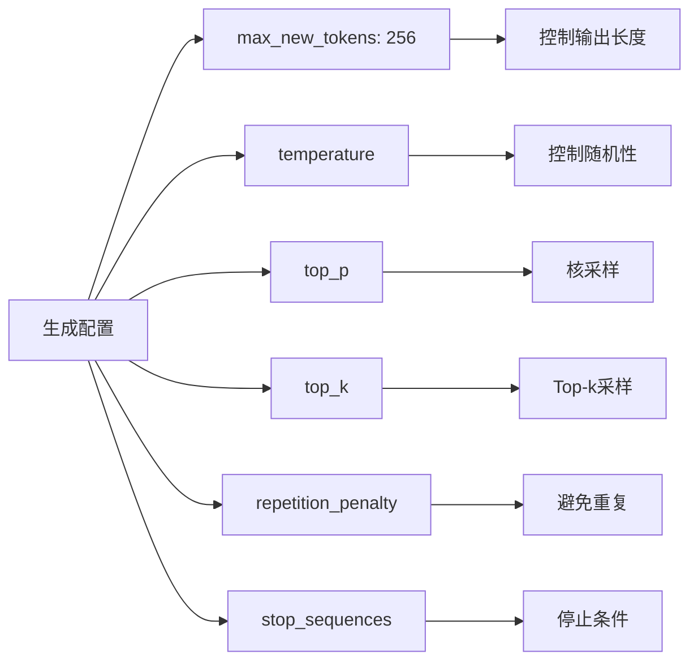
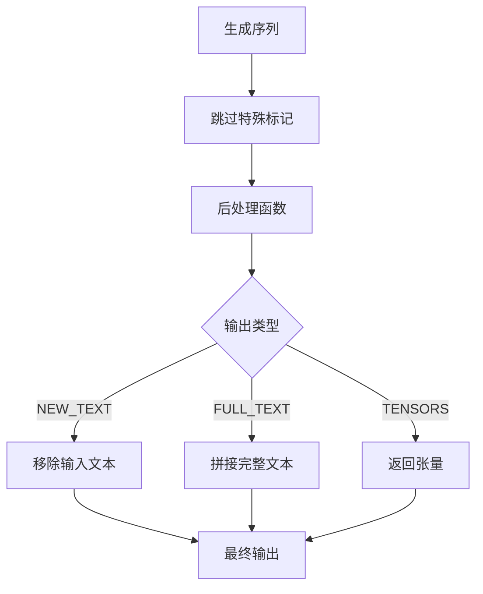
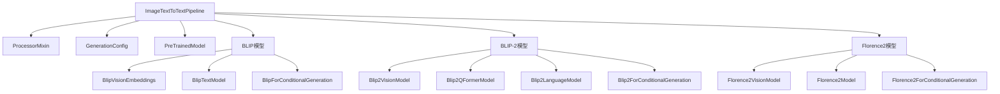

# 图文到文本Pipeline详细文档

<cite>
**本文档中引用的文件**
- [image_text_to_text.py](file://src/transformers/pipelines/image_text_to_text.py)
- [blip/modeling_blip.py](file://src/transformers/models/blip/modeling_blip.py)
- [blip_2/modeling_blip_2.py](file://src/transformers/models/blip_2/modeling_blip_2.py)
- [florence2/modular_florence2.py](file://src/transformers/models/florence2/modular_florence2.py)
- [blip/processing_blip.py](file://src/transformers/models/blip/processing_blip.py)
- [blip_2/processing_blip_2.py](file://src/transformers/models/blip_2/processing_blip_2.py)
- [base.py](file://src/transformers/pipelines/base.py)
- [test_pipelines_image_text_to_text.py](file://tests/pipelines/test_pipelines_image_text_to_text.py)
</cite>

## 目录
1. [简介](#简介)
2. [项目结构](#项目结构)
3. [核心组件](#核心组件)
4. [架构概览](#架构概览)
5. [详细组件分析](#详细组件分析)
6. [依赖关系分析](#依赖关系分析)
7. [性能考虑](#性能考虑)
8. [故障排除指南](#故障排除指南)
9. [结论](#结论)

## 简介

图文到文本Pipeline是Hugging Face Transformers库中的一个重要组件，专门用于处理图像和文本的联合输入并生成新的文本内容。该Pipeline实现了跨模态表示学习、图文对齐机制和文本生成的核心功能，支持多种先进的多模态模型如BLIP、BLIP-2、Florence2和LLaVA等。

该Pipeline的主要特点包括：
- 支持单模态（仅图像或仅文本）和双模态（图像+文本）输入
- 提供灵活的聊天格式支持，允许连续对话
- 实现了多种多模态编码器的工作原理
- 支持特征融合策略和生成模型配置
- 包含丰富的应用场景，从图文摘要到跨模态翻译

## 项目结构

图文到文本Pipeline在Transformers库中的组织结构如下：



**图表来源**
- [image_text_to_text.py](file://src/transformers/pipelines/image_text_to_text.py#L1-L50)
- [blip/modeling_blip.py](file://src/transformers/models/blip/modeling_blip.py#L1-L50)
- [blip_2/modeling_blip_2.py](file://src/transformers/models/blip_2/modeling_blip_2.py#L1-L50)

**章节来源**
- [image_text_to_text.py](file://src/transformers/pipelines/image_text_to_text.py#L1-L50)

## 核心组件

### ImageTextToTextPipeline类

这是图文到文本Pipeline的核心类，继承自基础Pipeline类，提供了完整的多模态文本生成功能。

主要特性：
- 支持多种输入格式：字符串、PIL图像、本地路径、HTTP链接
- 实现聊天模式支持，允许连续对话
- 提供灵活的输出控制选项
- 集成多种多模态模型架构

### Chat类

内部使用的聊天格式处理类，负责将用户提供的消息转换为统一的格式。

关键功能：
- 验证消息格式的正确性
- 自动添加缺失的图像信息
- 支持OpenAI/TGI聊天格式

### ReturnType枚举

定义了Pipeline输出的不同类型：
- `TENSORS`: 返回张量形式的预测结果
- `NEW_TEXT`: 只返回新生成的文本
- `FULL_TEXT`: 返回完整的文本内容（包括输入）

**章节来源**
- [image_text_to_text.py](file://src/transformers/pipelines/image_text_to_text.py#L30-L100)

## 架构概览

图文到文本Pipeline的整体架构展示了从输入处理到最终文本生成的完整流程：



**图表来源**
- [image_text_to_text.py](file://src/transformers/pipelines/image_text_to_text.py#L400-L500)
- [base.py](file://src/transformers/pipelines/base.py#L1-L100)

## 详细组件分析

### 多模态编码器工作原理

#### BLIP模型架构

BLIP（Bootstrapping Language-Image Pre-training）模型采用视觉-语言双塔架构：



**图表来源**
- [blip/modeling_blip.py](file://src/transformers/models/blip/modeling_blip.py#L150-L200)

#### BLIP-2改进架构

BLIP-2引入了Q-Former查询变换器，显著提升了多模态理解能力：



**图表来源**
- [blip_2/modeling_blip_2.py](file://src/transformers/models/blip_2/modeling_blip_2.py#L100-L200)

#### Florence2先进架构

Florence2采用了更复杂的多尺度视觉编码器和先进的文本生成机制：



**图表来源**
- [florence2/modular_florence2.py](file://src/transformers/models/florence2/modular_florence2.py#L150-L200)

**章节来源**
- [blip/modeling_blip.py](file://src/transformers/models/blip/modeling_blip.py#L1-L200)
- [blip_2/modeling_blip_2.py](file://src/transformers/models/blip_2/modeling_blip_2.py#L1-L200)
- [florence2/modular_florence2.py](file://src/transformers/models/florence2/modular_florence2.py#L1-L200)

### 特征融合策略

#### 跨模态对齐机制

多模态模型通过多种方式实现视觉和文本特征的对齐：

1. **交叉注意力机制**：让文本和图像特征相互关注
2. **投影层映射**：将不同维度的特征映射到同一空间
3. **门控机制**：动态调整不同模态的重要性

#### 特征融合方法对比

| 模型 | 融合方式 | 关键创新 | 性能特点 |
|------|----------|----------|----------|
| BLIP | 双塔架构 + 对比学习 | 视觉-文本对比损失 | 基础多模态理解 |
| BLIP-2 | Q-Former + 查询机制 | 可学习查询令牌 | 显著提升性能 |
| Florence2 | 多尺度特征 + 位置编码 | 分层特征融合 | 最先进的性能 |

**章节来源**
- [blip/modeling_blip.py](file://src/transformers/models/blip/modeling_blip.py#L40-L80)
- [blip_2/modeling_blip_2.py](file://src/transformers/models/blip_2/modeling_blip_2.py#L40-L80)

### 文本生成过程

#### 生成配置参数

Pipeline提供了丰富的生成配置选项：



#### 输出后处理流程



**图表来源**
- [image_text_to_text.py](file://src/transformers/pipelines/image_text_to_text.py#L215-L290)

**章节来源**
- [image_text_to_text.py](file://src/transformers/pipelines/image_text_to_text.py#L170-L290)

### 应用场景

#### 图文摘要生成

用户可以提供图像和引导文本，生成描述性的文本摘要：

```python
# 示例：图文摘要
image = "path/to/image.jpg"
text = "这张图片展示了"
result = pipe(image, text)
# 输出：{"generated_text": "这张图片展示了一只可爱的小猫在花园里玩耍"}
```

#### 跨模态问答

支持基于图像内容的问答任务：

```python
# 示例：图像问答
messages = [
    {
        "role": "user",
        "content": [
            {"type": "image", "url": "image_url"},
            {"type": "text", "text": "图片中有什么？"}
        ]
    }
]
result = pipe(text=messages)
```

#### 连续对话系统

支持多轮对话，保持上下文连贯性：

```python
# 示例：连续对话
conversation = [
    {
        "role": "user",
        "content": [{"type": "text", "text": "请描述这张图片"}]
    },
    {
        "role": "assistant",
        "content": [{"type": "text", "text": "图片中有一只狗"}]
    },
    {
        "role": "user",
        "content": [{"type": "text", "text": "它在做什么？"}]
    }
]
result = pipe(text=conversation)
```

**章节来源**
- [test_pipelines_image_text_to_text.py](file://tests/pipelines/test_pipelines_image_text_to_text.py#L50-L150)

## 依赖关系分析

### 核心依赖关系图



**图表来源**
- [image_text_to_text.py](file://src/transformers/pipelines/image_text_to_text.py#L1-L50)
- [blip/modeling_blip.py](file://src/transformers/models/blip/modeling_blip.py#L1-L50)
- [blip_2/modeling_blip_2.py](file://src/transformers/models/blip_2/modeling_blip_2.py#L1-L50)

### 外部依赖

主要外部依赖包括：
- **torch**: PyTorch深度学习框架
- **PIL**: Python Imaging Library，用于图像处理
- **transformers**: Hugging Face Transformers库本身
- **datasets**: 数据集处理工具

**章节来源**
- [image_text_to_text.py](file://src/transformers/pipelines/image_text_to_text.py#L15-L30)

## 性能考虑

### 内存优化策略

1. **批处理优化**：支持批量处理多个输入以提高效率
2. **梯度检查点**：减少内存占用，特别是在大模型推理时
3. **混合精度**：使用FP16/BF16降低内存需求

### 推理速度优化

1. **模型量化**：支持INT8/FP16量化
2. **缓存机制**：重用中间计算结果
3. **并行处理**：利用多GPU加速

### 扩展性设计

1. **模块化架构**：便于添加新的多模态模型
2. **配置驱动**：通过配置文件控制行为
3. **插件机制**：支持自定义处理器和模型

## 故障排除指南

### 常见问题及解决方案

#### 1. 模型加载失败

**问题症状**：`RuntimeError: CUDA out of memory`

**解决方案**：
- 减少批次大小
- 使用CPU进行推理
- 启用梯度检查点
- 降低输入图像分辨率

#### 2. 输入格式错误

**问题症状**：`ValueError: Invalid input format`

**解决方案**：
- 确保输入符合预期格式
- 检查图像路径是否有效
- 验证文本输入的完整性

#### 3. 输出质量不佳

**问题症状**：生成的文本不连贯或与输入无关

**解决方案**：
- 调整生成参数（temperature, top_p）
- 使用更高质量的预训练模型
- 提供更明确的输入提示

#### 4. 聊天模式异常

**问题症状**：聊天历史丢失或格式错误

**解决方案**：
- 确保消息格式正确（role/content结构）
- 检查图像和文本的对应关系
- 使用适当的continue_final_message参数

### 性能调优建议

1. **模型选择**：根据任务复杂度选择合适的模型规模
2. **硬件配置**：确保有足够的GPU内存和计算能力
3. **批处理大小**：根据可用内存调整批处理大小
4. **生成参数**：平衡生成质量和响应速度

**章节来源**
- [test_pipelines_image_text_to_text.py](file://tests/pipelines/test_pipelines_image_text_to_text.py#L200-L300)

## 结论

图文到文本Pipeline代表了多模态人工智能领域的重要进展，通过整合视觉和语言理解能力，为各种应用场景提供了强大的文本生成工具。该Pipeline的设计体现了以下关键优势：

1. **架构灵活性**：支持多种先进的多模态模型架构
2. **使用便捷性**：提供简洁的API接口和丰富的配置选项
3. **功能完整性**：涵盖从基础图文生成到复杂对话系统的各种需求
4. **扩展性强**：良好的模块化设计便于功能扩展和定制

随着多模态AI技术的不断发展，图文到文本Pipeline将继续演进，为开发者提供更多创新的应用可能性。对于初学者而言，该Pipeline提供了良好的入门路径；对于高级用户，其丰富的配置选项和扩展机制能够满足复杂的定制需求。

通过深入理解其工作原理和最佳实践，开发者可以充分发挥多模态AI的潜力，在图像理解、内容生成、智能助手等领域创造出有价值的应用。