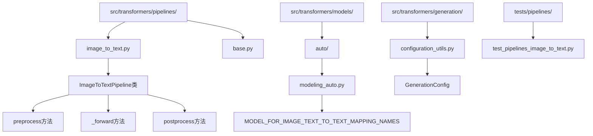
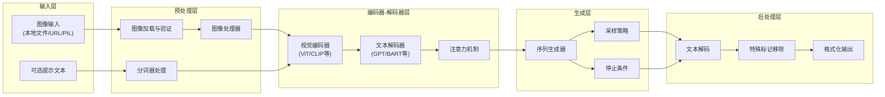
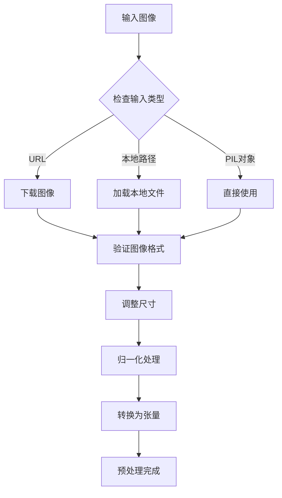
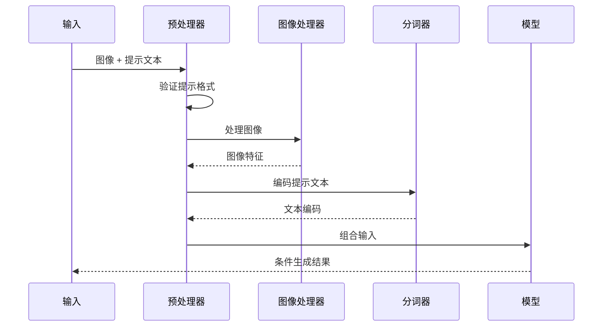
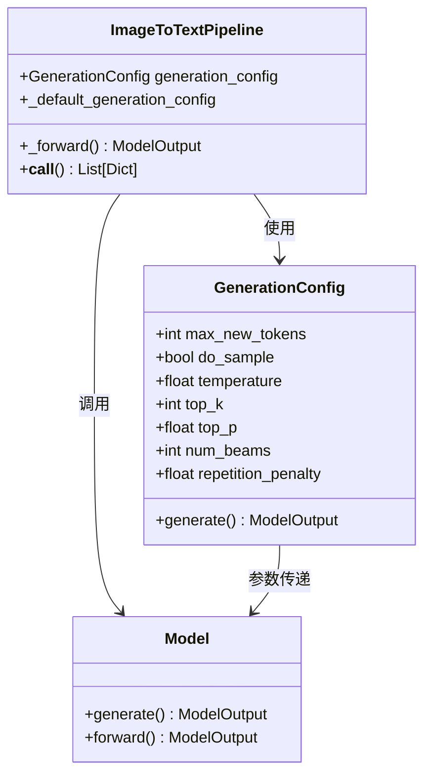
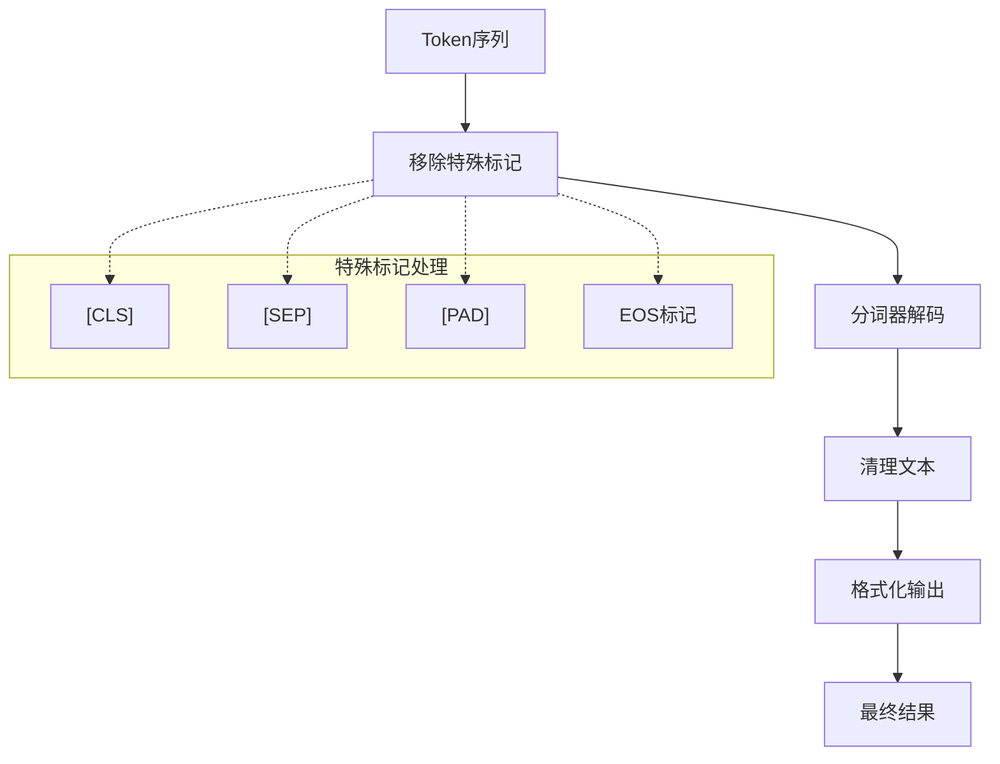
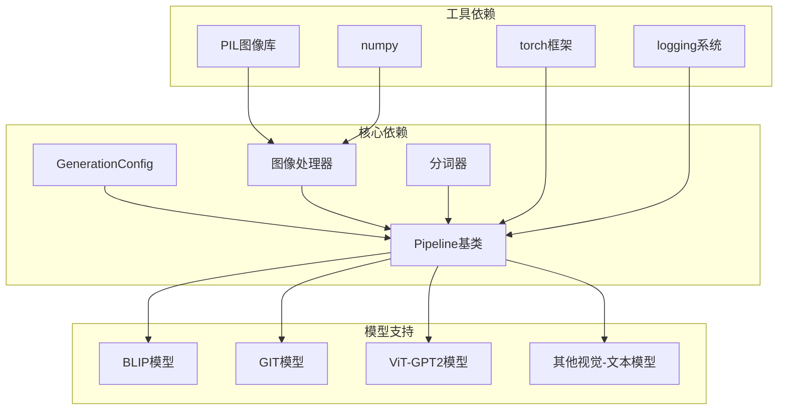

# 图文生成Pipeline

<cite>
**本文档中引用的文件**
- [image_to_text.py](file://src/transformers/pipelines/image_to_text.py)
- [test_pipelines_image_to_text.py](file://tests/pipelines/test_pipelines_image_to_text.py)
- [modeling_auto.py](file://src/transformers/models/auto/modeling_auto.py)
- [configuration_utils.py](file://src/transformers/generation/configuration_utils.py)
- [modeling_blip.py](file://src/transformers/models/blip/modeling_blip.py)
- [modeling_git.py](file://src/transformers/models/git/modeling_git.py)
- [doc.py](file://src/transformers/utils/doc.py)
</cite>

## 目录
1. [简介](#简介)
2. [项目结构](#项目结构)
3. [核心组件](#核心组件)
4. [架构概览](#架构概览)
5. [详细组件分析](#详细组件分析)
6. [依赖关系分析](#依赖关系分析)
7. [性能考虑](#性能考虑)
8. [故障排除指南](#故障排除指南)
9. [结论](#结论)

## 简介

图文生成Pipeline是transformers库中一个强大的功能模块，专门用于将图像转换为自然语言描述。该Pipeline基于编码器-解码器架构，能够理解视觉内容并生成相应的文本描述，广泛应用于图像字幕生成、视觉问答、内容摘要等场景。

本文档深入介绍了ImageToTextPipeline的实现原理、使用方法、配置选项以及最佳实践，为初学者提供清晰的入门指导，同时为高级用户提供性能优化和自定义扩展的方法。

## 项目结构

图文生成Pipeline在transformers库中的组织结构如下：

**图表来源**
- [image_to_text.py](file://src/transformers/pipelines/image_to_text.py#L1-L50)
- [modeling_auto.py](file://src/transformers/models/auto/modeling_auto.py#L1-L100)

**章节来源**
- [image_to_text.py](file://src/transformers/pipelines/image_to_text.py#L1-L230)
- [modeling_auto.py](file://src/transformers/models/auto/modeling_auto.py#L1-L200)

## 核心组件

### ImageToTextPipeline类

ImageToTextPipeline是图文生成的核心类，继承自基础Pipeline类，专门处理图像到文本的转换任务。

#### 主要特性
- **编码器-解码器架构支持**：兼容多种视觉-文本模型
- **多格式输入支持**：本地路径、URL链接、PIL图像对象
- **条件生成**：支持基于提示的图像描述生成
- **批量处理**：高效处理多个图像输入
- **灵活的生成配置**：丰富的生成参数控制

#### 默认配置
- **最大新令牌数**：256（可配置）
- **批处理大小**：默认自动优化
- **设备支持**：CPU和GPU
- **数据类型**：支持float32、float16等

**章节来源**
- [image_to_text.py](file://src/transformers/pipelines/image_to_text.py#L40-L80)

## 架构概览

图文生成Pipeline采用经典的编码器-解码器架构，结合了计算机视觉和自然语言处理的技术优势：

**图表来源**
- [image_to_text.py](file://src/transformers/pipelines/image_to_text.py#L120-L180)
- [modeling_blip.py](file://src/transformers/models/blip/modeling_blip.py#L1-L100)

## 详细组件分析

### 预处理组件

预处理阶段负责将原始图像输入转换为模型可接受的格式：

#### 图像加载与验证

**图表来源**
- [image_to_text.py](file://src/transformers/pipelines/image_to_text.py#L140-L180)

#### 条件生成处理
对于支持条件生成的模型（如BLIP、GIT），预处理会额外处理提示文本：

**图表来源**
- [image_to_text.py](file://src/transformers/pipelines/image_to_text.py#L180-L220)

**章节来源**
- [image_to_text.py](file://src/transformers/pipelines/image_to_text.py#L140-L220)

### 生成组件

生成组件负责调用模型的生成函数，控制生成过程的各项参数：

#### 生成配置管理

**图表来源**
- [configuration_utils.py](file://src/transformers/generation/configuration_utils.py#L100-L200)
- [image_to_text.py](file://src/transformers/pipelines/image_to_text.py#L70-L80)

#### 生成策略对比

| 策略 | 特点 | 适用场景 | 优缺点 |
|------|------|----------|--------|
| 贪婪搜索 | 确定性输出，速度快 | 需要稳定结果的场景 | 可能缺乏多样性 |
| 采样 | 随机性高，多样性好 | 创意生成任务 | 结果可能不稳定 |
| 束搜索 | 平衡确定性和多样性 | 一般推荐 | 计算开销较大 |
| 助手生成 | 利用辅助模型加速 | 大模型推理 | 需要额外模型 |

**章节来源**
- [configuration_utils.py](file://src/transformers/generation/configuration_utils.py#L100-L200)

### 后处理组件

后处理阶段负责将模型输出的token序列转换为可读的文本：

#### 文本解码流程

**图表来源**
- [image_to_text.py](file://src/transformers/pipelines/image_to_text.py#L210-L230)

**章节来源**
- [image_to_text.py](file://src/transformers/pipelines/image_to_text.py#L210-L230)

## 依赖关系分析

图文生成Pipeline的依赖关系体现了transformers库的模块化设计：

**图表来源**
- [image_to_text.py](file://src/transformers/pipelines/image_to_text.py#L15-L35)
- [modeling_auto.py](file://src/transformers/models/auto/modeling_auto.py#L774-L808)

### 支持的模型类型

根据模型映射表，以下模型类型被ImageToTextPipeline支持：

| 模型类型 | 描述 | 典型用途 |
|----------|------|----------|
| BLIP系列 | 视觉-语言预训练模型 | 图像描述生成 |
| GIT模型 | 图像-文本检索模型 | 条件图像生成 |
| ViT-GPT2 | 视觉Transformer+GPT组合 | 基础图像字幕 |
| TrOCR | 文档文本识别 | 扫描件文字提取 |
| Florence2 | 多模态理解模型 | 复杂视觉理解 |

**章节来源**
- [modeling_auto.py](file://src/transformers/models/auto/modeling_auto.py#L774-L808)

## 性能考虑

### 内存优化

1. **批处理优化**：合理设置批处理大小以平衡速度和内存使用
2. **混合精度**：使用float16减少内存占用
3. **梯度检查点**：对于大模型启用梯度检查点
4. **缓存策略**：利用KV缓存加速生成

### 推理加速

1. **模型量化**：使用INT8或FP16量化
2. **编译优化**：利用torch.compile加速
3. **并行处理**：多GPU并行推理
4. **流水线并行**：大型模型的分布式推理

### 生成质量优化

1. **温度调节**：控制生成的随机性
2. **束搜索长度**：平衡质量和速度
3. **重复惩罚**：避免生成重复内容
4. **长度惩罚**：控制输出长度

## 故障排除指南

### 常见问题及解决方案

#### 1. 内存不足错误
**症状**：CUDA out of memory错误
**解决方案**：
- 减少批处理大小
- 使用混合精度训练
- 启用梯度检查点
- 使用CPU卸载

#### 2. 图像格式不支持
**症状**：Unsupported image format错误
**解决方案**：
- 确保图像格式为PNG、JPEG、BMP
- 使用PIL库重新保存图像
- 检查图像文件完整性

#### 3. 生成质量差
**症状**：生成的文本不连贯或无关
**解决方案**：
- 调整温度参数（建议0.7-1.0）
- 增加最大新令牌数
- 使用束搜索替代采样
- 检查输入图像质量

#### 4. 条件生成失败
**症状**：提示文本未被正确使用
**解决方案**：
- 确认模型支持条件生成
- 检查提示文本格式
- 验证模型版本兼容性

### 调试技巧

1. **日志记录**：启用详细日志查看处理步骤
2. **中间结果**：检查预处理后的张量形状
3. **模型检查**：验证模型配置和权重
4. **基准测试**：使用小规模测试验证功能

**章节来源**
- [test_pipelines_image_to_text.py](file://tests/pipelines/test_pipelines_image_to_text.py#L40-L80)

## 结论

图文生成Pipeline是transformers库中一个功能强大且灵活的模块，通过编码器-解码器架构实现了高质量的图像到文本转换。本文档详细介绍了其架构设计、实现原理、使用方法和优化技巧。

### 主要优势
- **易用性**：简洁的API设计，支持多种输入格式
- **灵活性**：丰富的配置选项，适应不同应用场景
- **扩展性**：支持多种模型架构，易于添加新模型
- **性能**：优化的批处理和推理机制

### 应用前景
随着多模态AI技术的发展，图文生成Pipeline将在以下领域发挥更大作用：
- 自动化内容创作
- 辅助视觉障碍用户
- 教育和培训材料生成
- 社交媒体内容自动化

通过本文档的学习，用户可以充分利用图文生成Pipeline的强大功能，构建高质量的多模态应用。