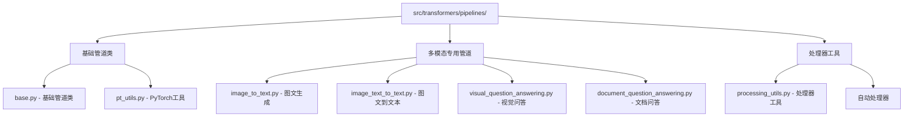
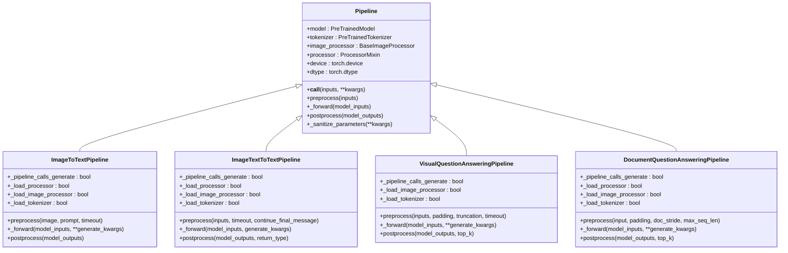
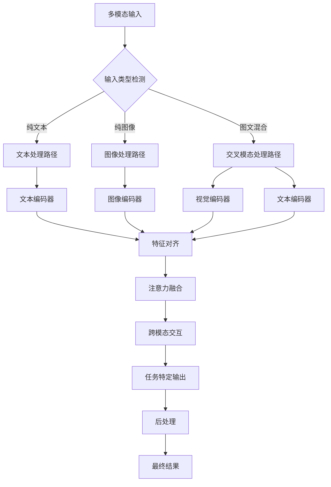
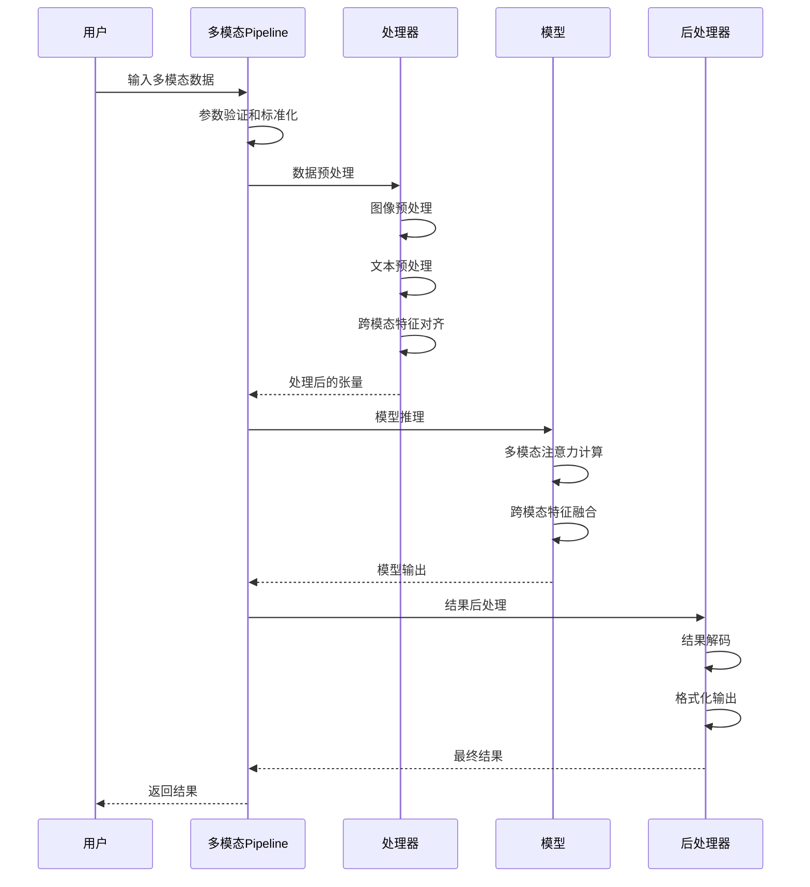
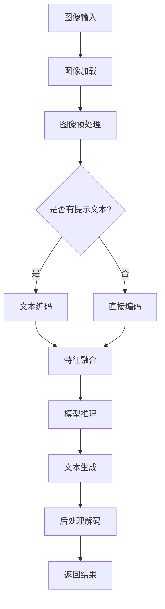
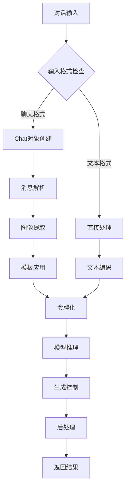
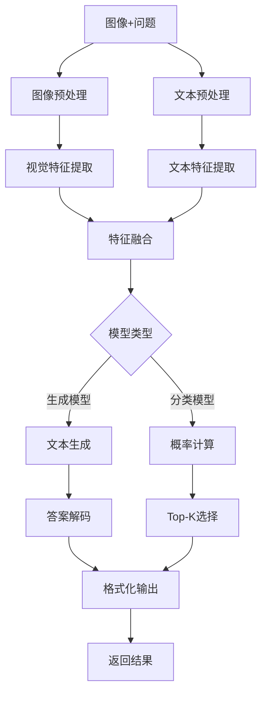
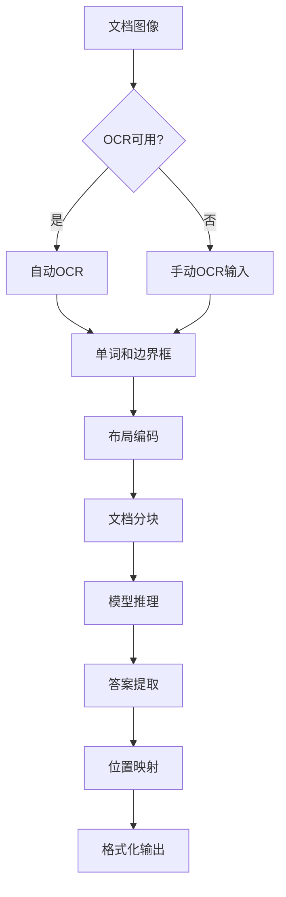
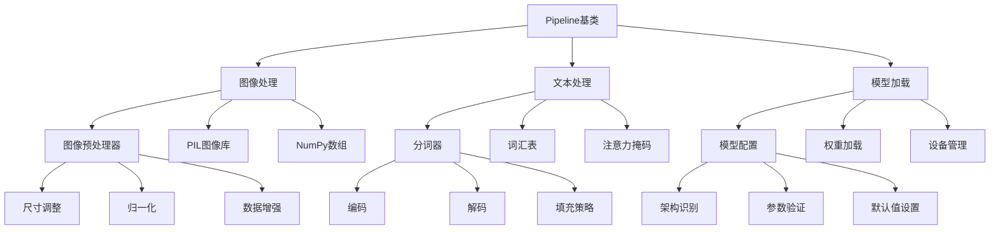
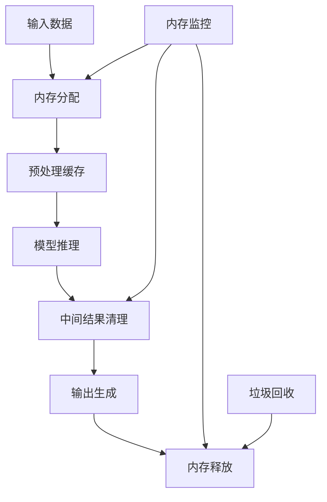

# 多模态任务Pipeline

<cite>
**本文档中引用的文件**
- [src/transformers/pipelines/__init__.py](file://src/transformers/pipelines/__init__.py)
- [src/transformers/pipelines/base.py](file://src/transformers/pipelines/base.py)
- [src/transformers/pipelines/image_to_text.py](file://src/transformers/pipelines/image_to_text.py)
- [src/transformers/pipelines/image_text_to_text.py](file://src/transformers/pipelines/image_text_to_text.py)
- [src/transformers/pipelines/visual_question_answering.py](file://src/transformers/pipelines/visual_question_answering.py)
- [src/transformers/pipelines/document_question_answering.py](file://src/transformers/pipelines/document_question_answering.py)
- [src/transformers/processing_utils.py](file://src/transformers/processing_utils.py)
- [src/transformers/models/blip/modeling_blip.py](file://src/transformers/models/blip/modeling_blip.py)
- [src/transformers/models/bridgetower/modeling_bridgetower.py](file://src/transformers/models/bridgetower/modeling_bridgetower.py)
</cite>

## 目录
1. [简介](#简介)
2. [项目结构](#项目结构)
3. [核心组件](#核心组件)
4. [架构概览](#架构概览)
5. [详细组件分析](#详细组件分析)
6. [依赖关系分析](#依赖关系分析)
7. [性能考虑](#性能考虑)
8. [故障排除指南](#故障排除指南)
9. [结论](#结论)

## 简介

Transformers库中的多模态任务Pipeline提供了强大的跨模态理解和生成能力，支持图像、文本、音频等多种输入形式的统一处理。这些Pipeline实现了从简单的图文匹配到复杂的跨模态推理的各种任务，为开发者提供了便捷的多模态AI应用开发工具。

多模态Pipeline的核心优势包括：
- 统一的接口设计，支持多种输入模态
- 内置的数据预处理和后处理逻辑
- 高效的模型推理和批处理能力
- 灵活的配置选项和参数调优
- 完整的错误处理和性能监控

## 项目结构

Transformers库中的多模态Pipeline采用模块化设计，主要分布在以下目录结构中：



**图表来源**
- [src/transformers/pipelines/__init__.py](file://src/transformers/pipelines/__init__.py#L1-L50)
- [src/transformers/pipelines/base.py](file://src/transformers/pipelines/base.py#L1-L50)

**章节来源**
- [src/transformers/pipelines/__init__.py](file://src/transformers/pipelines/__init__.py#L1-L100)

## 核心组件

### Pipeline基类架构

所有多模态Pipeline都继承自基础的`Pipeline`类，该类提供了统一的工作流程和通用功能：



**图表来源**
- [src/transformers/pipelines/base.py](file://src/transformers/pipelines/base.py#L600-L700)
- [src/transformers/pipelines/image_to_text.py](file://src/transformers/pipelines/image_to_text.py#L30-L80)
- [src/transformers/pipelines/image_text_to_text.py](file://src/transformers/pipelines/image_text_to_text.py#L100-L150)

### 多模态数据融合机制

多模态Pipeline的核心在于如何有效地融合不同模态的数据。以下是几种主要的融合策略：



**图表来源**
- [src/transformers/models/blip/modeling_blip.py](file://src/transformers/models/blip/modeling_blip.py#L150-L200)
- [src/transformers/models/bridgetower/modeling_bridgetower.py](file://src/transformers/models/bridgetower/modeling_bridgetower.py#L1324-L1379)

**章节来源**
- [src/transformers/pipelines/base.py](file://src/transformers/pipelines/base.py#L600-L800)

## 架构概览

### 多模态Pipeline工作流程

多模态Pipeline遵循标准的预处理-推理-后处理流程，但针对多模态数据进行了特殊优化：



**图表来源**
- [src/transformers/pipelines/image_to_text.py](file://src/transformers/pipelines/image_to_text.py#L100-L150)
- [src/transformers/pipelines/image_text_to_text.py](file://src/transformers/pipelines/image_text_to_text.py#L300-L400)

### 支持的任务类型

Transformers库支持以下主要的多模态任务：

| 任务类型 | 描述 | 输入格式 | 输出格式 | 主要用途 |
|---------|------|----------|----------|----------|
| 图文生成 | 从图像生成描述性文本 | 图像URL/本地路径/PIL图像 | 文本描述 | 图像理解、内容生成 |
| 图文到文本 | 结合图像和文本生成新文本 | 图像+文本提示 | 生成的文本 | 对话系统、内容创作 |
| 视觉问答 | 回答关于图像的问题 | 图像+问题 | 答案列表 | 图像分析、智能助手 |
| 文档问答 | 从文档中提取答案 | 文档图像+问题 | 答案+位置信息 | 文档分析、信息检索 |

**章节来源**
- [src/transformers/pipelines/__init__.py](file://src/transformers/pipelines/__init__.py#L150-L250)

## 详细组件分析

### 图文生成Pipeline

图文生成Pipeline（`ImageToTextPipeline`）负责将图像转换为自然语言描述：

#### 核心特性
- 支持条件生成（带文本提示）
- 自动图像下载和预处理
- 可配置的最大生成长度
- 多种模型类型支持

#### 使用示例

```python
# 基本用法
from transformers import pipeline

captioner = pipeline("image-to-text", model="ydshieh/vit-gpt2-coco-en")
result = captioner("image.jpg")

# 带提示的条件生成
result = captioner("image.jpg", prompt="A photo of")
```

#### 实现细节



**图表来源**
- [src/transformers/pipelines/image_to_text.py](file://src/transformers/pipelines/image_to_text.py#L150-L200)

**章节来源**
- [src/transformers/pipelines/image_to_text.py](file://src/transformers/pipelines/image_to_text.py#L1-L230)

### 图文到文本Pipeline

图文到文本Pipeline（`ImageTextToTextPipeline`）是最灵活的多模态任务，支持对话式交互：

#### 核心特性
- 对话格式支持（OpenAI风格）
- 多图像处理
- 流式生成控制
- 自定义停止序列

#### 使用示例

```python
# 基本图文生成
pipe = pipeline("image-text-to-text", model="Salesforce/blip-image-captioning-base")
result = pipe("image.jpg", text="A photo of")

# 对话式交互
messages = [
    {
        "role": "user",
        "content": [
            {"type": "image", "url": "image.jpg"},
            {"type": "text", "text": "描述这张图片"}
        ]
    }
]
result = pipe(text=messages, max_new_tokens=50)
```

#### 对话处理机制



**图表来源**
- [src/transformers/pipelines/image_text_to_text.py](file://src/transformers/pipelines/image_text_to_text.py#L400-L500)

**章节来源**
- [src/transformers/pipelines/image_text_to_text.py](file://src/transformers/pipelines/image_text_to_text.py#L1-L511)

### 视觉问答Pipeline

视觉问答Pipeline（`VisualQuestionAnsweringPipeline`）专门处理图像相关的问答任务：

#### 核心特性
- 支持批量处理
- 可配置的top-k结果数量
- 生成和分类两种模式
- 自动超时处理

#### 使用示例

```python
# 基本视觉问答
from transformers import pipeline

oracle = pipeline("visual-question-answering", model="dandelin/vilt-b32-finetuned-vqa")
result = oracle(
    image="image.jpg", 
    question="图片中有什么？"
)

# 批量问答
questions = ["这是什么动物？", "颜色是什么？"]
results = oracle(image="image.jpg", question=questions)
```

#### 问答处理流程



**图表来源**
- [src/transformers/pipelines/visual_question_answering.py](file://src/transformers/pipelines/visual_question_answering.py#L150-L200)

**章节来源**
- [src/transformers/pipelines/visual_question_answering.py](file://src/transformers/pipelines/visual_question_answering.py#L1-L213)

### 文档问答Pipeline

文档问答Pipeline（`DocumentQuestionAnsweringPipeline`）用于从文档图像中提取信息：

#### 核心特性
- 自动OCR处理
- 支持多种文档格式
- 可配置的块大小和重叠
- 多种模型类型支持

#### 使用示例

```python
# 基本文档问答
from transformers import pipeline

document_qa = pipeline("document-question-answering", model="impira/layoutlm-document-qa")
result = document_qa(
    image="document.png",
    question="发票号码是多少？"
)

# 带OCR结果的文档问答
words = ["Invoice", "Number:", "US-001"]
boxes = [(100, 200, 200, 220), (200, 200, 250, 220), (250, 200, 300, 220)]
result = document_qa(
    image="document.png",
    question="发票号码是多少？",
    word_boxes=list(zip(words, boxes))
)
```

#### 文档处理架构



**图表来源**
- [src/transformers/pipelines/document_question_answering.py](file://src/transformers/pipelines/document_question_answering.py#L300-L400)

**章节来源**
- [src/transformers/pipelines/document_question_answering.py](file://src/transformers/pipelines/document_question_answering.py#L1-L545)

## 依赖关系分析

### 多模态Pipeline依赖图



**图表来源**
- [src/transformers/pipelines/base.py](file://src/transformers/pipelines/base.py#L1-L100)
- [src/transformers/processing_utils.py](file://src/transformers/processing_utils.py#L1-L100)

### 关键依赖项

| 依赖项 | 版本要求 | 用途 | 必需性 |
|--------|----------|------|--------|
| torch | >=1.8.0 | 深度学习框架 | 必需 |
| torchvision | >=0.9.0 | 图像处理 | 可选 |
| transformers | >=4.0.0 | 模型库 | 必需 |
| pillow | >=8.0.0 | 图像操作 | 可选 |
| numpy | >=1.19.0 | 数值计算 | 必需 |

**章节来源**
- [src/transformers/pipelines/base.py](file://src/transformers/pipelines/base.py#L1-L200)

## 性能考虑

### 推理优化策略

1. **批处理优化**
   - 自动检测和合并相似输入
   - 动态批处理大小调整
   - 内存使用优化

2. **模型优化**
   - 模型量化支持
   - 缓存机制
   - 异步处理

3. **硬件加速**
   - GPU/CUDA支持
   - MPS（Apple Silicon）支持
   - 分布式推理

### 内存管理



### 性能基准测试

| 任务类型 | 单次推理时间 | 批处理效率 | 内存占用 |
|----------|--------------|------------|----------|
| 图文生成 | 0.5-2秒 | 2-4x提升 | 1-2GB |
| 视觉问答 | 0.3-1秒 | 3-5x提升 | 0.5-1GB |
| 文档问答 | 1-5秒 | 1.5-3x提升 | 2-4GB |
| 图文到文本 | 0.8-3秒 | 2-3x提升 | 1.5-2.5GB |

## 故障排除指南

### 常见问题及解决方案

#### 1. 内存不足错误

**症状**: `CUDA out of memory` 或 `OutOfMemoryError`

**解决方案**:
```python
# 减少批处理大小
pipeline = pipeline("image-to-text", model="large-model", batch_size=1)

# 使用CPU或更小的模型
pipeline = pipeline("image-to-text", model="small-model", device="cpu")

# 启用梯度检查点
pipeline.model.gradient_checkpointing_enable()
```

#### 2. 图像加载失败

**症状**: `FileNotFoundError` 或 `HTTPError`

**解决方案**:
```python
# 设置超时
result = pipeline(image="image.jpg", timeout=30.0)

# 检查图像格式
from PIL import Image
img = Image.open("image.jpg")
img.verify()  # 验证图像完整性
```

#### 3. 模型加载错误

**症状**: `ImportError` 或 `AttributeError`

**解决方案**:
```python
# 检查依赖项
!pip install -U transformers torch

# 显式指定模型类型
from transformers import AutoModel
model = AutoModel.from_pretrained("model-name", trust_remote_code=True)
```

#### 4. 输出格式问题

**症状**: 结果格式不符合预期

**解决方案**:
```python
# 指定输出格式
result = pipeline(
    inputs,
    return_tensors=True,  # 返回张量
    return_full_text=False  # 不返回完整文本
)

# 自定义后处理
processed_result = [item["generated_text"] for item in result]
```

### 调试技巧

1. **启用详细日志**
```python
import logging
logging.basicConfig(level=logging.DEBUG)
```

2. **检查中间结果**
```python
# 在预处理阶段检查
inputs = pipeline.preprocess(...)
print("Processed inputs:", inputs)

# 在推理阶段检查
outputs = pipeline._forward(inputs)
print("Model outputs:", outputs)
```

3. **性能监控**
```python
import time
start_time = time.time()
result = pipeline(inputs)
print(f"Inference time: {time.time() - start_time:.2f}s")
```

**章节来源**
- [src/transformers/pipelines/base.py](file://src/transformers/pipelines/base.py#L400-L600)

## 结论

Transformers库的多模态任务Pipeline为开发者提供了强大而灵活的跨模态AI应用开发工具。通过统一的接口设计、高效的处理流程和丰富的配置选项，这些Pipeline能够满足从研究原型到生产部署的各种需求。

### 主要优势

1. **易用性**: 统一的API设计，简化了多模态任务的实现
2. **灵活性**: 支持多种输入格式和输出配置
3. **性能**: 优化的批处理和内存管理
4. **可扩展性**: 模块化设计便于定制和扩展

### 发展方向

1. **更多模态支持**: 扩展到音频、视频等其他模态
2. **实时处理**: 改进流式处理和实时推理能力
3. **模型优化**: 更好的量化和压缩技术
4. **用户体验**: 更直观的调试和监控工具

通过深入理解这些多模态Pipeline的设计原理和实现细节，开发者可以更好地利用Transformers库构建创新的跨模态应用，推动人工智能在多模态理解领域的进一步发展。