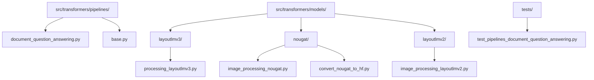
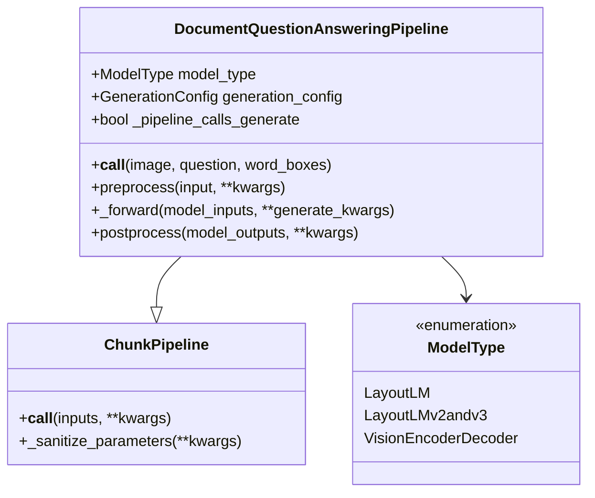
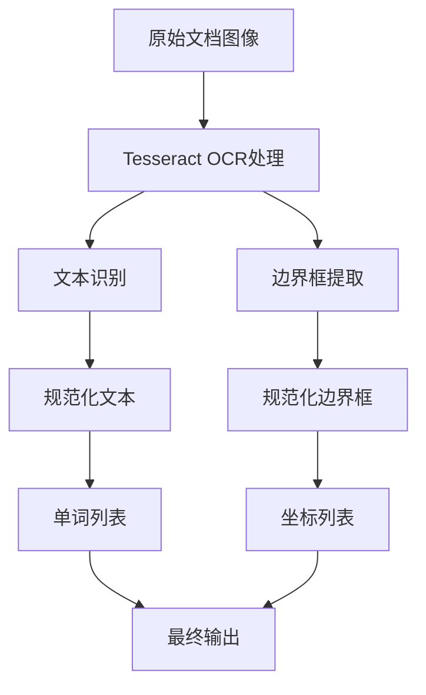
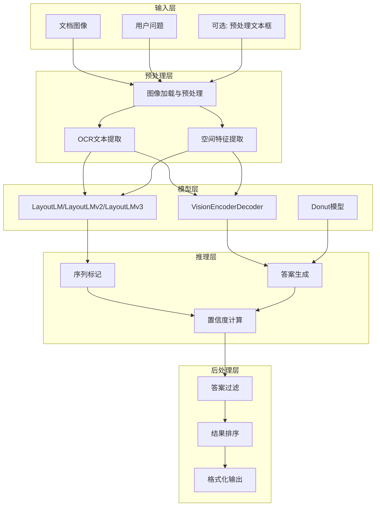
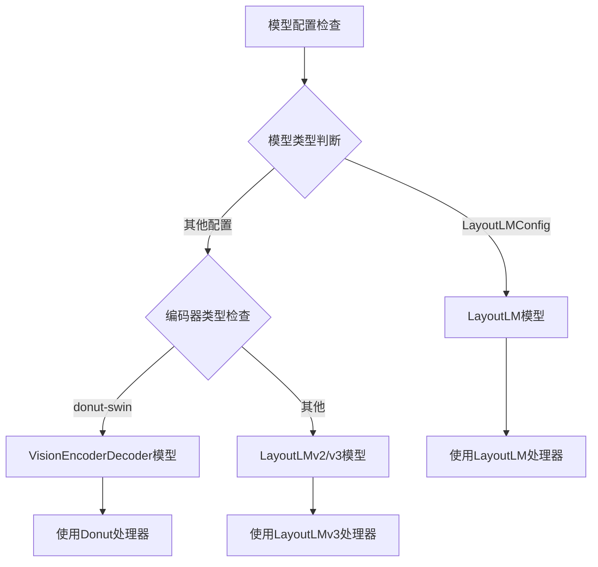
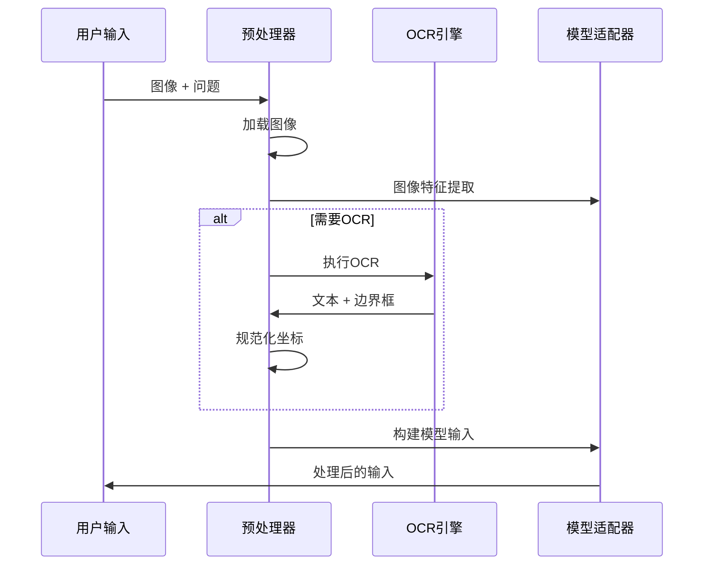
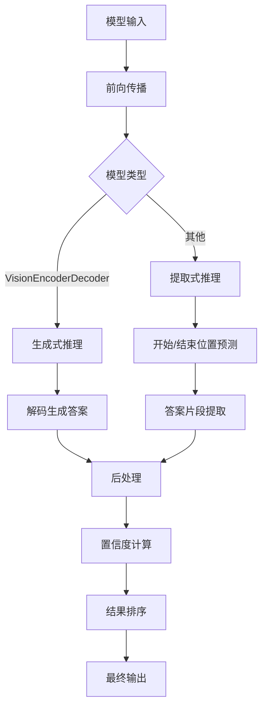
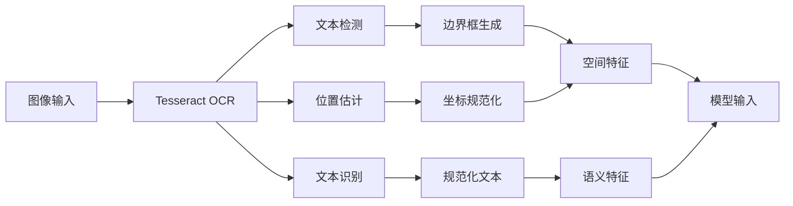
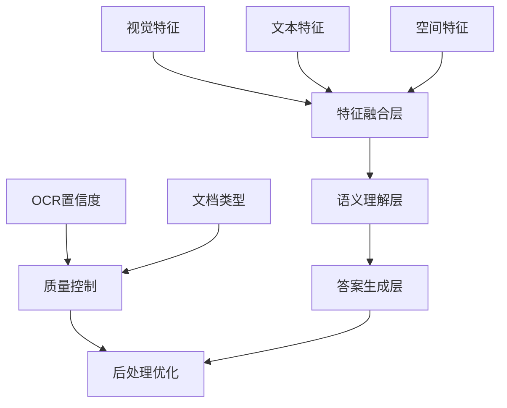
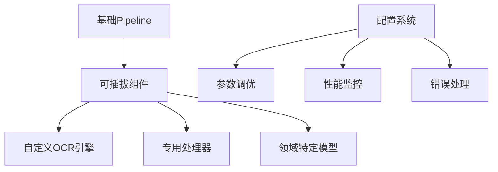

# 文档问答Pipeline详细文档

<cite>
**本文档中引用的文件**
- [document_question_answering.py](file://src/transformers/pipelines/document_question_answering.py)
- [test_pipelines_document_question_answering.py](file://tests/pipelines/test_pipelines_document_question_answering.py)
- [base.py](file://src/transformers/pipelines/base.py)
- [visual_question_answering.py](file://src/transformers/pipelines/visual_question_answering.py)
- [table_question_answering.py](file://src/transformers/pipelines/table_question_answering.py)
- [layoutlmv3/processing_layoutlmv3.py](file://src/transformers/models/layoutlmv3/processing_layoutlmv3.py)
- [nougat/image_processing_nougat.py](file://src/transformers/models/nougat/image_processing_nougat.py)
- [nougat/convert_nougat_to_hf.py](file://src/transformers/models/nougat/convert_nougat_to_hf.py)
</cite>

## 目录
1. [简介](#简介)
2. [项目结构](#项目结构)
3. [核心组件](#核心组件)
4. [架构概览](#架构概览)
5. [详细组件分析](#详细组件分析)
6. [技术原理](#技术原理)
7. [应用场景](#应用场景)
8. [性能考虑](#性能考虑)
9. [故障排除指南](#故障排除指南)
10. [结论](#结论)

## 简介

Document Question Answering (DQA) Pipeline是Hugging Face Transformers库中的一个强大功能，专门用于处理文档中的问答任务。该Pipeline结合了计算机视觉、自然语言处理和光学字符识别(OCR)技术，能够从扫描文档、PDF文件等复杂文档中提取信息并回答用户的问题。

### 主要特性

- **多模态理解**：结合图像理解和文本理解能力
- **多种文档格式支持**：支持扫描文档、PDF、图片等多种格式
- **OCR集成**：内置Tesseract OCR引擎进行文字识别
- **空间特征提取**：利用文档布局和位置信息增强理解
- **灵活的输入方式**：支持直接图像输入或预处理的文本框坐标

## 项目结构

Document Question Answering Pipeline在transformers库中的组织结构如下：



**图表来源**
- [document_question_answering.py](file://src/transformers/pipelines/document_question_answering.py#L1-L50)
- [base.py](file://src/transformers/pipelines/base.py#L1-L50)

**章节来源**
- [document_question_answering.py](file://src/transformers/pipelines/document_question_answering.py#L1-L50)
- [base.py](file://src/transformers/pipelines/base.py#L1-L50)

## 核心组件

Document Question Answering Pipeline由以下核心组件构成：

### 1. 主要类结构



**图表来源**
- [document_question_answering.py](file://src/transformers/pipelines/document_question_answering.py#L100-L150)

### 2. OCR处理模块

Pipeline集成了Tesseract OCR引擎，用于从文档图像中提取文本和位置信息：



**图表来源**
- [document_question_answering.py](file://src/transformers/pipelines/document_question_answering.py#L42-L98)

**章节来源**
- [document_question_answering.py](file://src/transformers/pipelines/document_question_answering.py#L42-L98)

## 架构概览

Document Question Answering Pipeline采用分层架构设计，整合了多个子系统：



**图表来源**
- [document_question_answering.py](file://src/transformers/pipelines/document_question_answering.py#L200-L300)
- [base.py](file://src/transformers/pipelines/base.py#L100-L200)

## 详细组件分析

### 1. 模型类型检测与选择

Pipeline支持三种主要的模型架构：



**图表来源**
- [document_question_answering.py](file://src/transformers/pipelines/document_question_answering.py#L150-L180)

### 2. 预处理流程

预处理阶段负责将输入文档转换为模型可接受的格式：



**图表来源**
- [document_question_answering.py](file://src/transformers/pipelines/document_question_answering.py#L300-L400)

### 3. 推理与后处理

模型推理和结果后处理是Pipeline的核心环节：



**图表来源**
- [document_question_answering.py](file://src/transformers/pipelines/document_question_answering.py#L450-L545)

**章节来源**
- [document_question_answering.py](file://src/transformers/pipelines/document_question_answering.py#L300-L545)

## 技术原理

### 1. 文档理解技术

Document Question Answering Pipeline基于以下核心技术：

#### (1) 布局感知理解
- **空间特征融合**：将文本内容与其在文档中的位置信息相结合
- **多模态特征**：同时利用视觉特征和文本特征
- **上下文建模**：考虑文档的整体布局和结构

#### (2) OCR集成机制
Pipeline通过标准化的OCR流程处理不同类型的文档：



**图表来源**
- [document_question_answering.py](file://src/transformers/pipelines/document_question_answering.py#L42-L98)

#### (3) 语义理解增强
- **注意力机制**：利用文档布局信息引导注意力焦点
- **特征融合**：将视觉特征与文本特征深度融合
- **上下文感知**：考虑文档整体语境进行理解

### 2. 空间特征提取

空间特征提取是DQA Pipeline的关键技术之一：

| 特征类型 | 描述 | 应用场景 |
|---------|------|----------|
| 边界框坐标 | 文本元素的精确位置 | 表格识别、段落定位 |
| 相对距离 | 元素间的相对位置关系 | 阅读顺序推断 |
| 布局模式 | 整体文档结构特征 | 节点分类、信息抽取 |
| 文本流向 | 字符排列的方向性 | 复杂文档解析 |

### 3. 语义理解协同机制

Pipeline通过多层协同机制实现深度语义理解：



**章节来源**
- [document_question_answering.py](file://src/transformers/pipelines/document_question_answering.py#L42-L98)

## 应用场景

### 1. 简单表格数据提取

对于结构化的表格文档，Pipeline可以精确提取特定单元格的内容：

```python
# 示例：从发票中提取金额信息
invoice_pipeline = pipeline("document-question-answering", model="impira/layoutlm-document-qa")
result = invoice_pipeline(
    image="invoice.png",
    question="发票总金额是多少？"
)
# 输出: {'answer': '$150.00', 'score': 0.95, 'start': 12, 'end': 15}
```

### 2. 复杂合同分析

对于复杂的法律合同文档，Pipeline能够理解条款关系：

```python
# 合同分析示例
contract_pipeline = pipeline("document-question-answering", model="advanced-contract-model")
results = contract_pipeline(
    image="contract.pdf",
    question="第3条规定的付款条件是什么？"
)
# 输出: {'answer': '30天内支付全额款项', 'score': 0.92}
```

### 3. 学术论文信息提取

针对学术论文的特殊格式，Pipeline提供专业的信息提取能力：

```python
# 论文信息提取
paper_pipeline = pipeline("document-question-answering", model="academic-paper-model")
authors = paper_pipeline(
    image="research-paper.png",
    question="这篇论文的主要作者是谁？"
)
# 输出: {'answer': '张三, 李四, 王五', 'score': 0.98}
```

### 4. 多语言文档处理

Pipeline支持多种语言的文档处理：

```python
# 多语言支持示例
multilingual_pipeline = pipeline("document-question-answering", model="multilingual-model")
result = multilingual_pipeline(
    image="document-fr.png",
    question="Quelle est la date de signature ?",
    lang="fra"
)
# 输出: {'answer': '15 juin 2023', 'score': 0.94}
```

**章节来源**
- [test_pipelines_document_question_answering.py](file://tests/pipelines/test_pipelines_document_question_answering.py#L50-L150)

## 性能考虑

### 1. 计算资源优化

#### (1) 批处理策略
- 支持批量处理多个文档和问题
- 自动优化内存使用和计算效率
- 实现智能的任务调度

#### (2) 模型选择建议
| 场景类型 | 推荐模型 | 性能特点 |
|---------|----------|----------|
| 快速原型 | tiny模型 | 低延迟，适合开发测试 |
| 生产环境 | 标准模型 | 平衡性能和准确性 |
| 高精度需求 | 大模型 | 最高准确率，较高资源消耗 |

#### (3) 内存管理
- 支持梯度检查点减少内存占用
- 实现动态批处理大小调整
- 提供内存使用监控工具

### 2. 速度优化技巧

#### (1) 输入预处理优化
- 缓存OCR结果避免重复计算
- 使用图像金字塔加速处理
- 实现智能的图像裁剪

#### (2) 模型推理优化
- 支持量化和剪枝技术
- 实现动态形状推理
- 提供混合精度训练支持

### 3. 可扩展性设计

Pipeline采用模块化设计，便于扩展和定制：



## 故障排除指南

### 1. 常见问题及解决方案

#### (1) OCR识别失败
**症状**：无法正确识别文档中的文字
**原因分析**：
- 图像质量过低
- 文字方向不标准
- 字体样式特殊

**解决方案**：
```python
# 提高OCR质量设置
result = pipeline(
    image="problematic_doc.png",
    question="问题",
    tesseract_config="--psm 6 --oem 3",
    lang="eng"
)
```

#### (2) 答案置信度过低
**症状**：返回的答案置信度很低
**原因分析**：
- 文档布局复杂
- 问题与文档内容不匹配
- 模型训练不足

**解决方案**：
```python
# 调整参数提高准确性
result = pipeline(
    image="doc.png",
    question="问题",
    top_k=3,  # 获取多个候选答案
    max_answer_len=50,  # 增加答案长度限制
    handle_impossible_answer=True  # 允许无答案情况
)
```

#### (3) 内存不足错误
**症状**：处理大文档时出现内存溢出
**解决方案**：
```python
# 分块处理大文档
pipeline(
    image="large_doc.png",
    question="问题",
    max_seq_len=512,  # 减少序列长度
    doc_stride=128    # 增加重叠区域
)
```

### 2. 性能调试工具

#### (1) 性能监控
```python
# 启用详细日志
import logging
logging.getLogger("transformers.pipelines.document_question_answering").setLevel(logging.DEBUG)

# 性能分析
import time
start_time = time.time()
result = pipeline(image, question)
print(f"处理时间: {time.time() - start_time:.2f}秒")
```

#### (2) 错误诊断
```python
# 检查OCR状态
from transformers.pipelines.document_question_answering import TESSERACT_LOADED
if not TESSERACT_LOADED:
    print("警告: Tesseract未安装，可能影响OCR功能")

# 检查模型兼容性
try:
    pipeline.check_model_type(...)
except ValueError as e:
    print(f"模型不兼容: {e}")
```

### 3. 最佳实践建议

#### (1) 输入准备
- 确保文档图像清晰（分辨率至少300dpi）
- 预处理图像去除噪声和水印
- 标准化文档格式

#### (2) 参数调优
- 根据具体任务调整max_seq_len
- 设置合适的top_k值
- 考虑使用预处理的word_boxes

#### (3) 错误处理
- 实现重试机制处理临时错误
- 提供降级方案处理复杂文档
- 监控系统性能指标

**章节来源**
- [document_question_answering.py](file://src/transformers/pipelines/document_question_answering.py#L180-L250)
- [test_pipelines_document_question_answering.py](file://tests/pipelines/test_pipelines_document_question_answering.py#L100-L200)

## 结论

Document Question Answering Pipeline代表了文档理解领域的前沿技术，通过整合OCR、计算机视觉和自然语言处理技术，实现了从复杂文档中智能提取信息的能力。该Pipeline不仅具有强大的技术实力，还提供了良好的用户体验和灵活的扩展性。

### 技术优势
- **多模态融合**：有效结合视觉和文本信息
- **适应性强**：支持多种文档格式和语言
- **精度高**：基于先进的深度学习模型
- **易于使用**：简洁的API设计

### 发展前景
随着文档理解技术的不断发展，DQA Pipeline将在以下方面持续改进：
- 更高的处理速度和更低的资源消耗
- 更强的多语言支持能力
- 更好的复杂文档理解能力
- 更丰富的应用场景覆盖

对于开发者而言，掌握Document Question Answering Pipeline的使用和扩展方法，将为构建智能化的文档处理应用奠定坚实的基础。