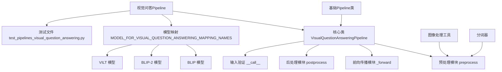
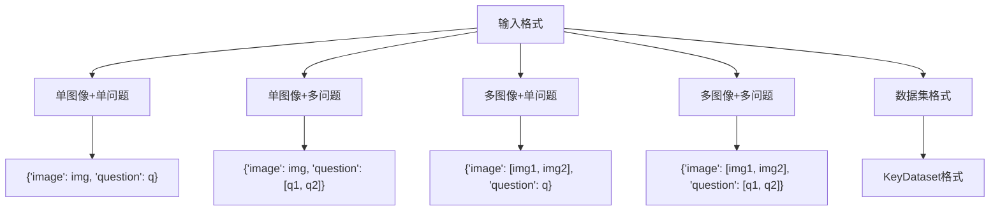
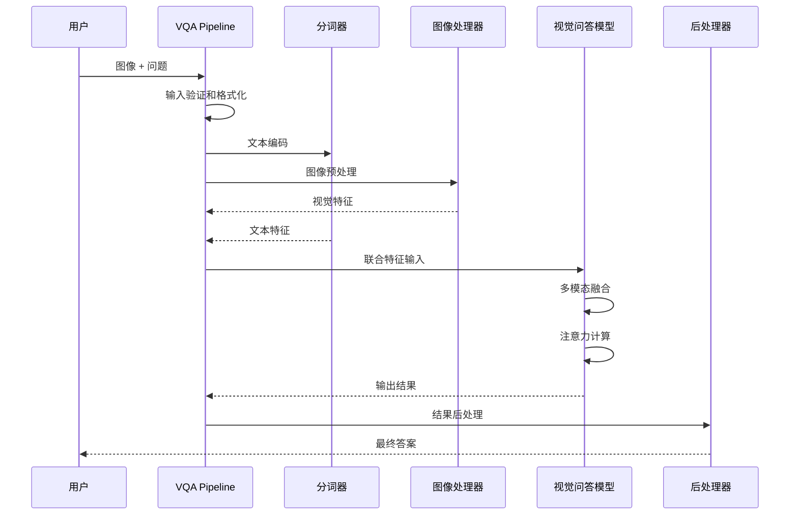
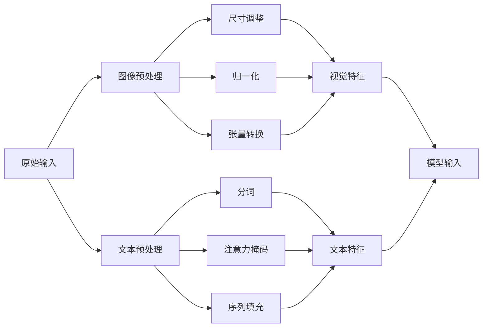
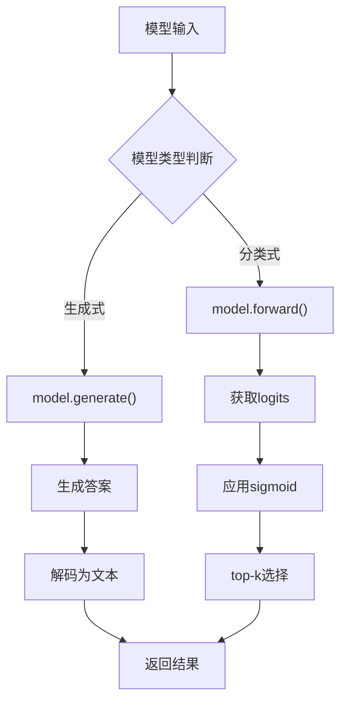
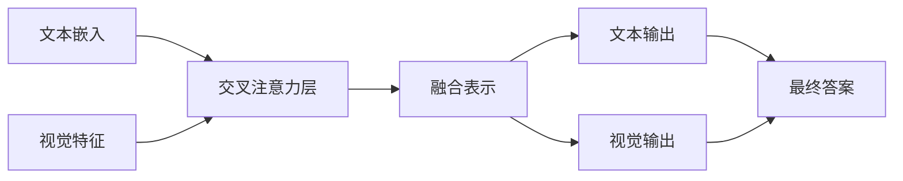
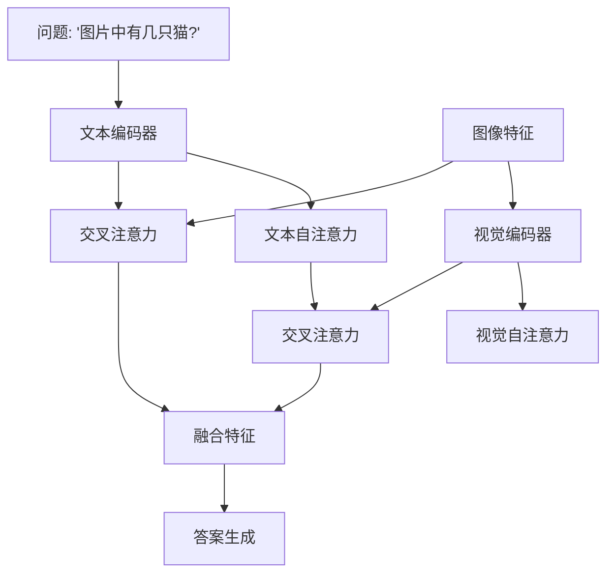
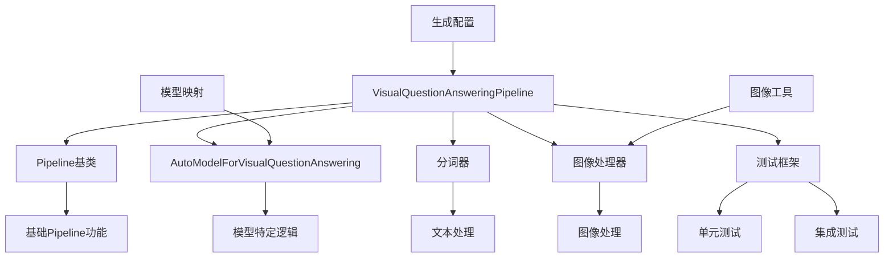

# 视觉问答Pipeline详细文档

<cite>
**本文档中引用的文件**
- [visual_question_answering.py](file://src/transformers/pipelines/visual_question_answering.py)
- [modeling_auto.py](file://src/transformers/models/auto/modeling_auto.py)
- [test_pipelines_visual_question_answering.py](file://tests/pipelines/test_pipelines_visual_question_answering.py)
- [base.py](file://src/transformers/pipelines/base.py)
- [modeling_blip.py](file://src/transformers/models/blip/modeling_blip.py)
- [modeling_vilt.py](file://src/transformers/models/vilt/modeling_vilt.py)
- [modeling_lxmert.py](file://src/transformers/models/lxmert/modeling_lxmert.py)
- [modeling_bridgetower.py](file://src/transformers/models/bridgetower/modeling_bridgetower.py)
</cite>

## 目录
1. [简介](#简介)
2. [项目结构](#项目结构)
3. [核心组件](#核心组件)
4. [架构概览](#架构概览)
5. [详细组件分析](#详细组件分析)
6. [依赖关系分析](#依赖关系分析)
7. [性能考虑](#性能考虑)
8. [故障排除指南](#故障排除指南)
9. [结论](#结论)

## 简介

视觉问答（Visual Question Answering, VQA）Pipeline是transformers库中专门用于处理图像和文本联合推理任务的组件。该Pipeline通过多模态融合机制，将视觉特征提取与语言理解相结合，实现对图像内容的理解和回答相关问题的能力。

视觉问答系统的核心挑战在于：
- **多模态数据融合**：如何有效地结合视觉和语言两种不同模态的信息
- **注意力机制**：在复杂的图像场景中定位与问题相关的视觉区域
- **推理能力**：从视觉特征中推断出抽象的概念和关系
- **泛化能力**：处理各种类型的图像和多样化的问题形式

## 项目结构

视觉问答Pipeline在transformers库中的组织结构如下：

**图表来源**
- [visual_question_answering.py](file://src/transformers/pipelines/visual_question_answering.py#L1-L50)
- [modeling_auto.py](file://src/transformers/models/auto/modeling_auto.py#L1414-L1420)

**章节来源**
- [visual_question_answering.py](file://src/transformers/pipelines/visual_question_answering.py#L1-L213)
- [modeling_auto.py](file://src/transformers/models/auto/modeling_auto.py#L1414-L1420)

## 核心组件

### VisualQuestionAnsweringPipeline 类

VisualQuestionAnsweringPipeline是视觉问答任务的主要入口点，继承自基础Pipeline类，提供了完整的多模态推理流程。

#### 主要特性

1. **多模态输入支持**：同时接受图像和文本作为输入
2. **灵活的调用方式**：支持多种输入格式和批量处理
3. **生成式和分类式输出**：根据模型类型自动选择合适的输出格式
4. **默认配置管理**：提供合理的默认参数设置

#### 输入格式支持

**图表来源**
- [visual_question_answering.py](file://src/transformers/pipelines/visual_question_answering.py#L120-L150)

**章节来源**
- [visual_question_answering.py](file://src/transformers/pipelines/visual_question_answering.py#L18-L120)

## 架构概览

视觉问答Pipeline的整体架构展示了从输入到输出的完整处理流程：

**图表来源**
- [visual_question_answering.py](file://src/transformers/pipelines/visual_question_answering.py#L150-L213)

## 详细组件分析

### 预处理模块

预处理阶段负责将原始输入转换为模型可接受的格式：

#### 图像预处理
- **图像加载**：支持本地路径、URL和PIL图像对象
- **尺寸调整**：根据模型要求调整图像尺寸
- **归一化**：应用标准的图像归一化操作
- **张量转换**：转换为PyTorch张量格式

#### 文本预处理
- **分词处理**：使用相应的分词器处理问题文本
- **注意力掩码**：生成适当的注意力掩码
- **序列填充**：处理不同长度的文本序列

**图表来源**
- [visual_question_answering.py](file://src/transformers/pipelines/visual_question_answering.py#L150-L170)

**章节来源**
- [visual_question_answering.py](file://src/transformers/pipelines/visual_question_answering.py#L150-L170)

### 前向传播模块

前向传播模块根据模型类型执行不同的推理策略：

#### 生成式模型（如BLIP-2）
- 使用`model.generate()`方法生成答案
- 支持各种生成配置参数
- 处理序列到序列的生成任务

#### 分类式模型（如VILT）
- 执行前向传播获取logits
- 应用sigmoid激活函数
- 进行top-k预测

**图表来源**
- [visual_question_answering.py](file://src/transformers/pipelines/visual_question_answering.py#L172-L190)

**章节来源**
- [visual_question_answering.py](file://src/transformers/pipelines/visual_question_answering.py#L172-L190)

### 后处理模块

后处理模块负责将模型输出转换为用户友好的格式：

#### 生成式模型的后处理
- **答案解码**：将生成的token序列解码为自然语言
- **特殊标记移除**：清理生成文本中的特殊标记
- **格式标准化**：确保输出格式的一致性

#### 分类式模型的后处理
- **概率计算**：将logits转换为概率分布
- **排序选择**：按置信度排序并选择top-k结果
- **标签映射**：将类别索引转换为人类可读的标签

**章节来源**
- [visual_question_answering.py](file://src/transformers/pipelines/visual_question_answering.py#L192-L213)

### 多模态融合机制

视觉问答系统的核心在于多模态融合，以下是几种主要的融合策略：

#### 交叉注意力机制
交叉注意力允许模型在处理文本时关注相关的视觉区域，在处理视觉特征时关注相关的文本概念。

**图表来源**
- [modeling_lxmert.py](file://src/transformers/models/lxmert/modeling_lxmert.py#L386-L424)

#### 特征拼接
简单的特征拼接方法，将视觉和文本特征直接连接在一起。

#### 加权融合
通过学习的权重动态调整视觉和文本特征的重要性。

**章节来源**
- [modeling_lxmert.py](file://src/transformers/models/lxmert/modeling_lxmert.py#L386-L424)
- [modeling_bridgetower.py](file://src/transformers/models/bridgetower/modeling_bridgetower.py#L1324-L1411)

### 注意力机制的工作原理

注意力机制是视觉问答系统的关键组件，它帮助模型聚焦于与当前问题最相关的视觉区域：

#### 自注意力机制
- **文本自注意力**：理解问题内部的语法和语义关系
- **视觉自注意力**：捕获图像内部的空间关系

#### 交叉注意力机制
- **文本到视觉**：文本特征关注相关的视觉区域
- **视觉到文本**：视觉特征关注相关的文本概念

**图表来源**
- [modeling_lxmert.py](file://src/transformers/models/lxmert/modeling_lxmert.py#L386-L424)

**章节来源**
- [modeling_lxmert.py](file://src/transformers/models/lxmert/modeling_lxmert.py#L386-L424)

### 答案生成策略

视觉问答系统采用多种策略生成最终答案：

#### 生成式策略
- **序列到序列生成**：直接生成自然语言答案
- **约束生成**：使用提示模板引导生成过程
- **多样性控制**：生成多个候选答案

#### 分类式策略
- **多标签分类**：预测所有可能的答案类别
- **置信度排序**：按置信度选择最佳答案
- **阈值过滤**：移除低置信度的预测

**章节来源**
- [visual_question_answering.py](file://src/transformers/pipelines/visual_question_answering.py#L192-L213)

## 依赖关系分析

视觉问答Pipeline的依赖关系展现了其在transformers生态系统中的位置：

**图表来源**
- [visual_question_answering.py](file://src/transformers/pipelines/visual_question_answering.py#L1-L20)
- [modeling_auto.py](file://src/transformers/models/auto/modeling_auto.py#L1414-L1420)

**章节来源**
- [visual_question_answering.py](file://src/transformers/pipelines/visual_question_answering.py#L1-L20)
- [modeling_auto.py](file://src/transformers/models/auto/modeling_auto.py#L1414-L1420)

## 性能考虑

### 内存优化
- **批处理策略**：合理设置批次大小以平衡内存使用和处理速度
- **梯度检查点**：对于大模型使用梯度检查点减少内存占用
- **混合精度**：使用FP16或BF16降低内存需求

### 计算优化
- **模型量化**：支持INT8和FP16量化
- **模型并行**：大型模型可以使用模型并行
- **缓存机制**：缓存常用的视觉特征

### 推理加速
- **KV缓存**：对于生成式模型使用键值缓存
- **并行处理**：并行处理多个图像-问题对
- **硬件加速**：利用GPU、TPU等专用硬件

## 故障排除指南

### 常见问题及解决方案

#### 1. 内存不足错误
**症状**：CUDA out of memory错误
**解决方案**：
- 减少批次大小
- 使用梯度累积
- 启用混合精度训练
- 使用CPU卸载

#### 2. 输入格式错误
**症状**：TypeError或ValueError
**解决方案**：
- 确保图像路径有效
- 验证问题文本格式
- 检查数据类型匹配

#### 3. 模型加载失败
**症状**：ImportError或FileNotFoundError
**解决方案**：
- 检查模型名称拼写
- 确认网络连接
- 验证模型权限

#### 4. 输出质量差
**症状**：答案不准确或不相关
**解决方案**：
- 调整top_k参数
- 使用更高质量的模型
- 优化输入预处理

### 性能调优建议

#### 模型选择
- **小模型**：适合快速原型开发（如Tiny模型）
- **中等模型**：平衡性能和速度（如ViLT）
- **大模型**：追求最高准确性（如BLIP-2）

#### 参数调优
- **max_new_tokens**：控制生成答案的最大长度
- **top_k**：限制候选答案数量
- **temperature**：影响生成的随机性

#### 硬件配置
- **GPU内存**：至少8GB显存
- **CPU核心**：多核处理器提升并行处理
- **存储空间**：足够的磁盘空间存储模型文件

**章节来源**
- [test_pipelines_visual_question_answering.py](file://tests/pipelines/test_pipelines_visual_question_answering.py#L1-L248)

## 结论

视觉问答Pipeline代表了多模态AI技术的重要进展，它成功地将计算机视觉和自然语言处理结合起来，实现了对复杂图像场景的理解和推理。通过深入分析transformers库中的实现，我们可以看到：

### 技术优势
1. **模块化设计**：清晰的组件分离便于维护和扩展
2. **灵活性**：支持多种模型和输入格式
3. **易用性**：简洁的API设计降低了使用门槛
4. **可扩展性**：良好的架构支持新模型的接入

### 应用前景
视觉问答技术在以下领域具有广阔的应用前景：
- **智能客服**：理解用户上传的图片并提供相关服务
- **教育辅助**：帮助学生理解复杂的图表和图像资料
- **无障碍技术**：为视障用户提供图像描述服务
- **内容审核**：自动检测和分类图像内容

### 发展方向
未来的发展可能包括：
- **更强大的多模态融合**：结合更多模态的信息
- **更强的推理能力**：支持更复杂的逻辑推理
- **更好的泛化能力**：在未见过的场景中表现更好
- **更低的资源需求**：在边缘设备上高效运行

通过本文档的详细介绍，开发者可以深入理解视觉问答Pipeline的工作原理，并能够有效地使用和扩展这一强大的工具。无论是初学者还是高级用户，都能从中获得有价值的知识和实践经验。