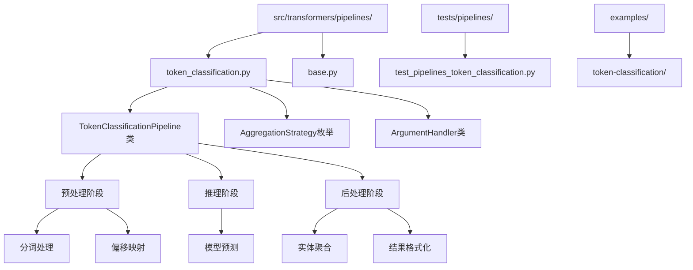
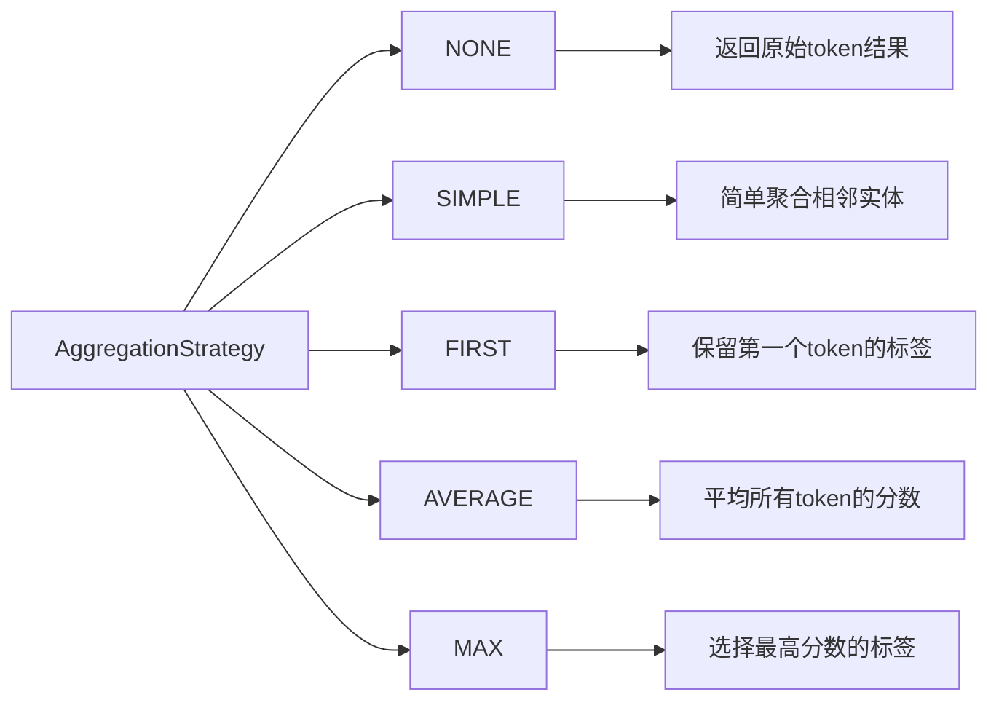
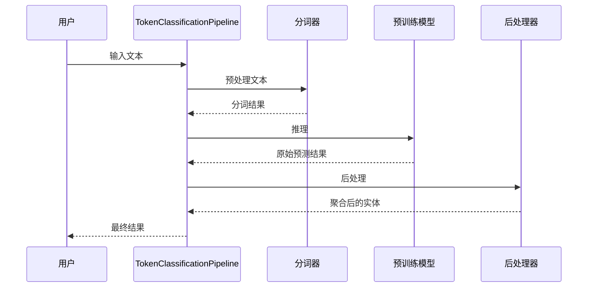
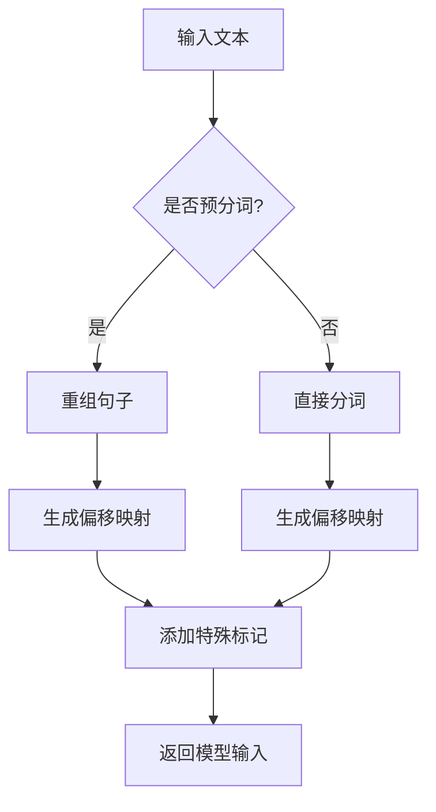
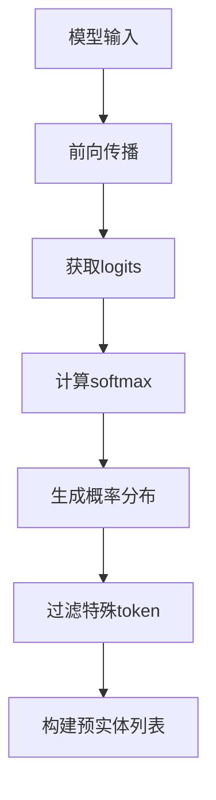
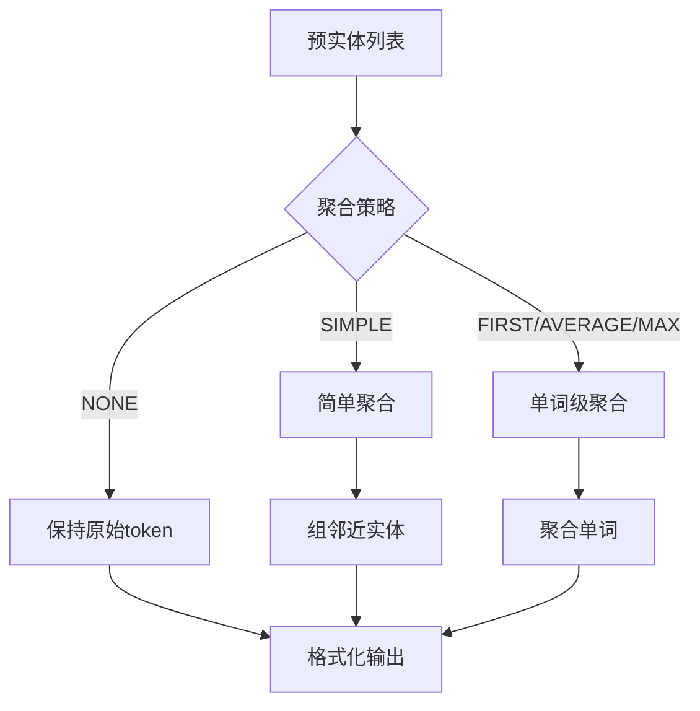
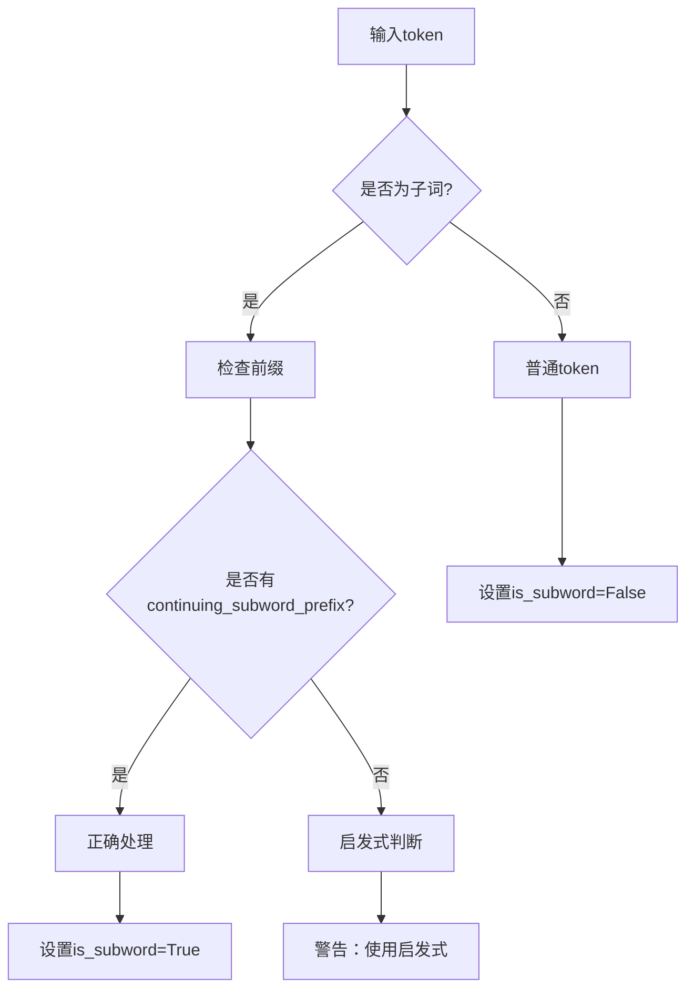
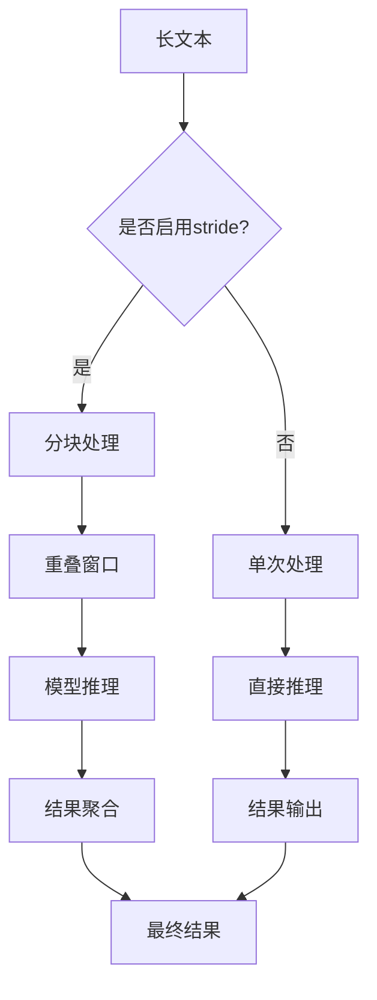
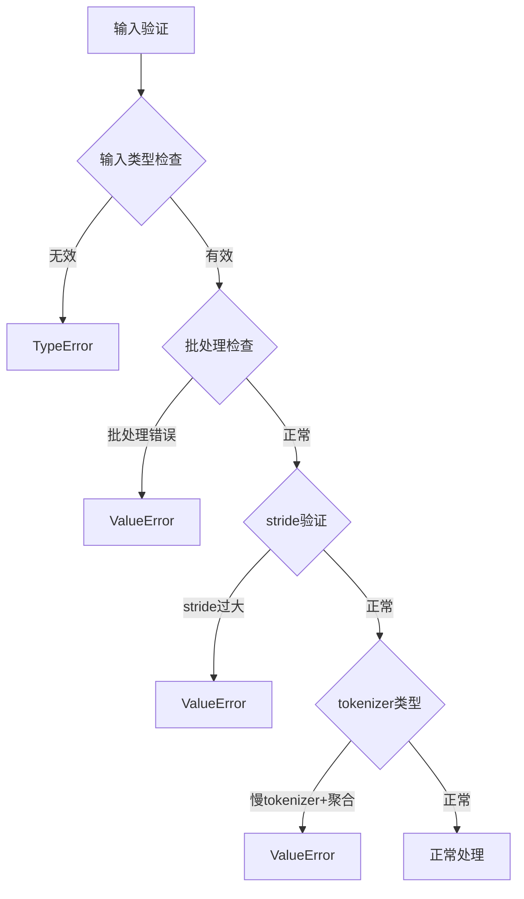
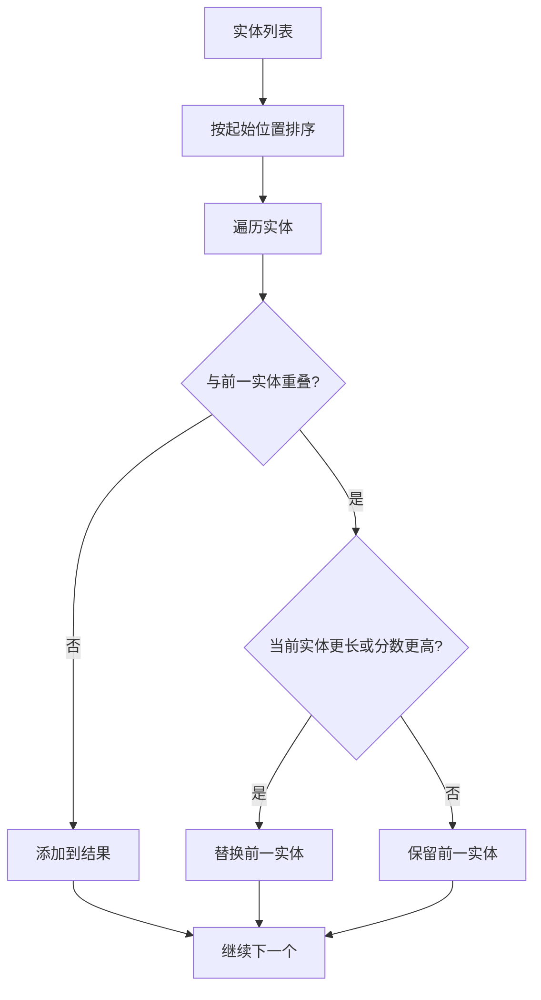

# 命名实体识别Pipeline

<cite>
**本文档引用的文件**
- [token_classification.py](file://src/transformers/pipelines/token_classification.py)
- [test_pipelines_token_classification.py](file://tests/pipelines/test_pipelines_token_classification.py)
- [__init__.py](file://src/transformers/pipelines/__init__.py)
- [base.py](file://src/transformers/pipelines/base.py)
</cite>

## 目录
1. [简介](#简介)
2. [项目结构](#项目结构)
3. [核心组件](#核心组件)
4. [架构概览](#架构概览)
5. [详细组件分析](#详细组件分析)
6. [聚合策略详解](#聚合策略详解)
7. [高级功能](#高级功能)
8. [错误处理与边界检测](#错误处理与边界检测)
9. [性能考虑](#性能考虑)
10. [故障排除指南](#故障排除指南)
11. [结论](#结论)

## 简介

TokenClassificationPipeline是transformers库中专门用于命名实体识别（NER）任务的核心组件。它能够对输入文本中的每个token进行分类，识别出诸如人名、地名、组织机构等实体类型。该Pipeline支持多种聚合策略，能够处理子词分割问题，并提供灵活的配置选项以适应不同的应用场景。

## 项目结构

TokenClassificationPipeline位于transformers库的管道模块中，主要文件结构如下：



**图表来源**
- [token_classification.py](file://src/transformers/pipelines/token_classification.py#L1-L50)
- [base.py](file://src/transformers/pipelines/base.py#L1-L50)

**章节来源**
- [token_classification.py](file://src/transformers/pipelines/token_classification.py#L1-L100)

## 核心组件

### TokenClassificationPipeline类

TokenClassificationPipeline是NER任务的主要入口点，继承自ChunkPipeline基类，提供了完整的端到端处理流程。

#### 主要特性：
- **多语言支持**：支持各种语言的命名实体识别
- **多种聚合策略**：提供四种不同的实体聚合方式
- **子词处理**：智能处理BERT等模型的子词分割问题
- **批量处理**：支持单个和批量文本输入
- **灵活配置**：丰富的参数配置选项

#### 核心方法：
- `__call__()`: 主要的调用接口
- `preprocess()`: 文本预处理和分词
- `_forward()`: 模型推理
- `postprocess()`: 结果后处理和聚合

**章节来源**
- [token_classification.py](file://src/transformers/pipelines/token_classification.py#L87-L124)

### AggregationStrategy枚举

定义了四种不同的实体聚合策略：



**图表来源**
- [token_classification.py](file://src/transformers/pipelines/token_classification.py#L55-L64)

**章节来源**
- [token_classification.py](file://src/transformers/pipelines/token_classification.py#L55-L64)

## 架构概览

TokenClassificationPipeline采用模块化设计，将整个处理流程分为三个主要阶段：



**图表来源**
- [token_classification.py](file://src/transformers/pipelines/token_classification.py#L250-L300)

## 详细组件分析

### 预处理阶段

预处理阶段负责将原始文本转换为模型可接受的输入格式：



**图表来源**
- [token_classification.py](file://src/transformers/pipelines/token_classification.py#L280-L350)

#### 关键功能：
- **分词处理**：支持fast tokenizer和slow tokenizer
- **偏移映射**：建立token与原始文本的对应关系
- **特殊标记**：添加[CLS]、[SEP]等特殊标记
- **批量处理**：支持多个文本的批量处理

**章节来源**
- [token_classification.py](file://src/transformers/pipelines/token_classification.py#L280-L350)

### 推理阶段

推理阶段通过预训练模型生成token级别的预测结果：



**图表来源**
- [token_classification.py](file://src/transformers/pipelines/token_classification.py#L350-L400)

#### 实现细节：
- **Logits处理**：从模型输出中提取logits
- **概率计算**：使用softmax函数计算概率分布
- **特殊token过滤**：移除[CLS]、[SEP]等特殊标记
- **子词检测**：识别BERT等模型的子词标记

**章节来源**
- [token_classification.py](file://src/transformers/pipelines/token_classification.py#L350-L400)

### 后处理阶段

后处理阶段是Pipeline的核心，负责将原始预测结果转换为有意义的实体：



**图表来源**
- [token_classification.py](file://src/transformers/pipelines/token_classification.py#L400-L450)

**章节来源**
- [token_classification.py](file://src/transformers/pipelines/token_classification.py#L400-L450)

## 聚合策略详解

### NONE策略

返回模型的原始token级别预测结果，不进行任何聚合。

**特点**：
- 保留最细粒度的预测信息
- 适用于需要查看每个token预测的场景
- 输出包含索引信息

**输出格式**：
```json
{
    "entity": "B-PER",
    "score": 0.998,
    "index": 1,
    "word": "En",
    "start": 0,
    "end": 2
}
```

### SIMPLE策略

将相邻的相同实体类型的token聚合为一个实体。

**特点**：
- 自动合并连续的B-和I-标签
- 保留原始token的边界信息
- 适用于基本的实体识别需求

**输出格式**：
```json
{
    "entity_group": "PER",
    "score": 0.997,
    "word": "Enzo",
    "start": 0,
    "end": 4
}
```

### FIRST策略

在单词边界上强制统一标签，保留第一个token的标签。

**特点**：
- 解决子词标签不一致问题
- 保证单词级别的标签一致性
- 适用于需要稳定标签的场景

**算法逻辑**：
```
对于每个单词：
    如果是第一个token：使用该token的标签
    如果是后续token：使用第一个token的标签
```

### AVERAGE策略

在单词边界上强制统一标签，计算所有token分数的平均值。

**特点**：
- 平滑标签预测
- 减少噪声影响
- 提供更稳定的置信度分数

**算法逻辑**：
```
对于每个单词：
    计算所有token分数的平均值
    使用平均分数最高的标签
```

### MAX策略

在单词边界上强制统一标签，选择最高分数的标签。

**特点**：
- 保守的标签选择
- 只保留最可信的预测
- 适用于高精度要求的场景

**章节来源**
- [token_classification.py](file://src/transformers/pipelines/token_classification.py#L450-L550)

## 高级功能

### 子词分割处理

TokenClassificationPipeline智能处理BERT等模型的子词分割问题：



**图表来源**
- [token_classification.py](file://src/transformers/pipelines/token_classification.py#L420-L470)

#### 处理策略：
- **BPE模型**：使用模型特定的子词前缀检测
- **启发式方法**：基于空格字符的位置判断
- **兼容性**：支持不同tokenizer的差异

**章节来源**
- [token_classification.py](file://src/transformers/pipelines/token_classification.py#L420-L470)

### 批量处理与流式处理

支持大文本的批量处理和流式处理：



**图表来源**
- [token_classification.py](file://src/transformers/pipelines/token_classification.py#L200-L250)

#### 参数配置：
- **stride**：重叠token数量
- **model_max_length**：模型最大长度限制
- **tokenizer.is_fast**：是否使用快速tokenizer

**章节来源**
- [token_classification.py](file://src/transformers/pipelines/token_classification.py#L200-L250)

### 偏移映射与字符定位

精确的字符级实体定位：

| 参数 | 类型 | 描述 | 示例 |
|------|------|------|------|
| start | int | 实体起始字符位置 | 0 |
| end | int | 实体结束字符位置 | 4 |
| word | str | 实体文本内容 | "Enzo" |
| entity | str | 实体标签 | "PER" |
| score | float | 置信度分数 | 0.997 |

**章节来源**
- [token_classification.py](file://src/transformers/pipelines/token_classification.py#L470-L500)

## 错误处理与边界检测

### 常见错误类型

TokenClassificationPipeline实现了完善的错误处理机制：



**图表来源**
- [token_classification.py](file://src/transformers/pipelines/token_classification.py#L140-L200)

### 边界检测机制

智能的边界检测确保实体定位的准确性：

#### 字符偏移计算：
- **Fast Tokenizer**：直接使用offset_mapping
- **Slow Tokenizer**：通过word_ids重建字符映射
- **预分词输入**：手动计算字符位置

#### 重叠实体处理：


**图表来源**
- [token_classification.py](file://src/transformers/pipelines/token_classification.py#L400-L420)

**章节来源**
- [token_classification.py](file://src/transformers/pipelines/token_classification.py#L400-L420)

## 性能考虑

### 内存优化

- **批处理大小**：动态调整batch_size以平衡速度和内存
- **梯度累积**：在推理时禁用梯度计算
- **数据类型**：支持float16和bfloat16以减少内存占用

### 计算优化

- **并行处理**：利用多核CPU进行并行分词
- **缓存机制**：缓存常用的分词结果
- **模型优化**：支持量化和剪枝模型

### 推理加速

- **模型并行**：支持模型并行推理
- **流水线并行**：重叠计算和通信
- **混合精度**：自动使用适合的精度

## 故障排除指南

### 常见问题及解决方案

#### 1. 子词标签不一致

**问题描述**：同一个单词被分成多个token，但标签不一致

**解决方案**：
```python
# 使用合适的聚合策略
pipeline = TokenClassificationPipeline(
    model=model, 
    tokenizer=tokenizer, 
    aggregation_strategy="first"  # 或 "average", "max"
)
```

#### 2. 实体边界错误

**问题描述**：实体的起始和结束位置不准确

**解决方案**：
- 确保使用Fast Tokenizer
- 检查offset_mapping参数
- 验证输入文本的编码

#### 3. 内存不足

**问题描述**：处理大文本时出现内存溢出

**解决方案**：
```python
# 使用stride参数分块处理
pipeline = TokenClassificationPipeline(
    model=model,
    tokenizer=tokenizer,
    aggregation_strategy="simple",
    stride=128  # 根据实际情况调整
)
```

#### 4. 慢tokenizer警告

**问题描述**：使用慢tokenizer时出现警告

**解决方案**：
```python
# 切换到Fast Tokenizer
tokenizer = AutoTokenizer.from_pretrained(model_name, use_fast=True)
```

**章节来源**
- [test_pipelines_token_classification.py](file://tests/pipelines/test_pipelines_token_classification.py#L995-L1020)

## 结论

TokenClassificationPipeline是transformers库中功能强大且灵活的命名实体识别工具。它不仅提供了完整的NER解决方案，还包含了丰富的配置选项和高级功能，能够满足从基础应用到复杂场景的各种需求。

### 主要优势：
- **易用性**：简洁的API设计，开箱即用
- **灵活性**：多种聚合策略适应不同需求
- **鲁棒性**：完善的错误处理和边界检测
- **扩展性**：支持自定义模型和配置

### 适用场景：
- **基础NER**：简单的实体识别任务
- **词性标注**：基于相似原理的词性标注
- **语义角色标注**：复杂的语义分析任务
- **实体链接**：结合知识库的实体链接
- **嵌套实体**：处理复杂的嵌套结构

通过合理配置和使用，TokenClassificationPipeline能够为各种自然语言处理任务提供高质量的实体识别服务。