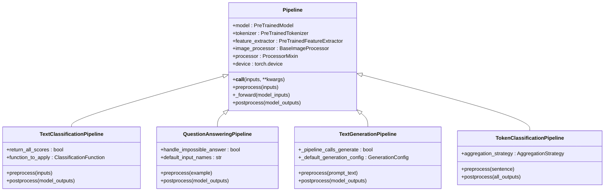
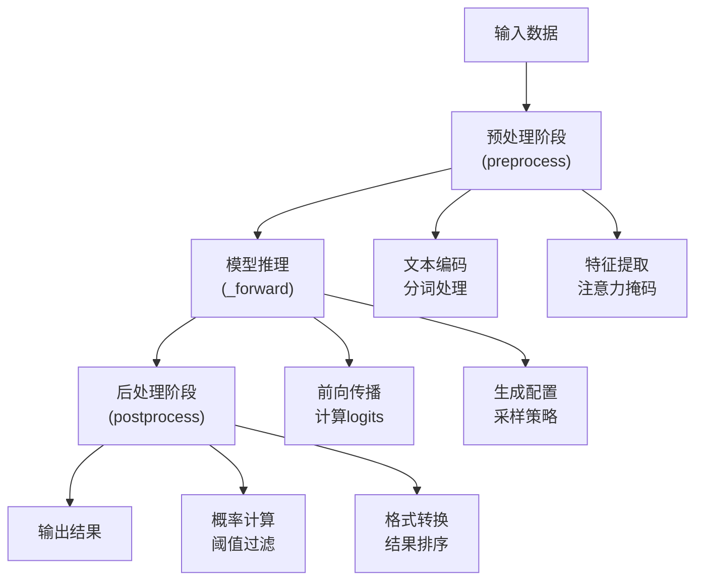
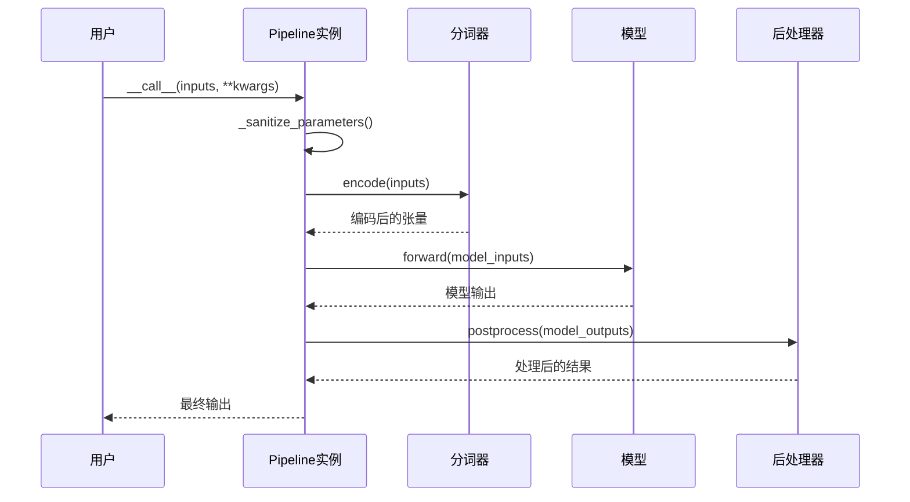
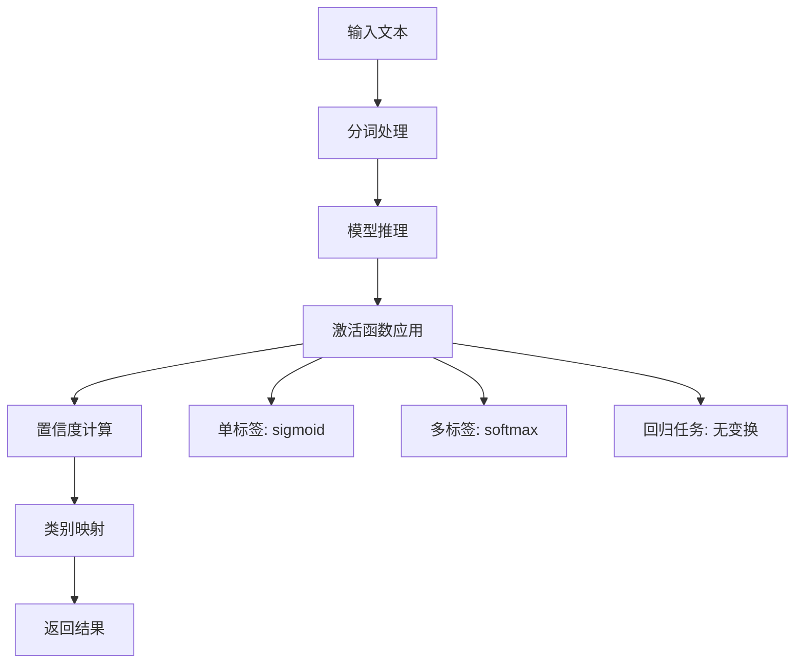
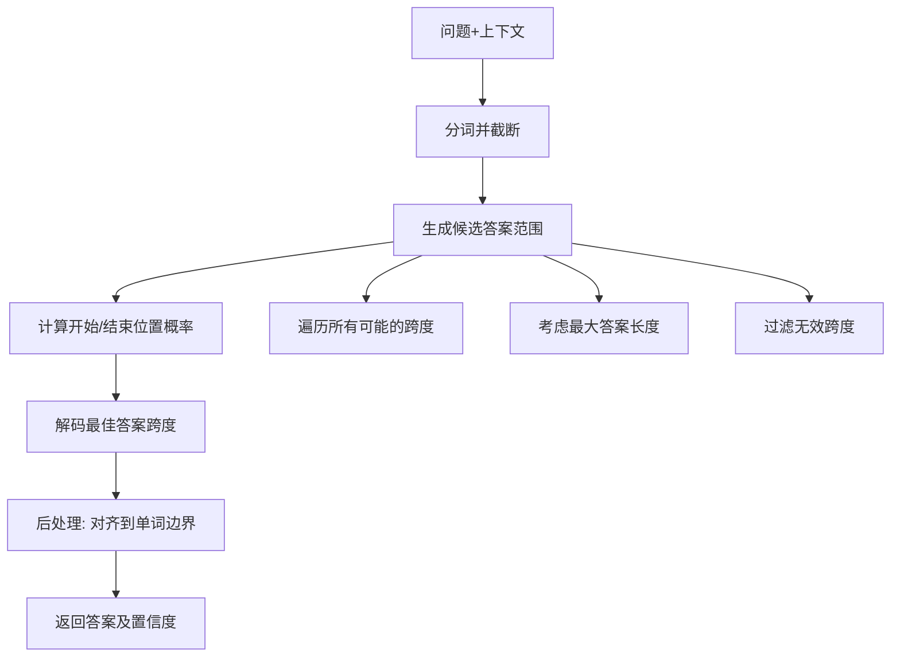
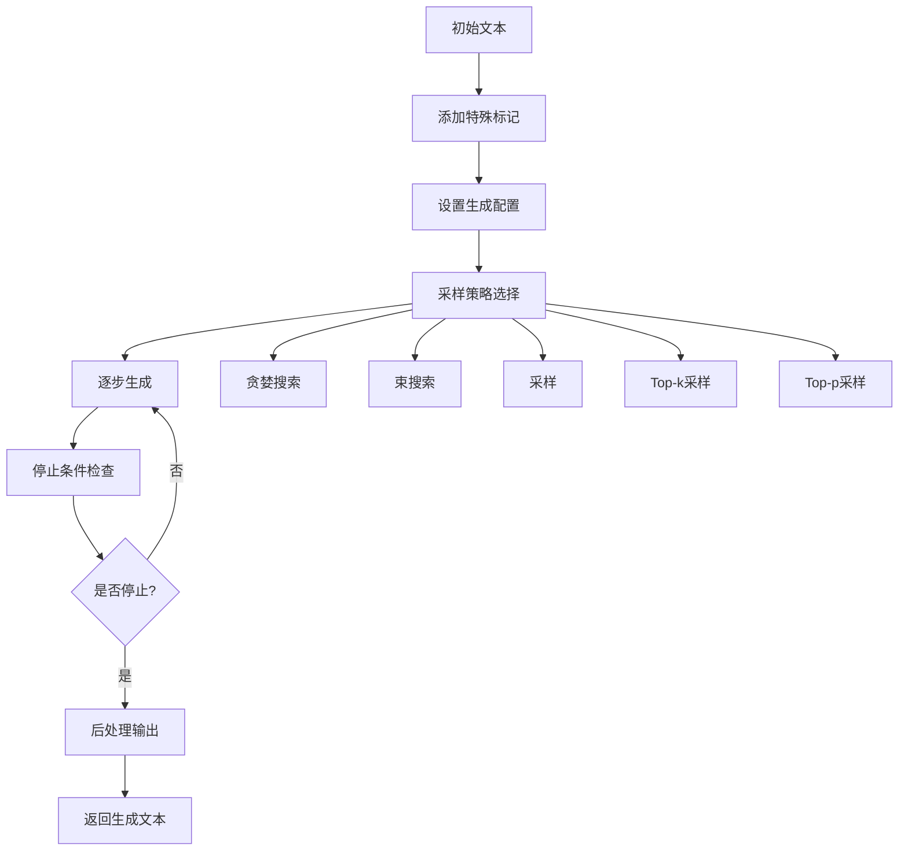
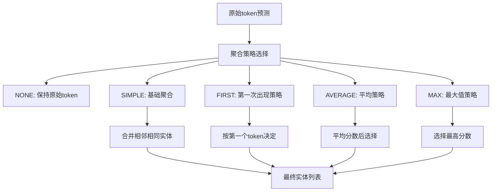

# 文本任务Pipeline

<cite>
**本文档中引用的文件**
- [src/transformers/pipelines/__init__.py](file://src/transformers/pipelines/__init__.py)
- [src/transformers/pipelines/base.py](file://src/transformers/pipelines/base.py)
- [src/transformers/pipelines/text_classification.py](file://src/transformers/pipelines/text_classification.py)
- [src/transformers/pipelines/question_answering.py](file://src/transformers/pipelines/question_answering.py)
- [src/transformers/pipelines/text_generation.py](file://src/transformers/pipelines/text_generation.py)
- [src/transformers/pipelines/token_classification.py](file://src/transformers/pipelines/token_classification.py)
- [src/transformers/pipelines/text2text_generation.py](file://src/transformers/pipelines/text2text_generation.py)
- [examples/pytorch/text-classification/run_classification.py](file://examples/pytorch/text-classification/run_classification.py)
- [examples/pytorch/question-answering/run_qa.py](file://examples/pytorch/question-answering/run_qa.py)
- [examples/pytorch/text-generation/run_generation.py](file://examples/pytorch/text-generation/run_generation.py)
</cite>

## 目录
1. [简介](#简介)
2. [Pipeline架构概览](#pipeline架构概览)
3. [核心文本任务Pipeline](#核心文本任务pipeline)
4. [Pipeline实现原理](#pipeline实现原理)
5. [具体任务详解](#具体任务详解)
6. [使用示例](#使用示例)
7. [参数配置与优化](#参数配置与优化)
8. [故障排除指南](#故障排除指南)
9. [性能优化技巧](#性能优化技巧)
10. [总结](#总结)

## 简介

Transformers库中的Pipeline系统为自然语言处理任务提供了一个统一且易用的接口。对于文本任务而言，Pipeline封装了模型加载、预处理、推理和后处理的完整流程，使用户能够以最少的代码量完成复杂的NLP任务。

本文档将深入探讨文本相关Pipeline的实现原理、使用方法和最佳实践，涵盖文本分类、问答、文本生成、命名实体识别等核心任务。

## Pipeline架构概览

### 核心组件结构



**图表来源**
- [src/transformers/pipelines/base.py](file://src/transformers/pipelines/base.py#L600-L800)
- [src/transformers/pipelines/text_classification.py](file://src/transformers/pipelines/text_classification.py#L40-L100)
- [src/transformers/pipelines/question_answering.py](file://src/transformers/pipelines/question_answering.py#L200-L300)

### Pipeline工作流程



**节来源**
- [src/transformers/pipelines/base.py](file://src/transformers/pipelines/base.py#L600-L700)

## 核心文本任务Pipeline

### 支持的任务类型

Transformers库为文本任务提供了以下核心Pipeline：

| 任务类型 | Pipeline类 | 主要功能 | 输入格式 |
|---------|-----------|----------|----------|
| 文本分类 | TextClassificationPipeline | 情感分析、主题分类 | 单个文本或文本列表 |
| 问答 | QuestionAnsweringPipeline | 提取式问答 | 问题+上下文对 |
| 文本生成 | TextGenerationPipeline | 自然语言生成 | 文本提示 |
| 命名实体识别 | TokenClassificationPipeline | 实体标注 | 分词文本 |
| 文本到文本生成 | Text2TextGenerationPipeline | 翻译、摘要 | 源文本 |
| 总结 | SummarizationPipeline | 文档摘要 | 长文本 |
| 翻译 | TranslationPipeline | 多语言翻译 | 源语言文本 |

**节来源**
- [src/transformers/pipelines/__init__.py](file://src/transformers/pipelines/__init__.py#L150-L300)

## Pipeline实现原理

### 基础Pipeline类

所有文本Pipeline都继承自基础的`Pipeline`类，该类实现了通用的工作流程：



**图表来源**
- [src/transformers/pipelines/base.py](file://src/transformers/pipelines/base.py#L650-L750)

### 关键方法实现

每个Pipeline类都需要实现三个核心方法：

1. **preprocess()**: 将原始输入转换为模型可接受的格式
2. **_forward()**: 执行模型推理
3. **postprocess()**: 将模型输出转换为用户友好的格式

**节来源**
- [src/transformers/pipelines/base.py](file://src/transformers/pipelines/base.py#L600-L650)

## 具体任务详解

### 文本分类Pipeline

文本分类Pipeline用于将文本归类到预定义的类别中。

#### 核心特性
- 支持单标签和多标签分类
- 可配置的激活函数（sigmoid、softmax）
- 置信度分数计算
- 批量预测支持

#### 实现细节



**图表来源**
- [src/transformers/pipelines/text_classification.py](file://src/transformers/pipelines/text_classification.py#L150-L200)

**节来源**
- [src/transformers/pipelines/text_classification.py](file://src/transformers/pipelines/text_classification.py#L40-L236)

### 问答Pipeline

问答Pipeline专门用于抽取式问答任务，从给定的上下文中找到问题的答案。

#### 核心算法



**图表来源**
- [src/transformers/pipelines/question_answering.py](file://src/transformers/pipelines/question_answering.py#L50-L100)

#### 关键参数

| 参数 | 类型 | 默认值 | 说明 |
|------|------|--------|------|
| top_k | int | 1 | 返回的最佳答案数量 |
| max_answer_len | int | 15 | 最大答案长度 |
| doc_stride | int | 128 | 文档重叠步长 |
| handle_impossible_answer | bool | False | 是否允许无法回答的情况 |

**节来源**
- [src/transformers/pipelines/question_answering.py](file://src/transformers/pipelines/question_answering.py#L200-L400)

### 文本生成Pipeline

文本生成Pipeline基于因果语言模型，用于生成连贯的文本序列。

#### 生成策略



**图表来源**
- [src/transformers/pipelines/text_generation.py](file://src/transformers/pipelines/text_generation.py#L100-L200)

#### 生成参数配置

| 参数 | 类型 | 默认值 | 说明 |
|------|------|--------|------|
| max_new_tokens | int | 256 | 最大新生成token数 |
| temperature | float | 0.7 | 温度参数，控制随机性 |
| top_k | int | 50 | Top-k采样的k值 |
| top_p | float | 0.9 | Top-p采样的概率阈值 |
| do_sample | bool | True | 是否使用采样 |

**节来源**
- [src/transformers/pipelines/text_generation.py](file://src/transformers/pipelines/text_generation.py#L150-L300)

### 命名实体识别Pipeline

命名实体识别Pipeline用于识别文本中的特定实体类型。

#### 聚合策略



**图表来源**
- [src/transformers/pipelines/token_classification.py](file://src/transformers/pipelines/token_classification.py#L400-L500)

**节来源**
- [src/transformers/pipelines/token_classification.py](file://src/transformers/pipelines/token_classification.py#L100-L300)

## 使用示例

### 基础使用模式

#### 1. 文本分类示例

```python
from transformers import pipeline

# 加载情感分析Pipeline
classifier = pipeline("sentiment-analysis")

# 单个预测
result = classifier("I love this product!")
print(result)
# 输出: [{'label': 'POSITIVE', 'score': 0.9998}]

# 批量预测
texts = ["Great movie!", "Terrible service", "Neutral opinion"]
results = classifier(texts)
```

#### 2. 问答示例

```python
# 加载问答Pipeline
qa_pipeline = pipeline("question-answering")

# 执行问答
context = "Transformers is a library developed by Hugging Face."
result = qa_pipeline(
    question="Who developed Transformers?",
    context=context
)
print(result)
# 输出: {'answer': 'Hugging Face', 'score': 0.9999, 'start': 32, 'end': 45}
```

#### 3. 文本生成示例

```python
# 加载文本生成Pipeline
generator = pipeline("text-generation")

# 生成文本
prompt = "The future of artificial intelligence"
result = generator(prompt, max_length=50, num_return_sequences=2)
for i, generation in enumerate(result):
    print(f"Generation {i+1}: {generation['generated_text']}")
```

#### 4. 命名实体识别示例

```python
# 加载NER Pipeline
ner_pipeline = pipeline("ner", aggregation_strategy="simple")

# 执行实体识别
text = "Apple Inc. was founded by Steve Jobs in Cupertino."
entities = ner_pipeline(text)
for entity in entities:
    print(f"{entity['word']}: {entity['entity_group']}")
```

### 高级使用模式

#### 1. 自定义模型和分词器

```python
from transformers import pipeline, AutoModelForSequenceClassification, AutoTokenizer

# 加载自定义模型
model = AutoModelForSequenceClassification.from_pretrained("custom-model-path")
tokenizer = AutoTokenizer.from_pretrained("custom-tokenizer-path")

# 创建Pipeline
custom_classifier = pipeline(
    "text-classification",
    model=model,
    tokenizer=tokenizer
)

# 使用自定义Pipeline
result = custom_classifier("Custom input text")
```

#### 2. 批量处理

```python
# 批量处理大量文本
texts = ["Text 1", "Text 2", "Text 3", ...]  # 大量文本
results = classifier(texts, batch_size=32)
```

#### 3. 流式处理

```python
# 使用生成器进行流式处理
def text_generator():
    for i in range(1000):
        yield f"Text {i} for processing"

# 流式处理
for result in classifier(text_generator(), batch_size=8):
    print(result)
```

**节来源**
- [examples/pytorch/text-classification/run_classification.py](file://examples/pytorch/text-classification/run_classification.py#L100-L200)
- [examples/pytorch/question-answering/run_qa.py](file://examples/pytorch/question-answering/run_qa.py#L100-L200)
- [examples/pytorch/text-generation/run_generation.py](file://examples/pytorch/text-generation/run_generation.py#L200-L300)

## 参数配置与优化

### 通用配置参数

所有Pipeline都支持以下通用配置参数：

| 参数 | 类型 | 说明 |
|------|------|------|
| device | int/str/torch.device | 计算设备 |
| torch_dtype | str/torch.dtype | 模型精度 |
| model_kwargs | dict | 传递给模型的额外参数 |
| batch_size | int | 批处理大小 |
| num_workers | int | 数据加载进程数 |

### 任务特定参数

#### 文本分类参数

```python
# 文本分类专用参数
classifier = pipeline(
    "text-classification",
    return_all_scores=True,  # 返回所有类别的分数
    function_to_apply="softmax"  # 应用的激活函数
)
```

#### 问答参数

```python
# 问答专用参数
qa_pipeline = pipeline(
    "question-answering",
    top_k=3,  # 返回前3个最佳答案
    max_answer_len=50,  # 最大答案长度
    doc_stride=128,  # 文档重叠步长
    handle_impossible_answer=True  # 允许无法回答
)
```

#### 文本生成参数

```python
# 文本生成专用参数
generator = pipeline(
    "text-generation",
    max_new_tokens=100,  # 最大生成长度
    temperature=0.8,  # 控制创造性
    top_p=0.9,  # 核采样
    do_sample=True,  # 启用采样
    num_return_sequences=2  # 返回多个序列
)
```

### 性能优化配置

#### 1. 设备配置

```python
# CPU配置
pipeline("text-classification", device="cpu")

# GPU配置
pipeline("text-classification", device=0)  # 第一个GPU
pipeline("text-classification", device="cuda:1")  # 第二个GPU

# 自动设备检测
pipeline("text-classification", device=-1)  # 自动选择
```

#### 2. 精度配置

```python
# 使用混合精度
pipeline("text-classification", torch_dtype="auto")

# 使用FP16
pipeline("text-classification", torch_dtype=torch.float16)

# 使用BF16
pipeline("text-classification", torch_dtype=torch.bfloat16)
```

#### 3. 批处理优化

```python
# 大批量处理
results = pipeline("text-classification", batch_size=64)(large_text_list)

# 流式批处理
for batch_results in pipeline("text-classification", batch_size=32)(text_generator()):
    process_batch(batch_results)
```

## 故障排除指南

### 常见问题及解决方案

#### 1. 内存不足错误

**问题**: CUDA out of memory
**解决方案**:
```python
# 减少批处理大小
pipeline("text-classification", batch_size=1)

# 使用CPU
pipeline("text-classification", device="cpu")

# 使用量化模型
pipeline("text-classification", torch_dtype=torch.float16)
```

#### 2. 输入格式错误

**问题**: 输入格式不正确
**解决方案**:
```python
# 文本分类：确保输入是字符串或字符串列表
classifier("This is a text")  # 正确
classifier(["Text 1", "Text 2"])  # 正确

# 问答：确保提供问题和上下文
qa_pipeline(
    question="What is this?",
    context="This is a context"
)
```

#### 3. 模型加载失败

**问题**: 模型下载或加载失败
**解决方案**:
```python
# 检查网络连接
# 设置缓存目录
pipeline("text-classification", model="bert-base-uncased", cache_dir="./model_cache")

# 使用本地模型
pipeline("text-classification", model="./local_model_path")
```

#### 4. 性能问题

**问题**: 推理速度慢
**解决方案**:
```python
# 使用更快的模型
pipeline("text-classification", model="distilbert-base-uncased")

# 启用量化
pipeline("text-classification", torch_dtype=torch.float16)

# 批量处理
pipeline("text-classification", batch_size=32)
```

### 调试技巧

#### 1. 启用详细日志

```python
import logging
logging.basicConfig(level=logging.DEBUG)

# 这将显示详细的处理步骤
classifier = pipeline("text-classification")
result = classifier("Test text")
```

#### 2. 检查中间结果

```python
# 获取Pipeline实例
pipe = pipeline("text-classification")

# 手动调用各个阶段
inputs = pipe.preprocess("Test text")
print("Preprocessed:", inputs)

model_outputs = pipe._forward(inputs)
print("Model outputs:", model_outputs)

final_result = pipe.postprocess(model_outputs)
print("Final result:", final_result)
```

#### 3. 性能监控

```python
import time

def measure_performance():
    pipe = pipeline("text-classification")
    
    start_time = time.time()
    result = pipe("Test text")
    end_time = time.time()
    
    print(f"Processing time: {end_time - start_time:.2f} seconds")
    return result
```

## 性能优化技巧

### 1. 模型选择优化

#### 小模型 vs 大模型

```python
# 快速但准确度较低
fast_pipeline = pipeline("text-classification", model="distilbert-base-uncased")

# 准确度高但较慢
accurate_pipeline = pipeline("text-classification", model="bert-large-uncased")
```

#### 量化模型

```python
# 使用INT8量化
pipeline("text-classification", torch_dtype=torch.int8)

# 使用FP16量化
pipeline("text-classification", torch_dtype=torch.float16)
```

### 2. 批处理优化

```python
# 优化批处理大小
def optimal_batch_size(texts, pipeline_instance):
    # 尝试不同的批处理大小
    batch_sizes = [1, 4, 8, 16, 32, 64]
    
    for batch_size in batch_sizes:
        try:
            start_time = time.time()
            results = pipeline_instance(texts[:10], batch_size=batch_size)
            end_time = time.time()
            
            print(f"Batch size {batch_size}: {end_time - start_time:.2f}s")
            return batch_size
        except RuntimeError:
            print(f"Batch size {batch_size} too large, trying smaller...")
            continue
```

### 3. 缓存策略

```python
from functools import lru_cache

# 缓存常用模型
@lru_cache(maxsize=10)
def get_cached_pipeline(task, model):
    return pipeline(task, model=model)

# 使用缓存的Pipeline
classifier = get_cached_pipeline("text-classification", "bert-base-uncased")
```

### 4. 异步处理

```python
import asyncio
from concurrent.futures import ThreadPoolExecutor

async def async_classification(texts):
    loop = asyncio.get_event_loop()
    
    with ThreadPoolExecutor() as executor:
        futures = [
            loop.run_in_executor(executor, classifier, text) 
            for text in texts
        ]
        
        results = await asyncio.gather(*futures)
        return results
```

### 5. 自定义优化

```python
class OptimizedPipeline:
    def __init__(self, task, model, optimize_for_speed=True):
        self.pipeline = pipeline(task, model=model)
        self.optimize_for_speed = optimize_for_speed
        
        if optimize_for_speed:
            # 启用优化选项
            self.pipeline.model = torch.jit.script(self.pipeline.model)
            self.pipeline.model = torch.compile(self.pipeline.model)
    
    def __call__(self, inputs, **kwargs):
        # 添加自定义优化逻辑
        if self.optimize_for_speed:
            # 使用更高效的处理方式
            return self.optimized_inference(inputs, **kwargs)
        return self.pipeline(inputs, **kwargs)
```

## 总结

Transformers库的文本任务Pipeline为自然语言处理提供了强大而灵活的解决方案。通过理解其架构原理和掌握使用技巧，开发者可以：

1. **快速原型开发**: 使用简单的API完成复杂的NLP任务
2. **灵活定制**: 通过参数配置和自定义扩展满足特定需求
3. **性能优化**: 通过设备配置、批处理和模型选择提升效率
4. **问题解决**: 通过调试技巧和故障排除指南快速定位和解决问题

### 最佳实践建议

1. **选择合适的模型**: 根据任务需求和资源限制选择适当的模型
2. **合理配置参数**: 根据具体应用场景调整生成和处理参数
3. **监控性能**: 定期评估和优化Pipeline的性能表现
4. **错误处理**: 实现健壮的错误处理和恢复机制
5. **持续学习**: 关注最新的模型更新和最佳实践

通过遵循这些原则和技巧，您可以充分发挥Transformers库Pipeline的强大功能，构建高效可靠的NLP应用程序。