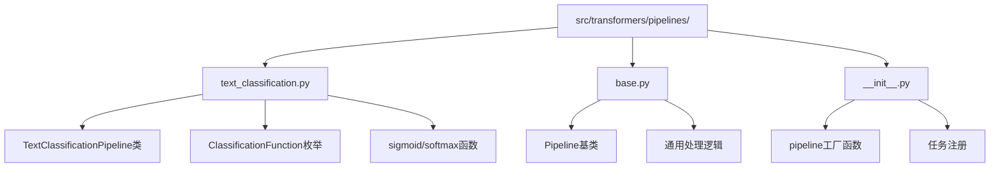
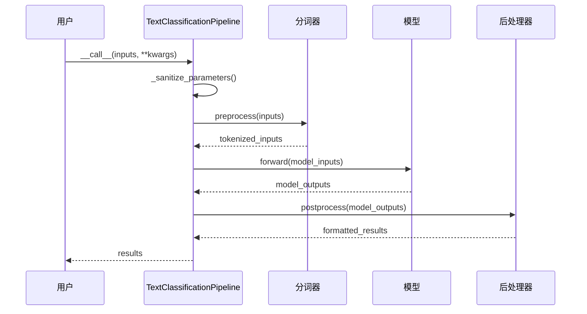
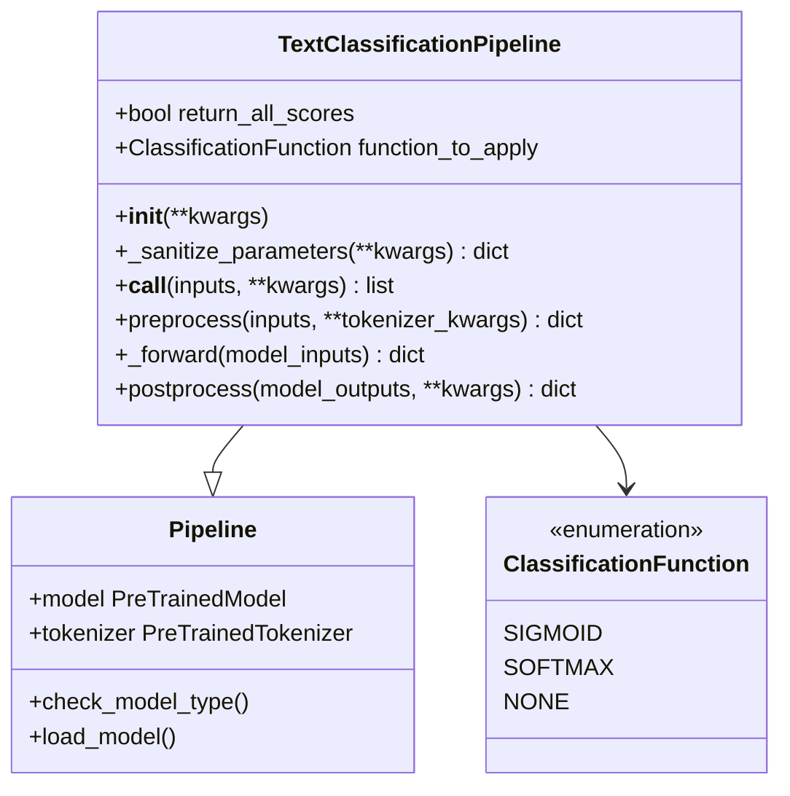
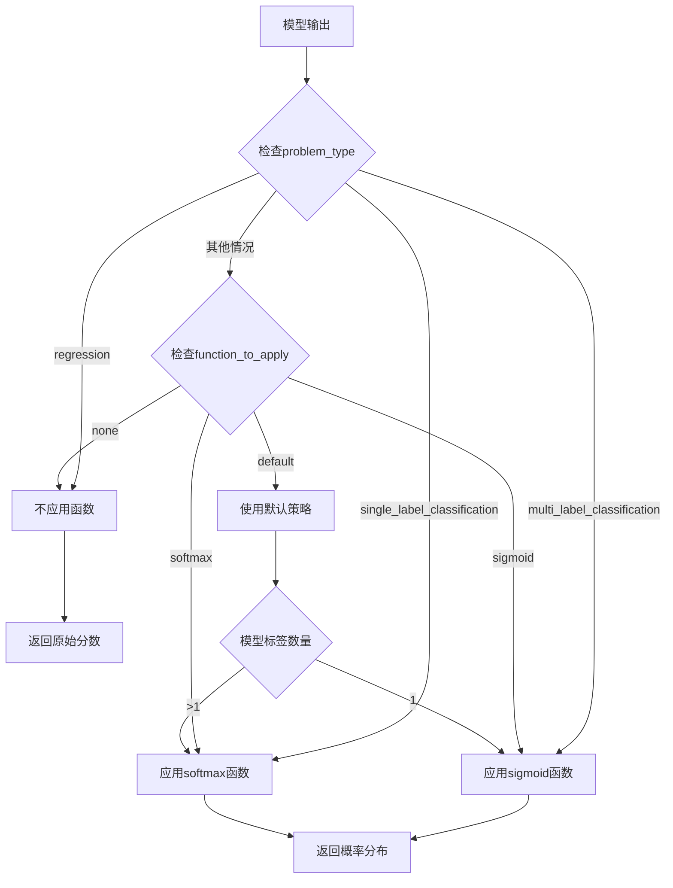
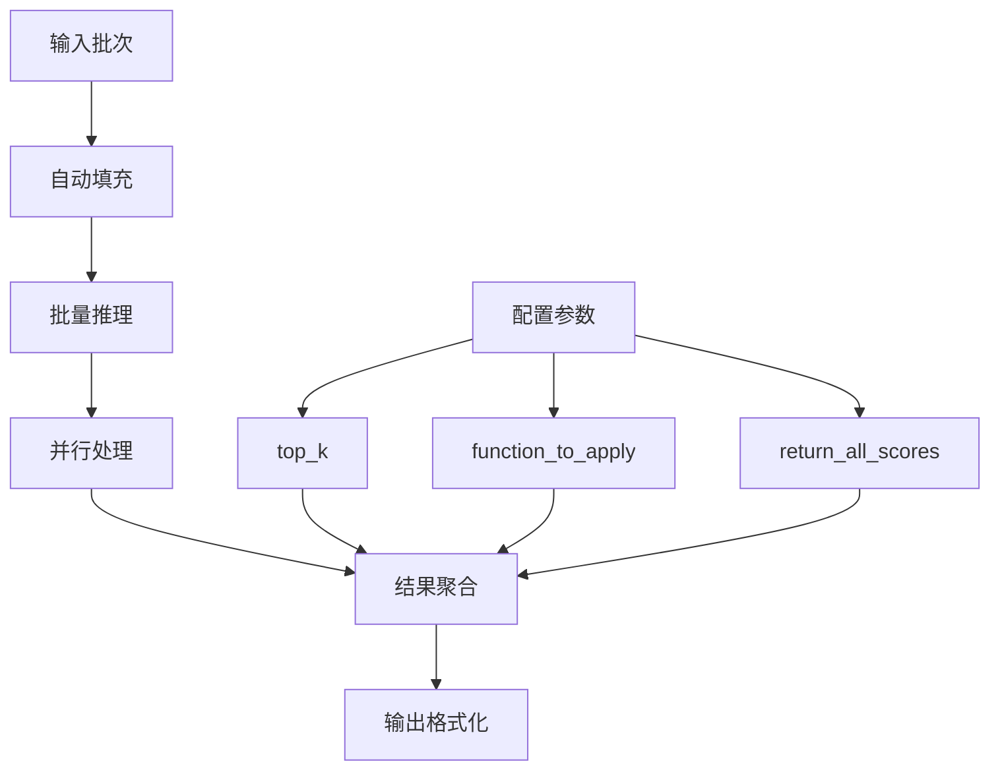
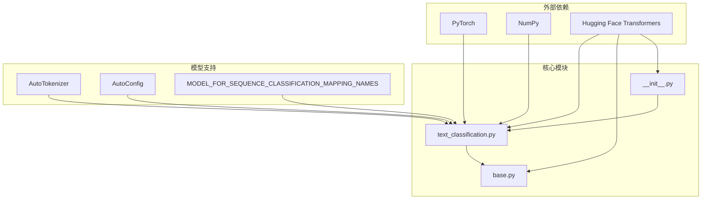

# 文本分类Pipeline详细文档

<cite>
**本文档中引用的文件**
- [text_classification.py](file://src/transformers/pipelines/text_classification.py)
- [base.py](file://src/transformers/pipelines/base.py)
- [__init__.py](file://src/transformers/pipelines/__init__.py)
- [test_pipelines_text_classification.py](file://tests/pipelines/test_pipelines_text_classification.py)
- [run_text_classification.py](file://examples/pytorch/text-classification/run_text_classification.py)
</cite>

## 目录
1. [简介](#简介)
2. [项目结构](#项目结构)
3. [核心组件](#核心组件)
4. [架构概览](#架构概览)
5. [详细组件分析](#详细组件分析)
6. [依赖关系分析](#依赖关系分析)
7. [性能考虑](#性能考虑)
8. [故障排除指南](#故障排除指南)
9. [结论](#结论)

## 简介

TextClassificationPipeline是Hugging Face Transformers库中的一个强大工具，专门用于执行文本分类任务。它基于`ModelForSequenceClassification`模型，能够对输入文本进行分类，并返回相应的标签和置信度分数。该Pipeline支持多种分类场景，包括情感分析、主题分类、意图识别等应用。

TextClassificationPipeline的核心优势在于其简单易用的接口设计，用户只需几行代码即可完成复杂的文本分类任务。同时，它还提供了丰富的配置选项，支持批量处理、多标签分类、自定义函数应用等功能。

## 项目结构

TextClassificationPipeline位于transformers库的管道模块中，其文件组织结构如下：

**图表来源**
- [text_classification.py](file://src/transformers/pipelines/text_classification.py#L1-L236)
- [base.py](file://src/transformers/pipelines/base.py#L1-L100)
- [__init__.py](file://src/transformers/pipelines/__init__.py#L470-L472)

**章节来源**
- [text_classification.py](file://src/transformers/pipelines/text_classification.py#L1-L50)
- [base.py](file://src/transformers/pipelines/base.py#L1-L50)

## 核心组件

TextClassificationPipeline由以下几个核心组件构成：

### 1. TextClassificationPipeline类
这是主要的管道类，继承自基础Pipeline类，专门处理序列分类任务。

### 2. ClassificationFunction枚举
定义了三种分类函数：
- `SIGMOID`: 适用于单标签或多标签分类
- `SOFTMAX`: 适用于多类别分类
- `NONE`: 不应用任何函数（回归任务）

### 3. 预处理和后处理函数
- `preprocess`: 将输入文本转换为模型可接受的格式
- `postprocess`: 将模型输出转换为人类可读的结果

**章节来源**
- [text_classification.py](file://src/transformers/pipelines/text_classification.py#L20-L40)

## 架构概览

TextClassificationPipeline采用标准的管道架构模式，包含三个主要阶段：

**图表来源**
- [text_classification.py](file://src/transformers/pipelines/text_classification.py#L154-L236)
- [base.py](file://src/transformers/pipelines/base.py#L200-L300)

## 详细组件分析

### TextClassificationPipeline类分析

TextClassificationPipeline类是整个系统的核心，负责协调各个组件的工作：

**图表来源**
- [text_classification.py](file://src/transformers/pipelines/text_classification.py#L42-L236)

#### 主要方法分析

##### 1. 初始化方法 (`__init__`)
初始化Pipeline实例，验证模型类型是否为序列分类模型。

##### 2. 参数清理方法 (`_sanitize_parameters`)
处理用户提供的参数，支持以下功能：
- `return_all_scores`: 是否返回所有预测分数
- `function_to_apply`: 应用到模型输出的函数
- `top_k`: 返回前k个结果

##### 3. 主调用方法 (`__call__`)
处理输入数据并返回分类结果，支持多种输入格式：
- 单个字符串
- 字符串列表
- 字典格式（包含"text"和"text_pair"键）
- 字符串对列表

##### 4. 预处理方法 (`preprocess`)
将输入文本转换为模型可接受的张量格式，支持文本对输入。

##### 5. 后处理方法 (`postprocess`)
将模型输出转换为最终结果，根据模型配置自动选择合适的激活函数。

**章节来源**
- [text_classification.py](file://src/transformers/pipelines/text_classification.py#L75-L236)

### 函数应用机制

TextClassificationPipeline支持三种不同的函数应用策略：

**图表来源**
- [text_classification.py](file://src/transformers/pipelines/text_classification.py#L200-L236)

**章节来源**
- [text_classification.py](file://src/transformers/pipelines/text_classification.py#L200-L236)

### 输入输出格式

TextClassificationPipeline支持多种输入格式和输出格式：

#### 支持的输入格式
1. **单个文本**: `"这是一个测试句子"`
2. **文本列表**: `["句子1", "句子2", "句子3"]`
3. **文本对**: `{"text": "句子A", "text_pair": "句子B"}`
4. **文本对列表**: `[{"text": "句A1", "text_pair": "句B1"}, {"text": "句A2", "text_pair": "句B2"}]`

#### 输出格式
每个分类结果包含两个字段：
- `label`: 预测的类别标签
- `score`: 对应的概率分数（范围0-1）

**章节来源**
- [text_classification.py](file://src/transformers/pipelines/text_classification.py#L128-L152)

### 批量处理特性

TextClassificationPipeline内置了强大的批量处理能力：

**图表来源**
- [base.py](file://src/transformers/pipelines/base.py#L100-L200)

**章节来源**
- [base.py](file://src/transformers/pipelines/base.py#L100-L200)

## 依赖关系分析

TextClassificationPipeline的依赖关系图展示了其与其他组件的交互：

**图表来源**
- [text_classification.py](file://src/transformers/pipelines/text_classification.py#L1-L15)
- [base.py](file://src/transformers/pipelines/base.py#L1-L50)

**章节来源**
- [text_classification.py](file://src/transformers/pipelines/text_classification.py#L1-L15)
- [base.py](file://src/transformers/pipelines/base.py#L1-L50)

## 性能考虑

### 内存优化
- 自动处理填充和批处理以提高GPU利用率
- 支持混合精度训练（fp16/bf16）
- 可配置设备映射以支持大模型

### 推理优化
- JIT编译支持
- 缓存机制减少重复计算
- 并行处理多个输入

### 扩展性
- 支持分布式推理
- 可配置的批大小
- 设备自动选择

## 故障排除指南

### 常见问题及解决方案

#### 1. 模型加载失败
**问题**: `Could not load model with any of the following classes`
**解决方案**: 
- 检查模型名称是否正确
- 确认网络连接正常
- 验证模型权限设置

#### 2. 输入格式错误
**问题**: `Invalid inputs for text classification`
**解决方案**:
- 确保输入为字符串或字符串列表
- 对于文本对，使用字典格式
- 检查输入长度是否超过模型限制

#### 3. 标签映射问题
**问题**: 预期标签不在id2label中
**解决方案**:
- 检查模型配置中的标签映射
- 确认模型与预期标签集匹配
- 考虑使用自定义标签映射

#### 4. 多标签分类处理
**问题**: 多标签分类结果不符合预期
**解决方案**:
- 明确设置`problem_type="multi_label_classification"`
- 使用sigmoid函数而非softmax
- 检查标签阈值设置

**章节来源**
- [text_classification.py](file://src/transformers/pipelines/text_classification.py#L75-L97)
- [base.py](file://src/transformers/pipelines/base.py#L200-L250)

## 结论

TextClassificationPipeline是Hugging Face Transformers库中一个功能强大且易于使用的文本分类工具。它通过简洁的API设计，为用户提供了从简单的情感分析到复杂主题分类的各种文本分类能力。

### 主要优势
1. **易用性**: 简洁的API设计，支持多种输入格式
2. **灵活性**: 丰富的配置选项，支持自定义函数和参数
3. **性能**: 内置批量处理和优化机制
4. **扩展性**: 支持多种模型架构和任务类型

### 最佳实践建议
1. 根据具体任务选择合适的模型和配置
2. 合理设置批大小以平衡性能和内存使用
3. 利用缓存机制提高重复推理效率
4. 在生产环境中监控模型性能和资源使用

TextClassificationPipeline为自然语言处理任务提供了一个可靠、高效的解决方案，无论是初学者还是高级开发者都能从中受益。