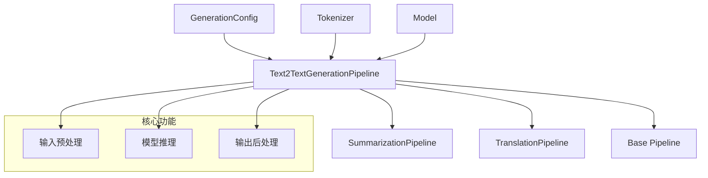
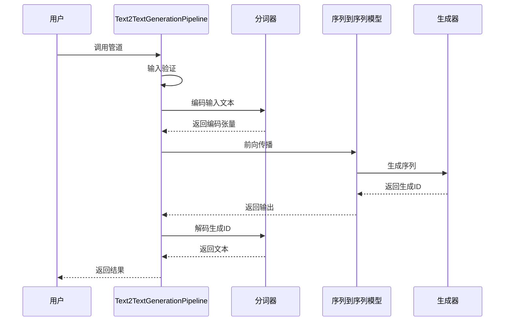
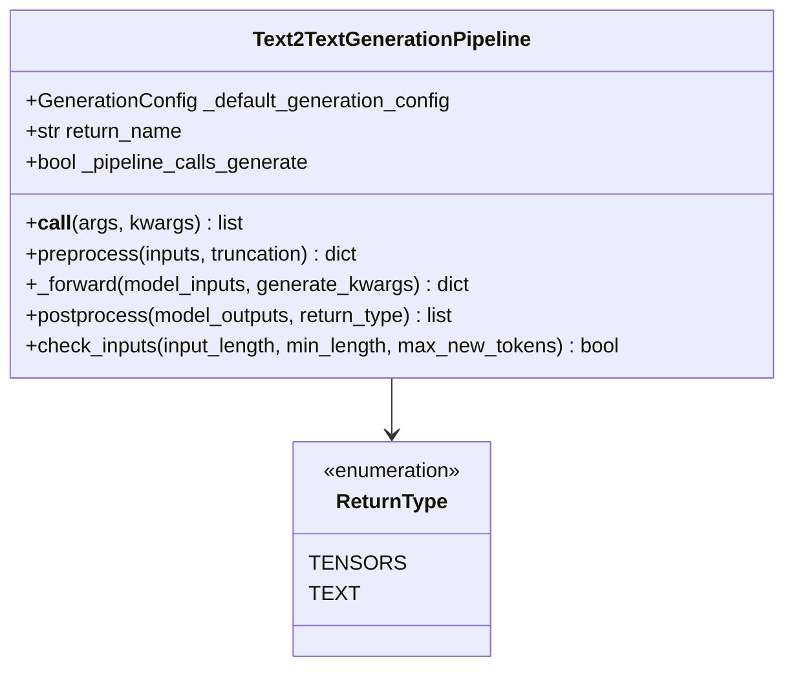
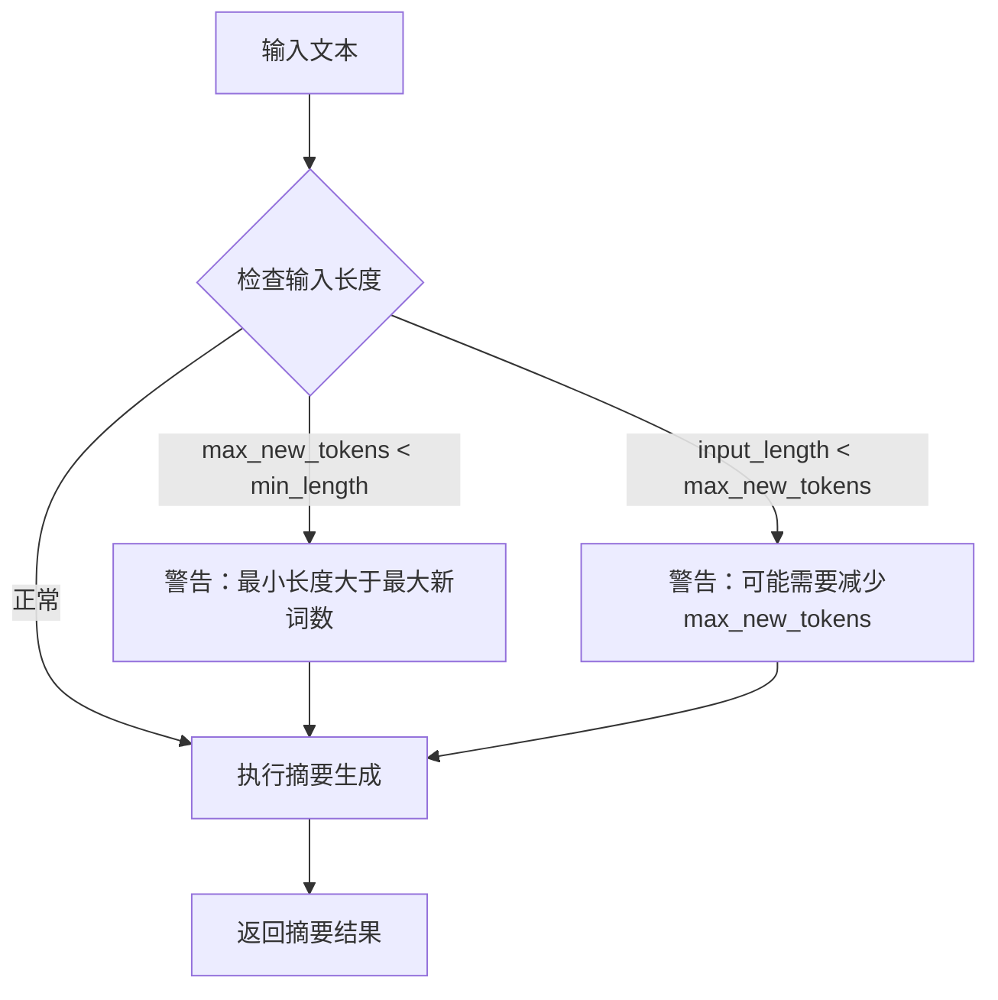
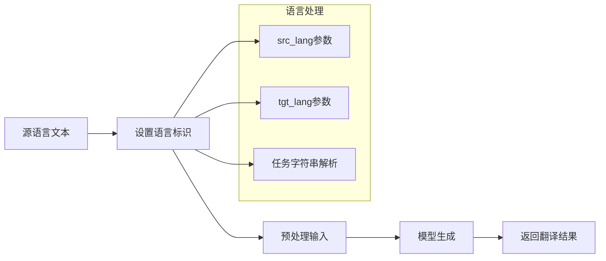
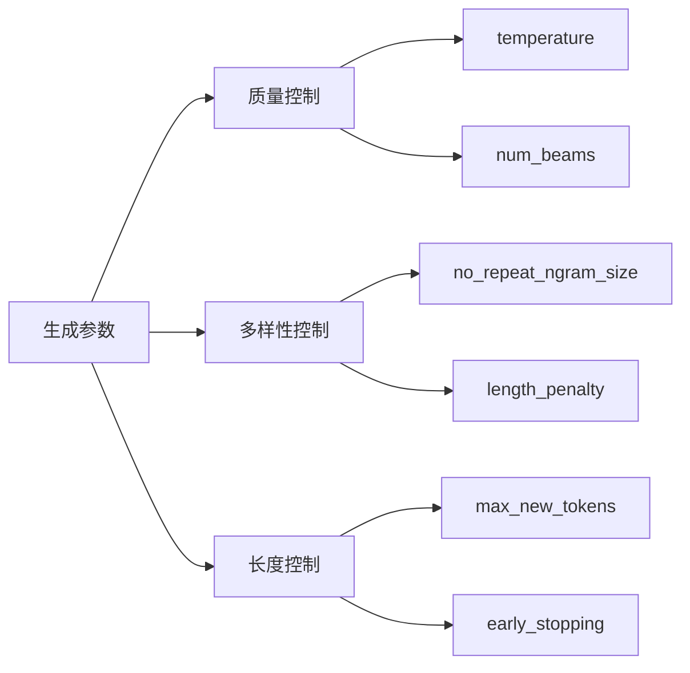

# 文本到文本生成Pipeline

<cite>
**本文档中引用的文件**
- [text2text_generation.py](file://src/transformers/pipelines/text2text_generation.py)
- [run_summarization.py](file://examples/pytorch/summarization/run_summarization.py)
- [run_translation.py](file://examples/pytorch/translation/run_translation.py)
- [run_generation.py](file://examples/pytorch/text-generation/run_generation.py)
</cite>

## 目录
1. [简介](#简介)
2. [项目结构](#项目结构)
3. [核心组件](#核心组件)
4. [架构概览](#架构概览)
5. [详细组件分析](#详细组件分析)
6. [使用场景与示例](#使用场景与示例)
7. [生成参数详解](#生成参数详解)
8. [性能考虑](#性能考虑)
9. [故障排除指南](#故障排除指南)
10. [结论](#结论)

## 简介

Text2TextGenerationPipeline是Hugging Face Transformers库中的一个强大工具，专门用于处理各种文本到文本的转换任务。该Pipeline基于序列到序列（Seq2Seq）模型架构，能够执行机器翻译、文本摘要、语法纠正等多种自然语言处理任务。

该Pipeline继承自基础Pipeline类，提供了统一的接口来处理不同的文本生成任务，同时针对特定任务（如翻译和摘要）进行了优化。它支持多种预训练模型，包括T5、BART、Marian等，在多个NLP任务上表现出色。

## 项目结构

Text2TextGenerationPipeline位于transformers库的管道模块中，具有清晰的层次结构：



**图表来源**
- [text2text_generation.py](file://src/transformers/pipelines/text2text_generation.py#L1-L50)

**章节来源**
- [text2text_generation.py](file://src/transformers/pipelines/text2text_generation.py#L1-L387)

## 核心组件

### 主要类结构

Text2TextGenerationPipeline包含三个主要类，每个都针对特定的任务进行了优化：

1. **Text2TextGenerationPipeline**: 基础管道类，提供通用的文本到文本生成功能
2. **SummarizationPipeline**: 针对文本摘要任务优化的专用管道
3. **TranslationPipeline**: 专门用于多语言翻译的管道

### 默认配置

所有管道都使用以下默认生成配置：
- `max_new_tokens`: 256（最大生成新词数）
- `num_beams`: 4（束搜索数量）

这些参数经过精心调优，能够在质量和速度之间取得良好的平衡。

**章节来源**
- [text2text_generation.py](file://src/transformers/pipelines/text2text_generation.py#L64-L75)

## 架构概览

Text2TextGenerationPipeline采用模块化设计，遵循标准的管道模式：



**图表来源**
- [text2text_generation.py](file://src/transformers/pipelines/text2text_generation.py#L180-L228)

## 详细组件分析

### 基础Text2TextGenerationPipeline

这是最通用的管道实现，适用于各种文本到文本的任务：



**图表来源**
- [text2text_generation.py](file://src/transformers/pipelines/text2text_generation.py#L18-L75)

#### 关键方法分析

1. **输入预处理** (`preprocess`): 将原始文本转换为模型可接受的格式
2. **模型推理** (`_forward`): 调用模型的generate方法生成文本
3. **输出后处理** (`postprocess`): 将生成的token ID解码为人类可读的文本

**章节来源**
- [text2text_generation.py](file://src/transformers/pipelines/text2text_generation.py#L140-L228)

### SummarizationPipeline

专门为文本摘要任务优化的管道：



**图表来源**
- [text2text_generation.py](file://src/transformers/pipelines/text2text_generation.py#L282-L303)

#### 摘要专用特性

SummarizationPipeline具有特殊的输入检查机制，确保生成的摘要长度合理。它会自动检测输入长度与期望的生成长度之间的关系，并给出相应的建议。

**章节来源**
- [text2text_generation.py](file://src/transformers/pipelines/text2text_generation.py#L230-L303)

### TranslationPipeline

专门处理多语言翻译的管道：



**图表来源**
- [text2text_generation.py](file://src/transformers/pipelines/text2text_generation.py#L305-L387)

#### 翻译专用功能

TranslationPipeline支持多种语言标识方式：
- 显式指定`src_lang`和`tgt_lang`参数
- 从任务字符串中解析语言代码
- 使用多语言分词器的特殊功能

**章节来源**
- [text2text_generation.py](file://src/transformers/pipelines/text2text_generation.py#L305-L387)

## 使用场景与示例

### 机器翻译示例

```python
# 基础翻译示例
translator = pipeline("translation_en_to_fr")
result = translator("How old are you?")
print(result[0]['translation_text'])
```

### 文本摘要示例

```python
# 基础摘要示例
summarizer = pipeline("summarization")
text = "新闻文章内容..."
result = summarizer(text, max_length=100, min_length=30)
print(result[0]['summary_text'])
```

### 语法纠正示例

```python
# 语法纠正示例
corrector = pipeline("text2text-generation", model="mrm8488/t5-base-finetuned-question-generation-ap")
result = corrector("answer: Manuel context: Manuel has created RuPERTa-base with the support of HF-Transformers and Google")
print(result[0]['generated_text'])
```

### 高级配置示例

```python
# 高级配置示例
generator = pipeline("text2text-generation")
result = generator(
    "Translate the following English text to French: Hello, how are you?",
    max_new_tokens=50,
    num_beams=5,
    early_stopping=True,
    temperature=0.7
)
```

**章节来源**
- [text2text_generation.py](file://src/transformers/pipelines/text2text_generation.py#L43-L62)

## 生成参数详解

### 关键生成参数

Text2TextGenerationPipeline支持丰富的生成参数来控制输出质量：

| 参数名称 | 类型 | 默认值 | 描述 |
|---------|------|--------|------|
| `max_new_tokens` | int | 256 | 生成的最大新词数 |
| `num_beams` | int | 4 | 束搜索的数量，影响生成质量和多样性 |
| `length_penalty` | float | 1.0 | 长度惩罚因子，控制生成长度 |
| `no_repeat_ngram_size` | int | 3 | 避免重复n-gram的大小 |
| `early_stopping` | bool | False | 是否提前停止生成 |
| `temperature` | float | 1.0 | 温度参数，控制随机性 |

### 参数对生成质量的影响



#### 参数调优指南

1. **提高质量**: 增加`num_beams`，降低`temperature`
2. **增加多样性**: 提高`no_repeat_ngram_size`，调整`length_penalty`
3. **控制长度**: 合理设置`max_new_tokens`和`early_stopping`

**章节来源**
- [text2text_generation.py](file://src/transformers/pipelines/text2text_generation.py#L64-L75)

## 性能考虑

### 内存优化

Text2TextGenerationPipeline在处理长文本时需要注意内存使用：

1. **批处理大小**: 控制同时处理的样本数量
2. **序列长度**: 限制输入和输出序列的最大长度
3. **模型量化**: 使用量化技术减少内存占用

### 推理加速

1. **束搜索优化**: 合理设置`num_beams`以平衡质量和速度
2. **提前停止**: 使用`early_stopping`避免不必要的计算
3. **缓存利用**: 充分利用模型的KV缓存机制

### 批处理策略

对于大量文本的处理，建议采用批处理策略：

```python
# 批处理示例
texts = ["文本1", "文本2", "文本3"]
results = generator(texts, batch_size=4)
```

## 故障排除指南

### 常见问题及解决方案

#### 1. 生成内容不完整

**症状**: 输出文本过短或提前结束
**原因**: `max_new_tokens`设置过小
**解决方案**: 增加`max_new_tokens`值或启用`early_stopping`

#### 2. 语义偏差严重

**症状**: 生成内容与输入主题无关
**原因**: 模型配置不当或输入格式错误
**解决方案**: 
- 检查输入格式是否符合模型要求
- 调整`temperature`参数
- 使用更合适的预训练模型

#### 3. 重复内容过多

**症状**: 生成文本中出现重复片段
**原因**: `no_repeat_ngram_size`设置过小
**解决方案**: 增大`no_repeat_ngram_size`参数

#### 4. 内存不足

**症状**: 处理大型文本时出现内存溢出
**解决方案**:
- 减少批处理大小
- 截断过长的输入文本
- 使用梯度累积

### 调试技巧

1. **逐步调试**: 从简单输入开始，逐步增加复杂度
2. **参数监控**: 记录不同参数组合的效果
3. **可视化分析**: 使用注意力权重分析生成过程

**章节来源**
- [text2text_generation.py](file://src/transformers/pipelines/text2text_generation.py#L282-L303)

## 结论

Text2TextGenerationPipeline是Hugging Face Transformers库中一个功能强大且灵活的工具，适用于各种文本到文本的转换任务。通过合理的参数配置和使用技巧，用户可以在机器翻译、文本摘要、语法纠正等多个领域获得高质量的输出。

该Pipeline的设计体现了现代NLP系统的关键原则：模块化、可扩展性和易用性。无论是初学者还是高级用户，都能通过这个统一的接口访问复杂的深度学习模型能力。

随着模型技术的不断发展，Text2TextGenerationPipeline将继续演进，为用户提供更好的性能和更多的功能选项。建议用户关注最新的模型更新和最佳实践，以充分利用这个强大的工具。