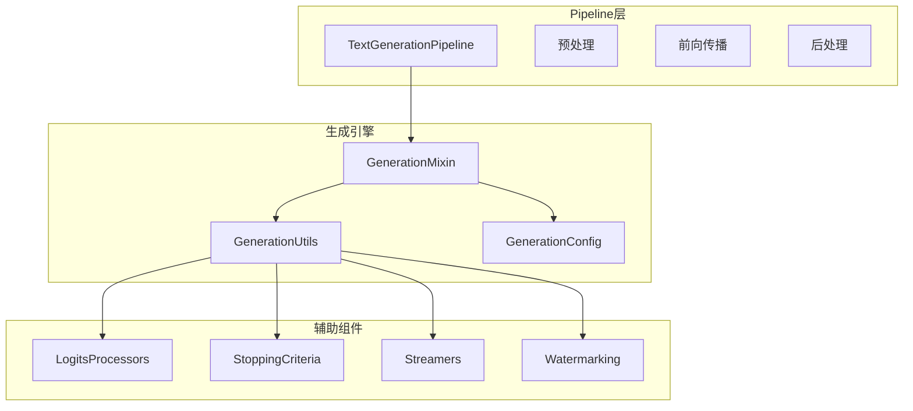
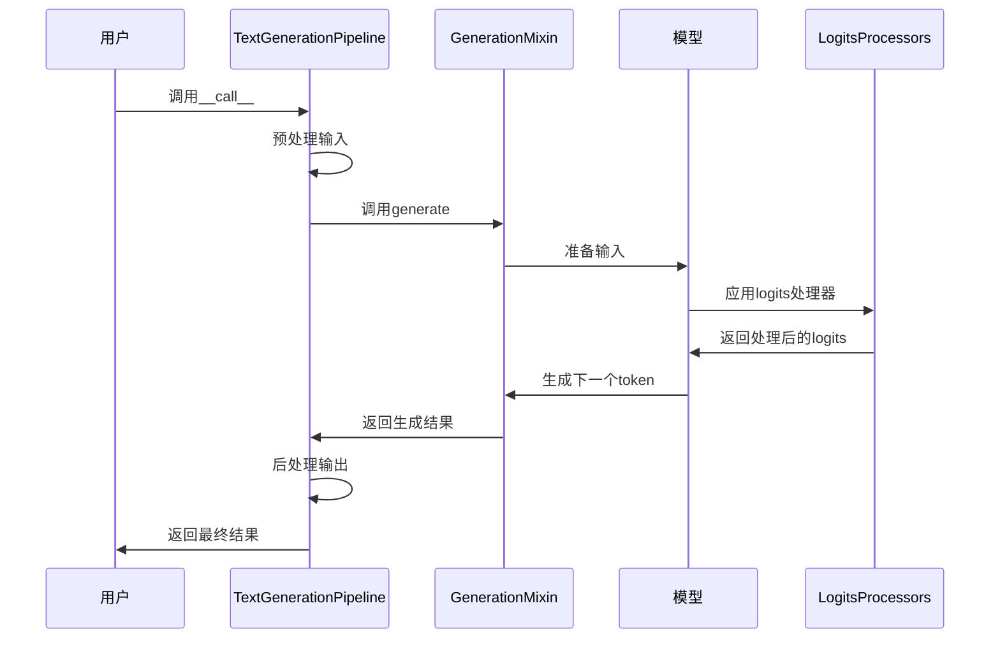
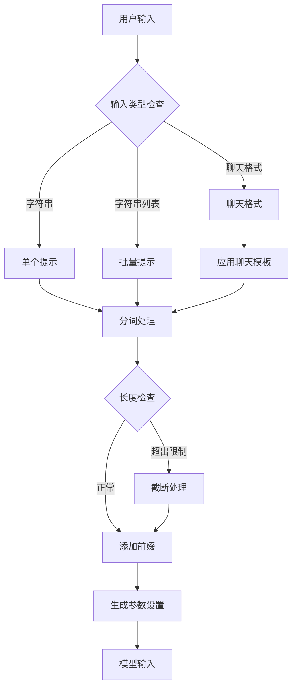
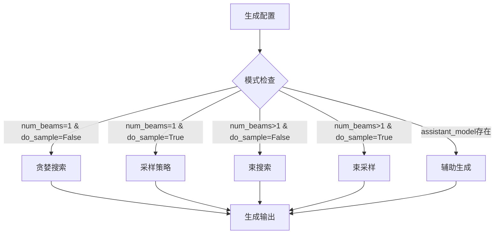
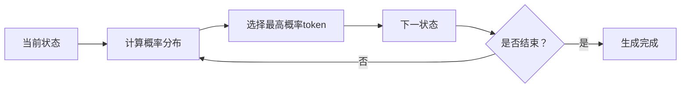
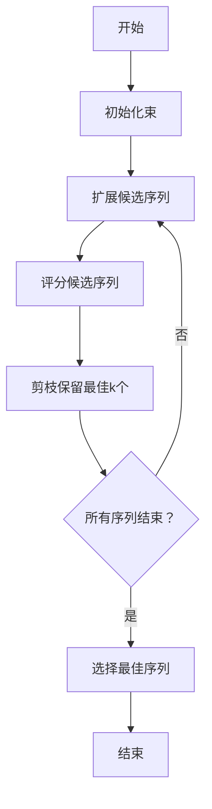
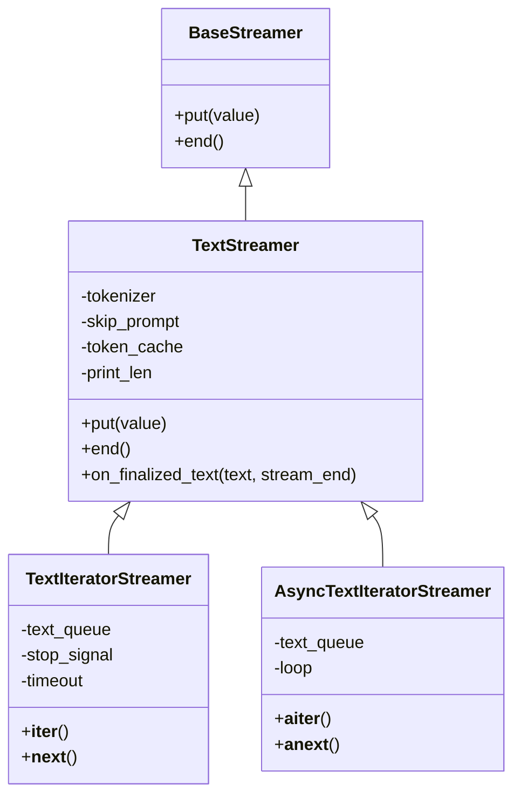
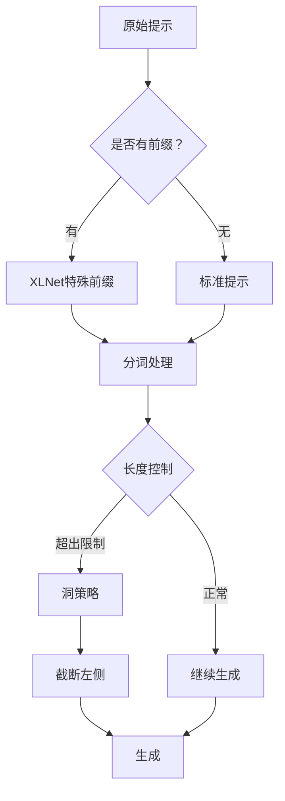
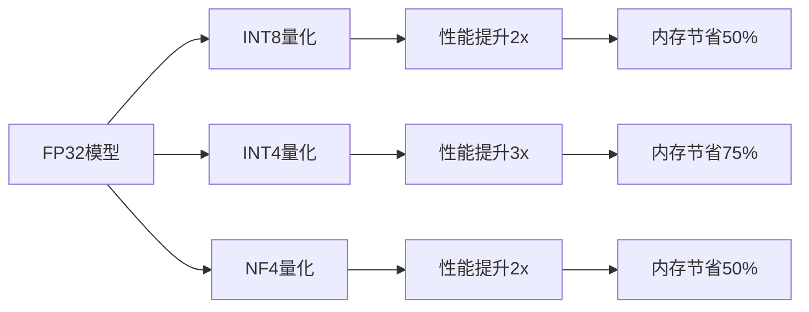

# 文本生成Pipeline

<cite>
**本文档中引用的文件**
- [text_generation.py](file://src/transformers/pipelines/text_generation.py)
- [utils.py](file://src/transformers/generation/utils.py)
- [configuration_utils.py](file://src/transformers/generation/configuration_utils.py)
- [run_generation.py](file://examples/pytorch/text-generation/run_generation.py)
- [streamers.py](file://src/transformers/generation/streamers.py)
- [watermarking.py](file://src/transformers/generation/watermarking.py)
- [logits_process.py](file://src/transformers/generation/logits_process.py)
- [stopping_criteria.py](file://src/transformers/generation/stopping_criteria.py)
</cite>

## 目录
1. [简介](#简介)
2. [项目结构](#项目结构)
3. [核心组件](#核心组件)
4. [架构概览](#架构概览)
5. [详细组件分析](#详细组件分析)
6. [生成策略详解](#生成策略详解)
7. [高级特性](#高级特性)
8. [性能考虑](#性能考虑)
9. [故障排除指南](#故障排除指南)
10. [结论](#结论)

## 简介

TextGenerationPipeline是Hugging Face Transformers库中的核心组件，专门用于处理各种文本生成任务。它基于`ModelWithLMHead`或`ModelForCausalLM`模型，能够预测指定文本提示之后将出现的单词。该管道支持多种生成策略，从简单的贪婪搜索到复杂的束搜索和采样方法，为用户提供了灵活而强大的文本生成能力。

该Pipeline不仅支持传统的文本补全任务，还特别针对对话系统进行了优化，可以处理聊天格式的输入。通过精心设计的参数控制系统，用户可以在生成质量和速度之间找到最佳平衡点。

## 项目结构

TextGenerationPipeline的实现分布在多个模块中，形成了一个层次化的架构：



**图表来源**
- [text_generation.py](file://src/transformers/pipelines/text_generation.py#L1-L540)
- [utils.py](file://src/transformers/generation/utils.py#L1-L800)
- [configuration_utils.py](file://src/transformers/generation/configuration_utils.py#L1-L800)

**章节来源**
- [text_generation.py](file://src/transformers/pipelines/text_generation.py#L1-L100)
- [utils.py](file://src/transformers/generation/utils.py#L1-L200)

## 核心组件

### TextGenerationPipeline类

TextGenerationPipeline是整个文本生成系统的核心入口点，继承自基础Pipeline类并添加了特定的文本生成功能。

主要特性：
- 支持单个字符串、字符串列表和聊天格式输入
- 自动处理模型类型检查和配置加载
- 提供统一的接口来调用底层的生成方法

### GenerationConfig配置系统

GenerationConfig类提供了完整的生成参数控制机制：

| 参数类别 | 主要参数 | 默认值 | 描述 |
|---------|---------|--------|------|
| 长度控制 | `max_new_tokens`, `min_new_tokens` | - | 控制生成序列的长度范围 |
| 采样策略 | `do_sample`, `temperature`, `top_k`, `top_p` | `do_sample=True, temperature=0.7` | 控制生成的随机性和多样性 |
| 束搜索 | `num_beams`, `early_stopping`, `length_penalty` | `num_beams=1` | 控制束搜索的行为 |
| 重复控制 | `repetition_penalty`, `no_repeat_ngram_size` | `repetition_penalty=1.0` | 防止重复内容生成 |

**章节来源**
- [text_generation.py](file://src/transformers/pipelines/text_generation.py#L100-L200)
- [configuration_utils.py](file://src/transformers/generation/configuration_utils.py#L100-L400)

## 架构概览

TextGenerationPipeline采用分层架构设计，确保了良好的可扩展性和维护性：



**图表来源**
- [text_generation.py](file://src/transformers/pipelines/text_generation.py#L300-L400)
- [utils.py](file://src/transformers/generation/utils.py#L400-L600)

## 详细组件分析

### 输入预处理机制

TextGenerationPipeline的预处理阶段负责将用户输入转换为模型可接受的格式：



**图表来源**
- [text_generation.py](file://src/transformers/pipelines/text_generation.py#L400-L500)

### 生成算法选择

系统根据配置自动选择最适合的生成算法：



**图表来源**
- [configuration_utils.py](file://src/transformers/generation/configuration_utils.py#L475-L501)
- [utils.py](file://src/transformers/generation/utils.py#L100-L200)

**章节来源**
- [text_generation.py](file://src/transformers/pipelines/text_generation.py#L200-L400)
- [configuration_utils.py](file://src/transformers/generation/configuration_utils.py#L400-L600)

## 生成策略详解

### 贪婪搜索（Greedy Search）

贪婪搜索是最简单的生成策略，每次选择概率最高的token：



特点：
- 确定性：相同的输入总是产生相同的结果
- 速度快：不需要采样操作
- 可能缺乏多样性：容易陷入重复模式

### 采样策略（Sampling）

采样策略引入随机性，提高生成的多样性：

| 参数 | 类型 | 默认值 | 影响 |
|------|------|--------|------|
| `temperature` | float | 1.0 | 温度越低，分布越尖锐；温度越高，分布越平坦 |
| `top_k` | int | 50 | 只考虑概率最高的k个token |
| `top_p` | float | 1.0 | 只考虑累积概率达到p的最小token集合 |
| `repetition_penalty` | float | 1.0 | 惩罚重复token的概率 |

### 束搜索（Beam Search）

束搜索在保持确定性的同时提供更好的质量：



优势：
- 质量更高：通过搜索多个候选序列
- 更好的连贯性：避免局部最优解
- 可控性强：通过束大小控制搜索空间

**章节来源**
- [utils.py](file://src/transformers/generation/utils.py#L3000-L3500)
- [configuration_utils.py](file://src/transformers/generation/configuration_utils.py#L350-L450)

## 高级特性

### 流式生成

TextGenerationPipeline支持实时流式生成，特别适用于交互式应用：



**图表来源**
- [streamers.py](file://src/transformers/generation/streamers.py#L1-L319)

### 停止条件

系统提供了多种停止生成的机制：

| 停止条件类型 | 参数 | 描述 |
|-------------|------|------|
| 最大长度 | `max_length` | 生成序列的最大长度 |
| 最大时间 | `max_time` | 生成的最大时间限制 |
| 特定字符串 | `stop_strings` | 包含特定字符串时停止 |
| EOS标记 | `eos_token_id` | 遇到结束标记时停止 |

### 提示工程技术

TextGenerationPipeline内置了多种提示工程技术：



**图表来源**
- [text_generation.py](file://src/transformers/pipelines/text_generation.py#L500-L540)

**章节来源**
- [streamers.py](file://src/transformers/generation/streamers.py#L50-L200)
- [stopping_criteria.py](file://src/transformers/generation/stopping_criteria.py#L100-L200)

## 性能考虑

### 缓存机制

为了提高生成效率，系统实现了多种缓存策略：

| 缓存类型 | 适用场景 | 性能提升 |
|----------|----------|----------|
| 动态缓存 | 一般推理 | 20-30% |
| 静态缓存 | 固定序列长度 | 40-50% |
| 分页缓存 | 大序列处理 | 显著减少内存占用 |

### 批处理优化

系统支持高效的批处理生成，通过以下技术提升性能：

- 动态批处理：根据序列长度动态调整批次大小
- 异步生成：使用多线程处理不同批次
- 内存池管理：重用张量分配以减少内存碎片

### 模型量化支持

TextGenerationPipeline支持多种量化技术：



## 故障排除指南

### 常见问题及解决方案

#### 生成质量问题

**问题**：生成的文本重复或缺乏连贯性
**解决方案**：
1. 调整`temperature`参数（推荐0.7-1.0）
2. 使用`repetition_penalty`防止重复
3. 增加`no_repeat_ngram_size`避免n-gram重复

#### 响应时间过长

**问题**：生成过程耗时过长
**解决方案**：
1. 减少`max_new_tokens`限制
2. 使用更小的`num_beams`（束搜索）
3. 启用GPU加速和混合精度
4. 考虑使用辅助生成模型

#### 内存不足

**问题**：生成过程中出现内存溢出
**解决方案**：
1. 启用分页注意力缓存
2. 减少批次大小
3. 使用梯度检查点
4. 考虑模型量化

### 调试技巧

#### 生成过程监控

```python
# 启用详细日志
import logging
logging.basicConfig(level=logging.DEBUG)

# 监控生成进度
outputs = model.generate(
    **inputs,
    output_scores=True,      # 记录每个步骤的分数
    output_attentions=True,  # 记录注意力权重
    return_dict_in_generate=True
)
```

#### 性能分析

```python
# 性能基准测试
import time
start_time = time.time()
outputs = model.generate(**inputs)
end_time = time.time()
print(f"生成耗时: {end_time - start_time:.2f}秒")
```

**章节来源**
- [utils.py](file://src/transformers/generation/utils.py#L1300-L1400)
- [configuration_utils.py](file://src/transformers/generation/configuration_utils.py#L600-L700)

## 结论

TextGenerationPipeline作为Hugging Face Transformers库的核心组件，提供了强大而灵活的文本生成功能。通过精心设计的架构和丰富的配置选项，它能够满足从简单文本补全到复杂对话系统的各种需求。

该Pipeline的主要优势包括：

1. **易用性**：简洁的API设计，支持多种输入格式
2. **灵活性**：丰富的生成策略和参数控制
3. **性能**：优化的缓存机制和批处理支持
4. **可扩展性**：模块化设计便于定制和扩展

对于初学者，建议从简单的贪婪搜索开始，逐步探索采样和束搜索等高级功能。对于高级用户，可以深入研究各种参数调优技巧，以及结合流式生成和停止条件等高级特性来构建生产级的应用系统。

随着技术的不断发展，TextGenerationPipeline将继续演进，为用户提供更加智能和高效的文本生成体验。