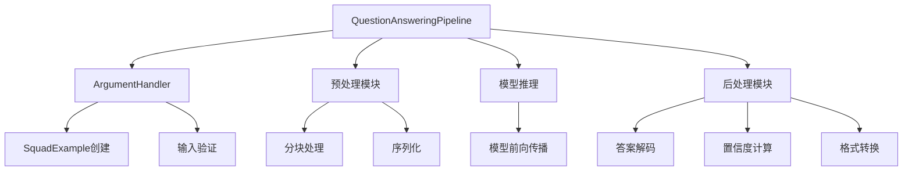
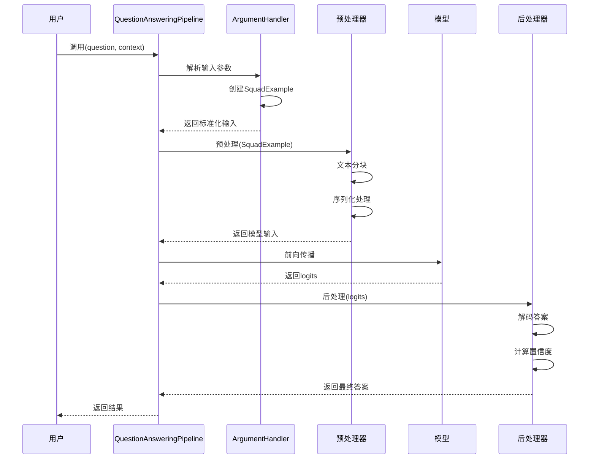
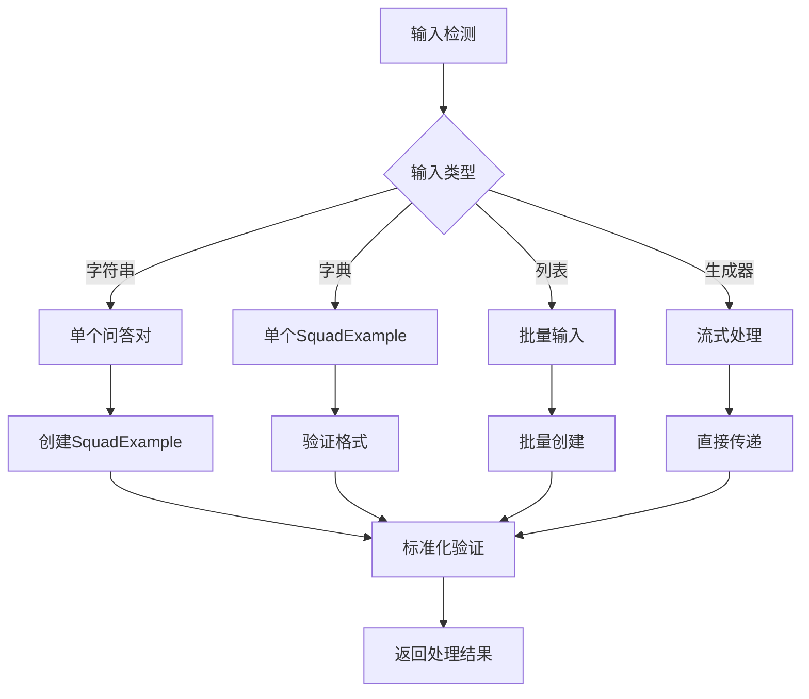
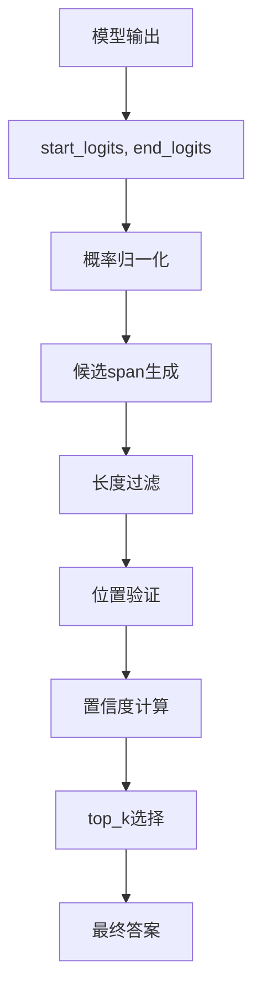

# 问答Pipeline

<cite>
**本文档中引用的文件**
- [question_answering.py](file://src/transformers/pipelines/question_answering.py)
- [test_pipelines_question_answering.py](file://tests/pipelines/test_pipelines_question_answering.py)
- [squad.py](file://src/transformers/data/processors/squad.py)
- [run_qa.py](file://examples/pytorch/question-answering/run_qa.py)
- [__init__.py](file://src/transformers/pipelines/__init__.py)
</cite>

## 目录
1. [简介](#简介)
2. [项目结构](#项目结构)
3. [核心组件](#核心组件)
4. [架构概览](#架构概览)
5. [详细组件分析](#详细组件分析)
6. [参数配置详解](#参数配置详解)
7. [输出结果格式](#输出结果格式)
8. [使用场景与示例](#使用场景与示例)
9. [高级功能](#高级功能)
10. [故障排除指南](#故障排除指南)
11. [总结](#总结)

## 简介

QuestionAnsweringPipeline是Hugging Face Transformers库中的一个强大组件，专门用于执行抽取式问答任务。该管道能够从给定的上下文中提取准确的答案，支持单跳和多跳问答场景，并提供了丰富的配置选项来处理各种复杂情况。

### 主要特性

- **抽取式问答**：直接从文本中提取答案片段
- **多种输入格式**：支持字符串、字典和批量输入
- **长上下文处理**：通过文档分块策略处理超长文本
- **答案质量控制**：提供置信度评分和答案长度限制
- **不可回答情况处理**：可配置是否接受无法回答的情况
- **多答案候选**：支持返回多个可能的答案候选

## 项目结构



**图表来源**
- [question_answering.py](file://src/transformers/pipelines/question_answering.py#L169-L274)

**章节来源**
- [question_answering.py](file://src/transformers/pipelines/question_answering.py#L1-L50)

## 核心组件

### QuestionAnsweringPipeline类

这是问答管道的主要入口点，继承自`ChunkPipeline`，负责协调整个问答流程。

### QuestionAnsweringArgumentHandler类

专门处理输入参数的解析和标准化，支持多种输入格式：
- 字符串对（问题-上下文）
- 字典格式
- 批量输入列表

### SquadExample和SquadFeatures

数据结构定义：
- **SquadExample**：存储问题、上下文和答案信息
- **SquadFeatures**：模型输入特征，包括token ID、注意力掩码等

**章节来源**
- [question_answering.py](file://src/transformers/pipelines/question_answering.py#L169-L274)
- [squad.py](file://src/transformers/data/processors/squad.py#L565-L656)

## 架构概览



**图表来源**
- [question_answering.py](file://src/transformers/pipelines/question_answering.py#L359-L386)
- [question_answering.py](file://src/transformers/pipelines/question_answering.py#L400-L450)

## 详细组件分析

### 输入处理机制



**图表来源**
- [question_answering.py](file://src/transformers/pipelines/question_answering.py#L169-L200)

### 长上下文处理策略

对于超长上下文，系统采用滑动窗口策略：


**图表来源**
- [question_answering.py](file://src/transformers/pipelines/question_answering.py#L400-L450)

### 答案解码算法



**图表来源**
- [question_answering.py](file://src/transformers/pipelines/question_answering.py#L100-L168)

**章节来源**
- [question_answering.py](file://src/transformers/pipelines/question_answering.py#L100-L168)
- [question_answering.py](file://src/transformers/pipelines/question_answering.py#L169-L200)

## 参数配置详解

### 关键参数说明

| 参数名 | 类型 | 默认值 | 描述 |
|--------|------|--------|------|
| `top_k` | int | 1 | 返回的答案数量，按置信度排序 |
| `max_answer_len` | int | 15 | 最大答案长度限制 |
| `doc_stride` | int | 128 | 文档分块重叠大小 |
| `max_seq_len` | int | 384 | 单个序列最大长度 |
| `max_question_len` | int | 64 | 问题最大长度 |
| `handle_impossible_answer` | bool | False | 是否允许返回空答案 |
| `align_to_words` | bool | True | 是否对齐到词边界 |

### 参数配置示例

#### 基础配置
```python
# 基本问答
result = pipeline("question-answering")(
    question="什么是人工智能？",
    context="人工智能是计算机科学的一个分支，致力于创造智能机器。"
)
```

#### 高级配置
```python
# 多答案候选
results = pipeline("question-answering")(
    question="人工智能的应用领域有哪些？",
    context="人工智能广泛应用于医疗诊断、自动驾驶、金融分析等领域。",
    top_k=3,
    max_answer_len=50
)

# 长文档处理
result = pipeline("question-answering")(
    question="人工智能的发展历史是什么？",
    context="人工智能的发展可以追溯到20世纪50年代..." * 10,
    doc_stride=64,
    max_seq_len=512
)
```

**章节来源**
- [question_answering.py](file://src/transformers/pipelines/question_answering.py#L295-L359)

## 输出结果格式

### 标准输出格式

每个答案包含以下字段：

| 字段名 | 类型 | 描述 |
|--------|------|------|
| `answer` | str | 提取的答案文本 |
| `score` | float | 置信度分数（0-1） |
| `start` | int | 答案在上下文中的起始字符索引 |
| `end` | int | 答案在上下文中的结束字符索引 |

### 输出示例

```python
# 单答案输出
{
    'answer': '计算机科学',
    'score': 0.95,
    'start': 12,
    'end': 24
}

# 多答案输出
[
    {
        'answer': '计算机科学的一个分支',
        'score': 0.92,
        'start': 12,
        'end': 32
    },
    {
        'answer': 'AI',
        'score': 0.85,
        'start': 0,
        'end': 2
    }
]
```

### 不可回答情况处理

当`handle_impossible_answer=True`时，系统会返回一个特殊的空答案：

```python
{
    'answer': '',
    'score': 0.1,  # 最小null分数
    'start': 0,
    'end': 0
}
```

**章节来源**
- [question_answering.py](file://src/transformers/pipelines/question_answering.py#L359-L386)
- [question_answering.py](file://src/transformers/pipelines/question_answering.py#L597-L623)

## 使用场景与示例

### 基础问答场景

#### 单个问答对
```python
from transformers import pipeline

qa_pipeline = pipeline("question-answering")

# 基本问答
result = qa_pipeline(
    question="爱因斯坦获得了什么奖项？",
    context="阿尔伯特·爱因斯坦是一位著名的物理学家，他于1921年获得诺贝尔物理学奖。"
)
print(result)
# 输出: {'answer': '诺贝尔物理学奖', 'score': 0.98, 'start': 35, 'end': 45}
```

#### 批量问答
```python
questions = [
    "爱因斯坦的全名是什么？",
    "爱因斯坦在哪一年获得诺贝尔奖？",
    "相对论是谁提出的？"
]

contexts = [
    "阿尔伯特·爱因斯坦是一位著名的物理学家，他于1921年获得诺贝尔物理学奖。",
    "阿尔伯特·爱因斯坦是一位著名的物理学家，他于1921年获得诺贝尔物理学奖。",
    "阿尔伯特·爱因斯坦是一位著名的物理学家，他于1921年获得诺贝尔物理学奖。"
]

results = qa_pipeline(question=questions, context=contexts)
for i, result in enumerate(results):
    print(f"问题{i+1}: {questions[i]}")
    print(f"答案: {result['answer']}")
    print(f"置信度: {result['score']:.3f}")
    print("---")
```

### 高级应用场景

#### 多跳问答模拟
```python
# 通过连续问答实现多跳推理
context = """
北京是中国的首都，位于华北平原的北部。故宫位于北京市中心，是明清两代的皇宫。
天安门广场位于故宫南侧，是世界上最大的城市广场之一。
"""

# 第一步：询问北京的位置
step1_result = qa_pipeline(
    question="北京位于哪里？",
    context=context
)
print(f"第一步答案: {step1_result['answer']}")

# 第二步：基于第一步结果进行推理
step2_result = qa_pipeline(
    question="天安门广场在哪里？",
    context=f"根据前面的信息，北京位于{step1_result['answer']}。{context}"
)
print(f"第二步答案: {step2_result['answer']}")
```

#### 长文档问答
```python
# 处理长文档
long_context = "人工智能的历史可以追溯到古代..." * 50

result = qa_pipeline(
    question="人工智能的起源是什么时候？",
    context=long_context,
    doc_stride=100,  # 更大的重叠
    max_seq_len=512,  # 更大的序列长度
    max_answer_len=100  # 允许更长的答案
)
```

**章节来源**
- [test_pipelines_question_answering.py](file://tests/pipelines/test_pipelines_question_answering.py#L80-L154)

## 高级功能

### 答案验证与去重

系统内置了答案去重机制，避免重复答案：

```python
# 多个相似答案会被合并
results = qa_pipeline(
    question="爱因斯坦的成就有哪些？",
    context="爱因斯坦提出了相对论，获得了诺贝尔奖，对量子力学有重要贡献。",
    top_k=10
)

# 自动去重相同或相似的答案
unique_answers = []
for result in results:
    if not any(r['answer'].lower() == result['answer'].lower() for r in unique_answers):
        unique_answers.append(result)
```

### 自定义模型加载

```python
from transformers import pipeline, AutoModelForQuestionAnswering, AutoTokenizer

# 加载特定模型
model_name = "distilbert-base-cased-distilled-squad"
model = AutoModelForQuestionAnswering.from_pretrained(model_name)
tokenizer = AutoTokenizer.from_pretrained(model_name)

qa_pipeline = pipeline(
    "question-answering",
    model=model,
    tokenizer=tokenizer
)

result = qa_pipeline(
    question="什么是深度学习？",
    context="深度学习是机器学习的一个分支，使用深层神经网络..."
)
```

### 性能优化配置

```python
# 使用GPU加速
import torch
device = 0 if torch.cuda.is_available() else -1

qa_pipeline = pipeline(
    "question-answering",
    model="distilbert-base-cased-distilled-squad",
    device=device
)

# 批量处理优化
results = qa_pipeline(
    question=["问题1", "问题2", "问题3"],
    context="相同的上下文" * 10,
    batch_size=4  # 批量大小
)
```

**章节来源**
- [question_answering.py](file://src/transformers/pipelines/question_answering.py#L597-L623)

## 故障排除指南

### 常见问题及解决方案

#### 1. 上下文过长导致的问题

**问题**：长上下文无法正确处理
```python
# 错误示例
result = qa_pipeline(
    question="问题",
    context="非常长的上下文..." * 100
)
```

**解决方案**：
```python
# 正确配置
result = qa_pipeline(
    question="问题",
    context="非常长的上下文..." * 100,
    doc_stride=64,      # 减小重叠
    max_seq_len=512,    # 增加序列长度
    max_answer_len=100  # 允许更长答案
)
```

#### 2. 无法找到答案的情况

**问题**：模型无法从上下文中提取答案
```python
# 可能的原因：
# - 问题与上下文不相关
# - 答案不在上下文中
# - 模型能力有限
```

**解决方案**：
```python
# 启用不可回答模式
result = qa_pipeline(
    question="无法回答的问题",
    context="相关的上下文信息",
    handle_impossible_answer=True
)

# 检查置信度阈值
if result['score'] < 0.5:
    print("低置信度，可能无法回答")
```

#### 3. 多答案候选问题

**问题**：返回太多或太少的答案

```python
# 调整top_k参数
results = qa_pipeline(
    question="问题",
    context="上下文",
    top_k=5  # 增加候选数量
)

# 过滤低置信度答案
filtered_results = [r for r in results if r['score'] > 0.3]
```

#### 4. 内存和性能问题

**问题**：大批量处理时内存不足

**解决方案**：
```python
# 分批处理
batch_size = 8
for i in range(0, len(questions), batch_size):
    batch_questions = questions[i:i+batch_size]
    batch_contexts = contexts[i:i+batch_size]
    
    results = qa_pipeline(
        question=batch_questions,
        context=batch_contexts,
        batch_size=4  # 更小的批次
    )
```

### 调试技巧

#### 1. 查看中间结果
```python
# 启用详细日志
import logging
logging.basicConfig(level=logging.DEBUG)

# 分步调试
from transformers import pipeline
import torch

# 创建管道
qa = pipeline("question-answering")

# 预处理阶段
example = qa._args_parser(question="问题", context="上下文")
preprocessed = qa.preprocess(example[0])

# 模型推理阶段
model_output = qa._forward(preprocessed[0])

# 后处理阶段
final_result = qa.postprocess([model_output])
```

#### 2. 参数调优指南

| 场景 | 推荐参数 | 说明 |
|------|----------|------|
| 短文档问答 | `doc_stride=128, max_seq_len=384` | 标准配置 |
| 长文档问答 | `doc_stride=64, max_seq_len=512` | 增大重叠和序列长度 |
| 快速推理 | `top_k=1, max_answer_len=10` | 减少计算量 |
| 高精度 | `top_k=5, max_answer_len=50` | 增加候选和答案长度 |

**章节来源**
- [test_pipelines_question_answering.py](file://tests/pipelines/test_pipelines_question_answering.py#L128-L154)
- [question_answering.py](file://src/transformers/pipelines/question_answering.py#L400-L450)

## 总结

QuestionAnsweringPipeline是Hugging Face Transformers库中功能强大的问答工具，具有以下核心优势：

### 主要优势

1. **易用性**：简洁的API设计，支持多种输入格式
2. **灵活性**：丰富的参数配置，适应不同应用场景
3. **鲁棒性**：完善的错误处理和边界情况处理
4. **扩展性**：支持自定义模型和高级功能

### 最佳实践建议

1. **合理配置参数**：根据具体任务调整`top_k`、`max_answer_len`等参数
2. **处理长文档**：适当设置`doc_stride`和`max_seq_len`
3. **质量控制**：利用置信度分数筛选高质量答案
4. **批量优化**：在处理大量数据时使用适当的`batch_size`

### 发展方向

随着大语言模型的发展，问答Pipeline将继续演进，可能的方向包括：
- 支持更多类型的问答任务（阅读理解、对话问答等）
- 集成上下文记忆和推理能力
- 提供更细粒度的控制选项
- 优化性能和资源利用率

通过深入理解和合理运用QuestionAnsweringPipeline，开发者可以构建出高效、准确的问答系统，满足各种实际应用需求。