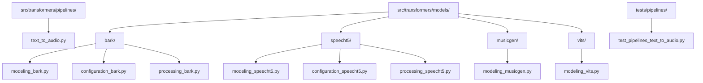
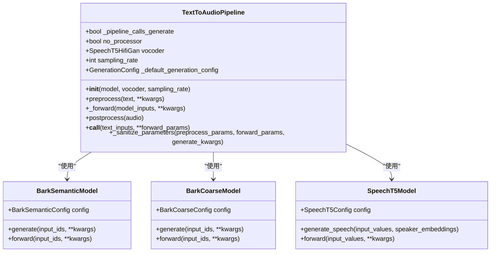
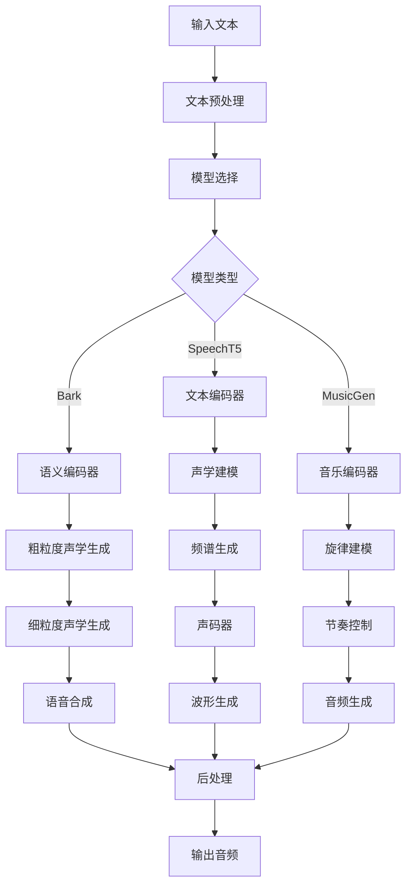
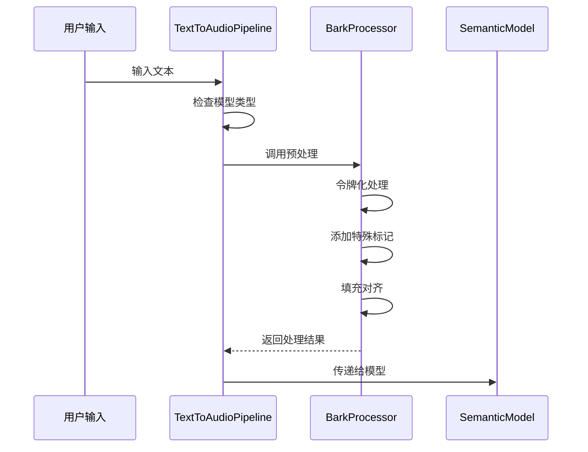
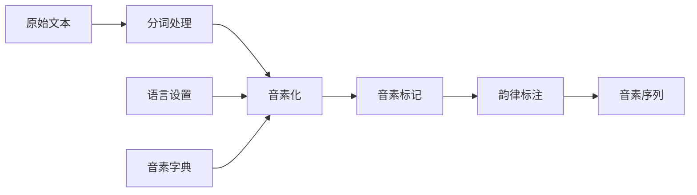
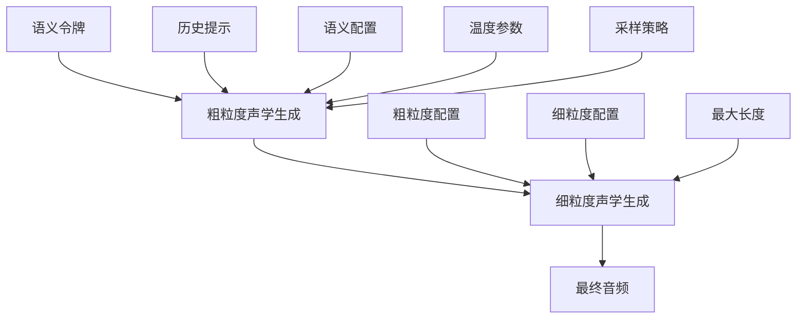
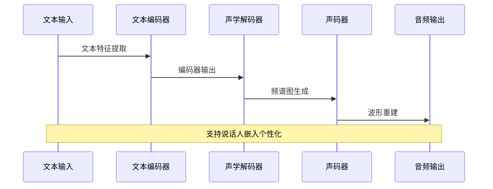
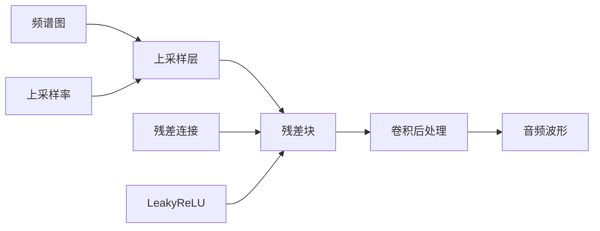
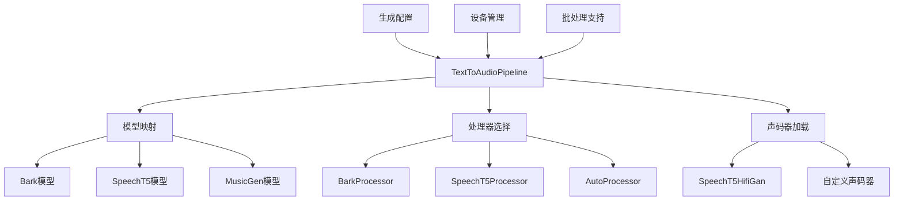

# 文本到音频生成Pipeline

<cite>
**本文档中引用的文件**
- [text_to_audio.py](file://src/transformers/pipelines/text_to_audio.py)
- [modeling_bark.py](file://src/transformers/models/bark/modeling_bark.py)
- [modeling_speecht5.py](file://src/transformers/models/speecht5/modeling_speecht5.py)
- [configuration_bark.py](file://src/transformers/models/bark/configuration_bark.py)
- [configuration_speecht5.py](file://src/transformers/models/speecht5/configuration_speecht5.py)
- [generation_configuration_bark.py](file://src/transformers/models/bark/generation_configuration_bark.py)
- [processing_bark.py](file://src/transformers/models/bark/processing_bark.py)
- [test_pipelines_text_to_audio.py](file://tests/pipelines/test_pipelines_text_to_audio.py)
- [tokenization_wav2vec2_phoneme.py](file://src/transformers/models/wav2vec2_phoneme/tokenization_wav2vec2_phoneme.py)
</cite>

## 目录
1. [简介](#简介)
2. [项目结构](#项目结构)
3. [核心组件](#核心组件)
4. [架构概览](#架构概览)
5. [详细组件分析](#详细组件分析)
6. [依赖关系分析](#依赖关系分析)
7. [性能考虑](#性能考虑)
8. [故障排除指南](#故障排除指南)
9. [结论](#结论)

## 简介

文本到音频生成Pipeline是Transformers库中一个强大的组件，能够将输入文本转换为自然语音。该Pipeline支持多种先进的语音合成模型，包括SpeechT5、Bark、MusicGen等，为开发者提供了从基础语音生成到高级语音克隆的完整解决方案。

本文档深入解析了TextToAudioPipeline的架构设计，详细说明了文本编码、声学建模和波形生成三个核心阶段的工作流程，并提供了具体的使用示例和参数配置指导。

## 项目结构

文本到音频生成相关的核心文件组织如下：

**图表来源**
- [text_to_audio.py](file://src/transformers/pipelines/text_to_audio.py#L1-L50)
- [modeling_bark.py](file://src/transformers/models/bark/modeling_bark.py#L1-L50)
- [modeling_speecht5.py](file://src/transformers/models/speecht5/modeling_speecht5.py#L1-L50)

**章节来源**
- [text_to_audio.py](file://src/transformers/pipelines/text_to_audio.py#L1-L270)

## 核心组件

TextToAudioPipeline的核心组件包括以下几个关键部分：

### 主要类结构

**图表来源**
- [text_to_audio.py](file://src/transformers/pipelines/text_to_audio.py#L25-L100)
- [modeling_bark.py](file://src/transformers/models/bark/modeling_bark.py#L536-L600)
- [modeling_speecht5.py](file://src/transformers/models/speecht5/modeling_speecht5.py#L2168-L2201)

**章节来源**
- [text_to_audio.py](file://src/transformers/pipelines/text_to_audio.py#L25-L150)

## 架构概览

TextToAudioPipeline采用模块化设计，支持多种语音合成模型的统一接口：

**图表来源**
- [text_to_audio.py](file://src/transformers/pipelines/text_to_audio.py#L150-L200)

## 详细组件分析

### 1. 文本预处理阶段

文本预处理是语音合成的第一步，负责将原始文本转换为模型可理解的格式：

#### Bark模型的文本处理

**图表来源**
- [text_to_audio.py](file://src/transformers/pipelines/text_to_audio.py#L120-L150)
- [processing_bark.py](file://src/transformers/models/bark/processing_bark.py#L154-L188)

#### 音素转换和韵律控制

对于需要音素级控制的场景，系统支持Wav2Vec2 Phoneme Tokenizer进行音素转换：

**图表来源**
- [tokenization_wav2vec2_phoneme.py](file://src/transformers/models/wav2vec2_phoneme/tokenization_wav2vec2_phoneme.py#L176-L259)

**章节来源**
- [text_to_audio.py](file://src/transformers/pipelines/text_to_audio.py#L120-L180)

### 2. 声学建模阶段

声学建模阶段将文本转换为声学表示，这是语音合成的核心环节。

#### Bark模型的三层生成架构

Bark模型采用三层生成架构，实现了从语义到音频的渐进式生成：

**图表来源**
- [modeling_bark.py](file://src/transformers/models/bark/modeling_bark.py#L659-L696)
- [generation_configuration_bark.py](file://src/transformers/models/bark/generation_configuration_bark.py#L23-L52)

#### SpeechT5的声学建模

SpeechT5采用编码器-解码器架构，结合说话人嵌入进行个性化语音生成：

**图表来源**
- [modeling_speecht5.py](file://src/transformers/models/speecht5/modeling_speecht5.py#L2168-L2201)

**章节来源**
- [modeling_bark.py](file://src/transformers/models/bark/modeling_bark.py#L536-L696)
- [modeling_speecht5.py](file://src/transformers/models/speecht5/modeling_speecht5.py#L2168-L2300)

### 3. 波形生成阶段

波形生成阶段将声学表示转换为最终的音频波形。

#### HiFiGAN声码器

SpeechT5使用HiFiGAN作为声码器，将频谱图转换为高质量音频：

**图表来源**
- [configuration_speecht5.py](file://src/transformers/models/speecht5/configuration_speecht5.py#L388-L421)

**章节来源**
- [configuration_speecht5.py](file://src/transformers/models/speecht5/configuration_speecht5.py#L318-L421)

## 依赖关系分析

TextToAudioPipeline的依赖关系体现了其模块化设计：

**图表来源**
- [text_to_audio.py](file://src/transformers/pipelines/text_to_audio.py#L25-L50)

**章节来源**
- [text_to_audio.py](file://src/transformers/pipelines/text_to_audio.py#L25-L100)

## 性能考虑

### 内存使用优化

1. **动态批处理**: 支持动态调整批次大小以平衡质量和内存使用
2. **梯度检查点**: 对于大型模型，启用梯度检查点减少内存占用
3. **设备管理**: 自动在CPU和GPU之间分配计算任务

### 生成速度优化

1. **缓存机制**: 利用past_key_values缓存中间结果
2. **Flash Attention**: 支持Flash Attention加速注意力计算
3. **并行生成**: 多序列并行生成提高吞吐量

### 音频质量优化

1. **采样率配置**: 支持多种采样率以平衡质量和文件大小
2. **声码器选择**: 可选择不同质量的声码器
3. **后处理增强**: 提供音频后处理选项

## 故障排除指南

### 常见问题及解决方案

#### 1. 内存不足错误

**问题**: CUDA内存不足导致生成失败
**解决方案**:
- 减少批次大小
- 使用CPU生成后转移到GPU
- 启用梯度检查点

#### 2. 生成质量不佳

**问题**: 输出音频质量不理想
**解决方案**:
- 调整温度参数
- 增加最大生成长度
- 使用更高采样率的模型

#### 3. 多说话人支持

**问题**: 无法使用特定说话人
**解决方案**:
- 加载正确的说话人嵌入
- 使用voice_preset参数
- 检查说话人数据格式

**章节来源**
- [test_pipelines_text_to_audio.py](file://tests/pipelines/test_pipelines_text_to_audio.py#L74-L145)

## 结论

TextToAudioPipeline为文本到音频生成提供了强大而灵活的解决方案。通过支持多种先进的语音合成模型，它能够满足从基础应用到专业需求的各种场景。

### 主要优势

1. **统一接口**: 支持多种模型的统一调用方式
2. **模块化设计**: 易于扩展和定制
3. **性能优化**: 内置多种优化策略
4. **易于使用**: 简洁的API设计

### 应用场景

- **基础语音合成**: 快速生成自然语音
- **多语言支持**: 支持全球多种语言
- **语音克隆**: 零样本语音克隆技术
- **音乐生成**: 音乐和旋律生成
- **实时交互**: 流式语音生成

通过深入理解TextToAudioPipeline的架构和工作原理，开发者可以更好地利用这一强大工具，创造出高质量的语音合成应用。