# 自动语音识别Pipeline

<cite>
**本文档中引用的文件**
- [automatic_speech_recognition.py](file://src/transformers/pipelines/automatic_speech_recognition.py)
- [base.py](file://src/transformers/pipelines/base.py)
- [audio_utils.py](file://src/transformers/pipelines/audio_utils.py)
- [modeling_wav2vec2.py](file://src/transformers/models/wav2vec2/modeling_wav2vec2.py)
- [modeling_whisper.py](file://src/transformers/models/whisper/modeling_whisper.py)
- [test_pipelines_automatic_speech_recognition.py](file://tests/pipelines/test_pipelines_automatic_speech_recognition.py)
- [processing_wav2vec2_with_lm.py](file://src/transformers/models/wav2vec2_with_lm/processing_wav2vec2_with_lm.py)
</cite>

## 目录
1. [简介](#简介)
2. [系统架构](#系统架构)
3. [核心组件分析](#核心组件分析)
4. [音频流处理](#音频流处理)
5. [声学模型推理](#声学模型推理)
6. [语言模型集成](#语言模型集成)
7. [解码策略详解](#解码策略详解)
8. [实时语音识别](#实时语音识别)
9. [多语言支持](#多语言支持)
10. [性能优化](#性能优化)
11. [故障排除指南](#故障排除指南)
12. [总结](#总结)

## 简介

自动语音识别（Automatic Speech Recognition, ASR）Pipeline是Transformers库中用于将音频转换为文本的核心组件。该Pipeline支持多种先进的语音识别模型，包括Wav2Vec2、Whisper等，并提供了灵活的解码策略和实时处理能力。

### 主要特性

- **多模型支持**：兼容CTC模型（如Wav2Vec2）和序列到序列模型（如Whisper）
- **灵活解码**：支持贪婪解码、束搜索等多种解码策略
- **实时处理**：支持流式音频输入和实时语音识别
- **多语言识别**：内置多语言支持和自定义词汇表集成
- **噪声鲁棒性**：针对不同环境下的语音识别优化

## 系统架构

自动语音识别Pipeline采用模块化设计，主要由以下几个层次组成：

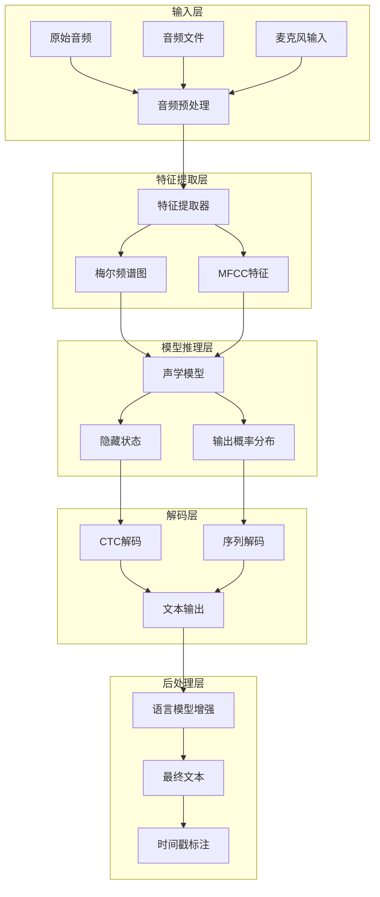

**图表来源**
- [automatic_speech_recognition.py](file://src/transformers/pipelines/automatic_speech_recognition.py#L186-L215)
- [base.py](file://src/transformers/pipelines/base.py#L700-L799)

**章节来源**
- [automatic_speech_recognition.py](file://src/transformers/pipelines/automatic_speech_recognition.py#L1-L673)

## 核心组件分析

### AutomaticSpeechRecognitionPipeline类

这是整个Pipeline的核心类，继承自`ChunkPipeline`，负责协调各个组件的工作流程。

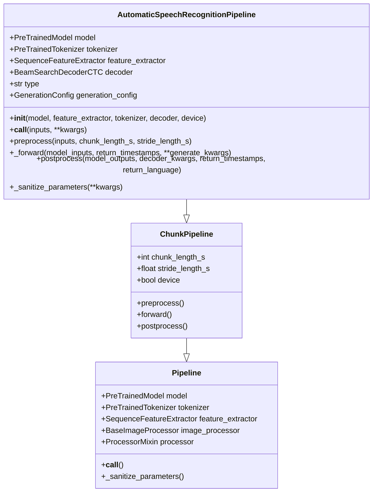

**图表来源**
- [automatic_speech_recognition.py](file://src/transformers/pipelines/automatic_speech_recognition.py#L186-L215)
- [base.py](file://src/transformers/pipelines/base.py#L700-L799)

### 模型类型识别

Pipeline根据不同的模型类型采用相应的处理策略：

| 模型类型 | 处理方式 | 特点 |
|---------|---------|------|
| `seq2seq_whisper` | 序列到序列解码 | 支持时间戳、多语言、长文本 |
| `seq2seq` | 序列到序列解码 | 通用序列解码策略 |
| `ctc_with_lm` | CTC+语言模型解码 | 使用pyctcdecode进行束搜索 |
| `ctc` | CTC解码 | 基础CTC解码策略 |

**章节来源**
- [automatic_speech_recognition.py](file://src/transformers/pipelines/automatic_speech_recognition.py#L186-L215)

## 音频流处理

### 音频输入格式支持

Pipeline支持多种音频输入格式：

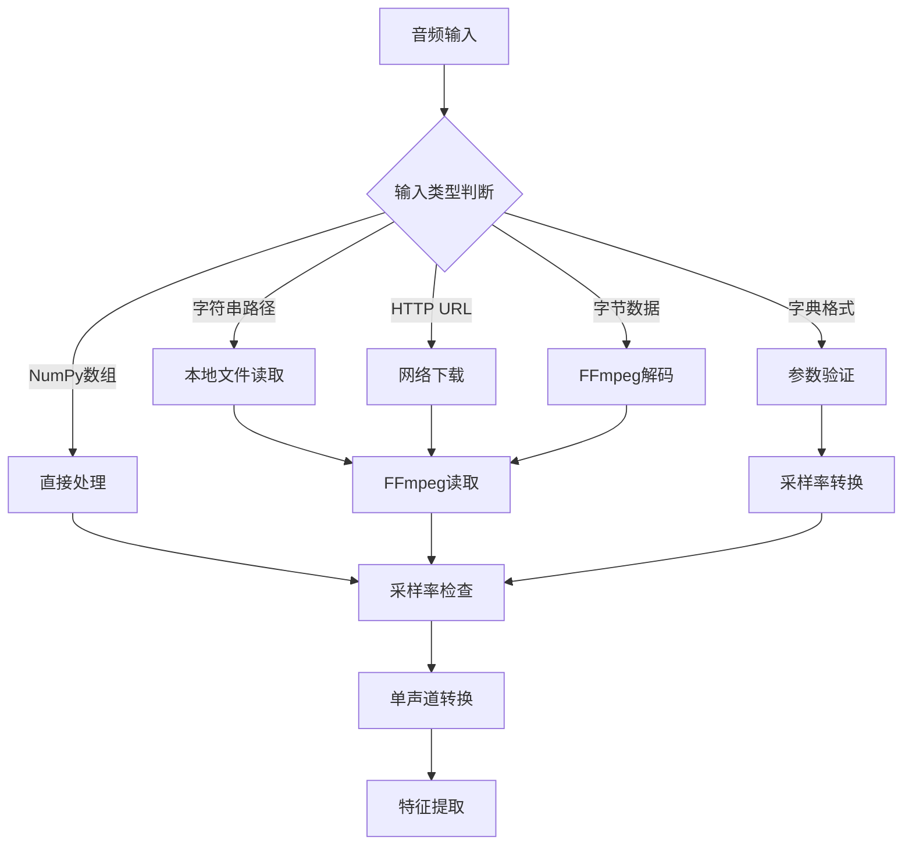

**图表来源**
- [automatic_speech_recognition.py](file://src/transformers/pipelines/automatic_speech_recognition.py#L350-L450)

### 音频预处理流程

音频预处理包括以下关键步骤：

1. **格式转换**：统一音频格式为浮点数
2. **采样率调整**：确保与模型要求一致
3. **通道合并**：将立体声转换为单声道
4. **分块处理**：支持大音频文件的分块处理

**章节来源**
- [automatic_speech_recognition.py](file://src/transformers/pipelines/automatic_speech_recognition.py#L350-L450)

## 声学模型推理

### CTC模型推理

对于CTC（Connectionist Temporal Classification）模型，如Wav2Vec2：

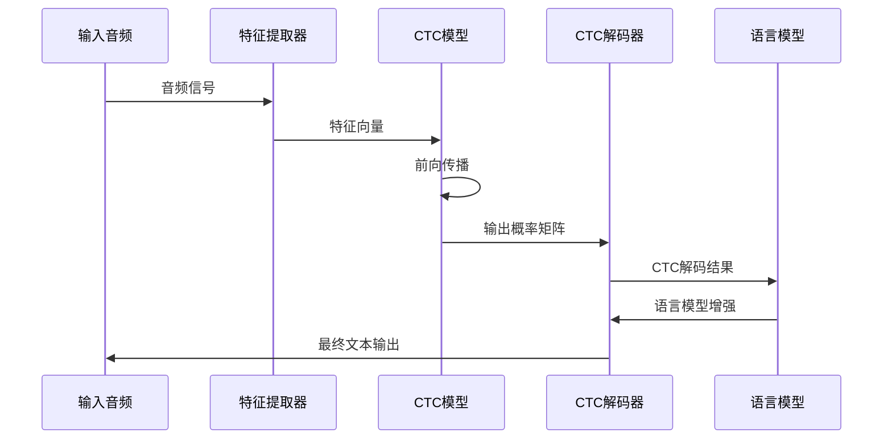

**图表来源**
- [automatic_speech_recognition.py](file://src/transformers/pipelines/automatic_speech_recognition.py#L492-L515)

### 序列到序列模型推理

对于序列到序列模型，如Whisper：

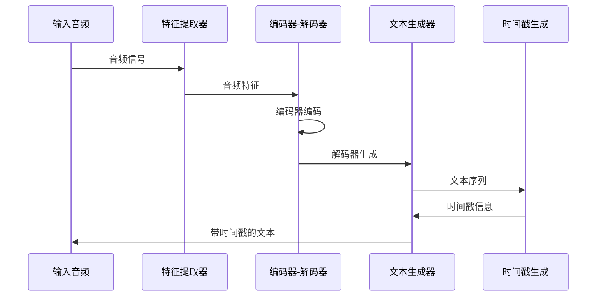

**图表来源**
- [automatic_speech_recognition.py](file://src/transformers/pipelines/automatic_speech_recognition.py#L492-L515)

**章节来源**
- [automatic_speech_recognition.py](file://src/transformers/pipelines/automatic_speech_recognition.py#L492-L515)

## 语言模型集成

### CTC+语言模型解码

对于支持语言模型增强的CTC模型，Pipeline集成了pyctcdecode库：

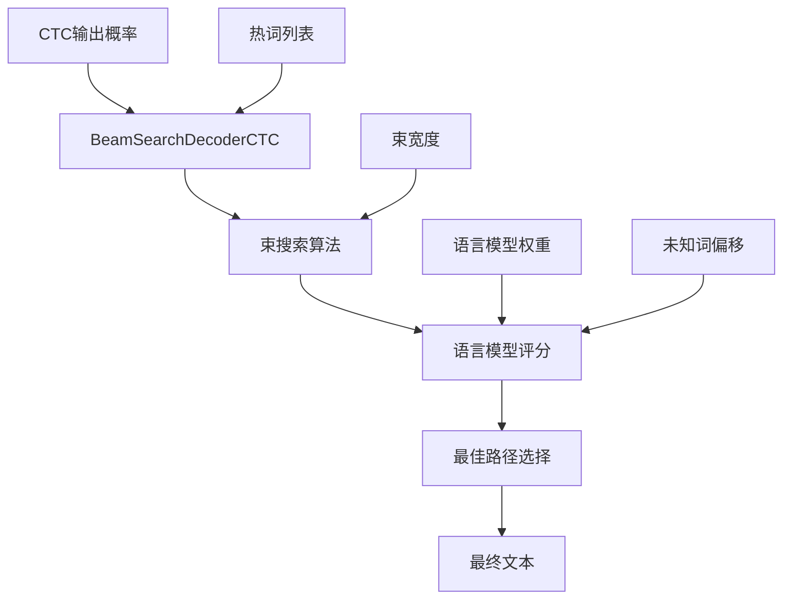

**图表来源**
- [processing_wav2vec2_with_lm.py](file://src/transformers/models/wav2vec2_with_lm/processing_wav2vec2_with_lm.py#L574-L608)

### 束搜索参数配置

| 参数 | 默认值 | 说明 |
|------|--------|------|
| `beam_width` | 128 | 束搜索宽度 |
| `beam_prune_logp` | -10 | 束修剪阈值 |
| `token_min_logp` | -8 | 最小令牌概率 |
| `hotword_weight` | 10.0 | 热词权重 |
| `alpha` | 0.2 | 语言模型权重 |
| `beta` | 1.0 | 长度惩罚系数 |

**章节来源**
- [processing_wav2vec2_with_lm.py](file://src/transformers/models/wav2vec2_with_lm/processing_wav2vec2_with_lm.py#L484-L504)

## 解码策略详解

### 贪婪解码

贪婪解码是最简单的解码策略，每次选择概率最高的字符：

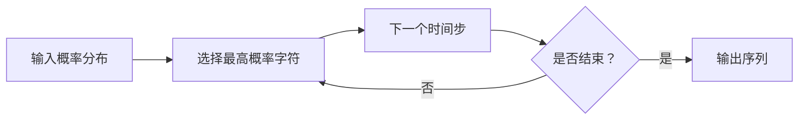

### 束搜索解码

束搜索解码通过维护多个候选序列来提高识别质量：

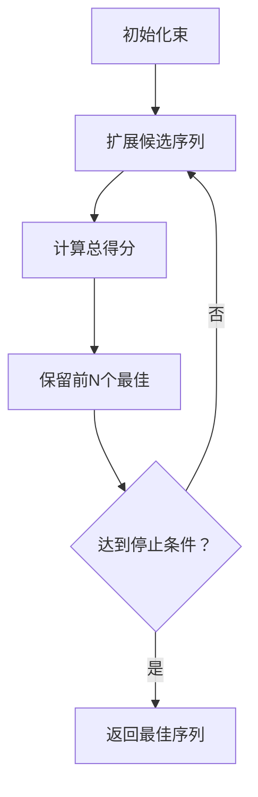

### 不同解码策略的性能对比

| 解码策略 | 计算复杂度 | 识别准确率 | 实时性 | 内存需求 |
|----------|------------|------------|--------|----------|
| 贪婪解码 | O(1) | 中等 | 高 | 低 |
| 束搜索 | O(N×V) | 高 | 中等 | 高 |
| 热词增强 | O(N×V×H) | 很高 | 中等 | 很高 |

**章节来源**
- [processing_wav2vec2_with_lm.py](file://src/transformers/models/wav2vec2_with_lm/processing_wav2vec2_with_lm.py#L273-L309)

## 实时语音识别

### 麦克风输入处理

Pipeline提供了完整的麦克风输入处理功能：

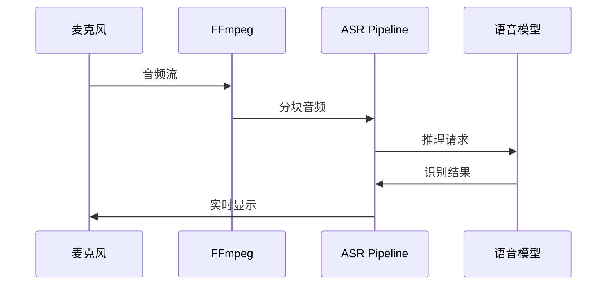

**图表来源**
- [audio_utils.py](file://src/transformers/pipelines/audio_utils.py#L47-L75)

### 流式处理机制

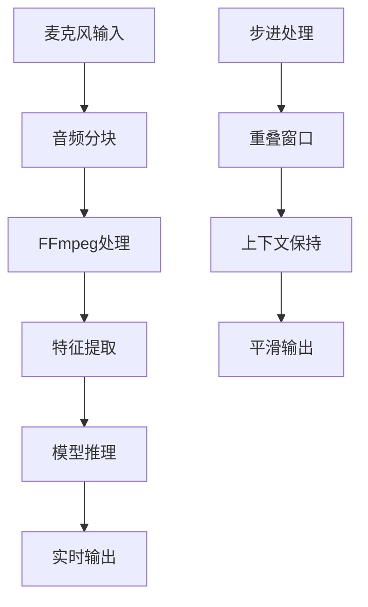

**图表来源**
- [audio_utils.py](file://src/transformers/pipelines/audio_utils.py#L124-L145)

### 实时处理参数

| 参数 | 推荐值 | 说明 |
|------|--------|------|
| `chunk_length_s` | 30秒 | 单次处理长度 |
| `stride_length_s` | 5秒 | 重叠区域长度 |
| `stream_chunk_s` | 1秒 | 流式输出间隔 |
| `sampling_rate` | 16kHz | 标准采样率 |

**章节来源**
- [audio_utils.py](file://src/transformers/pipelines/audio_utils.py#L124-L145)

## 多语言支持

### 语言检测与识别

Whisper模型内置多语言支持：

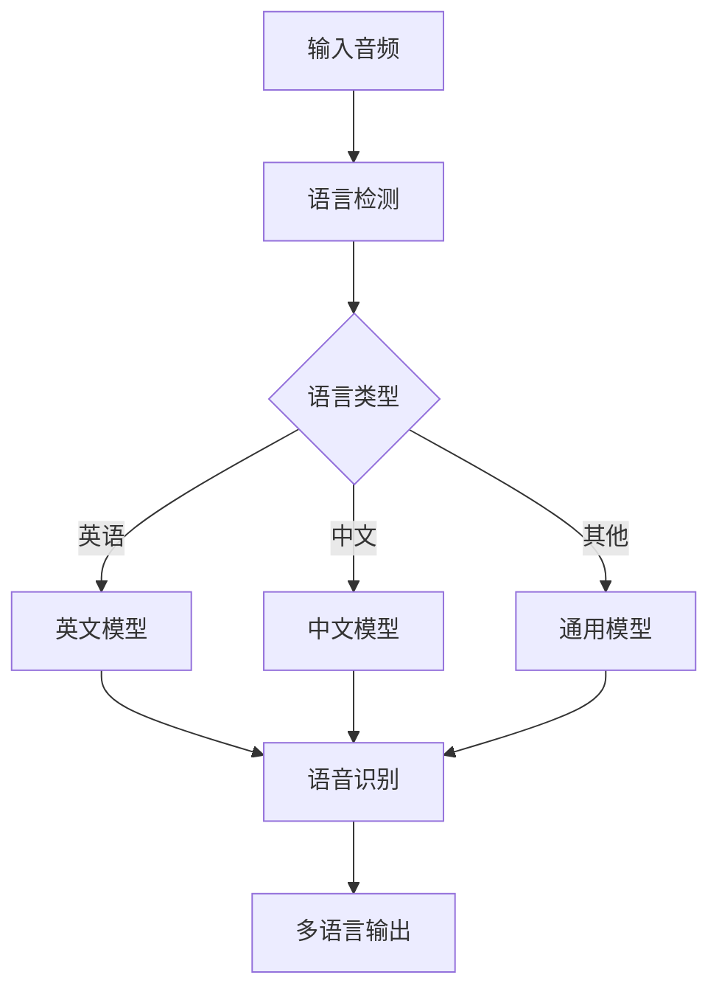

### 自定义词汇表集成

对于特定领域的语音识别，可以集成自定义词汇表：

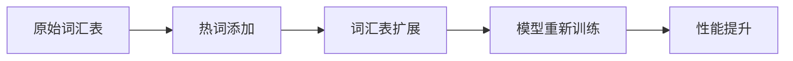

**章节来源**
- [automatic_speech_recognition.py](file://src/transformers/pipelines/automatic_speech_recognition.py#L280-L320)

## 性能优化

### 批处理优化

Pipeline支持批处理以提高吞吐量：

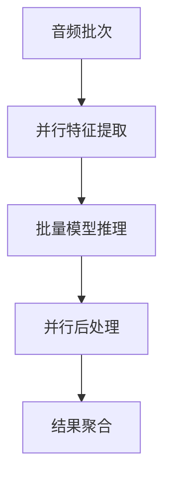

### 内存管理

为了处理大型音频文件，Pipeline实现了智能内存管理：

1. **分块处理**：避免一次性加载大文件
2. **梯度检查点**：减少内存占用
3. **混合精度**：使用FP16降低内存需求

### 设备优化

支持多种硬件加速：

| 设备类型 | 推荐配置 | 性能特点 |
|----------|----------|----------|
| CPU | 多核处理器 | 平衡性能和成本 |
| GPU | RTX 3080+ | 快速推理 |
| TPU | Cloud TPU | 大规模批处理 |
| 移动设备 | ARM CPU | 低功耗 |

**章节来源**
- [automatic_speech_recognition.py](file://src/transformers/pipelines/automatic_speech_recognition.py#L220-L280)

## 故障排除指南

### 常见问题及解决方案

#### 1. 音频格式问题

**问题**：音频文件无法正确读取
**解决方案**：
- 确保安装了FFmpeg
- 检查音频文件格式是否支持
- 验证音频采样率是否匹配

#### 2. 内存不足

**问题**：处理大音频文件时内存溢出
**解决方案**：
- 减小`chunk_length_s`参数
- 启用混合精度训练
- 使用CPU而非GPU

#### 3. 识别准确率低

**问题**：语音识别结果不准确
**解决方案**：
- 调整束搜索参数
- 添加领域特定词汇
- 使用更高精度的模型

### 性能调优建议

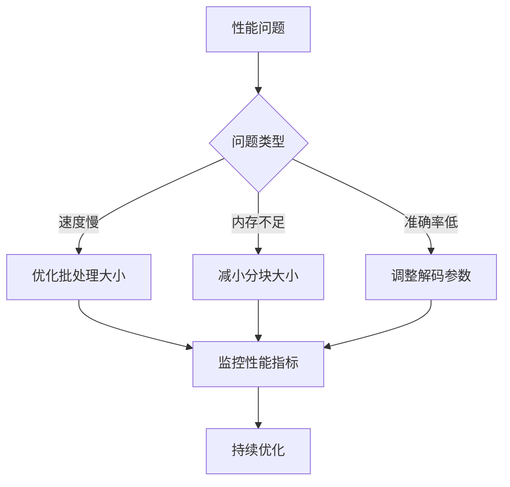

**章节来源**
- [test_pipelines_automatic_speech_recognition.py](file://tests/pipelines/test_pipelines_automatic_speech_recognition.py#L63-L102)

## 总结

自动语音识别Pipeline是Transformers库中功能强大且灵活的组件，它整合了最先进的语音识别技术，提供了从基础CTC解码到复杂的语言模型增强的完整解决方案。

### 主要优势

1. **模块化设计**：清晰的组件分离便于维护和扩展
2. **多模型支持**：兼容主流语音识别模型
3. **实时处理**：支持流式音频输入和实时识别
4. **性能优化**：多种优化策略确保高效运行
5. **易于使用**：简洁的API设计降低使用门槛

### 应用场景

- **实时语音转文字**：会议记录、直播字幕
- **批量音频处理**：语音数据标注、内容审核
- **多语言应用**：国际化产品、跨语言服务
- **专业领域**：医疗录音、法律记录、教育评估

通过合理配置和优化，该Pipeline能够满足从个人应用到企业级部署的各种需求，为语音识别应用开发提供了坚实的基础。