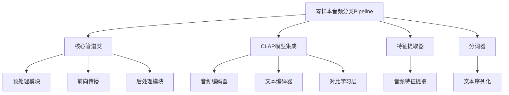
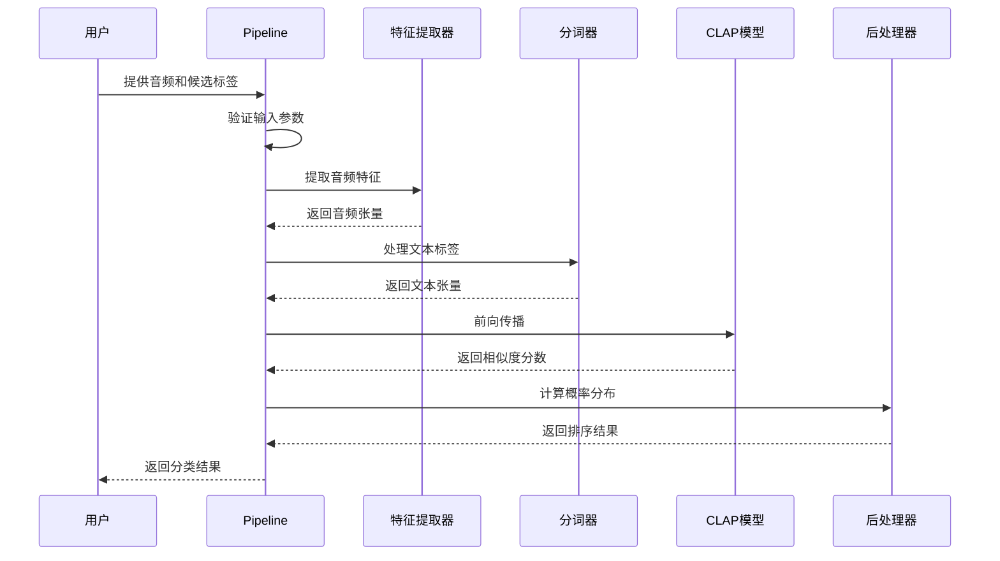
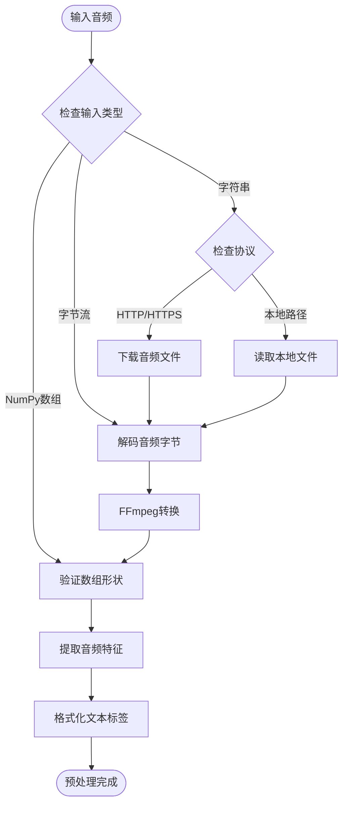
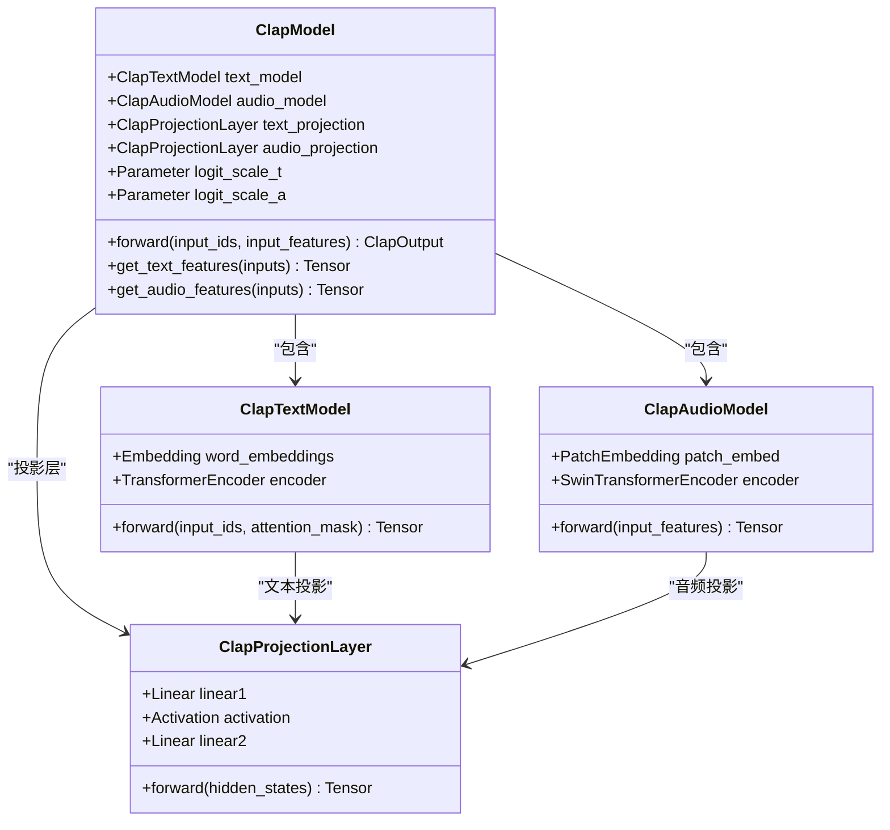
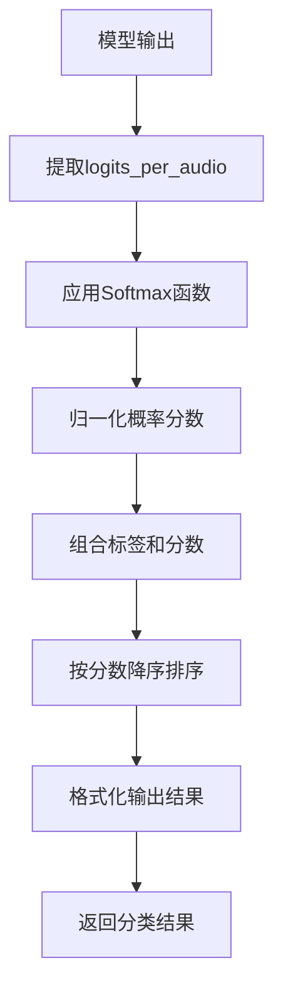
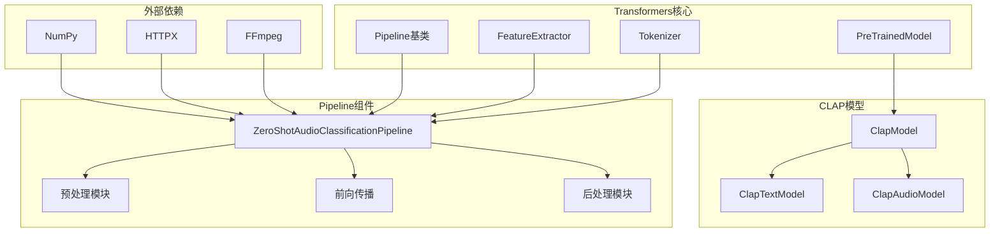

# 零样本音频分类Pipeline

<cite>
**本文档中引用的文件**
- [zero_shot_audio_classification.py](file://src/transformers/pipelines/zero_shot_audio_classification.py)
- [modeling_clap.py](file://src/transformers/models/clap/modeling_clap.py)
- [configuration_clap.py](file://src/transformers/models/clap/configuration_clap.py)
- [base.py](file://src/transformers/pipelines/base.py)
- [test_pipelines_zero_shot_audio_classification.py](file://tests/pipelines/test_pipelines_zero_shot_audio_classification.py)
</cite>

## 目录
1. [简介](#简介)
2. [项目结构](#项目结构)
3. [核心组件](#核心组件)
4. [架构概览](#架构概览)
5. [详细组件分析](#详细组件分析)
6. [依赖关系分析](#依赖关系分析)
7. [性能考虑](#性能考虑)
8. [故障排除指南](#故障排除指南)
9. [结论](#结论)

## 简介

零样本音频分类Pipeline是基于CLAP（Contrastive Language-Audio Pre-training）模型的创新性解决方案，它能够对音频进行分类而无需任何特定领域的训练数据。该Pipeline通过文本-音频对比学习机制，实现了在未见过的类别上进行音频分类的能力。

### 核心特性

- **零样本学习能力**：无需针对特定类别的训练数据
- **文本-音频对比模型**：利用CLAP模型的多模态理解能力
- **灵活的标签设计**：支持自定义候选标签集
- **高置信度分类**：提供概率分数评估分类可靠性

## 项目结构

零样本音频分类Pipeline的代码组织遵循Transformers库的标准架构：

**图表来源**
- [zero_shot_audio_classification.py](file://src/transformers/pipelines/zero_shot_audio_classification.py#L30-L162)
- [modeling_clap.py](file://src/transformers/models/clap/modeling_clap.py#L1600-L1700)

**章节来源**
- [zero_shot_audio_classification.py](file://src/transformers/pipelines/zero_shot_audio_classification.py#L1-L162)

## 核心组件

### ZeroShotAudioClassificationPipeline类

这是零样本音频分类的主要入口点，继承自基础Pipeline类，提供了完整的音频分类功能。

#### 主要属性

| 属性 | 类型 | 描述 |
|------|------|------|
| `_load_feature_extractor` | bool | 是否加载音频特征提取器 |
| `_load_tokenizer` | bool | 是否加载文本分词器 |
| `_load_processor` | bool | 是否加载处理器（不适用） |
| `_load_image_processor` | bool | 是否加载图像处理器（不适用） |

#### 输入支持类型

Pipeline支持多种输入格式：
- 字符串形式的HTTP/HTTPS链接
- 本地音频文件路径
- NumPy数组格式的音频数据
- 包含音频数组和采样率的字典

**章节来源**
- [zero_shot_audio_classification.py](file://src/transformers/pipelines/zero_shot_audio_classification.py#L50-L162)

## 架构概览

零样本音频分类Pipeline采用模块化设计，通过清晰的职责分离实现高效的音频分类：

**图表来源**
- [zero_shot_audio_classification.py](file://src/transformers/pipelines/zero_shot_audio_classification.py#L95-L162)

## 详细组件分析

### 预处理模块

预处理模块负责将原始音频数据转换为模型可接受的格式：

**图表来源**
- [zero_shot_audio_classification.py](file://src/transformers/pipelines/zero_shot_audio_classification.py#L95-L122)

#### 关键处理步骤

1. **输入验证**：确保音频数据符合单通道要求
2. **格式转换**：将不同格式的音频统一转换为NumPy数组
3. **特征提取**：使用专门的特征提取器处理音频信号
4. **文本格式化**：根据模板生成用于分类的文本描述

**章节来源**
- [zero_shot_audio_classification.py](file://src/transformers/pipelines/zero_shot_audio_classification.py#L95-L122)

### CLAP模型集成

CLAP（Contrastive Language-Audio Pre-training）模型是零样本分类的核心，它通过对比学习实现音频和文本的跨模态理解：

**图表来源**
- [modeling_clap.py](file://src/transformers/models/clap/modeling_clap.py#L1600-L1700)
- [modeling_clap.py](file://src/transformers/models/clap/modeling_clap.py#L1728-L1860)

#### 模型架构特点

1. **双编码器设计**：独立的音频和文本编码器
2. **对比学习机制**：通过余弦相似度计算跨模态相似性
3. **可学习缩放因子**：logit_scale_t和logit_scale_a控制相似度尺度
4. **归一化特征**：输出特征经过L2归一化处理

**章节来源**
- [modeling_clap.py](file://src/transformers/models/clap/modeling_clap.py#L1662-L1728)

### 后处理模块

后处理模块负责将模型输出转换为用户友好的分类结果：

**图表来源**
- [zero_shot_audio_classification.py](file://src/transformers/pipelines/zero_shot_audio_classification.py#L145-L162)

#### 输出格式规范

每个分类结果包含两个关键字段：
- **label**：对应的候选标签名称
- **score**：0到1之间的概率分数，表示分类置信度

**章节来源**
- [zero_shot_audio_classification.py](file://src/transformers/pipelines/zero_shot_audio_classification.py#L145-L162)

## 依赖关系分析

零样本音频分类Pipeline与多个组件存在复杂的依赖关系：

**图表来源**
- [zero_shot_audio_classification.py](file://src/transformers/pipelines/zero_shot_audio_classification.py#L1-L20)
- [base.py](file://src/transformers/pipelines/base.py#L1-L50)

### 关键依赖项

1. **NumPy**：用于音频数据的数值计算和数组操作
2. **HTTPX**：处理远程音频文件的下载
3. **FFmpeg**：音频格式转换和预处理
4. **CLAP模型**：提供核心的对比学习能力

**章节来源**
- [zero_shot_audio_classification.py](file://src/transformers/pipelines/zero_shot_audio_classification.py#L1-L20)

## 性能考虑

### 内存优化策略

1. **批处理支持**：Pipeline支持批量处理多个音频文件
2. **动态内存管理**：根据输入大小自动调整内存分配
3. **设备优化**：支持GPU加速和混合精度计算

### 推理速度优化

1. **模型量化**：支持FP16和INT8量化以提高推理速度
2. **缓存机制**：对重复的文本标签进行缓存
3. **并行处理**：音频特征提取和文本编码可以并行执行

### 准确性权衡

1. **标签数量限制**：过多的候选标签可能降低分类准确性
2. **模板质量影响**：hypothesis_template的质量直接影响分类效果
3. **音频长度适应**：模型对不同长度音频的处理能力

## 故障排除指南

### 常见问题及解决方案

#### 输入格式错误
**问题**：音频输入格式不符合要求
**解决方案**：确保输入为单声道NumPy数组，采样率正确

#### 内存不足
**问题**：处理大型音频文件时出现内存溢出
**解决方案**：使用批处理模式，减小批次大小

#### 分类准确性低
**问题**：分类结果置信度较低
**解决方案**：优化hypothesis_template，增加候选标签数量

**章节来源**
- [zero_shot_audio_classification.py](file://src/transformers/pipelines/zero_shot_audio_classification.py#L105-L120)

### 调试技巧

1. **检查输入数据**：验证音频质量和格式
2. **监控内存使用**：使用系统监控工具跟踪内存消耗
3. **分析输出分布**：检查概率分数的分布情况
4. **对比基准结果**：与已知正确的分类结果进行比较

## 结论

零样本音频分类Pipeline代表了多模态AI技术的重要进展，它突破了传统音频分类需要大量标注数据的限制。通过CLAP模型的对比学习机制，该Pipeline能够在无需特定领域训练的情况下，对各种音频类型进行准确分类。

### 主要优势

1. **零样本能力**：无需针对特定类别的训练数据
2. **灵活性**：支持自定义标签集和分类模板
3. **准确性**：基于强大的对比学习模型
4. **易用性**：简洁的API设计，易于集成

### 应用前景

该技术在以下场景具有广阔的应用前景：
- 环境声音识别和分类
- 音乐流派自动标记
- 安全监控中的异常声音检测
- 辅助技术中的音频内容理解

随着模型性能的不断提升和应用场景的拓展，零样本音频分类Pipeline将成为音频理解和处理领域的重要工具。