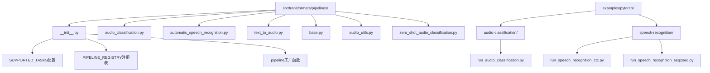
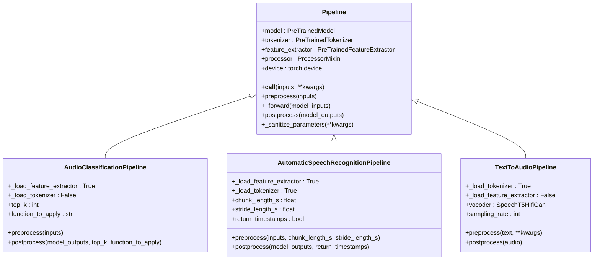
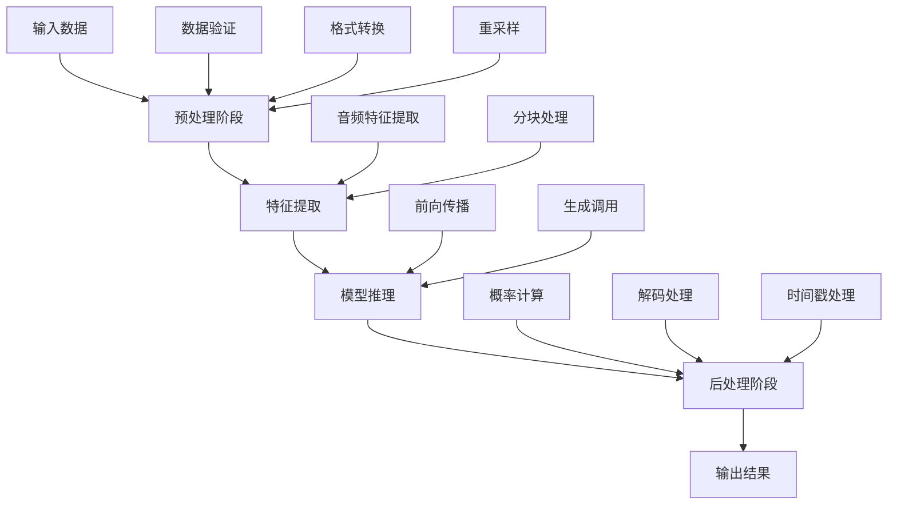
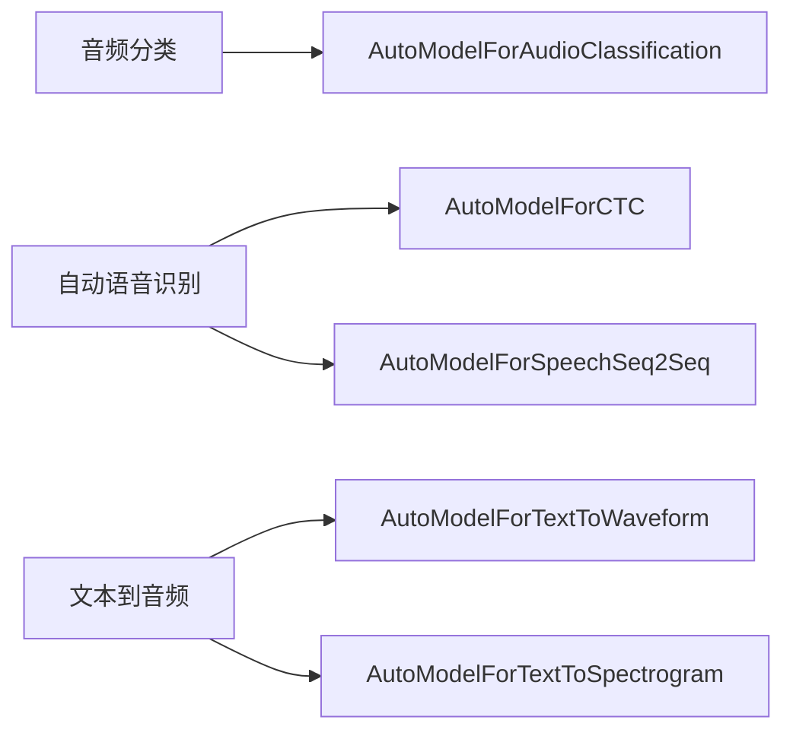
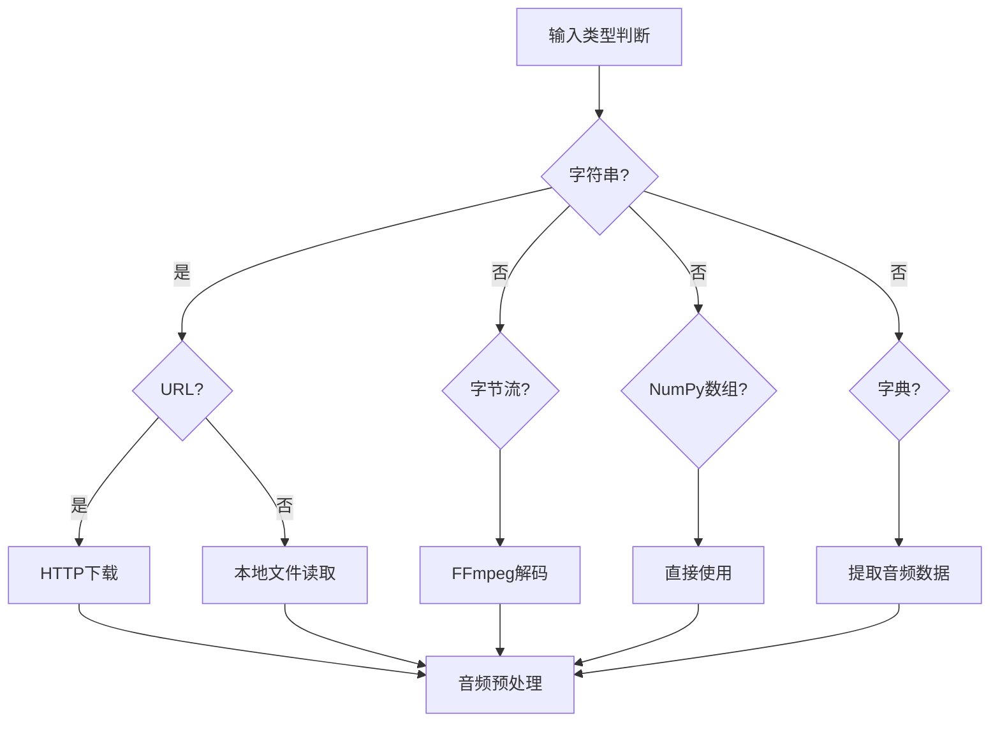
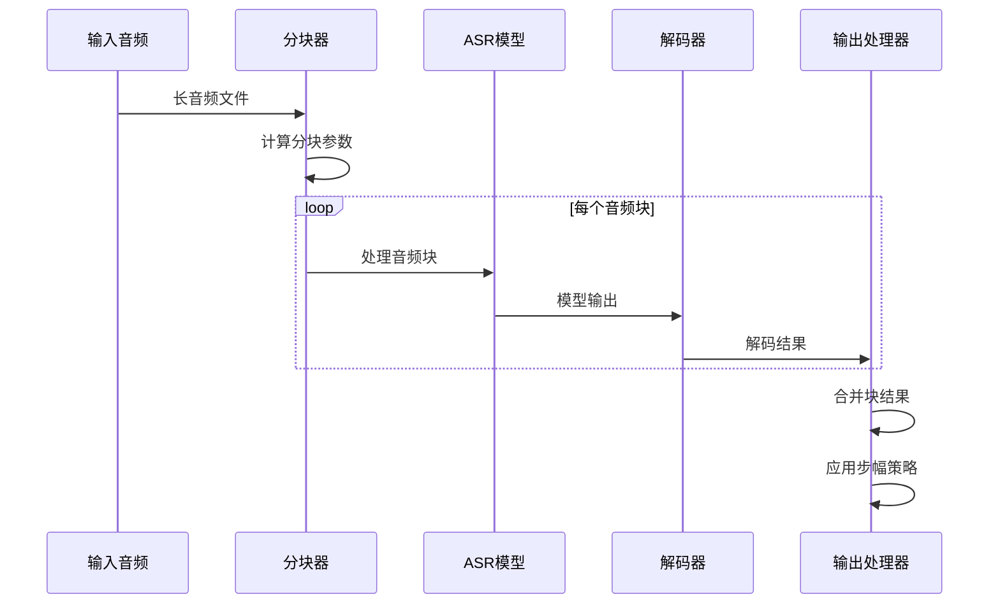
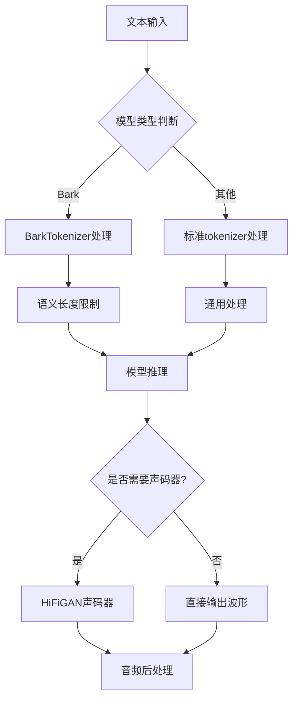
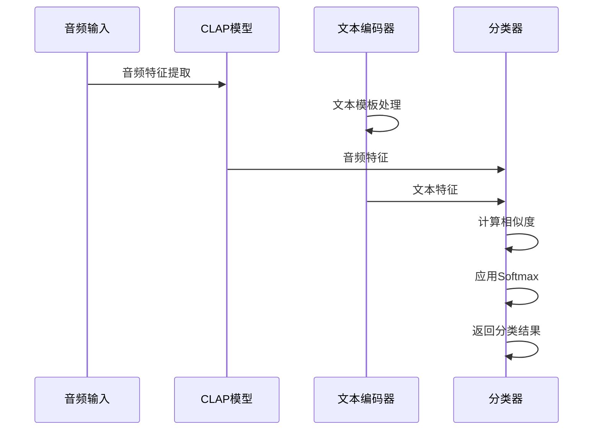
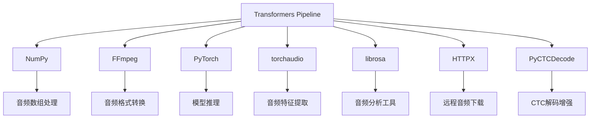
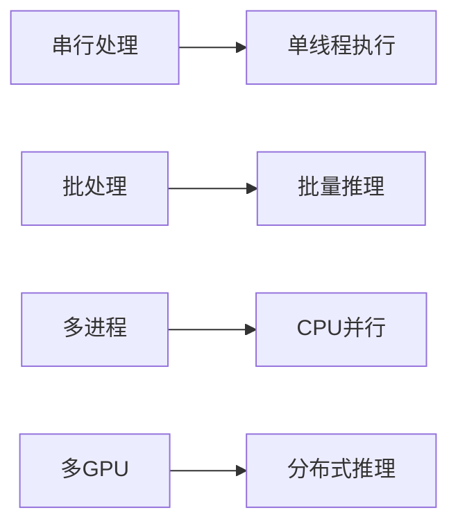

# 音频任务Pipeline

<cite>
**本文档引用的文件**
- [src/transformers/pipelines/__init__.py](file://src/transformers/pipelines/__init__.py)
- [src/transformers/pipelines/audio_classification.py](file://src/transformers/pipelines/audio_classification.py)
- [src/transformers/pipelines/automatic_speech_recognition.py](file://src/transformers/pipelines/automatic_speech_recognition.py)
- [src/transformers/pipelines/text_to_audio.py](file://src/transformers/pipelines/text_to_audio.py)
- [src/transformers/pipelines/base.py](file://src/transformers/pipelines/base.py)
- [src/transformers/pipelines/audio_utils.py](file://src/transformers/pipelines/audio_utils.py)
- [src/transformers/pipelines/zero_shot_audio_classification.py](file://src/transformers/pipelines/zero_shot_audio_classification.py)
- [examples/pytorch/audio-classification/run_audio_classification.py](file://examples/pytorch/audio-classification/run_audio_classification.py)
- [examples/pytorch/speech-recognition/run_speech_recognition_ctc.py](file://examples/pytorch/speech-recognition/run_speech_recognition_ctc.py)
- [examples/pytorch/speech-recognition/run_speech_recognition_seq2seq.py](file://examples/pytorch/speech-recognition/run_speech_recognition_seq2seq.py)
</cite>

## 目录
1. [简介](#简介)
2. [项目结构](#项目结构)
3. [核心组件](#核心组件)
4. [架构概览](#架构概览)
5. [详细组件分析](#详细组件分析)
6. [依赖关系分析](#依赖关系分析)
7. [性能考虑](#性能考虑)
8. [故障排除指南](#故障排除指南)
9. [结论](#结论)

## 简介

Transformers库中的音频任务Pipeline提供了强大而灵活的音频处理能力，涵盖了音频分类、自动语音识别（ASR）、文本到音频生成等多个领域。这些Pipeline基于统一的架构设计，支持从单个音频文件处理到批量推理的各种使用场景。

本文档将深入探讨音频Pipeline的实现原理、架构设计、使用方法以及最佳实践，为初学者提供清晰的入门指导，同时为高级用户提供性能优化和自定义扩展的技术细节。

## 项目结构

Transformers库中的音频Pipeline相关文件组织结构如下：



**图表来源**
- [src/transformers/pipelines/__init__.py](file://src/transformers/pipelines/__init__.py#L1-L50)
- [src/transformers/pipelines/base.py](file://src/transformers/pipelines/base.py#L1-L50)

**章节来源**
- [src/transformers/pipelines/__init__.py](file://src/transformers/pipelines/__init__.py#L1-L100)
- [src/transformers/pipelines/base.py](file://src/transformers/pipelines/base.py#L1-L100)

## 核心组件

### 支持的音频任务类型

Transformers库支持以下主要的音频任务Pipeline：

| 任务类型 | 描述 | 主要用途 | 输入格式 |
|---------|------|----------|----------|
| `audio-classification` | 音频分类 | 声音事件检测、语音命令识别 | 音频波形、音频文件路径 |
| `automatic-speech-recognition` | 自动语音识别 | 文本转录、语音转文字 | 音频数据、音频文件 |
| `text-to-audio` | 文本到音频生成 | 语音合成、音乐生成 | 文本输入、可选条件参数 |
| `zero-shot-audio-classification` | 零样本音频分类 | 未知类别的声音识别 | 音频数据、候选标签列表 |

### Pipeline基类架构

所有音频Pipeline都继承自基础Pipeline类，具有统一的接口和处理流程：



**图表来源**
- [src/transformers/pipelines/base.py](file://src/transformers/pipelines/base.py#L700-L800)
- [src/transformers/pipelines/audio_classification.py](file://src/transformers/pipelines/audio_classification.py#L50-L100)
- [src/transformers/pipelines/automatic_speech_recognition.py](file://src/transformers/pipelines/automatic_speech_recognition.py#L100-L150)
- [src/transformers/pipelines/text_to_audio.py](file://src/transformers/pipelines/text_to_audio.py#L50-L100)

**章节来源**
- [src/transformers/pipelines/base.py](file://src/transformers/pipelines/base.py#L700-L900)
- [src/transformers/pipelines/__init__.py](file://src/transformers/pipelines/__init__.py#L150-L250)

## 架构概览

### Pipeline处理流程

音频Pipeline采用标准化的处理流程，确保一致性和可扩展性：



**图表来源**
- [src/transformers/pipelines/base.py](file://src/transformers/pipelines/base.py#L800-L900)
- [src/transformers/pipelines/audio_classification.py](file://src/transformers/pipelines/audio_classification.py#L150-L200)

### 模型类型映射

不同音频任务对应不同的模型类型：



**图表来源**
- [src/transformers/pipelines/__init__.py](file://src/transformers/pipelines/__init__.py#L100-L150)

**章节来源**
- [src/transformers/pipelines/base.py](file://src/transformers/pipelines/base.py#L800-L1000)
- [src/transformers/pipelines/__init__.py](file://src/transformers/pipelines/__init__.py#L100-L200)

## 详细组件分析

### 音频分类Pipeline

音频分类Pipeline用于对音频片段进行分类，识别音频中的特定事件或声音。

#### 核心功能特性

- **多格式输入支持**：支持音频文件路径、字节流、NumPy数组和字典格式
- **灵活的输出控制**：可配置返回的类别数量和后处理函数
- **自动重采样**：根据模型要求自动调整音频采样率

#### 输入格式处理



**图表来源**
- [src/transformers/pipelines/audio_classification.py](file://src/transformers/pipelines/audio_classification.py#L150-L250)

#### 输出格式

音频分类Pipeline返回按置信度排序的类别预测：

| 字段 | 类型 | 描述 |
|------|------|------|
| `label` | str | 预测的音频类别 |
| `score` | float | 对应类别的置信度分数 |

**章节来源**
- [src/transformers/pipelines/audio_classification.py](file://src/transformers/pipelines/audio_classification.py#L1-L260)

### 自动语音识别Pipeline

自动语音识别Pipeline是最复杂的音频处理Pipeline之一，支持多种模型架构和处理策略。

#### 支持的模型类型

- **CTC模型**：Wav2Vec2、HuBERT、Unispeech等
- **序列到序列模型**：SpeechT5、Whisper等
- **带语言模型的CTC**：支持词级解码增强

#### 分块处理机制

对于长音频文件，Pipeline支持分块处理以提高效率：



**图表来源**
- [src/transformers/pipelines/automatic_speech_recognition.py](file://src/transformers/pipelines/automatic_speech_recognition.py#L200-L300)

#### 时间戳支持

ASR Pipeline支持多种时间戳粒度：

| 时间戳类型 | 描述 | 适用模型 |
|-----------|------|----------|
| `char` | 字符级别时间戳 | CTC模型 |
| `word` | 单词级别时间戳 | CTC模型、Whisper |
| `segment` | 段落级别时间戳 | Whisper模型 |

**章节来源**
- [src/transformers/pipelines/automatic_speech_recognition.py](file://src/transformers/pipelines/automatic_speech_recognition.py#L1-L673)

### 文本到音频Pipeline

文本到音频Pipeline负责将文本转换为语音输出，支持多种生成策略。

#### 模型适配策略



**图表来源**
- [src/transformers/pipelines/text_to_audio.py](file://src/transformers/pipelines/text_to_audio.py#L100-L200)

#### 生成参数配置

| 参数 | 类型 | 默认值 | 描述 |
|------|------|--------|------|
| `max_new_tokens` | int | 256 | 最大生成音频长度 |
| `do_sample` | bool | False | 是否使用采样策略 |
| `temperature` | float | 1.0 | 采样温度参数 |
| `top_k` | int | 50 | Top-k采样参数 |

**章节来源**
- [src/transformers/pipelines/text_to_audio.py](file://src/transformers/pipelines/text_to_audio.py#L1-L270)

### 零样本音频分类Pipeline

零样本音频分类Pipeline允许在没有训练数据的情况下对音频进行分类。

#### 工作原理

该Pipeline结合CLAP模型的音频编码能力和文本编码能力，通过对比学习实现音频分类：



**图表来源**
- [src/transformers/pipelines/zero_shot_audio_classification.py](file://src/transformers/pipelines/zero_shot_audio_classification.py#L100-L150)

**章节来源**
- [src/transformers/pipelines/zero_shot_audio_classification.py](file://src/transformers/pipelines/zero_shot_audio_classification.py#L1-L162)

## 依赖关系分析

### 核心依赖库

音频Pipeline依赖多个关键库来处理音频数据：



**图表来源**
- [src/transformers/pipelines/audio_utils.py](file://src/transformers/pipelines/audio_utils.py#L1-L20)
- [src/transformers/pipelines/base.py](file://src/transformers/pipelines/base.py#L1-L50)

### 可选依赖

某些功能需要额外的依赖：

| 功能 | 必需依赖 | 用途 |
|------|----------|------|
| 微调支持 | `datasets`, `evaluate` | 数据集处理和评估 |
| 语音识别 | `jiwer` | WER指标计算 |
| 音频处理 | `librosa`, `torchaudio` | 高级音频操作 |
| 语言模型解码 | `pyctcdecode` | CTC模型解码增强 |

**章节来源**
- [src/transformers/pipelines/base.py](file://src/transformers/pipelines/base.py#L1-L100)
- [src/transformers/pipelines/audio_utils.py](file://src/transformers/pipelines/audio_utils.py#L1-L50)

## 性能考虑

### 内存优化策略

1. **批处理优化**：支持批量处理多个音频文件
2. **分块处理**：长音频文件的内存友好的分块处理
3. **设备管理**：智能的GPU/CPU资源分配

### 推理加速技术

- **模型量化**：支持INT8和FP16量化
- **动态批处理**：根据输入大小动态调整批处理大小
- **缓存机制**：重复音频的特征缓存

### 并行处理

音频Pipeline支持多种并行处理模式：



## 故障排除指南

### 常见问题及解决方案

#### 1. FFmpeg相关错误

**问题**：`ffmpeg was not found but is required to load audio files`

**解决方案**：
```bash
# Ubuntu/Debian
sudo apt-get install ffmpeg

# macOS
brew install ffmpeg

# Windows
# 下载并安装FFmpeg，添加到系统PATH
```

#### 2. 内存不足错误

**问题**：处理大型音频文件时出现内存溢出

**解决方案**：
- 使用分块处理：设置`chunk_length_s`参数
- 减少批处理大小：调整`batch_size`
- 使用CPU而非GPU：设置`device=-1`

#### 3. 采样率不匹配

**问题**：输入音频与模型期望采样率不一致

**解决方案**：
```python
# 自动重采样已启用
classifier = pipeline("audio-classification", model="some-model")

# 手动指定采样率
result = classifier(audio_array, sampling_rate=16000)
```

#### 4. 模型加载失败

**问题**：无法加载预训练模型

**解决方案**：
- 检查网络连接
- 验证模型名称正确性
- 尝试使用本地模型文件

### 调试技巧

1. **启用详细日志**：
```python
import logging
logging.basicConfig(level=logging.DEBUG)
```

2. **检查中间结果**：
```python
# 在预处理阶段插入调试点
def debug_preprocess(self, inputs):
    print(f"Input shape: {inputs.shape}")
    return inputs
```

3. **验证模型配置**：
```python
print(f"Model sampling rate: {model.config.sampling_rate}")
print(f"Feature extractor sampling rate: {feature_extractor.sampling_rate}")
```

**章节来源**
- [src/transformers/pipelines/audio_utils.py](file://src/transformers/pipelines/audio_utils.py#L10-L50)
- [src/transformers/pipelines/base.py](file://src/transformers/pipelines/base.py#L500-L600)

## 结论

Transformers库的音频任务Pipeline提供了一个强大、灵活且易于使用的音频处理框架。通过统一的接口设计和模块化的架构，用户可以轻松地在不同的音频任务之间切换，并利用最新的预训练模型进行各种音频处理任务。

### 主要优势

1. **易用性**：简洁的API设计，支持多种输入格式
2. **灵活性**：丰富的配置选项和自定义能力
3. **性能**：优化的处理流程和内存管理
4. **扩展性**：支持自定义模型和处理器

### 最佳实践建议

1. **选择合适的Pipeline**：根据具体任务需求选择最适合的音频Pipeline
2. **优化资源配置**：合理配置设备和批处理参数
3. **监控性能**：使用适当的日志和监控工具
4. **持续更新**：关注新版本的功能和性能改进

通过本文档的详细介绍，用户应该能够充分理解和有效使用Transformers库中的音频任务Pipeline，无论是进行简单的音频分析还是构建复杂的音频处理应用。