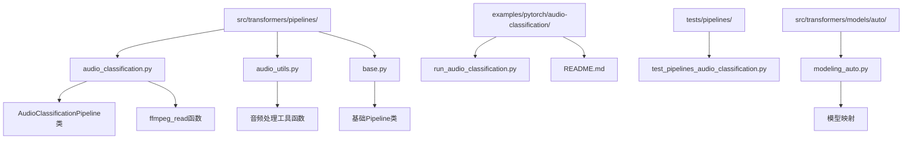
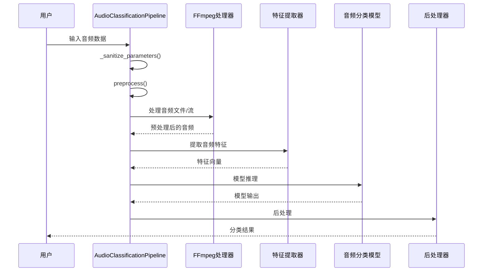
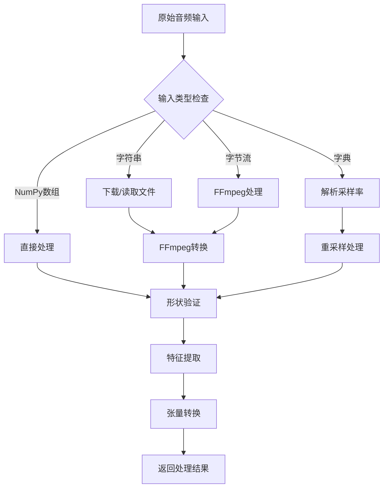
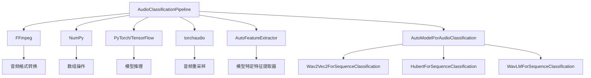

# 音频分类Pipeline

<cite>
**本文档中引用的文件**
- [audio_classification.py](file://src/transformers/pipelines/audio_classification.py)
- [audio_utils.py](file://src/transformers/pipelines/audio_utils.py)
- [base.py](file://src/transformers/pipelines/base.py)
- [run_audio_classification.py](file://examples/pytorch/audio-classification/run_audio_classification.py)
- [test_pipelines_audio_classification.py](file://tests/pipelines/test_pipelines_audio_classification.py)
- [modeling_auto.py](file://src/transformers/models/auto/modeling_auto.py)
- [README.md](file://examples/pytorch/audio-classification/README.md)
</cite>

## 目录
1. [简介](#简介)
2. [项目结构](#项目结构)
3. [核心组件](#核心组件)
4. [架构概览](#架构概览)
5. [详细组件分析](#详细组件分析)
6. [依赖关系分析](#依赖关系分析)
7. [性能考虑](#性能考虑)
8. [故障排除指南](#故障排除指南)
9. [结论](#结论)

## 简介

音频分类Pipeline是Hugging Face Transformers库中的一个重要组件，专门用于处理音频分类任务。该Pipeline能够对原始音频波形或音频文件进行分类，支持多种预训练模型，如Wav2Vec2、HuBERT、WavLM等。它提供了统一的接口来处理不同类型的音频输入，包括本地文件、远程URL、字节流和NumPy数组。

音频分类Pipeline的主要应用场景包括：
- 关键词检测（Keyword Spotting）
- 语音情感分析
- 环境声音识别
- 语言识别
- 声音事件分类

## 项目结构

音频分类Pipeline的代码主要分布在以下目录结构中：



**图表来源**
- [audio_classification.py](file://src/transformers/pipelines/audio_classification.py#L1-L50)
- [audio_utils.py](file://src/transformers/pipelines/audio_utils.py#L1-L30)
- [base.py](file://src/transformers/pipelines/base.py#L1-L50)

**章节来源**
- [audio_classification.py](file://src/transformers/pipelines/audio_classification.py#L1-L260)
- [audio_utils.py](file://src/transformers/pipelines/audio_utils.py#L1-L297)

## 核心组件

### AudioClassificationPipeline类

AudioClassificationPipeline是音频分类任务的核心类，继承自基础Pipeline类。它负责处理各种类型的音频输入，执行特征提取、模型推理和结果后处理。

主要特性：
- 支持多种输入格式：字符串路径、字节流、NumPy数组、字典格式
- 自动音频重采样和预处理
- 可配置的置信度分数计算
- 批量处理能力

### 音频处理工具

音频处理模块提供了多个辅助函数来处理不同格式的音频数据：

- `ffmpeg_read`: 使用FFmpeg读取音频文件
- `ffmpeg_microphone`: 从麦克风捕获音频
- `ffmpeg_microphone_live`: 实时音频流处理
- `chunk_bytes_iter`: 音频块迭代器

**章节来源**
- [audio_classification.py](file://src/transformers/pipelines/audio_classification.py#L82-L110)
- [audio_utils.py](file://src/transformers/pipelines/audio_utils.py#L10-L50)

## 架构概览

音频分类Pipeline采用分层架构设计，包含输入处理、特征提取、模型推理和结果输出四个主要阶段：



**图表来源**
- [audio_classification.py](file://src/transformers/pipelines/audio_classification.py#L112-L250)
- [base.py](file://src/transformers/pipelines/base.py#L700-L800)

## 详细组件分析

### 输入处理机制

AudioClassificationPipeline支持四种主要的输入格式：

#### 1. 字符串格式（文件路径或URL）
```python
# 本地文件
classifier("path/to/audio.wav")

# 远程URL
classifier("https://example.com/audio.mp3")
```

#### 2. 字节流格式
```python
# 从字节流加载
with open("audio.wav", "rb") as f:
    audio_bytes = f.read()
classifier(audio_bytes)
```

#### 3. NumPy数组格式
```python
# 原始音频波形
import numpy as np
audio_waveform = np.random.randn(16000)  # 1秒单声道音频
classifier(audio_waveform)
```

#### 4. 字典格式
```python
# 包含采样率的字典
audio_data = {
    "array": np.random.randn(16000),
    "sampling_rate": 16000
}
classifier(audio_data)
```

**章节来源**
- [audio_classification.py](file://src/transformers/pipelines/audio_classification.py#L112-L242)

### 特征提取流程

特征提取是音频分类的关键步骤，涉及以下过程：



**图表来源**
- [audio_classification.py](file://src/transformers/pipelines/audio_classification.py#L193-L242)

### 模型推理与后处理

模型推理过程包括前向传播和结果后处理：

#### 前向传播
```python
def _forward(self, model_inputs):
    model_outputs = self.model(**model_inputs)
    return model_outputs
```

#### 后处理
```python
def postprocess(self, model_outputs, top_k=5, function_to_apply="softmax"):
    if function_to_apply == "softmax":
        probs = model_outputs.logits[0].softmax(-1)
    elif function_to_apply == "sigmoid":
        probs = model_outputs.logits[0].sigmoid()
    else:
        probs = model_outputs.logits[0]
    scores, ids = probs.topk(top_k)
    labels = [{"score": score, "label": self.model.config.id2label[_id]} 
              for score, _id in zip(scores, ids)]
    return labels
```

**章节来源**
- [audio_classification.py](file://src/transformers/pipelines/audio_classification.py#L244-L259)

### 音频预处理参数配置

音频预处理涉及多个关键参数的配置：

| 参数 | 类型 | 默认值 | 描述 |
|------|------|--------|------|
| `top_k` | int | 5 | 返回的最高置信度标签数量 |
| `function_to_apply` | str | "softmax" | 后处理函数："softmax"、"sigmoid"、"none" |
| `sampling_rate` | int | 模型指定 | 音频采样率 |
| `return_tensors` | str | "pt" | 返回的张量格式 |

**章节来源**
- [audio_classification.py](file://src/transformers/pipelines/audio_classification.py#L140-L170)

## 依赖关系分析

音频分类Pipeline的依赖关系复杂，涉及多个模块和外部库：



**图表来源**
- [audio_classification.py](file://src/transformers/pipelines/audio_classification.py#L18-L25)
- [modeling_auto.py](file://src/transformers/models/auto/modeling_auto.py#L1590-L1600)

### 支持的模型架构

音频分类Pipeline支持多种预训练模型架构：

| 模型名称 | 架构类型 | 主要应用 |
|----------|----------|----------|
| wav2vec2 | Transformer | 关键词检测、语音识别 |
| hubert | Transformer | 语音表示学习 |
| wavlm | Transformer | 多任务语音理解 |
| data2vec-audio | Transformer | 自监督音频表示 |
| unispeech-sat | Transformer | 统一语音表示 |
| audio-spectrogram-transformer | CNN+Transformer | 音频分类 |

**章节来源**
- [modeling_auto.py](file://src/transformers/models/auto/modeling_auto.py#L1590-L1600)

## 性能考虑

### 批量处理优化

对于大量音频数据的处理，建议使用批量处理模式：

```python
# 批量处理示例
audio_files = ["audio1.wav", "audio2.wav", "audio3.wav"]
results = classifier(audio_files, batch_size=8)
```

### 内存管理

处理大型音频文件时需要注意内存使用：
- 使用适当的采样率减少内存占用
- 对长音频进行分段处理
- 及时释放不需要的中间结果

### 设备选择

根据硬件配置选择合适的设备：
- CPU：适合小规模处理和调试
- GPU：适合大规模批量处理
- 移动设备：需要考虑模型大小和推理速度

## 故障排除指南

### 常见错误及解决方案

#### 1. FFmpeg未找到错误
**错误信息**: `ValueError: ffmpeg was not found but is required to load audio files from filename`
**解决方案**: 安装FFmpeg并确保在系统PATH中可用

#### 2. 音频格式不支持
**错误信息**: `ValueError: Soundfile is either not in the correct format or is malformed`
**解决方案**: 确保音频文件格式被FFmpeg支持，或转换为支持的格式

#### 3. 采样率不匹配
**错误信息**: `ValueError: We expect a single channel audio input for AudioClassificationPipeline`
**解决方案**: 使用特征提取器的采样率重新采样音频

#### 4. 内存不足
**错误信息**: `CUDA out of memory`
**解决方案**: 减少批量大小或使用CPU处理

### 调试技巧

1. **验证输入格式**: 使用简单的音频文件进行测试
2. **检查模型兼容性**: 确认模型支持音频分类任务
3. **监控内存使用**: 使用系统监控工具跟踪内存消耗
4. **分步调试**: 将处理流程分解为独立的步骤进行测试

**章节来源**
- [audio_classification.py](file://src/transformers/pipelines/audio_classification.py#L25-L50)
- [test_pipelines_audio_classification.py](file://tests/pipelines/test_pipelines_audio_classification.py#L100-L150)

## 结论

音频分类Pipeline是Hugging Face Transformers库中功能强大且灵活的组件，为音频分类任务提供了完整的解决方案。通过统一的接口设计，它简化了从音频预处理到模型推理的整个流程。

### 主要优势

1. **多格式支持**: 支持本地文件、远程URL、字节流等多种输入格式
2. **自动预处理**: 内置音频重采样、格式转换等功能
3. **模型兼容性**: 支持多种主流音频分类模型架构
4. **可配置性**: 提供丰富的参数配置选项
5. **性能优化**: 支持批量处理和设备优化

### 应用建议

对于初学者：
- 从简单的关键词检测任务开始
- 使用预训练模型进行快速原型开发
- 参考官方示例和文档

对于高级用户：
- 自定义特征提取器以适应特定需求
- 实现批量处理优化
- 探索长音频文件的处理策略

音频分类Pipeline为音频理解和处理任务提供了强大的基础设施，是构建智能音频应用的重要工具。