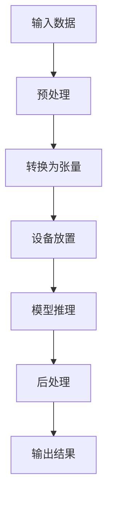

# 使用低级API进行推理

<cite>
**本文档中引用的文件**  
- [modeling_utils.py](file://src/transformers/modeling_utils.py)
- [base.py](file://src/transformers/pipelines/base.py)
- [generation/utils.py](file://src/transformers/generation/utils.py)
- [image_processing_utils_fast.py](file://src/transformers/image_processing_utils_fast.py)
- [pt_utils.py](file://src/transformers/pipelines/pt_utils.py)
- [tokenization_utils_base.py](file://src/transformers/tokenization_utils_base.py)
</cite>

## 目录
1. [简介](#简介)
2. [模型加载与初始化](#模型加载与初始化)
3. [输入预处理](#输入预处理)
4. [设备管理与张量处理](#设备管理与张量处理)
5. [推理执行与模型调用](#推理执行与模型调用)
6. [注意力掩码与位置编码](#注意力掩码与位置编码)
7. [多模态输入处理](#多模态输入处理)
8. [批处理技术](#批处理技术)
9. [输出后处理](#输出后处理)
10. [性能优化建议](#性能优化建议)

## 简介
本文档详细介绍了如何使用transformers库的低级API进行模型推理。重点介绍直接使用底层组件进行推理的方法，包括手动加载模型、分词器、图像处理器等组件，以及如何预处理输入数据和后处理模型输出。文档涵盖了不同模态（文本、图像、音频）的输入输出处理方法，并提供从加载模型到获取最终结果的完整推理流程。

## 模型加载与初始化
使用低级API进行推理的第一步是手动加载模型。transformers库提供了多种方法来加载预训练模型，其中最常用的是`from_pretrained`方法。该方法可以从本地路径或Hugging Face模型中心加载模型。

模型加载过程中，可以指定多种参数来控制加载行为，如设备映射（device_map）、内存限制（max_memory）、量化配置（quantization_config）等。这些参数对于在资源受限的环境中运行大型模型至关重要。

**Section sources**
- [modeling_utils.py](file://src/transformers/modeling_utils.py#L4264-L4287)

## 输入预处理
输入预处理是推理流程中的关键步骤，它将原始输入数据转换为模型可以接受的格式。不同的模态需要不同的预处理器，如分词器（Tokenizer）用于文本，图像处理器（ImageProcessor）用于图像，特征提取器（FeatureExtractor）用于音频。

预处理通常包括以下步骤：数据格式转换、归一化、填充或截断到固定长度、转换为张量格式。对于多模态输入，还需要处理不同模态之间的对齐和融合。

**Section sources**
- [image_processing_utils_fast.py](file://src/transformers/image_processing_utils_fast.py#L709-L738)

## 设备管理与张量处理
在推理过程中，有效的设备管理和张量处理对于性能至关重要。transformers库提供了多种工具来管理设备放置和张量操作。

设备管理通过`device_placement`上下文管理器实现，确保张量在正确的设备上分配。张量处理包括将张量移动到指定设备、确保张量类型一致等操作。这些操作对于在CPU和GPU之间高效切换计算至关重要。

**Diagram sources**
- [base.py](file://src/transformers/pipelines/base.py#L1015-L1057)

## 推理执行与模型调用
推理执行是通过调用模型的`forward`方法完成的。在transformers库中，这通常通过管道（Pipeline）或直接调用模型来实现。低级API允许开发者更精细地控制推理过程。

推理执行通常在`torch.no_grad()`上下文中进行，以禁用梯度计算，从而节省内存并提高计算速度。模型调用需要确保输入张量和模型在相同的设备上，并且输入格式符合模型要求。

**Section sources**
- [base.py](file://src/transformers/pipelines/base.py#L1141-L1173)

## 注意力掩码与位置编码
注意力掩码和位置编码是Transformer模型中的关键技术，对于处理变长序列和保持序列顺序至关重要。

注意力掩码用于指示哪些位置是有效的（值为1）哪些是填充的（值为0），防止模型关注填充位置。位置编码为模型提供序列中每个标记的位置信息，因为Transformer本身不具有顺序概念。transformers库支持多种位置编码方案，包括绝对位置编码和相对位置编码。

**Section sources**
- [generation/utils.py](file://src/transformers/generation/utils.py#L632-L646)

## 多模态输入处理
现代AI模型经常需要处理多种模态的输入，如文本-图像、文本-音频等。transformers库提供了统一的接口来处理多模态输入。

多模态处理通常涉及将不同模态的输入分别通过各自的编码器，然后将编码结果融合。融合可以是简单的拼接，也可以是更复杂的交叉注意力机制。特殊标记（如`<image>`、`<audio>`）用于在文本序列中标记其他模态的插入位置。

**Section sources**
- [modeling_voxtral.py](file://src/transformers/models/voxtral/modeling_voxtral.py#L482-L506)

## 批处理技术
批处理是提高推理效率的关键技术，它允许同时处理多个输入样本。transformers库通过数据加载器（DataLoader）和数据整理器（DataCollator）支持批处理。

批处理需要解决不同样本长度不一致的问题，通常通过填充（padding）或截断（truncation）来实现。对于变长序列，还需要生成相应的注意力掩码来指示有效位置。批处理大小的选择需要在内存使用和计算效率之间进行权衡。

**Section sources**
- [pt_utils.py](file://src/transformers/pipelines/pt_utils.py#L213-L248)

## 输出后处理
输出后处理将模型的原始输出转换为用户友好的格式。这通常包括解码预测的标记ID为文本、应用束搜索（beam search）或其他解码策略、处理特殊标记等。

后处理还可能包括对输出进行格式化、过滤或进一步分析。对于生成任务，后处理可能涉及将多个时间步的输出组合成完整的序列。后处理的实现通常与特定任务紧密相关。

**Section sources**
- [base.py](file://src/transformers/pipelines/base.py#L1141-L1164)

## 性能优化建议
为了提高推理性能，可以采用多种优化技术。内存管理方面，可以使用模型分片（model sharding）、梯度检查点（gradient checkpointing）等技术。计算效率方面，可以使用混合精度训练、算子融合等技术。

对于大型模型，可以考虑使用量化（quantization）来减少模型大小和计算需求。分布式推理可以将模型分布在多个设备上，以处理超出单个设备内存的大型模型。此外，缓存机制可以避免重复计算，提高连续推理的效率。

**Section sources**
- [modeling_utils.py](file://src/transformers/modeling_utils.py#L5353-L5366)