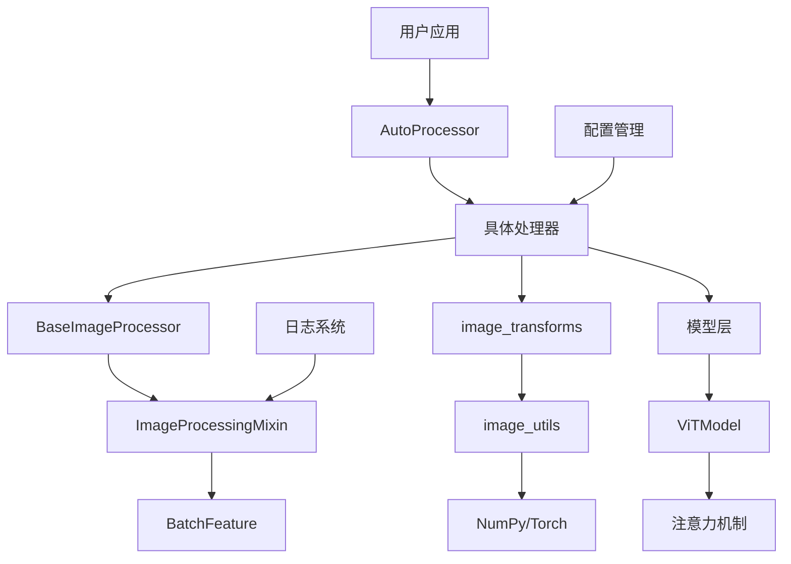

# 图像任务的低级API推理

<cite>
**本文档中引用的文件**
- [image_processing_base.py](file://src/transformers/image_processing_base.py)
- [image_processing_utils.py](file://src/transformers/image_processing_utils.py)
- [image_transforms.py](file://src/transformers/image_transforms.py)
- [image_utils.py](file://src/transformers/image_utils.py)
- [modeling_vit.py](file://src/transformers/models/vit/modeling_vit.py)
- [image_processing_clip.py](file://src/transformers/models/clip/image_processing_clip.py)
- [vision_encoder_decoder.py](file://src/transformers/models/vision_encoder_decoder/modeling_vision_encoder_decoder.py)
- [run_image_classification.py](file://examples/pytorch/image-classification/run_image_classification.py)
</cite>

## 目录
1. [简介](#简介)
2. [项目结构概览](#项目结构概览)
3. [核心组件](#核心组件)
4. [架构概览](#架构概览)
5. [详细组件分析](#详细组件分析)
6. [依赖关系分析](#依赖关系分析)
7. [性能考虑](#性能考虑)
8. [故障排除指南](#故障排除指南)
9. [结论](#结论)

## 简介

本文档详细介绍了transformers库中图像任务低级API推理系统的完整实现。该系统提供了从原始图像到模型输出的完整端到端处理流程，涵盖了视觉模型的初始化、图像预处理、模型推理和结果解析等关键环节。

transformers库的图像处理系统采用模块化设计，支持多种视觉任务，包括图像分类、目标检测、语义分割等。系统的核心优势在于其灵活的预处理管道、高效的注意力机制实现和优化的内存管理策略。

## 项目结构概览

transformers库的图像处理系统采用分层架构设计，主要包含以下核心模块：

**图表来源**
- [image_processing_base.py](file://src/transformers/image_processing_base.py#L50-L150)
- [image_processing_utils.py](file://src/transformers/image_processing_utils.py#L30-L80)

**章节来源**
- [image_processing_base.py](file://src/transformers/image_processing_base.py#L1-L100)
- [image_processing_utils.py](file://src/transformers/image_processing_utils.py#L1-L50)

## 核心组件

### 图像处理器基类

图像处理器系统的核心是`BaseImageProcessor`类，它定义了所有图像处理器的通用接口和行为模式。该类继承自`ImageProcessingMixin`，提供了保存、加载和配置管理功能。

主要特性包括：
- 统一的预处理接口
- 批量处理能力
- 配置参数验证
- 数据格式转换

### 图像变换工具

`image_transforms`模块提供了丰富的图像处理操作，包括：
- 尺寸调整和重采样
- 归一化和标准化
- 中心裁剪和填充
- 通道维度转换

### 模型架构

视觉Transformer模型采用标准的编码器-解码器架构，支持多种变体：
- ViT（Vision Transformer）
- Swin Transformer
- DeiT（Data-efficient Image Transformer）

**章节来源**
- [image_processing_utils.py](file://src/transformers/image_processing_utils.py#L30-L120)
- [image_transforms.py](file://src/transformers/image_transforms.py#L1-L100)

## 架构概览

图像任务低级API推理系统采用分层处理架构，确保了高度的模块化和可扩展性：

**图表来源**
- [image_processing_clip.py](file://src/transformers/models/clip/image_processing_clip.py#L50-L150)
- [modeling_vit.py](file://src/transformers/models/vit/modeling_vit.py#L100-L200)

## 详细组件分析

### 图像预处理流水线

图像预处理是整个推理流程的关键环节，涉及多个步骤的精确控制：

#### 1. 图像加载和验证

系统支持多种图像输入格式，包括本地文件路径、URL链接和Base64编码字符串。预处理流水线首先验证图像的有效性并进行基本格式转换。

**图表来源**
- [image_utils.py](file://src/transformers/image_utils.py#L600-L700)

#### 2. 尺寸调整和重采样

尺寸调整是图像预处理的核心步骤，支持多种重采样算法以适应不同的应用场景。

| 重采样方法 | 适用场景 | 性能特点 |
|------------|----------|----------|
| NEAREST | 分割任务，保持像素值不变 | 计算速度快，适合离散标签 |
| BILINEAR | 一般图像处理 | 平衡质量和速度 |
| BICUBIC | 高质量图像重建 | 质量高但计算成本较高 |
| LANCZOS | 专业图像处理 | 最高质量，计算最慢 |

#### 3. 归一化和标准化

归一化过程将像素值转换到模型期望的范围，并应用特定的均值和标准差参数。

**图表来源**
- [image_transforms.py](file://src/transformers/image_transforms.py#L400-L500)

**章节来源**
- [image_transforms.py](file://src/transformers/image_transforms.py#L300-L600)
- [image_utils.py](file://src/transformers/image_utils.py#L400-L600)

### 视觉Transformer模型架构

#### 位置编码机制

视觉Transformer采用可学习的位置编码来保留空间信息，支持动态插值以适应不同分辨率的输入。

**图表来源**
- [modeling_vit.py](file://src/transformers/models/vit/modeling_vit.py#L40-L150)

#### 注意力计算流程

注意力机制是视觉Transformer的核心，负责捕获图像中不同区域之间的关系。

**图表来源**
- [modeling_vit.py](file://src/transformers/models/vit/modeling_vit.py#L180-L250)

**章节来源**
- [modeling_vit.py](file://src/transformers/models/vit/modeling_vit.py#L40-L200)

### 批处理和内存优化

#### 动态批处理策略

系统支持动态批处理，根据可用内存和输入尺寸自动调整批次大小，最大化GPU利用率。

#### 内存管理优化

- **梯度检查点**：在内存受限的情况下启用
- **混合精度训练**：支持FP16以减少内存占用
- **缓存优化**：智能缓存中间结果

**章节来源**
- [vision_encoder_decoder.py](file://src/transformers/models/vision_encoder_decoder/modeling_vision_encoder_decoder.py#L200-L400)

## 依赖关系分析

图像处理系统的依赖关系呈现清晰的层次结构：

**图表来源**
- [image_processing_base.py](file://src/transformers/image_processing_base.py#L1-L50)
- [image_processing_utils.py](file://src/transformers/image_processing_utils.py#L1-L30)

**章节来源**
- [image_processing_base.py](file://src/transformers/image_processing_base.py#L1-L100)
- [image_processing_utils.py](file://src/transformers/image_processing_utils.py#L1-L50)

## 性能考虑

### 计算效率优化

1. **并行处理**：利用多核CPU进行图像预处理
2. **GPU加速**：优化的CUDA内核用于深度学习推理
3. **内存池**：预分配内存块以减少分配开销

### 预处理流水线优化

- **异步处理**：预处理和模型推理并行执行
- **缓存策略**：缓存频繁使用的预处理结果
- **批处理优化**：动态调整批次大小

### 不同视觉任务的实现示例

#### 图像分类

#### 目标检测

目标检测任务需要额外的边界框预测和非极大值抑制步骤。

#### 语义分割

语义分割任务输出每个像素的类别标签，需要特殊的后处理来恢复原始分辨率。

## 故障排除指南

### 常见问题和解决方案

1. **内存不足错误**
   - 减少批次大小
   - 启用梯度检查点
   - 使用混合精度训练

2. **图像尺寸不匹配**
   - 检查模型配置中的预期尺寸
   - 调整预处理参数
   - 使用动态尺寸处理

3. **性能瓶颈识别**
   - 监控GPU利用率
   - 分析预处理时间
   - 优化批处理策略

**章节来源**
- [run_image_classification.py](file://examples/pytorch/image-classification/run_image_classification.py#L1-L100)

## 结论

transformers库的图像任务低级API推理系统提供了一个强大而灵活的框架，支持各种视觉任务的高效处理。通过模块化的架构设计、优化的预处理流水线和先进的注意力机制，该系统能够满足从研究到生产环境的各种需求。

系统的主要优势包括：
- **灵活性**：支持多种图像格式和预处理选项
- **可扩展性**：易于添加新的模型和处理器
- **性能**：优化的内存管理和计算效率
- **易用性**：简洁的API设计和详细的文档

未来的发展方向包括进一步的性能优化、更多视觉任务的支持以及更好的硬件适配性。