# 多模态任务的低级API推理

<cite>
**本文档引用的文件**
- [processing_auto.py](file://src/transformers/models/auto/processing_auto.py)
- [processing_utils.py](file://src/transformers/processing_utils.py)
- [modeling_blip.py](file://src/transformers/models/blip/modeling_blip.py)
- [modeling_clip.py](file://src/transformers/models/clip/modeling_clip.py)
- [modeling_llava.py](file://src/transformers/models/llava/modeling_llava.py)
- [modeling_florence2.py](file://src/transformers/models/florence2/modeling_florence2.py)
- [processing_phi4_multimodal.py](file://src/transformers/models/phi4_multimodal/processing_phi4_multimodal.py)
- [processing_qwen3_omni_moe.py](file://src/transformers/models/qwen3_omni_moe/processing_qwen3_omni_moe.py)
- [modeling_bridgetower.py](file://src/transformers/models/bridgetower/modeling_bridgetower.py)
- [modeling_lxmert.py](file://src/transformers/models/lxmert/modeling_lxmert.py)
- [trainer_utils.py](file://src/transformers/trainer_utils.py)
- [cache.py](file://src/transformers/generation/continuous_batching/cache.py)
</cite>

## 目录
1. [简介](#简介)
2. [项目结构概览](#项目结构概览)
3. [核心组件](#核心组件)
4. [架构概览](#架构概览)
5. [详细组件分析](#详细组件分析)
6. [依赖关系分析](#依赖关系分析)
7. [性能考虑](#性能考虑)
8. [故障排除指南](#故障排除指南)
9. [结论](#结论)

## 简介

本文档详细介绍了Hugging Face Transformers库中多模态任务的低级API推理功能。多模态模型能够同时处理多种类型的数据，如文本、图像和音频，通过复杂的特征提取和融合机制实现跨模态的理解和生成能力。

多模态任务的核心挑战在于：
- 不同模态数据的独立预处理和特征提取
- 跨模态特征的对齐和融合策略
- 高效的内存管理和计算优化
- 大规模模型推理的性能调优

## 项目结构概览

Transformers库中的多模态功能主要分布在以下关键模块中：

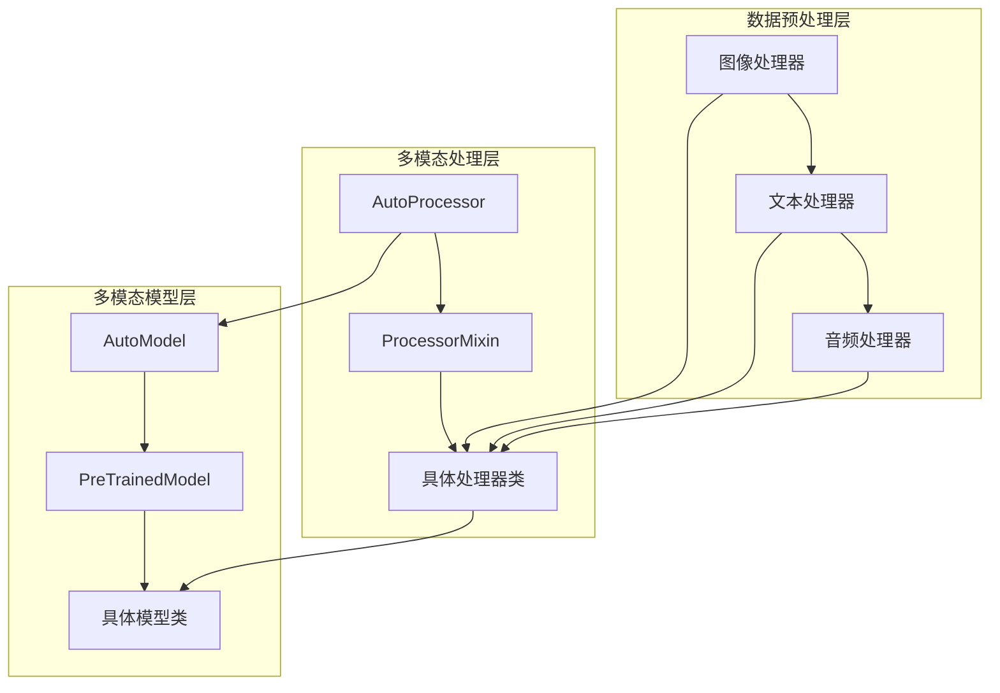

**图表来源**
- [processing_auto.py](file://src/transformers/models/auto/processing_auto.py#L186-L423)
- [processing_utils.py](file://src/transformers/processing_utils.py#L0-L200)

**章节来源**
- [processing_auto.py](file://src/transformers/models/auto/processing_auto.py#L186-L423)
- [processing_utils.py](file://src/transformers/processing_utils.py#L0-L200)

## 核心组件

### 自动化处理器系统

AutoProcessor是多模态任务的核心入口点，它能够根据模型配置自动选择合适的处理器：

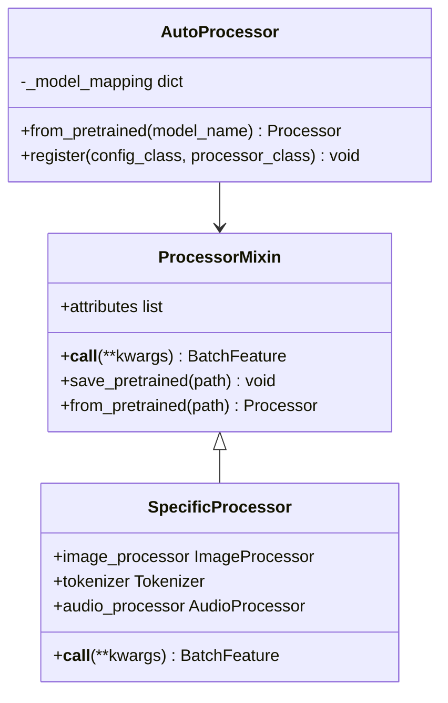

**图表来源**
- [processing_auto.py](file://src/transformers/models/auto/processing_auto.py#L186-L423)
- [processing_utils.py](file://src/transformers/processing_utils.py#L0-L200)

### 多模态模型架构

多模态模型通常采用编码器-解码器架构，包含专门的视觉和语言处理分支：

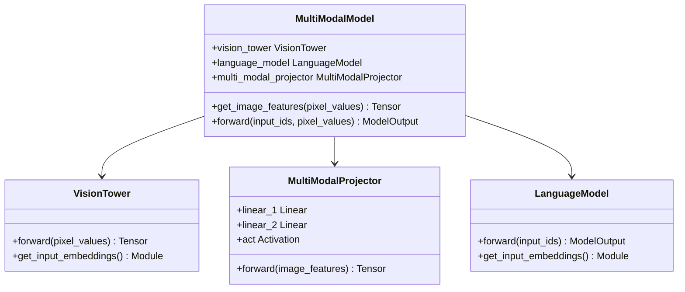

**图表来源**
- [modeling_llava.py](file://src/transformers/models/llava/modeling_llava.py#L100-L200)
- [modeling_blip.py](file://src/transformers/models/blip/modeling_blip.py#L600-L700)

**章节来源**
- [modeling_llava.py](file://src/transformers/models/llava/modeling_llava.py#L100-L200)
- [modeling_blip.py](file://src/transformers/models/blip/modeling_blip.py#L600-L700)

## 架构概览

多模态推理系统采用分层架构设计，从数据输入到最终输出经过多个处理阶段：

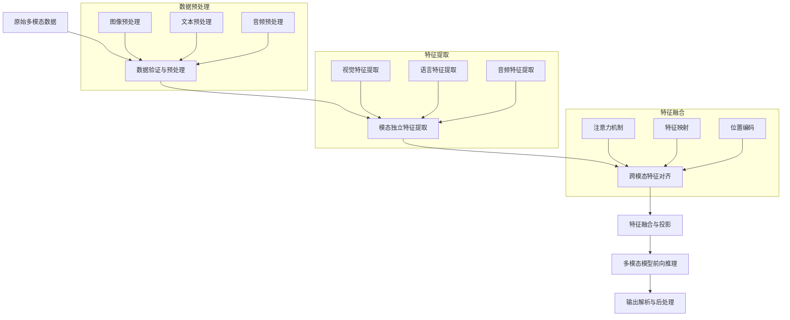

**图表来源**
- [processing_phi4_multimodal.py](file://src/transformers/models/phi4_multimodal/processing_phi4_multimodal.py#L126-L172)
- [modeling_florence2.py](file://src/transformers/models/florence2/modeling_florence2.py#L637-L782)

## 详细组件分析

### 数据预处理与特征提取

#### 图像数据处理

图像数据的预处理包括尺寸调整、归一化和位置编码：

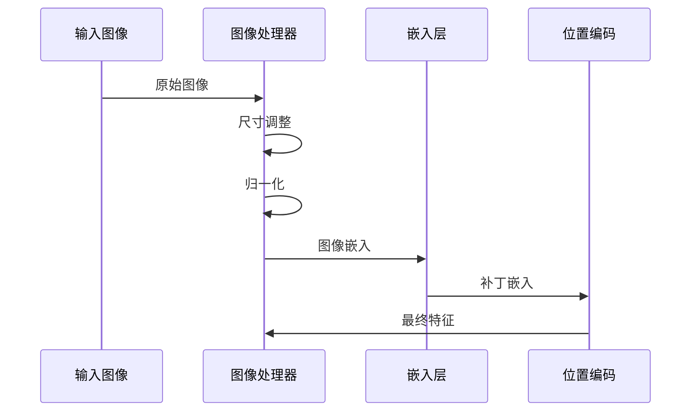

**图表来源**
- [modeling_clip.py](file://src/transformers/models/clip/modeling_clip.py#L200-L300)

#### 文本数据处理

文本数据通过分词器转换为模型可理解的序列：


**图表来源**
- [processing_utils.py](file://src/transformers/processing_utils.py#L100-L200)

#### 音频数据处理

音频数据需要进行特征提取和时间步对齐：

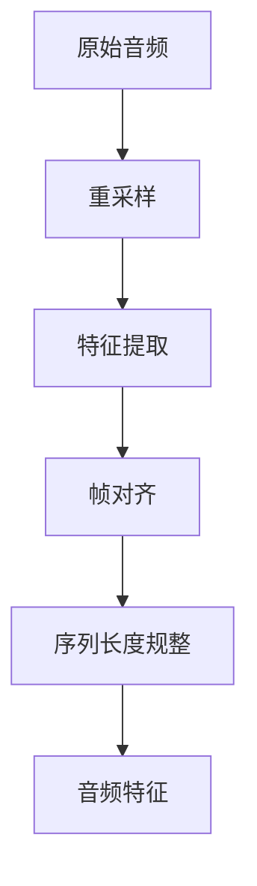

**图表来源**
- [processing_phi4_multimodal.py](file://src/transformers/models/phi4_multimodal/processing_phi4_multimodal.py#L44-L76)

### 跨模态特征融合

#### 注意力机制与特征对齐

多模态模型使用交叉注意力机制实现跨模态特征对齐：

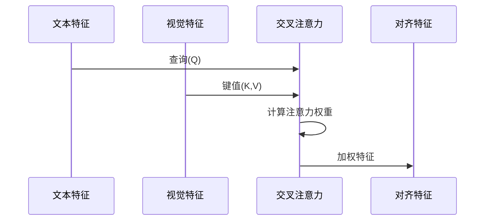

**图表来源**
- [modeling_bridgetower.py](file://src/transformers/models/bridgetower/modeling_bridgetower.py#L1352-L1411)
- [modeling_lxmert.py](file://src/transformers/models/lxmert/modeling_lxmert.py#L386-L424)

#### 特征投影与维度匹配

多模态特征需要通过投影层进行维度匹配：

```mermaid
flowchart LR
A[视觉特征<br/>H_v × W_v × D_v] --> B[多模态投影器]
C[语言特征<br/>L × D_l] --> B
B --> D[统一特征空间<br/>N × D_m]
subgraph "投影参数"
E[线性层1<br/>W₁ ∈ ℝ^(D_v×D_m)]
F[激活函数<br/>σ]
G[线性层2<br/>W₂ ∈ ℝ^(D_m×D_m)]
end
B --> E
E --> F
F --> G
G --> D
```

**图表来源**
- [modeling_llava.py](file://src/transformers/models/llava/modeling_llava.py#L80-L100)

### 多模态模型推理流程

#### 前向传播过程

多模态模型的前向传播包含多个关键步骤：

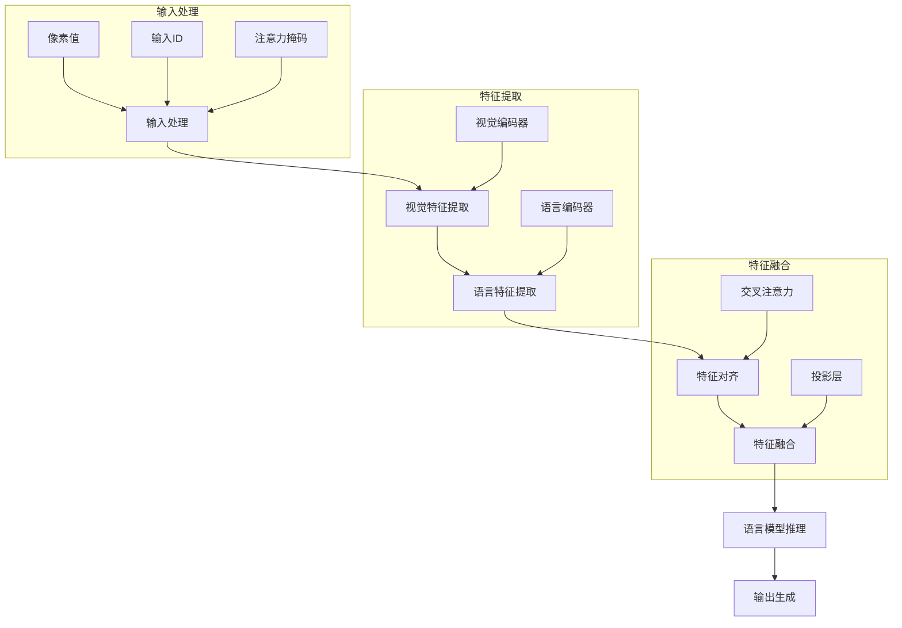

**图表来源**
- [modeling_florence2.py](file://src/transformers/models/florence2/modeling_florence2.py#L637-L782)

#### 输出解析与后处理

多模态模型的输出需要经过特定的解析和后处理：

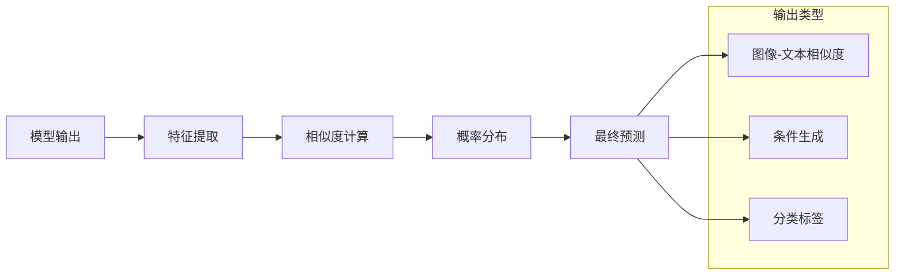

**图表来源**
- [modeling_clip.py](file://src/transformers/models/clip/modeling_clip.py#L742-L936)

**章节来源**
- [modeling_florence2.py](file://src/transformers/models/florence2/modeling_florence2.py#L637-L782)
- [modeling_clip.py](file://src/transformers/models/clip/modeling_clip.py#L742-L936)

### 典型多模态任务实现

#### 图文检索任务

图文检索任务通过计算图像和文本特征之间的相似度实现：

| 任务类型 | 输入模态 | 输出结果 | 应用场景 |
|---------|---------|---------|---------|
| 图像-文本检索 | 图像 + 文本查询 | 相似度分数 | 搜索引擎、内容推荐 |
| 文本-图像检索 | 文本描述 + 图像 | 匹配度评分 | 图像标注、内容理解 |
| 双向检索 | 图像 + 文本 | 双向相似度矩阵 | 多模态数据分析 |

#### 视觉问答任务

视觉问答结合图像理解和自然语言处理：

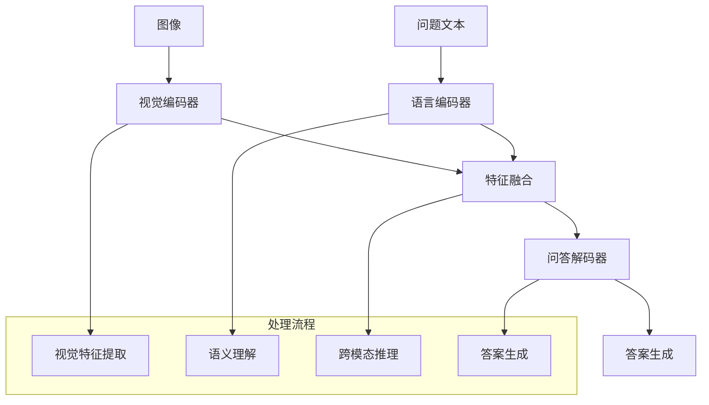

**图表来源**
- [modeling_llava.py](file://src/transformers/models/llava/modeling_llava.py#L400-L485)

#### 图文生成任务

图文生成任务根据文本提示生成相应的图像描述：

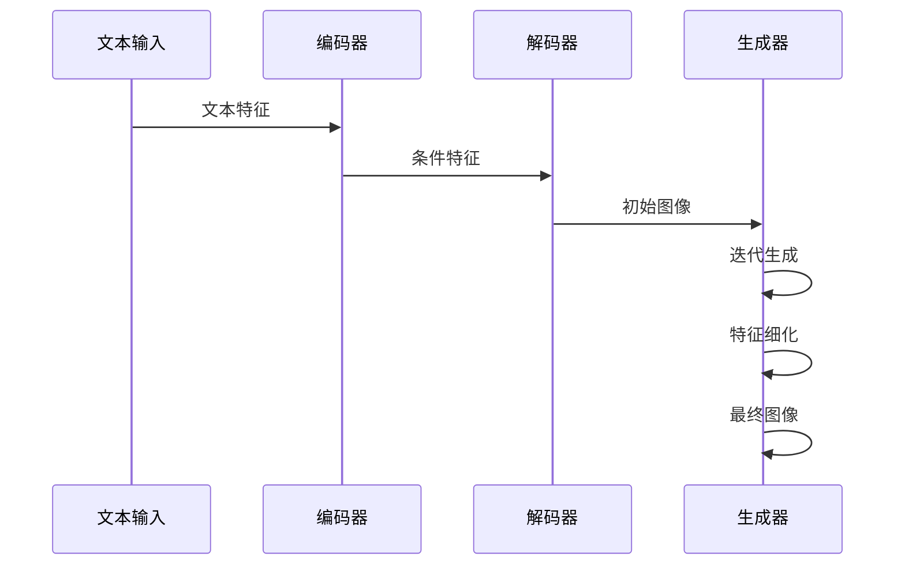

**图表来源**
- [modeling_blip.py](file://src/transformers/models/blip/modeling_blip.py#L700-L800)

**章节来源**
- [modeling_llava.py](file://src/transformers/models/llava/modeling_llava.py#L400-L485)
- [modeling_blip.py](file://src/transformers/models/blip/modeling_blip.py#L700-L800)

## 依赖关系分析

多模态系统的依赖关系复杂，涉及多个子系统的协调：

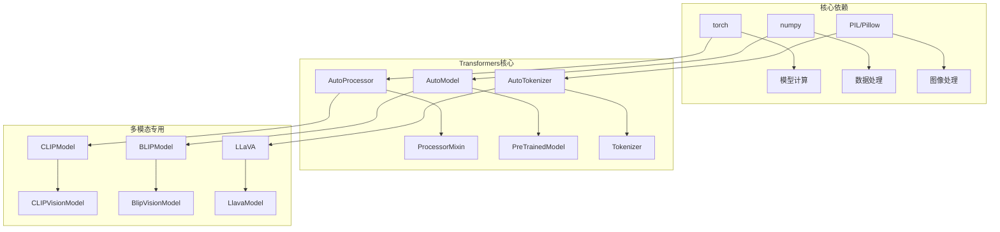

**图表来源**
- [processing_auto.py](file://src/transformers/models/auto/processing_auto.py#L186-L423)
- [modeling_clip.py](file://src/transformers/models/clip/modeling_clip.py#L1-L50)

**章节来源**
- [processing_auto.py](file://src/transformers/models/auto/processing_auto.py#L186-L423)

## 性能考虑

### 内存管理优化

多模态模型推理涉及大量张量操作，需要有效的内存管理策略：

#### 批处理优化

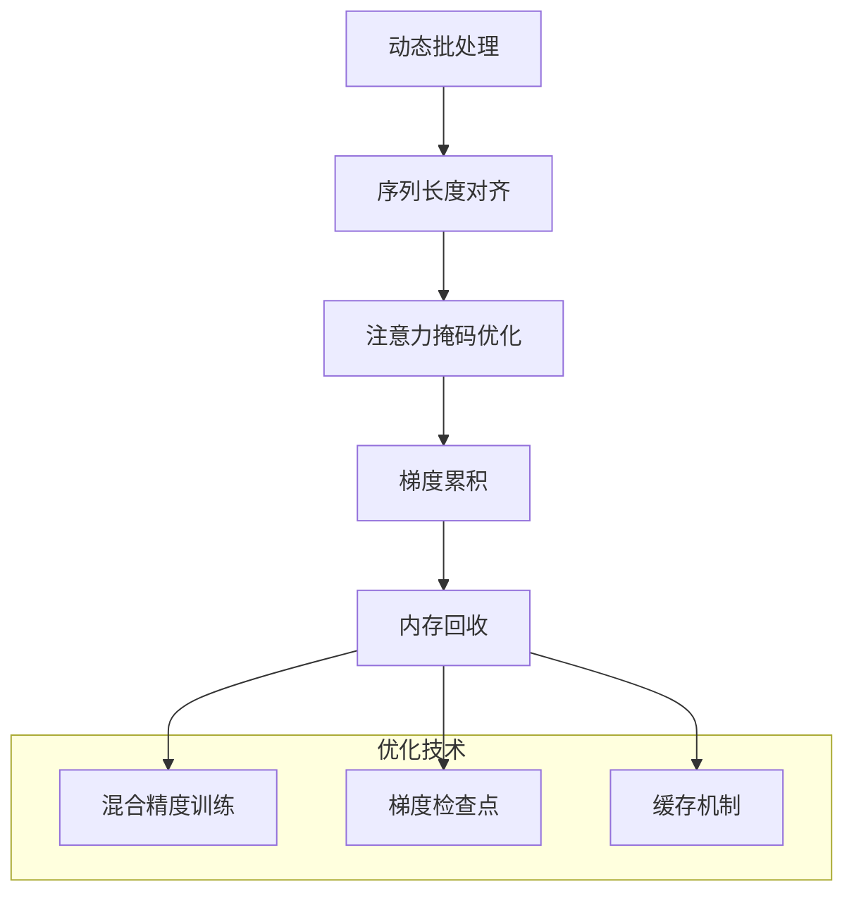

#### 连续批处理

连续批处理技术允许动态调整批次大小以最大化GPU利用率：

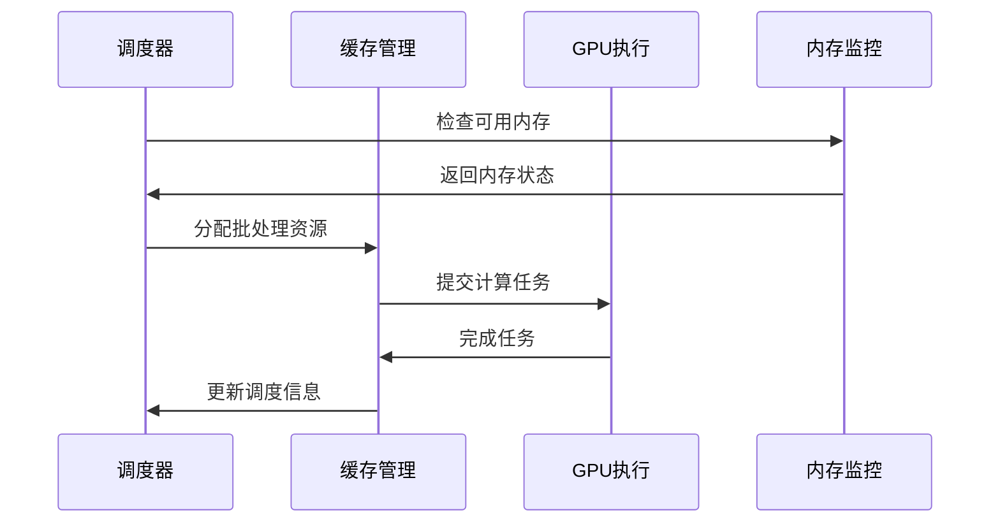

**图表来源**
- [cache.py](file://src/transformers/generation/continuous_batching/cache.py#L345-L367)

### 计算效率提升

#### 注意力机制优化

多模态模型中的注意力计算是主要的计算瓶颈：

| 优化技术 | 效果 | 适用场景 |
|---------|------|---------|
| Flash Attention | 减少内存占用，加速计算 | 大序列长度 |
| SDPA (Scaled Dot Product Attention) | 硬件加速支持 | 现代GPU |
| 稀疏注意力 | 降低计算复杂度 | 长序列处理 |
| 分块计算 | 减少内存峰值 | 大模型推理 |

#### 模型并行化

大型多模态模型可以通过多种方式进行并行化：

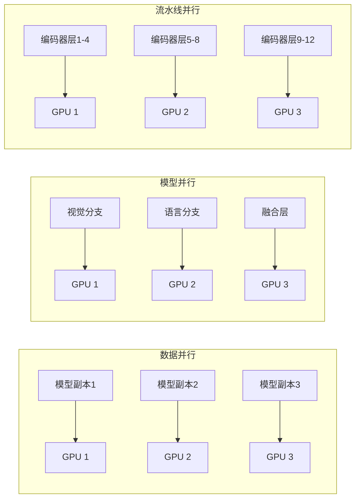

**章节来源**
- [cache.py](file://src/transformers/generation/continuous_batching/cache.py#L345-L367)
- [trainer_utils.py](file://src/transformers/trainer_utils.py#L764-L792)

## 故障排除指南

### 常见问题与解决方案

#### 内存不足错误

当遇到CUDA内存不足时，可以采取以下措施：

1. **减小批次大小**：使用`find_executable_batch_size`自动寻找可执行的批次大小
2. **启用梯度检查点**：减少中间激活的内存占用
3. **使用混合精度**：降低数据类型精度
4. **模型并行化**：将模型分布到多个GPU上

#### 特征维度不匹配

跨模态特征融合时常见的维度不匹配问题：

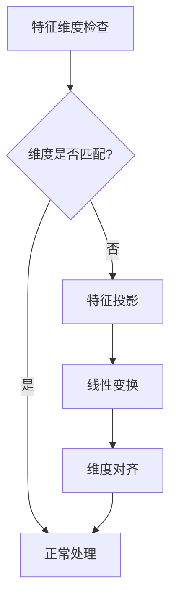

#### 多模态对齐问题

不同模态特征的对齐质量直接影响模型性能：

| 问题类型 | 症状 | 解决方案 |
|---------|------|---------|
| 时间对齐 | 音频-文本不同步 | 使用时间戳对齐 |
| 空间对齐 | 图像-文本区域不对应 | 增加空间注意力机制 |
| 语义对齐 | 意义不一致 | 使用语义约束训练 |

**章节来源**
- [trainer_utils.py](file://src/transformers/trainer_utils.py#L764-L792)

## 结论

Transformers库的多模态低级API提供了强大而灵活的框架来处理复杂的多模态推理任务。通过深入理解其架构设计和实现细节，开发者可以：

1. **高效处理多模态数据**：利用专门的处理器和模型实现高质量的多模态理解
2. **优化性能表现**：通过内存管理和计算优化技术提升推理效率
3. **解决实际问题**：在图文检索、视觉问答、图文生成等任务中取得优异效果
4. **扩展应用范围**：基于现有框架开发新的多模态应用场景

随着多模态AI技术的不断发展，这些底层API将继续演进，为更复杂的跨模态任务提供支持。开发者应该关注最新的技术进展，并根据具体需求选择合适的模型架构和优化策略。