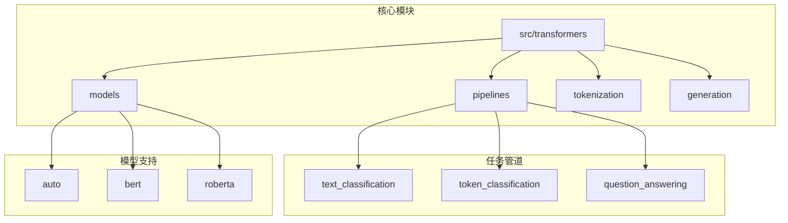
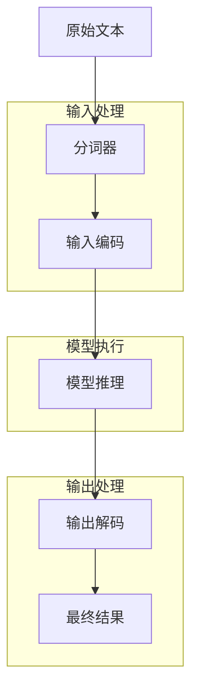
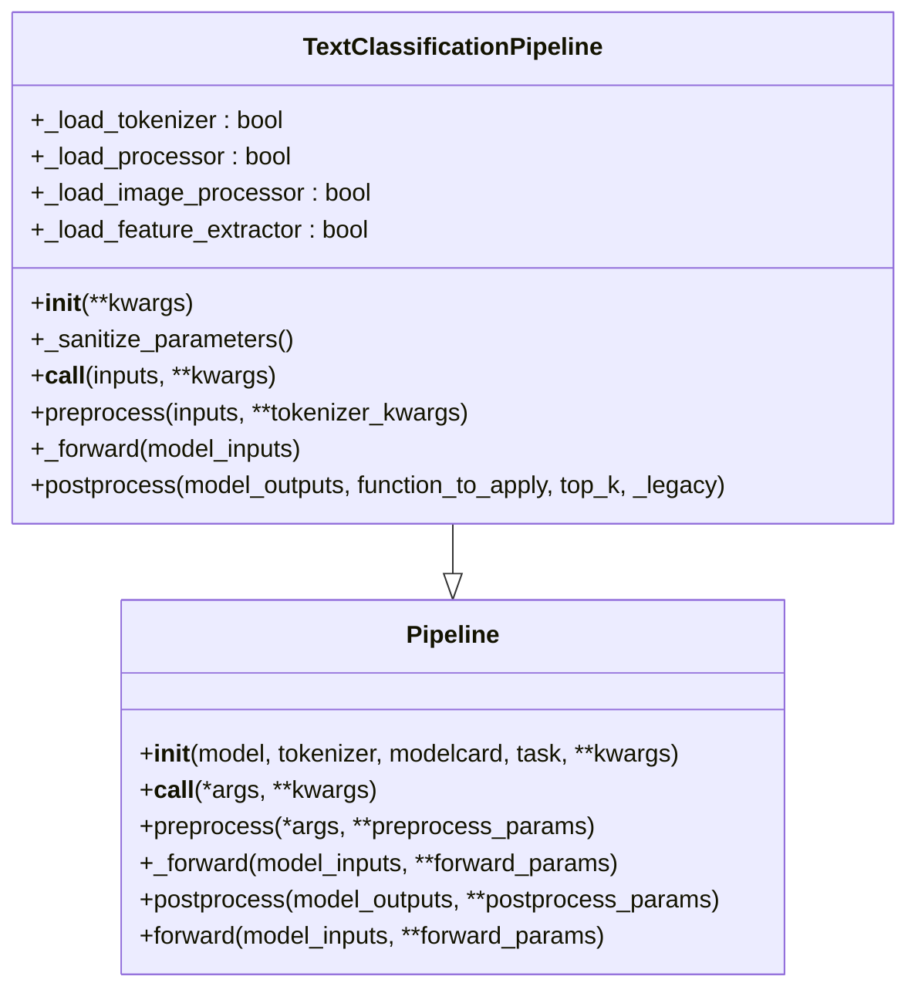
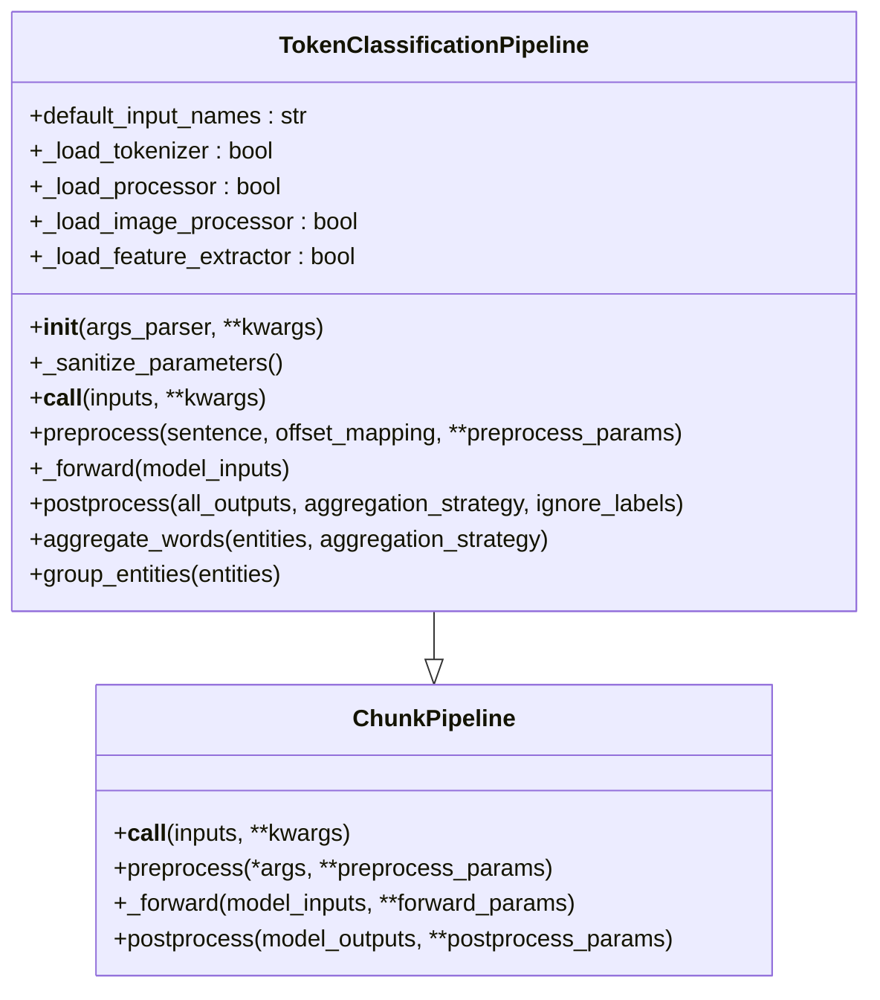
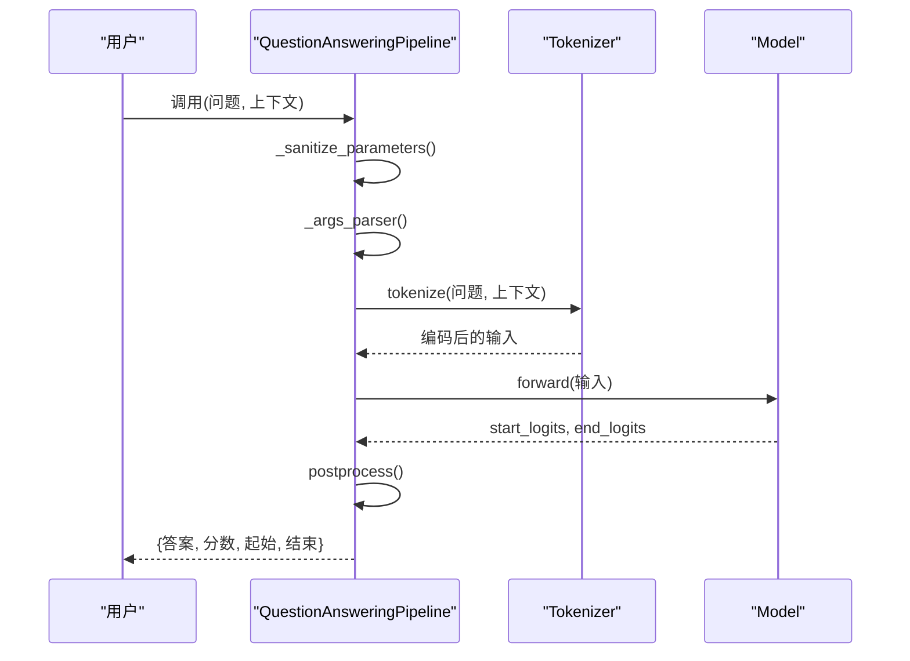
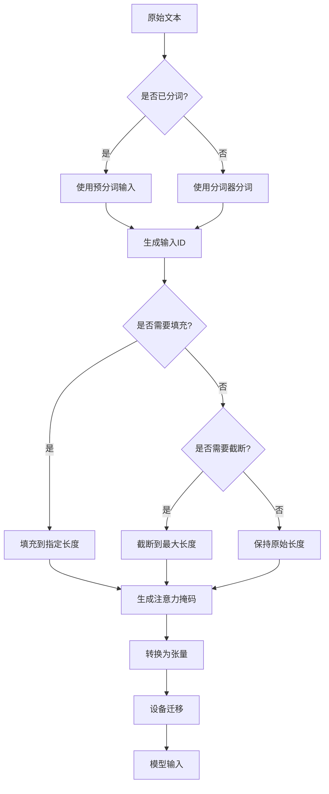
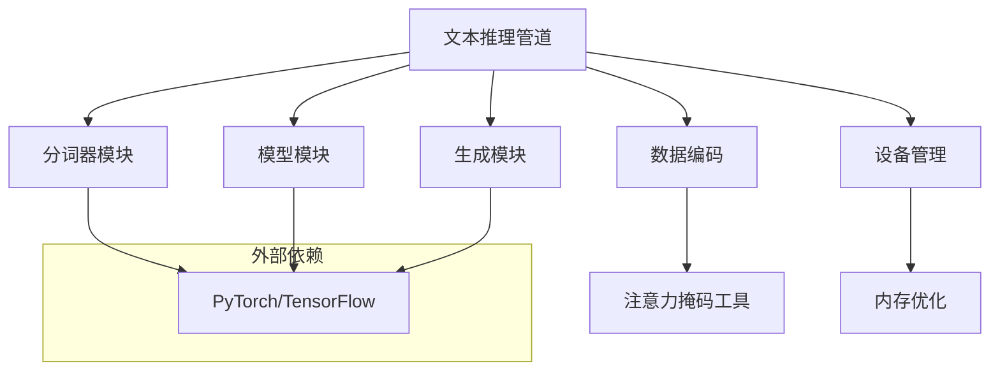
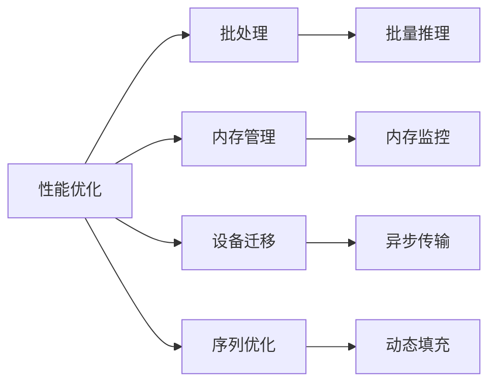

# 文本任务的低级API推理

<cite>
**本文档中引用的文件**   
- [text_classification.py](file://src/transformers/pipelines/text_classification.py)
- [token_classification.py](file://src/transformers/pipelines/token_classification.py)
- [question_answering.py](file://src/transformers/pipelines/question_answering.py)
- [tokenization_utils_base.py](file://src/transformers/tokenization_utils_base.py)
- [modeling_utils.py](file://src/transformers/modeling_utils.py)
- [base.py](file://src/transformers/pipelines/base.py)
- [modeling_attn_mask_utils.py](file://src/transformers/modeling_attn_mask_utils.py)
</cite>

## 目录
1. [引言](#引言)
2. [项目结构](#项目结构)
3. [核心组件](#核心组件)
4. [架构概述](#架构概述)
5. [详细组件分析](#详细组件分析)
6. [依赖分析](#依赖分析)
7. [性能考虑](#性能考虑)
8. [故障排除指南](#故障排除指南)
9. [结论](#结论)

## 引言
本文档详细介绍了如何使用transformers库的底层API处理文本推理任务。文档涵盖了从加载预训练模型和分词器开始的完整流程，包括输入文本的分词、编码、张量化处理，以及注意力掩码和位置编码的生成与管理。深入说明了如何将处理后的输入传递给模型进行前向推理，以及如何解码和解析模型输出。提供了文本分类、问答、命名实体识别等不同文本任务的具体实现示例。涵盖了批处理、序列填充、截断等关键技术的实现细节。解释了如何在CPU和GPU之间管理设备迁移，以及内存优化策略。为开发者提供了性能调优建议和常见问题解决方案。

## 项目结构
transformers库的项目结构组织良好，主要分为以下几个核心目录：

- **src/transformers**: 核心代码库，包含模型、分词器、管道等主要组件
- **examples**: 各种任务的使用示例
- **tests**: 单元测试和集成测试
- **docs**: 文档资源

核心的文本处理功能主要位于`src/transformers/pipelines`目录下，包括文本分类、命名实体识别、问答等任务的实现。

**图示来源**
- [text_classification.py](file://src/transformers/pipelines/text_classification.py)
- [token_classification.py](file://src/transformers/pipelines/token_classification.py)
- [question_answering.py](file://src/transformers/pipelines/question_answering.py)

**章节来源**
- [text_classification.py](file://src/transformers/pipelines/text_classification.py)
- [token_classification.py](file://src/transformers/pipelines/token_classification.py)
- [question_answering.py](file://src/transformers/pipelines/question_answering.py)

## 核心组件
transformers库的文本推理功能主要由以下几个核心组件构成：

1. **分词器(Tokenizers)**: 负责将原始文本转换为模型可处理的数字表示
2. **模型(Model)**: 预训练的神经网络模型，执行实际的推理任务
3. **管道(Pipelines)**: 封装了从输入处理到输出解析的完整流程
4. **数据编码器(Encoding)**: 管理输入序列的编码、填充和截断

这些组件协同工作，实现了从原始文本到最终预测结果的完整推理流程。

**章节来源**
- [text_classification.py](file://src/transformers/pipelines/text_classification.py#L1-L50)
- [token_classification.py](file://src/transformers/pipelines/token_classification.py#L1-L50)
- [question_answering.py](file://src/transformers/pipelines/question_answering.py#L1-L50)

## 架构概述
transformers库的文本推理架构采用分层设计，从底层的张量操作到高层的管道抽象，形成了完整的推理系统。

**图示来源**
- [text_classification.py](file://src/transformers/pipelines/text_classification.py)
- [token_classification.py](file://src/transformers/pipelines/token_classification.py)
- [question_answering.py](file://src/transformers/pipelines/question_answering.py)

## 详细组件分析

### 文本分类组件分析
文本分类管道实现了将文本分类为预定义类别的功能。该组件处理单个或批量文本输入，并返回分类结果及其置信度分数。

**图示来源**
- [text_classification.py](file://src/transformers/pipelines/text_classification.py#L1-L236)

**章节来源**
- [text_classification.py](file://src/transformers/pipelines/text_classification.py#L1-L236)

### 命名实体识别组件分析
命名实体识别(NER)管道用于识别文本中的实体，如人名、地点、组织等。该组件支持多种聚合策略，可以将子词(subword)级别的预测结果合并为完整的实体。

**图示来源**
- [token_classification.py](file://src/transformers/pipelines/token_classification.py#L1-L647)

**章节来源**
- [token_classification.py](file://src/transformers/pipelines/token_classification.py#L1-L647)

### 问答组件分析
问答管道实现了从给定上下文中提取答案的功能。该组件处理问题和上下文对，通过模型预测答案的起始和结束位置。

**图示来源**
- [question_answering.py](file://src/transformers/pipelines/question_answering.py#L1-L686)

**章节来源**
- [question_answering.py](file://src/transformers/pipelines/question_answering.py#L1-L686)

### 输入处理流程分析
文本输入处理流程包括分词、编码、张量化等关键步骤，确保输入数据符合模型要求。

**图示来源**
- [tokenization_utils_base.py](file://src/transformers/tokenization_utils_base.py#L3621-L3653)
- [base.py](file://src/transformers/pipelines/base.py#L1-L200)

**章节来源**
- [tokenization_utils_base.py](file://src/transformers/tokenization_utils_base.py#L3621-L3653)
- [base.py](file://src/transformers/pipelines/base.py#L1-L200)

## 依赖分析
transformers库的文本推理功能依赖于多个核心模块和外部库的协同工作。

**图示来源**
- [modeling_utils.py](file://src/transformers/modeling_utils.py#L1-L200)
- [modeling_attn_mask_utils.py](file://src/transformers/modeling_attn_mask_utils.py#L1-L200)

**章节来源**
- [modeling_utils.py](file://src/transformers/modeling_utils.py#L1-L200)
- [modeling_attn_mask_utils.py](file://src/transformers/modeling_attn_mask_utils.py#L1-L200)

## 性能考虑
在使用transformers库进行文本推理时，需要考虑以下几个性能优化方面：

1. **批处理**: 通过批量处理多个输入来提高GPU利用率
2. **内存管理**: 合理管理GPU内存，避免内存溢出
3. **设备迁移**: 有效管理CPU和GPU之间的数据传输
4. **序列长度**: 优化序列长度以平衡性能和准确性

**图示来源**
- [base.py](file://src/transformers/pipelines/base.py#L1163-L1173)
- [modeling_utils.py](file://src/transformers/modeling_utils.py#L5033-L5054)

**章节来源**
- [base.py](file://src/transformers/pipelines/base.py#L1163-L1173)
- [modeling_utils.py](file://src/transformers/modeling_utils.py#L5033-L5054)

## 故障排除指南
在使用transformers库进行文本推理时，可能会遇到以下常见问题：

1. **内存不足**: 模型太大无法加载到GPU内存中
2. **序列长度超限**: 输入序列超过模型的最大长度限制
3. **设备不匹配**: 模型和输入数据位于不同的设备上
4. **分词器不匹配**: 使用的分词器与模型不兼容

解决方案包括使用模型量化、梯度检查点、序列截断等技术。

**章节来源**
- [modeling_utils.py](file://src/transformers/modeling_utils.py#L5033-L5054)
- [base.py](file://src/transformers/pipelines/base.py#L1163-L1173)

## 结论
transformers库提供了强大而灵活的低级API，用于处理各种文本推理任务。通过深入理解其架构和组件，开发者可以有效地利用这些API构建高性能的文本处理应用。文档详细介绍了从输入处理到输出解析的完整流程，涵盖了文本分类、命名实体识别、问答等主要任务的实现细节。同时，文档还提供了性能优化和故障排除的实用建议，帮助开发者克服常见的挑战。