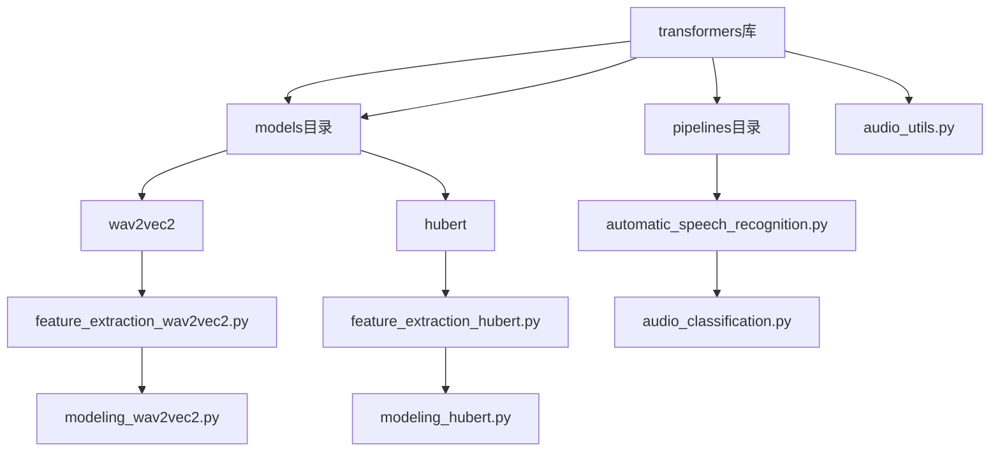
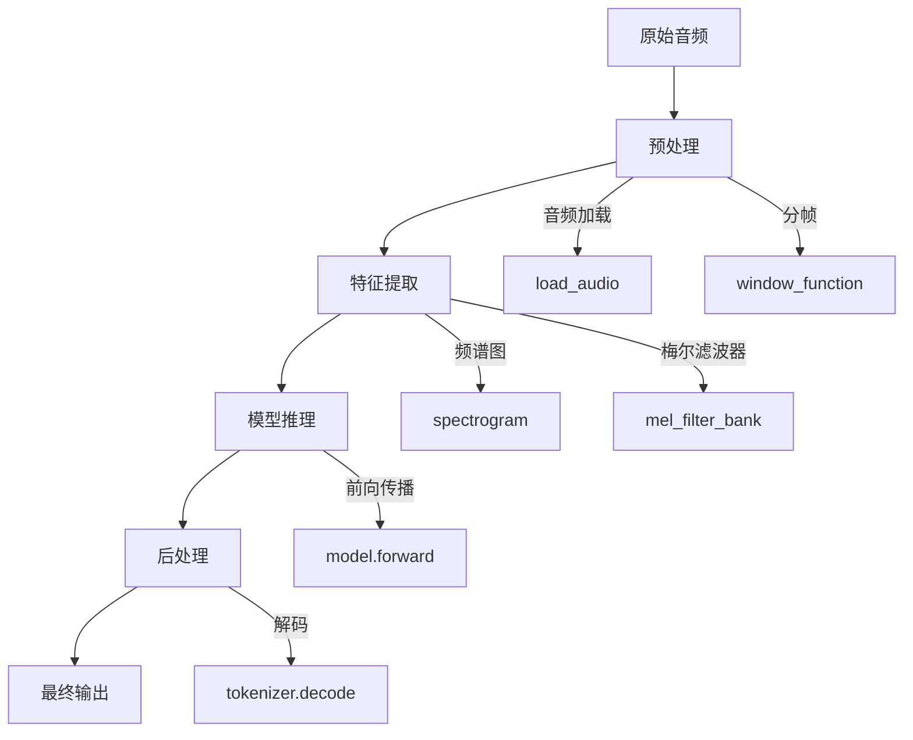
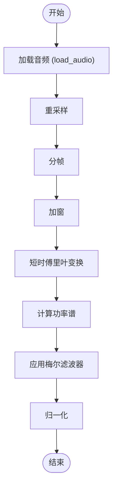
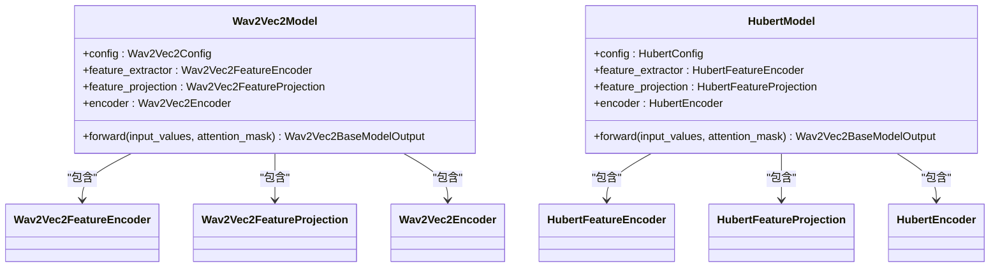
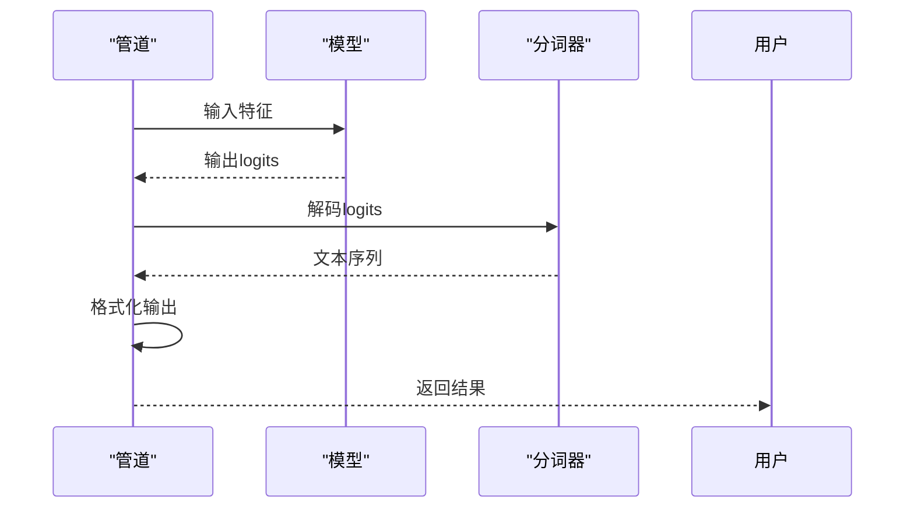
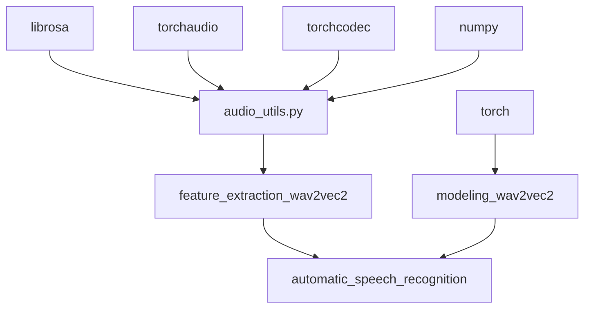

# 音频任务的低级API推理

<cite>
**本文档引用的文件**   
- [audio_utils.py](file://src/transformers/audio_utils.py)
- [feature_extraction_utils.py](file://src/transformers/feature_extraction_utils.py)
- [feature_extraction_wav2vec2.py](file://src/transformers/models/wav2vec2/feature_extraction_wav2vec2.py)
- [automatic_speech_recognition.py](file://src/transformers/pipelines/automatic_speech_recognition.py)
- [audio_classification.py](file://src/transformers/pipelines/audio_classification.py)
- [modeling_wav2vec2.py](file://src/transformers/models/wav2vec2/modeling_wav2vec2.py)
- [modeling_hubert.py](file://src/transformers/models/hubert/modeling_hubert.py)
</cite>

## 目录
1. [简介](#简介)
2. [项目结构](#项目结构)
3. [核心组件](#核心组件)
4. [架构概述](#架构概述)
5. [详细组件分析](#详细组件分析)
6. [依赖分析](#依赖分析)
7. [性能考虑](#性能考虑)
8. [故障排除指南](#故障排除指南)
9. [结论](#结论)

## 简介
本文档详细介绍了如何使用transformers库的低级API处理音频推理任务。重点阐述了从加载音频模型和特征提取器开始的完整流程，包括原始音频波形的预处理步骤，如采样率转换、分帧、特征提取（梅尔频谱图等）和张量化。深入说明了如何将处理后的音频特征输入模型进行前向推理，以及如何解码模型输出（如语音识别的文本序列、音频分类的标签等）。提供了自动语音识别、音频分类等不同音频任务的具体实现示例。涵盖了处理可变长度音频序列、批处理音频数据的技术细节。解释了音频模型特有的处理技术，如卷积特征提取器和时序建模。为开发者提供了音频预处理优化、内存管理和实时推理的实用建议。

## 项目结构
transformers库的音频处理功能主要分布在`src/transformers`目录下，特别是`models`和`pipelines`子目录。音频相关的模型（如wav2vec2、hubert）位于`models`目录中，每个模型都有对应的特征提取器和模型定义文件。`pipelines`目录包含了高级API，如自动语音识别和音频分类管道，这些管道封装了底层的音频处理逻辑。`audio_utils.py`文件提供了核心的音频处理函数，如加载音频、计算频谱图等。

**图源**
- [audio_utils.py](file://src/transformers/audio_utils.py)
- [feature_extraction_wav2vec2.py](file://src/transformers/models/wav2vec2/feature_extraction_wav2vec2.py)
- [modeling_wav2vec2.py](file://src/transformers/models/wav2vec2/modeling_wav2vec2.py)
- [automatic_speech_recognition.py](file://src/transformers/pipelines/automatic_speech_recognition.py)
- [audio_classification.py](file://src/transformers/pipelines/audio_classification.py)

**节源**
- [audio_utils.py](file://src/transformers/audio_utils.py)
- [feature_extraction_utils.py](file://src/transformers/feature_extraction_utils.py)

## 核心组件
音频任务的低级API推理涉及多个核心组件，包括音频加载、特征提取、模型推理和结果解码。`audio_utils.py`提供了基础的音频处理函数，如`load_audio`用于加载音频文件，`spectrogram`用于计算频谱图。`Wav2Vec2FeatureExtractor`和`HubertFeatureExtractor`等特征提取器类负责将原始音频波形转换为模型可接受的输入格式。`AutomaticSpeechRecognitionPipeline`和`AudioClassificationPipeline`等管道类封装了从音频输入到最终输出的完整流程。

**节源**
- [audio_utils.py](file://src/transformers/audio_utils.py#L0-L1227)
- [feature_extraction_wav2vec2.py](file://src/transformers/models/wav2vec2/feature_extraction_wav2vec2.py#L0-L243)
- [automatic_speech_recognition.py](file://src/transformers/pipelines/automatic_speech_recognition.py#L0-L673)

## 架构概述
音频推理的架构可以分为三个主要阶段：预处理、模型推理和后处理。预处理阶段包括音频加载、采样率转换、分帧和特征提取。模型推理阶段将处理后的音频特征输入到预训练的音频模型中，如wav2vec2或hubert，进行前向传播。后处理阶段将模型的输出解码为最终结果，如文本序列或分类标签。

**图源**
- [audio_utils.py](file://src/transformers/audio_utils.py#L0-L1227)
- [feature_extraction_wav2vec2.py](file://src/transformers/models/wav2vec2/feature_extraction_wav2vec2.py#L0-L243)
- [modeling_wav2vec2.py](file://src/transformers/models/wav2vec2/modeling_wav2vec2.py#L0-L2285)

## 详细组件分析

### 音频预处理分析
音频预处理是音频推理的第一步，主要包括音频加载、采样率转换和特征提取。`load_audio`函数支持从本地文件、URL或numpy数组加载音频，并可选择使用`librosa`或`torchcodec`进行解码。`spectrogram`函数实现了短时傅里叶变换，将时域信号转换为频域表示。`mel_filter_bank`函数创建梅尔滤波器组，用于将线性频谱转换为梅尔频谱，更好地模拟人耳的听觉特性。

**图源**
- [audio_utils.py](file://src/transformers/audio_utils.py#L0-L1227)

**节源**
- [audio_utils.py](file://src/transformers/audio_utils.py#L0-L1227)

### 模型推理分析
模型推理阶段将预处理后的音频特征输入到预训练的音频模型中。`Wav2Vec2Model`和`HubertModel`等模型类实现了音频编码器，通常由卷积特征提取器和Transformer编码器组成。卷积特征提取器将原始音频波形转换为高维特征表示，Transformer编码器则捕捉长距离的时序依赖关系。模型的前向传播过程通过`forward`方法实现，输出为隐藏状态或logits。

**图源**
- [modeling_wav2vec2.py](file://src/transformers/models/wav2vec2/modeling_wav2vec2.py#L0-L2285)
- [modeling_hubert.py](file://src/transformers/models/hubert/modeling_hubert.py#L0-L1237)

**节源**
- [modeling_wav2vec2.py](file://src/transformers/models/wav2vec2/modeling_wav2vec2.py#L0-L2285)
- [modeling_hubert.py](file://src/transformers/models/hubert/modeling_hubert.py#L0-L1237)

### 后处理分析
后处理阶段将模型的输出解码为最终结果。对于自动语音识别任务，`Wav2Vec2CTCTokenizer`或`WhisperTokenizer`等分词器将logits解码为文本序列。对于音频分类任务，`postprocess`方法将logits通过softmax函数转换为概率分布，并返回top-k个预测标签。`AutomaticSpeechRecognitionPipeline`和`AudioClassificationPipeline`等管道类封装了完整的后处理逻辑。

**图源**
- [automatic_speech_recognition.py](file://src/transformers/pipelines/automatic_speech_recognition.py#L0-L673)
- [audio_classification.py](file://src/transformers/pipelines/audio_classification.py#L0-L260)

**节源**
- [automatic_speech_recognition.py](file://src/transformers/pipelines/automatic_speech_recognition.py#L0-L673)
- [audio_classification.py](file://src/transformers/pipelines/audio_classification.py#L0-L260)

## 依赖分析
音频推理功能依赖于多个外部库，如`librosa`、`torchaudio`和`torchcodec`，用于音频加载和处理。`numpy`和`torch`是核心的数值计算库。`transformers`库内部的模块之间也有复杂的依赖关系，如`audio_utils.py`被`feature_extraction_wav2vec2.py`和`automatic_speech_recognition.py`等文件所依赖。

**图源**
- [audio_utils.py](file://src/transformers/audio_utils.py#L0-L1227)
- [feature_extraction_wav2vec2.py](file://src/transformers/models/wav2vec2/feature_extraction_wav2vec2.py#L0-L243)
- [modeling_wav2vec2.py](file://src/transformers/models/wav2vec2/modeling_wav2vec2.py#L0-L2285)
- [automatic_speech_recognition.py](file://src/transformers/pipelines/automatic_speech_recognition.py#L0-L673)

**节源**
- [audio_utils.py](file://src/transformers/audio_utils.py#L0-L1227)

## 性能考虑
在处理音频推理任务时，需要考虑内存使用、计算效率和实时性。批处理可以提高GPU利用率，但会增加内存消耗。对于长音频，可以使用流式处理或分块处理来减少内存占用。使用半精度浮点数（float16）可以减少内存使用和计算时间，但可能会影响模型精度。对于实时应用，需要优化预处理和推理的延迟。

**节源**
- [audio_utils.py](file://src/transformers/audio_utils.py#L0-L1227)
- [automatic_speech_recognition.py](file://src/transformers/pipelines/automatic_speech_recognition.py#L0-L673)

## 故障排除指南
在使用音频推理API时，可能会遇到各种问题。常见的问题包括音频格式不支持、采样率不匹配、内存不足等。确保音频文件格式正确，并使用正确的采样率。对于内存不足的问题，可以尝试减小批处理大小或使用更小的模型。对于精度问题，可以尝试使用全精度浮点数或调整模型参数。

**节源**
- [audio_utils.py](file://src/transformers/audio_utils.py#L0-L1227)
- [automatic_speech_recognition.py](file://src/transformers/pipelines/automatic_speech_recognition.py#L0-L673)

## 结论
本文档详细介绍了transformers库中音频任务的低级API推理。通过分析核心组件、架构和实现细节，为开发者提供了全面的指导。理解这些底层机制有助于更好地利用预训练音频模型，并根据具体需求进行定制和优化。