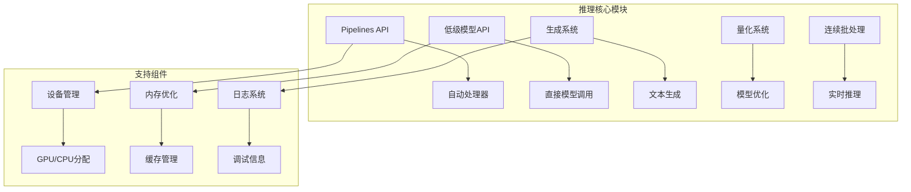
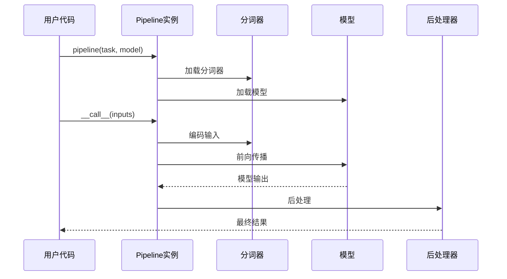
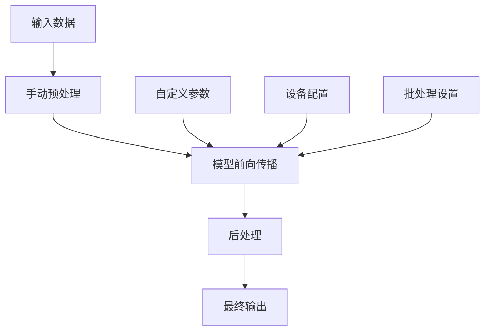
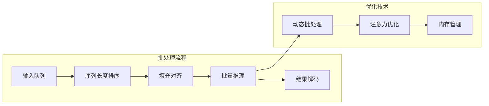
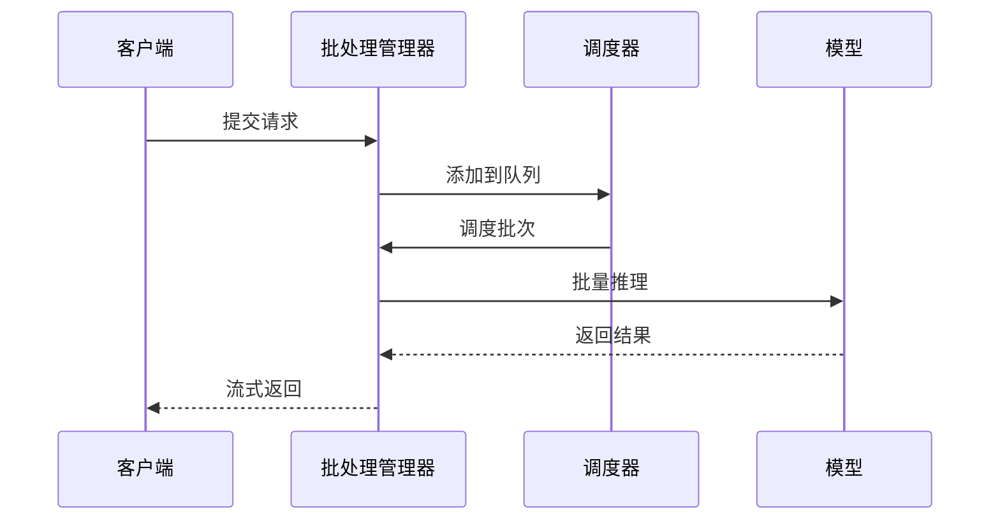
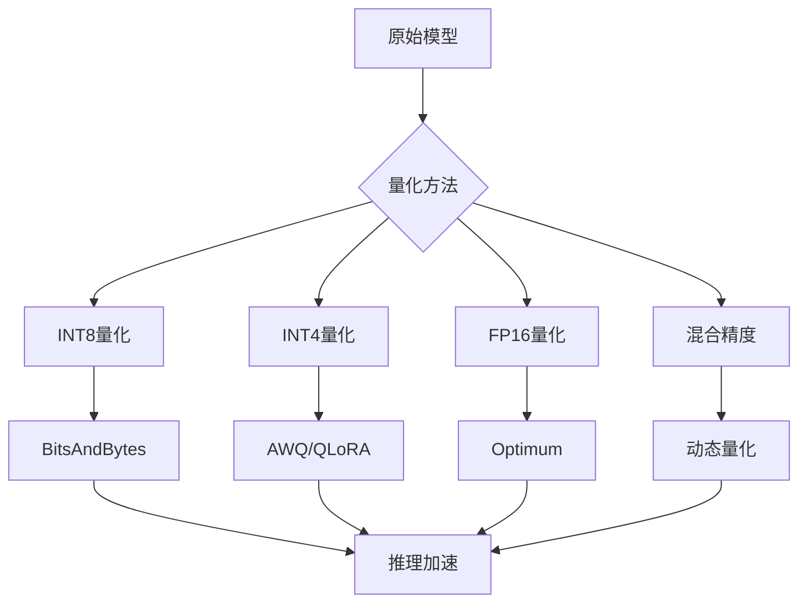
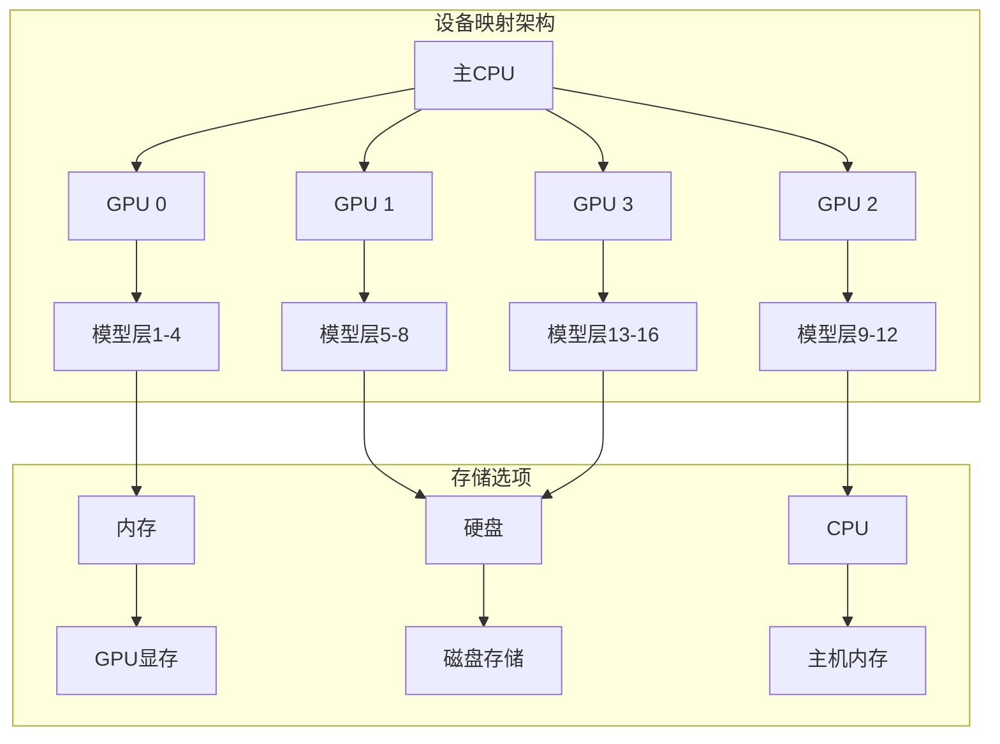
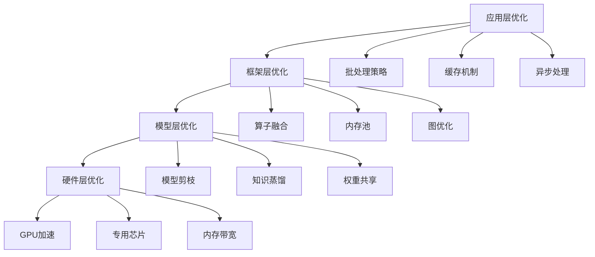
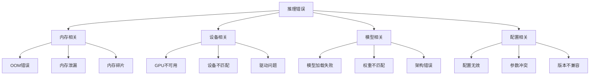

# 推理指南

<cite>
**本文档中引用的文件**
- [src/transformers/pipelines/__init__.py](file://src/transformers/pipelines/__init__.py)
- [src/transformers/pipelines/base.py](file://src/transformers/pipelines/base.py)
- [src/transformers/quantizers/__init__.py](file://src/transformers/quantizers/__init__.py)
- [src/transformers/models/auto/modeling_auto.py](file://src/transformers/models/auto/modeling_auto.py)
- [src/transformers/generation/continuous_batching/continuous_api.py](file://src/transformers/generation/continuous_batching/continuous_api.py)
- [examples/pytorch/text-generation/run_generation.py](file://examples/pytorch/text-generation/run_generation.py)
- [examples/pytorch/text-generation/README.md](file://examples/pytorch/text-generation/README.md)
- [src/transformers/utils/logging.py](file://src/transformers/utils/logging.py)
- [src/transformers/integrations/accelerate.py](file://src/transformers/integrations/accelerate.py)
</cite>

## 目录
1. [简介](#简介)
2. [项目结构概览](#项目结构概览)
3. [Pipeline API基础](#pipeline-api基础)
4. [低级API详解](#低级api详解)
5. [批处理与序列管理](#批处理与序列管理)
6. [实时推理与连续批处理](#实时推理与连续批处理)
7. [模型量化与优化](#模型量化与优化)
8. [设备映射与分布式推理](#设备映射与分布式推理)
9. [性能优化策略](#性能优化策略)
10. [故障排除指南](#故障排除指南)
11. [最佳实践](#最佳实践)
12. [总结](#总结)

## 简介

本指南全面介绍了使用Hugging Face Transformers库进行模型推理的各种方法和技术。从简单的Pipeline API到复杂的低级模型调用，再到高级的量化和优化技术，我们将深入探讨每种推理方式的特点、适用场景和最佳实践。

推理是将训练好的模型应用于新数据的过程，是机器学习应用的核心环节。通过本指南，您将学会如何高效地部署和优化各种类型的模型推理，包括文本生成、分类、问答等各种任务。

## 项目结构概览

Transformers库的推理功能主要分布在以下几个核心模块中：



**图表来源**
- [src/transformers/pipelines/__init__.py](file://src/transformers/pipelines/__init__.py#L1-L50)
- [src/transformers/pipelines/base.py](file://src/transformers/pipelines/base.py#L1-L50)

**章节来源**
- [src/transformers/pipelines/__init__.py](file://src/transformers/pipelines/__init__.py#L1-L100)
- [src/transformers/pipelines/base.py](file://src/transformers/pipelines/base.py#L1-L100)

## Pipeline API基础

Pipeline API是使用Transformers库进行推理最简单的方式，它封装了完整的预处理、模型推理和后处理流程。

### 基础使用方法



**图表来源**
- [src/transformers/pipelines/base.py](file://src/transformers/pipelines/base.py#L1141-L1164)
- [src/transformers/pipelines/__init__.py](file://src/transformers/pipelines/__init__.py#L600-L700)

### 支持的任务类型

Transformers库支持多种任务类型的Pipeline：

| 任务类型 | 描述 | 示例 |
|---------|------|------|
| 文本分类 | 将文本分类到预定义类别 | sentiment-analysis, text-classification |
| 问答系统 | 从上下文中提取答案 | question-answering |
| 文本生成 | 生成连贯的文本序列 | text-generation, summarization |
| 填充掩码 | 预测被掩码的token | fill-mask |
| 命名实体识别 | 标注文本中的实体 | token-classification, ner |
| 图像分类 | 对图像进行分类 | image-classification |

### 常见任务示例

#### 文本分类
```python
from transformers import pipeline

# 情感分析
classifier = pipeline("sentiment-analysis")
result = classifier("我很喜欢这个产品！")
# 输出: [{'label': 'POSITIVE', 'score': 0.9997}]
```

#### 问答系统
```python
# 问题回答
qa_pipeline = pipeline("question-answering")
result = qa_pipeline({
    "question": "Transformers库的主要用途是什么？",
    "context": "Transformers库是一个强大的自然语言处理工具包..."
})
# 输出: {'score': 0.95, 'start': 10, 'end': 30, 'answer': '自然语言处理'}
```

#### 文本生成
```python
# 文本生成
generator = pipeline("text-generation")
result = generator("未来的人工智能会如何发展？", max_length=50)
# 输出: ['未来的人工智能将在多个领域发挥重要作用...']
```

**章节来源**
- [src/transformers/pipelines/__init__.py](file://src/transformers/pipelines/__init__.py#L364-L396)
- [src/transformers/pipelines/text_classification.py](file://src/transformers/pipelines/text_classification.py#L1-L50)

## 低级API详解

低级API允许用户直接控制模型的前向传播过程，提供更大的灵活性和精确控制。

### 直接模型调用



**图表来源**
- [src/transformers/pipelines/base.py](file://src/transformers/pipelines/base.py#L1141-L1164)

### 模型加载与配置

低级API的核心优势在于对模型加载过程的完全控制：

```python
# 自定义模型加载
from transformers import AutoModel, AutoTokenizer, AutoConfig

# 加载配置
config = AutoConfig.from_pretrained("bert-base-uncased")
config.output_attentions = True

# 加载模型和分词器
model = AutoModel.from_pretrained(
    "bert-base-uncased",
    config=config,
    device_map="auto",
    torch_dtype=torch.float16
)
tokenizer = AutoTokenizer.from_pretrained("bert-base-uncased")
```

### 输入输出处理

低级API需要手动处理输入编码和输出解码：

```python
# 手动处理输入
inputs = tokenizer("这是一个测试句子", return_tensors="pt")
with torch.no_grad():
    outputs = model(**inputs)

# 处理输出
last_hidden_state = outputs.last_hidden_state
pooler_output = outputs.pooler_output
```

**章节来源**
- [src/transformers/models/auto/modeling_auto.py](file://src/transformers/models/auto/modeling_auto.py#L1-L200)
- [examples/pytorch/text-generation/run_generation.py](file://examples/pytorch/text-generation/run_generation.py#L1-L100)

## 批处理与序列管理

高效的批处理是提升推理性能的关键技术，特别是在处理大量数据时。

### 批处理策略



**图表来源**
- [src/transformers/pipelines/base.py](file://src/transformers/pipelines/base.py#L80-L150)

### 序列长度管理

有效的序列长度管理可以显著提升内存利用率和推理速度：

```python
# 动态批处理示例
def dynamic_batching(inputs, max_tokens=2048):
    # 按序列长度排序
    sorted_inputs = sorted(inputs, key=lambda x: len(x), reverse=True)
    
    batches = []
    current_batch = []
    current_tokens = 0
    
    for input_text in sorted_inputs:
        input_tokens = len(tokenizer(input_text)['input_ids'])
        
        if current_tokens + input_tokens > max_tokens:
            batches.append(current_batch)
            current_batch = [input_text]
            current_tokens = input_tokens
        else:
            current_batch.append(input_text)
            current_tokens += input_tokens
    
    if current_batch:
        batches.append(current_batch)
    
    return batches
```

### 内存优化技术

| 技术 | 描述 | 适用场景 |
|------|------|----------|
| 梯度检查点 | 重新计算中间激活值 | 内存受限环境 |
| 混合精度 | 使用FP16减少内存占用 | GPU推理 |
| 模型分片 | 将大模型分割到多个设备 | 超大模型 |
| KV缓存优化 | 优化键值对存储 | 生成任务 |

**章节来源**
- [src/transformers/pipelines/base.py](file://src/transformers/pipelines/base.py#L80-L200)

## 实时推理与连续批处理

连续批处理是处理实时请求的高级技术，特别适用于聊天机器人和交互式应用。

### 连续批处理架构



**图表来源**
- [src/transformers/generation/continuous_batching/continuous_api.py](file://src/transformers/generation/continuous_batching/continuous_api.py#L697-L729)

### 实时生成实现

连续批处理的核心优势在于能够同时处理多个并发请求：

```python
# 连续批处理示例
from transformers import AutoModelForCausalLM, AutoTokenizer
from transformers.generation.continuous_batching import ContinuousBatchingManager

# 初始化模型和分词器
model = AutoModelForCausalLM.from_pretrained("gpt2", device_map="auto")
tokenizer = AutoTokenizer.from_pretrained("gpt2")

# 创建连续批处理管理器
manager = model.init_continuous_batching()
manager.start()

# 处理多个并发请求
requests = [
    "解释一下量子计算的基本原理。",
    "写一首关于春天的诗。",
    "如何制作披萨？"
]

request_ids = []
for prompt in requests:
    inputs = tokenizer(prompt, return_tensors="pt").input_ids.to(model.device)
    request_id = manager.add_request(inputs, max_new_tokens=100, streaming=True)
    request_ids.append(request_id)

# 获取结果
results = []
for request_id in request_ids:
    for chunk in manager.request_id_iter(request_id):
        results.append(chunk)
```

### 流式生成

流式生成允许在生成过程中逐步返回结果，提升用户体验：

```python
# 流式生成示例
def stream_generation(model, tokenizer, prompt, max_tokens=100):
    inputs = tokenizer(prompt, return_tensors="pt").to(model.device)
    
    for token in model.generate(
        inputs.input_ids,
        max_new_tokens=max_tokens,
        pad_token_id=tokenizer.eos_token_id,
        streamer=TextStreamer(tokenizer)
    ):
        yield tokenizer.decode(token, skip_special_tokens=True)
```

**章节来源**
- [src/transformers/generation/continuous_batching/continuous_api.py](file://src/transformers/generation/continuous_batching/continuous_api.py#L408-L436)
- [examples/pytorch/continuous_batching.py](file://examples/pytorch/continuous_batching.py#L38-L63)

## 模型量化与优化

模型量化是减少模型大小和提升推理速度的重要技术，特别适用于资源受限的环境。

### 量化技术概览



**图表来源**
- [src/transformers/quantizers/__init__.py](file://src/transformers/quantizers/__init__.py#L1-L17)

### 常用量化方法

| 方法 | 精度 | 内存节省 | 性能影响 | 适用场景 |
|------|------|----------|----------|----------|
| INT8 | 8位整数 | 50% | 轻微 | 移动设备 |
| INT4 | 4位整数 | 75% | 中等 | 边缘计算 |
| FP16 | 半精度浮点 | 50% | 极小 | GPU推理 |
| 动态量化 | 变化 | 25-50% | 很小 | 实时应用 |

### 量化实现示例

```python
# INT8量化
from transformers import BitsAndBytesConfig, AutoModelForCausalLM

# 配置INT8量化
quantization_config = BitsAndBytesConfig(
    load_in_8bit=True,
    llm_int8_threshold=6.0,
    llm_int8_skip_modules=["lm_head"]
)

# 加载量化模型
model = AutoModelForCausalLM.from_pretrained(
    "microsoft/DialoGPT-medium",
    quantization_config=quantization_config,
    device_map="auto"
)

# INT4量化（更激进）
from transformers import BitsAndBytesConfig

quantization_config = BitsAndBytesConfig(
    load_in_4bit=True,
    bnb_4bit_compute_dtype=torch.float16,
    bnb_4bit_use_double_quant=True,
    bnb_4bit_quant_type="nf4"
)

model_4bit = AutoModelForCausalLM.from_pretrained(
    "microsoft/DialoGPT-medium",
    quantization_config=quantization_config,
    device_map="auto"
)
```

### 自定义量化

对于特定需求，可以实现自定义量化方案：

```python
# 自定义量化示例
class CustomQuantizer:
    def __init__(self, bits=4):
        self.bits = bits
        self.scale = 2 ** (bits - 1)
    
    def quantize(self, tensor):
        # 量化逻辑
        quantized = torch.round(tensor * self.scale).clamp(-self.scale, self.scale - 1)
        return quantized
    
    def dequantize(self, quantized_tensor):
        # 反量化
        return quantized_tensor / self.scale
```

**章节来源**
- [src/transformers/quantizers/__init__.py](file://src/transformers/quantizers/__init__.py#L1-L17)
- [examples/quantization/custom_quantization_int8_example.py](file://examples/quantization/custom_quantization_int8_example.py#L171-L197)

## 设备映射与分布式推理

大型模型的推理通常需要跨多个设备进行分布式的计算和存储管理。

### 设备映射策略



**图表来源**
- [src/transformers/integrations/accelerate.py](file://src/transformers/integrations/accelerate.py#L437-L481)

### 自动设备映射

```python
# 自动设备映射
from transformers import AutoModelForCausalLM

# 使用device_map="auto"让Accelerate自动分配
model = AutoModelForCausalLM.from_pretrained(
    "microsoft/DialoGPT-large",
    device_map="auto",
    torch_dtype=torch.float16,
    # max_memory参数可指定每个设备的最大内存
    max_memory={
        0: "10GB",  # GPU 0
        1: "10GB",  # GPU 1
        "cpu": "20GB"  # CPU
    }
)
```

### 手动设备映射

对于更精细的控制，可以手动指定设备映射：

```python
# 手动设备映射
device_map = {
    "transformer.wte": 0,  # 词嵌入层放在GPU 0
    "transformer.wpe": 0,  # 位置嵌入层放在GPU 0
    "transformer.h.0": 0,  # 第一层放在GPU 0
    "transformer.h.1": 0,
    "transformer.h.2": 1,  # 第三层放在GPU 1
    "transformer.h.3": 1,
    "transformer.ln_f": 1,  # 最后一层放在GPU 1
    "lm_head": 1,          # 语言模型头放在GPU 1
}

model = AutoModelForCausalLM.from_pretrained(
    "gpt2-large",
    device_map=device_map,
    torch_dtype=torch.float16
)
```

### 分布式推理优化

| 优化技术 | 描述 | 效果 |
|----------|------|------|
| 梯度累积 | 在多个设备上累积梯度 | 支持更大批次 |
| 张量并行 | 将张量分割到多个设备 | 减少单设备内存 |
| 流水线并行 | 将模型层分布到不同设备 | 提升吞吐量 |
| 激活检查点 | 重计算激活值 | 减少内存使用 |

**章节来源**
- [src/transformers/integrations/accelerate.py](file://src/transformers/integrations/accelerate.py#L325-L343)
- [src/transformers/integrations/peft.py](file://src/transformers/integrations/peft.py#L519-L536)

## 性能优化策略

高效的推理不仅依赖于硬件和算法，还需要合理的软件优化策略。

### 推理性能优化层次



### 关键优化技术

#### 1. 批处理优化
```python
# 高效批处理实现
def efficient_batch_inference(model, tokenizer, texts, batch_size=8):
    model.eval()
    all_outputs = []
    
    with torch.no_grad():
        for i in range(0, len(texts), batch_size):
            batch_texts = texts[i:i+batch_size]
            
            # 批量编码
            inputs = tokenizer(
                batch_texts,
                return_tensors="pt",
                padding=True,
                truncation=True,
                max_length=512
            )
            
            # 移动到正确设备
            inputs = {k: v.to(model.device) for k, v in inputs.items()}
            
            # 前向传播
            outputs = model(**inputs)
            all_outputs.extend(outputs.logits)
    
    return all_outputs
```

#### 2. 缓存优化
```python
# KV缓存优化
class OptimizedGeneration:
    def __init__(self, model):
        self.model = model
        self.cache = {}
    
    def generate_with_cache(self, input_ids, **kwargs):
        # 检查缓存
        cache_key = tuple(input_ids.flatten().tolist())
        if cache_key in self.cache:
            return self.cache[cache_key]
        
        # 生成新结果
        output = self.model.generate(input_ids, **kwargs)
        
        # 存储到缓存
        self.cache[cache_key] = output
        
        return output
```

#### 3. 内存管理
```python
# 内存优化策略
import gc
import torch

def memory_efficient_inference(model, dataloader, max_memory=0.8):
    model.eval()
    torch.cuda.empty_cache()  # 清空CUDA缓存
    
    with torch.no_grad():
        for batch in dataloader:
            # 检查GPU内存使用情况
            if torch.cuda.memory_allocated() > torch.cuda.max_memory_allocated() * max_memory:
                torch.cuda.empty_cache()
                gc.collect()
            
            # 处理批次
            outputs = model(**batch)
            
            # 处理输出
            yield outputs
```

### 性能监控

```python
# 性能监控工具
import time
import psutil
import torch

class InferenceProfiler:
    def __init__(self):
        self.metrics = {
            'inference_time': [],
            'memory_usage': [],
            'throughput': []
        }
    
    def profile_inference(self, model, inputs):
        # 开始计时
        start_time = time.time()
        
        # 记录开始内存
        start_memory = torch.cuda.memory_allocated() if torch.cuda.is_available() else psutil.virtual_memory().used
        
        # 执行推理
        with torch.no_grad():
            outputs = model(**inputs)
        
        # 计算耗时
        inference_time = time.time() - start_time
        
        # 记录结束内存
        end_memory = torch.cuda.memory_allocated() if torch.cuda.is_available() else psutil.virtual_memory().used
        
        # 记录指标
        self.metrics['inference_time'].append(inference_time)
        self.metrics['memory_usage'].append(end_memory - start_memory)
        
        return outputs
```

**章节来源**
- [src/transformers/utils/logging.py](file://src/transformers/utils/logging.py#L1-L100)

## 故障排除指南

在实际部署中，推理系统可能遇到各种问题。本节提供常见问题的诊断和解决方案。

### 常见错误类型



### 错误诊断流程

#### 1. 内存问题诊断
```python
# 内存问题诊断脚本
def diagnose_memory_issues():
    print("=== 内存诊断报告 ===")
    
    # 检查GPU内存
    if torch.cuda.is_available():
        print(f"CUDA可用: {torch.cuda.is_available()}")
        print(f"GPU数量: {torch.cuda.device_count()}")
        print(f"GPU名称: {torch.cuda.get_device_name(0)}")
        
        # 检查当前GPU内存
        allocated = torch.cuda.memory_allocated() / 1024**3
        cached = torch.cuda.memory_reserved() / 1024**3
        print(f"已分配内存: {allocated:.2f} GB")
        print(f"缓存内存: {cached:.2f} GB")
        
        # 检查最大内存使用
        max_allocated = torch.cuda.max_memory_allocated() / 1024**3
        print(f"峰值内存使用: {max_allocated:.2f} GB")
    
    # 检查系统内存
    if hasattr(psutil, 'virtual_memory'):
        vm = psutil.virtual_memory()
        print(f"系统内存使用率: {vm.percent}%")
        print(f"可用内存: {vm.available / 1024**3:.2f} GB")
```

#### 2. 设备映射问题
```python
# 设备映射诊断
def diagnose_device_map(model, device_map):
    print("=== 设备映射诊断 ===")
    
    # 检查设备映射完整性
    model_layers = [name for name, _ in model.named_modules()]
    mapped_layers = []
    
    for device, layers in device_map.items():
        if isinstance(layers, str):
            mapped_layers.append(layers)
        else:
            mapped_layers.extend(layers)
    
    unmapped_layers = set(model_layers) - set(mapped_layers)
    if unmapped_layers:
        print(f"警告: 以下层未映射到任何设备: {unmapped_layers}")
    
    # 检查设备兼容性
    for device, layers in device_map.items():
        if device != "cpu" and not torch.cuda.is_available():
            print(f"错误: 设备 {device} 不可用")
```

#### 3. 模型加载问题
```python
# 模型加载诊断
def diagnose_model_loading(model_name, device_map=None):
    print(f"=== 模型加载诊断: {model_name} ===")
    
    try:
        # 尝试加载配置
        config = AutoConfig.from_pretrained(model_name)
        print(f"✓ 配置加载成功: {config.model_type}")
        
        # 检查模型架构
        if hasattr(config, 'architectures') and config.architectures:
            print(f"✓ 模型架构: {config.architectures}")
        
        # 检查设备映射
        if device_map:
            print(f"✓ 设备映射: {device_map}")
        
        # 尝试加载模型
        model = AutoModel.from_pretrained(model_name, device_map=device_map)
        print("✓ 模型加载成功")
        
        return True
        
    except Exception as e:
        print(f"✗ 模型加载失败: {e}")
        return False
```

### 性能问题解决

#### 1. 推理速度慢
```python
# 推理速度优化检查清单
def optimize_inference_speed():
    checks = [
        "是否使用了合适的设备类型 (GPU vs CPU)",
        "是否启用了混合精度 (FP16/BF16)",
        "是否使用了适当的批处理大小",
        "是否启用了模型量化",
        "是否使用了优化的注意力机制",
        "是否禁用了不必要的梯度计算",
        "是否使用了编译优化 (TorchScript/JIT)"
    ]
    
    for check in checks:
        print(f"✓ {check}")
```

#### 2. 内存使用过高
```python
# 内存优化策略
def memory_optimization_strategy():
    strategies = {
        "量化": "使用INT8/INT4量化减少内存占用",
        "分片": "使用device_map='auto'自动分片",
        "卸载": "启用CPU卸载和磁盘卸载",
        "批处理": "调整批处理大小平衡速度和内存",
        "缓存": "优化KV缓存策略"
    }
    
    for technique, description in strategies.items():
        print(f"💡 {technique}: {description}")
```

### 日志和监控

```python
# 推理系统监控
import logging
from datetime import datetime

class InferenceMonitor:
    def __init__(self):
        self.logger = logging.getLogger('inference_monitor')
        self.metrics = {}
    
    def log_inference(self, model_name, input_size, inference_time, memory_used):
        timestamp = datetime.now().isoformat()
        self.logger.info(f"{timestamp} | {model_name} | "
                        f"Size: {input_size} | "
                        f"Time: {inference_time:.3f}s | "
                        f"Memory: {memory_used:.2f}GB")
    
    def get_performance_summary(self):
        # 生成性能报告
        return {
            'average_inference_time': sum(self.metrics['times']) / len(self.metrics['times']),
            'peak_memory_usage': max(self.metrics['memory']),
            'total_requests': len(self.metrics['times'])
        }
```

**章节来源**
- [src/transformers/utils/logging.py](file://src/transformers/utils/logging.py#L300-L408)

## 最佳实践

基于实际部署经验，以下是使用Transformers库进行推理的最佳实践建议。

### 开发阶段最佳实践

#### 1. 模型选择和验证
```python
# 模型评估模板
def evaluate_model_performance(model, test_data):
    """
    评估模型性能的综合模板
    """
    results = {
        'accuracy': [],
        'inference_time': [],
        'memory_usage': [],
        'throughput': []
    }
    
    # 性能基准测试
    for batch in test_data:
        # 时间测量
        start_time = time.time()
        
        # 内存监控
        start_memory = torch.cuda.memory_allocated() if torch.cuda.is_available() else 0
        
        # 推理执行
        with torch.no_grad():
            outputs = model(**batch)
        
        # 性能记录
        inference_time = time.time() - start_time
        end_memory = torch.cuda.memory_allocated() if torch.cuda.is_available() else 0
        
        results['inference_time'].append(inference_time)
        results['memory_usage'].append(end_memory - start_memory)
    
    return results
```

#### 2. 配置管理
```python
# 推理配置管理
class InferenceConfig:
    def __init__(self):
        self.defaults = {
            'batch_size': 8,
            'max_length': 512,
            'temperature': 0.7,
            'top_p': 0.9,
            'device': 'auto',
            'dtype': 'auto',
            'quantization': None,
            'cache_dir': './cache'
        }
    
    def load_config(self, config_path):
        """从文件加载配置"""
        if os.path.exists(config_path):
            with open(config_path, 'r') as f:
                custom_config = json.load(f)
            self.defaults.update(custom_config)
    
    def get_optimal_settings(self, model_size, hardware_specs):
        """根据硬件规格优化配置"""
        settings = self.defaults.copy()
        
        # 根据模型大小调整批处理
        if model_size > 10:  # 10B+ 参数
            settings['batch_size'] = 1
        elif model_size > 1:  # 1B-10B 参数
            settings['batch_size'] = 4
        else:  # 小模型
            settings['batch_size'] = 16
        
        # 根据GPU内存调整
        if hardware_specs.get('gpu_memory_gb', 0) < 16:
            settings['quantization'] = 'int8'
            settings['batch_size'] = max(1, settings['batch_size'] // 2)
        
        return settings
```

### 生产部署最佳实践

#### 1. 容错和恢复
```python
# 容错机制
class RobustInferenceSystem:
    def __init__(self, primary_model, backup_model=None):
        self.primary_model = primary_model
        self.backup_model = backup_model
        self.fallback_count = 0
        self.max_fallbacks = 3
    
    def robust_inference(self, inputs, **kwargs):
        try:
            # 主模型推理
            return self.primary_model(**inputs, **kwargs)
        except torch.cuda.OutOfMemoryError:
            logger.warning("主模型内存不足，尝试降级配置")
            return self._fallback_inference(inputs, **kwargs)
        except Exception as e:
            logger.error(f"主模型推理失败: {e}")
            return self._fallback_inference(inputs, **kwargs)
    
    def _fallback_inference(self, inputs, **kwargs):
        if self.backup_model and self.fallback_count < self.max_fallbacks:
            self.fallback_count += 1
            logger.info(f"切换到备用模型，降级次数: {self.fallback_count}")
            return self.backup_model(**inputs, **kwargs)
        raise RuntimeError("所有模型都不可用")
```

#### 2. 负载均衡
```python
# 负载均衡器
class LoadBalancer:
    def __init__(self, models):
        self.models = models
        self.current_index = 0
    
    def get_next_model(self):
        model = self.models[self.current_index]
        self.current_index = (self.current_index + 1) % len(self.models)
        return model
    
    def batch_inference(self, inputs, batch_size=8):
        """负载均衡的批处理推理"""
        results = []
        
        for i in range(0, len(inputs), batch_size):
            batch = inputs[i:i+batch_size]
            model = self.get_next_model()
            
            # 并行处理批次
            with ThreadPoolExecutor() as executor:
                future = executor.submit(model, batch)
                batch_result = future.result()
                results.extend(batch_result)
        
        return results
```

### 监控和维护

#### 1. 性能监控仪表板
```python
# 实时监控
class InferenceDashboard:
    def __init__(self):
        self.metrics = defaultdict(list)
    
    def track_metric(self, metric_name, value):
        self.metrics[metric_name].append({
            'timestamp': time.time(),
            'value': value
        })
    
    def get_performance_stats(self):
        stats = {}
        for metric, values in self.metrics.items():
            if values:
                values = [v['value'] for v in values]
                stats[metric] = {
                    'avg': sum(values) / len(values),
                    'min': min(values),
                    'max': max(values),
                    'count': len(values)
                }
        return stats
    
    def export_metrics(self, filepath):
        """导出指标到文件"""
        stats = self.get_performance_stats()
        with open(filepath, 'w') as f:
            json.dump(stats, f, indent=2)
```

#### 2. 自动化维护
```python
# 自动维护脚本
def automated_maintenance():
    """自动化维护任务"""
    maintenance_tasks = [
        cleanup_cache(),
        update_model_weights(),
        monitor_gpu_health(),
        optimize_memory_usage(),
        backup_configurations()
    ]
    
    for task in maintenance_tasks:
        try:
            task.execute()
        except Exception as e:
            logger.error(f"维护任务失败: {e}")
```

## 总结

本指南全面介绍了使用Transformers库进行模型推理的各种方法和技术。从简单的Pipeline API到复杂的连续批处理系统，从基本的量化技术到高级的分布式推理，我们涵盖了推理系统的各个方面。

### 关键要点回顾

1. **Pipeline API**：最适合快速原型开发和简单应用场景
2. **低级API**：提供最大的灵活性和控制能力
3. **批处理优化**：显著提升推理效率和资源利用率
4. **量化技术**：有效减少模型大小和提升推理速度
5. **设备映射**：支持大规模模型的分布式推理
6. **连续批处理**：实现实时和高并发的推理服务
7. **性能监控**：确保生产环境的稳定性和可观察性

### 选择合适的技术

| 场景 | 推荐技术 | 说明 |
|------|----------|------|
| 快速原型 | Pipeline API | 简单易用，开发速度快 |
| 生产部署 | 低级API + 量化 | 性能最优，资源利用高效 |
| 实时应用 | 连续批处理 | 支持高并发和低延迟 |
| 资源受限 | 模型量化 | 减少内存和计算需求 |
| 大规模部署 | 分布式推理 | 利用多设备协同工作 |

### 未来发展

随着模型规模的不断增长和应用场景的多样化，推理技术也在持续演进：

- **更智能的批处理**：基于预测的动态批处理调度
- **边缘推理优化**：针对移动设备和IoT设备的专门优化
- **多模态推理**：支持文本、图像、音频等多种输入的统一推理框架
- **自适应量化**：根据硬件特性和任务需求动态选择量化策略

通过掌握这些推理技术和最佳实践，开发者可以构建高效、可靠、可扩展的AI推理系统，为用户提供优质的AI服务体验。