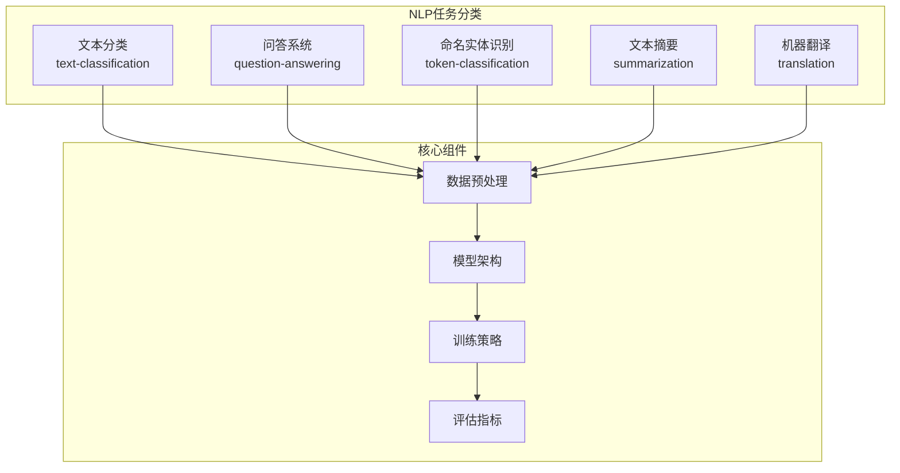
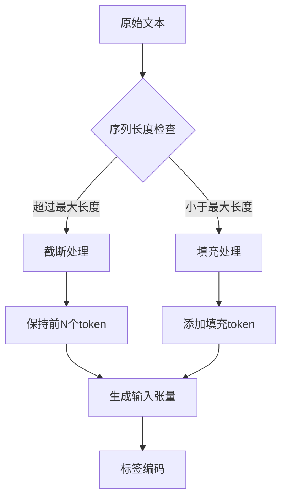
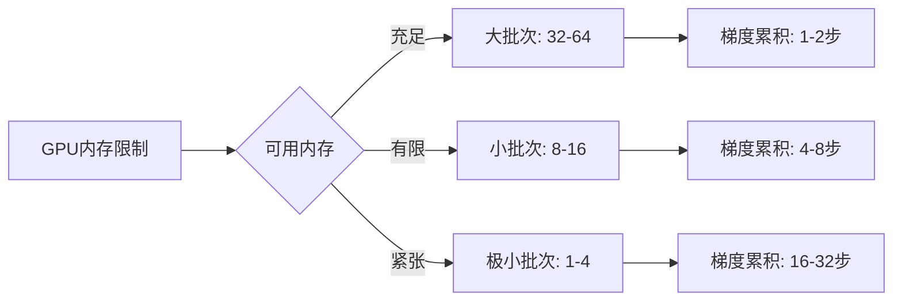
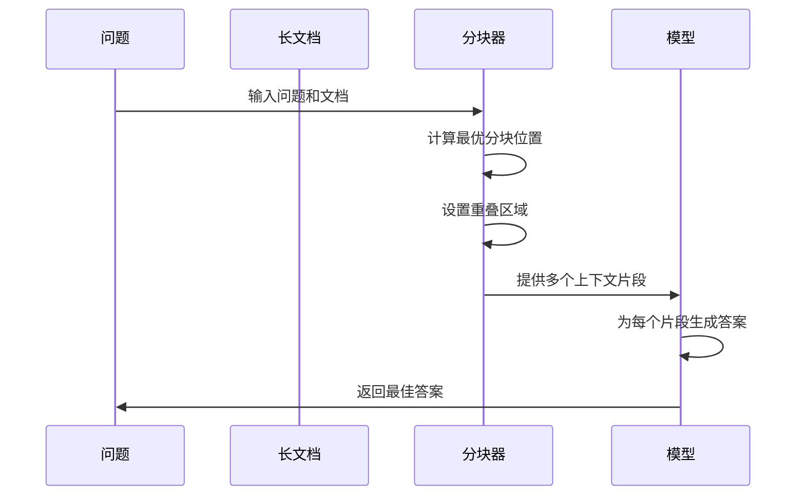
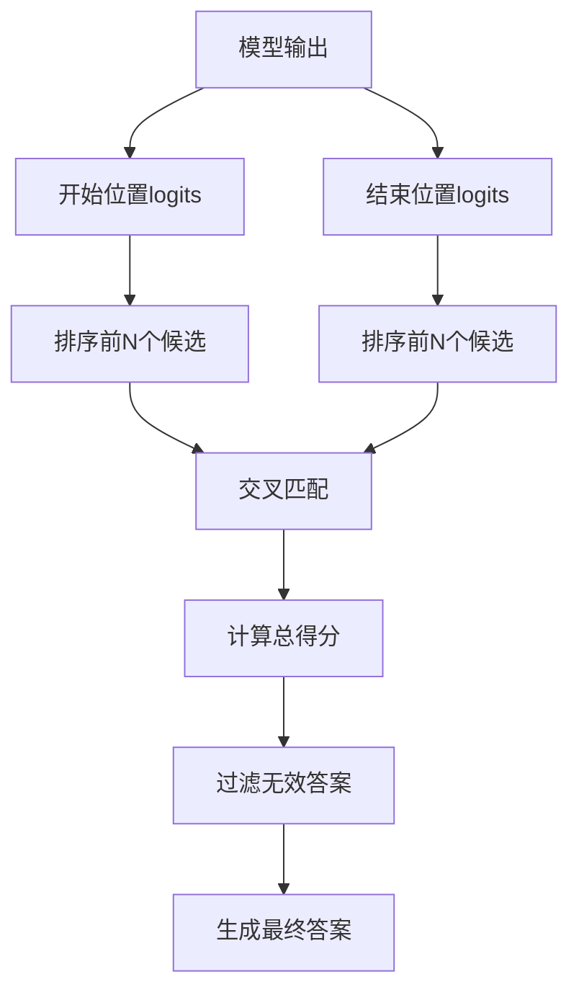
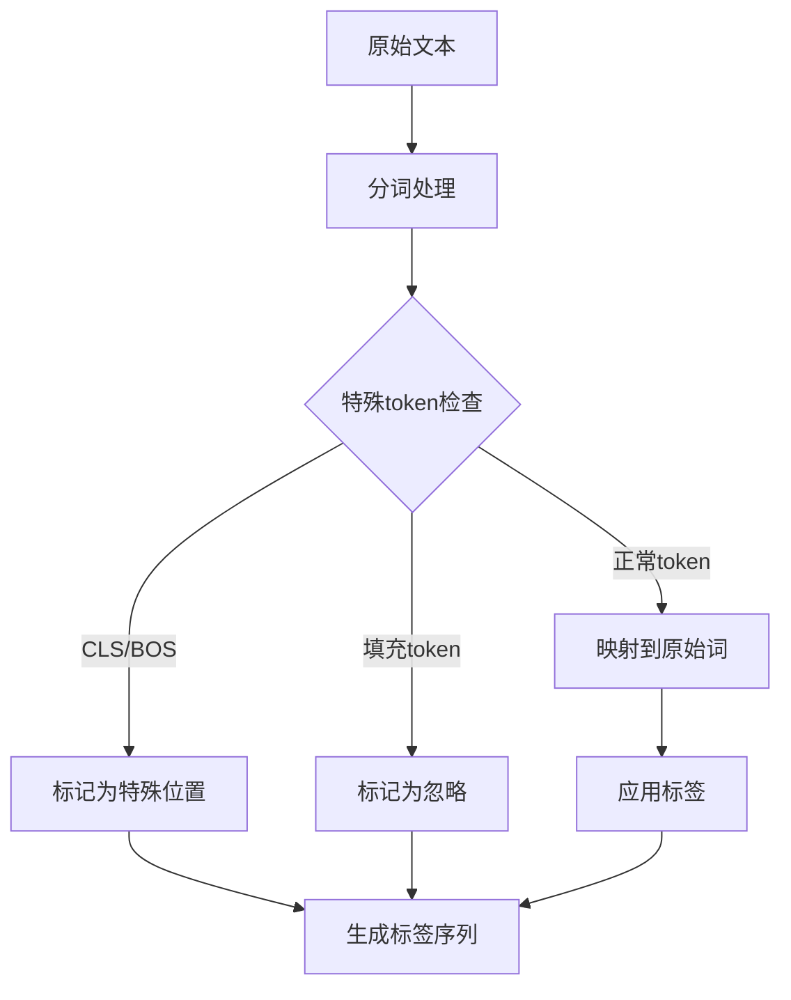
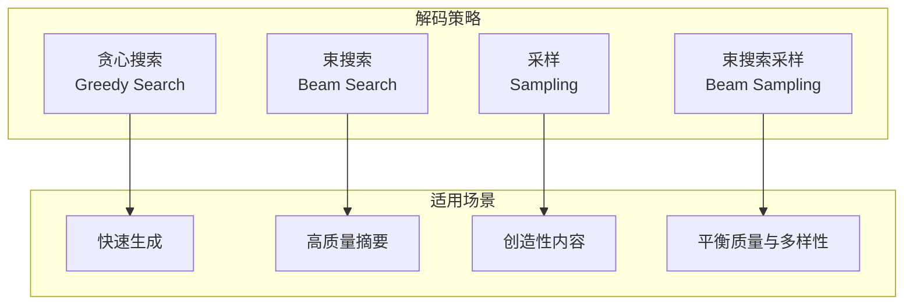
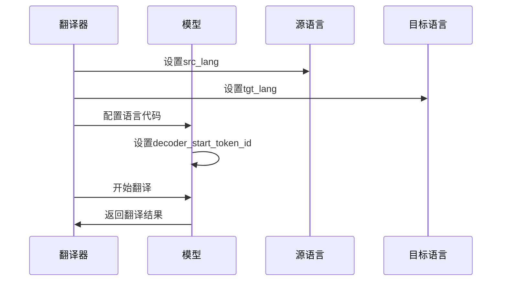
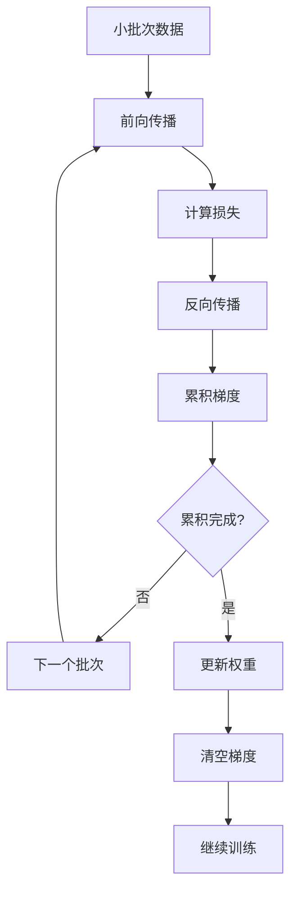
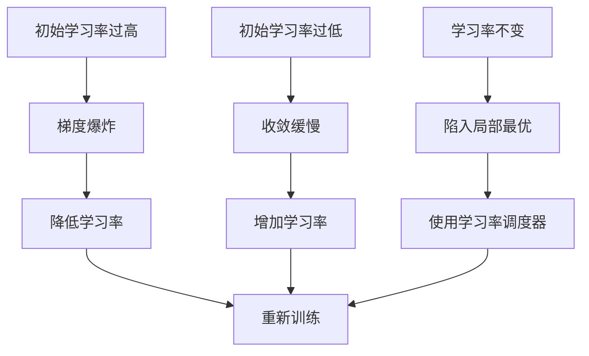

# NLP任务最佳实践

<cite>
**本文档中引用的文件**
- [run_classification.py](file://examples/pytorch/text-classification/run_classification.py)
- [run_qa.py](file://examples/pytorch/question-answering/run_qa.py)
- [run_ner.py](file://examples/pytorch/token-classification/run_ner.py)
- [run_summarization.py](file://examples/pytorch/summarization/run_summarization.py)
- [run_translation.py](file://examples/pytorch/translation/run_translation.py)
- [utils_qa.py](file://examples/pytorch/question-answering/utils_qa.py)
- [trainer_qa.py](file://examples/pytorch/question-answering/trainer_qa.py)
- [README.md](file://examples/pytorch/README.md)
- [continuous_batching.py](file://examples/pytorch/continuous_batching.py)
- [continuous_batching_simple.py](file://examples/pytorch/continuous_batching_simple.py)
</cite>

## 目录
1. [简介](#简介)
2. [项目结构概览](#项目结构概览)
3. [文本分类最佳实践](#文本分类最佳实践)
4. [问答系统最佳实践](#问答系统最佳实践)
5. [命名实体识别最佳实践](#命名实体识别最佳实践)
6. [文本摘要最佳实践](#文本摘要最佳实践)
7. [机器翻译最佳实践](#机器翻译最佳实践)
8. [通用性能优化技巧](#通用性能优化技巧)
9. [常见问题与解决方案](#常见问题与解决方案)
10. [高级优化策略](#高级优化策略)
11. [总结](#总结)

## 简介

本文档基于Hugging Face Transformers库中的PyTorch示例，提供了NLP任务的最佳实践指南。涵盖了文本分类、问答、命名实体识别、文本摘要和机器翻译等核心NLP任务，重点介绍数据预处理、模型选择、超参数配置和训练策略的最佳实践。

每个任务都有其特定的挑战和优化策略，本文档将深入探讨这些方面，并提供从初学者到高级用户的实用指导。

## 项目结构概览

Transformers库的examples/pytorch目录组织了各种NLP任务的实现：



**图表来源**
- [README.md](file://examples/pytorch/README.md#L1-L50)

**章节来源**
- [README.md](file://examples/pytorch/README.md#L1-L380)

## 文本分类最佳实践

### 数据预处理策略

文本分类是NLP中最基础的任务之一，需要精心设计的数据预处理流程：

#### 序列长度管理


**图表来源**
- [run_classification.py](file://examples/pytorch/text-classification/run_classification.py#L600-L650)

#### 多标签分类处理
对于多标签分类任务，需要特殊的标签编码策略：

| 标签类型 | 编码方式 | 计算损失 | 推理时阈值 |
|---------|---------|---------|-----------|
| 单标签分类 | 独热编码 | CrossEntropyLoss | 0.5 |
| 多标签分类 | 多热编码 | BCEWithLogitsLoss | 0.3 |
| 回归任务 | 数值编码 | MSELoss | - |

**章节来源**
- [run_classification.py](file://examples/pytorch/text-classification/run_classification.py#L400-L500)

### 模型选择与配置

#### 预训练模型选择
- **小规模数据集**: 使用BERT-base或RoBERTa-base
- **大规模数据集**: 考虑BERT-large或DeBERTa-v3
- **多语言任务**: mBERT或XLM-RoBERTa

#### 微调策略
```python
# 推荐的学习率设置
learning_rates = {
    'small_datasets': 2e-5,
    'medium_datasets': 1e-5,
    'large_datasets': 5e-6
}

# 权重衰减设置
weight_decay = {
    'low': 0.01,
    'medium': 0.001,
    'high': 0.0001
}
```

### 训练优化

#### 批处理大小调整


**图表来源**
- [run_classification.py](file://examples/pytorch/text-classification/run_classification.py#L200-L250)

## 问答系统最佳实践

### 上下文窗口管理

问答系统的核心挑战是处理长文档的上下文窗口：

#### 文档分块策略


**图表来源**
- [run_qa.py](file://examples/pytorch/question-answering/run_qa.py#L300-L400)

#### 关键参数配置

| 参数名称 | 默认值 | 推荐范围 | 说明 |
|---------|--------|---------|------|
| max_seq_length | 384 | 384-512 | 最大序列长度 |
| doc_stride | 128 | 64-256 | 文档重叠步长 |
| n_best_size | 20 | 10-50 | 最佳预测数量 |
| max_answer_length | 30 | 10-100 | 最大答案长度 |
| null_score_diff_threshold | 0.0 | -1.0-1.0 | 空答案阈值 |

**章节来源**
- [run_qa.py](file://examples/pytorch/question-answering/run_qa.py#L150-L250)

### 后处理优化

#### 答案提取算法


**图表来源**
- [utils_qa.py](file://examples/pytorch/question-answering/utils_qa.py#L50-L150)

**章节来源**
- [utils_qa.py](file://examples/pytorch/question-answering/utils_qa.py#L1-L444)
- [trainer_qa.py](file://examples/pytorch/question-answering/trainer_qa.py#L1-L131)

## 命名实体识别最佳实践

### 标注对齐策略

NER任务的关键在于正确地将标签对齐到token上：

#### 特殊token处理


**图表来源**
- [run_ner.py](file://examples/pytorch/token-classification/run_ner.py#L400-L500)

#### 标签编码方案
常见的NER标签编码方案包括：

| 编码方案 | 示例 | 优点 | 缺点 |
|---------|------|------|------|
| BIO | B-PER, I-PER, O | 易于理解 | 无法表示嵌套实体 |
| BILOU | B-PER, I-PER, L-PER, U-PER, O | 完整描述边界 | 更复杂 |
| Plain | PER, ORG, O | 简单直接 | 无边界信息 |

**章节来源**
- [run_ner.py](file://examples/pytorch/token-classification/run_ner.py#L300-L400)

### 性能监控

#### 实体级别评估
```python
# 实体级别指标计算
def compute_entity_metrics(predictions, labels):
    # 移除特殊token
    predictions = [p for p, l in zip(predictions, labels) if l != -100]
    labels = [l for p, l in zip(predictions, labels) if l != -100]
    
    # 计算实体级别指标
    precision = calculate_precision(predictions, labels)
    recall = calculate_recall(predictions, labels)
    f1 = 2 * (precision * recall) / (precision + recall)
    
    return {'precision': precision, 'recall': recall, 'f1': f1}
```

## 文本摘要最佳实践

### 序列到序列优化

摘要任务需要平衡压缩比和信息保留：

#### 解码策略对比


**图表来源**
- [run_summarization.py](file://examples/pytorch/summarization/run_summarization.py#L600-L700)

#### 生成参数调优

| 参数 | 默认值 | 推荐值 | 影响 |
|------|--------|--------|------|
| max_length | 200 | 50-150 | 输出长度 |
| num_beams | 1 | 4-8 | 多样性 |
| length_penalty | 1.0 | 1.0-2.0 | 长度惩罚 |
| early_stopping | False | True | 早停机制 |
| no_repeat_ngram_size | 0 | 3-4 | 避免重复 |

**章节来源**
- [run_summarization.py](file://examples/pytorch/summarization/run_summarization.py#L500-L600)

### 评估指标优化

#### ROUGE指标使用
```python
# ROUGE指标计算
def compute_rouge_metrics(predictions, references):
    rouge = evaluate.load('rouge')
    
    # 后处理文本
    predictions = postprocess_text(predictions)
    references = postprocess_text(references)
    
    results = rouge.compute(
        predictions=predictions,
        references=references,
        use_stemmer=True
    )
    
    return {k: v * 100 for k, v in results.items()}
```

## 机器翻译最佳实践

### 多语言处理策略

翻译任务需要特别注意多语言tokenizers的使用：

#### 语言代码设置


**图表来源**
- [run_translation.py](file://examples/pytorch/translation/run_translation.py#L400-L500)

#### 分词策略对比

| 分词器类型 | 优势 | 劣势 | 适用场景 |
|-----------|------|------|----------|
| SentencePiece | 多语言支持好 | 词汇表固定 | 低资源语言 |
| BPE | 并行化友好 | 需要训练 | 高资源语言 |
| WordPiece | 与BERT兼容 | 词汇表有限 | BERT系列模型 |

**章节来源**
- [run_translation.py](file://examples/pytorch/translation/run_translation.py#L300-L400)

### BLEU分数优化

#### 评估策略
```python
# BLEU分数计算
def compute_bleu_metrics(predictions, references):
    sacrebleu = evaluate.load('sacrebleu')
    
    # 后处理预测
    predictions = [pred.strip() for pred in predictions]
    references = [[ref.strip()] for ref in references]
    
    result = sacrebleu.compute(
        predictions=predictions,
        references=references
    )
    
    return {'bleu': result['score']}
```

## 通用性能优化技巧

### 内存管理优化

#### 梯度累积策略


**图表来源**
- [continuous_batching.py](file://examples/pytorch/continuous_batching.py#L100-L200)

#### 混合精度训练
```python
# FP16混合精度配置
training_args = TrainingArguments(
    fp16=True,  # 或 bf16=True (如果支持)
    gradient_accumulation_steps=4,
    dataloader_pin_memory=True,
    remove_unused_columns=False
)
```

### 批处理优化

#### 连续批处理技术


**图表来源**
- [continuous_batching.py](file://examples/pytorch/continuous_batching.py#L150-L250)

**章节来源**
- [continuous_batching.py](file://examples/pytorch/continuous_batching.py#L1-L302)
- [continuous_batching_simple.py](file://examples/pytorch/continuous_batching_simple.py#L1-L110)

## 常见问题与解决方案

### 训练收敛问题

#### 学习率调整策略


#### 常见错误及解决

| 错误类型 | 症状 | 原因 | 解决方案 |
|---------|------|------|---------|
| 内存不足 | CUDA out of memory | 批次过大 | 减小批次大小，启用梯度累积 |
| 收敛缓慢 | 损失下降缓慢 | 学习率过低 | 增加学习率或使用Warmup |
| 过拟合 | 验证集性能差 | 模型复杂度过高 | 正则化，减少模型参数 |
| 欠拟合 | 训练集性能差 | 模型容量不足 | 增加模型参数，延长训练时间 |

### 性能瓶颈诊断

#### GPU利用率分析
```python
# 性能监控工具
import torch.profiler as profiler

with profiler.profile(
    activities=[profiler.ProfilerActivity.CPU, profiler.ProfilerActivity.CUDA],
    record_shapes=True,
    profile_memory=True
) as prof:
    # 训练代码
    trainer.train()

print(prof.key_averages().table(sort_by="cuda_time_total"))
```

## 高级优化策略

### 分布式训练

#### 多GPU训练配置
```python
# 分布式训练启动
torchrun --nproc_per_node=8 \
    text-classification/run_glue.py \
    --model_name_or_path bert-base-uncased \
    --task_name mrpc \
    --do_train \
    --do_eval \
    --max_seq_length 128 \
    --per_device_train_batch_size 32 \
    --learning_rate 2e-5 \
    --num_train_epochs 3.0
```

#### 混合精度训练
```python
# DeepSpeed集成
training_args = TrainingArguments(
    fp16=True,
    deepspeed="ds_config_zero2.json",
    gradient_accumulation_steps=4,
    dataloader_pin_memory=True
)
```

### 自动化超参数优化

#### 贝叶斯优化示例
```python
from ray import tune
from ray.tune.search.bayesopt import BayesOptSearch

def train_with_ray_tune(config):
    # 超参数配置
    training_args = TrainingArguments(
        learning_rate=config["lr"],
        per_device_train_batch_size=config["batch_size"],
        gradient_accumulation_steps=config["grad_accum"]
    )
    
    # 训练过程
    trainer = Trainer(...)
    result = trainer.train()
    return result.metrics["eval_accuracy"]
```

### 模型压缩与加速

#### 动态批处理优化
```python
# 连续批处理配置
generation_config = GenerationConfig(
    max_new_tokens=512,
    num_blocks=369,           # KV缓存块数
    max_batch_tokens=23,      # 最大批处理token数
    use_cuda_graph=True,      # CUDA图优化
    pad_token_id=tokenizer.pad_token_id
)
```

**章节来源**
- [README.md](file://examples/pytorch/README.md#L200-L300)

## 总结

本文档涵盖了NLP任务的最佳实践，从基础的数据预处理到高级的性能优化策略。关键要点包括：

### 核心原则
1. **任务导向的预处理**: 不同任务需要不同的数据处理策略
2. **渐进式优化**: 从简单配置开始，逐步优化参数
3. **监控驱动**: 通过指标监控训练过程，及时调整策略
4. **资源意识**: 根据硬件条件选择合适的配置

### 实践建议
- **初学者**: 从提供的示例脚本开始，逐步调整参数
- **中级用户**: 关注性能监控，实施梯度累积和混合精度
- **高级用户**: 探索分布式训练、模型压缩和自动化优化

### 持续改进
NLP技术发展迅速，最佳实践也需要不断更新。建议：
- 关注最新的研究进展
- 参与社区讨论
- 实验新的技术和方法

通过遵循这些最佳实践，可以显著提高NLP任务的性能和效率，同时确保训练过程的稳定性和可重现性。