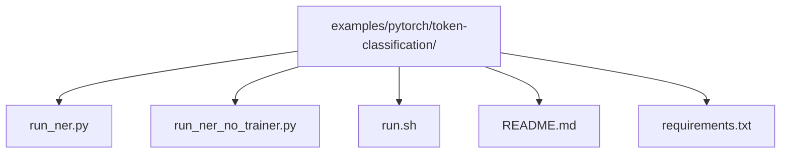
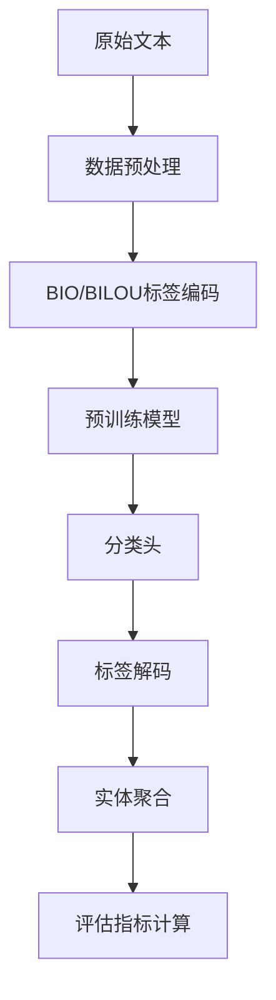
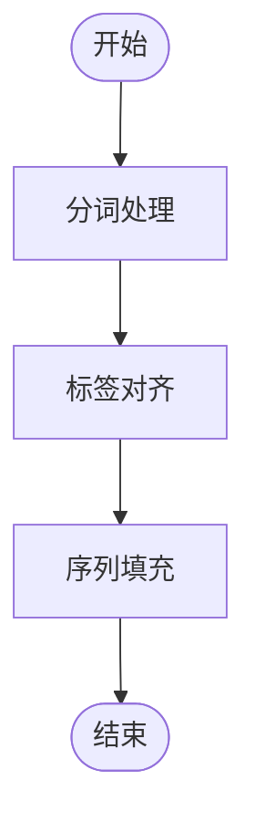
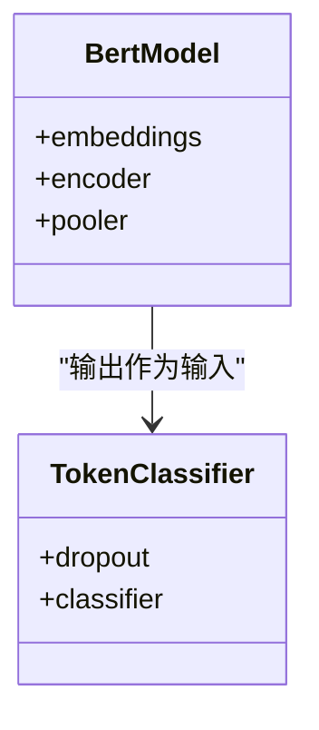
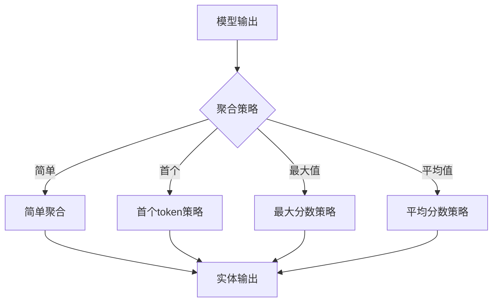
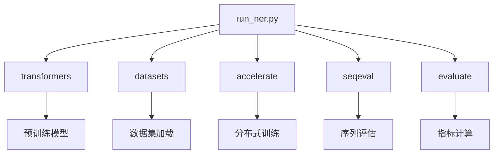

# 命名实体识别最佳实践

<cite>
**本文档中引用的文件**  
- [run_ner.py](file://examples/pytorch/token-classification/run_ner.py)
- [run_ner_no_trainer.py](file://examples/pytorch/token-classification/run_ner_no_trainer.py)
- [token_classification.py](file://src/transformers/pipelines/token_classification.py)
- [run_ner.sh](file://examples/pytorch/token-classification/run.sh)
- [README.md](file://examples/pytorch/token-classification/README.md)
</cite>

## 目录
1. [简介](#简介)
2. [项目结构](#项目结构)
3. [核心组件](#核心组件)
4. [架构概述](#架构概述)
5. [详细组件分析](#详细组件分析)
6. [依赖分析](#依赖分析)
7. [性能考虑](#性能考虑)
8. [故障排除指南](#故障排除指南)
9. [结论](#结论)

## 简介
命名实体识别（NER）是自然语言处理中的关键任务，旨在识别文本中的特定实体，如人名、组织、地点等。本文档基于Hugging Face Transformers库中的`run_ner.py`示例，提供NER任务的最佳实践指导。我们将深入探讨数据预处理流程、模型选择策略、标签解码优化以及针对不同领域的微调技巧。

## 项目结构
Transformers库中的NER示例位于`examples/pytorch/token-classification/`目录下，包含完整的训练、评估和预测流程。该结构支持使用Trainer API或自定义训练循环进行模型微调。

**图表来源**
- [README.md](file://examples/pytorch/token-classification/README.md)

**章节来源**
- [README.md](file://examples/pytorch/token-classification/README.md)

## 核心组件
`run_ner.py`脚本是NER任务的核心实现，利用Hugging Face的Trainer API和Datasets库进行高效训练。该脚本支持从Hugging Face Hub加载数据集或使用自定义文本文件进行训练和验证。

**章节来源**
- [run_ner.py](file://examples/pytorch/token-classification/run_ner.py)

## 架构概述
NER任务的架构主要包括数据加载、预处理、模型训练和评估四个主要阶段。系统利用预训练语言模型（如BERT）作为基础，并在其上添加分类头进行微调。

**图表来源**
- [run_ner.py](file://examples/pytorch/token-classification/run_ner.py)
- [token_classification.py](file://src/transformers/pipelines/token_classification.py)

## 详细组件分析

### 数据预处理分析
NER任务的数据预处理包括文本分词、标签对齐和序列填充等关键步骤。`tokenize_and_align_labels`函数负责将原始文本转换为模型可接受的格式。

**图表来源**
- [run_ner.py](file://examples/pytorch/token-classification/run_ner.py#L400-L450)

**章节来源**
- [run_ner.py](file://examples/pytorch/token-classification/run_ner.py#L400-L450)

### 模型架构分析
NER模型通常采用预训练语言模型（如BERT）作为编码器，在其输出上添加线性分类层进行序列标注。这种架构能够有效利用预训练模型的上下文表示能力。

**图表来源**
- [run_ner.py](file://examples/pytorch/token-classification/run_ner.py#L300-L350)

**章节来源**
- [run_ner.py](file://examples/pytorch/token-classification/run_ner.py#L300-L350)

### 标签解码分析
标签解码过程涉及将模型输出的token级别预测转换为完整的实体。`TokenClassificationPipeline`提供了多种聚合策略来处理子词分割问题。

**图表来源**
- [token_classification.py](file://src/transformers/pipelines/token_classification.py#L600-L650)

**章节来源**
- [token_classification.py](file://src/transformers/pipelines/token_classification.py#L600-L650)

## 依赖分析
NER示例依赖于多个关键库，包括Transformers、Datasets、Accelerate和Seqeval等。这些依赖项共同支持数据处理、模型训练和性能评估。

**图表来源**
- [run_ner.py](file://examples/pytorch/token-classification/run_ner.py#L1-L50)
- [pyproject.toml](file://pyproject.toml)

**章节来源**
- [run_ner.py](file://examples/pytorch/token-classification/run_ner.py#L1-L50)

## 性能考虑
在实际应用中，需要考虑多个性能因素，包括序列长度限制、批处理大小和硬件加速等。使用动态填充和梯度累积可以有效提高训练效率。

## 故障排除指南
常见问题包括标签对齐错误、模型维度不匹配和评估指标异常等。确保使用快速分词器并正确配置标签映射可以避免大多数问题。

**章节来源**
- [run_ner.py](file://examples/pytorch/token-classification/run_ner.py#L500-L600)
- [token_classification.py](file://src/transformers/pipelines/token_classification.py#L100-L150)

## 结论
通过分析`run_ner.py`示例，我们总结了NER任务的最佳实践，包括数据预处理、模型选择、训练配置和评估方法。这些实践可以应用于各种领域的命名实体识别任务，为构建高效的NER系统提供指导。