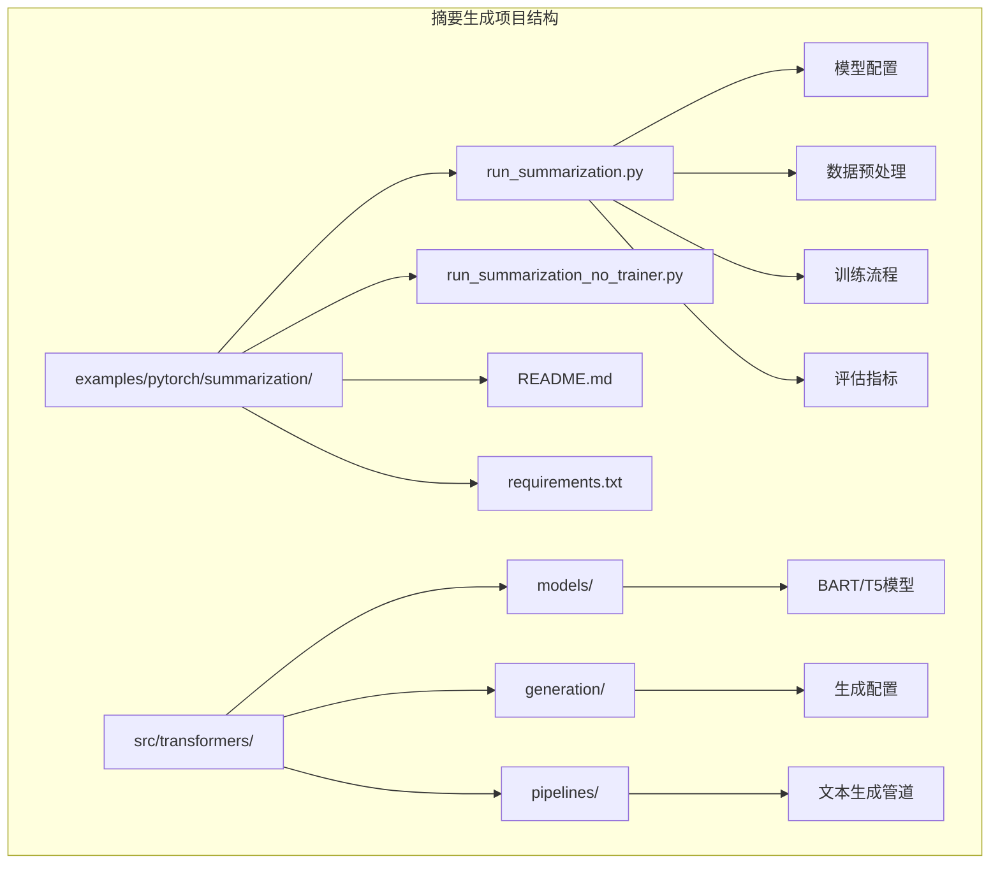
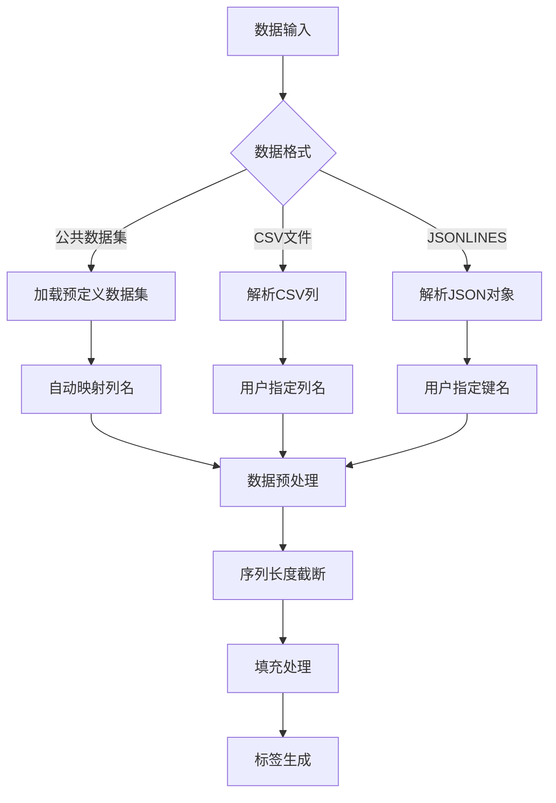
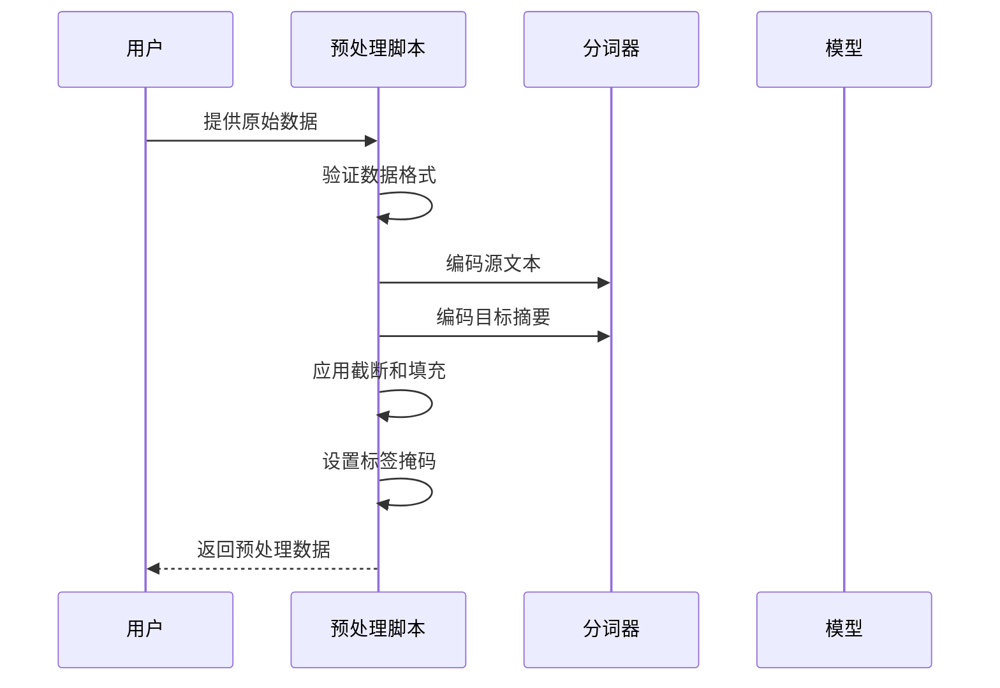
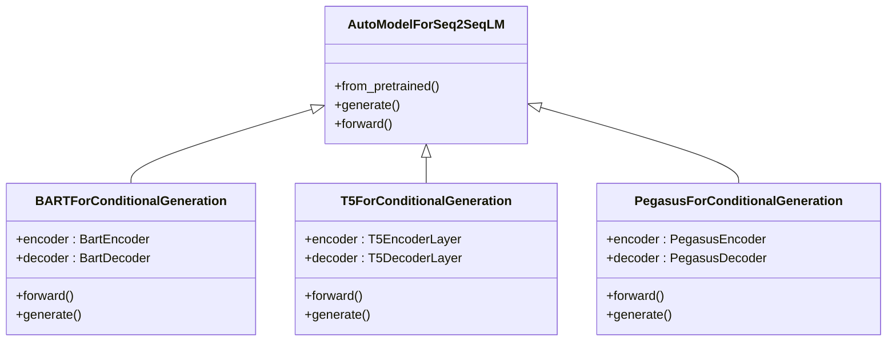
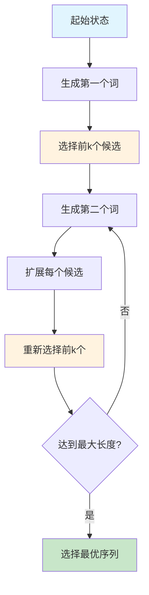
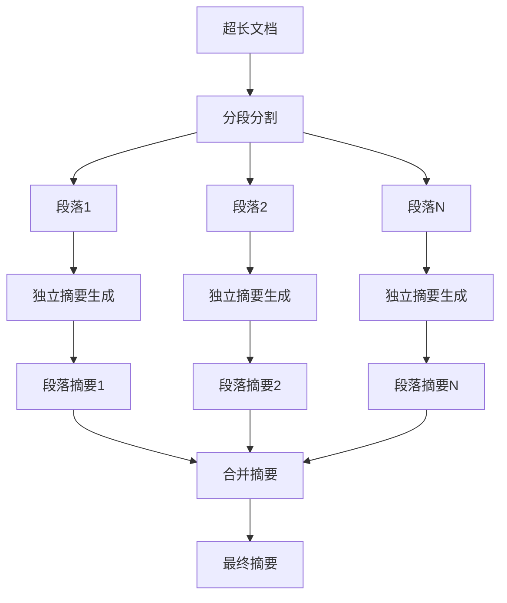
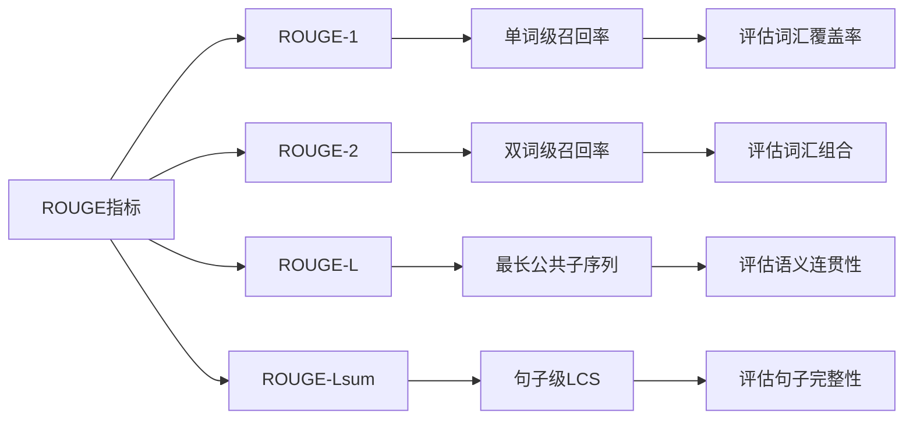
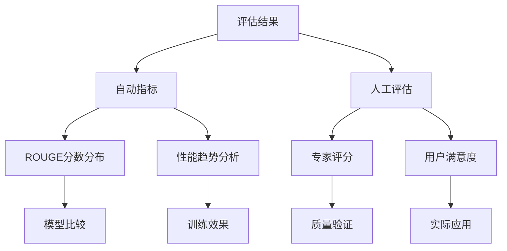
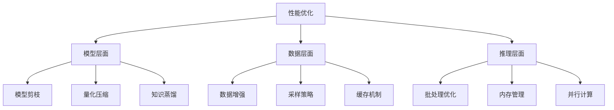

# 摘要生成最佳实践

<cite>
**本文档中引用的文件**
- [run_summarization.py](file://examples/pytorch/summarization/run_summarization.py)
- [run_summarization_no_trainer.py](file://examples/pytorch/summarization/run_summarization_no_trainer.py)
- [trainer_seq2seq.py](file://src/transformers/trainer_seq2seq.py)
- [text2text_generation.py](file://src/transformers/pipelines/text2text_generation.py)
- [logits_process.py](file://src/transformers/generation/logits_process.py)
- [configuration_utils.py](file://src/transformers/generation/configuration_utils.py)
- [README.md](file://examples/pytorch/summarization/README.md)
</cite>

## 目录
1. [简介](#简介)
2. [项目结构概览](#项目结构概览)
3. [抽取式与生成式摘要对比](#抽取式与生成式摘要对比)
4. [数据集准备与预处理](#数据集准备与预处理)
5. [编码器-解码器架构配置](#编码器-解码器架构配置)
6. [生成参数优化](#生成参数优化)
7. [长文档处理技巧](#长文档处理技巧)
8. [摘要质量评估](#摘要质量评估)
9. [常见问题解决方案](#常见问题解决方案)
10. [最佳实践总结](#最佳实践总结)

## 简介

摘要生成是自然语言处理领域的重要任务，旨在从长文本中提取关键信息并生成简洁的摘要。本文档基于Hugging Face Transformers库中的`run_summarization.py`示例，深入探讨摘要生成的最佳实践，涵盖从数据准备到模型部署的完整流程。

摘要生成技术主要分为两种类型：
- **抽取式摘要**：直接从原文中抽取重要句子或短语
- **生成式摘要**：通过理解原文内容生成新的、更简洁的表达

## 项目结构概览



**图表来源**
- [run_summarization.py](file://examples/pytorch/summarization/run_summarization.py#L1-L50)
- [trainer_seq2seq.py](file://src/transformers/trainer_seq2seq.py#L1-L50)

**章节来源**
- [run_summarization.py](file://examples/pytorch/summarization/run_summarization.py#L1-L100)
- [README.md](file://examples/pytorch/summarization/README.md#L1-L50)

## 抽取式与生成式摘要对比

### 抽取式摘要特点

抽取式摘要直接从原文中选择重要的句子或短语，具有以下特征：

- **保持原文准确性**：避免生成错误信息
- **可解释性强**：可以追溯到原文的具体位置
- **计算效率高**：不需要复杂的语言生成模型
- **局限性**：可能缺乏连贯性和流畅性

### 生成式摘要特点

生成式摘要通过理解原文内容生成新的表达，具有以下优势：

- **创造性表达**：能够生成更简洁、更流畅的摘要
- **上下文连贯**：更好地保持逻辑关系
- **适应性强**：可以处理不同风格的原文
- **挑战性**：需要强大的语言理解和生成能力

### 适用场景选择

| 场景 | 推荐方法 | 原因 |
|------|----------|------|
| 新闻摘要 | 生成式 | 需要简洁、吸引人的表达 |
| 科技论文 | 抽取式 | 需要准确的技术术语 |
| 法律文档 | 抽取式 | 需要精确的法律表述 |
| 社交媒体 | 生成式 | 需要创意和吸引力 |

## 数据集准备与预处理

### 支持的数据集格式

系统支持多种数据集格式，包括公共数据集和自定义格式：



**图表来源**
- [run_summarization.py](file://examples/pytorch/summarization/run_summarization.py#L473-L501)

### 公共数据集支持

系统内置支持多个常用摘要数据集：

| 数据集名称 | 输入列名 | 摘要列名 | 特点 |
|------------|----------|----------|------|
| cnn_dailymail | article, highlights | 文章, 高亮 | 新闻摘要标准数据集 |
| xsum | document, summary | 文档, 摘要 | 极简新闻摘要 |
| samsum | dialogue, summary | 对话, 总结 | 会话摘要 |
| multi_news | document, summary | 文档, 摘要 | 多文档摘要 |

### 自定义数据集准备

#### CSV格式数据集
```csv
text,summary
"文章内容...","摘要内容..."
"另一篇文章...","另一个摘要..."
```

#### JSONLINES格式数据集
```json
{"text": "文章内容...", "summary": "摘要内容..."}
{"text": "另一篇文章...", "summary": "另一个摘要..."}
```

### 数据预处理流程



**图表来源**
- [run_summarization.py](file://examples/pytorch/summarization/run_summarization.py#L503-L530)

**章节来源**
- [run_summarization.py](file://examples/pytorch/summarization/run_summarization.py#L473-L530)
- [README.md](file://examples/pytorch/summarization/README.md#L50-L150)

## 编码器-解码器架构配置

### 支持的模型架构

系统支持多种先进的编码器-解码器架构：



**图表来源**
- [run_summarization.py](file://examples/pytorch/summarization/run_summarization.py#L1992-L1993)

### BART架构详解

BART采用双向编码器和单向解码器的设计：

- **编码器**：使用Transformer的双向注意力机制
- **解码器**：使用Transformer的因果注意力机制
- **预训练任务**：去噪文本建模和句子排序

### T5架构特点

T5采用完全基于Transformer的编码器-解码器架构：

- **统一框架**：所有任务都作为文本到文本的转换
- **前缀设计**：通过前缀指示任务类型
- **多任务学习**：在大量数据上进行预训练

### 模型配置参数

| 参数类别 | 关键参数 | 默认值 | 说明 |
|----------|----------|--------|------|
| 输入长度 | max_source_length | 1024 | 源文本最大长度 |
| 输出长度 | max_target_length | 128 | 目标摘要最大长度 |
| 批处理大小 | per_device_train_batch_size | 8 | 训练时每设备批次大小 |
| 学习率 | learning_rate | 5e-5 | 优化器学习率 |
| 权重衰减 | weight_decay | 0.01 | 正则化权重 |

**章节来源**
- [run_summarization.py](file://examples/pytorch/summarization/run_summarization.py#L100-L200)
- [README.md](file://examples/pytorch/summarization/README.md#L20-L40)

## 生成参数优化

### Beam搜索策略

Beam搜索是一种常用的解码策略，通过维护多个候选序列来提高生成质量：



**图表来源**
- [configuration_utils.py](file://src/transformers/generation/configuration_utils.py#L475-L501)

### 重复n-gram惩罚

为防止生成重复内容，系统实现了n-gram重复惩罚机制：

- **算法原理**：检测连续n个词的重复出现
- **惩罚策略**：对重复n-gram对应的词汇概率施加负惩罚
- **参数设置**：通常设置为no_repeat_ngram_size=3

### 长度惩罚

长度惩罚用于平衡生成序列的长度和质量：

- **公式**：`score = (unnormalized_score) / (length^length_penalty)`
- **典型值**：length_penalty=1.0（无惩罚）到2.0（强惩罚）
- **应用场景**：避免过短或过长的摘要

### 生成参数配置表

| 参数名称 | 类型 | 推荐值 | 作用 |
|----------|------|--------|------|
| num_beams | int | 4-8 | Beam搜索宽度 |
| max_length | int | 150 | 最大输出长度 |
| max_new_tokens | int | 50-100 | 新增最大token数 |
| length_penalty | float | 1.0-2.0 | 长度惩罚系数 |
| no_repeat_ngram_size | int | 3 | 重复n-gram大小 |
| early_stopping | bool | True | 早期停止 |

**章节来源**
- [logits_process.py](file://src/transformers/generation/logits_process.py#L988-L1071)
- [configuration_utils.py](file://src/transformers/generation/configuration_utils.py#L475-L501)

## 长文档处理技巧

### 分段处理策略

对于超长文档，需要采用分段处理策略：



### 关键信息保留技巧

1. **句子重要性评分**：使用TF-IDF或BERT等模型评估句子重要性
2. **位置信息利用**：考虑句子在文档中的位置
3. **主题一致性检查**：确保摘要的主题一致性
4. **冗余去除**：识别并去除重复信息

### 处理长文档的配置建议

| 文档长度 | 分段大小 | 段落重叠 | 生成长度 |
|----------|----------|----------|----------|
| 1K-5K tokens | 512 | 64 | 100-150 |
| 5K-10K tokens | 768 | 128 | 150-200 |
| 10K-20K tokens | 1024 | 256 | 200-300 |

**章节来源**
- [run_summarization.py](file://examples/pytorch/summarization/run_summarization.py#L503-L530)

## 摘要质量评估

### ROUGE指标体系

ROUGE（Recall-Oriented Understudy for Gisting Evaluation）是最常用的摘要评估指标：



**图表来源**
- [run_summarization.py](file://examples/pytorch/summarization/run_summarization.py#L650-L680)

### ROUGE指标详解

| 指标名称 | 计算方式 | 适用场景 | 权重 |
|----------|----------|----------|------|
| ROUGE-1 | 单词级重叠率 | 词汇覆盖率 | 1.0 |
| ROUGE-2 | 双词级重叠率 | 词汇组合质量 | 0.8 |
| ROUGE-L | LCS重叠率 | 语义连贯性 | 1.2 |
| ROUGE-Lsum | 句子级LCS | 句子完整性 | 1.1 |

### 人工评估指南

除了自动指标，人工评估也是重要的评估手段：

1. **准确性评估**（0-5分）
   - 信息是否准确无误
   - 是否存在事实错误

2. **完整性评估**（0-5分）
   - 是否涵盖了原文的主要信息
   - 关键概念是否得到体现

3. **流畅性评估**（0-5分）
   - 语言是否通顺自然
   - 语法是否正确

4. **相关性评估**（0-5分）
   - 摘要是否与原文主题相关
   - 是否偏离原文重点

### 评估结果解读



**章节来源**
- [run_summarization.py](file://examples/pytorch/summarization/run_summarization.py#L650-L700)

## 常见问题解决方案

### 内容重复问题

**问题表现**：生成的摘要中出现重复的句子或短语

**解决方案**：
1. **启用n-gram重复惩罚**：设置`no_repeat_ngram_size=3`
2. **调整beam搜索参数**：增加`num_beams`数量
3. **后处理去重**：使用专门的去重算法

### 事实不一致问题

**问题表现**：摘要中的信息与原文事实不符

**解决方案**：
1. **使用抽取式方法**：直接从原文抽取句子
2. **添加事实验证模块**：集成知识图谱验证
3. **限制生成范围**：控制解码过程的自由度

### 关键信息遗漏问题

**问题表现**：摘要缺少原文的重要信息

**解决方案**：
1. **改进注意力机制**：增强模型对关键信息的关注
2. **使用引导解码**：通过关键词引导生成
3. **多轮迭代生成**：逐步完善摘要内容

### 性能优化策略



### 问题诊断流程

1. **问题识别**：通过评估指标发现具体问题
2. **根因分析**：分析问题产生的根本原因
3. **方案制定**：根据问题类型选择合适的解决方案
4. **效果验证**：通过实验验证解决方案的有效性

**章节来源**
- [logits_process.py](file://src/transformers/generation/logits_process.py#L1593-L1609)
- [run_summarization.py](file://examples/pytorch/summarization/run_summarization.py#L650-L700)

## 最佳实践总结

### 训练阶段最佳实践

1. **数据质量优先**
   - 确保训练数据的准确性和多样性
   - 进行充分的数据清洗和预处理
   - 使用适当的采样策略

2. **模型选择适配**
   - 根据任务特点选择合适的模型架构
   - 考虑计算资源和部署需求
   - 平衡模型性能和效率

3. **超参数调优**
   - 系统性地调整学习率、批次大小等参数
   - 使用交叉验证评估模型性能
   - 注意过拟合和欠拟合问题

### 推理阶段最佳实践

1. **生成参数优化**
   - 根据具体应用场景调整生成参数
   - 平衡生成质量和速度
   - 实现动态参数调整

2. **后处理优化**
   - 实施必要的文本清理和规范化
   - 添加事实验证和质量检查
   - 提供多种摘要长度选项

3. **监控和维护**
   - 建立性能监控体系
   - 定期更新模型和数据
   - 收集用户反馈持续改进

### 部署阶段最佳实践

1. **系统架构设计**
   - 采用微服务架构提高可扩展性
   - 实现负载均衡和故障恢复
   - 优化网络通信和存储访问

2. **安全和隐私保护**
   - 实施数据加密和访问控制
   - 遵守相关法律法规要求
   - 提供透明的使用说明

3. **用户体验优化**
   - 设计直观易用的界面
   - 提供实时反馈和进度显示
   - 支持多种输出格式和语言

通过遵循这些最佳实践，可以构建高质量、高性能的摘要生成系统，满足各种应用场景的需求。摘要生成技术仍在不断发展，建议持续关注最新的研究成果和技术进展，不断优化和改进系统性能。