# 文本分类最佳实践

<cite>
**本文档中引用的文件**
- [run_glue.py](file://examples/pytorch/text-classification/run_glue.py)
- [run_classification.py](file://examples/pytorch/text-classification/run_classification.py)
- [run_glue_no_trainer.py](file://examples/pytorch/text-classification/run_glue_no_trainer.py)
- [run_xnli.py](file://examples/pytorch/text-classification/run_xnli.py)
- [README.md](file://examples/pytorch/text-classification/README.md)
- [data_collator.py](file://src/transformers/data/data_collator.py)
- [trainer.py](file://src/transformers/trainer.py)
- [optimization.py](file://src/transformers/optimization.py)
- [modeling_roberta.py](file://src/transformers/models/roberta/modeling_roberta.py)
</cite>

## 目录
1. [简介](#简介)
2. [项目结构概览](#项目结构概览)
3. [核心组件分析](#核心组件分析)
4. [GLUE基准测试实现](#glue基准测试实现)
5. [数据预处理流程](#数据预处理流程)
6. [模型选择与配置](#模型选择与配置)
7. [超参数优化策略](#超参数优化策略)
8. [性能优化技巧](#性能优化技巧)
9. [常见问题解决方案](#常见问题解决方案)
10. [进阶优化建议](#进阶优化建议)
11. [总结](#总结)

## 简介

本文档基于Hugging Face Transformers库中的`run_glue.py`示例，详细介绍文本分类任务的最佳实践方法。我们将深入探讨GLUE基准测试任务的数据预处理流程、模型选择策略、超参数配置以及各种优化技巧。

文本分类是自然语言处理中最基础且重要的任务之一，在情感分析、垃圾邮件检测、主题分类等领域有着广泛应用。通过系统性的最佳实践指导，可以帮助开发者快速构建高性能的文本分类模型。

## 项目结构概览

Transformers库中的文本分类示例提供了多种实现方式，每种都有其特定的应用场景：

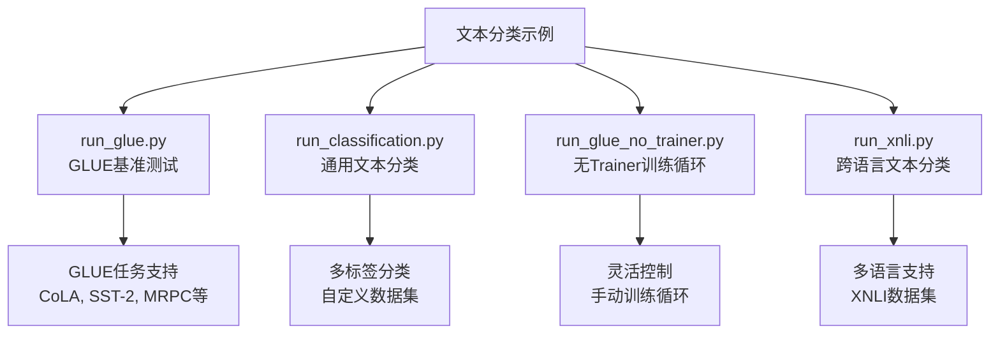

**图表来源**
- [run_glue.py](file://examples/pytorch/text-classification/run_glue.py#L1-L50)
- [run_classification.py](file://examples/pytorch/text-classification/run_classification.py#L1-L50)
- [run_glue_no_trainer.py](file://examples/pytorch/text-classification/run_glue_no_trainer.py#L1-L50)
- [run_xnli.py](file://examples/pytorch/text-classification/run_xnli.py#L1-L50)

**章节来源**
- [README.md](file://examples/pytorch/text-classification/README.md#L1-L50)

## 核心组件分析

### 数据训练参数类

数据训练参数类定义了文本分类任务所需的各种配置选项：

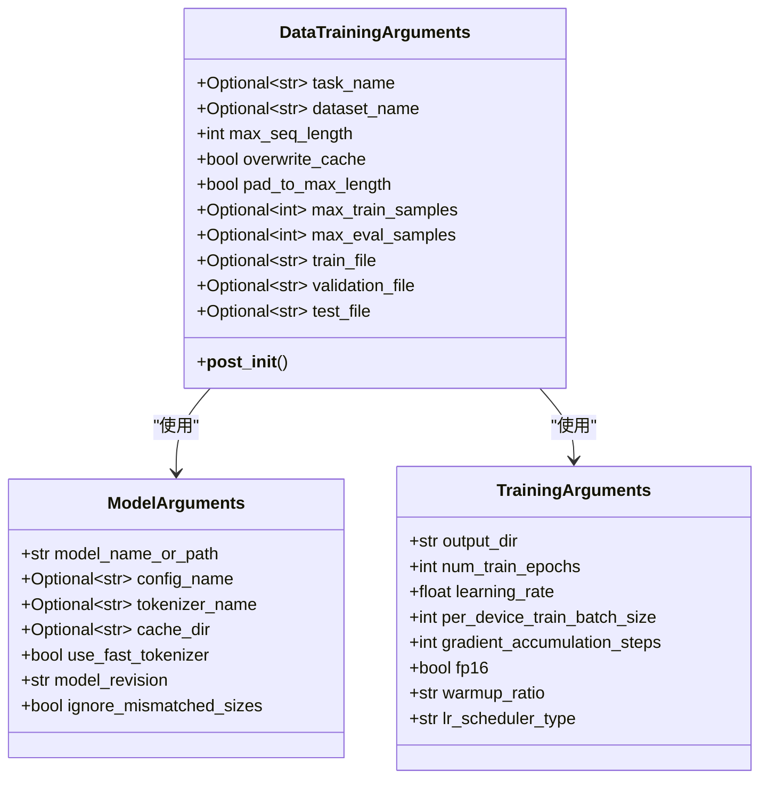

**图表来源**
- [run_glue.py](file://examples/pytorch/text-classification/run_glue.py#L75-L200)

### 模型架构支持

支持多种主流预训练模型架构：

| 模型类型 | 特点 | 适用场景 | 性能特点 |
|---------|------|----------|----------|
| BERT | 双向编码器 | 通用文本分类 | 平衡性能与效率 |
| RoBERTa | 改进版BERT | 高质量任务 | 更强的表示能力 |
| DistilBERT | 轻量化BERT | 实时应用 | 速度优先 |
| ALBERT | 参数共享 | 大规模数据 | 内存效率高 |
| DeBERTa | 注意力增强 | 复杂任务 | 上下文理解强 |

**章节来源**
- [run_glue.py](file://examples/pytorch/text-classification/run_glue.py#L300-L400)

## GLUE基准测试实现

### GLUE任务类型

GLUE（General Language Understanding Evaluation）基准测试包含9个不同的自然语言理解任务：

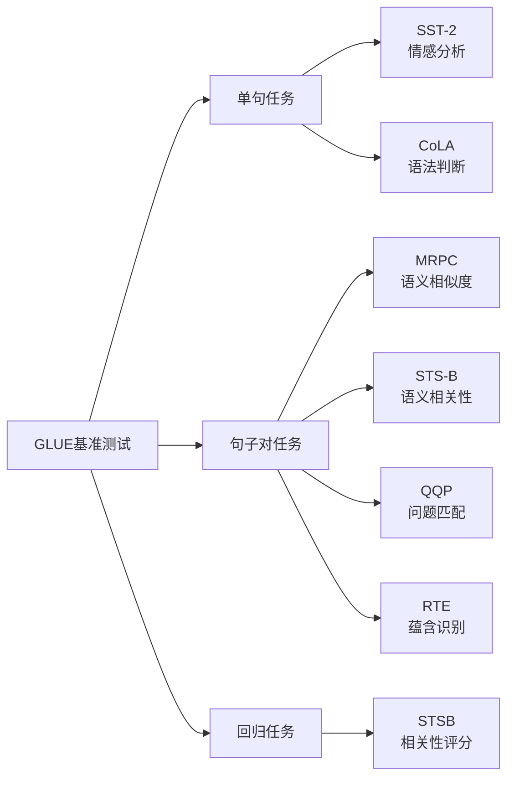

**图表来源**
- [run_glue.py](file://examples/pytorch/text-classification/run_glue.py#L50-L70)

### 训练流程详解

GLUE示例的完整训练流程包括以下关键步骤：

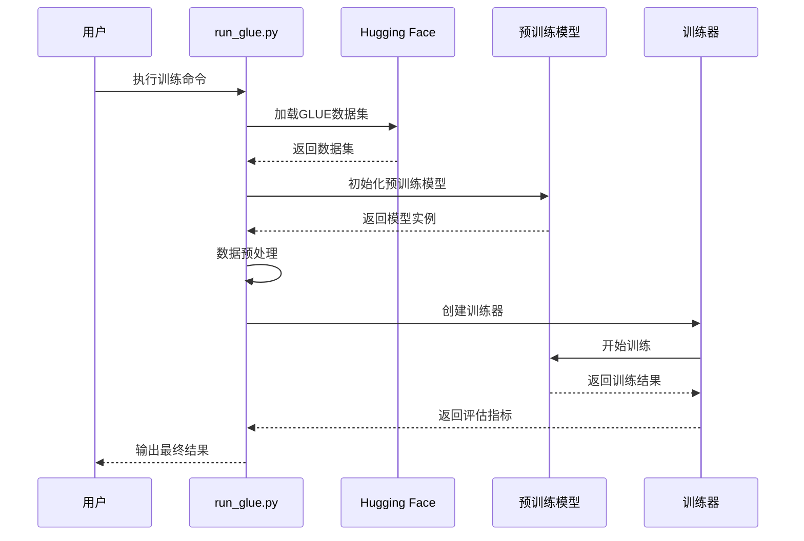

**图表来源**
- [run_glue.py](file://examples/pytorch/text-classification/run_glue.py#L200-L300)

**章节来源**
- [run_glue.py](file://examples/pytorch/text-classification/run_glue.py#L1-L646)

## 数据预处理流程

### 序列长度处理策略

数据预处理是文本分类任务的关键环节，涉及序列长度管理、填充策略和截断处理：

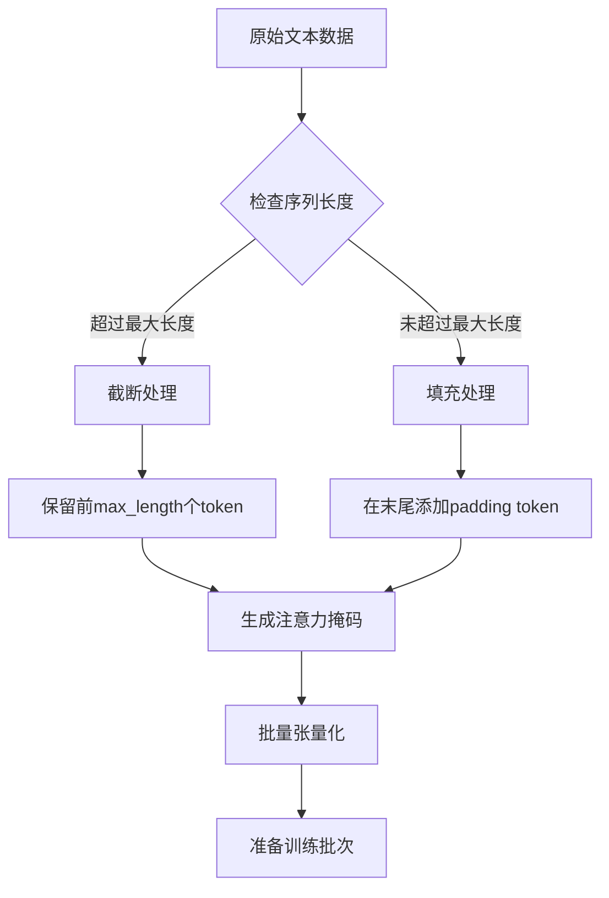

**图表来源**
- [run_glue.py](file://examples/pytorch/text-classification/run_glue.py#L439-L464)

### 数据收集器优化

数据收集器负责动态填充和批次处理：

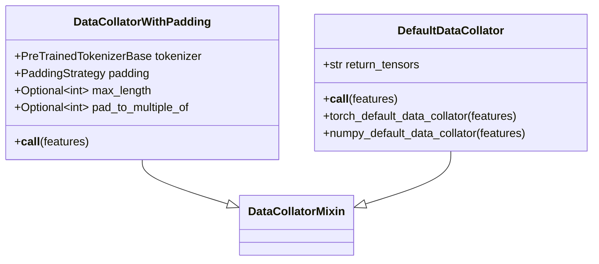

**图表来源**
- [data_collator.py](file://src/transformers/data/data_collator.py#L150-L200)

**章节来源**
- [data_collator.py](file://src/transformers/data/data_collator.py#L1-L200)

## 模型选择与配置

### 注意力机制优化

现代Transformer模型的核心是注意力机制，不同模型采用了不同的优化策略：

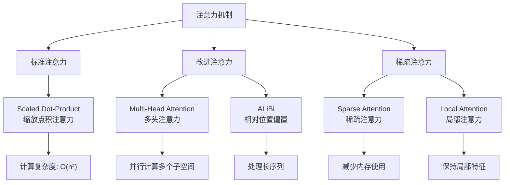

**图表来源**
- [modeling_roberta.py](file://src/transformers/models/roberta/modeling_roberta.py#L184-L276)

### 特定任务头部设计

不同类型的文本分类任务需要相应的输出头部设计：

| 任务类型 | 输出头部 | 损失函数 | 激活函数 |
|---------|----------|----------|----------|
| 单标签分类 | 线性层 + Softmax | CrossEntropyLoss | Softmax |
| 多标签分类 | 线性层 + Sigmoid | BinaryCrossEntropy | Sigmoid |
| 回归任务 | 线性层 | MSE Loss | Linear |
| 排序任务 | 线性层 + Softmax | CrossEntropyLoss | Softmax |

**章节来源**
- [run_classification.py](file://examples/pytorch/text-classification/run_classification.py#L400-L500)

## 超参数优化策略

### 学习率调度器

多种学习率调度策略适用于不同的训练场景：

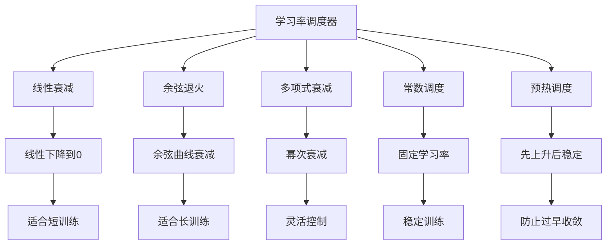

**图表来源**
- [optimization.py](file://src/transformers/optimization.py#L578-L601)

### 批处理大小优化

批处理大小的选择影响训练稳定性和内存使用：

| 批处理大小 | 内存需求 | 训练稳定性 | 收敛速度 | 适用场景 |
|-----------|----------|------------|----------|----------|
| 16-32 | 低 | 差 | 慢 | 小数据集 |
| 64-128 | 中等 | 中等 | 中等 | 标准训练 |
| 256-512 | 高 | 好 | 快 | 大数据集 |
| 1024+ | 很高 | 很好 | 最快 | 分布式训练 |

**章节来源**
- [optimization.py](file://src/transformers/optimization.py#L1-L100)

## 性能优化技巧

### 混合精度训练

混合精度训练通过使用半精度浮点数来加速训练过程：

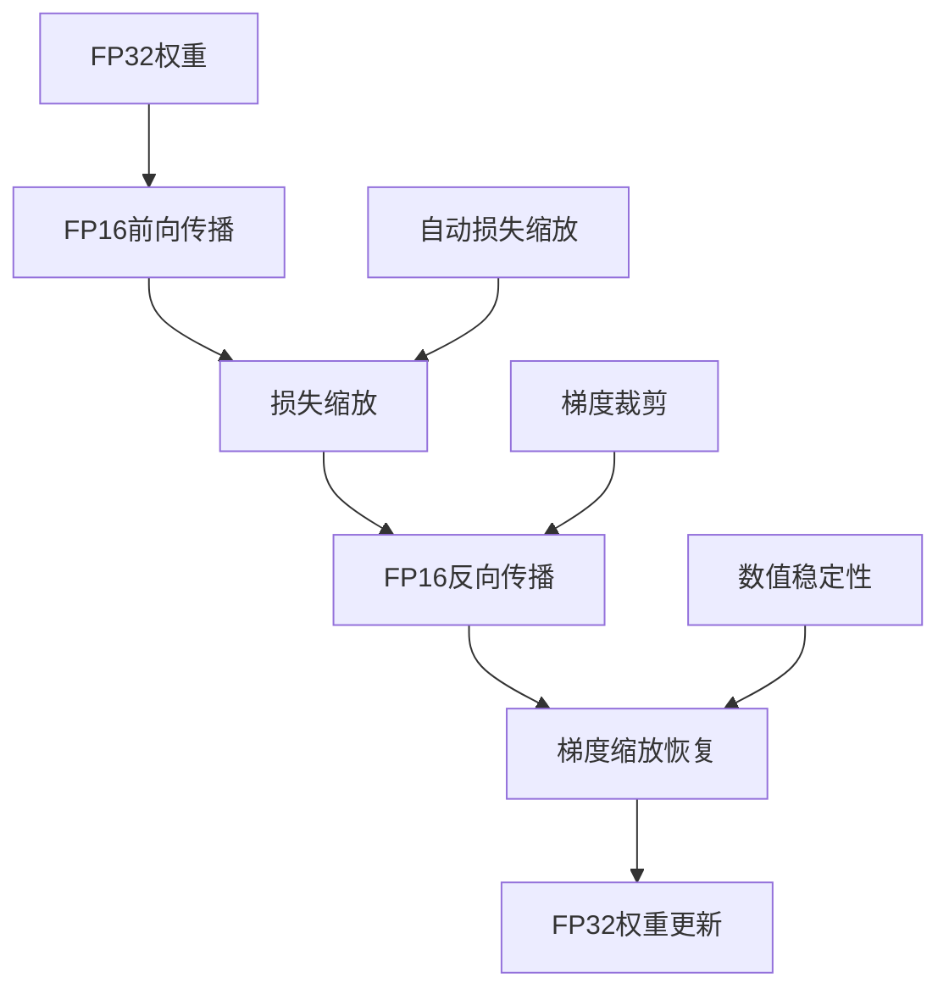

**图表来源**
- [run_glue_no_trainer.py](file://examples/pytorch/text-classification/run_glue_no_trainer.py#L300-L350)

### 梯度累积

当GPU内存不足时，梯度累积允许使用更大的有效批次大小：

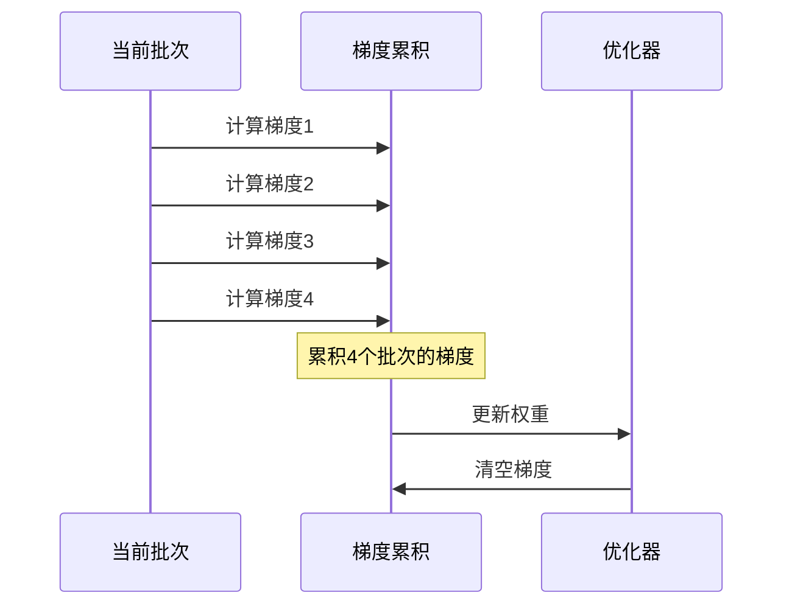

**图表来源**
- [run_glue_no_trainer.py](file://examples/pytorch/text-classification/run_glue_no_trainer.py#L400-L450)

**章节来源**
- [run_glue_no_trainer.py](file://examples/pytorch/text-classification/run_glue_no_trainer.py#L1-L697)

## 常见问题解决方案

### 过拟合处理

过拟合是文本分类中的常见问题，可以通过多种方法解决：

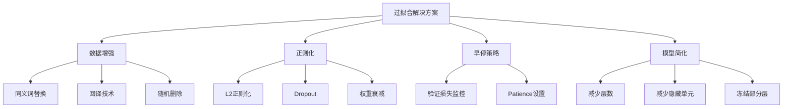

### 类别不平衡处理

类别不平衡会影响模型性能，需要采用适当的采样策略：

| 方法 | 优点 | 缺点 | 适用场景 |
|------|------|------|----------|
| 上采样少数类 | 保留所有样本 | 可能导致过拟合 | 少数类样本充足 |
| 下采样多数类 | 减少计算成本 | 可能丢失重要信息 | 多数类样本过多 |
| 加权损失 | 简单易用 | 需要调参 | 各类别差异明显 |
| SMOTE | 生成合成样本 | 可能引入噪声 | 少数类样本稀缺 |

### 长文本处理策略

对于超出模型最大序列长度的文本，有多种处理方法：

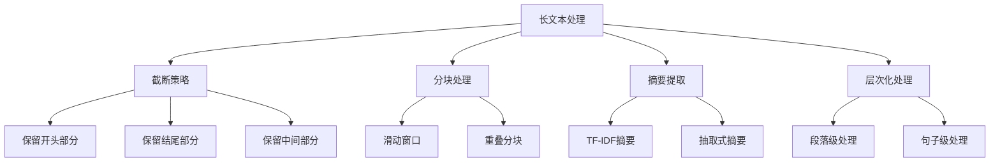

**章节来源**
- [run_classification.py](file://examples/pytorch/text-classification/run_classification.py#L500-L600)

## 进阶优化建议

### 模型剪枝

模型剪枝通过移除不重要的连接来压缩模型：

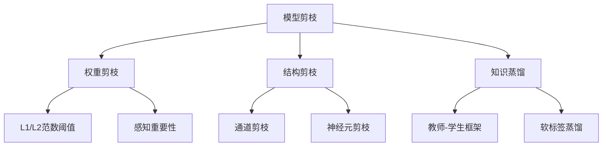

### 知识蒸馏

知识蒸馏通过小模型学习大模型的知识来提升性能：

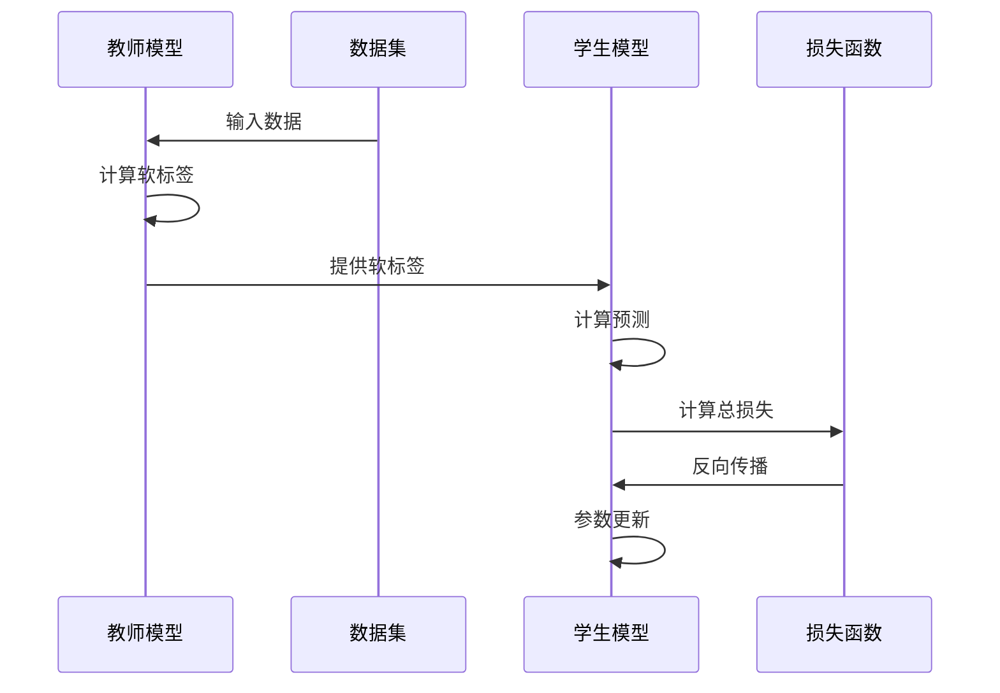

### 自适应优化器

使用自适应优化器可以自动调整学习率：

| 优化器 | 特点 | 适用场景 | 资源需求 |
|--------|------|----------|----------|
| AdamW | 自适应矩估计 | 标准训练 | 中等 |
| AdaFactor | 内存高效 | 大模型训练 | 低 |
| Lion | 计算高效 | 实时应用 | 低 |
| Lookahead | 稳定训练 | 长期训练 | 低 |

**章节来源**
- [optimization.py](file://src/transformers/optimization.py#L600-L700)

## 总结

本文档全面介绍了基于Hugging Face Transformers库的文本分类最佳实践，涵盖了从基础概念到高级优化的各个方面。通过遵循这些最佳实践，开发者可以：

1. **快速上手**：利用现有的GLUE示例快速开始文本分类项目
2. **优化性能**：通过合理的超参数配置和优化策略提升模型效果
3. **解决实际问题**：针对过拟合、类别不平衡等常见问题提供解决方案
4. **持续改进**：采用模型剪枝、知识蒸馏等先进技术进一步优化模型

文本分类作为自然语言处理的基础任务，其最佳实践不仅适用于当前项目，也为更复杂的NLP任务奠定了坚实基础。随着技术的不断发展，这些实践经验将继续指导开发者构建更加智能和高效的文本处理系统。