# 机器翻译最佳实践

<cite>
**本文档中引用的文件**
- [run_translation.py](file://examples/pytorch/translation/run_translation.py)
- [configuration_m2m_100.py](file://src/transformers/models/m2m_100/configuration_m2m_100.py)
- [configuration_t5.py](file://src/transformers/models/t5/configuration_t5.py)
- [configuration_bart.py](file://src/transformers/models/bart/configuration_bart.py)
- [trainer.py](file://src/transformers/trainer.py)
- [trainer_seq2seq.py](file://src/transformers/trainer_seq2seq.py)
- [tokenization_utils_base.py](file://src/transformers/tokenization_utils_base.py)
- [utils.py](file://examples/legacy/seq2seq/utils.py)
</cite>

## 目录
1. [简介](#简介)
2. [项目结构概览](#项目结构概览)
3. [核心组件分析](#核心组件分析)
4. [双语平行语料库预处理](#双语平行语料库预处理)
5. [翻译模型架构选择](#翻译模型架构选择)
6. [多语言翻译优化](#多语言翻译优化)
7. [低资源语言翻译策略](#低资源语言翻译策略)
8. [翻译质量评估](#翻译质量评估)
9. [常见挑战与解决方案](#常见挑战与解决方案)
10. [性能优化建议](#性能优化建议)
11. [总结](#总结)

## 简介

机器翻译是自然语言处理领域的重要应用之一，通过深度学习技术实现不同语言之间的自动转换。本文档基于Hugging Face Transformers库中的`run_translation.py`示例，详细介绍机器翻译任务的最佳实践方法，涵盖从数据预处理到模型部署的完整流程。

## 项目结构概览

Hugging Face Transformers库为机器翻译提供了完整的解决方案，主要包含以下核心模块：

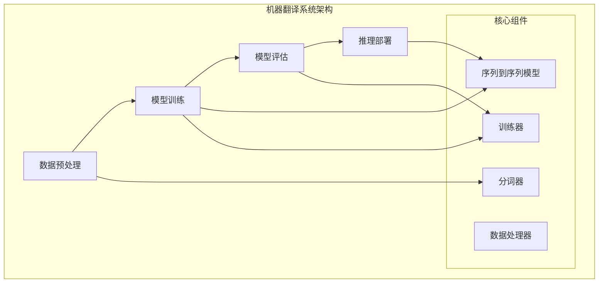

**图表来源**
- [run_translation.py](file://examples/pytorch/translation/run_translation.py#L1-L50)
- [trainer_seq2seq.py](file://src/transformers/trainer_seq2seq.py#L52-L83)

## 核心组件分析

### 序列到序列训练器

`Seq2SeqTrainer`是专门为机器翻译任务设计的训练器，继承自基础`Trainer`类，提供了专门的训练和评估功能。

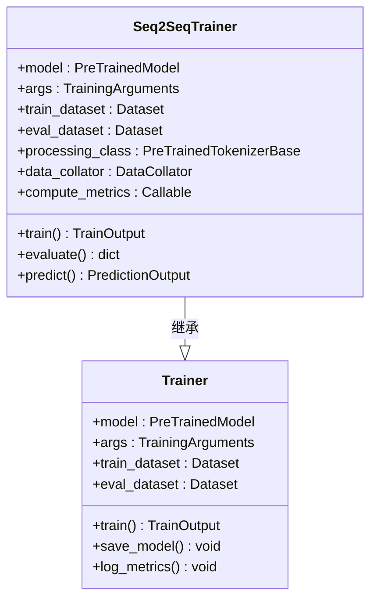

**图表来源**
- [trainer_seq2seq.py](file://src/transformers/trainer_seq2seq.py#L52-L83)
- [trainer.py](file://src/transformers/trainer.py#L1-L100)

### 模型配置参数

不同类型的翻译模型具有不同的架构特点和配置参数：

| 模型类型 | 编码器层数 | 解码器层数 | 注意力头数 | 前馈网络维度 | 特点 |
|---------|-----------|-----------|-----------|-------------|------|
| M2M-100 | 12 | 12 | 16 | 4096 | 多语言通用模型 |
| T5 | 6-24 | 6-24 | 8-64 | 2048-8192 | 文本到文本框架 |
| BART | 6-24 | 6-24 | 12-16 | 3072 | 双向编码器 |
| mBART | 12 | 12 | 16 | 4096 | 多语言BERT风格 |

**节来源**
- [configuration_m2m_100.py](file://src/transformers/models/m2m_100/configuration_m2m_100.py#L34-L53)
- [configuration_t5.py](file://src/transformers/models/t5/configuration_t5.py#L36-L55)
- [configuration_bart.py](file://src/transformers/models/bart/configuration_bart.py#L36-L55)

## 双语平行语料库预处理

### 文本清洗策略

有效的文本清洗是确保翻译质量的基础，主要包括以下步骤：

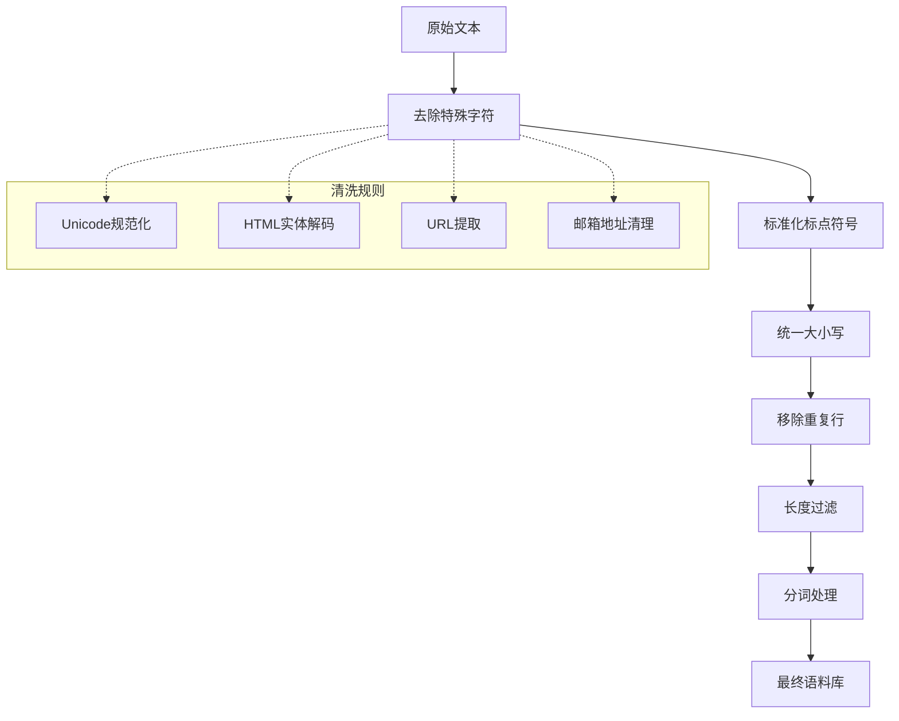

### 分词策略选择

不同的分词方法对翻译效果有显著影响：

#### BPE (Byte Pair Encoding)
- **优点**: 能够处理未登录词，适合处理形态丰富的语言
- **适用场景**: 英语、法语等印欧语系
- **实现**: 在多个模型中使用，如XLM、CTRL等

#### SentencePiece
- **优点**: 无需分词边界预测，支持子词级别学习
- **适用场景**: 中文、日文、韩文等表意文字
- **特点**: 自动学习词汇表，支持多种语言

#### WordPiece
- **优点**: 基于概率的分词策略
- **适用场景**: 预训练语言模型
- **实现**: BERT系列模型使用

### 长度过滤机制

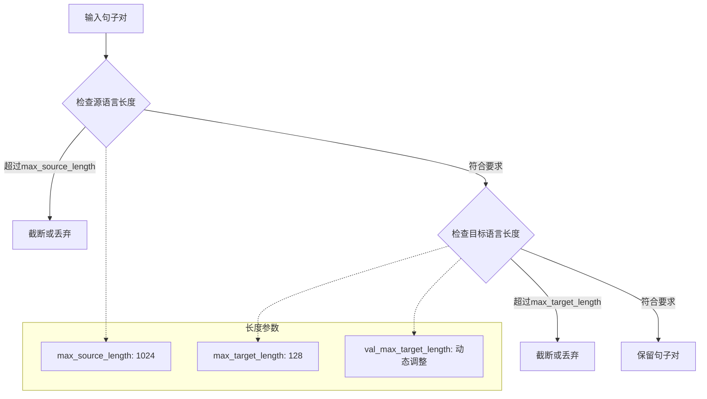

**节来源**
- [run_translation.py](file://examples/pytorch/translation/run_translation.py#L400-L450)

## 翻译模型架构选择

### Transformer架构优势

现代机器翻译主要采用Transformer架构，其核心优势包括：

1. **自注意力机制**: 能够捕捉长距离依赖关系
2. **并行化训练**: 显著提升训练效率
3. **可扩展性**: 支持从小规模到大规模模型的灵活配置

### 模型选择指南

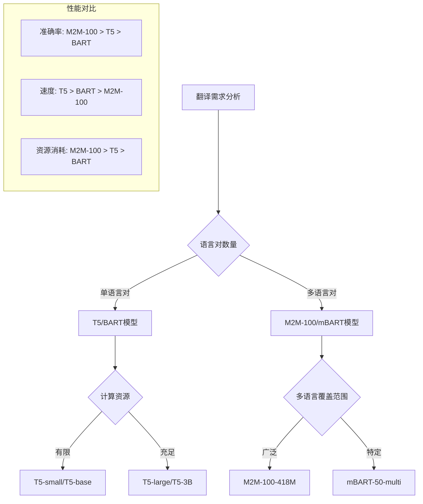

### 关键参数配置

#### 注意力头数优化
- **小模型 (d_model ≤ 512)**: 8个注意力头
- **中等模型 (d_model = 768)**: 12个注意力头  
- **大模型 (d_model ≥ 1024)**: 16个注意力头

#### 前馈网络维度
- **比例**: d_ff = 4 × d_model
- **最小值**: 2048 (对于d_model=512)
- **最大值**: 8192 (对于d_model=4096)

**节来源**
- [configuration_m2m_100.py](file://src/transformers/models/m2m_100/configuration_m2m_100.py#L34-L53)

## 多语言翻译优化

### 多语言模型架构

多语言翻译模型能够同时处理多种语言对，提高资源利用效率：

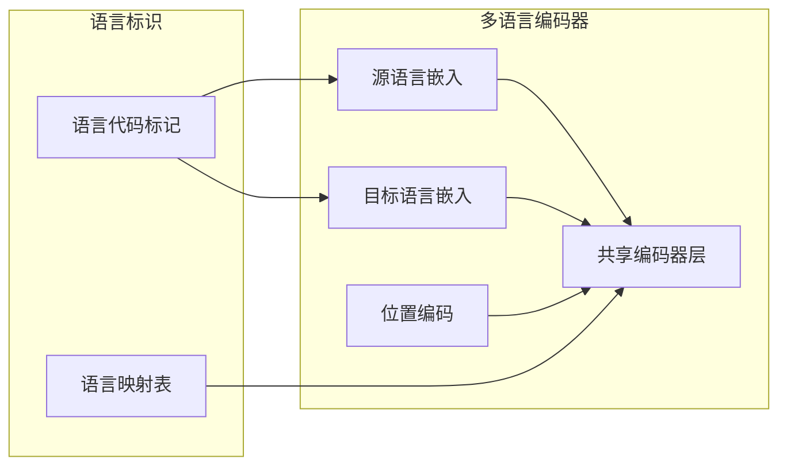

### 语言标识策略

不同多语言模型采用不同的语言标识方法：

| 模型 | 标识方式 | 示例 |
|------|----------|------|
| M2M-100 | 特殊标记 | `__en__`, `__fr__`, `__zh__` |
| mBART | 语言代码 | `en_XX`, `fr_XX`, `zh_CN` |
| XLM-R | 后缀标记 | `en`, `fr`, `zh` |

### 跨语言迁移学习

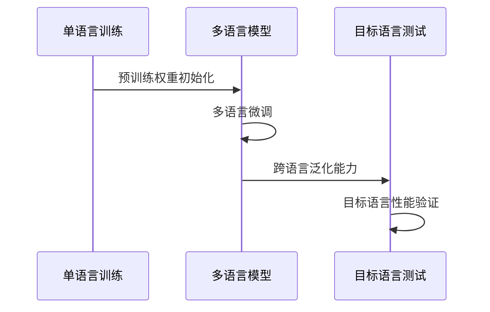

**节来源**
- [run_translation.py](file://examples/pytorch/translation/run_translation.py#L350-L400)

## 低资源语言翻译策略

### 反向翻译技术

反向翻译是一种有效的数据增强方法，通过以下步骤提升低资源语言的翻译质量：

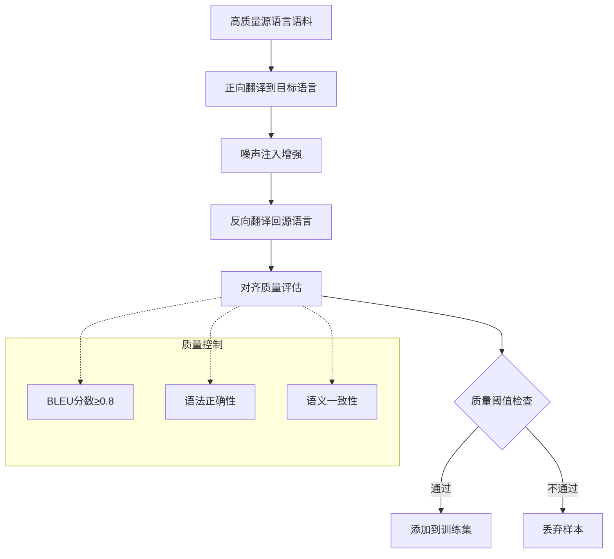

### 知识蒸馏方法

知识蒸馏通过教师-学生模型架构，将大模型的知识迁移到小模型：

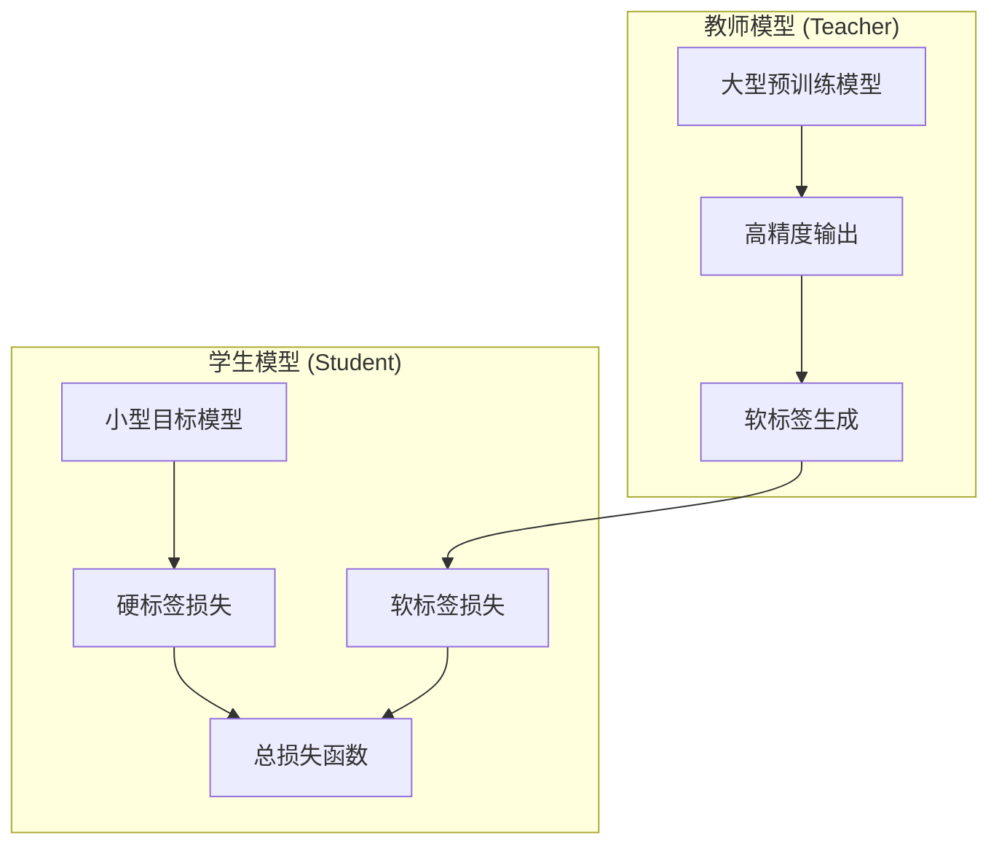

### 数据增强策略

1. **回译 (Back Translation)**: 利用已有的翻译对生成新数据
2. **同义词替换**: 在保持语义的前提下替换词汇
3. **句法变换**: 改变句子结构但不改变含义
4. **领域适应**: 使用相关领域的平行语料进行微调

## 翻译质量评估

### 客观评估指标

#### BLEU分数
BLEU (Bilingual Evaluation Understudy) 是最常用的机器翻译评估指标：

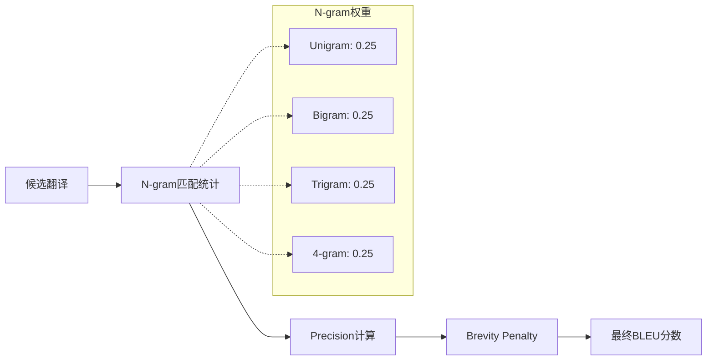

#### METEOR分数
METEOR考虑词汇匹配、同义词和词形变化：

- **优点**: 更好的语义匹配能力
- **缺点**: 计算复杂度较高
- **适用场景**: 对语义准确性要求高的场景

### 主观评估标准

除了客观指标外，还需要进行人工评估：

| 评估维度 | 权重 | 描述 |
|----------|------|------|
| 流畅度 | 30% | 语言自然度和连贯性 |
| 准确性 | 40% | 信息传递的准确性 |
| 完整性 | 20% | 是否遗漏重要信息 |
| 风格一致性 | 10% | 是否保持原文风格 |

### 评估流程

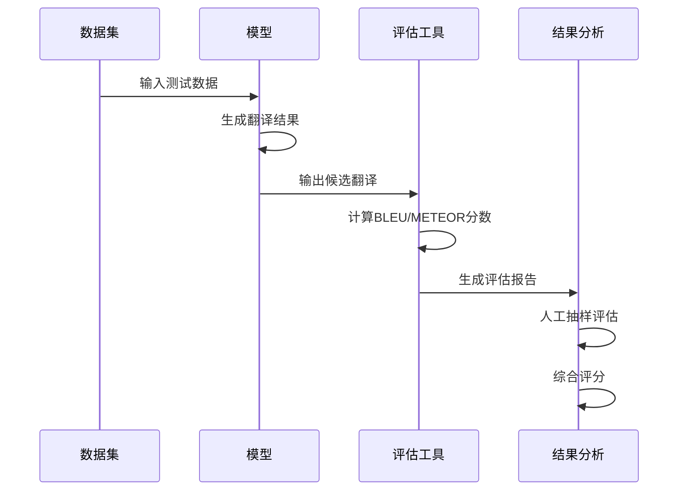

**节来源**
- [run_translation.py](file://examples/pytorch/translation/run_translation.py#L557-L585)
- [utils.py](file://examples/legacy/seq2seq/utils.py#L60-L82)

## 常见挑战与解决方案

### 翻译偏差问题

#### 问题表现
- 模型倾向于生成常见的短语而非准确翻译
- 对稀有词汇的处理不佳
- 文化特定表达的误译

#### 解决方案
1. **数据平衡**: 增加稀有词汇和表达的训练样本
2. **约束解码**: 使用语言模型约束生成过程
3. **后编辑**: 结合人工后编辑流程

### 长句处理策略

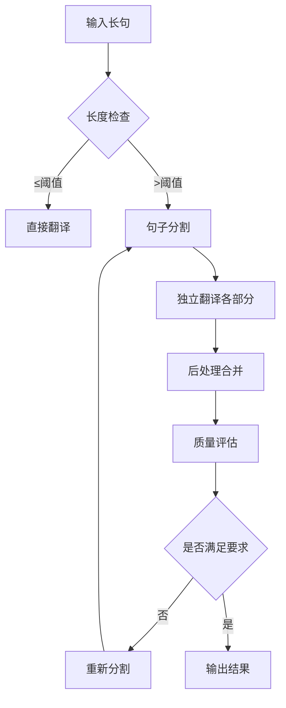

### 领域适应问题

#### 方法一：领域特定微调
- 使用目标领域的平行语料进行微调
- 保持预训练模型的大部分参数不变
- 快速适应新领域

#### 方法二：多领域联合训练
- 将多个领域的数据混合训练
- 学习跨领域的通用表示
- 提高模型的泛化能力

### 罕见词处理

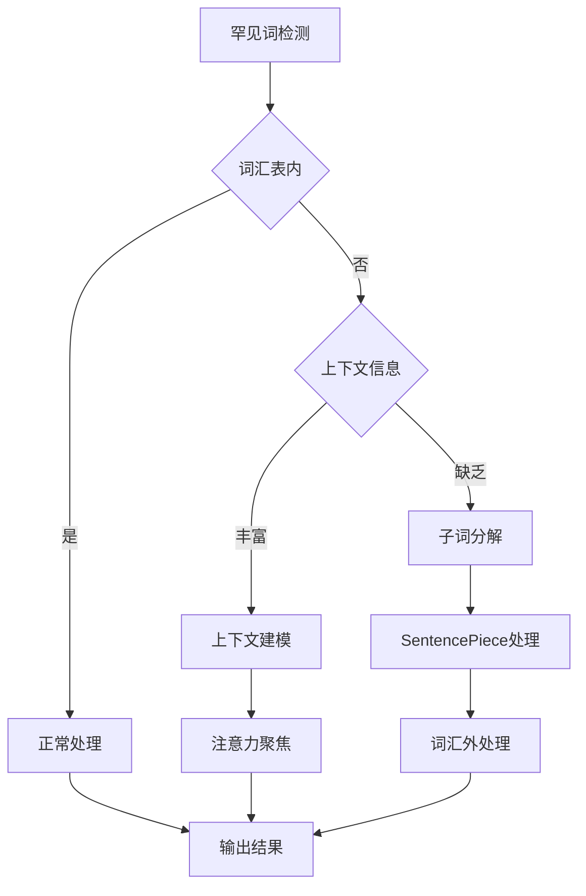

**节来源**
- [tokenization_utils_base.py](file://src/transformers/tokenization_utils_base.py#L3621-L3653)

## 性能优化建议

### 训练优化

#### 批量大小调整
- **GPU内存限制**: 根据显存大小调整批次大小
- **梯度累积**: 当批次太大时使用梯度累积
- **动态批次**: 根据序列长度动态调整批次大小

#### 学习率调度
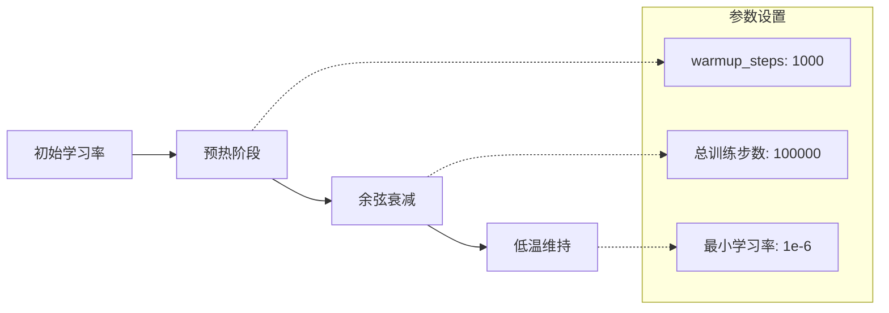

### 推理优化

#### 生成策略优化
1. **束搜索 (Beam Search)**: 平衡质量和多样性
2. **长度惩罚**: 防止过短或过长的翻译
3. **禁止重复**: 避免重复短语的生成

#### 内存优化
- **模型量化**: 使用INT8或FP16量化
- **KV缓存**: 缓存注意力键值对
- **批处理**: 合理组织批量推理

### 硬件配置建议

| 模型规模 | GPU配置 | 内存需求 | 训练时间 |
|----------|---------|----------|----------|
| T5-small | 1×A100 | 8GB | 1-2天 |
| T5-base | 2×A100 | 16GB | 2-3天 |
| T5-large | 4×A100 | 32GB | 5-7天 |
| M2M-100-418M | 2×A100 | 16GB | 3-5天 |

## 总结

机器翻译是一个复杂的多阶段任务，需要综合考虑数据预处理、模型选择、训练策略和评估方法等多个方面。基于Hugging Face Transformers库的最佳实践表明：

1. **数据质量至关重要**: 高质量的预处理和清洗能够显著提升翻译效果
2. **模型选择需权衡**: 根据具体需求在性能、速度和资源消耗之间找到平衡
3. **多语言支持**: 使用多语言模型可以提高资源利用效率
4. **持续优化**: 通过迭代改进和领域适应不断提升模型性能
5. **全面评估**: 结合客观指标和主观评估确保翻译质量

通过遵循这些最佳实践，可以构建出高效、准确的机器翻译系统，满足不同应用场景的需求。