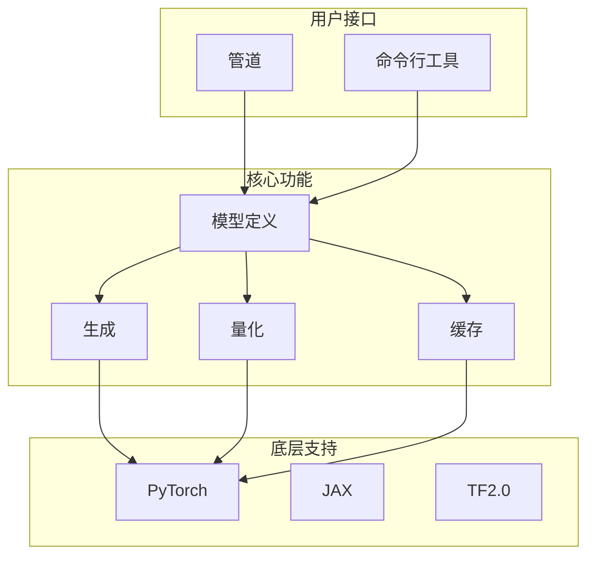
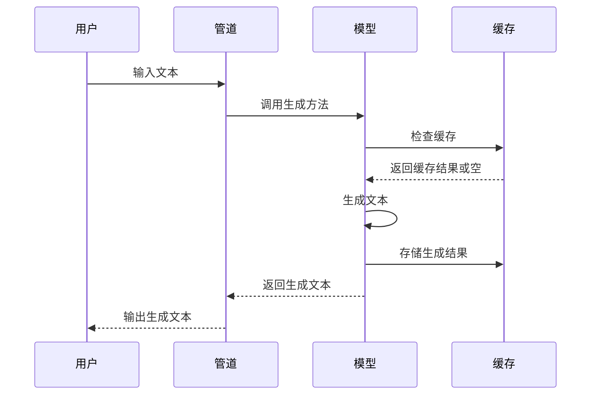
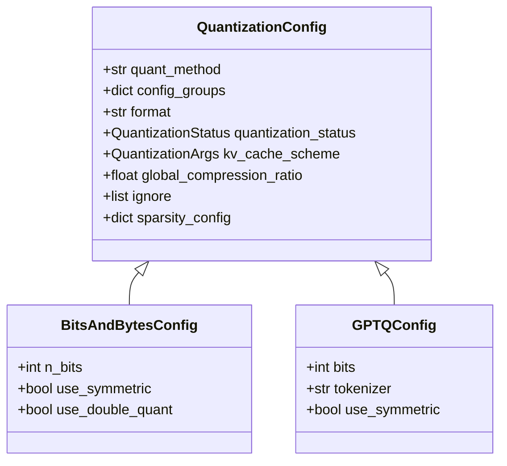
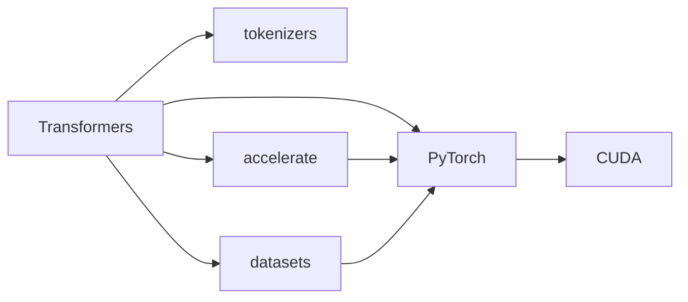

# 优化概述

<cite>
**本文档引用的文件**
- [README.md](file://README.md)
- [CONTRIBUTING.md](file://CONTRIBUTING.md)
- [setup.py](file://setup.py)
- [pyproject.toml](file://pyproject.toml)
- [benchmark.py](file://benchmark/benchmark.py)
- [run_benchmarks.py](file://benchmark_v2/run_benchmarks.py)
- [__init__.py](file://src/transformers/__init__.py)
- [cache_utils.py](file://src/transformers/cache_utils.py)
- [modeling_utils.py](file://src/transformers/modeling_utils.py)
- [generation/__init__.py](file://src/transformers/generation/__init__.py)
</cite>

## 目录
1. [项目结构](#项目结构)
2. [核心组件](#核心组件)
3. [架构概述](#架构概述)
4. [详细组件分析](#详细组件分析)
5. [依赖分析](#依赖分析)
6. [性能考虑](#性能考虑)
7. [故障排除指南](#故障排除指南)
8. [结论](#结论)

## 项目结构

Transformers 项目是一个全面的机器学习模型定义框架，支持文本、计算机视觉、音频、视频和多模态模型的推理和训练。项目结构清晰，主要包含以下几个关键目录：

- **benchmark/**: 包含基准测试脚本和配置，用于评估模型性能。
- **benchmark_v2/**: 新版本的基准测试框架，提供更灵活的配置和运行机制。
- **docker/**: 包含各种 Docker 镜像配置，用于不同环境下的模型部署。
- **docs/**: 项目文档，支持多种语言。
- **examples/**: 各种使用示例，涵盖不同任务和模型。
- **src/transformers/**: 核心源代码，包含模型、管道、生成、量化等模块。
- **tests/**: 测试代码，确保代码质量和功能正确性。
- **utils/**: 工具脚本，用于代码检查、文档生成等。

**Section sources**
- [README.md](file://README.md#L67-L80)
- [CONTRIBUTING.md](file://CONTRIBUTING.md#L32-L45)

## 核心组件

Transformers 库的核心组件包括模型定义、管道（Pipeline）、生成（Generation）和量化（Quantization）等。这些组件共同构成了一个强大的机器学习框架，支持从模型训练到推理的全流程。

- **模型定义**: 提供了超过400种预训练模型的定义，涵盖自然语言处理、计算机视觉、音频处理等多个领域。
- **管道（Pipeline）**: 高级推理类，支持文本、音频、视觉和多模态任务，简化了模型的使用。
- **生成（Generation）**: 提供了丰富的文本生成功能，包括采样、束搜索、停止标准等。
- **量化（Quantization）**: 支持多种量化技术，如4位、8位量化，以减少模型大小和提高推理速度。

**Section sources**
- [README.md](file://README.md#L122-L131)
- [__init__.py](file://src/transformers/__init__.py#L63-L271)

## 架构概述

Transformers 库的架构设计旨在提供一个灵活且高效的模型定义框架。其核心设计理念是将模型定义集中化，确保生态系统中的一致性。库通过以下方式实现这一目标：

- **模块化设计**: 模型定义和实现分离，便于维护和扩展。
- **多框架支持**: 支持 PyTorch、JAX、TF2.0 等多种深度学习框架，允许用户在不同框架之间自由切换。
- **高性能**: 通过优化的实现和硬件加速，提供高性能的推理和训练能力。

**Diagram sources**
- [README.md](file://README.md#L67-L80)
- [__init__.py](file://src/transformers/__init__.py#L63-L271)

## 详细组件分析

### 模型定义

模型定义是 Transformers 库的核心，提供了丰富的预训练模型。每个模型都有对应的配置类和模型类，支持从预训练到微调的全流程。

**Section sources**
- [__init__.py](file://src/transformers/__init__.py#L66-L67)

### 生成

生成模块提供了丰富的文本生成功能，包括采样、束搜索、停止标准等。生成过程可以通过 `GenerationConfig` 进行配置，支持多种生成策略。

**Diagram sources**
- [generation/__init__.py](file://src/transformers/generation/__init__.py#L111-L117)
- [cache_utils.py](file://src/transformers/cache_utils.py#L359-L380)

### 量化

量化模块支持多种量化技术，如4位、8位量化，以减少模型大小和提高推理速度。量化配置通过 `QuantizationConfig` 类进行管理，支持多种量化方法。

**Diagram sources**
- [utils/quantization_config.py](file://src/transformers/utils/quantization_config.py#L1092-L1163)
- [quantizers/quantizer_bnb_4bit.py](file://src/transformers/quantizers/quantizer_bnb_4bit.py)
- [quantizers/quantizer_gptq.py](file://src/transformers/quantizers/quantizer_gptq.py)

## 依赖分析

Transformers 库依赖于多个外部库，以提供完整的功能支持。主要依赖包括：

- **PyTorch**: 深度学习框架，提供模型训练和推理能力。
- **tokenizers**: Hugging Face 的 tokenization 库，支持多种 tokenizer。
- **accelerate**: 分布式训练和推理库，支持多种硬件加速。
- **datasets**: 数据集加载和处理库，支持多种数据格式。

**Diagram sources**
- [setup.py](file://setup.py#L66-L160)
- [pyproject.toml](file://pyproject.toml)

## 性能考虑

Transformers 库在设计时充分考虑了性能优化，通过多种技术手段提高模型的推理和训练效率：

- **缓存机制**: 通过 `Cache` 类实现 KV 缓存，减少重复计算。
- **量化**: 支持多种量化技术，减少模型大小和内存占用。
- **硬件加速**: 支持 GPU、TPU 等硬件加速，提高计算速度。
- **并行计算**: 支持分布式训练和推理，充分利用多核 CPU 和多 GPU。

**Section sources**
- [cache_utils.py](file://src/transformers/cache_utils.py#L359-L380)
- [utils/quantization_config.py](file://src/transformers/utils/quantization_config.py#L1092-L1163)

## 故障排除指南

在使用 Transformers 库时，可能会遇到各种问题。以下是一些常见的故障排除建议：

- **环境问题**: 确保 Python 版本为 3.9+，PyTorch 版本为 2.1+。
- **依赖问题**: 使用 `pip install -e ".[dev]"` 安装开发依赖，确保所有依赖项正确安装。
- **性能问题**: 使用 `make fixup` 进行代码格式化和一致性检查，确保代码质量。
- **模型问题**: 检查模型配置和权重文件是否正确，确保模型能够正常加载。

**Section sources**
- [CONTRIBUTING.md](file://CONTRIBUTING.md#L77-L87)
- [setup.py](file://setup.py#L277-L283)

## 结论

Transformers 库是一个功能强大且灵活的机器学习框架，支持多种模型和任务。通过模块化设计、多框架支持和高性能实现，Transformers 为研究人员和开发者提供了便捷的工具，推动了机器学习技术的发展。未来，Transformers 将继续支持新的模型和技术，进一步提升其在机器学习领域的影响力。