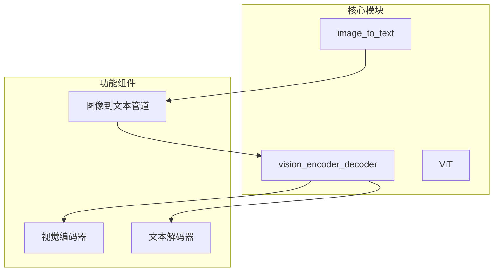
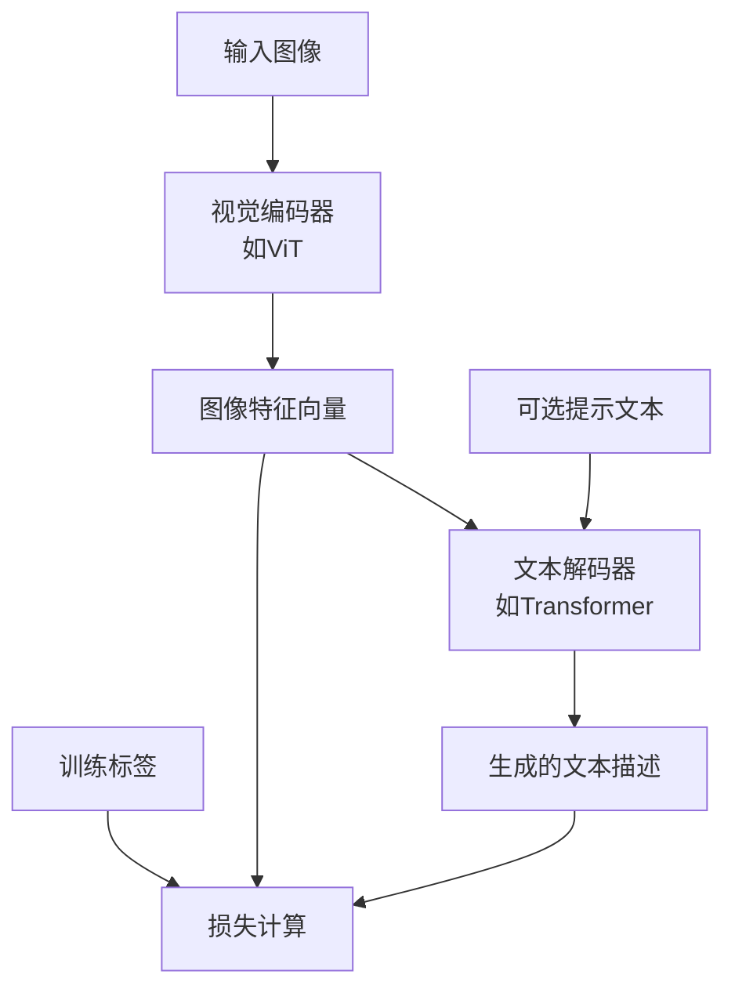
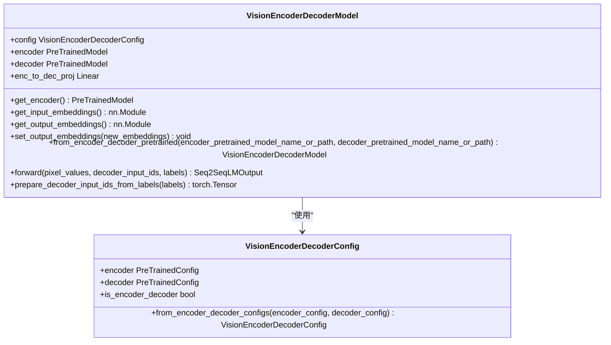
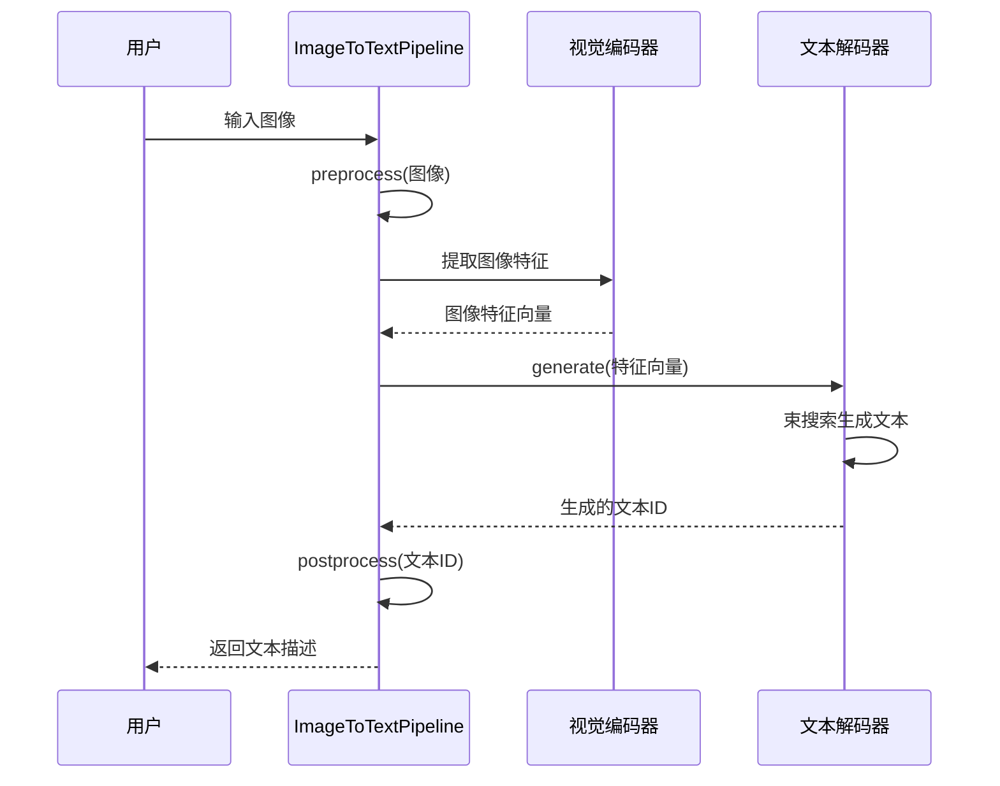
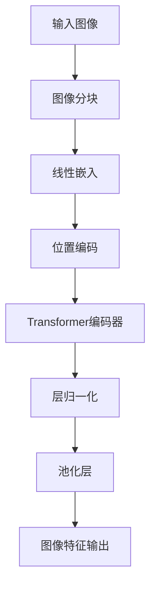
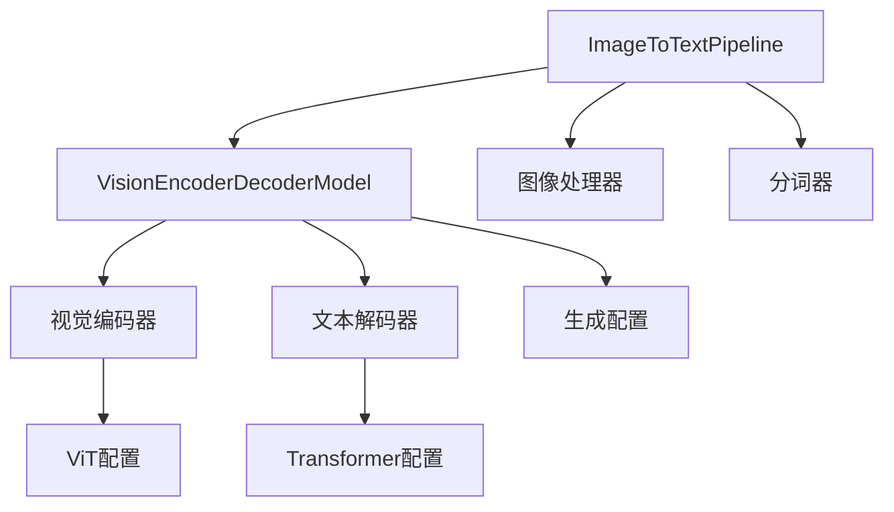

# 图像到文本生成

<cite>
**本文档引用的文件**
- [image_to_text.py](file://src/transformers/pipelines/image_to_text.py)
- [modeling_vision_encoder_decoder.py](file://src/transformers/models/vision_encoder_decoder/modeling_vision_encoder_decoder.py)
- [configuration_vision_encoder_decoder.py](file://src/transformers/models/vision_encoder_decoder/configuration_vision_encoder_decoder.py)
- [modeling_vit.py](file://src/transformers/models/vit/modeling_vit.py)
- [test_pipelines_image_to_text.py](file://tests/pipelines/test_pipelines_image_to_text.py)
</cite>

## 目录
1. [简介](#简介)
2. [项目结构](#项目结构)
3. [核心组件](#核心组件)
4. [架构概述](#架构概述)
5. [详细组件分析](#详细组件分析)
6. [依赖分析](#依赖分析)
7. [性能考虑](#性能考虑)
8. [故障排除指南](#故障排除指南)
9. [结论](#结论)

## 简介
本文档提供了基于编码器-解码器架构的图像到文本生成任务的详细实践指南。重点介绍视觉编码器（如ViT）与文本解码器（如Transformer）的集成方式、跨模态注意力机制的实现细节，以及使用`run_image_to_text.py`示例进行图像特征提取、文本生成策略和训练目标函数设计的方法。

## 项目结构
图像到文本生成功能主要分布在Transformers库的特定模块中，采用分层架构设计，将图像处理、特征提取、文本生成等组件分离。

**图表来源**
- [modeling_vision_encoder_decoder.py](file://src/transformers/models/vision_encoder_decoder/modeling_vision_encoder_decoder.py)
- [image_to_text.py](file://src/transformers/pipelines/image_to_text.py)

**章节来源**
- [src/transformers/models/vision_encoder_decoder](file://src/transformers/models/vision_encoder_decoder)
- [src/transformers/pipelines/image_to_text.py](file://src/transformers/pipelines/image_to_text.py)

## 核心组件
图像到文本生成系统的核心组件包括视觉编码器-解码器架构、跨模态注意力机制和生成管道。视觉编码器（如ViT）负责将图像转换为特征表示，而文本解码器（如GPT-2）则基于这些特征生成描述性文本。

**章节来源**
- [modeling_vision_encoder_decoder.py](file://src/transformers/models/vision_encoder_decoder/modeling_vision_encoder_decoder.py)
- [image_to_text.py](file://src/transformers/pipelines/image_to_text.py)

## 架构概述
系统采用编码器-解码器架构，其中视觉编码器提取图像特征，文本解码器生成相应的描述文本。这种架构允许模型学习图像和文本之间的跨模态对齐。

**图表来源**
- [modeling_vision_encoder_decoder.py](file://src/transformers/models/vision_encoder_decoder/modeling_vision_encoder_decoder.py)
- [modeling_vit.py](file://src/transformers/models/vit/modeling_vit.py)

## 详细组件分析
### 视觉编码器-解码器分析
视觉编码器-解码器模型是图像到文本生成的核心，它将预训练的视觉模型与语言模型相结合，实现跨模态理解与生成。

#### 类图

**图表来源**
- [modeling_vision_encoder_decoder.py](file://src/transformers/models/vision_encoder_decoder/modeling_vision_encoder_decoder.py)
- [configuration_vision_encoder_decoder.py](file://src/transformers/models/vision_encoder_decoder/configuration_vision_encoder_decoder.py)

#### 图像到文本生成流程

**图表来源**
- [image_to_text.py](file://src/transformers/pipelines/image_to_text.py)
- [modeling_vision_encoder_decoder.py](file://src/transformers/models/vision_encoder_decoder/modeling_vision_encoder_decoder.py)

**章节来源**
- [image_to_text.py](file://src/transformers/pipelines/image_to_text.py)
- [modeling_vision_encoder_decoder.py](file://src/transformers/models/vision_encoder_decoder/modeling_vision_encoder_decoder.py)

### ViT视觉编码器分析
Vision Transformer (ViT) 将图像分割成固定大小的patch，然后将这些patch线性嵌入到向量中，通过Transformer编码器处理这些向量序列。

#### ViT架构流程图

**图表来源**
- [modeling_vit.py](file://src/transformers/models/vit/modeling_vit.py)

**章节来源**
- [modeling_vit.py](file://src/transformers/models/vit/modeling_vit.py)

## 依赖分析
图像到文本生成系统依赖于多个核心组件的协同工作，包括视觉编码器、文本解码器、图像处理器和生成配置。

**图表来源**
- [modeling_vision_encoder_decoder.py](file://src/transformers/models/vision_encoder_decoder/modeling_vision_encoder_decoder.py)
- [image_to_text.py](file://src/transformers/pipelines/image_to_text.py)

**章节来源**
- [modeling_vision_encoder_decoder.py](file://src/transformers/models/vision_encoder_decoder/modeling_vision_encoder_decoder.py)
- [image_to_text.py](file://src/transformers/pipelines/image_to_text.py)

## 性能考虑
在图像到文本生成任务中，性能优化需要考虑多个方面，包括模型大小、推理速度和内存使用。使用较小的模型或量化技术可以提高推理速度，而批处理可以提高吞吐量。对于复杂的场景理解，可能需要更大的模型和更多的训练数据。

## 故障排除指南
### 常见问题及解决方案
- **生成文本多样性不足**：调整生成参数，如增加temperature值或使用不同的采样策略
- **图像细节遗漏**：确保视觉编码器具有足够的分辨率和深度来捕捉图像细节
- **长文本连贯性差**：使用具有长序列处理能力的解码器，并考虑引入记忆机制
- **训练不稳定**：检查学习率设置，使用梯度裁剪，并确保数据预处理正确

**章节来源**
- [test_pipelines_image_to_text.py](file://tests/pipelines/test_pipelines_image_to_text.py)
- [modeling_vision_encoder_decoder.py](file://src/transformers/models/vision_encoder_decoder/modeling_vision_encoder_decoder.py)

## 结论
基于编码器-解码器架构的图像到文本生成方法为视觉理解与自然语言生成提供了强大的框架。通过将预训练的视觉模型与语言模型相结合，系统能够学习图像与文本之间的复杂对应关系。未来的发展方向包括改进跨模态注意力机制、增强对复杂场景的理解能力，以及提高生成文本的多样性和连贯性。