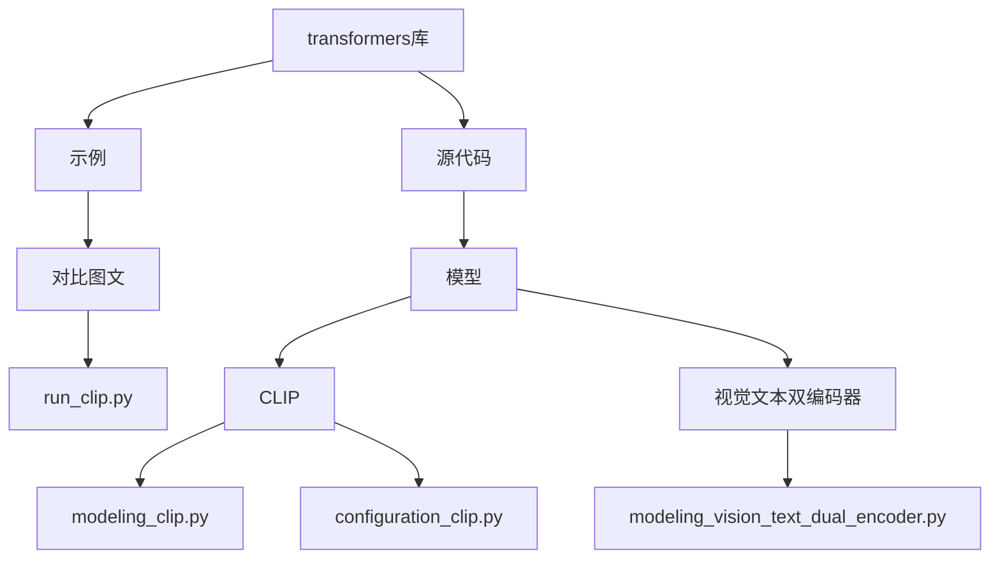
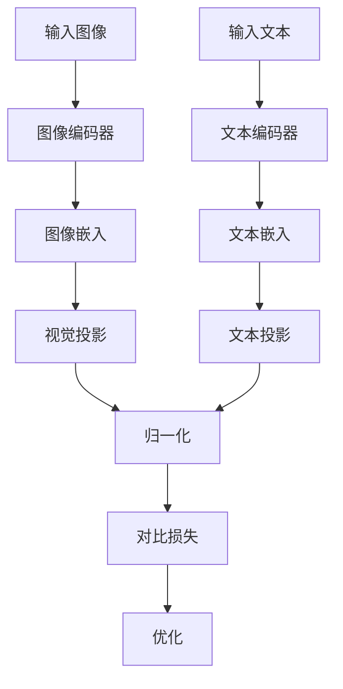
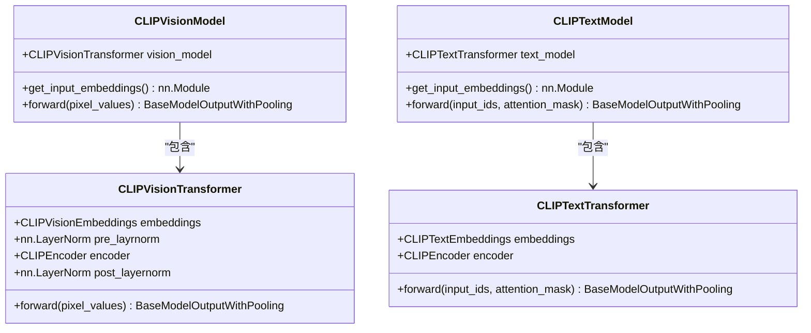
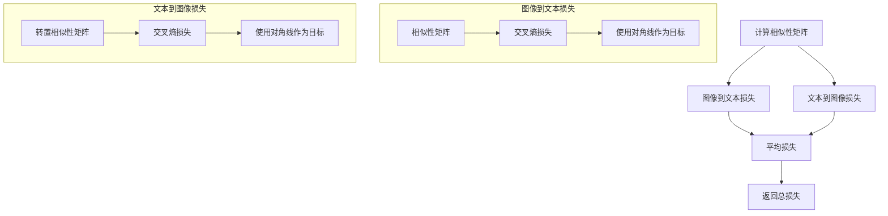
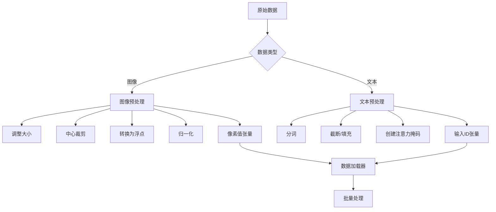
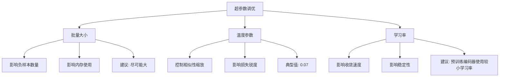
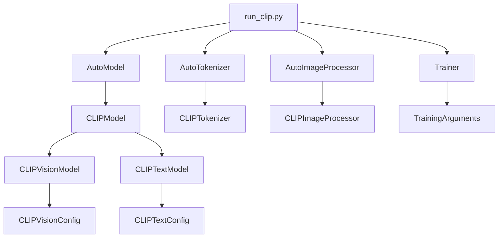

# 图文对比学习

<cite>
**本文档引用的文件**  
- [run_clip.py](file://examples/pytorch/contrastive-image-text/run_clip.py)
- [modeling_clip.py](file://src/transformers/models/clip/modeling_clip.py)
- [configuration_clip.py](file://src/transformers/models/clip/configuration_clip.py)
- [modeling_vision_text_dual_encoder.py](file://src/transformers/models/vision_text_dual_encoder/modeling_vision_text_dual_encoder.py)
</cite>

## 目录
1. [简介](#简介)
2. [项目结构](#项目结构)
3. [核心组件](#核心组件)
4. [架构概述](#架构概述)
5. [详细组件分析](#详细组件分析)
6. [依赖分析](#依赖分析)
7. [性能考虑](#性能考虑)
8. [故障排除指南](#故障排除指南)
9. [结论](#结论)

## 简介
图文对比学习是一种强大的跨模态学习方法，通过对比学习框架将图像和文本嵌入到共享的语义空间中。本文档详细介绍了基于CLIP模型的实现细节和最佳实践，涵盖从基础配置到高级调优的完整指导。文档重点分析了图像和文本编码器的架构设计、对比损失函数的实现方式、图文对数据的预处理流程，以及关键超参数的调优方法。

## 项目结构
transformers库中的图文对比学习功能主要分布在特定的模块和示例中。核心实现位于`src/transformers/models/clip`目录，而训练示例则位于`examples/pytorch/contrastive-image-text`目录。

**图表来源**  
- [run_clip.py](file://examples/pytorch/contrastive-image-text/run_clip.py)
- [modeling_clip.py](file://src/transformers/models/clip/modeling_clip.py)
- [modeling_vision_text_dual_encoder.py](file://src/transformers/models/vision_text_dual_encoder/modeling_vision_text_dual_encoder.py)

**章节来源**  
- [run_clip.py](file://examples/pytorch/contrastive-image-text/run_clip.py)
- [modeling_clip.py](file://src/transformers/models/clip/modeling_clip.py)

## 核心组件
图文对比学习的核心组件包括图像编码器、文本编码器、投影层和对比损失函数。图像编码器通常基于Vision Transformer架构，将图像转换为特征向量；文本编码器基于Transformer架构，将文本转换为特征向量。两个编码器的输出通过投影层映射到共享的嵌入空间，并通过对比损失函数进行优化。

**章节来源**  
- [modeling_clip.py](file://src/transformers/models/clip/modeling_clip.py)
- [configuration_clip.py](file://src/transformers/models/clip/configuration_clip.py)

## 架构概述
CLIP模型采用双编码器架构，包含独立的图像和文本编码器。这种架构允许模型学习跨模态的语义对齐，将相关的图像和文本对在嵌入空间中拉近，而不相关的对推远。

**图表来源**  
- [modeling_clip.py](file://src/transformers/models/clip/modeling_clip.py)
- [run_clip.py](file://examples/pytorch/contrastive-image-text/run_clip.py)

## 详细组件分析

### 图像和文本编码器架构
CLIP模型的图像编码器基于Vision Transformer架构，将图像分割为固定大小的patch，然后通过线性投影转换为patch嵌入。文本编码器基于Transformer架构，处理文本序列并生成上下文相关的表示。

**图表来源**  
- [modeling_clip.py](file://src/transformers/models/clip/modeling_clip.py#L600-L950)

**章节来源**  
- [modeling_clip.py](file://src/transformers/models/clip/modeling_clip.py#L600-L950)
- [configuration_clip.py](file://src/transformers/models/clip/configuration_clip.py#L0-L358)

### 对比损失函数实现
对比损失函数是图文对比学习的核心，通过优化图像-文本对的相似性得分来实现跨模态对齐。CLIP使用对称的对比损失，同时优化图像到文本和文本到图像的匹配。

**图表来源**  
- [modeling_clip.py](file://src/transformers/models/clip/modeling_clip.py#L0-L200)

**章节来源**  
- [modeling_clip.py](file://src/transformers/models/clip/modeling_clip.py#L0-L200)
- [modeling_vision_text_dual_encoder.py](file://src/transformers/models/vision_text_dual_encoder/modeling_vision_text_dual_encoder.py#L0-L199)

### 数据预处理流程
图文对数据的预处理流程包括图像变换和文本标记化两个主要部分。图像预处理通常包括调整大小、中心裁剪、归一化等操作，而文本预处理则涉及分词和填充。

**图表来源**  
- [run_clip.py](file://examples/pytorch/contrastive-image-text/run_clip.py#L0-L519)

**章节来源**  
- [run_clip.py](file://examples/pytorch/contrastive-image-text/run_clip.py#L0-L519)

### 超参数调优方法
基于run_clip.py示例，关键超参数的调优对模型性能至关重要。批量大小、温度参数和学习率等超参数需要根据具体任务和数据集进行调整。

#### 批量大小
批量大小影响对比学习的效果，较大的批量大小可以提供更多的负样本，从而提高学习质量。然而，较大的批量大小也需要更多的内存资源。

#### 温度参数
温度参数控制相似性得分的缩放，影响损失函数的锐度。较低的温度会使模型更加自信，而较高的温度会使分布更加平滑。

#### 学习率
学习率需要根据编码器的初始化状态进行调整。如果使用预训练编码器，建议使用较小的学习率以避免破坏已学习的特征。

**图表来源**  
- [run_clip.py](file://examples/pytorch/contrastive-image-text/run_clip.py#L0-L519)
- [modeling_clip.py](file://src/transformers/models/clip/modeling_clip.py#L950-L1135)

**章节来源**  
- [run_clip.py](file://examples/pytorch/contrastive-image-text/run_clip.py#L0-L519)
- [modeling_clip.py](file://src/transformers/models/clip/modeling_clip.py#L950-L1135)

## 依赖分析
图文对比学习实现依赖于多个核心组件的协同工作。主要依赖关系包括模型架构、训练框架和数据处理工具。

**图表来源**  
- [run_clip.py](file://examples/pytorch/contrastive-image-text/run_clip.py)
- [modeling_clip.py](file://src/transformers/models/clip/modeling_clip.py)

**章节来源**  
- [run_clip.py](file://examples/pytorch/contrastive-image-text/run_clip.py)
- [modeling_clip.py](file://src/transformers/models/clip/modeling_clip.py)

## 性能考虑
在图文对比学习中，性能优化需要考虑多个方面，包括计算效率、内存使用和训练稳定性。平衡图像和文本编码器的训练、跨模态特征对齐技巧是提高性能的关键。

### 训练平衡策略
为了确保图像和文本编码器的均衡发展，可以采用不同的学习率或冻结策略。例如，可以冻结预训练的图像编码器，只训练文本编码器，或者为两个编码器设置不同的学习率。

### 特征对齐技巧
跨模态特征对齐可以通过归一化、温度缩放和投影层设计来实现。归一化确保特征向量具有相同的尺度，温度参数控制相似性得分的分布，而投影层则将不同维度的特征映射到共享空间。

## 故障排除指南
在图文对比学习中，常见的问题包括模态间特征尺度不匹配、对比学习收敛困难等。以下是一些解决方案：

### 特征尺度不匹配
当图像和文本特征的尺度差异较大时，可以采用以下方法：
- 确保两个编码器的输出都经过归一化
- 调整投影层的初始化
- 使用适当的温度参数

### 收敛困难
如果对比学习难以收敛，可以尝试：
- 调整学习率
- 增加批量大小
- 使用学习率预热
- 检查数据预处理是否正确

**章节来源**  
- [modeling_clip.py](file://src/transformers/models/clip/modeling_clip.py)
- [run_clip.py](file://examples/pytorch/contrastive-image-text/run_clip.py)

## 结论
图文对比学习是一种强大的跨模态学习方法，通过CLIP等模型实现了图像和文本的语义对齐。本文档详细介绍了实现细节和最佳实践，为不同经验水平的用户提供了从基础配置到高级调优的完整指导。通过理解图像和文本编码器的架构设计、对比损失函数的实现方式以及关键超参数的调优方法，用户可以有效地应用和优化图文对比学习模型。