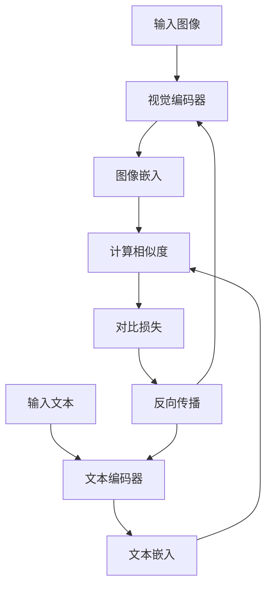
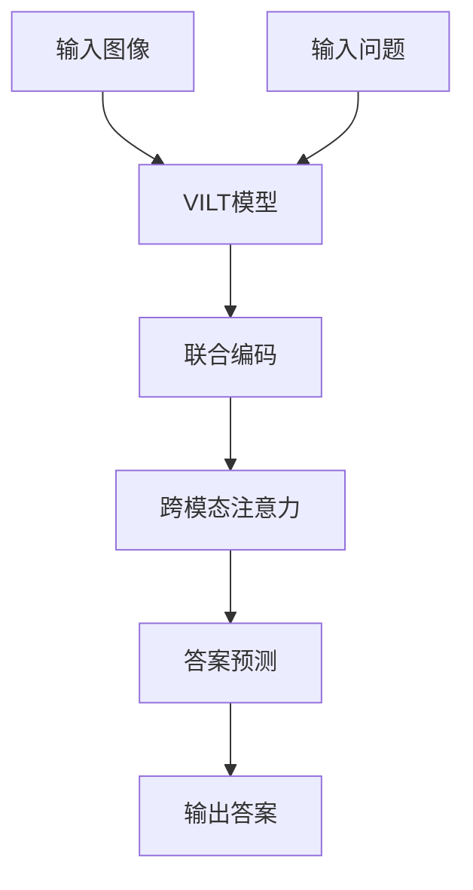

# 多模态任务最佳实践

<cite>
**本文档中引用的文件**  
- [run_clip.py](file://examples/pytorch/contrastive-image-text/run_clip.py)
- [modeling_clip.py](file://src/transformers/models/clip/modeling_clip.py)
- [modeling_blip.py](file://src/transformers/models/blip/modeling_blip.py)
- [modeling_vilt.py](file://src/transformers/models/vilt/modeling_vilt.py)
- [modeling_blip_2.py](file://src/transformers/models/blip_2/modeling_blip_2.py)
- [visual_question_answering.py](file://src/transformers/pipelines/visual_question_answering.py)
- [run_qa.py](file://examples/pytorch/question-answering/run_qa.py)
</cite>

## 目录
1. [引言](#引言)
2. [多模态任务概述](#多模态任务概述)
3. [图文对比学习](#图文对比学习)
4. [图像到文本生成](#图像到文本生成)
5. [视觉问答](#视觉问答)
6. [数据预处理与模态对齐](#数据预处理与模态对齐)
7. [模型架构选择](#模型架构选择)
8. [训练策略与性能优化](#训练策略与性能优化)
9. [常见问题与解决方案](#常见问题与解决方案)
10. [典型配置示例](#典型配置示例)

## 引言
多模态学习是人工智能领域的重要发展方向，通过融合不同模态的信息（如文本、图像、音频等）来提升模型的理解和生成能力。本指南基于Hugging Face Transformers库中的实际示例，为图文对比学习、图像到文本生成和视觉问答等多模态任务提供最佳实践建议。我们将深入探讨数据预处理、模态对齐、模型架构选择和训练策略等关键方面，帮助不同经验水平的用户高效构建和优化多模态系统。

## 多模态任务概述
多模态任务涉及处理和理解来自不同模态的信息。在Transformers库中，主要支持以下几类多模态任务：

- **图文对比学习**：通过对比学习使图像和文本在嵌入空间中对齐，如CLIP模型
- **图像到文本生成**：根据输入图像生成描述性文本，如BLIP模型
- **视觉问答**：根据图像内容回答相关问题，如VILT模型
- **跨模态检索**：实现图像-文本或文本-图像的相互检索

这些任务的核心挑战在于如何有效地对齐不同模态的表示，以及如何设计合适的损失函数和训练策略来优化跨模态理解。

**Section sources**
- [modeling_clip.py](file://src/transformers/models/clip/modeling_clip.py#L0-L200)
- [modeling_blip.py](file://src/transformers/models/blip/modeling_blip.py#L0-L200)

## 图文对比学习
图文对比学习是多模态学习的基础任务，旨在将图像和文本映射到同一语义空间中。CLIP模型是这一领域的代表性工作。

### 对比学习损失函数
对比学习的核心是设计有效的损失函数，使匹配的图像-文本对在嵌入空间中距离更近，而不匹配的对距离更远。CLIP使用对称交叉熵损失：

```python
def contrastive_loss(logits: torch.Tensor) -> torch.Tensor:
    return nn.functional.cross_entropy(logits, torch.arange(len(logits), device=logits.device))

def clip_loss(similarity: torch.Tensor) -> torch.Tensor:
    caption_loss = contrastive_loss(similarity)
    image_loss = contrastive_loss(similarity.t())
    return (caption_loss + image_loss) / 2.0
```

这种对称损失确保了图像到文本和文本到图像的匹配都能得到优化。

### 训练流程
图文对比学习的训练流程包括：
1. 使用预训练的视觉编码器（如ViT）和文本编码器（如BERT）
2. 分别提取图像和文本的嵌入表示
3. 计算嵌入之间的相似度矩阵
4. 应用对比损失进行优化

**Diagram sources**
- [modeling_clip.py](file://src/transformers/models/clip/modeling_clip.py#L0-L50)
- [run_clip.py](file://examples/pytorch/contrastive-image-text/run_clip.py#L0-L100)



**Section sources**
- [modeling_clip.py](file://src/transformers/models/clip/modeling_clip.py#L0-L100)
- [run_clip.py](file://examples/pytorch/contrastive-image-text/run_clip.py#L0-L200)

## 图像到文本生成
图像到文本生成任务旨在根据输入图像生成描述性文本，如图像标题生成。

### BLIP模型架构
BLIP模型采用编码器-解码器架构，其中编码器处理图像，解码器生成文本。关键组件包括：

- **视觉编码器**：通常基于ViT，提取图像特征
- **文本解码器**：基于Transformer，生成描述文本
- **跨模态注意力**：连接视觉和文本模态

### 生成策略
图像到文本生成支持多种策略：
- **无条件生成**：仅输入图像，生成描述
- **条件生成**：输入图像和提示文本，生成相关描述
- **束搜索**：使用束搜索提高生成质量

```python
# 图像标题生成示例
inputs = processor(images=image, return_tensors="pt")
outputs = model.generate(**inputs)
generated_text = processor.decode(outputs[0], skip_special_tokens=True)
```

**Diagram sources**
- [modeling_blip.py](file://src/transformers/models/blip/modeling_blip.py#L892-L919)
- [modeling_blip_2.py](file://src/transformers/models/blip_2/modeling_blip_2.py#L1751-L1785)


**Section sources**
- [modeling_blip.py](file://src/transformers/models/blip/modeling_blip.py#L892-L919)
- [modeling_blip_2.py](file://src/transformers/models/blip_2/modeling_blip_2.py#L1751-L1811)

## 视觉问答
视觉问答（VQA）任务要求模型根据图像内容回答相关问题。

### VILT模型
VILT（Vision-and-Language Transformer）是一种端到端的视觉问答模型，其特点包括：

- **联合嵌入**：将图像和文本嵌入到同一空间
- **跨模态注意力**：实现图像和文本的深度交互
- **分类头**：预测答案类别

### 实现细节
VQA的实现涉及：
1. 图像和文本的联合编码
2. 跨模态特征融合
3. 答案预测

```python
# 视觉问答示例
encoding = processor(image, text, return_tensors="pt")
outputs = model(**encoding)
logits = outputs.logits
predicted_answer = model.config.id2label[logits.argmax(-1).item()]
```

**Diagram sources**
- [modeling_vilt.py](file://src/transformers/models/vilt/modeling_vilt.py#L908-L945)
- [visual_question_answering.py](file://src/transformers/pipelines/visual_question_answering.py#L29-L57)



**Section sources**
- [modeling_vilt.py](file://src/transformers/models/vilt/modeling_vilt.py#L908-L945)
- [visual_question_answering.py](file://src/transformers/pipelines/visual_question_answering.py#L29-L57)

## 数据预处理与模态对齐
有效的数据预处理和模态对齐是多模态任务成功的关键。

### 图像预处理
图像预处理步骤包括：
- **调整大小**：将图像调整到模型期望的尺寸
- **归一化**：使用预定义的均值和标准差进行归一化
- **增强**：可选的数据增强技术

```python
transform = torch.nn.Sequential(
    Resize([image_size], interpolation=InterpolationMode.BICUBIC),
    CenterCrop(image_size),
    ConvertImageDtype(torch.float),
    Normalize(mean, std),
)
```

### 文本预处理
文本预处理包括：
- **分词**：使用预训练的分词器
- **填充和截断**：确保序列长度一致
- **特殊标记**：添加[CLS]、[SEP]等特殊标记

### 模态对齐
模态对齐策略：
- **位置编码**：处理不同分辨率的图像
- **跨模态注意力**：实现模态间的交互
- **投影层**：将不同模态的特征映射到同一空间

**Section sources**
- [run_clip.py](file://examples/pytorch/contrastive-image-text/run_clip.py#L0-L100)
- [modeling_vilt.py](file://src/transformers/models/vilt/modeling_vilt.py#L0-L200)

## 模型架构选择
选择合适的模型架构对多模态任务至关重要。

### 双编码器架构
双编码器架构（如CLIP）的特点：
- **独立编码**：图像和文本分别通过独立的编码器
- **高效检索**：适合大规模跨模态检索
- **对比学习**：使用对比损失进行训练

### 编码器-解码器架构
编码器-解码器架构（如BLIP）的特点：
- **生成能力**：适合文本生成任务
- **深度交互**：解码器可以关注编码器的输出
- **灵活性**：支持条件生成和束搜索

### 端到端架构
端到端架构（如VILT）的特点：
- **联合训练**：图像和文本嵌入同时优化
- **深度融合**：通过跨模态注意力实现深度交互
- **任务特定**：通常针对特定任务进行优化

**Section sources**
- [modeling_clip.py](file://src/transformers/models/clip/modeling_clip.py#L0-L200)
- [modeling_blip.py](file://src/transformers/models/blip/modeling_blip.py#L0-L200)
- [modeling_vilt.py](file://src/transformers/models/vilt/modeling_vilt.py#L0-L200)

## 训练策略与性能优化
有效的训练策略和性能优化技术可以显著提升多模态模型的效果。

### 批处理策略
跨模态批处理策略：
- **动态批处理**：根据序列长度动态调整批大小
- **梯度累积**：在内存受限时使用梯度累积
- **混合精度训练**：使用FP16减少内存占用

### 分布式训练
分布式训练配置：
- **数据并行**：将数据分片到多个GPU
- **模型并行**：将模型分片到多个设备
- **ZeRO优化**：减少内存占用

```python
# 分布式训练配置
training_args = TrainingArguments(
    per_device_train_batch_size=64,
    gradient_accumulation_steps=2,
    fp16=True,
    dataloader_num_workers=4,
)
```

### 计算资源分配
资源分配建议：
- **GPU内存**：根据模型大小和批大小调整
- **CPU线程**：优化数据加载的并行度
- **存储**：预缓存处理后的数据以提高效率

**Section sources**
- [run_clip.py](file://examples/pytorch/contrastive-image-text/run_clip.py#L0-L200)
- [run_qa.py](file://examples/pytorch/question-answering/run_qa.py#L0-L200)

## 常见问题与解决方案
多模态任务中常见的问题及其解决方案。

### 模态不平衡
问题：不同模态的学习速度不一致
解决方案：
- **渐进式学习**：先训练一个模态，再联合训练
- **学习率调整**：为不同模态设置不同的学习率
- **梯度裁剪**：防止某一模态主导训练过程

### 跨模态对齐困难
问题：图像和文本表示难以对齐
解决方案：
- **更强的对比损失**：使用InfoNCE等改进的损失函数
- **数据增强**：使用更丰富的数据增强技术
- **预训练**：使用大规模预训练模型作为起点

### 过拟合
问题：在小数据集上容易过拟合
解决方案：
- **正则化**：使用Dropout和权重衰减
- **早停**：监控验证集性能
- **数据扩充**：增加训练数据的多样性

**Section sources**
- [modeling_clip.py](file://src/transformers/models/clip/modeling_clip.py#L0-L200)
- [modeling_blip.py](file://src/transformers/models/blip/modeling_blip.py#L0-L200)

## 典型配置示例
为不同经验水平的用户提供实用的配置示例。

### 基础配置
适合初学者的简单配置：

```bash
python run_clip.py \
    --output_dir ./clip-finetuned \
    --model_name_or_path openai/clip-vit-base-patch32 \
    --dataset_name ydshieh/coco_dataset_script \
    --dataset_config_name=2017 \
    --per_device_train_batch_size=64 \
    --learning_rate=5e-5 \
    --num_train_epochs=3
```

### 高级配置
适合高级用户的优化配置：

```bash
python run_clip.py \
    --output_dir ./clip-optimized \
    --model_name_or_path openai/clip-vit-large-patch14 \
    --dataset_name ydshieh/coco_dataset_script \
    --dataset_config_name=2017 \
    --per_device_train_batch_size=32 \
    --gradient_accumulation_steps=4 \
    --learning_rate=1e-5 \
    --num_train_epochs=10 \
    --fp16=True \
    --dataloader_num_workers=8 \
    --warmup_steps=1000 \
    --weight_decay=0.1
```

这些配置示例涵盖了从基础到高级的不同需求，用户可以根据自己的资源和任务要求进行调整。

**Section sources**
- [run_clip.py](file://examples/pytorch/contrastive-image-text/run_clip.py#L0-L520)
- [run_qa.py](file://examples/pytorch/question-answering/run_qa.py#L0-L693)