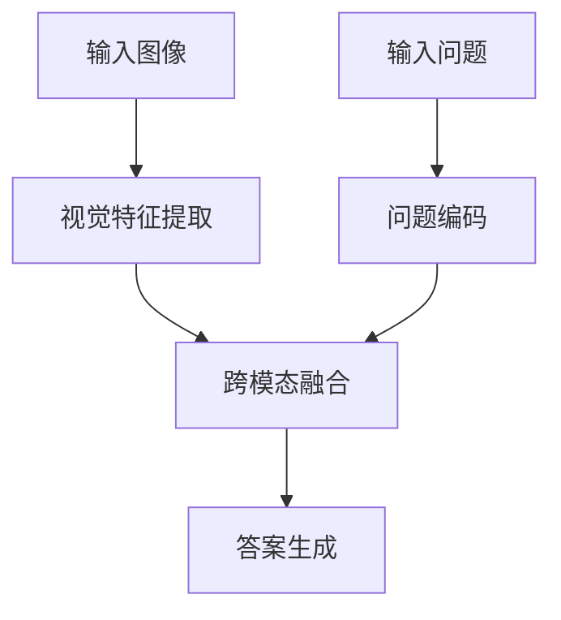
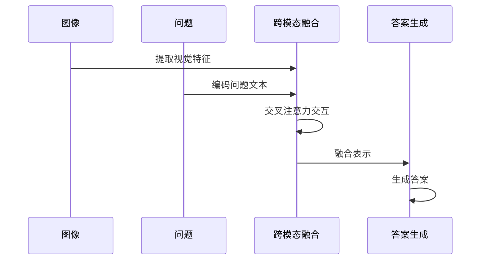

# 视觉问答

<cite>
**本文档中引用的文件**  
- [visual_question_answering.py](file://src/transformers/pipelines/visual_question_answering.py)
- [modeling_vilt.py](file://src/transformers/models/vilt/modeling_vilt.py)
- [modeling_blip.py](file://src/transformers/models/blip/modeling_blip.py)
- [modeling_lxmert.py](file://src/transformers/models/lxmert/modeling_lxmert.py)
- [visual_question_answering.md](file://docs/source/en/tasks/visual_question_answering.md)
</cite>

## 目录
1. [简介](#简介)
2. [核心组件](#核心组件)
3. [多模态融合策略](#多模态融合策略)
4. [推理机制](#推理机制)
5. [性能优化技巧](#性能优化技巧)
6. [常见问题解决方案](#常见问题解决方案)

## 简介
视觉问答（Visual Question Answering, VQA）是一项结合图像和自然语言处理的任务，旨在根据给定的图像回答开放式问题。该任务在多个领域具有重要应用，包括为视障人士提供辅助、教育领域的互动学习、电子商务中的客户服务以及图像检索等。本指南将详细介绍如何在Hugging Face Transformers库中实现视觉问答系统，重点介绍多模态融合策略、注意力机制的应用、答案生成或分类的实现方法，并提供性能优化技巧和常见问题解决方案。

## 核心组件

视觉问答系统的核心组件包括视觉特征提取器、问题编码器、跨模态交互模块和答案生成器。在Hugging Face Transformers库中，这些组件通过不同的模型架构实现，如ViLT、BLIP和LXMERT。`VisualQuestionAnsweringPipeline`类封装了这些组件，提供了统一的接口用于执行视觉问答任务。该管道支持两种主要的VQA范式：分类式VQA和生成式VQA。分类式VQA将问题答案视为预定义类别中的选择，而生成式VQA则允许模型生成自由形式的答案。

**本节来源**
- [visual_question_answering.py](file://src/transformers/pipelines/visual_question_answering.py#L1-L213)
- [visual_question_answering.md](file://docs/source/en/tasks/visual_question_answering.md#L1-L405)

## 多模态融合策略

视觉问答系统的关键在于有效地融合图像特征和问题文本特征。不同的模型采用了不同的多模态融合策略。ViLT模型采用了一种极简的设计，将文本嵌入直接整合到视觉Transformer（ViT）中，实现了视觉和语言的预训练。BLIP模型则采用了更为复杂的架构，包含独立的视觉编码器、文本编码器和文本解码器。视觉编码器负责编码输入图像，文本编码器将输入问题与图像编码相结合，而文本解码器则生成问题的答案。LXMERT模型引入了跨模态注意力机制，通过交叉注意力层实现语言和视觉特征的双向交互。

**图表来源**
- [modeling_vilt.py](file://src/transformers/models/vilt/modeling_vilt.py#L866-L967)
- [modeling_blip.py](file://src/transformers/models/blip/modeling_blip.py#L963-L1170)
- [modeling_lxmert.py](file://src/transformers/models/lxmert/modeling_lxmert.py#L1157-L1319)

## 推理机制

视觉问答系统的推理机制主要依赖于注意力机制和生成策略。在分类式VQA中，模型通常在最终隐藏状态的[CLS]标记上添加一个分类头，将视觉问答任务视为分类问题。例如，ViLTForQuestionAnswering模型使用一个由线性层、层归一化和GELU激活函数组成的序列分类器作为分类头。在生成式VQA中，模型采用条件生成的方式，将问题和图像作为生成答案的提示。BLIP-2等模型引入了新的视觉-语言预训练范式，可以结合任何预训练的视觉编码器和大语言模型，实现最先进的视觉-语言任务性能。

**图表来源**
- [modeling_vilt.py](file://src/transformers/models/vilt/modeling_vilt.py#L866-L967)
- [modeling_blip.py](file://src/transformers/models/blip/modeling_blip.py#L963-L1170)

## 性能优化技巧

为了提高视觉问答系统的性能，可以采用多种优化技巧。对于开放域和封闭域问答，可以根据任务需求选择合适的模型架构。封闭域问答通常采用分类式方法，而开放域问答更适合生成式方法。为了减少语言偏见，可以在训练过程中采用平衡采样策略，确保不同答案类别的样本分布均匀。提高推理准确性的方法包括使用更大的预训练模型、增加训练数据量以及采用更复杂的多模态融合策略。此外，还可以通过调整生成参数（如max_new_tokens）来控制答案的长度和多样性。

**本节来源**
- [visual_question_answering.md](file://docs/source/en/tasks/visual_question_answering.md#L1-L405)
- [modeling_blip.py](file://src/transformers/models/blip/modeling_blip.py#L963-L1170)

## 常见问题解决方案

在实现视觉问答系统时，可能会遇到一些常见问题。对于复杂推理能力不足的问题，可以采用更强大的预训练模型或引入外部知识库。为了解决视觉-语言语义鸿沟问题，可以采用更精细的特征对齐方法，如对比学习或跨模态注意力机制。控制答案多样性可以通过调整生成模型的温度参数或使用top-k采样等技术实现。此外，还可以通过数据增强、迁移学习和模型集成等方法进一步提升系统性能。

**本节来源**
- [visual_question_answering.md](file://docs/source/en/tasks/visual_question_answering.md#L1-L405)
- [modeling_lxmert.py](file://src/transformers/models/lxmert/modeling_lxmert.py#L386-L424)