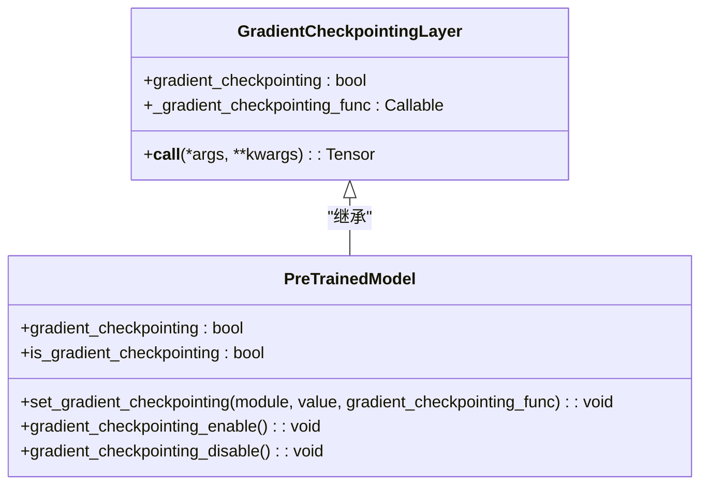

# 内存优化策略

<cite>
**本文档中引用的文件**  
- [modeling_utils.py](file://src/transformers/modeling_utils.py)
- [modeling_layers.py](file://src/transformers/modeling_layers.py)
- [training_args.py](file://src/transformers/training_args.py)
- [trainer.py](file://src/transformers/trainer.py)
- [trainer_utils.py](file://src/transformers/trainer_utils.py)
- [accelerate.py](file://src/transformers/integrations/accelerate.py)
- [deepspeed.py](file://src/transformers/integrations/deepspeed.py)
- [cache.py](file://src/transformers/generation/continuous_batching/cache.py)
</cite>

## 目录
1. [引言](#引言)
2. [内存优化技术概述](#内存优化技术概述)
3. [梯度检查点](#梯度检查点)
4. [激活值重计算](#激活值重计算)
5. [内存高效注意力机制](#内存高效注意力机制)
6. [缓存策略与内存管理](#缓存策略与内存管理)
7. [分布式训练中的内存优化](#分布式训练中的内存优化)
8. [内存使用模式分析](#内存使用模式分析)
9. [常见内存问题诊断与解决方案](#常见内存问题诊断与解决方案)
10. [不同硬件配置的优化建议](#不同硬件配置的优化建议)
11. [性能监控与评估](#性能监控与评估)

## 引言
本文档详细介绍了transformers库中内存管理的最佳实践，重点阐述了多种内存优化技术，包括梯度检查点、激活值重计算和内存高效注意力机制。通过实际代码示例，展示了如何配置和优化内存使用，并提供了具体的参数调优建议。同时，文档还解释了不同模型规模和批次大小下的内存使用模式，为不同硬件配置提供了针对性的内存优化建议。

## 内存优化技术概述
transformers库提供了多种内存优化技术，以应对大规模模型训练和推理中的内存挑战。这些技术包括梯度检查点、激活值重计算、内存高效注意力机制等。通过合理配置这些技术，可以显著降低内存使用，提高训练和推理效率。

## 梯度检查点
梯度检查点是一种通过牺牲计算时间来节省内存的技术。在反向传播过程中，它只保存部分中间激活值，其余的在需要时重新计算。这可以显著减少内存使用，尤其是在深层网络中。

**Diagram sources**
- [modeling_layers.py](file://src/transformers/modeling_layers.py#L34-L93)

**Section sources**
- [modeling_layers.py](file://src/transformers/modeling_layers.py#L34-L93)
- [modeling_utils.py](file://src/transformers/modeling_utils.py)

## 激活值重计算
激活值重计算是梯度检查点的核心机制。通过在反向传播时重新计算某些激活值，而不是在前向传播时保存它们，可以大幅减少内存占用。

**Diagram sources**
- [modeling_layers.py](file://src/transformers/modeling_layers.py#L34-L93)
- [modeling_utils.py](file://src/transformers/modeling_utils.py)

**Section sources**
- [modeling_layers.py](file://src/transformers/modeling_layers.py#L34-L93)
- [modeling_utils.py](file://src/transformers/modeling_utils.py)

## 内存高效注意力机制
内存高效注意力机制通过优化注意力计算过程来减少内存使用。这包括使用更高效的算法和数据结构，以及利用硬件特性来加速计算。

**Diagram sources**
- [modeling_utils.py](file://src/transformers/modeling_utils.py)
- [modeling_flash_attention_utils.py](file://src/transformers/modeling_flash_attention_utils.py)

**Section sources**
- [modeling_utils.py](file://src/transformers/modeling_utils.py)
- [modeling_flash_attention_utils.py](file://src/transformers/modeling_flash_attention_utils.py)

## 缓存策略与内存管理
有效的缓存策略对于内存管理至关重要。transformers库提供了多种缓存机制，包括连续批处理缓存和分页注意力缓存，以优化内存使用。

**Diagram sources**
- [cache.py](file://src/transformers/generation/continuous_batching/cache.py)
- [cache_manager.py](file://src/transformers/generation/continuous_batching/cache_manager.py)

**Section sources**
- [cache.py](file://src/transformers/generation/continuous_batching/cache.py)
- [cache_manager.py](file://src/transformers/generation/continuous_batching/cache_manager.py)

## 分布式训练中的内存优化
在分布式训练中，内存优化尤为重要。transformers库通过集成DeepSpeed和Accelerate等框架，提供了多种内存优化技术，如ZeRO优化和张量并行。

**Diagram sources**
- [deepspeed.py](file://src/transformers/integrations/deepspeed.py)
- [accelerate.py](file://src/transformers/integrations/accelerate.py)

**Section sources**
- [deepspeed.py](file://src/transformers/integrations/deepspeed.py)
- [accelerate.py](file://src/transformers/integrations/accelerate.py)

## 内存使用模式分析
不同模型规模和批次大小下的内存使用模式有所不同。通过分析这些模式，可以更好地理解内存需求并进行优化。

**Section sources**
- [training_args.py](file://src/transformers/training_args.py)
- [trainer.py](file://src/transformers/trainer.py)

## 常见内存问题诊断与解决方案
在实际应用中，可能会遇到各种内存问题，如GPU内存溢出和内存碎片化。本节提供了一些常见问题的诊断方法和解决方案。

**Section sources**
- [trainer_utils.py](file://src/transformers/trainer_utils.py)
- [modeling_utils.py](file://src/transformers/modeling_utils.py)

## 不同硬件配置的优化建议
不同硬件配置下的内存优化策略有所不同。本节为不同显存大小的GPU提供了针对性的优化建议。

**Section sources**
- [accelerate.py](file://src/transformers/integrations/accelerate.py)
- [deepspeed.py](file://src/transformers/integrations/deepspeed.py)

## 性能监控与评估
性能监控是内存优化的重要组成部分。通过监控内存使用情况，可以评估优化效果并进一步调整策略。

**Diagram sources**
- [trainer_utils.py](file://src/transformers/trainer_utils.py)
- [hardware_metrics.py](file://benchmark_v2/framework/hardware_metrics.py)

**Section sources**
- [trainer_utils.py](file://src/transformers/trainer_utils.py)
- [hardware_metrics.py](file://benchmark_v2/framework/hardware_metrics.py)