# 分布式训练优化

<cite>
**本文档引用的文件**
- [distributed_training.py](file://examples/training/distributed_training.py)
- [deepspeed.py](file://src/transformers/integrations/deepspeed.py)
- [fsdp.py](file://src/transformers/integrations/fsdp.py)
- [tensor_parallel.py](file://src/transformers/integrations/tensor_parallel.py)
- [configuration_utils.py](file://src/transformers/distributed/configuration_utils.py)
- [3D_parallel.py](file://examples/3D_parallel.py)
- [training_args.py](file://src/transformers/training_args.py)
- [trainer.py](file://src/transformers/trainer.py)
- [torch-distributed-gpu-test.py](file://scripts/distributed/torch-distributed-gpu-test.py)
</cite>

## 目录
1. [简介](#简介)
2. [项目结构概览](#项目结构概览)
3. [核心分布式训练组件](#核心分布式训练组件)
4. [架构概览](#架构概览)
5. [详细组件分析](#详细组件分析)
6. [分布式训练策略](#分布式训练策略)
7. [框架集成指南](#框架集成指南)
8. [硬件配置与优化](#硬件配置与优化)
9. [性能瓶颈诊断](#性能瓶颈诊断)
10. [最佳实践与建议](#最佳实践与建议)
11. [故障排除指南](#故障排除指南)
12. [总结](#总结)

## 简介

分布式训练是现代大模型训练的核心技术，通过将计算任务分配到多个设备或节点上，显著提升训练效率和可扩展性。Transformers库提供了完整的分布式训练解决方案，支持多种分布式策略，包括数据并行、模型并行和流水线并行，并集成了DeepSpeed、FSDP等主流框架。

本文档基于transformers库中的实际实现，深入解析分布式训练的原理、配置方法和优化技巧，为不同规模的训练任务提供针对性的解决方案。

## 项目结构概览

Transformers库中的分布式训练相关文件主要分布在以下目录结构中：

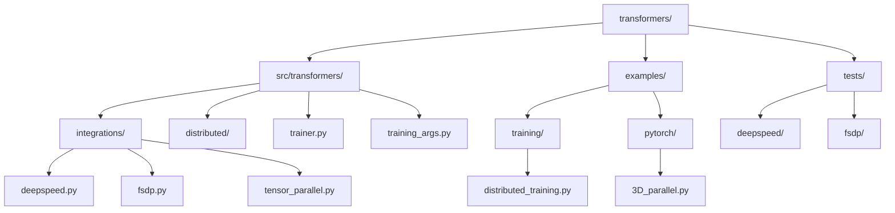
```mermaid
graph TD
A[transformers/] --> B[src/transformers/]
A --> C[examples/]
A --> D[tests/]
B --> E[integrations/]
B --> F[distributed/]
B --> G[trainer.py]
B --> H[training_args.py]
E --> I[deepspeed.py]
E --> J[fsdp.py]
E --> K[tensor_parallel.py]
C --> L[training/]
C --> M[pytorch/]
L --> N[distributed_training.py]
M --> O[3D_parallel.py]
D --> P[deepspeed/]
D --> Q[fsdp/]
```

**图表来源**
- [deepspeed.py](file://src/transformers/integrations/deepspeed.py#L1-L50)
- [fsdp.py](file://src/transformers/integrations/fsdp.py#L1-L30)
- [tensor_parallel.py](file://src/transformers/integrations/tensor_parallel.py#L1-L50)

**章节来源**
- [deepspeed.py](file://src/transformers/integrations/deepspeed.py#L1-L100)
- [fsdp.py](file://src/transformers/integrations/fsdp.py#L1-L54)
- [distributed_training.py](file://examples/training/distributed_training.py#L1-L50)

## 核心分布式训练组件

### 深度学习优化器（DeepSpeed）

DeepSpeed是微软开发的大规模深度学习优化库，提供了ZeRO优化器、混合精度训练、梯度累积等功能。

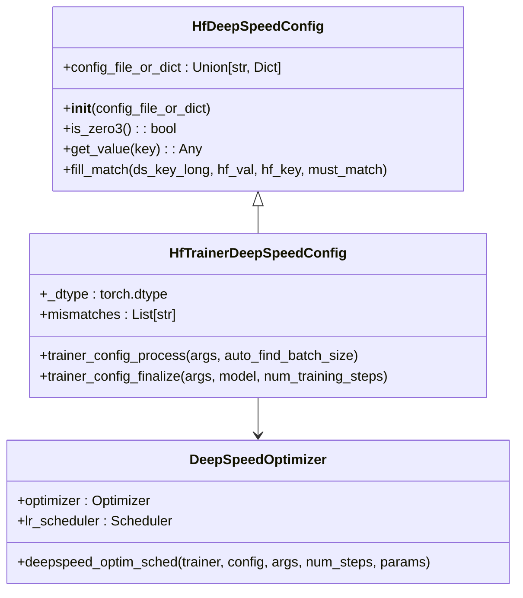
```mermaid
classDiagram
class HfDeepSpeedConfig {
+config_file_or_dict : Union[str, Dict]
+__init__(config_file_or_dict)
+is_zero3() : bool
+get_value(key) : Any
+fill_match(ds_key_long, hf_val, hf_key, must_match)
}
class HfTrainerDeepSpeedConfig {
+_dtype : torch.dtype
+mismatches : List[str]
+trainer_config_process(args, auto_find_batch_size)
+trainer_config_finalize(args, model, num_training_steps)
}
class DeepSpeedOptimizer {
+optimizer : Optimizer
+lr_scheduler : Scheduler
+deepspeed_optim_sched(trainer, config, args, num_steps, params)
}
HfDeepSpeedConfig <|-- HfTrainerDeepSpeedConfig
HfTrainerDeepSpeedConfig --> DeepSpeedOptimizer
```

**图表来源**
- [deepspeed.py](file://src/transformers/integrations/deepspeed.py#L60-L150)
- [deepspeed.py](file://src/transformers/integrations/deepspeed.py#L150-L250)

### 全局共享数据并行（FSDP）

FSDP是PyTorch原生的全量共享数据并行实现，支持参数分片以减少内存占用。

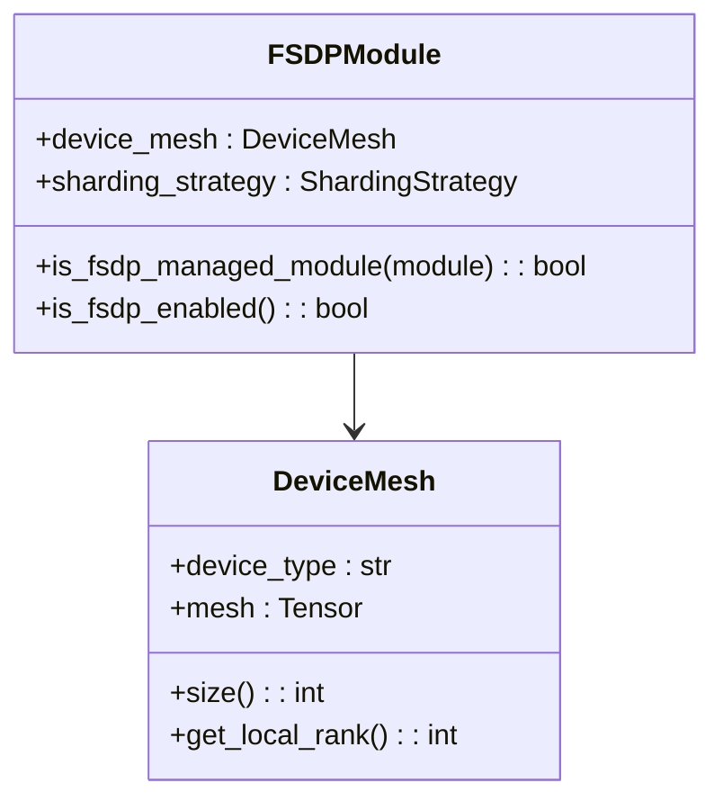
```mermaid
classDiagram
class FSDPModule {
+is_fsdp_managed_module(module) : bool
+is_fsdp_enabled() : bool
+device_mesh : DeviceMesh
+sharding_strategy : ShardingStrategy
}
class DeviceMesh {
+device_type : str
+mesh : Tensor
+size() : int
+get_local_rank() : int
}
FSDPModule --> DeviceMesh
```

**图表来源**
- [fsdp.py](file://src/transformers/integrations/fsdp.py#L20-L54)

### 张量并行化

张量并行通过在多个设备间分割模型参数来实现并行训练。

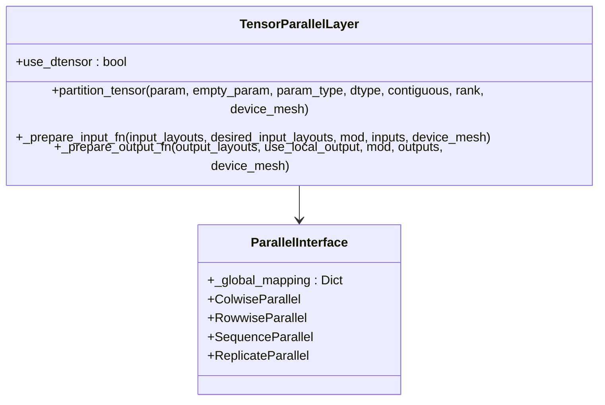
```mermaid
classDiagram
class TensorParallelLayer {
+use_dtensor : bool
+partition_tensor(param, empty_param, param_type, dtype, contiguous, rank, device_mesh)
+_prepare_input_fn(input_layouts, desired_input_layouts, mod, inputs, device_mesh)
+_prepare_output_fn(output_layouts, use_local_output, mod, outputs, device_mesh)
}
class ParallelInterface {
+_global_mapping : Dict
+ColwiseParallel
+RowwiseParallel
+SequenceParallel
+ReplicateParallel
}
TensorParallelLayer --> ParallelInterface
```

**图表来源**
- [tensor_parallel.py](file://src/transformers/integrations/tensor_parallel.py#L400-L500)
- [tensor_parallel.py](file://src/transformers/integrations/tensor_parallel.py#L936-L960)

**章节来源**
- [deepspeed.py](file://src/transformers/integrations/deepspeed.py#L60-L200)
- [fsdp.py](file://src/transformers/integrations/fsdp.py#L20-L54)
- [tensor_parallel.py](file://src/transformers/integrations/tensor_parallel.py#L400-L550)

## 架构概览

Transformers库的分布式训练架构采用模块化设计，支持多种分布式策略的组合使用：

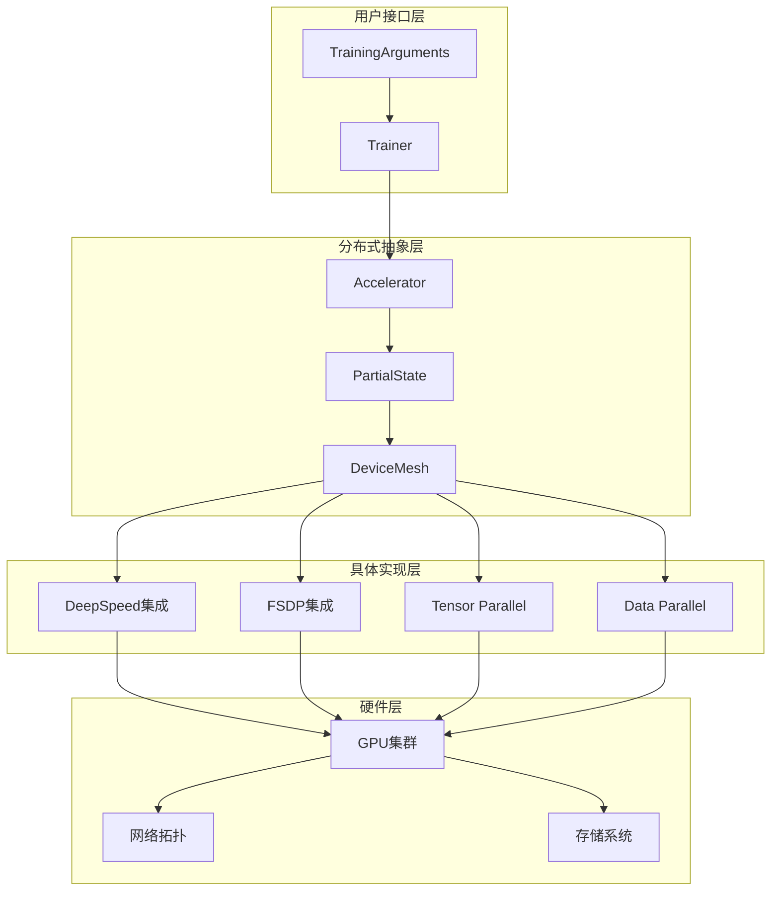
```mermaid
graph TB
subgraph "用户接口层"
A[TrainingArguments]
B[Trainer]
end
subgraph "分布式抽象层"
C[Accelerator]
D[PartialState]
E[DeviceMesh]
end
subgraph "具体实现层"
F[DeepSpeed集成]
G[FSDP集成]
H[Tensor Parallel]
I[Data Parallel]
end
subgraph "硬件层"
J[GPU集群]
K[网络拓扑]
L[存储系统]
end
A --> B
B --> C
C --> D
D --> E
E --> F
E --> G
E --> H
E --> I
F --> J
G --> J
H --> J
I --> J
J --> K
J --> L
```

**图表来源**
- [training_args.py](file://src/transformers/training_args.py#L1750-L1800)
- [trainer.py](file://src/transformers/trainer.py#L4900-L5000)

## 详细组件分析

### 数据并行训练

数据并行是最常见的分布式训练方式，通过将批次数据分发到不同设备上进行并行处理。

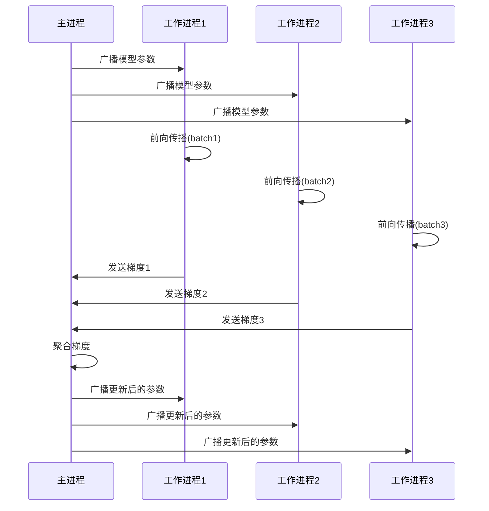
```mermaid
sequenceDiagram
participant Master as 主进程
participant Worker1 as 工作进程1
participant Worker2 as 工作进程2
participant Worker3 as 工作进程3
Master->>Worker1 : 广播模型参数
Master->>Worker2 : 广播模型参数
Master->>Worker3 : 广播模型参数
Worker1->>Worker1 : 前向传播(batch1)
Worker2->>Worker2 : 前向传播(batch2)
Worker3->>Worker3 : 前向传播(batch3)
Worker1->>Master : 发送梯度1
Worker2->>Master : 发送梯度2
Worker3->>Master : 发送梯度3
Master->>Master : 聚合梯度
Master->>Worker1 : 广播更新后的参数
Master->>Worker2 : 广播更新后的参数
Master->>Worker3 : 广播更新后的参数
```

**图表来源**
- [distributed_training.py](file://examples/training/distributed_training.py#L20-L40)

### 模型并行训练

模型并行通过将模型的不同部分分布到不同设备上来处理超大模型。

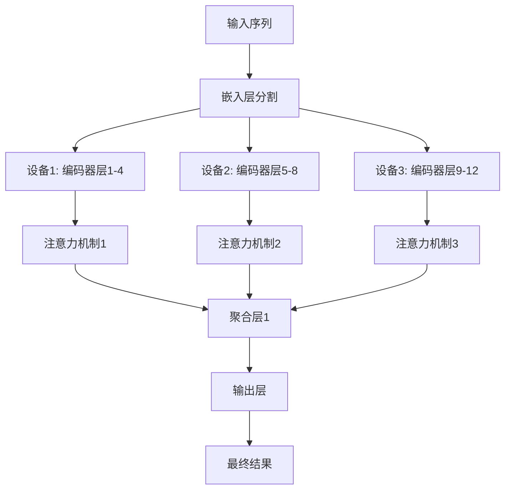
```mermaid
flowchart TD
A[输入序列] --> B[嵌入层分割]
B --> C[设备1: 编码器层1-4]
B --> D[设备2: 编码器层5-8]
B --> E[设备3: 编码器层9-12]
C --> F[注意力机制1]
D --> G[注意力机制2]
E --> H[注意力机制3]
F --> I[聚合层1]
G --> I
H --> I
I --> J[输出层]
J --> K[最终结果]
```

**图表来源**
- [3D_parallel.py](file://examples/3D_parallel.py#L100-L150)

### 流水线并行训练

流水线并行结合了数据并行和模型并行的优势，在多个设备上执行不同的模型阶段。

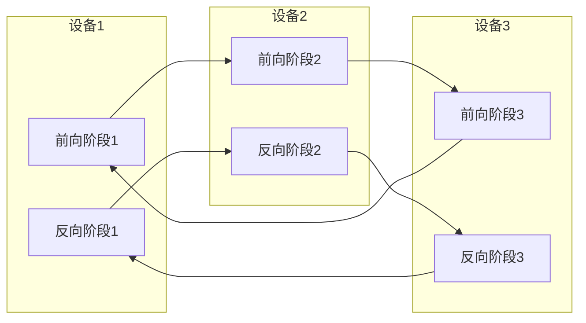
```mermaid
graph LR
subgraph "设备1"
A[前向阶段1]
B[反向阶段1]
end
subgraph "设备2"
C[前向阶段2]
D[反向阶段2]
end
subgraph "设备3"
E[前向阶段3]
F[反向阶段3]
end
A --> C
C --> E
E --> A
B --> D
D --> F
F --> B
```

**图表来源**
- [3D_parallel.py](file://examples/3D_parallel.py#L300-L400)

**章节来源**
- [distributed_training.py](file://examples/training/distributed_training.py#L20-L50)
- [3D_parallel.py](file://examples/3D_parallel.py#L100-L200)

## 分布式训练策略

### 数据并行（Data Parallelism）

数据并行是最直接的分布式训练方式，适用于大多数场景：

| 特性 | 描述 | 优势 | 限制 |
|------|------|------|------|
| 实现复杂度 | 低 | 易于理解和实现 | 需要同步所有设备的梯度 |
| 内存使用 | 中等 | 每个设备保存完整模型副本 | 大模型可能超出单设备内存 |
| 通信开销 | 高 | 每次迭代需要梯度同步 | 受网络带宽限制 |
| 扩展性 | 中等 | 设备数量有限制 | 受通信瓶颈制约 |

### 模型并行（Model Parallelism）

模型并行通过分割模型来适应大模型训练：

| 并行类型 | 实现方式 | 适用场景 | 性能特点 |
|----------|----------|----------|----------|
| 张量并行 | 参数矩阵分割 | 大矩阵运算密集型 | 减少内存占用，增加通信 |
| 层级并行 | 模型层级分割 | 深层网络 | 保持计算局部性 |
| 功能并行 | 不同功能模块分离 | 多任务学习 | 灵活性高但复杂度大 |

### 流水线并行（Pipeline Parallelism）

流水线并行通过时间重叠来提高吞吐量：


```mermaid
gantt
title 流水线并行执行时序图
dateFormat X
axisFormat %s
section 设备1
前向传播1 :active, p1, 0, 3
反向传播1 :p2, 3, 6
section 设备2
前向传播2 :active, p3, 1, 4
反向传播2 :p4, 4, 7
section 设备3
前向传播3 :active, p5, 2, 5
反向传播3 :p6, 5, 8
```

**图表来源**
- [3D_parallel.py](file://examples/3D_parallel.py#L350-L400)

**章节来源**
- [3D_parallel.py](file://examples/3D_parallel.py#L100-L300)

## 框架集成指南

### DeepSpeed配置方法

DeepSpeed提供了三种ZeRO优化策略，针对不同规模的模型：

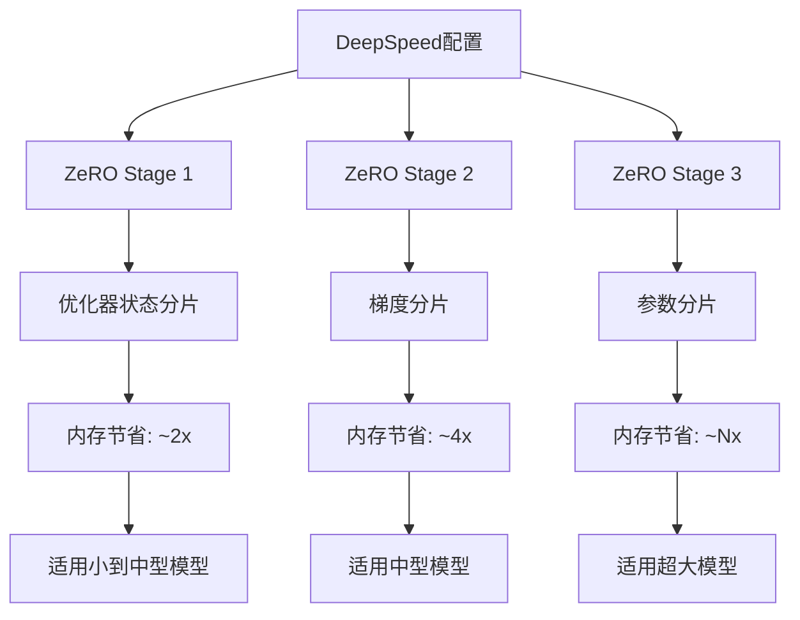
```mermaid
graph TD
A[DeepSpeed配置] --> B[ZeRO Stage 1]
A --> C[ZeRO Stage 2]
A --> D[ZeRO Stage 3]
B --> E[优化器状态分片]
C --> F[梯度分片]
D --> G[参数分片]
E --> H[内存节省: ~2x]
F --> I[内存节省: ~4x]
G --> J[内存节省: ~Nx]
H --> K[适用小到中型模型]
I --> L[适用中型模型]
J --> M[适用超大模型]
```

**图表来源**
- [deepspeed.py](file://src/transformers/integrations/deepspeed.py#L200-L300)

### FSDP配置方法

FSDP是PyTorch原生的全量共享数据并行实现：

| 配置参数 | 默认值 | 说明 | 性能影响 |
|----------|--------|------|----------|
| sharding_strategy | FULL_SHARD | 参数分片策略 | 影响内存使用和通信开销 |
| cpu_offload | False | CPU卸载 | 减少GPU内存但增加CPU-GPU通信 |
| mixed_precision | FP16 | 混合精度训练 | 提升训练速度和内存效率 |
| activation_checkpointing | False | 激活检查点 | 用计算换内存 |

### 性能调优技巧

#### 通信优化

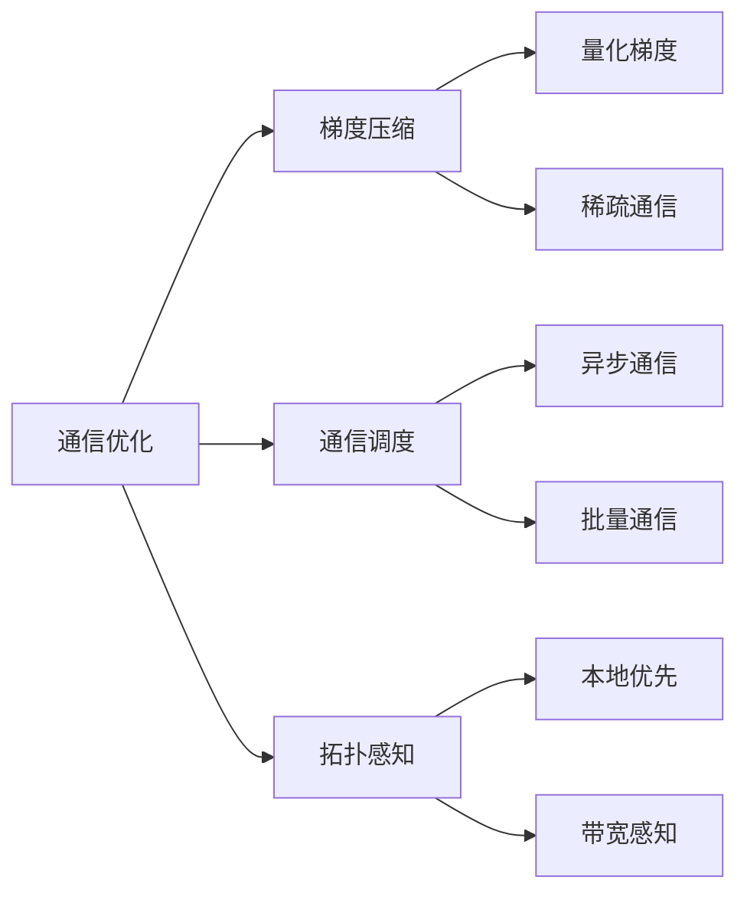
```mermaid
flowchart LR
A[通信优化] --> B[梯度压缩]
A --> C[通信调度]
A --> D[拓扑感知]
B --> E[量化梯度]
B --> F[稀疏通信]
C --> G[异步通信]
C --> H[批量通信]
D --> I[本地优先]
D --> J[带宽感知]
```

#### 内存优化

| 优化技术 | 实现方式 | 内存节省 | 计算开销 |
|----------|----------|----------|----------|
| 梯度检查点 | 重新计算而非保存 | 50-80% | 20-30% |
| 混合精度 | FP16/BF16 | 50% | 5-10% |
| CPU卸载 | 将参数移至CPU | 20-40% | 10-20% |
| 参数分片 | ZeRO优化 | N倍 | 通信开销 |

**章节来源**
- [deepspeed.py](file://src/transformers/integrations/deepspeed.py#L200-L400)
- [fsdp.py](file://src/transformers/integrations/fsdp.py#L20-L54)

## 硬件配置与优化

### GPU集群规模选择

不同规模的GPU集群适合不同的训练需求：

| 集群规模 | GPU数量 | 适用场景 | 网络要求 | 存储需求 |
|----------|---------|----------|----------|----------|
| 小型集群 | 2-8 GPU | 小型实验、原型开发 | 10GbE | SSD存储 |
| 中型集群 | 16-64 GPU | 中型模型训练 | 25GbE-100GbE | NVMe SSD |
| 大型集群 | 128+ GPU | 超大模型训练 | InfiniBand | 高速网络存储 |

### 网络带宽影响分析

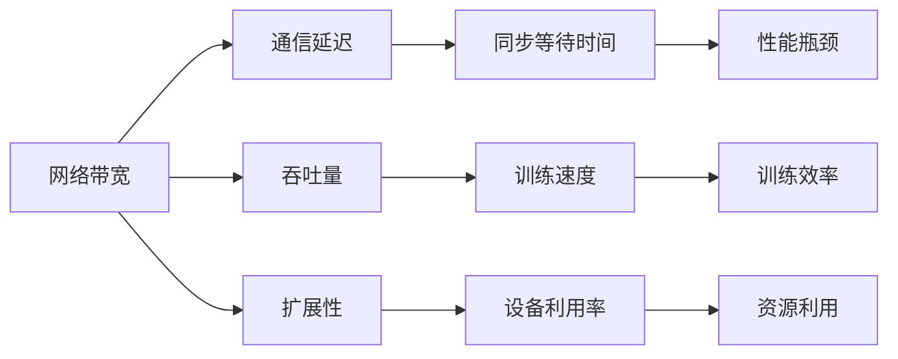
```mermaid
graph LR
A[网络带宽] --> B[通信延迟]
A --> C[吞吐量]
A --> D[扩展性]
B --> E[同步等待时间]
C --> F[训练速度]
D --> G[设备利用率]
E --> H[性能瓶颈]
F --> I[训练效率]
G --> J[资源利用]
```

### 硬件配置建议

#### 单节点配置

对于单节点多GPU训练，推荐配置：

| 组件 | 推荐规格 | 说明 |
|------|----------|------|
| GPU | A100/H100 × 8 | 高带宽内存，支持NVLink |
| CPU | 32核心以上 | 支持大量并发数据处理 |
| 内存 | 512GB+ | 支持大规模数据加载 |
| 网络 | 100GbE | 最小要求，推荐InfiniBand |
| 存储 | NVMe SSD × 4TB+ | 高速数据访问 |

#### 多节点配置

多节点训练需要考虑网络拓扑和负载均衡：

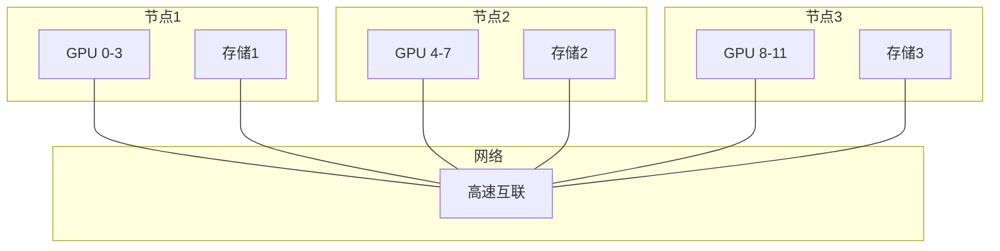
```mermaid
graph TB
subgraph "节点1"
A1[GPU 0-3]
A2[存储1]
end
subgraph "节点2"
B1[GPU 4-7]
B2[存储2]
end
subgraph "节点3"
C1[GPU 8-11]
C2[存储3]
end
subgraph "网络"
D[高速互联]
end
A1 --- D
B1 --- D
C1 --- D
A2 --- D
B2 --- D
C2 --- D
```

**章节来源**
- [training_args.py](file://src/transformers/training_args.py#L1750-L1850)
- [torch-distributed-gpu-test.py](file://scripts/distributed/torch-distributed-gpu-test.py#L1-L50)

## 性能瓶颈诊断

### 常见性能问题

#### 通信开销过大

通信开销是分布式训练的主要瓶颈之一：

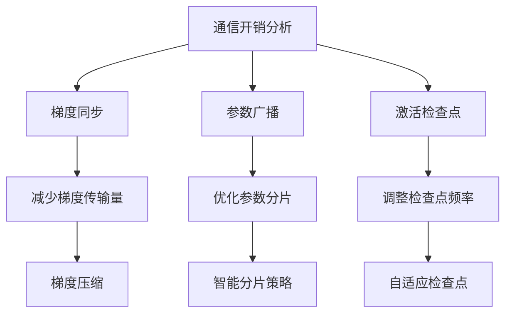
```mermaid
flowchart TD
A[通信开销分析] --> B[梯度同步]
A --> C[参数广播]
A --> D[激活检查点]
B --> E[减少梯度传输量]
C --> F[优化参数分片]
D --> G[调整检查点频率]
E --> H[梯度压缩]
F --> I[智能分片策略]
G --> J[自适应检查点]
```

#### 负载不均衡

负载不均衡会导致部分设备成为瓶颈：

| 问题类型 | 症状 | 原因 | 解决方案 |
|----------|------|------|----------|
| 计算负载不均 | 部分设备空闲 | 模型分区不合理 | 动态负载均衡 |
| 内存使用不均 | 内存不足警告 | 参数分布不均 | 自适应分片 |
| 通信负载不均 | 网络拥塞 | 数据分布不均 | 数据预处理优化 |

### 性能监控指标

关键性能指标包括：

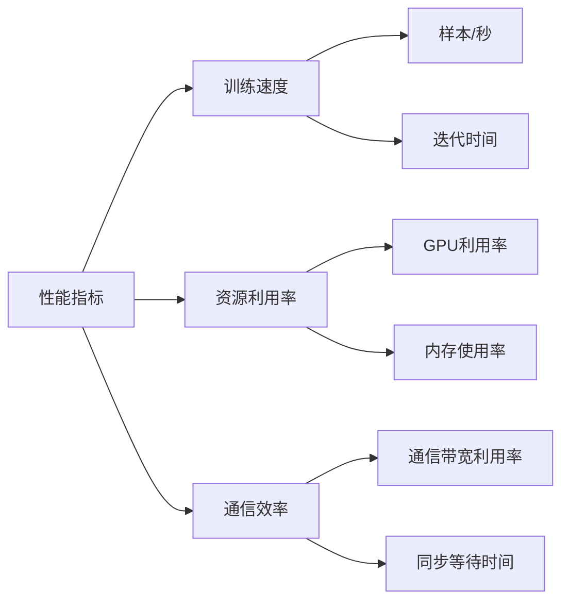
```mermaid
graph LR
A[性能指标] --> B[训练速度]
A --> C[资源利用率]
A --> D[通信效率]
B --> E[样本/秒]
B --> F[迭代时间]
C --> G[GPU利用率]
C --> H[内存使用率]
D --> I[通信带宽利用率]
D --> J[同步等待时间]
```

### 诊断工具和方法

#### 硬件诊断

使用专门的诊断脚本来验证硬件配置：

```bash
# 网络连通性测试
mpirun --hostfile hostfile -np 16 \
    --bind-to none --map-by slot \
    -x NCCL_DEBUG=INFO \
    python torch-distributed-gpu-test.py
```

#### 性能分析

使用内置的性能分析工具：

| 工具 | 功能 | 使用场景 |
|------|------|----------|
| NCCL调试 | 通信性能分析 | 网络问题诊断 |
| PyTorch Profiler | 计算性能分析 | 计算瓶颈识别 |
| Wandb监控 | 训练过程监控 | 整体性能跟踪 |

**章节来源**
- [torch-distributed-gpu-test.py](file://scripts/distributed/torch-distributed-gpu-test.py#L35-L91)
- [3D_parallel.py](file://examples/3D_parallel.py#L400-L434)

## 最佳实践与建议

### 不同规模训练任务的优化策略

#### 小规模训练（单机多卡）

对于小规模训练，推荐使用数据并行加混合精度：

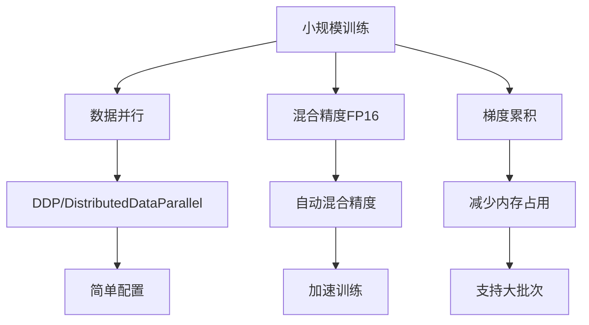
```mermaid
flowchart TD
A[小规模训练] --> B[数据并行]
A --> C[混合精度FP16]
A --> D[梯度累积]
B --> E[DDP/DistributedDataParallel]
C --> F[自动混合精度]
D --> G[减少内存占用]
E --> H[简单配置]
F --> I[加速训练]
G --> J[支持大批次]
```

#### 中规模训练（多机多卡）

中规模训练需要综合考虑内存和通信效率：

| 策略 | 适用场景 | 配置要点 | 注意事项 |
|------|----------|----------|----------|
| 混合并行 | 中大型模型 | DeepSpeed ZeRO + 张量并行 | 需要仔细调参 |
| 层级并行 | 深层网络 | 模型分层 + 数据并行 | 保持计算局部性 |
| 动态批处理 | 不规则数据 | 自适应批次大小 | 需要额外内存管理 |

#### 大规模训练（超大模型）

超大规模训练需要多级并行策略：

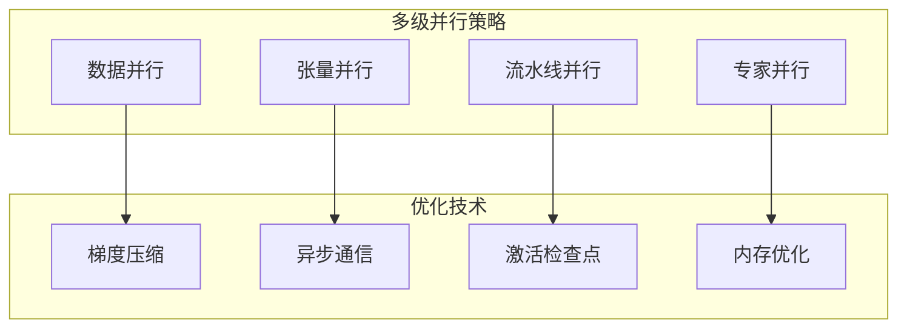
```mermaid
graph TB
subgraph "多级并行策略"
A[数据并行]
B[张量并行]
C[流水线并行]
D[专家并行]
end
subgraph "优化技术"
E[梯度压缩]
F[异步通信]
G[激活检查点]
H[内存优化]
end
A --> E
B --> F
C --> G
D --> H
```

### 配置优化建议

#### 批次大小优化

批次大小对训练效果和效率有重要影响：

| 批次大小策略 | 优势 | 劣势 | 适用场景 |
|------------|------|------|----------|
| 大批次 | 更稳定的梯度估计 | 需要更多内存 | 内存充足的环境 |
| 小批次 | 更好的泛化能力 | 梯度噪声大 | 内存受限的环境 |
| 动态批次 | 自适应优化 | 实现复杂 | 大规模训练 |

#### 学习率调整

分布式训练中的学习率调整策略：

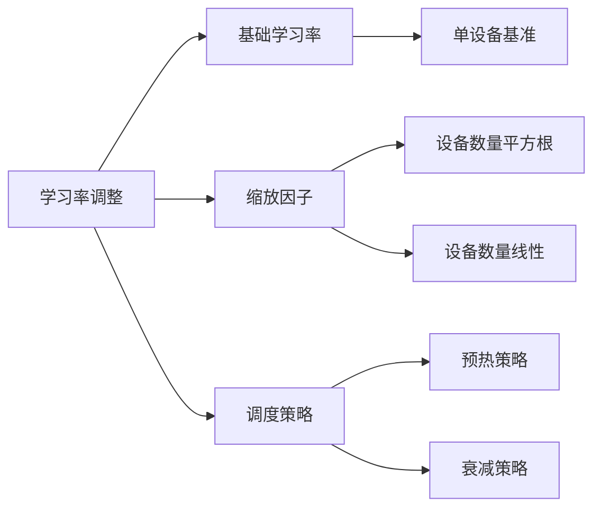
```mermaid
graph LR
A[学习率调整] --> B[基础学习率]
A --> C[缩放因子]
A --> D[调度策略]
B --> E[单设备基准]
C --> F[设备数量平方根]
C --> G[设备数量线性]
D --> H[预热策略]
D --> I[衰减策略]
```

### 调试和验证

#### 分布式训练验证

确保分布式训练正确性的验证方法：

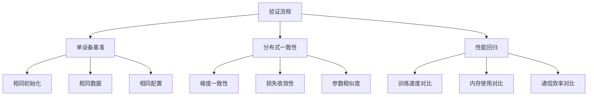
```mermaid
flowchart TD
A[验证流程] --> B[单设备基准]
A --> C[分布式一致性]
A --> D[性能回归]
B --> E[相同初始化]
B --> F[相同数据]
B --> G[相同配置]
C --> H[梯度一致性]
C --> I[损失收敛性]
C --> J[参数相似度]
D --> K[训练速度对比]
D --> L[内存使用对比]
D --> M[通信效率对比]
```

**章节来源**
- [3D_parallel.py](file://examples/3D_parallel.py#L200-L350)
- [training_args.py](file://src/transformers/training_args.py#L1700-L1800)

## 故障排除指南

### 常见错误和解决方案

#### 初始化失败

分布式训练初始化失败的常见原因：

| 错误类型 | 症状 | 原因 | 解决方案 |
|----------|------|------|----------|
| 进程组未初始化 | RuntimeError: init_process_group | 网络配置错误 | 检查MASTER_ADDR和MASTER_PORT |
| 设备不可用 | CUDA out of memory | GPU资源不足 | 减少设备数量或优化内存使用 |
| 权限问题 | Permission denied | 文件权限错误 | 检查文件系统权限 |

#### 通信超时

通信超时是分布式训练中最常见的问题：

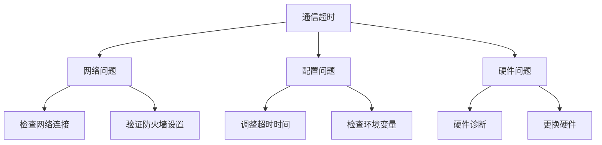
```mermaid
flowchart TD
A[通信超时] --> B[网络问题]
A --> C[配置问题]
A --> D[硬件问题]
B --> E[检查网络连接]
B --> F[验证防火墙设置]
C --> G[调整超时时间]
C --> H[检查环境变量]
D --> I[硬件诊断]
D --> J[更换硬件]
```

#### 内存溢出

内存溢出问题的诊断和解决：

| 问题类型 | 症状 | 诊断方法 | 解决方案 |
|----------|------|----------|----------|
| GPU内存溢出 | CUDA out of memory | nvidia-smi监控 | 减少批次大小或使用ZeRO |
| CPU内存溢出 | 系统内存不足 | top命令监控 | 启用CPU卸载 |
| 网络内存溢出 | 通信缓冲区满 | NCCL调试日志 | 调整通信参数 |

### 性能调优流程

#### 逐步优化策略

```mermaid
graph TD
A[初始配置] --> B[基准测试]
B --> C[瓶颈识别]
C --> D[针对性优化]
D --> E[性能验证]
E --> F{是否满足目标?}
F --> |否| G[进一步优化]
F --> |是| H[部署生产]
G --> C
```

#### 优化检查清单

| 检查项 | 验证方法 | 目标指标 |
|--------|----------|----------|
| 网络连通性 | ping测试 | 延迟 < 1ms |
| 内存使用 | 监控工具 | 利用率 > 80% |
| GPU利用率 | nvidia-smi | 利用率 > 90% |
| 通信效率 | NCCL调试 | 带宽利用率 > 80% |

**章节来源**
- [distributed_training.py](file://examples/training/distributed_training.py#L48-L112)
- [torch-distributed-gpu-test.py](file://scripts/distributed/torch-distributed-gpu-test.py#L35-L91)

## 总结

分布式训练是现代大模型训练不可或缺的技术，Transformers库提供了完整的分布式训练解决方案。通过合理选择分布式策略、优化硬件配置和调优参数，可以显著提升训练效率和模型质量。

关键要点包括：

1. **策略选择**：根据模型规模和硬件条件选择合适的数据并行、模型并行或流水线并行策略
2. **框架集成**：充分利用DeepSpeed、FSDP等框架提供的优化功能
3. **硬件优化**：选择合适的GPU集群规模和网络配置
4. **性能监控**：建立完善的性能监控和诊断体系
5. **持续优化**：通过迭代优化不断提升训练效率

随着硬件技术和算法的发展，分布式训练技术将继续演进，为更大规模的模型训练提供支持。