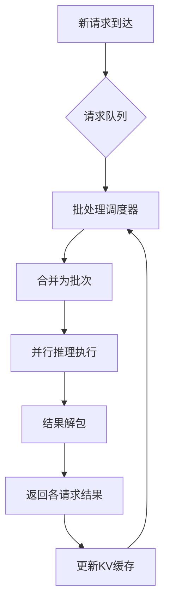
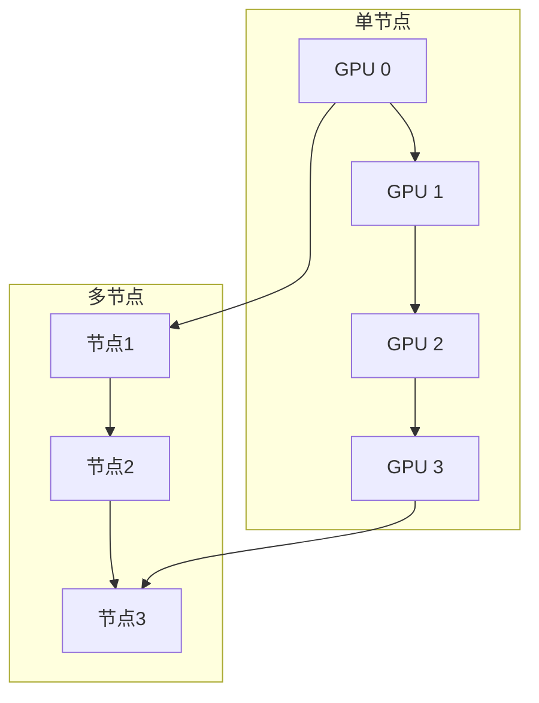
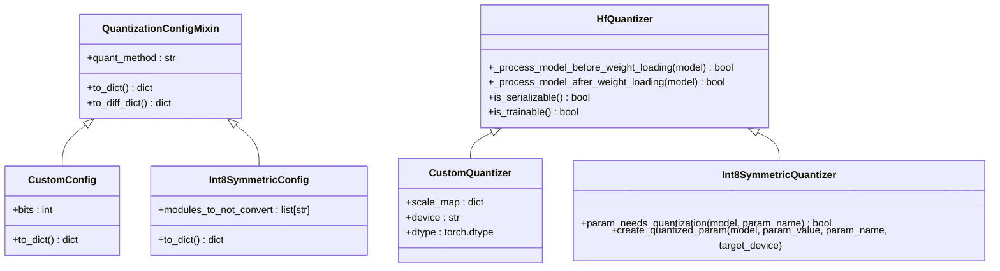
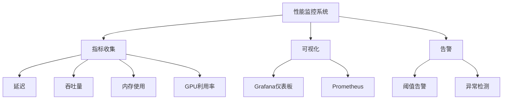

# 性能优化最佳实践

<cite>
**本文档中引用的文件**  
- [continuous_batching.py](file://examples/pytorch/continuous_batching.py)
- [continuous_batching_simple.py](file://examples/pytorch/continuous_batching_simple.py)
- [distributed_training.py](file://examples/training/distributed_training.py)
- [custom_quantization.py](file://examples/quantization/custom_quantization.py)
- [custom_quantization_int8_example.py](file://examples/quantization/custom_quantization_int8_example.py)
- [benchmark.py](file://benchmark/benchmark.py)
- [benchmarks_entrypoint.py](file://benchmark/benchmarks_entrypoint.py)
- [metrics_example.py](file://examples/metrics-monitoring/metrics_example.py)
- [continuous-batching-dashboard.json](file://examples/metrics-monitoring/continuous-batching-dashboard.json)
- [generation.yaml](file://benchmark/config/generation.yaml)
</cite>

## 目录
1. [引言](#引言)
2. [连续批处理优化](#连续批处理优化)
3. [分布式训练策略](#分布式训练策略)
4. [模型量化技术](#模型量化技术)
5. [内存与计算优化](#内存与计算优化)
6. [性能监控与指标](#性能监控与指标)
7. [部署场景优化建议](#部署场景优化建议)
8. [常见性能问题诊断](#常见性能问题诊断)
9. [结论](#结论)

## 引言
本文档基于transformers库的examples和benchmark目录中的实际示例，系统性地介绍使用transformers库时的性能优化最佳实践。文档重点涵盖连续批处理、分布式训练、模型量化和内存优化等关键技术，为不同场景下的性能优化提供具体的技术实现细节和参数调优建议。

**Section sources**
- [continuous_batching.py](file://examples/pytorch/continuous_batching.py#L1-L302)
- [distributed_training.py](file://examples/training/distributed_training.py#L1-L114)

## 连续批处理优化

连续批处理（Continuous Batching）是一种提高推理服务吞吐量的关键技术，通过动态合并多个推理请求来最大化硬件利用率。在高吞吐量推理服务中，连续批处理配置能够显著提升每秒处理的令牌数（tokens per second）。

**Diagram sources**
- [continuous_batching.py](file://examples/pytorch/continuous_batching.py#L1-L302)
- [continuous_batching_simple.py](file://examples/pytorch/continuous_batching_simple.py#L1-L110)

### 配置参数调优
连续批处理的性能受多个关键参数影响，需要根据具体应用场景进行调优：

- **num_blocks**: 控制KV缓存的块数量，影响内存使用和批处理容量
- **max_batch_tokens**: 限制批次中最大令牌总数，平衡延迟和吞吐量
- **attn_implementation**: 注意力机制实现选择，如"sdpa_paged"可提供更好的内存效率
- **use_cuda_graph**: 启用CUDA图以减少内核启动开销

通过调整这些参数，可以在不同硬件配置下实现最优性能。例如，在GPU内存充足的环境中，可以增加num_blocks和max_batch_tokens以提高吞吐量；而在内存受限的边缘设备上，则需要相应降低这些值。

**Section sources**
- [continuous_batching.py](file://examples/pytorch/continuous_batching.py#L1-L302)
- [continuous_batching_simple.py](file://examples/pytorch/continuous_batching_simple.py#L1-L110)

## 分布式训练策略

大规模模型训练需要采用分布式训练策略来有效利用多GPU或多节点资源。transformers库支持多种分布式训练方法，包括数据并行、模型并行和混合并行。

**Diagram sources**
- [distributed_training.py](file://examples/training/distributed_training.py#L1-L114)

### 分布式训练配置
分布式训练的性能优化需要考虑以下关键因素：

- **后端选择**: NCCL通常提供最佳性能，GLOO适用于CPU训练
- **进程组初始化**: 正确设置LOCAL_RANK、WORLD_SIZE和WORLD_RANK环境变量
- **通信优化**: 使用高效的集体通信操作，如all-reduce
- **梯度累积**: 在小批量训练中使用梯度累积以提高GPU利用率

对于大规模分布式训练，建议使用DeepSpeed或FSDP（Fully Sharded Data Parallel）等高级并行策略，这些策略可以有效减少内存占用并提高训练效率。

**Section sources**
- [distributed_training.py](file://examples/training/distributed_training.py#L1-L114)

## 模型量化技术

模型量化是减少模型内存占用和提高推理速度的有效方法，特别适用于边缘设备部署。transformers库提供了多种量化方案，包括8位和4位量化。

**Diagram sources**
- [custom_quantization.py](file://examples/quantization/custom_quantization.py#L1-L79)
- [custom_quantization_int8_example.py](file://examples/quantization/custom_quantization_int8_example.py#L1-L253)

### 量化实现细节
transformers库的量化框架支持自定义量化配置和量化器，允许用户实现特定的量化策略：

- **注册量化配置**: 使用@register_quantization_config装饰器注册自定义量化配置
- **实现量化器**: 继承HfQuantizer类并实现必要的方法
- **参数量化**: 在模型加载前处理权重，将浮点权重转换为整数量化权重
- **反量化**: 在推理时将量化权重反量化为浮点数进行计算

对于INT8对称量化，关键步骤包括计算权重缩放因子、将权重量化为8位整数，并在推理时使用缩放因子进行反量化。

**Section sources**
- [custom_quantization.py](file://examples/quantization/custom_quantization.py#L1-L79)
- [custom_quantization_int8_example.py](file://examples/quantization/custom_quantization_int8_example.py#L1-L253)

## 内存与计算优化

内存和计算效率是影响模型性能的关键因素。transformers库提供了多种优化技术来减少内存占用和提高计算效率。

### 内存优化策略
- **Paged Attention**: 将KV缓存分页管理，提高内存利用率
- **Flash Attention**: 使用优化的注意力实现减少内存带宽需求
- **梯度检查点**: 在训练时牺牲计算时间换取内存节省
- **混合精度训练**: 使用FP16或BF16减少内存占用和提高计算速度

### 计算优化技术
- **Torch Compile**: 使用torch.compile编译模型以提高执行效率
- **CUDA Graphs**: 将计算图固化为CUDA图以减少内核启动开销
- **算子融合**: 将多个操作融合为单个内核以减少内存访问

这些优化技术可以组合使用，根据具体应用场景选择最佳组合。例如，在推理服务中可以同时启用Paged Attention、Flash Attention和CUDA Graphs以实现最佳性能。

**Section sources**
- [continuous_batching.py](file://examples/pytorch/continuous_batching.py#L1-L302)
- [benchmark.py](file://benchmark/benchmark.py#L1-L325)

## 性能监控与指标

有效的性能监控是优化过程的关键组成部分。transformers库提供了多种工具和指标来监控模型性能。

**Diagram sources**
- [metrics_example.py](file://examples/metrics-monitoring/metrics_example.py#L1-L49)
- [continuous-batching-dashboard.json](file://examples/metrics-monitoring/continuous-batching-dashboard.json#L1-L974)

### 关键性能指标
- **延迟**: 包括首令牌延迟（TTFT）和后续令牌延迟
- **吞吐量**: 每秒处理的令牌数（tokens per second）
- **内存使用**: KV缓存内存占用和总内存使用
- **GPU利用率**: GPU计算和内存带宽利用率

通过监控这些指标，可以识别性能瓶颈并验证优化效果。例如，高GPU利用率但低吞吐量可能表明存在内存带宽瓶颈。

**Section sources**
- [metrics_example.py](file://examples/metrics-monitoring/metrics_example.py#L1-L49)
- [benchmarks_entrypoint.py](file://benchmark/benchmarks_entrypoint.py#L1-L503)

## 部署场景优化建议

不同部署场景需要不同的优化策略。以下是针对云端和边缘设备的优化建议：

### 云端部署优化
- **大规模批处理**: 利用充足的GPU内存进行大规模批处理
- **分布式推理**: 使用多GPU或多节点进行分布式推理
- **动态批处理**: 根据负载动态调整批处理大小
- **自动扩缩容**: 根据请求量自动调整实例数量

### 边缘设备优化
- **模型量化**: 使用INT8或INT4量化减少模型大小
- **模型剪枝**: 移除不重要的权重以减小模型
- **知识蒸馏**: 使用小模型学习大模型的行为
- **硬件特定优化**: 针对特定硬件（如移动GPU）进行优化

这些优化建议可以根据具体硬件配置和性能要求进行调整，以实现最佳的部署效果。

**Section sources**
- [continuous_batching.py](file://examples/pytorch/continuous_batching.py#L1-L302)
- [custom_quantization.py](file://examples/quantization/custom_quantization.py#L1-L79)

## 常见性能问题诊断

在实际应用中，可能会遇到各种性能问题。以下是常见问题及其解决方案：

### GPU内存不足
- **症状**: CUDA out of memory错误
- **解决方案**: 
  - 减小批处理大小
  - 使用梯度检查点
  - 启用模型并行
  - 使用混合精度训练

### 计算瓶颈
- **症状**: GPU利用率低但延迟高
- **解决方案**:
  - 检查数据加载瓶颈
  - 使用更快的存储设备
  - 优化数据预处理流水线
  - 启用CUDA Graphs

### 通信瓶颈
- **症状**: 分布式训练中通信时间过长
- **解决方案**:
  - 使用更高效的通信后端（如NCCL）
  - 减少通信频率
  - 使用梯度压缩
  - 优化网络配置

通过系统性地诊断这些问题，可以有效提升模型性能。

**Section sources**
- [continuous_batching.py](file://examples/pytorch/continuous_batching.py#L1-L302)
- [distributed_training.py](file://examples/training/distributed_training.py#L1-L114)

## 结论
本文档系统性地介绍了使用transformers库时的性能优化最佳实践，涵盖了连续批处理、分布式训练、模型量化和内存优化等关键技术。通过合理应用这些优化策略，可以在不同场景下显著提升模型性能。建议根据具体应用场景选择合适的优化组合，并通过持续的性能监控来验证优化效果。