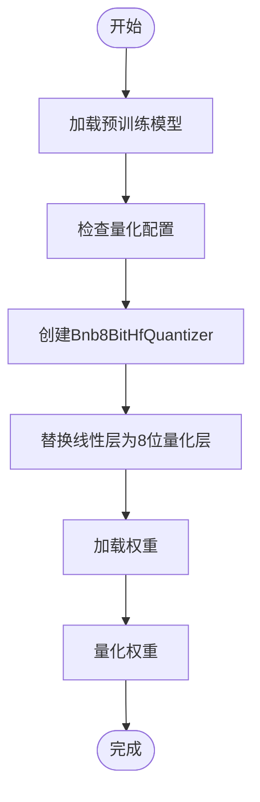
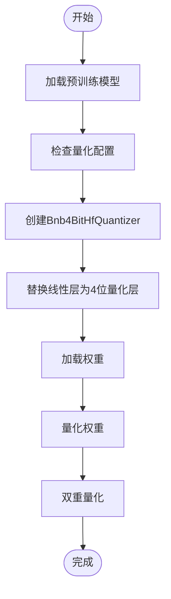
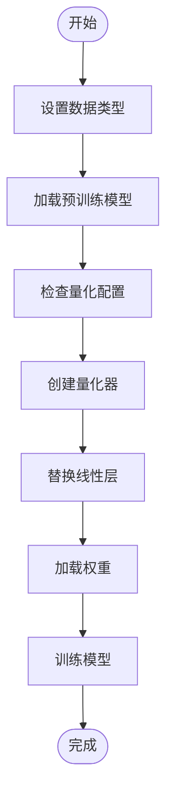
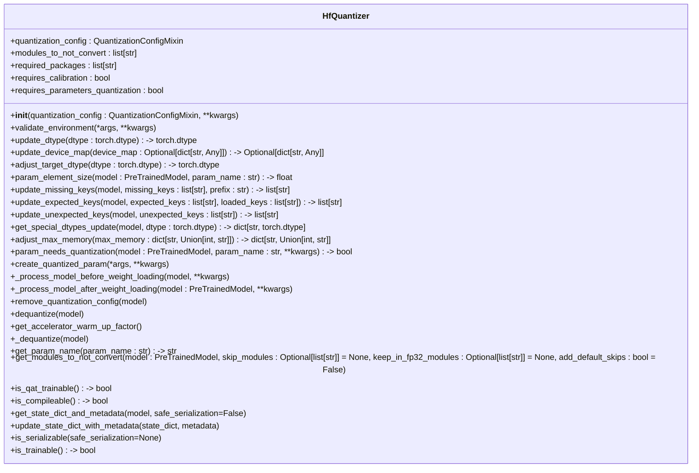
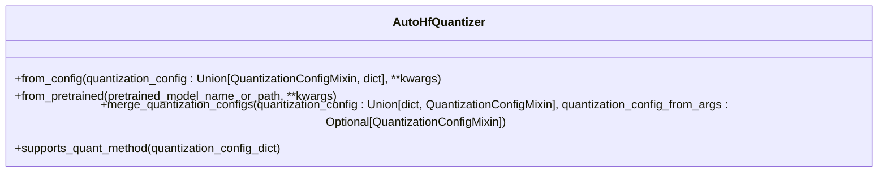

# 模型量化优化

<cite>
**本文档中引用的文件**   
- [quantization_config.py](file://src/transformers/utils/quantization_config.py)
- [base.py](file://src/transformers/quantizers/base.py)
- [auto.py](file://src/transformers/quantizers/auto.py)
- [quantizer_bnb_8bit.py](file://src/transformers/quantizers/quantizer_bnb_8bit.py)
- [quantizer_bnb_4bit.py](file://src/transformers/quantizers/quantizer_bnb_4bit.py)
- [quantizer_gptq.py](file://src/transformers/quantizers/quantizer_gptq.py)
- [quantizer_awq.py](file://src/transformers/quantizers/quantizer_awq.py)
- [quantizer_quanto.py](file://src/transformers/quantizers/quantizer_quanto.py)
- [quantizer_hqq.py](file://src/transformers/quantizers/quantizer_hqq.py)
- [quantizer_fbgemm_fp8.py](file://src/transformers/quantizers/quantizer_fbgemm_fp8.py)
- [custom_quantization.py](file://examples/quantization/custom_quantization.py)
- [custom_quantization_int8_example.py](file://examples/quantization/custom_quantization_int8_example.py)
</cite>

## 目录
1. [引言](#引言)
2. [量化方法详解](#量化方法详解)
3. [量化器架构设计](#量化器架构设计)
4. [量化配置指南](#量化配置指南)
5. [硬件平台优化效果](#硬件平台优化效果)
6. [常见问题诊断与解决方案](#常见问题诊断与解决方案)
7. [应用场景建议](#应用场景建议)
8. [结论](#结论)

## 引言

模型量化是深度学习模型优化的关键技术，通过降低模型权重和激活值的数值精度来减少模型大小和计算需求，从而提高推理效率。在transformers库中，提供了多种量化方法的实现，支持从8位到4位甚至更低精度的量化。这些量化技术不仅能够显著减少模型的内存占用，还能在保持较高精度的同时大幅提升推理速度。

transformers库中的量化功能主要通过`src/transformers/quantizers/`目录下的模块实现，这些模块提供了统一的接口和灵活的配置选项，使得用户可以轻松地将量化技术应用于各种预训练模型。量化器的设计遵循了模块化和可扩展的原则，支持多种量化算法和硬件平台。

**Section sources**
- [base.py](file://src/transformers/quantizers/base.py#L1-L406)
- [auto.py](file://src/transformers/quantizers/auto.py#L1-L334)

## 量化方法详解

### 8位量化

8位量化是最早被广泛采用的量化方法之一，它将模型的权重从32位浮点数转换为8位整数。这种方法能够在保持较高精度的同时显著减少模型大小和计算量。在transformers库中，8位量化主要通过bitsandbytes库实现，具体由`Bnb8BitHfQuantizer`类负责。

8位量化的核心思想是利用8位整数表示权重，同时保留一些关键的缩放因子（scale factors）来恢复原始的数值范围。这种方法特别适用于大规模语言模型，因为它可以在不显著牺牲性能的情况下大幅降低内存需求。

**Diagram sources**
- [quantizer_bnb_8bit.py](file://src/transformers/quantizers/quantizer_bnb_8bit.py#L1-L241)

### 4位量化

4位量化进一步降低了模型的精度，将权重从32位浮点数转换为4位整数。这种方法能够更大幅度地减少模型大小和计算需求，但可能会导致一定的精度损失。在transformers库中，4位量化同样通过bitsandbytes库实现，具体由`Bnb4BitHfQuantizer`类负责。

4位量化使用了更复杂的量化策略，如NF4（Normalized Float 4）和FP4（Float Point 4），这些策略能够在有限的位数内更好地保留权重的分布特性。此外，4位量化还支持双重量化（double quantization），即对量化后的缩放因子再次进行量化，以进一步压缩模型。

**Diagram sources**
- [quantizer_bnb_4bit.py](file://src/transformers/quantizers/quantizer_bnb_4bit.py#L1-L308)

### 混合精度训练

混合精度训练是一种结合了高精度和低精度计算的技术，旨在提高训练效率的同时保持模型的精度。在transformers库中，混合精度训练可以通过设置不同的数据类型（dtype）来实现，例如使用`torch.float16`或`torch.bfloat16`进行计算，而保持某些关键参数为`torch.float32`。

混合精度训练的优势在于它能够在不显著增加内存消耗的情况下加速训练过程。通过合理选择哪些参数需要保持高精度，可以有效地平衡计算效率和模型性能。

**Diagram sources**
- [quantizer_bnb_8bit.py](file://src/transformers/quantizers/quantizer_bnb_8bit.py#L1-L241)
- [quantizer_bnb_4bit.py](file://src/transformers/quantizers/quantizer_bnb_4bit.py#L1-L308)

## 量化器架构设计

### 量化器基类

在transformers库中，所有量化器都继承自`HfQuantizer`基类。这个基类定义了量化器的基本接口和通用功能，确保了不同量化方法之间的兼容性和一致性。`HfQuantizer`类的主要职责包括：

- **量化配置管理**：处理量化配置参数，确保配置的正确性和完整性。
- **环境验证**：检查必要的依赖库是否已安装，以及硬件环境是否满足要求。
- **模型预处理**：在加载权重之前，对模型进行必要的修改，如替换线性层。
- **权重加载**：处理量化权重的加载和转换。
- **后处理**：在权重加载完成后，进行必要的清理和优化。

**Diagram sources**
- [base.py](file://src/transformers/quantizers/base.py#L1-L406)

### 自动量化器

`AutoHfQuantizer`类是transformers库中用于自动选择和实例化适当量化器的工厂类。它根据提供的量化配置自动选择合适的量化器实现。`AutoHfQuantizer`通过`AUTO_QUANTIZER_MAPPING`字典维护了量化方法与其对应量化器类的映射关系。

**Diagram sources**
- [auto.py](file://src/transformers/quantizers/auto.py#L1-L334)

## 量化配置指南

### 量化策略选择

选择合适的量化策略是成功应用量化技术的关键。不同的量化方法适用于不同的场景和需求。以下是一些常见的量化策略及其适用场景：

- **8位量化**：适用于大多数大规模语言模型，能够在保持较高精度的同时显著减少内存占用。
- **4位量化**：适用于资源受限的环境，如移动设备或边缘计算，能够进一步减少模型大小和计算需求。
- **混合精度训练**：适用于需要高效训练的场景，能够在不显著增加内存消耗的情况下加速训练过程。

### 精度损失评估

量化过程中不可避免地会引入一定的精度损失。为了评估量化后的模型性能，可以采用以下几种方法：

- **基准测试**：使用标准的基准数据集（如GLUE、SQuAD等）进行测试，比较量化前后模型的性能差异。
- **任务特定评估**：针对具体的应用场景设计评估指标，如生成任务中的BLEU分数、分类任务中的准确率等。
- **用户反馈**：收集实际用户的反馈，了解量化模型在真实环境中的表现。

### 性能提升预期

量化技术能够带来显著的性能提升，具体效果取决于模型的大小、硬件平台和量化方法。一般来说，8位量化可以将模型大小减少约75%，而4位量化可以进一步减少到原来的1/8。在推理速度方面，量化模型通常比原始模型快2-3倍。

## 硬件平台优化效果

### GPU

在GPU上，量化技术能够显著提高推理速度和内存效率。特别是对于大规模语言模型，8位和4位量化可以大幅减少显存占用，使得更大的模型能够在单个GPU上运行。此外，现代GPU（如NVIDIA A100）支持FP8格式，进一步提升了量化模型的性能。

### CPU

在CPU上，量化技术同样能够带来显著的性能提升。通过使用Intel的IPEX（Intel Extension for PyTorch）等优化库，可以在CPU上实现高效的4位量化推理。这对于没有GPU资源的用户来说是一个重要的选择。

### 边缘设备

在边缘设备上，量化技术尤为重要。由于边缘设备的计算资源和内存都非常有限，4位量化和混合精度训练成为实现高效推理的关键。通过量化，可以在保持较高精度的同时，使模型在低功耗设备上运行。

## 常见问题诊断与解决方案

### 量化后精度下降过多

如果量化后的模型精度显著下降，可以尝试以下几种解决方案：

- **调整量化参数**：尝试不同的量化配置，如改变组大小（group size）、对称性（symmetry）等。
- **使用更高级的量化方法**：考虑使用AWQ（Activation-aware Weight Quantization）等更先进的量化技术。
- **微调量化模型**：在量化后对模型进行少量的微调，以恢复部分丢失的精度。

### 兼容性问题

在使用量化模型时，可能会遇到与某些库或框架的兼容性问题。解决这些问题的方法包括：

- **更新依赖库**：确保所有相关的库（如bitsandbytes、accelerate等）都是最新版本。
- **检查硬件支持**：确认目标硬件是否支持所使用的量化格式，如FP8需要H100等高端GPU。
- **使用官方支持的模型**：优先选择官方支持的量化模型，这些模型经过了充分的测试和优化。

## 应用场景建议

### 移动端部署

在移动端部署时，应优先考虑4位量化和混合精度训练。这些技术能够在保持较高精度的同时，最大限度地减少模型大小和计算需求。此外，可以利用TensorFlow Lite或ONNX等工具将量化模型转换为适合移动设备的格式。

### 大规模推理服务

在大规模推理服务中，8位量化是一个理想的选择。它能够在保持较高精度的同时，显著减少服务器的内存占用和计算成本。对于需要极高吞吐量的场景，可以考虑使用FP8格式和专用硬件（如H100）来进一步提升性能。

## 结论

模型量化是深度学习模型优化的重要手段，能够在保持较高精度的同时显著减少模型大小和计算需求。transformers库提供了丰富的量化方法和灵活的配置选项，使得用户可以轻松地将量化技术应用于各种预训练模型。通过合理选择量化策略、评估精度损失和优化硬件平台，可以实现高效的模型部署和推理。