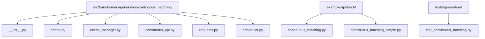
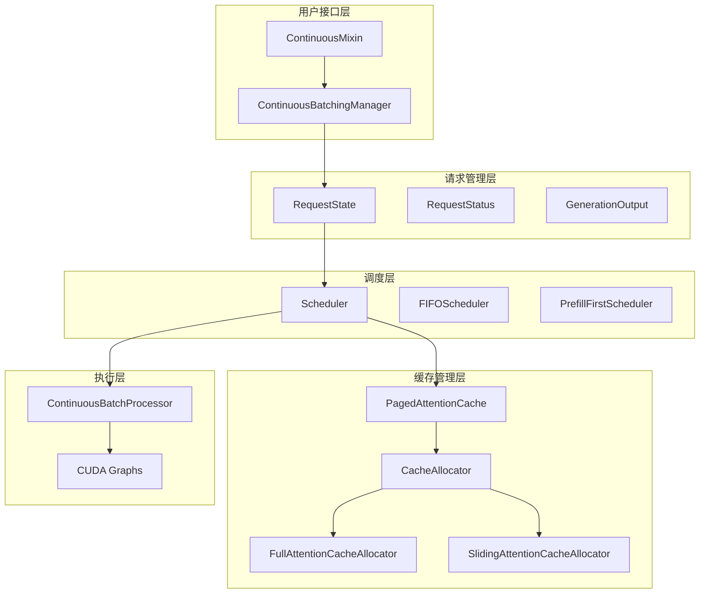
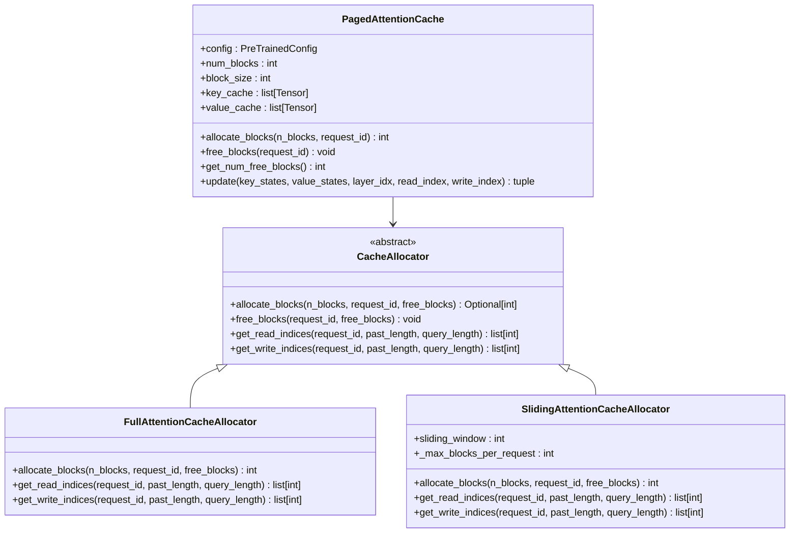
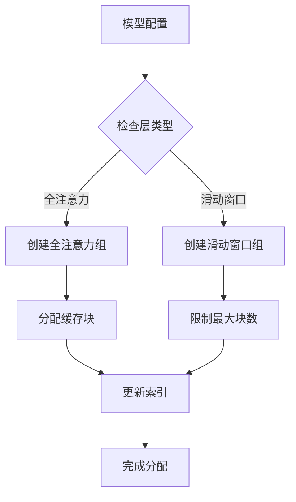
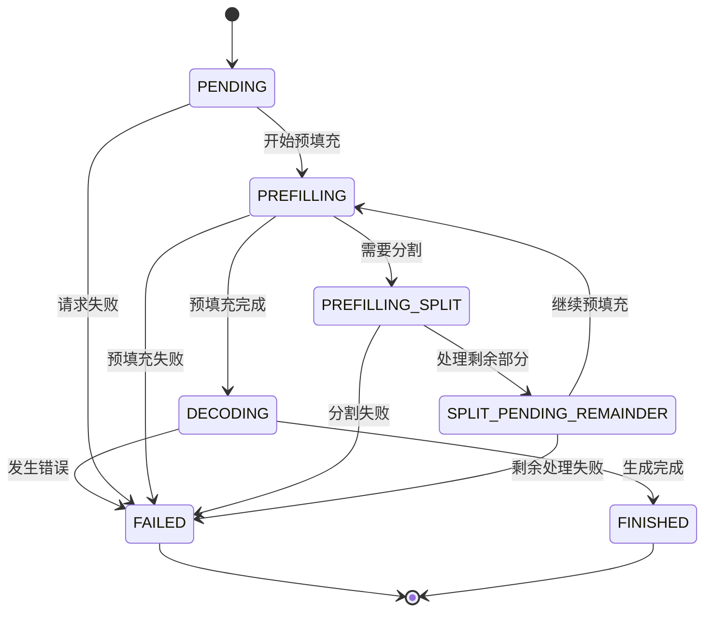
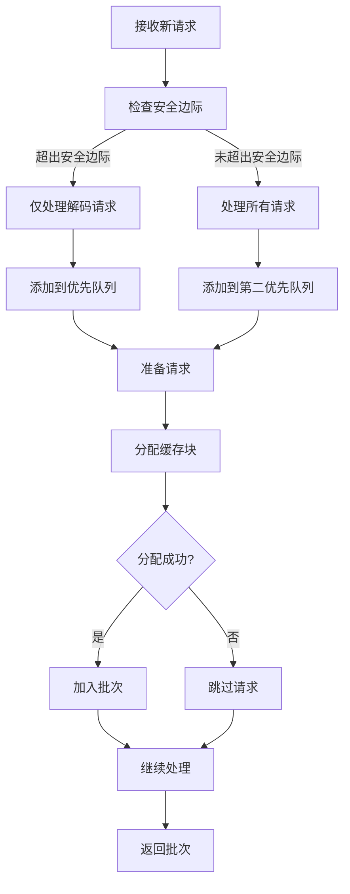
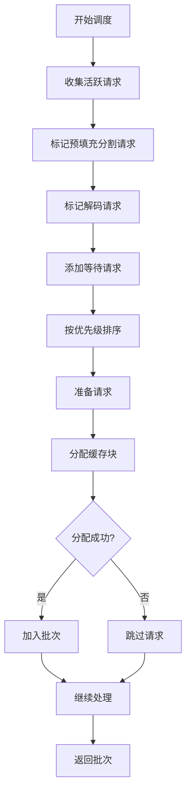
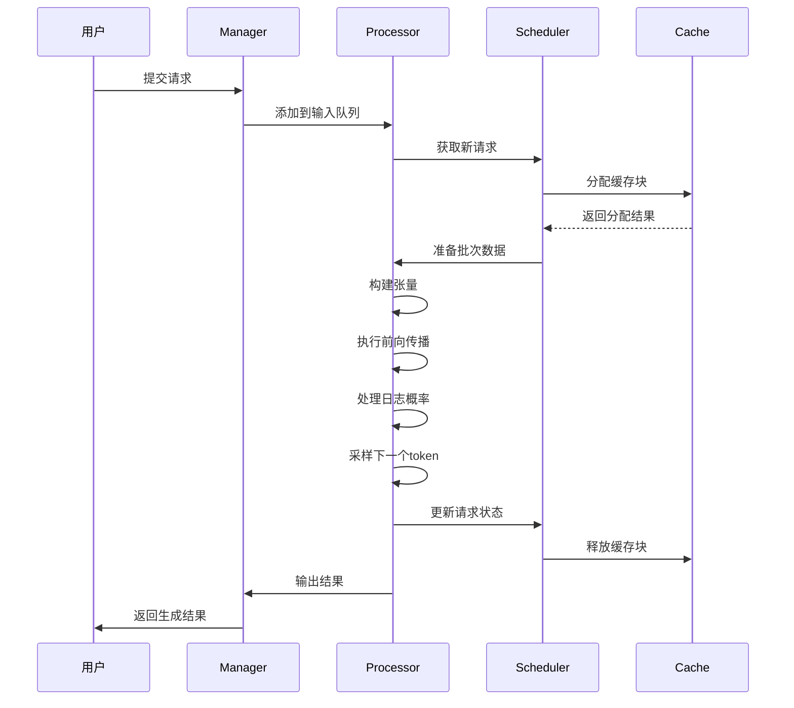

# 连续批处理优化

<cite>
**本文档中引用的文件**
- [continuous_batching.py](file://examples/pytorch/continuous_batching.py)
- [continuous_batching_simple.py](file://examples/pytorch/continuous_batching_simple.py)
- [cache.py](file://src/transformers/generation/continuous_batching/cache.py)
- [cache_manager.py](file://src/transformers/generation/continuous_batching/cache_manager.py)
- [requests.py](file://src/transformers/generation/continuous_batching/requests.py)
- [continuous_api.py](file://src/transformers/generation/continuous_batching/continuous_api.py)
- [scheduler.py](file://src/transformers/generation/continuous_batching/scheduler.py)
- [__init__.py](file://src/transformers/generation/continuous_batching/__init__.py)
- [test_continuous_batching.py](file://tests/generation/test_continuous_batching.py)
</cite>

## 目录
1. [简介](#简介)
2. [项目结构](#项目结构)
3. [核心组件](#核心组件)
4. [架构概览](#架构概览)
5. [详细组件分析](#详细组件分析)
6. [配置参数详解](#配置参数详解)
7. [性能调优指南](#性能调优指南)
8. [故障排除](#故障排除)
9. [应用场景配置](#应用场景配置)
10. [总结](#总结)

## 简介

连续批处理（Continuous Batching）是transformers库中的一项高级功能，旨在通过动态批处理技术显著提升大语言模型的推理性能。该系统能够同时处理多个并发请求，通过智能的缓存管理和调度策略，在保证服务质量的同时最大化吞吐量。

连续批处理的核心优势包括：
- **高吞吐量**：通过动态批处理减少GPU空闲时间
- **低延迟**：智能调度确保关键请求优先处理
- **内存效率**：分页注意力缓存优化内存使用
- **可扩展性**：支持大规模并发请求处理

## 项目结构

连续批处理功能主要位于以下目录结构中：



**图表来源**
- [__init__.py](file://src/transformers/generation/continuous_batching/__init__.py#L1-L27)
- [continuous_batching.py](file://examples/pytorch/continuous_batching.py#L1-L50)

**章节来源**
- [__init__.py](file://src/transformers/generation/continuous_batching/__init__.py#L1-L27)
- [continuous_batching.py](file://examples/pytorch/continuous_batching.py#L1-L302)

## 核心组件

连续批处理系统由以下核心组件构成：

### 缓存管理系统
- **PagedAttentionCache**：实现分页注意力缓存，优化内存使用
- **CacheAllocator**：抽象基类，定义缓存分配策略
- **FullAttentionCacheAllocator**：全注意力层缓存管理
- **SlidingAttentionCacheAllocator**：滑动窗口注意力缓存管理

### 请求管理系统
- **RequestState**：跟踪请求生命周期状态
- **RequestStatus**：定义请求状态枚举
- **GenerationOutput**：存储生成输出结果

### 调度系统
- **Scheduler**：抽象基类，定义调度策略
- **FIFOScheduler**：先进先出调度器
- **PrefillFirstScheduler**：预填充优先调度器

**章节来源**
- [cache.py](file://src/transformers/generation/continuous_batching/cache.py#L1-L100)
- [requests.py](file://src/transformers/generation/continuous_batching/requests.py#L1-L100)
- [scheduler.py](file://src/transformers/generation/continuous_batching/scheduler.py#L1-L100)

## 架构概览

连续批处理系统采用多层架构设计，实现了高效的请求管理和资源调度：



**图表来源**
- [continuous_api.py](file://src/transformers/generation/continuous_batching/continuous_api.py#L1-L100)
- [cache.py](file://src/transformers/generation/continuous_batching/cache.py#L1-L100)
- [scheduler.py](file://src/transformers/generation/continuous_batching/scheduler.py#L1-L100)

## 详细组件分析

### 分页注意力缓存系统

分页注意力缓存是连续批处理的核心组件，通过将缓存分组管理来优化内存使用和访问效率：



**图表来源**
- [cache.py](file://src/transformers/generation/continuous_batching/cache.py#L50-L200)
- [cache_manager.py](file://src/transformers/generation/continuous_batching/cache_manager.py#L15-L100)

#### 缓存分组机制

系统根据注意力类型对层进行分组，以减少缓存碎片化：



**图表来源**
- [cache.py](file://src/transformers/generation/continuous_batching/cache.py#L25-L50)

**章节来源**
- [cache.py](file://src/transformers/generation/continuous_batching/cache.py#L50-L300)
- [cache_manager.py](file://src/transformers/generation/continuous_batching/cache_manager.py#L15-L223)

### 请求状态管理

请求状态管理系统跟踪每个请求的完整生命周期：



**图表来源**
- [requests.py](file://src/transformers/generation/continuous_batching/requests.py#L40-L60)

**章节来源**
- [requests.py](file://src/transformers/generation/continuous_batching/requests.py#L40-L206)

### 调度策略

系统提供了多种调度策略以适应不同的工作负载需求：

#### FIFO调度器
按请求到达顺序处理，优先考虑解码请求：



**图表来源**
- [scheduler.py](file://src/transformers/generation/continuous_batching/scheduler.py#L154-L270)

#### 预填充优先调度器
优先处理需要预填充分割的请求：



**图表来源**
- [scheduler.py](file://src/transformers/generation/continuous_batching/scheduler.py#L270-L300)

**章节来源**
- [scheduler.py](file://src/transformers/generation/continuous_batching/scheduler.py#L154-L300)

### 批处理执行引擎

连续批处理执行引擎负责协调整个批处理流程：



**图表来源**
- [continuous_api.py](file://src/transformers/generation/continuous_batching/continuous_api.py#L200-L400)

**章节来源**
- [continuous_api.py](file://src/transformers/generation/continuous_batching/continuous_api.py#L200-L800)

## 配置参数详解

### 基本配置参数

连续批处理提供了丰富的配置选项来优化性能：

| 参数名称 | 类型 | 默认值 | 描述 |
|---------|------|--------|------|
| `num_blocks` | int | 自动计算 | 缓存块数量 |
| `block_size` | int | 32 | 每个缓存块的大小 |
| `max_batch_tokens` | int | 自动计算 | 最大批处理令牌数 |
| `max_memory` | float | 0.9 | 最大内存使用百分比 |
| `use_cuda_graph` | bool | 自动检测 | 是否使用CUDA图 |
| `manual_eviction` | bool | False | 是否手动驱逐缓存 |

### 高级配置参数

| 参数名称 | 类型 | 默认值 | 描述 |
|---------|------|--------|------|
| `num_q_cuda_graphs` | int | 4 | 查询维度CUDA图数量 |
| `num_kv_cuda_graphs` | int | 8 | 键值维度CUDA图数量 |
| `safety_margin` | float | 0.2 | 安全边际比例 |
| `max_queue_size` | int | 0 | 最大请求队列大小 |
| `retain_cache_on_finish` | bool | False | 完成后保留缓存 |

### 性能相关参数

| 参数名称 | 类型 | 默认值 | 描述 |
|---------|------|--------|------|
| `prefill_chunk_size` | int | None | 预填充块大小 |
| `compile_config` | CompileConfig | None | 编译配置 |
| `disable_compile` | bool | False | 禁用自动编译 |

**章节来源**
- [continuous_batching.py](file://examples/pytorch/continuous_batching.py#L250-L302)
- [continuous_api.py](file://src/transformers/generation/continuous_batching/continuous_api.py#L700-L800)

## 性能调优指南

### 吞吐量优化策略

#### 1. 缓存配置优化
```python
# 推荐配置：最大化缓存利用率
generation_config = GenerationConfig(
    num_blocks=512,              # 根据可用内存调整
    max_batch_tokens=2048,       # 平衡延迟和吞吐量
    max_memory=0.9,              # 保留内存空间
    block_size=32,               # 典型值，可根据模型调整
)
```

#### 2. CUDA图优化
```python
# 启用CUDA图以减少开销
generation_config = GenerationConfig(
    use_cuda_graph=True,
    num_q_cuda_graphs=4,         # 查询维度分段数
    num_kv_cuda_graphs=8,        # 键值维度分段数
)
```

#### 3. 调度策略选择
```python
# 对于高吞吐量场景
manager = model.init_continuous_batching(
    generation_config=generation_config,
    scheduler_type="fifo",       # FIFO调度器适合高吞吐量
    safety_margin=0.1,           # 更积极的缓存利用
)

# 对于低延迟场景
manager = model.init_continuous_batching(
    generation_config=generation_config,
    scheduler_type="prefill_first",  # 优先处理预填充
)
```

### 延迟优化策略

#### 1. 安全边际调整
```python
# 降低安全边际以提高吞吐量
scheduler = FIFOScheduler(
    cache=cache,
    safety_margin=0.05,  # 仅保留5%的安全边际
)
```

#### 2. 动态批处理大小
```python
# 根据负载动态调整批处理大小
def adaptive_batch_size(current_load):
    if current_load < 0.5:
        return 1024
    elif current_load < 0.8:
        return 512
    else:
        return 256
```

#### 3. 请求优先级管理
```python
# 实现请求优先级队列
class PriorityScheduler(Scheduler):
    def __init__(self, *args, **kwargs):
        super().__init__(*args, **kwargs)
        self.priority_queue = PriorityQueue()
    
    def schedule_batch(self, token_budget):
        # 根据优先级排序请求
        sorted_requests = sorted(
            self.waiting_requests.values(),
            key=lambda r: r.priority,
            reverse=True
        )
        
        # 按优先级处理请求
        for req in sorted_requests:
            if token_budget <= 0:
                break
            # 处理逻辑...
```

### 内存优化策略

#### 1. 缓存回收策略
```python
# 启用手动缓存回收
manager = model.init_continuous_batching(
    generation_config=generation_config,
    manual_eviction=True,
)

# 手动回收特定请求的缓存
manager.evict_request_from_cache(request_id)
```

#### 2. 分层缓存管理
```python
# 针对不同模型特性优化缓存
if hasattr(model.config, 'sliding_window'):
    # 滑动窗口模型使用专门的缓存配置
    generation_config = GenerationConfig(
        num_blocks=256,  # 滑动窗口模型通常需要更少的缓存
        max_batch_tokens=1024,
    )
else:
    # 全注意力模型使用更大缓存
    generation_config = GenerationConfig(
        num_blocks=1024,
        max_batch_tokens=4096,
    )
```

**章节来源**
- [continuous_batching.py](file://examples/pytorch/continuous_batching.py#L200-L302)
- [scheduler.py](file://src/transformers/generation/continuous_batching/scheduler.py#L154-L200)

## 故障排除

### 常见问题诊断

#### 1. 请求堆积问题

**症状**：请求队列持续增长，响应时间增加

**诊断步骤**：
```python
# 检查当前状态
print(f"活跃请求: {len(manager.batch_processor.scheduler.active_requests)}")
print(f"等待请求: {len(manager.batch_processor.scheduler.waiting_requests)}")
print(f"空闲块数: {manager.batch_processor.cache.get_num_free_blocks()}")
```

**解决方案**：
```python
# 增加批处理大小或减少安全边际
generation_config = GenerationConfig(
    max_batch_tokens=4096,  # 增加批处理大小
    safety_margin=0.1,      # 降低安全边际
)

# 或者启用手动缓存回收
manager = model.init_continuous_batching(
    generation_config=generation_config,
    manual_eviction=True,
)
```

#### 2. 缓存命中率低

**症状**：频繁的缓存分配失败

**诊断方法**：
```python
# 监控缓存使用情况
def monitor_cache_usage(cache):
    total_blocks = cache.num_blocks
    free_blocks = cache.get_num_free_blocks()
    usage_rate = (total_blocks - free_blocks) / total_blocks
    
    print(f"缓存使用率: {usage_rate:.2%}")
    print(f"总块数: {total_blocks}")
    print(f"空闲块数: {free_blocks}")
    
    return usage_rate
```

**解决方案**：
```python
# 调整缓存大小
generation_config = GenerationConfig(
    num_blocks=2048,        # 增加缓存块数量
    max_memory=0.8,         # 降低内存使用上限
)

# 或优化请求生命周期
manager = model.init_continuous_batching(
    generation_config=generation_config,
    retain_cache_on_finish=True,  # 保留已完成请求的缓存
)
```

#### 3. 内存不足错误

**症状**：出现CUDA内存不足异常

**诊断命令**：
```bash
# 检查GPU内存使用
nvidia-smi

# 监控Python进程内存使用
import psutil
import torch
print(f"GPU内存使用: {torch.cuda.memory_allocated() / 1e9:.2f} GB")
print(f"系统内存使用: {psutil.virtual_memory().percent}%")
```

**解决方案**：
```python
# 减少批处理大小和缓存大小
generation_config = GenerationConfig(
    max_batch_tokens=512,   # 减少批处理令牌数
    num_blocks=128,         # 减少缓存块数量
    max_memory=0.7,         # 降低内存使用上限
)

# 启用梯度检查点
model.gradient_checkpointing_enable()
```

#### 4. 性能下降问题

**症状**：吞吐量低于预期

**诊断流程**：
```python
# 性能基准测试
import time
start_time = time.time()
results = model.generate_batch(inputs=test_inputs, generation_config=config)
end_time = time.time()

throughput = len(test_inputs) / (end_time - start_time)
print(f"吞吐量: {throughput:.2f} 请求/秒")
```

**优化方案**：
```python
# 启用编译优化
model = torch.compile(model, mode="max-autotune")

# 优化CUDA图配置
generation_config = GenerationConfig(
    use_cuda_graph=True,
    num_q_cuda_graphs=2,    # 减少查询图数量
    num_kv_cuda_graphs=4,   # 减少键值图数量
)
```

### 调试工具和监控

#### 1. 日志配置
```python
import logging
logging.getLogger("transformers.generation.continuous_batching").setLevel(logging.DEBUG)
```

#### 2. 性能指标监控
```python
# 使用内置指标系统
from transformers.utils.metrics import ContinuousBatchProcessorMetrics

metrics = ContinuousBatchProcessorMetrics(max_batch_tokens=2048)
# 在批处理过程中记录指标
metrics.record_batch_metrics(requests_in_batch)
metrics.record_kv_cache_memory_metrics(cache)
```

#### 3. 内存泄漏检测
```python
# 定期检查内存使用
def monitor_memory_leak():
    initial_memory = torch.cuda.memory_allocated()
    
    # 执行一段时间的批处理
    for _ in range(100):
        # 批处理操作...
        pass
    
    final_memory = torch.cuda.memory_allocated()
    
    if final_memory > initial_memory * 1.1:  # 内存增长超过10%
        print("警告: 可能存在内存泄漏")
```

**章节来源**
- [continuous_api.py](file://src/transformers/generation/continuous_batching/continuous_api.py#L400-L600)
- [requests.py](file://src/transformers/generation/continuous_batching/requests.py#L150-L206)

## 应用场景配置

### 聊天机器人应用

聊天机器人需要低延迟和高并发处理能力：

```python
# 聊天机器人优化配置
chat_config = GenerationConfig(
    max_new_tokens=100,           # 限制回复长度
    max_batch_tokens=512,         # 适中的批处理大小
    use_cuda_graph=True,          # 启用CUDA图
    safety_margin=0.15,           # 适度的安全边际
    do_sample=True,               # 启用采样
    temperature=0.7,              # 控制创造性
    top_p=0.9,                    # 核采样
)

# 使用优先级调度
manager = model.init_continuous_batching(
    generation_config=chat_config,
    scheduler_type="prefill_first",  # 优先处理新请求
)
```

### 实时翻译服务

实时翻译需要平衡延迟和质量：

```python
# 实时翻译配置
translation_config = GenerationConfig(
    max_new_tokens=200,           # 翻译通常需要较长输出
    max_batch_tokens=1024,        # 较大的批处理
    use_cuda_graph=True,          # 启用CUDA图
    num_q_cuda_graphs=2,          # 减少查询图
    num_kv_cuda_graphs=4,         # 减少键值图
    safety_margin=0.2,            # 较大的安全边际
    do_sample=False,              # 确定性生成
)

# 使用FIFO调度器
manager = model.init_continuous_batching(
    generation_config=translation_config,
    scheduler_type="fifo",
)
```

### 批量文本生成

批量处理大量文档时追求最高吞吐量：

```python
# 批量生成配置
batch_config = GenerationConfig(
    max_new_tokens=500,           # 生成较长文本
    max_batch_tokens=4096,        # 最大批处理大小
    use_cuda_graph=True,          # 启用CUDA图
    num_q_cuda_graphs=1,          # 最少查询图
    num_kv_cuda_graphs=2,         # 最少键值图
    safety_margin=0.05,           # 积极的缓存利用
    do_sample=False,              # 确定性生成
)

# 使用FIFO调度器最大化吞吐量
manager = model.init_continuous_batching(
    generation_config=batch_config,
    scheduler_type="fifo",
    manual_eviction=True,         # 启用手动缓存回收
)
```

### 多模态应用

处理图像和文本混合输入的应用：

```python
# 多模态应用配置
multimodal_config = GenerationConfig(
    max_new_tokens=150,           # 图像描述长度
    max_batch_tokens=2048,        # 中等批处理大小
    use_cuda_graph=True,          # 启用CUDA图
    safety_margin=0.25,           # 较大的安全边际
    do_sample=True,               # 启用创造性生成
    temperature=0.8,              # 较高的温度
)

# 特殊的缓存配置
manager = model.init_continuous_batching(
    generation_config=multimodal_config,
    # 多模态可能需要特殊的调度策略
)
```

### 企业级部署

生产环境中的企业级配置：

```python
# 企业级配置
enterprise_config = GenerationConfig(
    max_new_tokens=300,           # 标准输出长度
    max_batch_tokens=2048,        # 平衡性能和资源
    use_cuda_graph=True,          # 启用CUDA图
    num_q_cuda_graphs=2,          # 适度的查询图
    num_kv_cuda_graphs=4,         # 适度的键值图
    safety_margin=0.2,            # 标准安全边际
    max_queue_size=1000,          # 限制队列大小
    do_sample=True,               # 启用采样
    temperature=0.7,
    top_p=0.9,
)

# 生产环境监控
manager = model.init_continuous_batching(
    generation_config=enterprise_config,
    # 启用详细的监控和日志
)

# 设置请求取消机制
def cancel_long_running_requests():
    for request_id in manager.batch_processor.scheduler.active_requests:
        if time.time() - manager.batch_processor.scheduler.active_requests[request_id].created_time > 30:
            manager.batch_processor.scheduler.set_request_cancellation(request_id)
```

**章节来源**
- [continuous_batching.py](file://examples/pytorch/continuous_batching.py#L150-L250)
- [continuous_batching_simple.py](file://examples/pytorch/continuous_batching_simple.py#L50-L110)

## 总结

连续批处理优化是一个复杂但强大的技术，能够显著提升大语言模型的推理性能。通过合理配置缓存策略、调度算法和硬件加速，可以在不同应用场景中实现最佳的性能表现。

### 关键要点

1. **缓存管理**：分页注意力缓存是性能的关键，需要根据模型特性和硬件条件进行优化
2. **调度策略**：FIFO和预填充优先调度器各有优势，应根据具体需求选择
3. **资源配置**：合理的批处理大小、安全边际和CUDA图配置对性能至关重要
4. **监控调试**：建立完善的监控体系有助于及时发现和解决问题

### 最佳实践

- **渐进式优化**：从默认配置开始，逐步调整参数
- **场景适配**：根据不同应用场景选择合适的配置组合
- **持续监控**：建立性能指标监控体系
- **故障预案**：制定详细的故障排除和恢复计划

通过深入理解和正确应用这些优化技术，可以充分发挥连续批处理的优势，在各种实际应用场景中实现高性能的大语言模型推理服务。