# API服务构建

<cite>
**本文档中引用的文件**
- [serve.py](file://src/transformers/cli/serve.py)
- [continuous_batching.py](file://examples/pytorch/continuous_batching.py)
- [continuous_batching_simple.py](file://examples/pytorch/continuous_batching_simple.py)
- [transformers.py](file://src/transformers/cli/transformers.py)
- [benchmark.py](file://benchmark/benchmark.py)
- [docker-compose.yml](file://examples/metrics-monitoring/docker-compose.yml)
- [logging.py](file://src/transformers/utils/logging.py)
</cite>

## 目录
1. [简介](#简介)
2. [项目结构概览](#项目结构概览)
3. [核心组件分析](#核心组件分析)
4. [架构概览](#架构概览)
5. [详细组件分析](#详细组件分析)
6. [连续批处理技术](#连续批处理技术)
7. [RESTful API设计](#restful-api设计)
8. [性能基准测试](#性能基准测试)
9. [错误处理与日志记录](#错误处理与日志记录)
10. [部署与监控](#部署与监控)
11. [最佳实践](#最佳实践)
12. [总结](#总结)

## 简介

本指南基于Hugging Face Transformers库中的`serve.py`命令行工具，详细介绍如何构建高性能的模型推理API服务。该系统支持多种部署模式，包括传统的批处理和先进的连续批处理技术，能够显著提升高并发场景下的吞吐量。

主要特性包括：
- 基于FastAPI的高性能RESTful API服务
- 支持OpenAI兼容的聊天完成、响应和音频转录接口
- 高级连续批处理技术提升并发性能
- 完整的监控和指标收集系统
- 灵活的配置选项和扩展性

## 项目结构概览

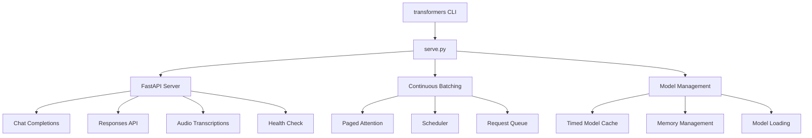

**图表来源**
- [serve.py](file://src/transformers/cli/serve.py#L1-L100)
- [transformers.py](file://src/transformers/cli/transformers.py#L1-L43)

**章节来源**
- [serve.py](file://src/transformers/cli/serve.py#L1-L200)
- [transformers.py](file://src/transformers/cli/transformers.py#L1-L43)

## 核心组件分析

### Serve类核心功能

Serve类是整个API服务的核心控制器，负责管理模型加载、请求处理和服务器生命周期。

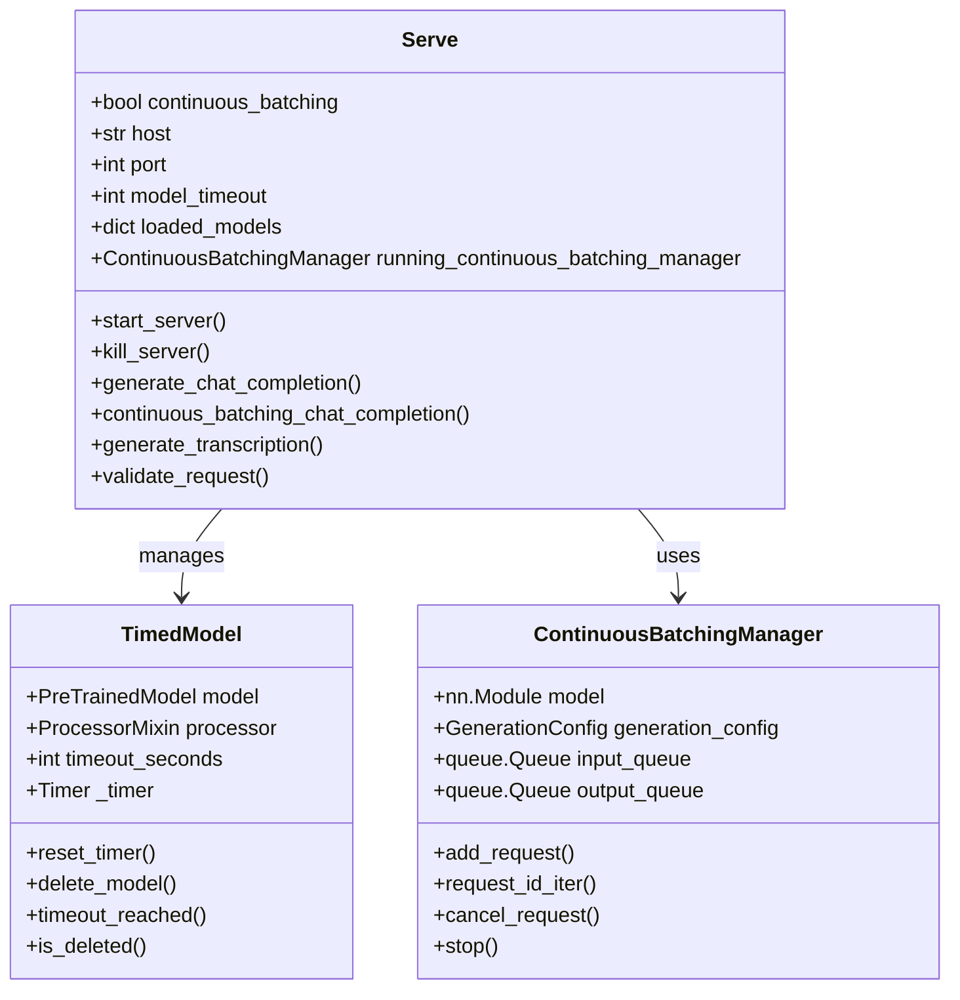

**图表来源**
- [serve.py](file://src/transformers/cli/serve.py#L300-L400)
- [serve.py](file://src/transformers/cli/serve.py#L250-L300)

**章节来源**
- [serve.py](file://src/transformers/cli/serve.py#L300-L500)

## 架构概览

### 系统架构图

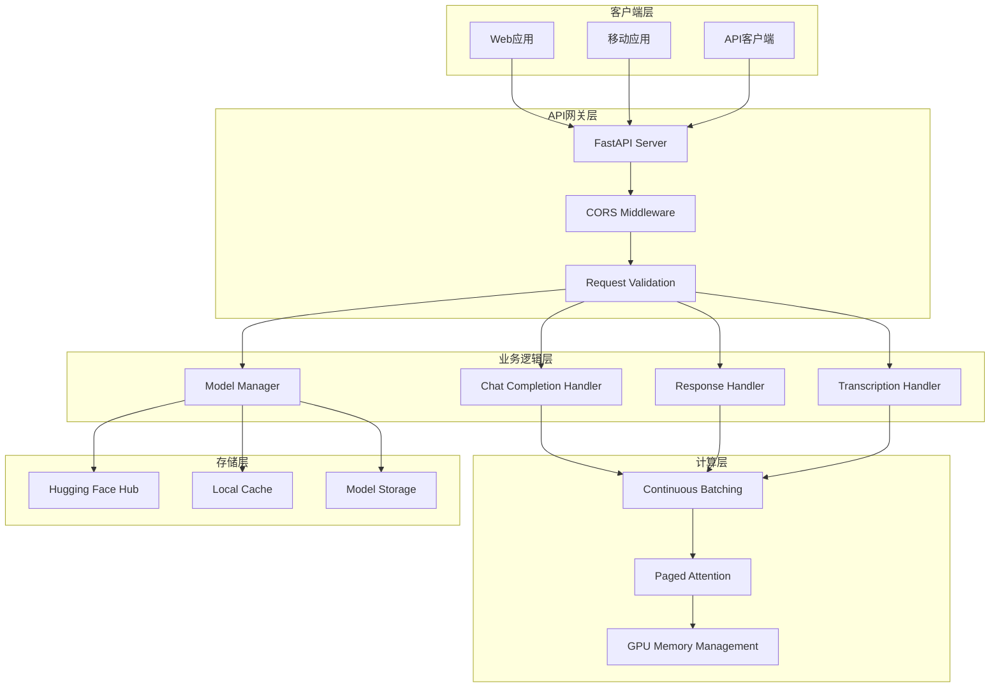

**图表来源**
- [serve.py](file://src/transformers/cli/serve.py#L470-L520)
- [serve.py](file://src/transformers/cli/serve.py#L800-L900)

## 详细组件分析

### FastAPI端点实现

系统提供了四个主要的API端点，每个都针对特定的用例进行了优化。

#### 聊天完成端点

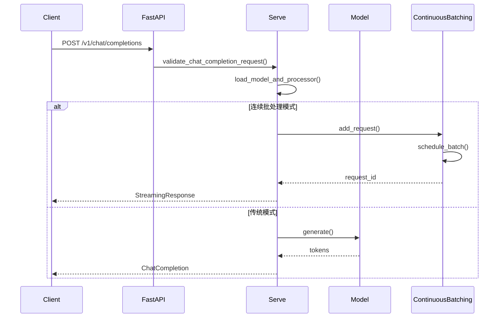

**图表来源**
- [serve.py](file://src/transformers/cli/serve.py#L768-L850)
- [serve.py](file://src/transformers/cli/serve.py#L850-L950)

#### 响应API端点

响应API提供了更灵活的交互方式，支持流式和非流式响应。

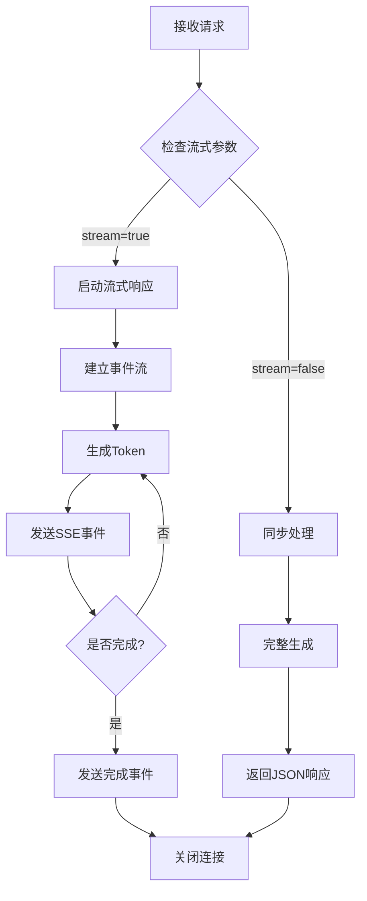

**图表来源**
- [serve.py](file://src/transformers/cli/serve.py#L500-L550)
- [serve.py](file://src/transformers/cli/serve.py#L1280-L1480)

**章节来源**
- [serve.py](file://src/transformers/cli/serve.py#L470-L600)

### 请求验证机制

系统实现了严格的请求验证，确保输入数据的完整性和安全性。

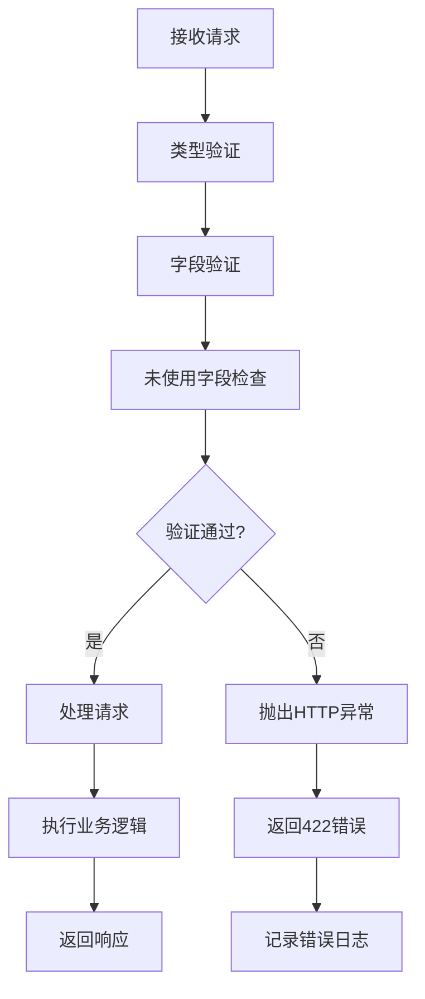

**图表来源**
- [serve.py](file://src/transformers/cli/serve.py#L567-L630)

**章节来源**
- [serve.py](file://src/transformers/cli/serve.py#L567-L662)

## 连续批处理技术

### 技术原理

连续批处理是系统的核心创新，它允许同时处理多个请求，显著提升GPU利用率和整体吞吐量。

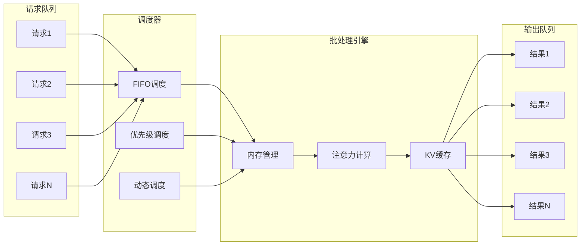

**图表来源**
- [continuous_batching.py](file://examples/pytorch/continuous_batching.py#L1-L100)
- [continuous_batching_simple.py](file://examples/pytorch/continuous_batching_simple.py#L1-L50)

### 性能优势

连续批处理相比传统批处理具有以下优势：

| 特性 | 传统批处理 | 连续批处理 |
|------|------------|------------|
| 并发处理 | 单个批次 | 多个请求并行 |
| 内存效率 | 固定批次大小 | 动态内存分配 |
| 延迟控制 | 批次延迟 | 低延迟响应 |
| 吞吐量 | 受批次限制 | 高并发吞吐 |
| GPU利用率 | 波动较大 | 持续高效 |

**章节来源**
- [continuous_batching.py](file://examples/pytorch/continuous_batching.py#L1-L302)
- [continuous_batching_simple.py](file://examples/pytorch/continuous_batching_simple.py#L1-L110)

## RESTful API设计

### 端点规范

系统遵循RESTful设计原则，提供清晰、一致的API接口。

#### 聊天完成端点

| 属性 | 值 |
|------|-----|
| 方法 | POST |
| 路径 | `/v1/chat/completions` |
| 内容类型 | `application/json` |
| 流式支持 | 是 |
| 认证要求 | 可选 |

请求格式：
```json
{
  "model": "string",
  "messages": [
    {
      "role": "system|user|assistant",
      "content": "string|array"
    }
  ],
  "stream": false,
  "max_tokens": 16,
  "temperature": 1.0,
  "top_p": 1.0
}
```

#### 响应API端点

| 属性 | 值 |
|------|-----|
| 方法 | POST |
| 路径 | `/v1/responses` |
| 内容类型 | `application/json` |
| 流式支持 | 是 |
| 认证要求 | 可选 |

请求格式：
```json
{
  "model": "string",
  "instructions": "string",
  "input": "string",
  "stream": true,
  "max_output_tokens": 100
}
```

#### 音频转录端点

| 属性 | 值 |
|------|-----|
| 方法 | POST |
| 路径 | `/v1/audio/transcriptions` |
| 内容类型 | `multipart/form-data` |
| 流式支持 | 否 |
| 认证要求 | 可选 |

**章节来源**
- [serve.py](file://src/transformers/cli/serve.py#L470-L520)

### GraphQL接口实现

虽然当前版本主要基于RESTful API，但系统架构支持GraphQL扩展：

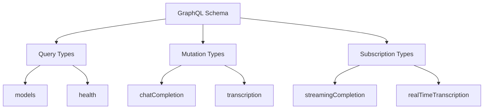

### WebSocket流式响应

系统支持Server-Sent Events (SSE) 实现流式响应：

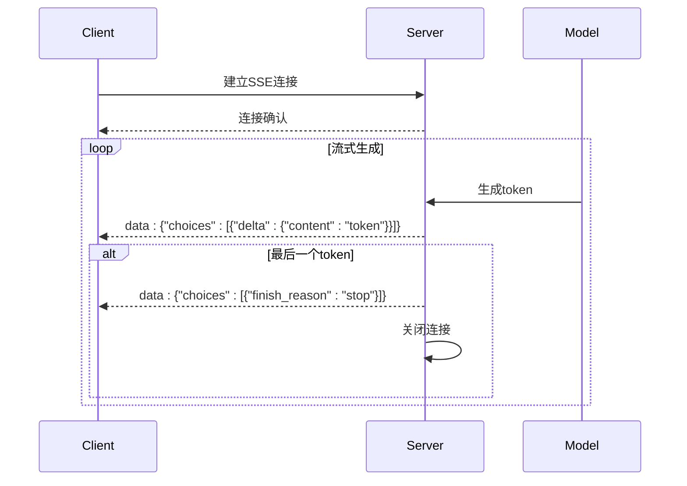

**图表来源**
- [serve.py](file://src/transformers/cli/serve.py#L700-L750)
- [serve.py](file://src/transformers/cli/serve.py#L1300-L1450)

**章节来源**
- [serve.py](file://src/transformers/cli/serve.py#L470-L600)

## 性能基准测试

### 基准测试框架

系统集成了完整的性能测试框架，支持多维度的性能评估。

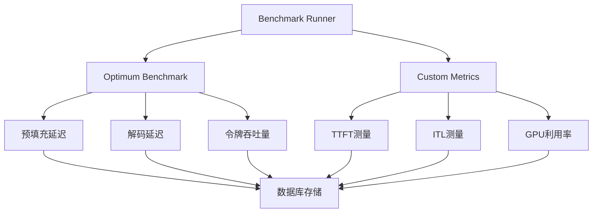

**图表来源**
- [benchmark.py](file://benchmark/benchmark.py#L1-L100)

### 负载测试策略

#### 压力测试配置

| 参数 | 推荐值 | 说明 |
|------|--------|------|
| 并发用户数 | 100-1000 | 根据硬件配置调整 |
| 测试持续时间 | 5-30分钟 | 确保稳定状态 |
| 请求频率 | 1-10 QPS | 渐进式增加负载 |
| 批次大小 | 1-32 | 根据内存容量调整 |

#### 性能指标监控

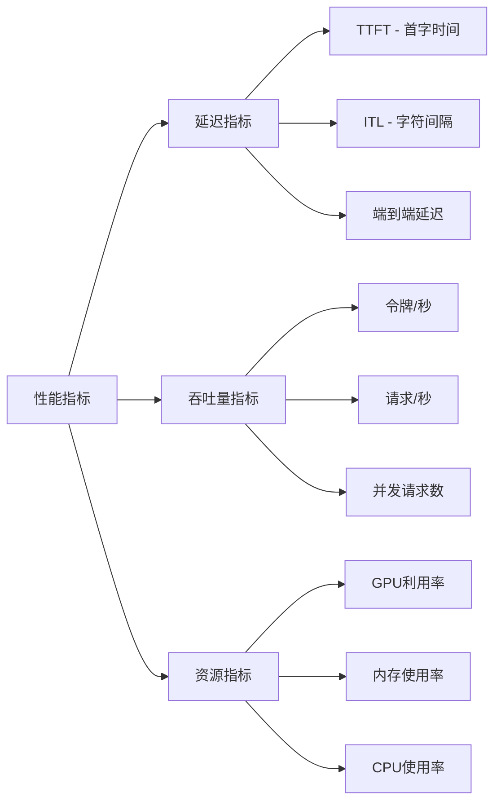

**章节来源**
- [benchmark.py](file://benchmark/benchmark.py#L1-L325)

### 响应时间优化技巧

#### 缓存策略

1. **模型缓存**：自动管理模型内存，超时后自动卸载
2. **KV缓存**：复用键值对缓存减少重复计算
3. **处理器缓存**：缓存tokenizer和processor实例

#### 优化配置

```python
# 推荐的优化配置
generation_config = GenerationConfig(
    max_new_tokens=512,
    use_cache=True,
    do_sample=True,
    temperature=0.8,
    top_p=0.9,
    num_blocks=369,  # 根据GPU内存调整
    max_batch_tokens=23  # 批次令牌限制
)
```

## 错误处理与日志记录

### 错误处理机制

系统实现了多层次的错误处理和恢复机制：

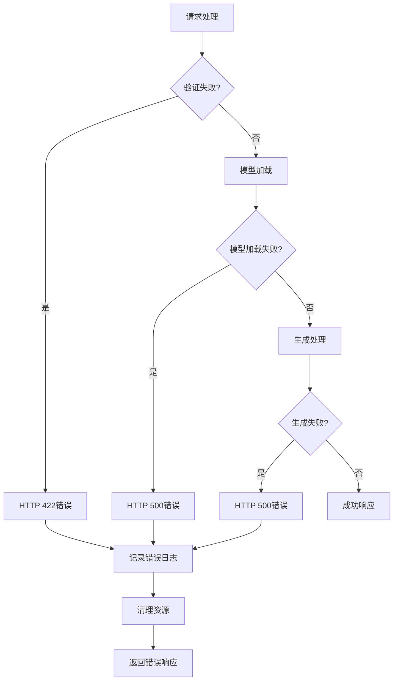

**图表来源**
- [serve.py](file://src/transformers/cli/serve.py#L567-L630)

### 日志记录系统

系统采用分层的日志记录架构：

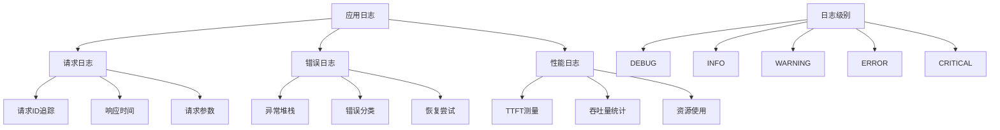

**图表来源**
- [logging.py](file://src/transformers/utils/logging.py#L1-L100)

**章节来源**
- [serve.py](file://src/transformers/cli/serve.py#L567-L662)
- [logging.py](file://src/transformers/utils/logging.py#L1-L409)

## 部署与监控

### Docker部署配置

系统提供了完整的容器化部署方案：

```yaml
# docker-compose.yml 示例
services:
  transformers-server:
    image: transformers:latest
    ports:
      - "8000:8000"
    environment:
      - TRANSFORMERS_VERBOSITY=info
      - MODEL_TIMEOUT=300
    volumes:
      - ./models:/app/models
      - ./cache:/app/cache
    deploy:
      resources:
        reservations:
          devices:
            - driver: nvidia
              count: all
              capabilities: [gpu]
```

### 监控仪表板

系统集成了Prometheus和Grafana监控解决方案：

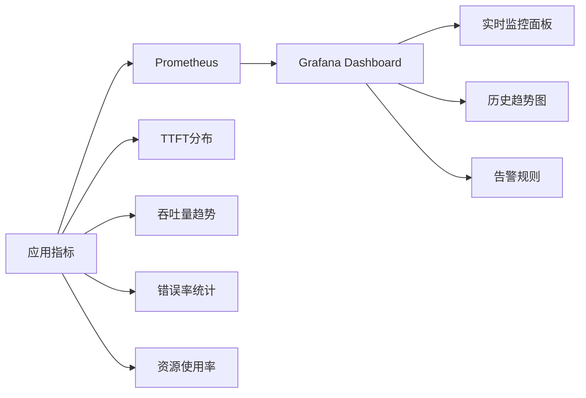

**图表来源**
- [docker-compose.yml](file://examples/metrics-monitoring/docker-compose.yml#L1-L56)

**章节来源**
- [docker-compose.yml](file://examples/metrics-monitoring/docker-compose.yml#L1-L56)

## 最佳实践

### 配置优化建议

#### 生产环境配置

```python
# 生产环境推荐配置
serve = Serve(
    continuous_batching=True,
    device="auto",
    dtype="bfloat16",
    model_timeout=600,  # 10分钟超时
    log_level="info",
    enable_cors=True,
    input_validation=True
)
```

#### 性能调优参数

| 参数 | 开发环境 | 生产环境 | 说明 |
|------|----------|----------|------|
| `model_timeout` | 300秒 | 600秒 | 模型空闲超时 |
| `continuous_batching` | 否 | 是 | 启用连续批处理 |
| `input_validation` | 否 | 是 | 启用严格验证 |
| `enable_cors` | 否 | 是 | 允许跨域请求 |

### 安全最佳实践

1. **认证授权**：实现API密钥或OAuth认证
2. **速率限制**：防止API滥用
3. **输入验证**：严格验证所有输入参数
4. **错误处理**：避免泄露敏感信息
5. **HTTPS加密**：生产环境必须启用

### 扩展性考虑

#### 水平扩展

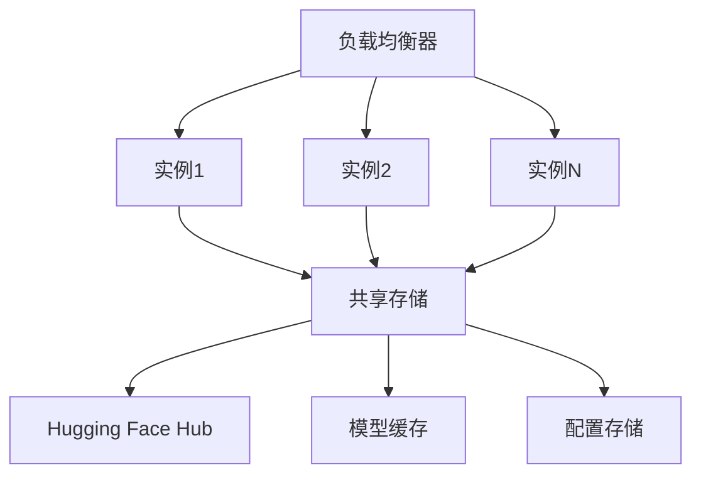

#### 垂直扩展

- GPU内存优化
- 批次大小调优
- 注意力机制选择
- 量化技术应用

## 总结

本指南详细介绍了基于Hugging Face Transformers库的API服务构建方法。通过连续批处理技术、完善的错误处理机制和全面的监控体系，可以构建出高性能、高可用的模型推理服务。

关键要点：

1. **连续批处理**是提升并发性能的核心技术
2. **RESTful API设计**确保了良好的可扩展性
3. **完善的监控体系**保证了系统的可观测性
4. **灵活的配置选项**适应不同的部署需求
5. **严格的安全措施**保障生产环境安全

通过遵循本指南的最佳实践，开发者可以构建出满足企业级需求的高性能API服务，为各种AI应用场景提供可靠的服务支撑。