# RESTful API服务开发指南

<cite>
**本文档中引用的文件**
- [serve.py](file://src/transformers/cli/serve.py)
- [test_serve.py](file://tests/cli/test_serve.py)
</cite>

## 目录
1. [简介](#简介)
2. [项目结构概览](#项目结构概览)
3. [核心组件分析](#核心组件分析)
4. [架构概览](#架构概览)
5. [详细组件分析](#详细组件分析)
6. [依赖关系分析](#依赖关系分析)
7. [性能考虑](#性能考虑)
8. [故障排除指南](#故障排除指南)
9. [结论](#结论)

## 简介

本指南基于Hugging Face Transformers库中的`serve.py`命令行工具，详细介绍如何使用transformers CLI创建标准的RESTful模型推理API。该工具提供了完整的FastAPI服务器实现，支持多种AI模型的推理服务，包括聊天完成、响应生成、音频转录等功能。

该服务遵循OpenAI兼容的API规范，提供标准化的HTTP端点，支持流式和非流式响应，具备完善的错误处理机制和性能优化特性。

## 项目结构概览

transformers CLI服务采用模块化架构设计，主要包含以下核心组件：

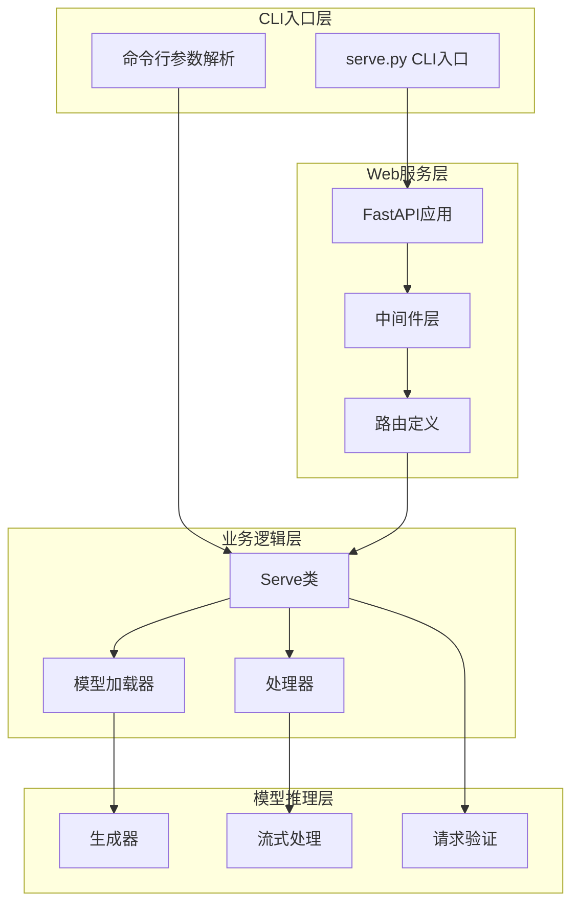

**图表来源**
- [serve.py](file://src/transformers/cli/serve.py#L471-L505)

**章节来源**
- [serve.py](file://src/transformers/cli/serve.py#L1-L100)

## 核心组件分析

### Serve类核心功能

Serve类是整个API服务的核心控制器，负责管理模型生命周期、处理请求路由和协调各个组件。

#### 主要职责：
- 模型加载与卸载管理
- 请求路由分发
- 流式响应处理
- 错误处理与日志记录
- 性能监控与优化

#### 关键配置参数：
- `continuous_batching`: 启用连续批处理模式
- `device`: 推理设备选择
- `dtype`: 数据类型配置
- `quantization`: 量化方法设置
- `model_timeout`: 模型超时时间

**章节来源**
- [serve.py](file://src/transformers/cli/serve.py#L300-L400)

## 架构概览

### RESTful API端点设计

服务提供以下标准化的RESTful端点：

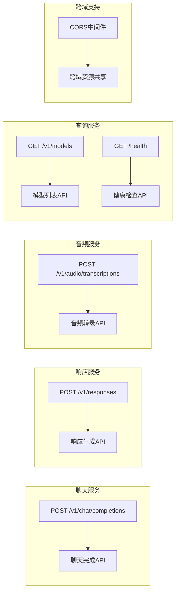

**图表来源**
- [serve.py](file://src/transformers/cli/serve.py#L471-L535)

### 请求/响应格式规范

#### 聊天完成请求格式
```json
{
  "model": "string",
  "messages": [
    {
      "role": "user|assistant|system",
      "content": "string|array"
    }
  ],
  "stream": "boolean",
  "max_tokens": "integer",
  "temperature": "float",
  "top_p": "float",
  "frequency_penalty": "float",
  "seed": "integer"
}
```

#### 响应生成请求格式
```json
{
  "model": "string",
  "instructions": "string",
  "input": "string|array|object",
  "stream": "boolean",
  "max_output_tokens": "integer",
  "parallel_tool_calls": "boolean",
  "tool_choice": "string"
}
```

#### 音频转录请求格式
```json
{
  "model": "string",
  "file": "binary_data",
  "stream": "boolean"
}
```

**章节来源**
- [serve.py](file://src/transformers/cli/serve.py#L567-L597)

## 详细组件分析

### HTTP端点实现

#### 聊天完成端点 (/v1/chat/completions)

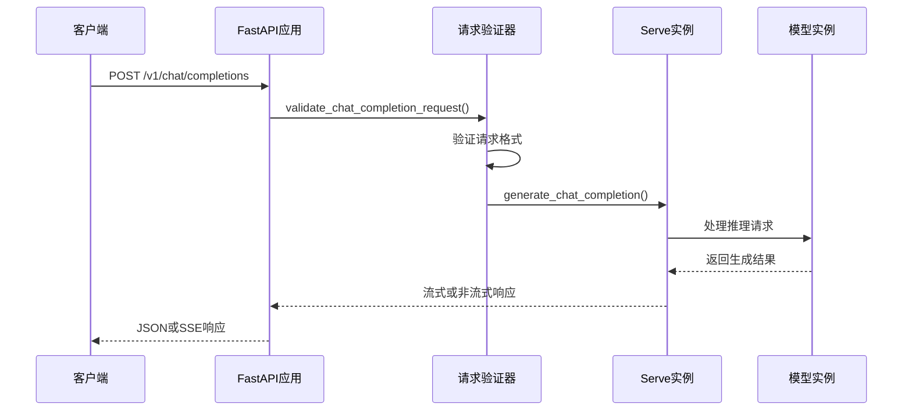

**图表来源**
- [serve.py](file://src/transformers/cli/serve.py#L485-L495)

#### 响应生成端点 (/v1/responses)

该端点实现了OpenAI兼容的响应API，支持事件流格式：

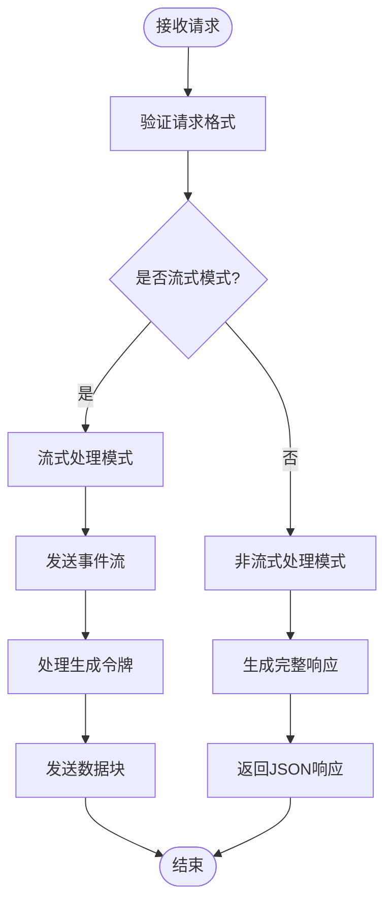

**图表来源**
- [serve.py](file://src/transformers/cli/serve.py#L507-L515)

#### 音频转录端点 (/v1/audio/transcriptions)

音频转录功能支持多种音频格式的文本转换：

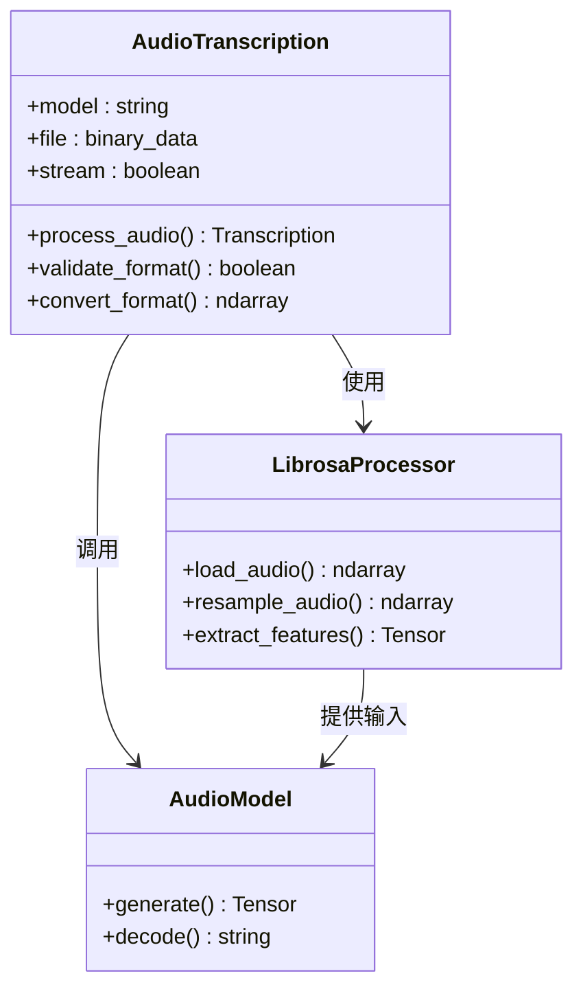

**图表来源**
- [serve.py](file://src/transformers/cli/serve.py#L517-L535)

**章节来源**
- [serve.py](file://src/transformers/cli/serve.py#L485-L535)

### 请求验证与错误处理

#### 输入验证机制

服务实现了严格的请求验证系统：

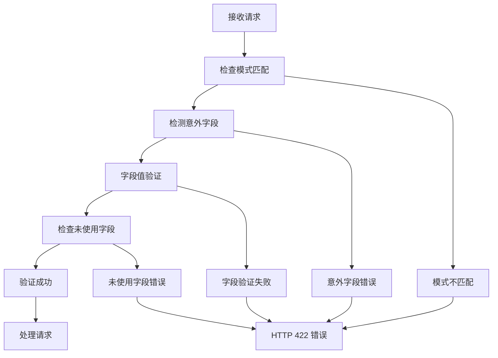

**图表来源**
- [serve.py](file://src/transformers/cli/serve.py#L567-L597)

#### 错误响应规范

所有错误响应都遵循统一的格式：

| 错误类型 | HTTP状态码 | 响应格式 |
|---------|-----------|---------|
| 验证错误 | 422 | `{"detail": "错误描述"}` |
| 服务器错误 | 500 | `{"error": "错误描述"}` |
| 模型加载失败 | 503 | `{"error": "模型不可用"}` |
| 请求取消 | 499 | `{"error": "请求被取消"}` |

**章节来源**
- [serve.py](file://src/transformers/cli/serve.py#L567-L597)

### 流式响应处理

#### SSE（Server-Sent Events）实现

服务使用SSE格式提供流式响应：

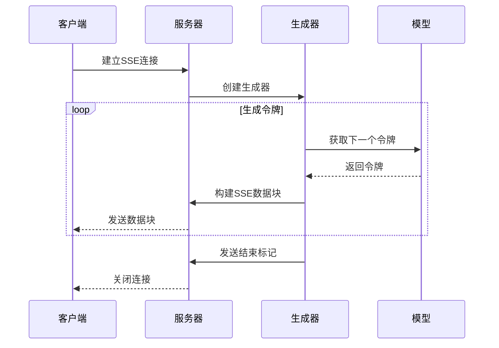

**图表来源**
- [serve.py](file://src/transformers/cli/serve.py#L600-L650)

#### 工具调用支持

服务支持复杂的工具调用功能：

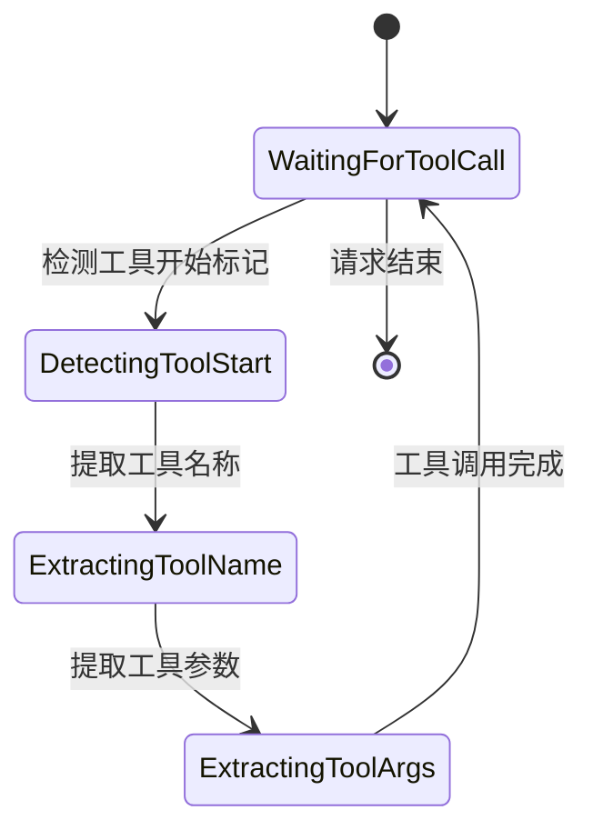

**图表来源**
- [serve.py](file://src/transformers/cli/serve.py#L950-L1050)

**章节来源**
- [serve.py](file://src/transformers/cli/serve.py#L600-L1100)

### 模型生命周期管理

#### 自动加载与卸载

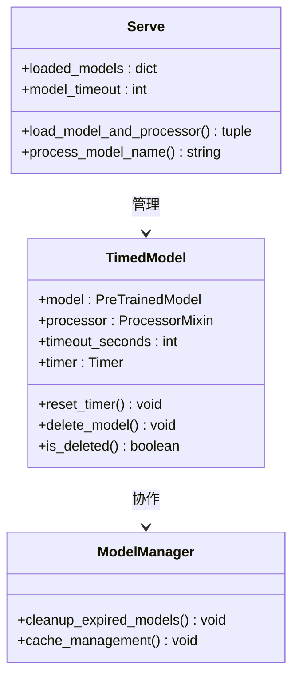

**图表来源**
- [serve.py](file://src/transformers/cli/serve.py#L250-L300)

**章节来源**
- [serve.py](file://src/transformers/cli/serve.py#L1700-L1843)

## 依赖关系分析

### 核心依赖库

服务依赖以下关键库：

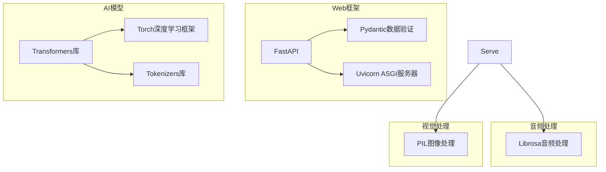

**图表来源**
- [serve.py](file://src/transformers/cli/serve.py#L20-L50)

### 中间件配置

#### CORS中间件

服务提供可选的CORS支持：

```python
# CORS配置示例
if self.enable_cors:
    app.add_middleware(
        CORSMiddleware,
        allow_origins=["*"],
        allow_credentials=True,
        allow_methods=["*"],
        allow_headers=["*"],
    )
```

#### 请求ID跟踪

服务自动为每个请求分配唯一标识符：

```python
@app.middleware("http")
async def get_or_set_request_id(request: Request, call_next):
    request_id = request.headers.get(X_REQUEST_ID) or str(uuid.uuid4())
    request.state.request_id = request_id
    response = await call_next(request)
    response.headers[X_REQUEST_ID] = request_id
    return response
```

**章节来源**
- [serve.py](file://src/transformers/cli/serve.py#L471-L505)

## 性能考虑

### 连续批处理优化

服务支持连续批处理模式，显著提升多请求处理效率：

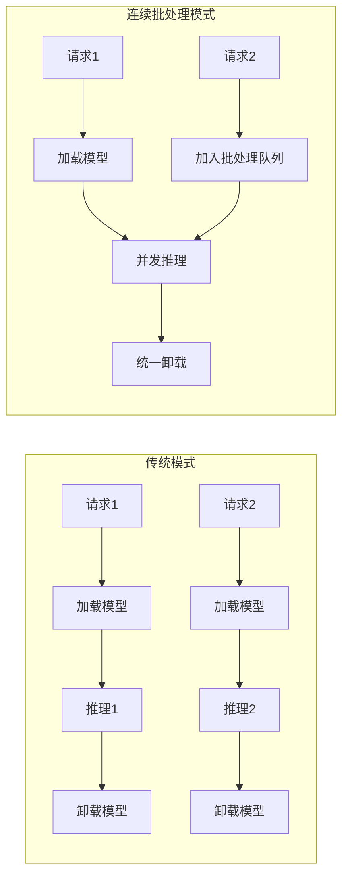

**图表来源**
- [serve.py](file://src/transformers/cli/serve.py#L800-L900)

### 内存管理优化

#### 模型缓存策略

- **LRU缓存**: 最近最少使用的模型优先卸载
- **定时清理**: 基于超时时间的自动清理机制
- **内存监控**: GPU/CPU内存使用情况监控

#### KV缓存优化

服务实现了智能的KV缓存复用机制：

```python
def is_continuation(self, req: dict) -> bool:
    """判断请求是否为连续对话"""
    messages = req.get("messages") or req.get("input")
    req_continues_last_messages = True
    
    if self.last_messages is None:
        req_continues_last_messages = False
    elif len(self.last_messages) >= len(messages):
        req_continues_last_messages = False
    else:
        for i in range(len(self.last_messages)):
            if self.last_messages[i] != messages[i]:
                req_continues_last_messages = False
                break
    
    self.last_messages = messages
    return req_continues_last_messages
```

### 量化支持

服务支持多种量化技术以减少内存占用：

| 量化方法 | 内存节省 | 性能影响 | 适用场景 |
|---------|---------|---------|---------|
| 4-bit量化 | ~75% | 轻微 | 内存受限环境 |
| 8-bit量化 | ~50% | 较小 | 平衡性能与内存 |
| FP16 | ~50% | 无 | GPU加速环境 |

**章节来源**
- [serve.py](file://src/transformers/cli/serve.py#L1650-L1700)

## 故障排除指南

### 常见问题与解决方案

#### 模型加载失败

**症状**: HTTP 503错误，模型不可用
**原因**: 
- 模型文件损坏或缺失
- 内存不足
- 权限问题

**解决方案**:
1. 检查模型文件完整性
2. 增加可用内存
3. 验证文件权限

#### 请求超时

**症状**: HTTP 408错误，请求超时
**原因**:
- 模型推理时间过长
- 网络延迟过高
- 并发请求过多

**解决方案**:
1. 调整超时设置
2. 优化模型配置
3. 实施请求限流

#### 流式响应中断

**症状**: SSE连接意外断开
**原因**:
- 服务器重启
- 网络不稳定
- 客户端取消请求

**解决方案**:
1. 实现重连机制
2. 添加心跳检测
3. 优雅处理取消信号

### 监控与调试

#### 日志配置

服务提供详细的日志记录：

```python
# 日志级别配置
transformers_logger.setLevel(logging.log_levels[log_level.lower()])
cb_logger.setLevel(logging.log_levels[log_level.lower()])
```

#### 健康检查

提供专门的健康检查端点：

```python
@app.get("/health")
def healthcheck():
    return JSONResponse({"status": "ok"})
```

**章节来源**
- [serve.py](file://src/transformers/cli/serve.py#L495-L505)

## 结论

基于transformers CLI的RESTful API服务提供了一个完整、高性能的AI模型推理解决方案。通过标准化的OpenAI兼容接口、灵活的配置选项和强大的性能优化特性，该服务能够满足各种生产环境的需求。

### 主要优势

1. **标准化接口**: 完全兼容OpenAI API规范
2. **高性能**: 支持连续批处理和智能缓存
3. **灵活性**: 多种量化和配置选项
4. **可靠性**: 完善的错误处理和监控机制
5. **易用性**: 简单的命令行部署方式

### 最佳实践建议

1. **生产环境部署**: 启用CORS但限制允许的源
2. **性能优化**: 根据硬件配置调整量化设置
3. **安全考虑**: 实施适当的访问控制和认证
4. **监控告警**: 建立完善的监控和日志系统
5. **容量规划**: 根据预期负载合理配置资源

该服务为开发者提供了一个可靠的AI模型推理平台，支持从原型开发到生产部署的各种场景需求。