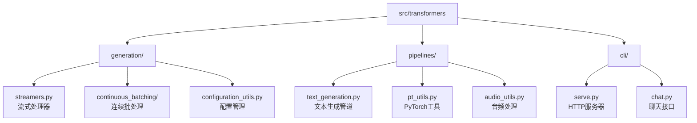
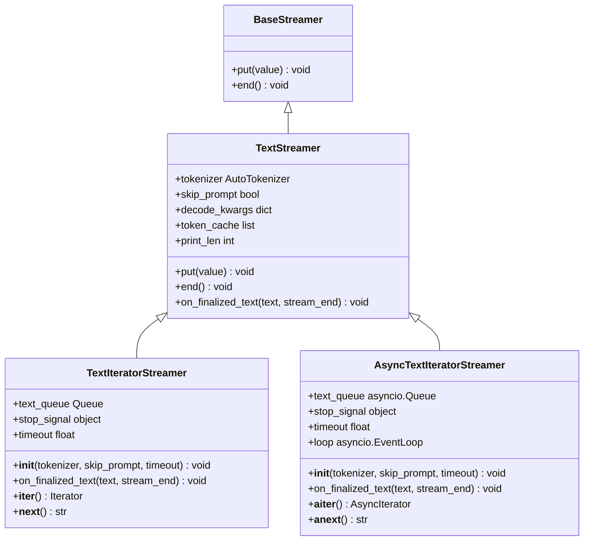
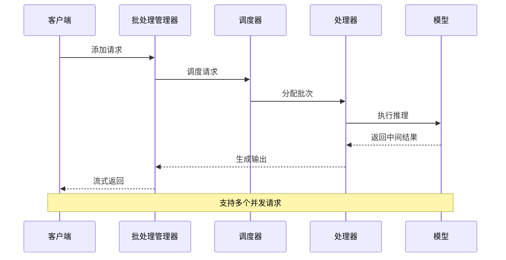
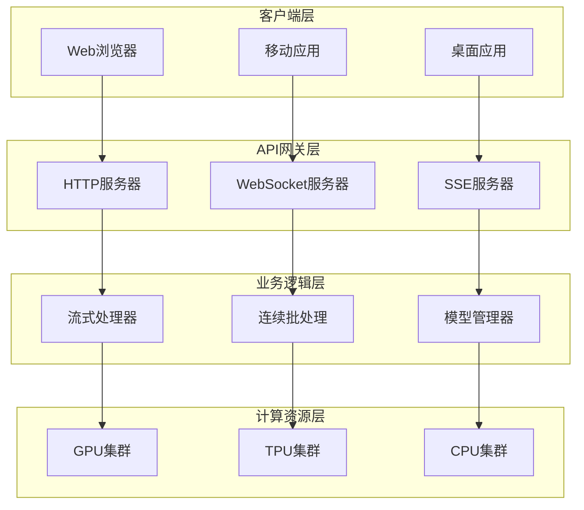
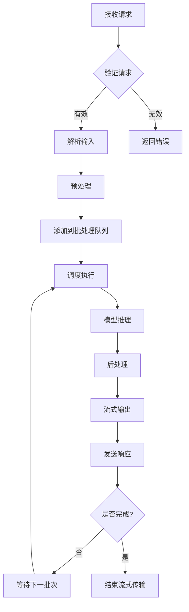
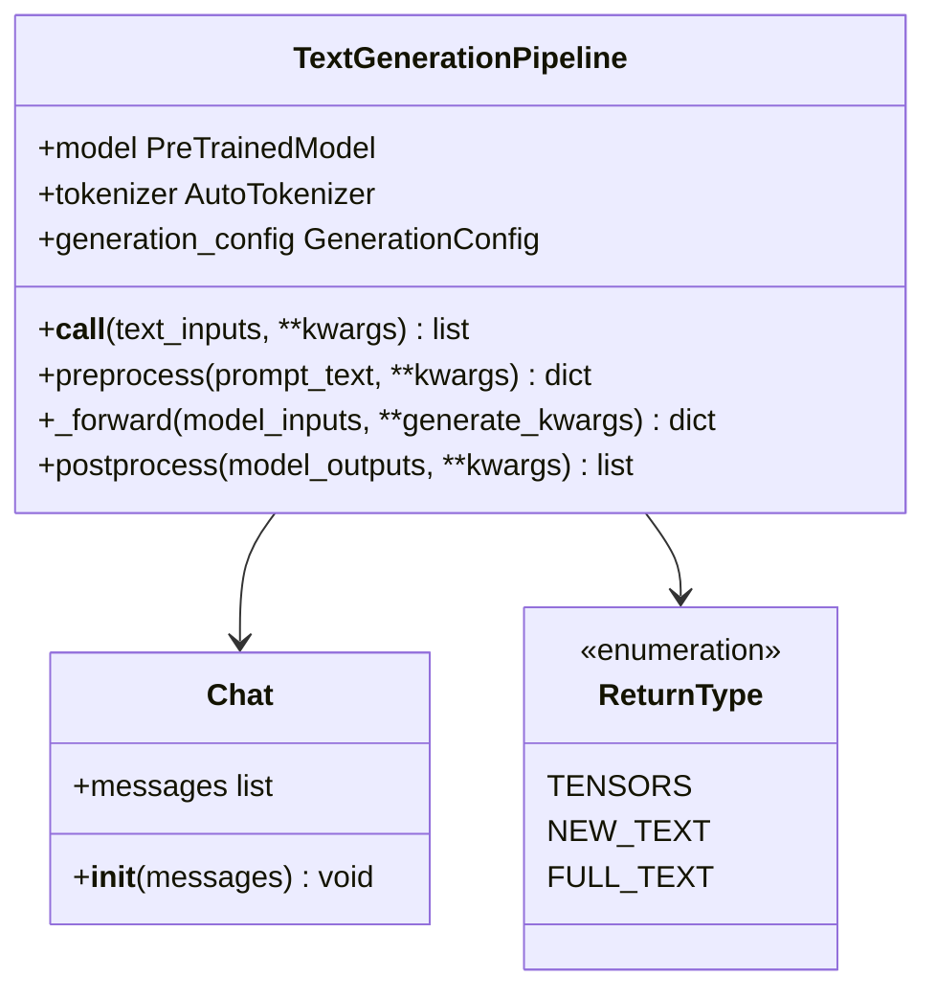
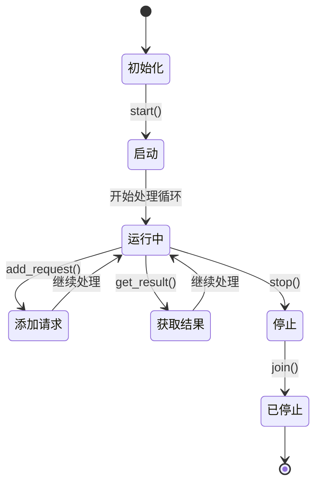
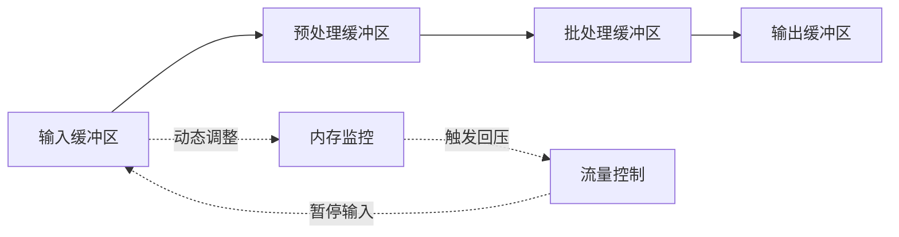
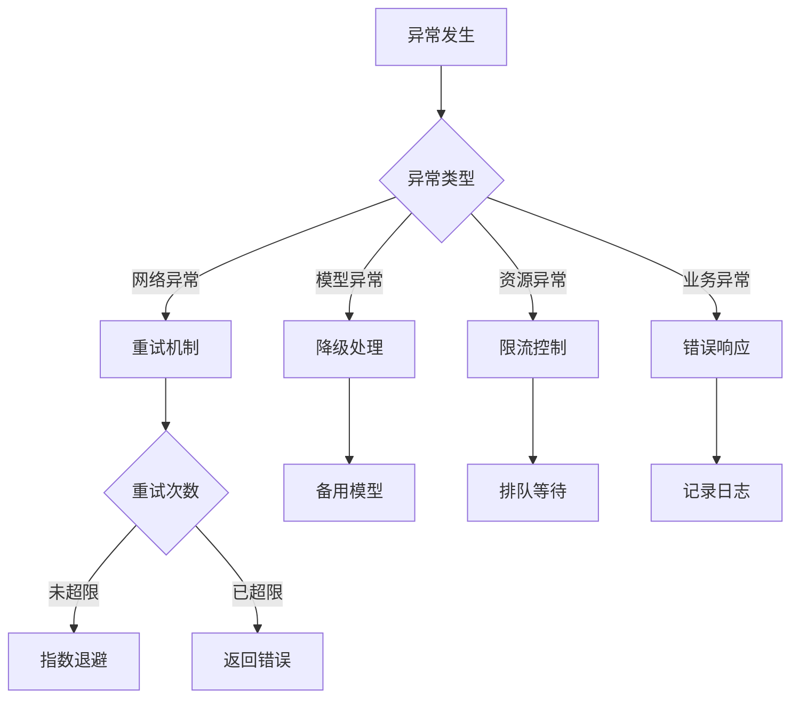

# 流式API服务开发指南

<cite>
**本文档中引用的文件**
- [streamers.py](file://src/transformers/generation/streamers.py)
- [text_generation.py](file://src/transformers/pipelines/text_generation.py)
- [serve.py](file://src/transformers/cli/serve.py)
- [continuous_api.py](file://src/transformers/generation/continuous_batching/continuous_api.py)
- [configuration_utils.py](file://src/transformers/generation/configuration_utils.py)
- [scheduler.py](file://src/transformers/generation/continuous_batching/scheduler.py)
- [chat.py](file://src/transformers/cli/chat.py)
- [audio_utils.py](file://src/transformers/pipelines/audio_utils.py)
</cite>

## 目录
1. [简介](#简介)
2. [项目结构概览](#项目结构概览)
3. [核心组件分析](#核心组件分析)
4. [架构设计](#架构设计)
5. [详细组件分析](#详细组件分析)
6. [流式API实现](#流式api实现)
7. [性能优化策略](#性能优化策略)
8. [错误处理与恢复机制](#错误处理与恢复机制)
9. [实际应用案例](#实际应用案例)
10. [最佳实践指南](#最佳实践指南)
11. [总结](#总结)

## 简介

本指南基于Hugging Face Transformers库中的pipelines和generation模块，详细介绍如何开发高性能的流式API服务。该系统支持WebSocket和Server-Sent Events (SSE)两种流式传输协议，能够实现实时文本生成、语音流处理等应用场景。

流式API服务的核心优势包括：
- **实时响应**：用户无需等待完整输出即可开始接收数据
- **低延迟**：首字节时间(BTTF)显著降低
- **资源效率**：按需分配计算资源，避免长时间占用
- **用户体验**：提供更自然的交互体验

## 项目结构概览

Transformers库中的流式API相关文件主要分布在以下目录：



**图表来源**
- [streamers.py](file://src/transformers/generation/streamers.py#L1-L50)
- [text_generation.py](file://src/transformers/pipelines/text_generation.py#L1-L50)
- [serve.py](file://src/transformers/cli/serve.py#L1-L50)

## 核心组件分析

### 流式处理器架构

系统采用分层的流式处理架构，从底层到顶层依次为：



**图表来源**
- [streamers.py](file://src/transformers/generation/streamers.py#L25-L319)

**章节来源**
- [streamers.py](file://src/transformers/generation/streamers.py#L1-L319)

### 连续批处理引擎

连续批处理系统是高性能流式API的核心，支持多请求并发处理：



**图表来源**
- [continuous_api.py](file://src/transformers/generation/continuous_batching/continuous_api.py#L800-L999)
- [scheduler.py](file://src/transformers/generation/continuous_batching/scheduler.py#L268-L298)

**章节来源**
- [continuous_api.py](file://src/transformers/generation/continuous_batching/continuous_api.py#L800-L999)
- [scheduler.py](file://src/transformers/generation/continuous_batching/scheduler.py#L268-L298)

## 架构设计

### 整体系统架构



### 数据流处理流程



## 详细组件分析

### 文本生成管道

文本生成管道提供了统一的接口来处理各种类型的文本生成任务：



**图表来源**
- [text_generation.py](file://src/transformers/pipelines/text_generation.py#L40-L540)

**章节来源**
- [text_generation.py](file://src/transformers/pipelines/text_generation.py#L40-L540)

### 生成配置管理

生成配置系统提供了灵活的参数控制机制：

| 配置参数 | 类型 | 默认值 | 描述 |
|---------|------|--------|------|
| max_new_tokens | int | 256 | 最大新生成token数 |
| do_sample | bool | True | 是否使用采样策略 |
| temperature | float | 0.7 | 温度参数，控制随机性 |
| top_p | float | 1.0 | 核采样参数 |
| top_k | int | 50 | Top-K采样参数 |
| repetition_penalty | float | 1.0 | 重复惩罚系数 |
| max_time | float | None | 最大执行时间 |

**章节来源**
- [configuration_utils.py](file://src/transformers/generation/configuration_utils.py#L1-L799)

### 连续批处理管理器

连续批处理管理器是系统的核心组件，负责高效的资源管理和请求调度：



**图表来源**
- [continuous_api.py](file://src/transformers/generation/continuous_batching/continuous_api.py#L827-L863)

**章节来源**
- [continuous_api.py](file://src/transformers/generation/continuous_batching/continuous_api.py#L827-L863)

## 流式API实现

### WebSocket流式响应

WebSocket协议适合需要双向通信的应用场景：

```python
# WebSocket连接管理示例
async def websocket_endpoint(websocket: WebSocket):
    await websocket.accept()
    try:
        while True:
            # 接收客户端消息
            data = await websocket.receive_text()
            
            # 处理请求并流式返回
            async for chunk in stream_chat_completion(data):
                await websocket.send_text(json.dumps(chunk))
                
    except WebSocketDisconnect:
        # 处理连接断开
        await websocket.close()
```

### Server-Sent Events (SSE)实现

SSE协议更适合单向数据流推送：

```python
# SSE流式响应实现
@app.post("/v1/chat/completions")
async def chat_completions(request: Request):
    # 解析请求
    req = await request.json()
    
    # 创建流式生成器
    def generate_stream():
        try:
            # 设置流式处理器
            generation_streamer = TextIteratorStreamer(
                tokenizer, 
                skip_prompt=True,
                timeout=30.0
            )
            
            # 启动生成线程
            generation_kwargs = {
                "streamer": generation_streamer,
                "max_new_tokens": req.get("max_tokens", 256),
                "do_sample": True,
                "temperature": req.get("temperature", 0.7)
            }
            
            # 发送初始事件
            yield f"data: {json.dumps({'event': 'start'})}\n\n"
            
            # 流式返回结果
            for new_text in generation_streamer:
                chunk = {
                    "event": "text_delta",
                    "delta": new_text,
                    "usage": calculate_usage()
                }
                yield f"data: {json.dumps(chunk)}\n\n"
            
            # 发送结束事件
            yield f"data: {json.dumps({'event': 'done'})}\n\n"
            
        except Exception as e:
            yield f"data: {json.dumps({'error': str(e)})}\n\n"
    
    return StreamingResponse(
        generate_stream(), 
        media_type="text/event-stream"
    )
```

### OpenAI兼容的流式响应格式

系统实现了与OpenAI API兼容的流式响应格式：

```python
# ChatCompletionChunk响应格式
{
    "id": "chatcmpl-123",
    "object": "chat.completion.chunk",
    "created": 1677652288,
    "model": "gpt-3.5-turbo-0613",
    "choices": [{
        "index": 0,
        "delta": {
            "role": "assistant",
            "content": ""
        },
        "finish_reason": null
    }]
}
```

**章节来源**
- [serve.py](file://src/transformers/cli/serve.py#L507-L535)
- [serve.py](file://src/transformers/cli/serve.py#L1602-L1658)

## 性能优化策略

### 网络延迟优化

1. **连接池管理**
   - 实现HTTP/2连接复用
   - 使用连接池减少握手开销
   - 支持长连接保持

2. **压缩传输**
   - 启用gzip压缩
   - 使用Brotli压缩算法
   - 智能内容编码选择

3. **缓存策略**
   - 实现响应缓存
   - 使用CDN加速静态资源
   - 缓存热点数据

### 缓冲策略



### 客户端流控制

系统实现了多层次的流控制机制：

| 控制层级 | 实现方式 | 目标 |
|---------|----------|------|
| 网络层 | TCP滑动窗口 | 防止网络拥塞 |
| 应用层 | 请求队列长度限制 | 控制内存使用 |
| 业务层 | 并发请求数限制 | 保证服务质量 |
| 用户层 | 流速限制 | 提升用户体验 |

**章节来源**
- [continuous_api.py](file://src/transformers/generation/continuous_batching/continuous_api.py#L800-L900)

## 错误处理与恢复机制

### 异常分类与处理



### 连接管理

系统提供了完善的连接生命周期管理：

```python
# 连接状态管理
class ConnectionManager:
    def __init__(self):
        self.connections = {}
    
    async def connect(self, client_id: str, websocket: WebSocket):
        self.connections[client_id] = websocket
        await websocket.accept()
    
    def disconnect(self, client_id: str):
        if client_id in self.connections:
            del self.connections[client_id]
    
    async def send_message(self, client_id: str, message: str):
        if client_id in self.connections:
            await self.connections[client_id].send_text(message)
```

### 错误恢复策略

1. **自动重试机制**
   - 指数退避算法
   - 最大重试次数限制
   - 不同异常类型的差异化处理

2. **优雅降级**
   - 快速失败策略
   - 服务降级预案
   - 用户体验保障

3. **监控告警**
   - 实时指标监控
   - 异常情况告警
   - 自动故障转移

**章节来源**
- [serve.py](file://src/transformers/cli/serve.py#L1480-L1515)

## 实际应用案例

### 聊天机器人系统

基于流式API的聊天机器人实现：

```python
# 聊天机器人核心逻辑
class ChatBot:
    def __init__(self, model_name: str):
        self.pipeline = pipeline("text-generation", model=model_name)
        self.conversation_history = []
    
    async def chat(self, user_input: str):
        # 添加用户输入到历史
        self.conversation_history.append({
            "role": "user",
            "content": user_input
        })
        
        # 流式生成回复
        async for chunk in self.pipeline(
            self.conversation_history,
            max_new_tokens=100,
            do_sample=True,
            temperature=0.7,
            stream=True
        ):
            yield chunk
        
        # 更新对话历史
        self.conversation_history.append({
            "role": "assistant",
            "content": chunk["generated_text"]
        })
```

### 实时翻译服务

支持流式翻译的多语言处理：

```python
# 实时翻译服务
class TranslationService:
    def __init__(self):
        self.models = {
            "en-zh": pipeline("translation_en_to_zh"),
            "zh-en": pipeline("translation_zh_to_en"),
            "ja-en": pipeline("translation_ja_to_en")
        }
    
    async def translate_stream(self, text: str, source_lang: str, target_lang: str):
        model_key = f"{source_lang}-{target_lang}"
        if model_key not in self.models:
            raise ValueError(f"不支持的语言对: {model_key}")
        
        model = self.models[model_key]
        
        # 流式翻译处理
        async for chunk in model(text, stream=True):
            # 处理翻译结果
            translated_text = chunk["translation_text"]
            
            # 发送进度更新
            yield {
                "progress": calculate_translation_progress(translated_text),
                "translated": translated_text
            }
```

### 语音助手系统

集成语音识别和文本生成的智能助手：

```python
# 语音助手核心功能
class VoiceAssistant:
    def __init__(self):
        self.asr_pipeline = pipeline("automatic-speech-recognition")
        self.text_gen_pipeline = pipeline("text-generation")
    
    async def voice_interaction(self, audio_data: bytes):
        # 语音识别
        transcription = await self.asr_pipeline(audio_data)
        
        # 流式文本生成
        async for response_chunk in self.text_gen_pipeline(
            transcription["text"],
            max_new_tokens=150,
            stream=True
        ):
            # 语音合成处理
            audio_chunk = await text_to_speech(response_chunk["generated_text"])
            
            yield {
                "text": response_chunk["generated_text"],
                "audio": audio_chunk,
                "timestamp": time.time()
            }
```

**章节来源**
- [chat.py](file://src/transformers/cli/chat.py#L1-L200)

## 最佳实践指南

### 设计原则

1. **响应式设计**
   - 首字节时间控制在100ms以内
   - 支持渐进式渲染
   - 实现优雅降级

2. **可扩展性**
   - 水平扩展能力
   - 无状态设计
   - 弹性伸缩支持

3. **可靠性**
   - 容错机制
   - 监控告警
   - 自动恢复

### 性能调优建议

1. **模型优化**
   - 使用量化模型
   - 启用模型编译
   - 优化KV缓存

2. **系统配置**
   - 合理设置批处理大小
   - 优化内存分配
   - 调整并发参数

3. **网络优化**
   - 使用CDN加速
   - 启用HTTP/2
   - 实现连接复用

### 安全考虑

1. **访问控制**
   - API密钥认证
   - IP白名单
   - 速率限制

2. **数据保护**
   - 输入验证
   - 输出过滤
   - 日志脱敏

3. **网络安全**
   - HTTPS加密
   - CORS配置
   - XSS防护

### 监控与运维

1. **关键指标**
   - 响应时间分布
   - 错误率统计
   - 资源使用率

2. **告警机制**
   - 异常检测
   - 性能阈值
   - 服务可用性

3. **日志管理**
   - 结构化日志
   - 链路追踪
   - 性能分析

## 总结

本指南详细介绍了基于Hugging Face Transformers库的流式API服务开发方法。通过深入分析核心组件、架构设计和实现细节，我们展示了如何构建高性能、高可用的流式AI服务。

关键要点包括：

1. **技术架构**：采用分层设计，从流式处理器到底层模型推理的完整栈
2. **协议支持**：同时支持WebSocket和SSE两种主流流式传输协议
3. **性能优化**：通过连续批处理、缓存策略和流控制实现高效处理
4. **错误处理**：完善的异常处理和恢复机制确保服务稳定性
5. **实际应用**：涵盖聊天机器人、实时翻译、语音助手等多种应用场景

随着AI技术的不断发展，流式API服务将成为连接人机交互的重要桥梁。掌握这些核心技术，将有助于开发者构建更加智能、高效的AI应用系统。