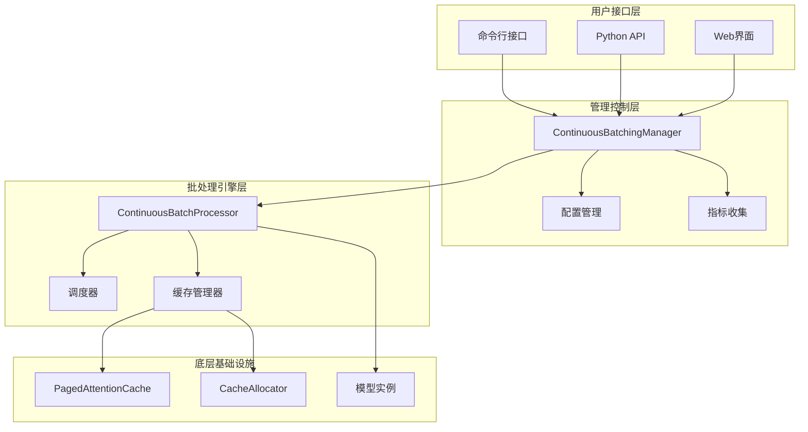
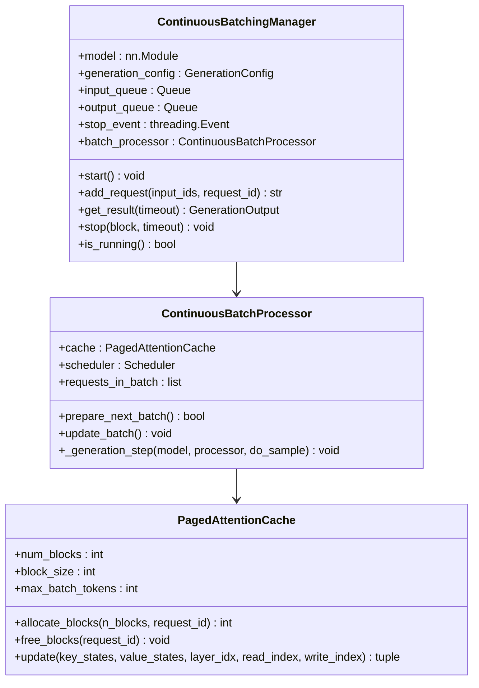
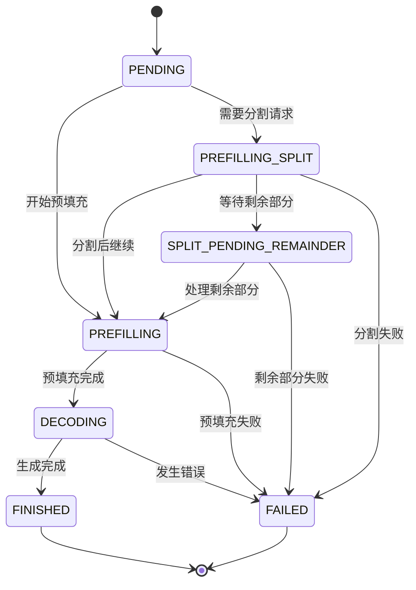
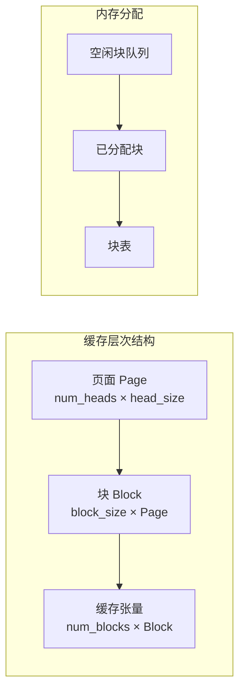
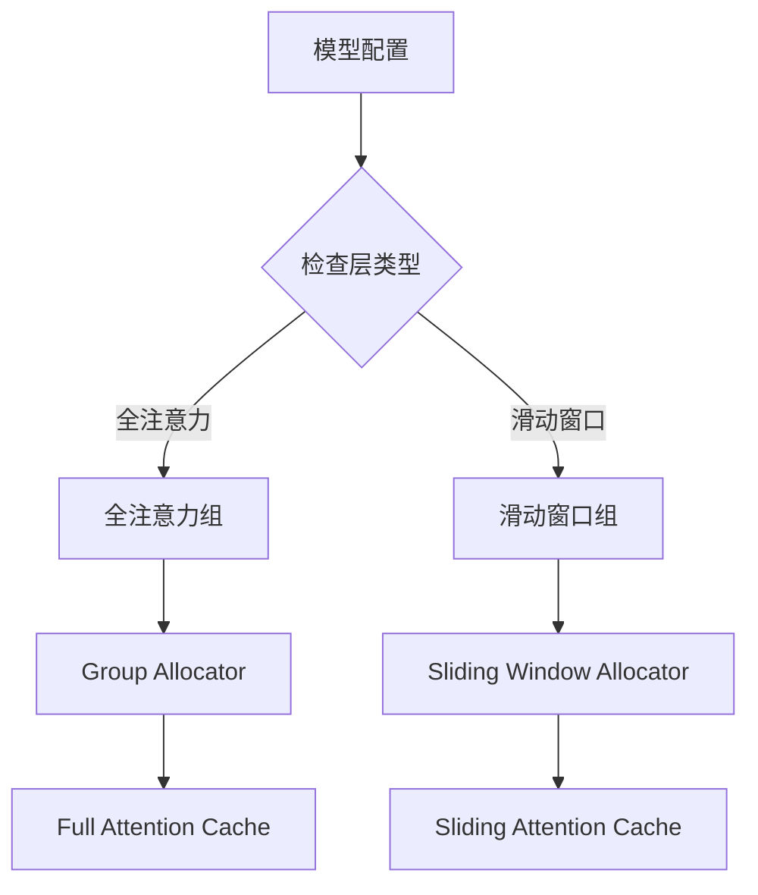
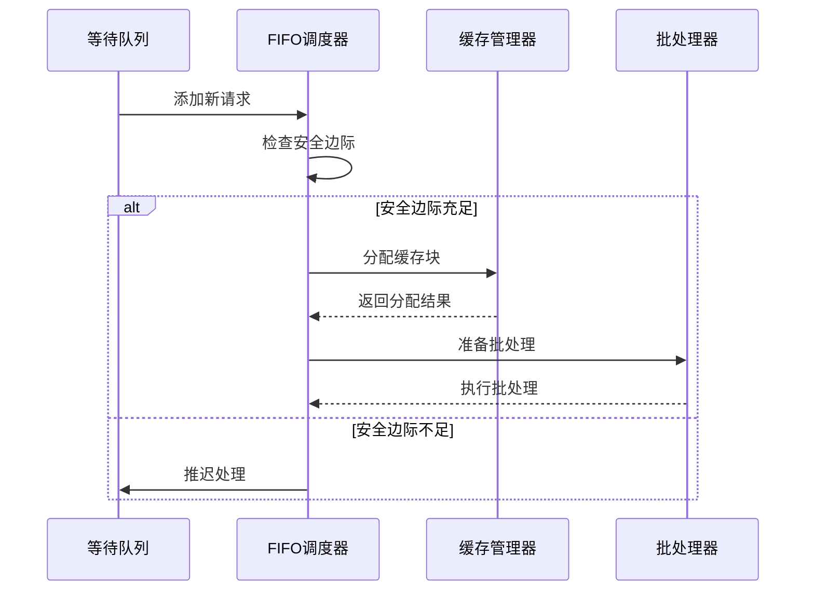
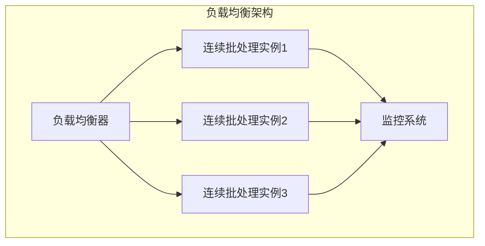
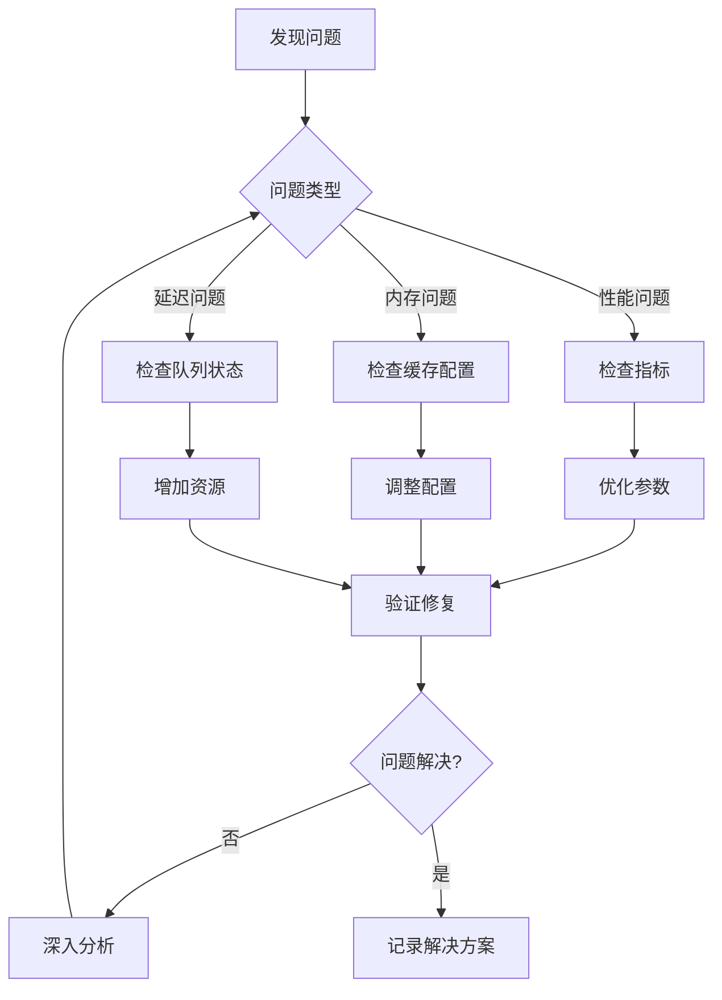

# 连续批处理服务详细指南

<cite>
**本文档中引用的文件**
- [continuous_batching.py](file://examples/pytorch/continuous_batching.py)
- [continuous_batching_simple.py](file://examples/pytorch/continuous_batching_simple.py)
- [continuous_api.py](file://src/transformers/generation/continuous_batching/continuous_api.py)
- [cache.py](file://src/transformers/generation/continuous_batching/cache.py)
- [cache_manager.py](file://src/transformers/generation/continuous_batching/cache_manager.py)
- [requests.py](file://src/transformers/generation/continuous_batching/requests.py)
- [scheduler.py](file://src/transformers/generation/continuous_batching/scheduler.py)
- [__init__.py](file://src/transformers/generation/continuous_batching/__init__.py)
- [test_continuous_batching.py](file://tests/generation/test_continuous_batching.py)
</cite>

## 目录
1. [简介](#简介)
2. [系统架构概览](#系统架构概览)
3. [核心组件详解](#核心组件详解)
4. [连续批处理技术原理](#连续批处理技术原理)
5. [缓存管理系统](#缓存管理系统)
6. [调度器机制](#调度器机制)
7. [性能优化策略](#性能优化策略)
8. [配置与调优](#配置与调优)
9. [高并发场景最佳实践](#高并发场景最佳实践)
10. [监控与调试](#监控与调试)
11. [故障排除指南](#故障排除指南)
12. [总结](#总结)

## 简介

连续批处理（Continuous Batching）是一种先进的推理优化技术，旨在提高大语言模型在生产环境中的吞吐量和资源利用率。该技术通过动态管理和批处理多个并发请求，实现了高效的内存利用和计算资源优化。

### 核心优势

- **高吞吐量**：支持同时处理多个请求，最大化GPU利用率
- **低延迟**：通过智能调度减少等待时间
- **内存效率**：采用分页注意力机制优化显存使用
- **动态适应**：根据可用资源自动调整批处理策略

## 系统架构概览

连续批处理系统采用分层架构设计，包含用户接口层、管理控制层、批处理引擎层和底层基础设施层。



**图表来源**
- [continuous_api.py](file://src/transformers/generation/continuous_batching/continuous_api.py#L729-L828)
- [cache.py](file://src/transformers/generation/continuous_batching/cache.py#L60-L120)

## 核心组件详解

### ContinuousBatchingManager

ContinuousBatchingManager是连续批处理系统的用户接口，负责管理请求队列、启动后台处理线程和提供结果检索功能。



**图表来源**
- [continuous_api.py](file://src/transformers/generation/continuous_batching/continuous_api.py#L729-L828)
- [continuous_api.py](file://src/transformers/generation/continuous_batching/continuous_api.py#L200-L300)
- [cache.py](file://src/transformers/generation/continuous_batching/cache.py#L60-L120)

**章节来源**
- [continuous_api.py](file://src/transformers/generation/continuous_batching/continuous_api.py#L729-L828)
- [continuous_api.py](file://src/transformers/generation/continuous_batching/continuous_api.py#L200-L300)

### 请求状态管理

系统通过RequestState类跟踪每个请求的完整生命周期，从创建到完成或失败。



**图表来源**
- [requests.py](file://src/transformers/generation/continuous_batching/requests.py#L50-L80)

**章节来源**
- [requests.py](file://src/transformers/generation/continuous_batching/requests.py#L50-L150)

## 连续批处理技术原理

### 动态批处理策略

连续批处理的核心在于动态选择和组合多个请求，以最大化硬件利用率。系统根据以下因素决定批处理策略：

1. **令牌预算分配**：根据可用内存动态分配令牌数量
2. **请求优先级**：基于请求状态和等待时间确定优先级
3. **缓存容量管理**：确保不会超出可用缓存空间

### 延迟优化机制

系统采用多种策略减少端到端延迟：

- **流水线处理**：预填充和解码阶段并行执行
- **智能预取**：提前加载可能需要的数据
- **缓存预热**：预先分配常用模式的缓存块

**章节来源**
- [continuous_api.py](file://src/transformers/generation/continuous_batching/continuous_api.py#L400-L500)
- [scheduler.py](file://src/transformers/generation/continuous_batching/scheduler.py#L100-L200)

## 缓存管理系统

### 分页注意力缓存

PagedAttentionCache是连续批处理系统的核心组件，采用分页机制高效管理KV缓存。



**图表来源**
- [cache.py](file://src/transformers/generation/continuous_batching/cache.py#L60-L120)

### 层组管理

系统将具有相同注意力类型的层分组，以优化缓存分配和访问模式。



**图表来源**
- [cache.py](file://src/transformers/generation/continuous_batching/cache.py#L30-L60)
- [cache_manager.py](file://src/transformers/generation/continuous_batching/cache_manager.py#L50-L100)

**章节来源**
- [cache.py](file://src/transformers/generation/continuous_batching/cache.py#L60-L200)
- [cache_manager.py](file://src/transformers/generation/continuous_batching/cache_manager.py#L50-L150)

## 调度器机制

### FIFO调度器

FIFOScheduler按照请求到达顺序处理，确保公平性，同时包含安全边际机制防止缓存耗尽。



**图表来源**
- [scheduler.py](file://src/transformers/generation/continuous_batching/scheduler.py#L150-L200)

### 预填充优先调度器

PrefillFirstScheduler优先处理需要预填充的请求，确保长序列能够及时开始处理。

**章节来源**
- [scheduler.py](file://src/transformers/generation/continuous_batching/scheduler.py#L150-L300)

## 性能优化策略

### CUDA图优化

系统支持CUDA图优化，通过预编译计算图减少内核启动开销。


**图表来源**
- [continuous_api.py](file://src/transformers/generation/continuous_batching/continuous_api.py#L600-L700)

### 内存优化策略

1. **动态内存分配**：根据实际需求分配缓存空间
2. **内存池管理**：复用内存块减少分配开销
3. **垃圾回收**：及时释放不再需要的缓存

**章节来源**
- [continuous_api.py](file://src/transformers/generation/continuous_batching/continuous_api.py#L600-L750)
- [cache.py](file://src/transformers/generation/continuous_batching/cache.py#L400-L500)

## 配置与调优

### 关键配置参数

| 参数名称 | 类型 | 默认值 | 描述 |
|---------|------|--------|------|
| num_blocks | int | 自动计算 | 缓存块总数 |
| max_batch_tokens | int | 自动计算 | 最大批处理令牌数 |
| block_size | int | 32 | 单个块的大小 |
| safety_margin | float | 0.2 | 安全边际比例 |
| use_cuda_graph | bool | 自动检测 | 是否启用CUDA图 |

### 批处理参数调优

```python
# 示例配置
generation_config = GenerationConfig(
    num_blocks=1024,                    # 缓存块数量
    max_batch_tokens=2048,              # 最大批处理令牌数
    block_size=32,                      # 块大小
    safety_margin=0.1,                  # 安全边际
    use_cuda_graph=True,                # 启用CUDA图
    max_new_tokens=512,                 # 最大生成长度
    do_sample=True,                     # 启用采样
    temperature=0.8,                    # 温度参数
    top_p=0.9                         # Top-p采样
)
```

**章节来源**
- [continuous_batching.py](file://examples/pytorch/continuous_batching.py#L250-L300)

## 高并发场景最佳实践

### 负载均衡配置



### 自动扩展策略

1. **基于CPU使用率的扩展**：当CPU使用率超过阈值时增加实例
2. **基于队列长度的扩展**：当等待队列长度超过阈值时扩展
3. **基于内存使用率的扩展**：当内存使用率过高时扩展

### 资源利用率优化

- **GPU利用率目标**：保持GPU利用率在80-90%
- **内存使用优化**：合理设置缓存大小避免浪费
- **网络带宽优化**：优化数据传输减少延迟

**章节来源**
- [continuous_batching.py](file://examples/pytorch/continuous_batching.py#L150-L250)

## 监控与调试

### 性能指标监控

系统提供全面的性能指标监控：

- **吞吐量指标**：tokens/秒、请求/秒
- **延迟指标**：TTFT（首字时间）、TPOT（每字时间）
- **资源指标**：GPU利用率、内存使用率
- **队列指标**：等待队列长度、活跃请求数

### 调试工具

```python
# 启用详细日志
import logging
logging.getLogger("ContinuousBatchingLogger").setLevel(logging.DEBUG)

# 启用性能分析
generation_config.profile = True

# 启用指标收集
manager = model.init_continuous_batching(
    generation_config=generation_config,
    max_queue_size=1000
)
```

**章节来源**
- [continuous_api.py](file://src/transformers/generation/continuous_batching/continuous_api.py#L300-L400)

## 故障排除指南

### 常见问题及解决方案

| 问题类型 | 症状 | 可能原因 | 解决方案 |
|---------|------|----------|----------|
| 内存不足 | CUDA out of memory | 缓存配置过大 | 减少num_blocks或max_batch_tokens |
| 性能下降 | 吞吐量降低 | 缓存碎片化 | 调整block_size或重启服务 |
| 延迟增加 | TTFT时间过长 | 队列积压 | 增加并发处理能力 |
| 请求失败 | 生成中断 | 模型配置错误 | 检查模型和配置参数 |

### 调试流程



**章节来源**
- [test_continuous_batching.py](file://tests/generation/test_continuous_batching.py#L100-L200)

## 总结

连续批处理服务通过创新的架构设计和优化策略，显著提升了大语言模型在生产环境中的性能表现。其核心优势包括：

1. **高效资源利用**：通过动态批处理和智能缓存管理最大化硬件利用率
2. **灵活配置选项**：提供丰富的配置参数满足不同场景需求
3. **强大的监控能力**：内置完善的指标收集和调试工具
4. **良好的扩展性**：支持水平扩展和自动资源管理

随着AI应用的不断发展，连续批处理技术将在大规模部署中发挥越来越重要的作用，为用户提供高质量、高效率的AI服务体验。