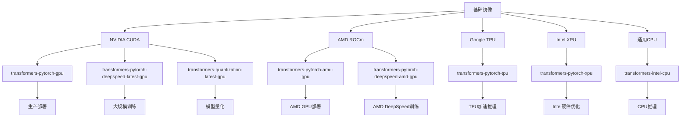
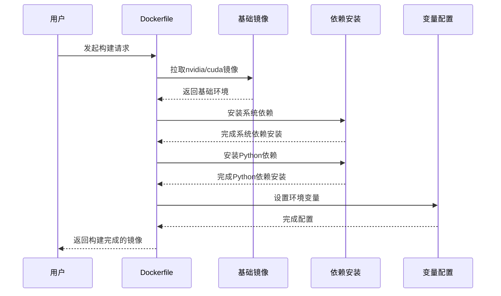
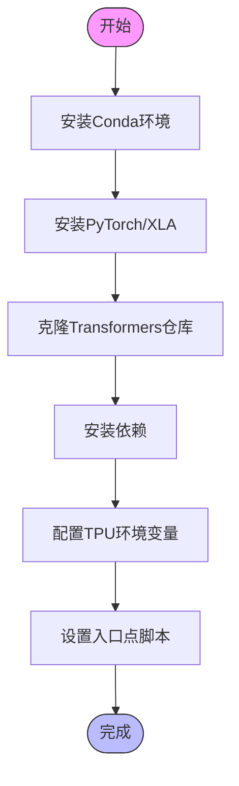
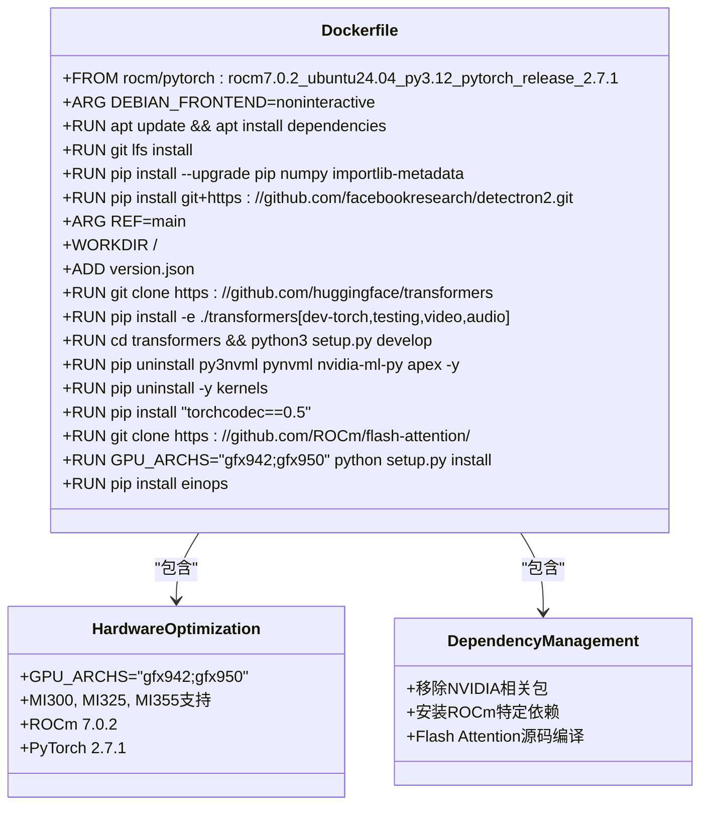
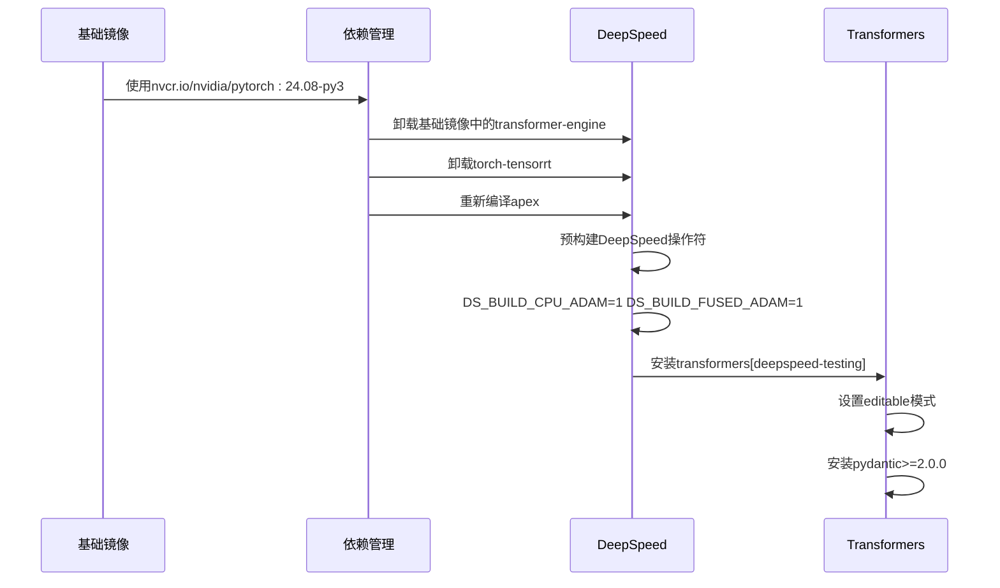
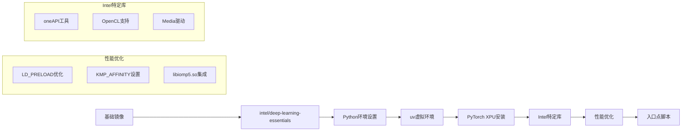
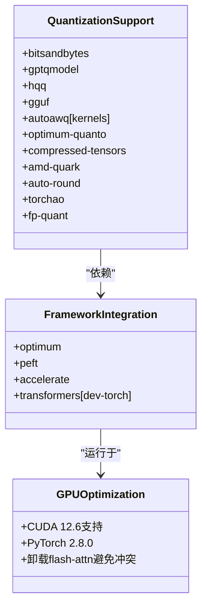
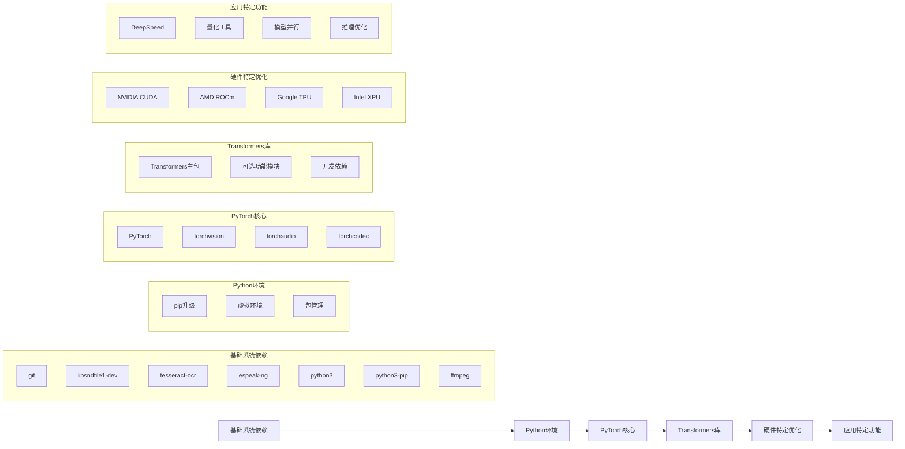

# Docker容器化部署

<cite>
**本文档中引用的文件**   
- [README.md](file://docker/README.md)
- [Dockerfile](file://docker/transformers-pytorch-gpu/Dockerfile)
- [Dockerfile](file://docker/transformers-pytorch-tpu/Dockerfile)
- [Dockerfile](file://docker/transformers-pytorch-amd-gpu/Dockerfile)
- [Dockerfile](file://docker/transformers-pytorch-deepspeed-latest-gpu/Dockerfile)
- [Dockerfile](file://docker/transformers-pytorch-xpu/Dockerfile)
- [Dockerfile](file://docker/transformers-intel-cpu/Dockerfile)
- [Dockerfile](file://docker/transformers-pytorch-deepspeed-amd-gpu/Dockerfile)
- [Dockerfile](file://docker/transformers-quantization-latest-gpu/Dockerfile)
- [docker-entrypoint.sh](file://docker/transformers-pytorch-tpu/docker-entrypoint.sh)
</cite>

## 目录
1. [简介](#简介)
2. [项目结构](#项目结构)
3. [核心组件](#核心组件)
4. [架构概述](#架构概述)
5. [详细组件分析](#详细组件分析)
6. [依赖分析](#依赖分析)
7. [性能考虑](#性能考虑)
8. [故障排除指南](#故障排除指南)
9. [结论](#结论)

## 简介
本指南详细介绍了基于Hugging Face Transformers项目的Docker容器化部署策略。文档涵盖了为不同硬件环境（包括CPU、GPU、TPU和XPU）构建优化Docker镜像的最佳实践。通过分析项目中的多种Dockerfile配置，本文提供了基础镜像选择、依赖安装、环境变量配置和多阶段构建的详细指导。此外，还提供了针对不同模型类型（NLP、CV、多模态）的Dockerfile定制建议，以及镜像大小优化、安全加固和CI/CD集成的方法。

## 项目结构
Transformers项目的Docker配置位于`docker`目录下，包含多个针对不同硬件和使用场景的子目录和Dockerfile。这些配置支持从轻量级CPU环境到高性能GPU、TPU和AMD GPU环境的全面部署需求。

```mermaid
graph TD
A[docker] --> B[transformers-all-latest-gpu]
A --> C[transformers-doc-builder]
A --> D[transformers-gpu]
A --> E[transformers-intel-cpu]
A --> F[transformers-pytorch-amd-gpu]
A --> G[transformers-pytorch-deepspeed-amd-gpu]
A --> H[transformers-pytorch-deepspeed-latest-gpu]
A --> I[transformers-pytorch-deepspeed-nightly-gpu]
A --> J[transformers-pytorch-gpu]
A --> K[transformers-pytorch-tpu]
A --> L[transformers-pytorch-xpu]
A --> M[transformers-quantization-latest-gpu]
A --> N[consistency.dockerfile]
A --> O[custom-tokenizers.dockerfile]
A --> P[examples-torch.dockerfile]
A --> Q[exotic-models.dockerfile]
A --> R[pipeline-torch.dockerfile]
A --> S[quality.dockerfile]
A --> T[torch-light.dockerfile]
```

**Diagram sources**
- [README.md](file://docker/README.md)

**Section sources**
- [README.md](file://docker/README.md)

## 核心组件
Transformers项目的Docker配置包含多个核心组件，每个组件针对特定的硬件平台和使用场景进行了优化。这些组件包括针对NVIDIA GPU、AMD GPU、Intel XPU、TPU和纯CPU环境的专用Docker镜像，以及支持DeepSpeed、量化和其他高级功能的特殊配置。

**Section sources**
- [README.md](file://docker/README.md)
- [Dockerfile](file://docker/transformers-pytorch-gpu/Dockerfile)
- [Dockerfile](file://docker/transformers-pytorch-tpu/Dockerfile)

## 架构概述
Transformers项目的Docker架构采用模块化设计，为不同硬件平台提供专门优化的镜像。架构基于分层方法，从基础CUDA/ROCm镜像开始，逐步添加特定于硬件的优化和库。

**Diagram sources**
- [Dockerfile](file://docker/transformers-pytorch-gpu/Dockerfile)
- [Dockerfile](file://docker/transformers-pytorch-amd-gpu/Dockerfile)
- [Dockerfile](file://docker/transformers-pytorch-tpu/Dockerfile)
- [Dockerfile](file://docker/transformers-pytorch-xpu/Dockerfile)
- [Dockerfile](file://docker/transformers-intel-cpu/Dockerfile)

## 详细组件分析

### GPU环境部署
针对NVIDIA GPU环境的Docker配置使用官方CUDA基础镜像，并集成PyTorch和相关依赖。配置支持通过构建参数指定PyTorch版本和CUDA版本，实现灵活的版本控制。

**Diagram sources**
- [Dockerfile](file://docker/transformers-pytorch-gpu/Dockerfile)

**Section sources**
- [Dockerfile](file://docker/transformers-pytorch-gpu/Dockerfile)

### TPU环境部署
TPU环境的Docker配置基于Google Cloud SDK镜像，使用Conda环境管理Python依赖。配置专门针对TPU硬件优化，集成了PyTorch/XLA库，并通过环境变量配置TPU连接。

**Diagram sources**
- [Dockerfile](file://docker/transformers-pytorch-tpu/Dockerfile)
- [docker-entrypoint.sh](file://docker/transformers-pytorch-tpu/docker-entrypoint.sh)

**Section sources**
- [Dockerfile](file://docker/transformers-pytorch-tpu/Dockerfile)
- [docker-entrypoint.sh](file://docker/transformers-pytorch-tpu/docker-entrypoint.sh)

### AMD GPU环境部署
AMD GPU环境的Docker配置基于ROCm平台，使用rocm/pytorch基础镜像。配置集成了ROCm特定的库和工具，并针对AMD硬件优化了Flash Attention实现。

**Diagram sources**
- [Dockerfile](file://docker/transformers-pytorch-amd-gpu/Dockerfile)

**Section sources**
- [Dockerfile](file://docker/transformers-pytorch-amd-gpu/Dockerfile)

### DeepSpeed集成
DeepSpeed集成的Docker配置专门针对大规模模型训练优化，预编译DeepSpeed操作符以避免测试超时。配置从NVIDIA PyTorch容器开始，确保最佳的GPU性能。

**Diagram sources**
- [Dockerfile](file://docker/transformers-pytorch-deepspeed-latest-gpu/Dockerfile)

**Section sources**
- [Dockerfile](file://docker/transformers-pytorch-deepspeed-latest-gpu/Dockerfile)

### Intel硬件优化
Intel XPU和CPU环境的Docker配置基于Intel Deep Learning Essentials镜像，充分利用Intel硬件特性。配置使用uv虚拟环境管理Python包，并集成Intel特定的优化库。

**Diagram sources**
- [Dockerfile](file://docker/transformers-pytorch-xpu/Dockerfile)
- [Dockerfile](file://docker/transformers-intel-cpu/Dockerfile)

**Section sources**
- [Dockerfile](file://docker/transformers-pytorch-xpu/Dockerfile)
- [Dockerfile](file://docker/transformers-intel-cpu/Dockerfile)

### 量化支持
量化支持的Docker配置集成了多种量化框架和工具，支持GPTQ、AWQ、HQQ、GGUF等多种量化格式。配置为量化模型的测试和部署提供了完整的环境。

**Diagram sources**
- [Dockerfile](file://docker/transformers-quantization-latest-gpu/Dockerfile)

**Section sources**
- [Dockerfile](file://docker/transformers-quantization-latest-gpu/Dockerfile)

## 依赖分析
Transformers项目的Docker配置展示了复杂的依赖管理策略，针对不同硬件平台优化依赖关系。通过分析不同Dockerfile的依赖安装顺序和选择，可以发现项目遵循了最佳实践。

**Diagram sources**
- [Dockerfile](file://docker/transformers-pytorch-gpu/Dockerfile)
- [Dockerfile](file://docker/transformers-pytorch-amd-gpu/Dockerfile)
- [Dockerfile](file://docker/transformers-pytorch-tpu/Dockerfile)
- [Dockerfile](file://docker/transformers-pytorch-xpu/Dockerfile)
- [Dockerfile](file://docker/transformers-quantization-latest-gpu/Dockerfile)

**Section sources**
- [Dockerfile](file://docker/transformers-pytorch-gpu/Dockerfile)
- [Dockerfile](file://docker/transformers-pytorch-amd-gpu/Dockerfile)
- [Dockerfile](file://docker/transformers-pytorch-tpu/Dockerfile)
- [Dockerfile](file://docker/transformers-pytorch-xpu/Dockerfile)
- [Dockerfile](file://docker/transformers-quantization-latest-gpu/Dockerfile)

## 性能考虑
在构建Transformers的Docker镜像时，性能优化是关键考虑因素。不同的硬件平台需要不同的优化策略，以确保最佳的推理和训练性能。

对于GPU环境，建议使用最新的CUDA工具包和驱动程序，同时预编译关键的CUDA内核（如Flash Attention）以减少运行时开销。AMD GPU环境需要特别注意ROCm版本兼容性，并针对特定的GPU架构（如MI300系列）进行优化。

TPU环境的性能优化主要集中在XLA编译器的配置和TPU网络连接的优化上。通过正确设置XRT_TPU_CONFIG环境变量，可以确保最佳的TPU利用率。

Intel硬件的性能优化涉及oneAPI工具链的集成和OpenMP线程管理。通过设置适当的KMP_AFFINITY和LD_PRELOAD变量，可以显著提高CPU和XPU的性能。

量化模型的性能优化需要平衡精度和速度。不同的量化方法（如GPTQ、AWQ、HQQ）有不同的性能特征，需要根据具体应用场景进行选择。

## 故障排除指南
在构建和运行Transformers Docker镜像时，可能会遇到各种问题。以下是一些常见问题及其解决方案：

1. **CUDA版本不兼容**：确保基础镜像的CUDA版本与PyTorch版本兼容。可以使用`nvidia/cuda:12.6.0-cudnn-devel-ubuntu22.04`等特定版本的基础镜像。

2. **ROCm包冲突**：在AMD GPU环境中，需要卸载NVIDIA相关的包（如py3nvml、pynvml、nvidia-ml-py），以避免与ROCm的冲突。

3. **TPU连接问题**：确保正确设置KUBE_GOOGLE_CLOUD_TPU_ENDPOINTS环境变量，并在entrypoint脚本中正确配置XRT_TPU_CONFIG。

4. **依赖版本冲突**：使用精确的版本指定（如`torch==2.8.0`）可以避免依赖解析问题。对于有已知问题的包，可以指定版本范围（如`pandas<2`）。

5. **构建缓存问题**：使用`ADD https://api.github.com/repos/huggingface/transformers/git/refs/heads/main version.json`可以确保当主分支有更新时重新构建缓存。

6. **内存不足**：在GitHub Actions等资源受限的环境中，可以通过设置`MAX_JOBS=1`来限制并行构建，避免内存溢出。

**Section sources**
- [Dockerfile](file://docker/transformers-pytorch-gpu/Dockerfile)
- [Dockerfile](file://docker/transformers-pytorch-amd-gpu/Dockerfile)
- [Dockerfile](file://docker/transformers-pytorch-tpu/Dockerfile)
- [docker-entrypoint.sh](file://docker/transformers-pytorch-tpu/docker-entrypoint.sh)

## 结论
Hugging Face Transformers项目的Docker配置提供了一套全面的容器化部署解决方案，支持从CPU到GPU、TPU和专用AI加速器的多种硬件平台。通过分析这些Dockerfile，我们可以学习到为不同硬件环境构建优化镜像的最佳实践。

关键要点包括：选择合适的基础镜像、合理安排依赖安装顺序、使用构建参数实现灵活性、针对特定硬件进行优化，以及实施有效的故障排除策略。这些实践不仅适用于Transformers项目，也可以推广到其他机器学习框架的容器化部署中。

通过遵循这些指南，开发者可以构建高效、可靠且可重复的Docker镜像，为机器学习模型的开发、测试和部署提供坚实的基础。