# 可扩展性设计

<cite>
**本文档中引用的文件**
- [continuous_batching.py](file://examples/pytorch/continuous_batching.py)
- [continuous_batching_simple.py](file://examples/pytorch/continuous_batching_simple.py)
- [continuous_api.py](file://src/transformers/generation/continuous_batching/continuous_api.py)
- [cache.py](file://src/transformers/generation/continuous_batching/cache.py)
- [scheduler.py](file://src/transformers/generation/continuous_batching/scheduler.py)
- [cache_manager.py](file://src/transformers/generation/continuous_batching/cache_manager.py)
- [metrics.py](file://src/transformers/utils/metrics.py)
- [docker-compose.yml](file://examples/metrics-monitoring/docker-compose.yml)
- [prometheus.yml](file://examples/metrics-monitoring/prometheus.yml)
- [grafana-dashboard.yaml](file://examples/metrics-monitoring/grafana-dashboard.yaml)
</cite>

## 目录
1. [简介](#简介)
2. [项目结构](#项目结构)
3. [核心组件](#核心组件)
4. [架构概览](#架构概览)
5. [详细组件分析](#详细组件分析)
6. [扩展策略](#扩展策略)
7. [监控与指标](#监控与指标)
8. [部署配置](#部署配置)
9. [性能优化](#性能优化)
10. [故障排除指南](#故障排除指南)
11. [结论](#结论)

## 简介

本指南深入探讨了基于transformers库中continuous_batching模块的可扩展性设计，重点关注高吞吐量模型服务架构的实现。该系统通过连续批处理技术实现了高效的GPU资源利用，支持水平扩展、垂直扩展和自动扩展策略，为大规模AI推理服务提供了完整的解决方案。

连续批处理系统的核心优势在于：
- **内存效率**：通过分页注意力机制最大化GPU内存利用率
- **吞吐量提升**：批量处理多个请求以减少GPU空闲时间
- **延迟优化**：智能调度算法确保低TTFT（首字时间）
- **弹性扩展**：支持动态扩缩容和故障恢复

## 项目结构

连续批处理系统的文件组织遵循模块化设计原则，主要分为以下几个层次：

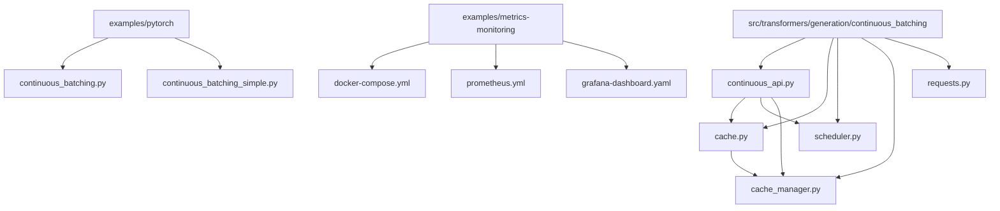

**图表来源**
- [continuous_batching.py](file://examples/pytorch/continuous_batching.py#L1-L50)
- [continuous_api.py](file://src/transformers/generation/continuous_batching/continuous_api.py#L1-L100)

**章节来源**
- [continuous_batching.py](file://examples/pytorch/continuous_batching.py#L1-L302)
- [continuous_api.py](file://src/transformers/generation/continuous_batching/continuous_api.py#L1-L1164)

## 核心组件

### 连续批处理管理器（ContinuousBatchingManager）

连续批处理管理器是用户接口层，负责协调整个批处理流程：

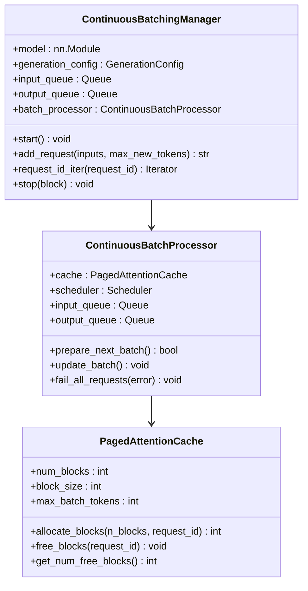

**图表来源**
- [continuous_api.py](file://src/transformers/generation/continuous_batching/continuous_api.py#L729-L850)
- [continuous_api.py](file://src/transformers/generation/continuous_batching/continuous_api.py#L180-L250)
- [cache.py](file://src/transformers/generation/continuous_batching/cache.py#L100-L200)

### 分页注意力缓存系统

分页注意力缓存是内存管理的核心，采用三层次架构：

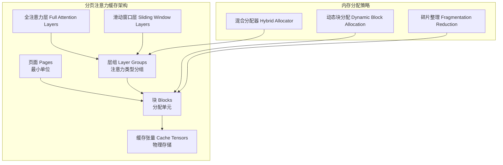

**图表来源**
- [cache.py](file://src/transformers/generation/continuous_batching/cache.py#L100-L300)
- [cache_manager.py](file://src/transformers/generation/continuous_batching/cache_manager.py#L50-L150)

**章节来源**
- [continuous_api.py](file://src/transformers/generation/continuous_batching/continuous_api.py#L729-L1164)
- [cache.py](file://src/transformers/generation/continuous_batching/cache.py#L1-L604)

## 架构概览

连续批处理系统采用多线程异步架构，支持高并发请求处理：

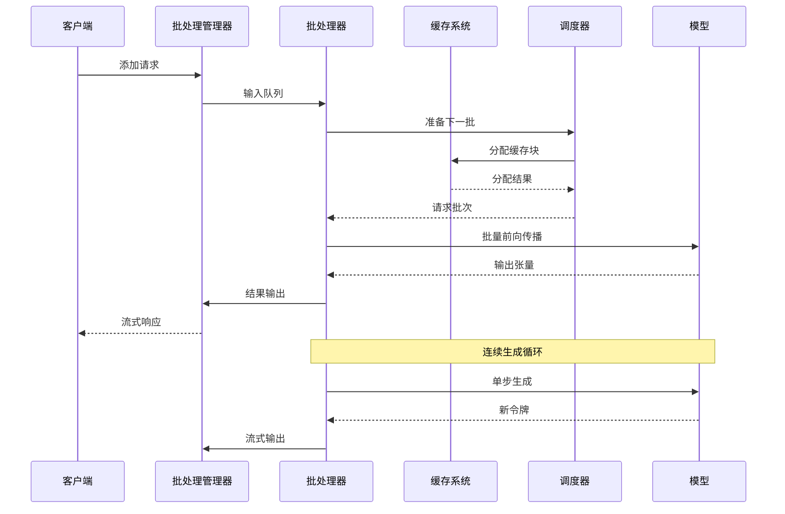

**图表来源**
- [continuous_api.py](file://src/transformers/generation/continuous_batching/continuous_api.py#L850-L950)
- [continuous_api.py](file://src/transformers/generation/continuous_batching/continuous_api.py#L250-L350)

## 详细组件分析

### 调度算法

系统提供两种主要调度策略：

#### FIFO调度器（FIFOScheduler）

FIFO调度器按请求到达顺序处理，优先考虑解码请求：

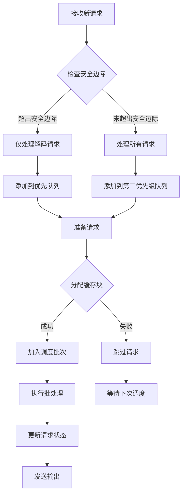

**图表来源**
- [scheduler.py](file://src/transformers/generation/continuous_batching/scheduler.py#L150-L250)

#### 预填充优先调度器（PrefillFirstScheduler）

预填充优先调度器优先处理分割的预填充请求：

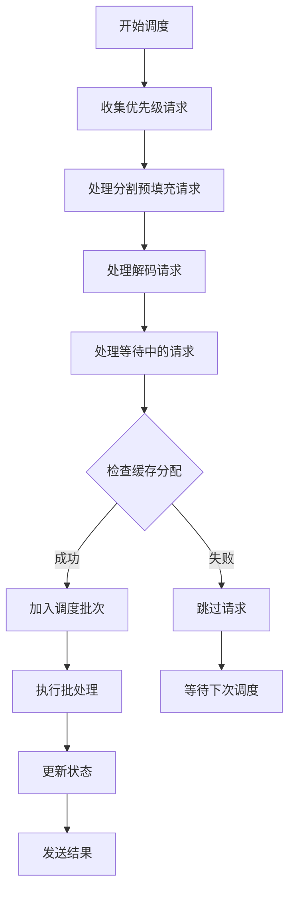

**图表来源**
- [scheduler.py](file://src/transformers/generation/continuous_batching/scheduler.py#L250-L300)

**章节来源**
- [scheduler.py](file://src/transformers/generation/continuous_batching/scheduler.py#L1-L300)

### 内存管理策略

#### 分页缓存分配器

系统采用混合分配策略，根据注意力类型分组管理缓存：

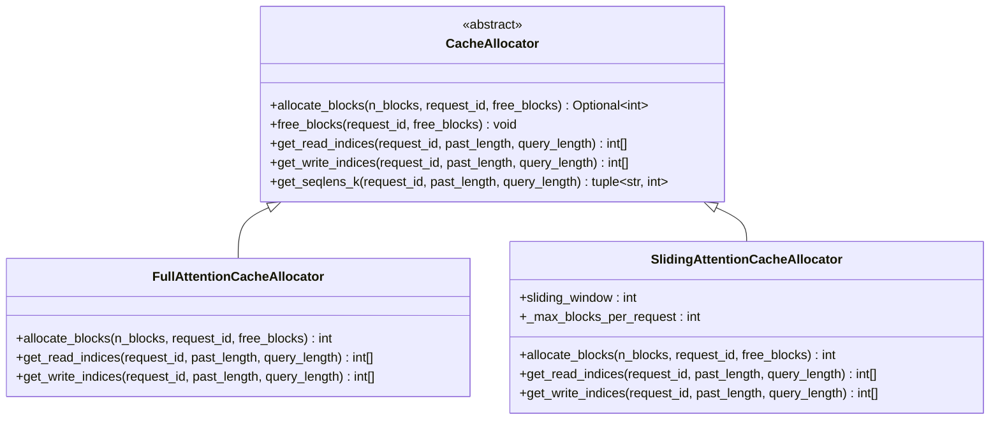

**图表来源**
- [cache_manager.py](file://src/transformers/generation/continuous_batching/cache_manager.py#L20-L100)
- [cache_manager.py](file://src/transformers/generation/continuous_batching/cache_manager.py#L100-L200)

**章节来源**
- [cache_manager.py](file://src/transformers/generation/continuous_batching/cache_manager.py#L1-L223)

### CUDA图优化

为了进一步提升性能，系统支持CUDA图优化：

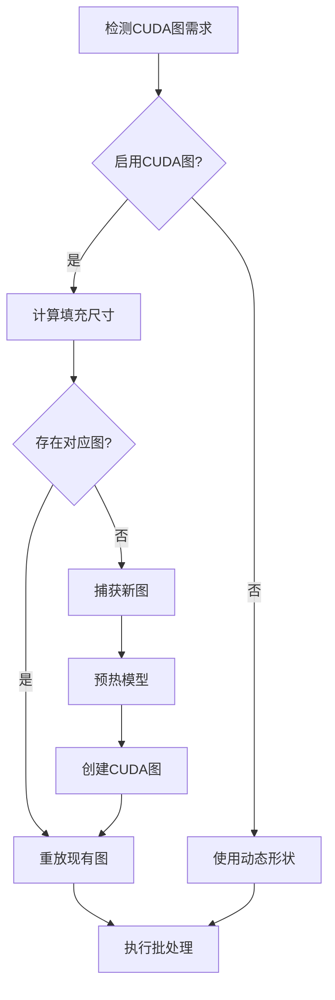

**图表来源**
- [continuous_api.py](file://src/transformers/generation/continuous_batching/continuous_api.py#L650-L750)

**章节来源**
- [continuous_api.py](file://src/transformers/generation/continuous_batching/continuous_api.py#L650-L850)

## 扩展策略

### 水平扩展

水平扩展通过增加实例数量来提升系统容量：

#### 多实例部署架构

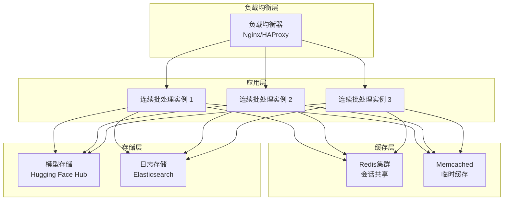

#### 自动扩缩容策略

| 扩展维度 | 触发条件 | 扩容动作 | 缩容条件 |
|---------|---------|---------|---------|
| 实例数量 | CPU使用率 > 80% | 增加1个实例 | CPU使用率 < 30% |
| GPU资源 | GPU内存使用率 > 85% | 启动新实例 | GPU空闲率 > 60% |
| 批处理大小 | 请求排队时间 > 500ms | 增大批次大小 | TTFT < 100ms |
| 缓存容量 | 缓存命中率 < 70% | 增加缓存块数 | 命中率 > 90% |

### 垂直扩展

垂直扩展通过提升单机资源配置来增强性能：

#### GPU资源配置优化

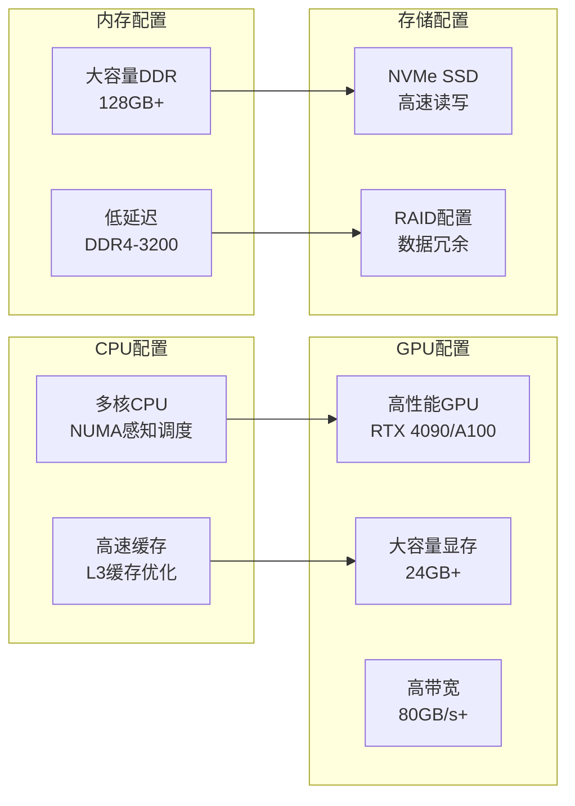

### 自动扩展配置

#### Kubernetes自动扩缩容

```yaml
apiVersion: autoscaling/v2
kind: HorizontalPodAutoscaler
metadata:
  name: transformers-hpa
spec:
  scaleTargetRef:
    apiVersion: apps/v1
    kind: Deployment
    name: transformers-deployment
  minReplicas: 2
  maxReplicas: 10
  metrics:
  - type: Resource
    resource:
      name: cpu
      target:
        type: Utilization
        averageUtilization: 70
  - type: Resource
    resource:
      name: memory
      target:
        type: Utilization
        averageUtilization: 80
  behavior:
    scaleDown:
      stabilizationWindowSeconds: 300
      policies:
      - type: Percent
        value: 50
        periodSeconds: 60
    scaleUp:
      stabilizationWindowSeconds: 60
      policies:
      - type: Percent
        value: 100
        periodSeconds: 60
```

## 监控与指标

### 关键性能指标（KPI）

系统提供全面的监控指标体系：

| 指标类别 | 具体指标 | 监控目的 | 告警阈值 |
|---------|---------|---------|---------|
| 性能指标 | TTFT (首字时间) | 延迟优化 | < 100ms |
| 性能指标 | 吞吐量 (tokens/s) | 容量规划 | > 1000 tok/s |
| 性能指标 | 批处理效率 | 资源利用率 | > 85% |
| 资源指标 | GPU内存使用率 | 内存管理 | < 90% |
| 资源指标 | CPU使用率 | 计算资源 | < 80% |
| 资源指标 | 缓存命中率 | 缓存优化 | > 85% |
| 错误指标 | 请求失败率 | 系统稳定性 | < 1% |
| 错误指标 | 平均响应时间 | 用户体验 | < 500ms |

### 监控架构

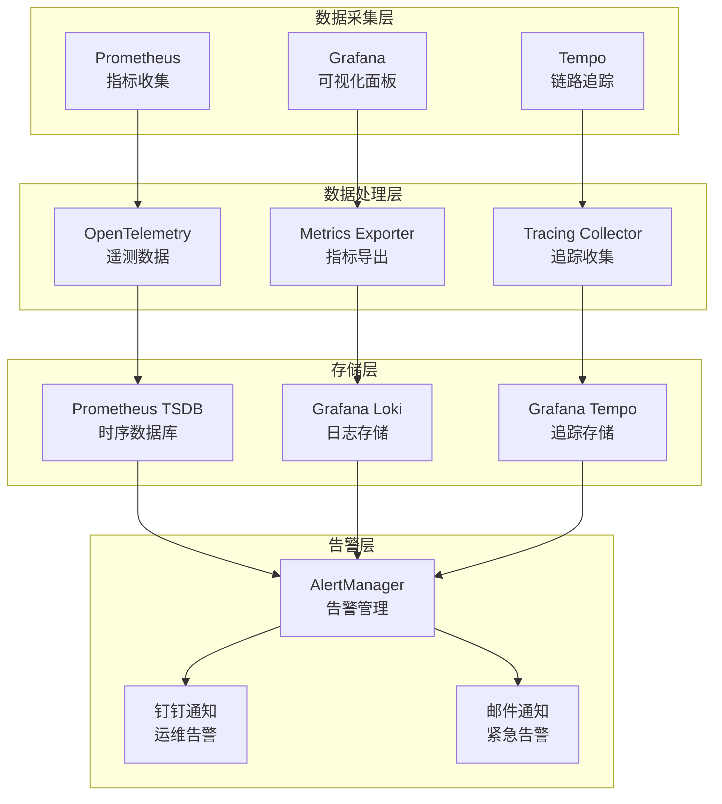

**图表来源**
- [docker-compose.yml](file://examples/metrics-monitoring/docker-compose.yml#L1-L56)
- [metrics.py](file://src/transformers/utils/metrics.py#L150-L200)

### Prometheus配置

系统集成了完整的Prometheus监控栈：

```yaml
global:
  scrape_interval: 15s
  
scrape_configs:
  - job_name: 'transformers-cb'
    static_configs:
      - targets: ['localhost:9090']
    metrics_path: '/metrics'
    scrape_interval: 5s
    
  - job_name: 'otlp-metrics'
    static_configs:
      - targets: ['prometheus:4317']
    metrics_path: '/v1/metrics'
    scrape_interval: 10s
```

**章节来源**
- [metrics.py](file://src/transformers/utils/metrics.py#L1-L200)
- [prometheus.yml](file://examples/metrics-monitoring/prometheus.yml#L1-L1)

## 部署配置

### Docker Compose部署

系统提供了完整的容器化部署方案：

```yaml
version: '3.8'

services:
  transformers-cb:
    image: transformers-continuous-batching:latest
    ports:
      - "8080:8080"
    environment:
      - CUDA_VISIBLE_DEVICES=0,1,2,3
      - MAX_BATCH_TOKENS=2048
      - NUM_BLOCKS=1024
      - BLOCK_SIZE=32
      - SAFETY_MARGIN=0.2
    volumes:
      - ./models:/app/models
      - ./logs:/app/logs
    deploy:
      resources:
        reservations:
          devices:
            - driver: nvidia
              count: all
              capabilities: [gpu]
    restart: unless-stopped
    
  prometheus:
    image: prom/prometheus:latest
    ports:
      - "9090:9090"
    volumes:
      - ./prometheus.yml:/etc/prometheus/prometheus.yml
    command:
      - '--config.file=/etc/prometheus/prometheus.yml'
      - '--storage.tsdb.path=/prometheus'
      - '--web.console.libraries=/usr/share/prometheus/console_libraries'
      - '--web.console.templates=/usr/share/prometheus/consoles'
    
  grafana:
    image: grafana/grafana:latest
    ports:
      - "3000:3000"
    volumes:
      - ./dashboards:/etc/grafana/provisioning/dashboards
      - ./datasources:/etc/grafana/provisioning/datasources
    environment:
      - GF_SECURITY_ADMIN_PASSWORD=admin
      - GF_USERS_ALLOW_SIGN_UP=false
    depends_on:
      - prometheus
```

### 环境变量配置

| 环境变量 | 默认值 | 描述 | 影响范围 |
|---------|--------|------|---------|
| CUDA_VISIBLE_DEVICES | all | 可见GPU设备 | GPU资源分配 |
| MAX_BATCH_TOKENS | 2048 | 最大批次令牌数 | 内存使用量 |
| NUM_BLOCKS | 1024 | 缓存块总数 | 缓存容量 |
| BLOCK_SIZE | 32 | 块大小 | 内存对齐 |
| SAFETY_MARGIN | 0.2 | 安全边际比例 | 请求调度 |
| MAX_MEMORY_PERCENT | 0.9 | 最大内存使用率 | 内存限制 |
| USE_CUDA_GRAPH | false | 是否启用CUDA图 | 性能优化 |

### Kubernetes部署配置

#### Deployment配置

```yaml
apiVersion: apps/v1
kind: Deployment
metadata:
  name: transformers-continuous-batching
  labels:
    app: transformers-cb
spec:
  replicas: 3
  selector:
    matchLabels:
      app: transformers-cb
  template:
    metadata:
      labels:
        app: transformers-cb
    spec:
      containers:
      - name: transformers-cb
        image: transformers-continuous-batching:latest
        ports:
        - containerPort: 8080
        env:
        - name: CUDA_VISIBLE_DEVICES
          value: "0,1"
        - name: MAX_BATCH_TOKENS
          value: "2048"
        - name: NUM_BLOCKS
          value: "1024"
        resources:
          limits:
            nvidia.com/gpu: 2
            memory: 32Gi
            cpu: 8
          requests:
            nvidia.com/gpu: 2
            memory: 16Gi
            cpu: 4
        volumeMounts:
        - name: models
          mountPath: /app/models
        - name: logs
          mountPath: /app/logs
      volumes:
      - name: models
        persistentVolumeClaim:
          claimName: models-pvc
      - name: logs
        persistentVolumeClaim:
          claimName: logs-pvc
```

**章节来源**
- [docker-compose.yml](file://examples/metrics-monitoring/docker-compose.yml#L1-L56)

## 性能优化

### 内存优化策略

#### 动态内存分配

系统采用智能内存分配算法，根据实际需求动态调整缓存大小：

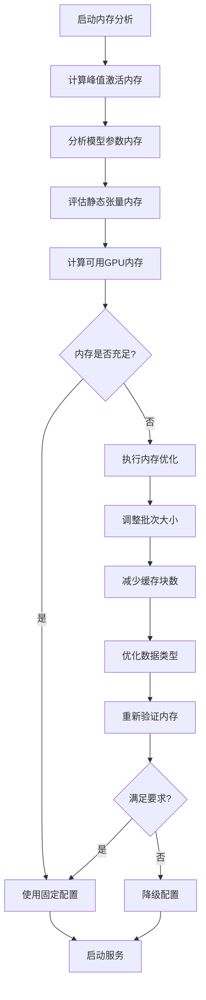

**图表来源**
- [cache.py](file://src/transformers/generation/continuous_batching/cache.py#L400-L500)

#### 数据类型优化

| 优化技术 | 内存节省 | 性能影响 | 适用场景 |
|---------|---------|---------|---------|
| BF16精度 | 50% | 微小损失 | 推理服务 |
| INT8量化 | 75% | 显著损失 | 边缘设备 |
| 动态量化 | 25-50% | 中等损失 | 平衡需求 |
| 混合精度 | 25% | 轻微损失 | 高精度要求 |

### 计算优化策略

#### CUDA图优化

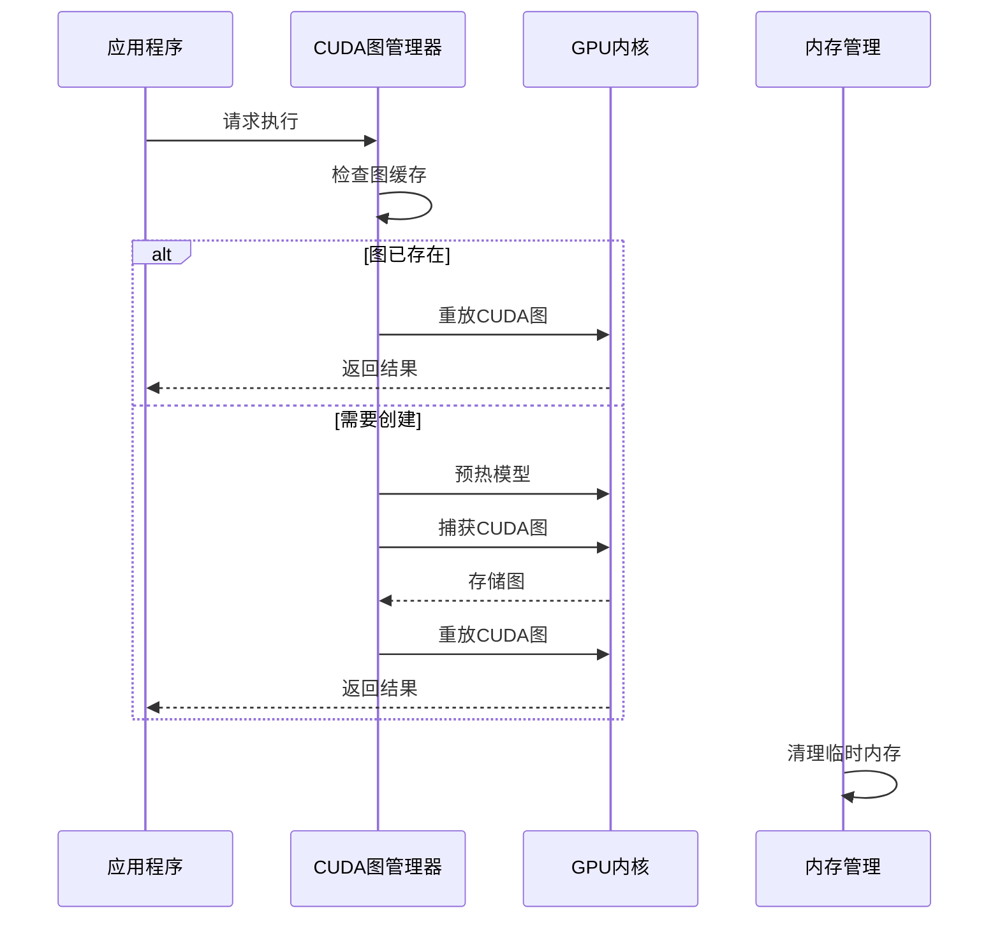

**图表来源**
- [continuous_api.py](file://src/transformers/generation/continuous_batching/continuous_api.py#L650-L750)

#### 注意力优化

系统支持多种注意力实现，可根据硬件特性选择最优方案：

| 注意力实现 | 优势 | 适用场景 | 性能特点 |
|-----------|------|---------|---------|
| Flash Attention | 高吞吐量 | 长序列 | O(n)复杂度 |
| Paged Attention | 内存效率 | 大模型 | 分页管理 |
| SDPA | 硬件加速 | 现代GPU | 硬件优化 |
| 自定义内核 | 定制优化 | 特殊需求 | 精细控制 |

**章节来源**
- [continuous_api.py](file://src/transformers/generation/continuous_batching/continuous_api.py#L650-L850)

## 故障排除指南

### 常见问题诊断

#### 内存不足错误

**症状**：`RuntimeError: CUDA out of memory`

**诊断步骤**：
1. 检查GPU内存使用情况
2. 分析当前批次大小
3. 查看缓存分配状态
4. 监控内存增长趋势

**解决方案**：
```python
# 减少批次大小
generation_config.max_batch_tokens = 1024

# 增加安全边际
scheduler.safety_margin = 0.3

# 启用手动回收
manager.manual_eviction = True
```

#### 性能下降问题

**症状**：吞吐量显著降低，TTFT增加

**诊断流程**：
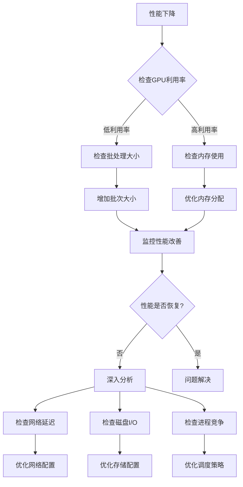

#### 负载不均衡问题

**症状**：某些实例负载过高，其他实例空闲

**解决方案**：
1. 检查负载均衡算法
2. 调整健康检查间隔
3. 优化实例权重分配
4. 实施主动故障转移

### 容量规划方法

#### 基于历史数据的预测

```python
def capacity_planning(historical_data, forecast_horizon):
    """
    基于历史数据进行容量规划
    """
    # 计算历史峰值
    peak_throughput = historical_data['throughput'].max()
    peak_memory = historical_data['memory_usage'].max()
    
    # 考虑增长因子
    growth_factor = 1.2
    projected_peak = {
        'throughput': peak_throughput * growth_factor,
        'memory': peak_memory * growth_factor
    }
    
    # 计算所需资源
    required_resources = {
        'instances': calculate_instances(projected_peak['throughput']),
        'gpu_memory': calculate_gpu_memory(projected_peak['memory'])
    }
    
    return required_resources
```

#### 动态容量调整

| 调整维度 | 触发条件 | 调整幅度 | 回调机制 |
|---------|---------|---------|---------|
| 实例数量 | 延迟 > 500ms | +1个实例 | 延迟 < 200ms时 |
| 批次大小 | 内存使用率 > 80% | -25% | 使用率 < 60%时 |
| 缓存大小 | 命中率 < 70% | +10% | 命中率 > 85%时 |
| 并发连接 | 连接数 > 阈值 | +20% | 连接数 < 阈值×0.8时 |

**章节来源**
- [continuous_api.py](file://src/transformers/generation/continuous_batching/continuous_api.py#L950-L1164)

## 结论

基于transformers库的连续批处理系统提供了一个完整、高效的可扩展性解决方案。通过精心设计的架构和优化策略，该系统能够在各种规模的应用场景中提供稳定、高性能的服务。

### 主要优势

1. **高度可扩展性**：支持水平、垂直和自动扩展策略
2. **内存效率**：分页注意力机制最大化GPU内存利用率
3. **性能优化**：CUDA图、混合精度等多重优化技术
4. **监控完善**：集成Prometheus、Grafana等监控工具
5. **部署灵活**：支持Docker、Kubernetes等多种部署方式

### 最佳实践建议

1. **容量规划**：基于历史数据和业务增长预期进行合理规划
2. **监控告警**：建立完善的监控体系和自动化告警机制
3. **性能调优**：定期分析性能指标，持续优化配置参数
4. **故障预案**：制定详细的故障处理和恢复预案
5. **版本管理**：建立规范的版本发布和回滚机制

通过遵循本指南的最佳实践，可以构建一个能够应对流量波动、具备高可用性和良好用户体验的弹性AI推理服务平台。