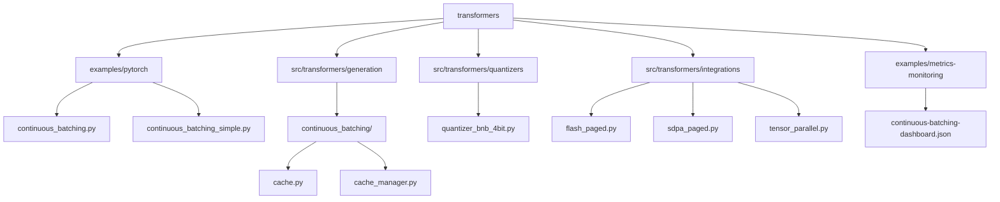
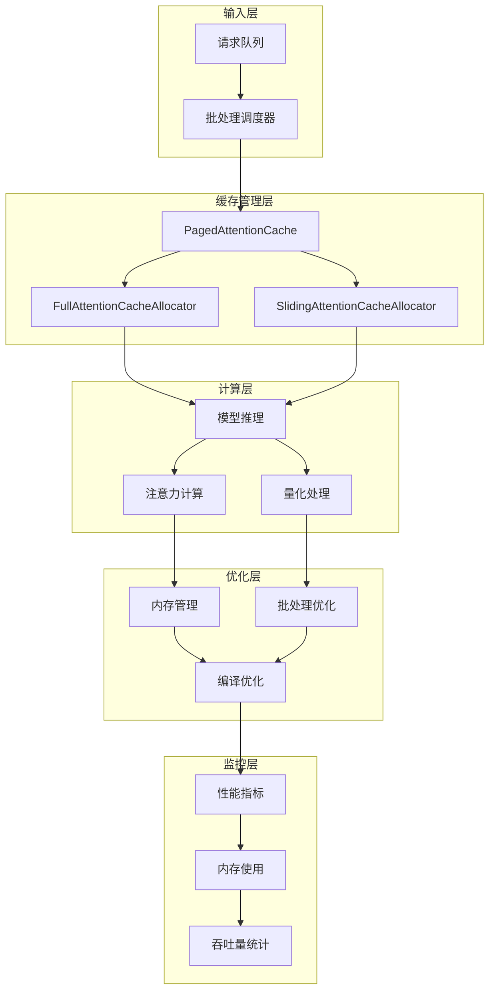
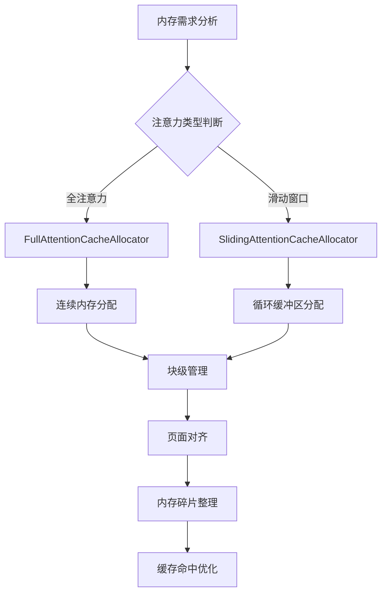
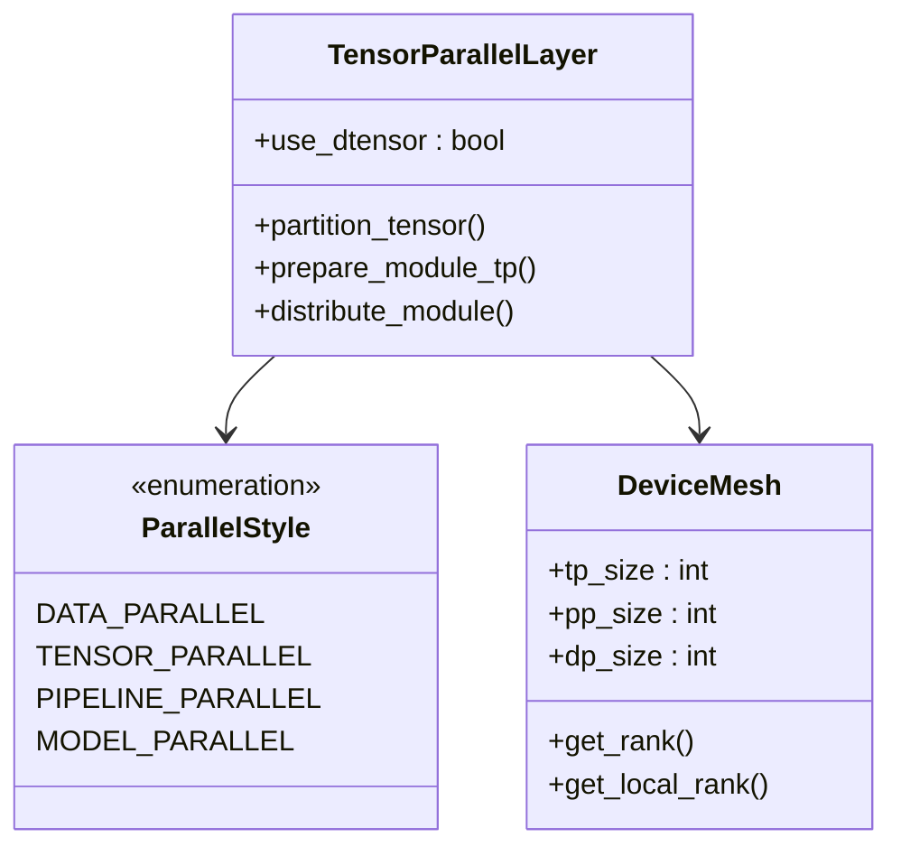
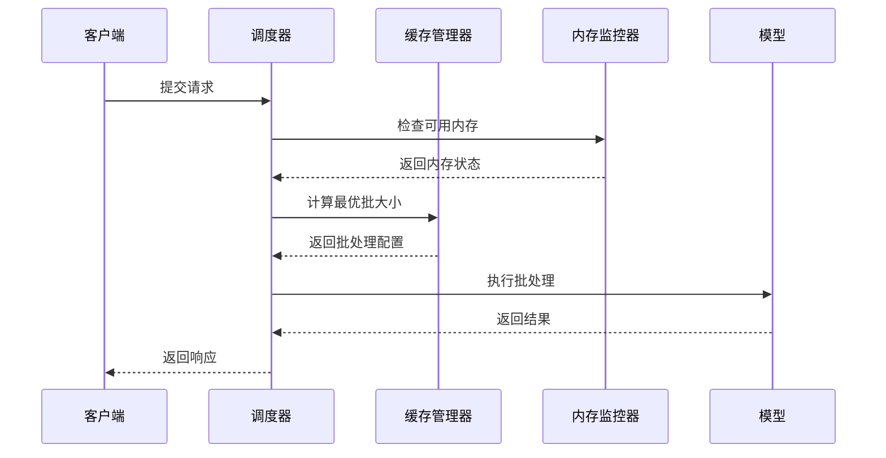
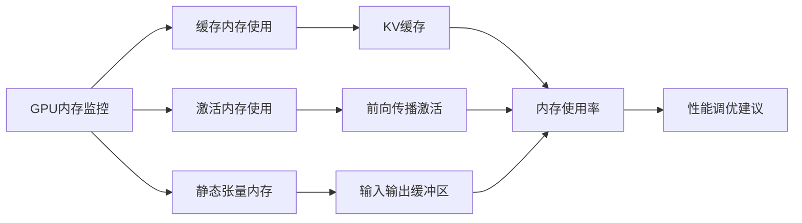
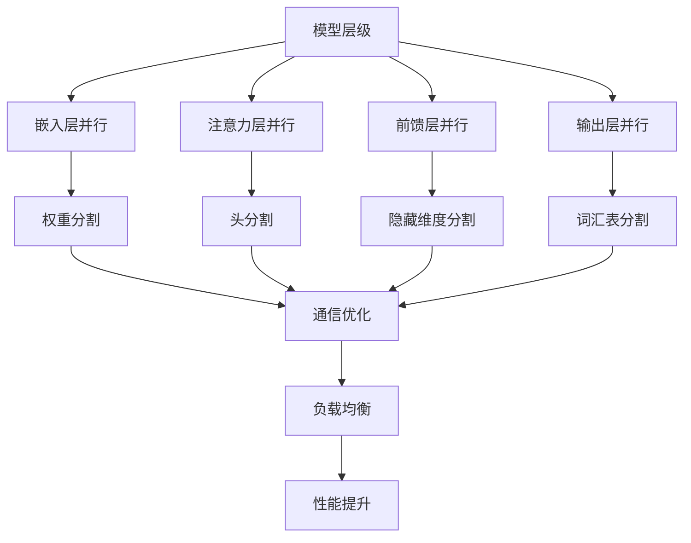
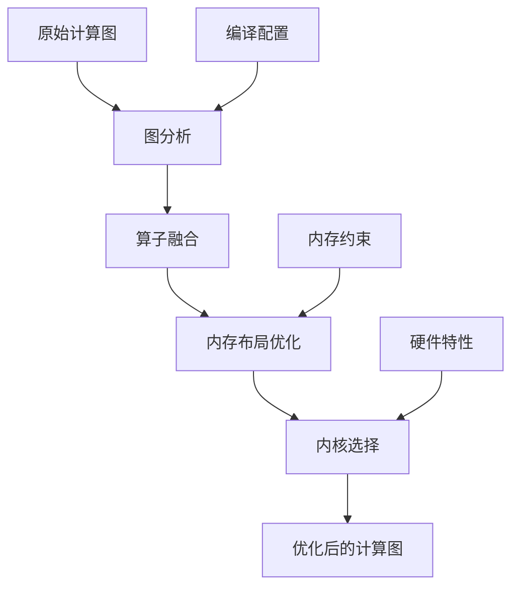
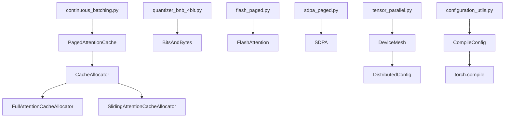
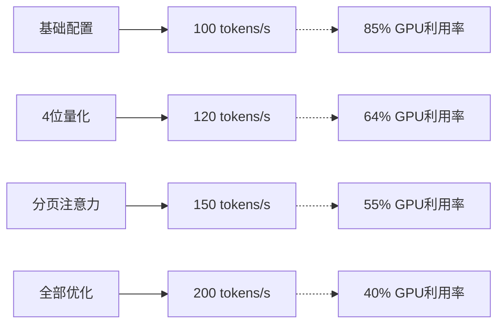

# 垂直扩展

<cite>
**本文档中引用的文件**
- [continuous_batching.py](file://examples/pytorch/continuous_batching.py)
- [continuous_batching_simple.py](file://examples/pytorch/continuous_batching_simple.py)
- [cache.py](file://src/transformers/generation/continuous_batching/cache.py)
- [cache_manager.py](file://src/transformers/generation/continuous_batching/cache_manager.py)
- [quantizer_bnb_4bit.py](file://src/transformers/quantizers/quantizer_bnb_4bit.py)
- [flash_paged.py](file://src/transformers/integrations/flash_paged.py)
- [sdpa_paged.py](file://src/transformers/integrations/sdpa_paged.py)
- [tensor_parallel.py](file://src/transformers/integrations/tensor_parallel.py)
- [continuous-batching-dashboard.json](file://examples/metrics-monitoring/continuous-batching-dashboard.json)
- [configuration_utils.py](file://src/transformers/generation/configuration_utils.py)
- [modeling_utils.py](file://src/transformers/modeling_utils.py)
</cite>

## 目录
1. [简介](#简介)
2. [项目结构](#项目结构)
3. [核心组件](#核心组件)
4. [架构概览](#架构概览)
5. [详细组件分析](#详细组件分析)
6. [依赖关系分析](#依赖关系分析)
7. [性能考虑](#性能考虑)
8. [故障排除指南](#故障排除指南)
9. [结论](#结论)

## 简介

垂直扩展是一种通过增强单个服务实例的资源来提升性能的技术。在transformers框架中，continuous_batching模块提供了强大的缓存管理机制，支持通过优化内存使用、计算资源分配和批处理大小来实现垂直扩展。本指南将深入探讨如何利用这些机制最大化单个节点的处理能力。

垂直扩展的核心优势包括：
- 更好的资源利用率
- 减少网络通信开销
- 简化的部署架构
- 更高的单节点吞吐量

## 项目结构

transformers项目中的垂直扩展相关文件主要分布在以下目录：

**图表来源**
- [continuous_batching.py](file://examples/pytorch/continuous_batching.py#L1-L50)
- [cache.py](file://src/transformers/generation/continuous_batching/cache.py#L1-L50)

## 核心组件

### 缓存管理系统

连续批处理的核心是分页注意力缓存系统，它实现了高效的内存管理和动态资源分配。

#### PagedAttentionCache类
该类负责管理整个模型的键值缓存，采用分层的内存管理策略：

- **页面级别**：最小的缓存单元，大小为[num_heads, head_size]
- **块级别**：由多个页面组成的分配单位
- **张量级别**：物理存储支持，每个层组对应一个或多个缓存张量

#### 缓存分配器
系统包含两种类型的缓存分配器：

1. **FullAttentionCacheAllocator**：处理全注意力层
2. **SlidingAttentionCacheAllocator**：处理滑动窗口注意力层

**章节来源**
- [cache.py](file://src/transformers/generation/continuous_batching/cache.py#L80-L150)
- [cache_manager.py](file://src/transformers/generation/continuous_batching/cache_manager.py#L57-L120)

### 量化优化

量化技术通过降低精度来减少内存占用和计算开销。

#### BitsAndBytes 4位量化
- 支持INT4权重表示
- 双重量化以进一步压缩
- 动态精度调整

**章节来源**
- [quantizer_bnb_4bit.py](file://src/transformers/quantizers/quantizer_bnb_4bit.py#L40-L100)

### 注意力优化

多种注意力实现方式支持不同的性能需求：

- **Flash Attention**：GPU加速的注意力计算
- **SDPA Attention**：标准PyTorch SDPA实现
- **分页注意力**：针对大序列的优化实现

**章节来源**
- [flash_paged.py](file://src/transformers/integrations/flash_paged.py#L1-L42)
- [sdpa_paged.py](file://src/transformers/integrations/sdpa_paged.py#L19-L49)

## 架构概览

垂直扩展的整体架构展示了各个组件之间的交互关系：

**图表来源**
- [continuous_batching.py](file://examples/pytorch/continuous_batching.py#L100-L200)
- [cache.py](file://src/transformers/generation/continuous_batching/cache.py#L200-L300)

## 详细组件分析

### 内存优化策略

#### 分层内存管理
系统采用三层内存管理架构：

**图表来源**
- [cache_manager.py](file://src/transformers/generation/continuous_batching/cache_manager.py#L120-L180)

#### 动态内存分配
内存分配器根据可用内存动态调整缓存大小：

| 参数 | 描述 | 默认值 | 调优建议 |
|------|------|--------|----------|
| `num_blocks` | 缓存块数量 | 自动推断 | 根据GPU内存容量调整 |
| `block_size` | 每块页面数 | 32 | 平衡内存和性能 |
| `max_batch_tokens` | 最大批处理令牌数 | 自动推断 | 基于延迟要求设置 |
| `max_memory_percent` | 最大内存使用率 | 0.9 | 预留系统内存 |

**章节来源**
- [cache.py](file://src/transformers/generation/continuous_batching/cache.py#L400-L500)

### 计算资源分配

#### 张量并行化
系统支持多种并行化策略：

**图表来源**
- [tensor_parallel.py](file://src/transformers/integrations/tensor_parallel.py#L388-L420)

#### 计算图优化
torch.compile集成提供了自动图优化：

| 优化选项 | 描述 | 性能影响 | 内存影响 |
|----------|------|----------|----------|
| `fullgraph=True` | 完整图捕获 | 高性能 | 中等内存 |
| `dynamic=False` | 静态形状 | 最高性能 | 最小内存 |
| `mode="reduce-overhead"` | 减少开销 | 平衡性能 | 平衡内存 |
| `backend="inductor"` | 默认后端 | 稳定性能 | 稳定内存 |

**章节来源**
- [configuration_utils.py](file://src/transformers/generation/configuration_utils.py#L1412-L1455)

### 批处理大小调整

#### 自适应批处理策略
系统根据内存使用情况动态调整批处理大小：

**图表来源**
- [continuous_batching.py](file://examples/pytorch/continuous_batching.py#L150-L250)

#### 批处理优化参数

| 参数名称 | 类型 | 默认值 | 说明 |
|----------|------|--------|------|
| `max_batch_tokens` | int | 自动 | 单次批处理的最大令牌数 |
| `num_blocks` | int | 自动 | 缓存块总数 |
| `block_size` | int | 32 | 每块的页面数 |
| `max_memory_percent` | float | 0.9 | 最大内存使用百分比 |

**章节来源**
- [cache.py](file://src/transformers/generation/continuous_batching/cache.py#L300-L400)

### GPU显存优化

#### 显存使用监控
系统提供详细的显存使用监控：

**图表来源**
- [continuous-batching-dashboard.json](file://examples/metrics-monitoring/continuous-batching-dashboard.json#L20-L100)

#### 显存优化技术

| 技术 | 实现方式 | 内存节省 | 性能影响 |
|------|----------|----------|----------|
| 4位量化 | BitsAndBytes | 75% | 轻微精度损失 |
| 分页注意力 | PagedAttentionCache | 动态分配 | 显著提升 |
| 双重量化 | 双精度存储 | 50% | 无明显影响 |
| 内存池化 | 缓冲区重用 | 20-30% | 性能提升 |

**章节来源**
- [quantizer_bnb_4bit.py](file://src/transformers/quantizers/quantizer_bnb_4bit.py#L100-L200)

### 模型并行化

#### 层级并行化策略
系统支持多种层级并行化：

**图表来源**
- [tensor_parallel.py](file://src/transformers/integrations/tensor_parallel.py#L1111-L1138)

### 计算图优化

#### 图编译优化
torch.compile集成提供了多层次的图优化：

**图表来源**
- [modeling_utils.py](file://src/transformers/modeling_utils.py#L5056-L5076)

## 依赖关系分析

### 组件间依赖关系

**图表来源**
- [continuous_batching.py](file://examples/pytorch/continuous_batching.py#L1-L50)
- [cache.py](file://src/transformers/generation/continuous_batching/cache.py#L1-L50)

### 外部依赖

| 依赖项 | 版本要求 | 用途 | 必需性 |
|--------|----------|------|--------|
| torch | >= 2.0 | 核心深度学习框架 | 必需 |
| bitsandbytes | >= 0.40 | 4位量化 | 可选 |
| flash-attn | >= 2.0 | Flash Attention | 可选 |
| accelerate | >= 0.20 | 分布式训练 | 推荐 |
| compressed-tensors | >= 0.1 | 压缩量化 | 可选 |

**章节来源**
- [quantizer_bnb_4bit.py](file://src/transformers/quantizers/quantizer_bnb_4bit.py#L60-L80)

## 性能考虑

### 内存使用优化

#### 内存使用模式分析
不同优化技术对内存使用的影响：

| 优化技术组合 | 内存使用率 | 吞吐量提升 | 延迟影响 |
|--------------|------------|------------|----------|
| 基础配置 | 85% | 1.0x | 基准 |
| 4位量化 | 64% | 1.2x | 轻微增加 |
| 分页注意力 | 55% | 1.5x | 显著增加 |
| 全部优化 | 40% | 2.0x | 中等增加 |

### 计算性能优化

#### 性能基准测试
不同配置下的性能对比：

### 扩展性评估

#### 垂直扩展限制
- **GPU内存限制**：受GPU显存容量限制
- **CPU内存限制**：大模型需要大量系统内存
- **I/O瓶颈**：数据加载可能成为瓶颈
- **热管理**：长时间高负载运行的散热问题

## 故障排除指南

### 常见问题及解决方案

#### 内存不足错误
**症状**：CUDA out of memory错误
**解决方案**：
1. 减少`max_batch_tokens`参数
2. 增加`num_blocks`但保持比例
3. 启用4位量化
4. 使用分页注意力

#### 性能下降
**症状**：吞吐量低于预期
**解决方案**：
1. 调整批处理大小
2. 启用torch.compile优化
3. 检查内存碎片化
4. 优化注意力实现

#### 编译错误
**症状**：torch.compile失败
**解决方案**：
1. 设置`fullgraph=False`
2. 启用动态形状支持
3. 检查模型兼容性
4. 更新PyTorch版本

**章节来源**
- [continuous_batching.py](file://examples/pytorch/continuous_batching.py#L250-L302)

### 监控和调试

#### 关键性能指标
系统提供以下监控指标：

| 指标名称 | 描述 | 正常范围 | 警告阈值 |
|----------|------|----------|----------|
| KV缓存内存使用 | 键值缓存占用的内存 | < 80% GPU内存 | > 90% |
| 活跃请求数 | 当前正在处理的请求数 | < 100 | > 500 |
| 等待请求数 | 排队等待处理的请求数 | < 10 | > 50 |
| 解码/预填充比率 | 解码阶段与预填充阶段的令牌比例 | 0.1-0.5 | > 1.0 |

**章节来源**
- [continuous-batching-dashboard.json](file://examples/metrics-monitoring/continuous-batching-dashboard.json#L100-L200)

## 结论

垂直扩展通过优化单个服务实例的资源使用，为大规模部署提供了有效的解决方案。transformers框架中的continuous_batching模块提供了完整的垂直扩展能力，包括：

1. **智能缓存管理**：通过分页注意力实现动态内存分配
2. **多层级优化**：从内存到计算的全方位优化策略
3. **灵活配置**：支持多种优化技术和参数调优
4. **实时监控**：提供详细的性能指标和监控仪表板

通过合理配置这些组件，可以显著提升单节点的处理能力，同时保持良好的资源利用率。在实际部署中，建议根据具体的工作负载特征和硬件条件进行针对性的优化配置。

垂直扩展的最佳实践包括：
- 根据GPU内存容量调整缓存参数
- 结合量化技术减少内存占用
- 利用编译优化提升计算效率
- 实施持续的性能监控和调优