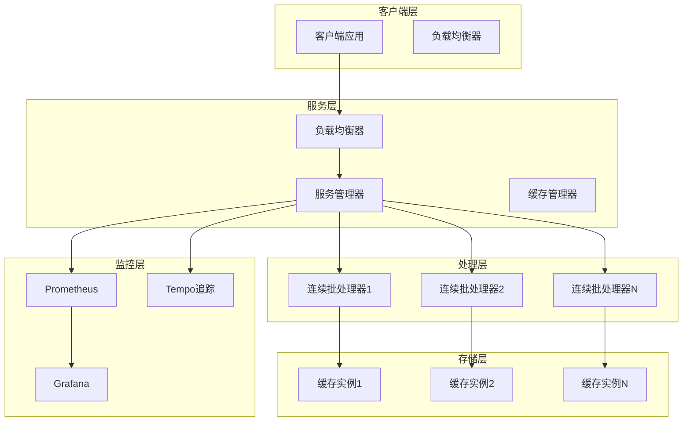
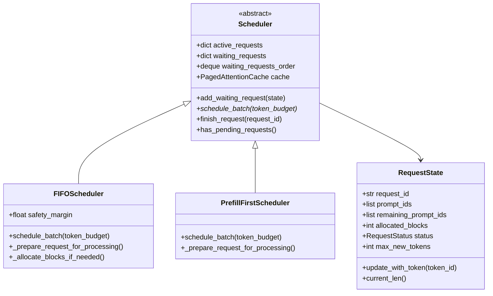
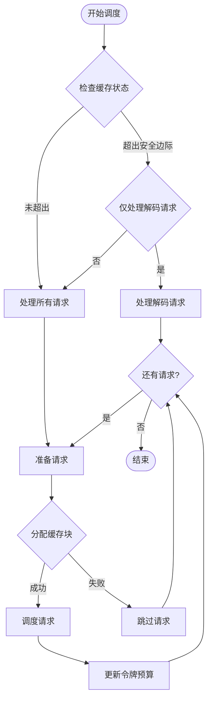
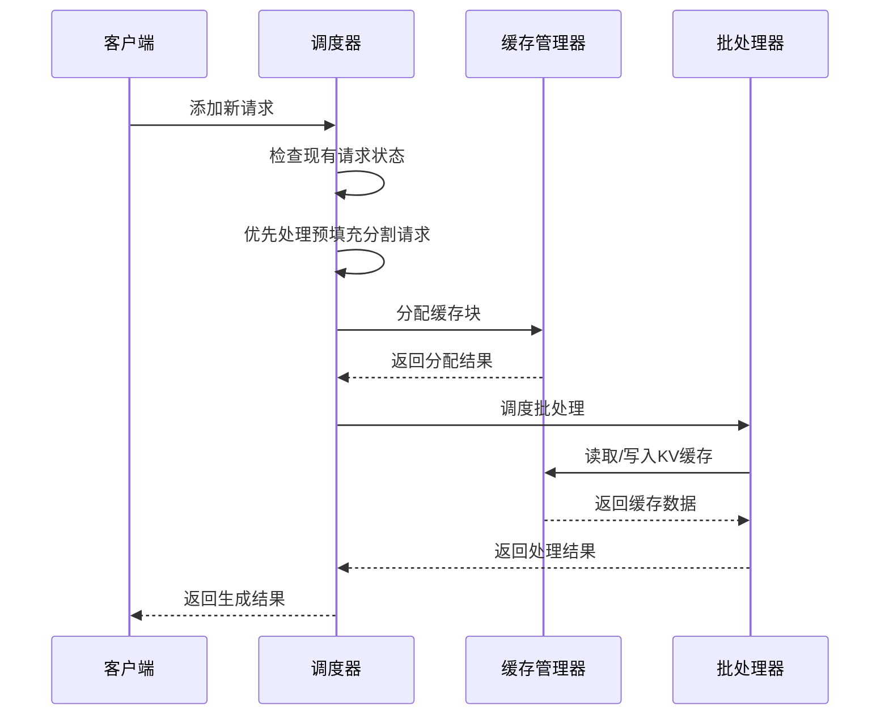
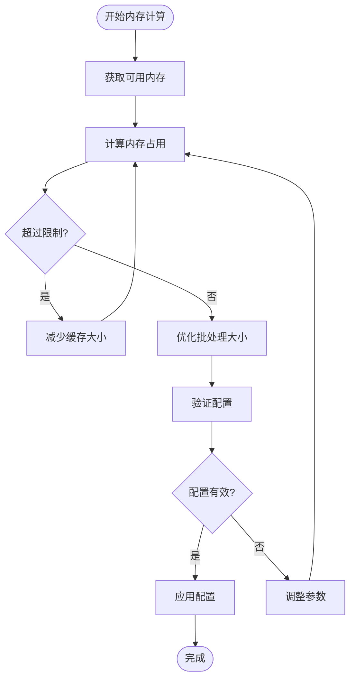
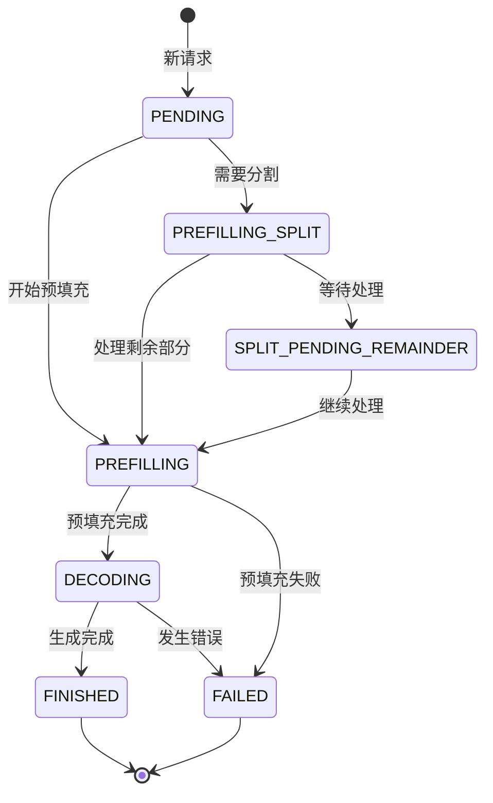
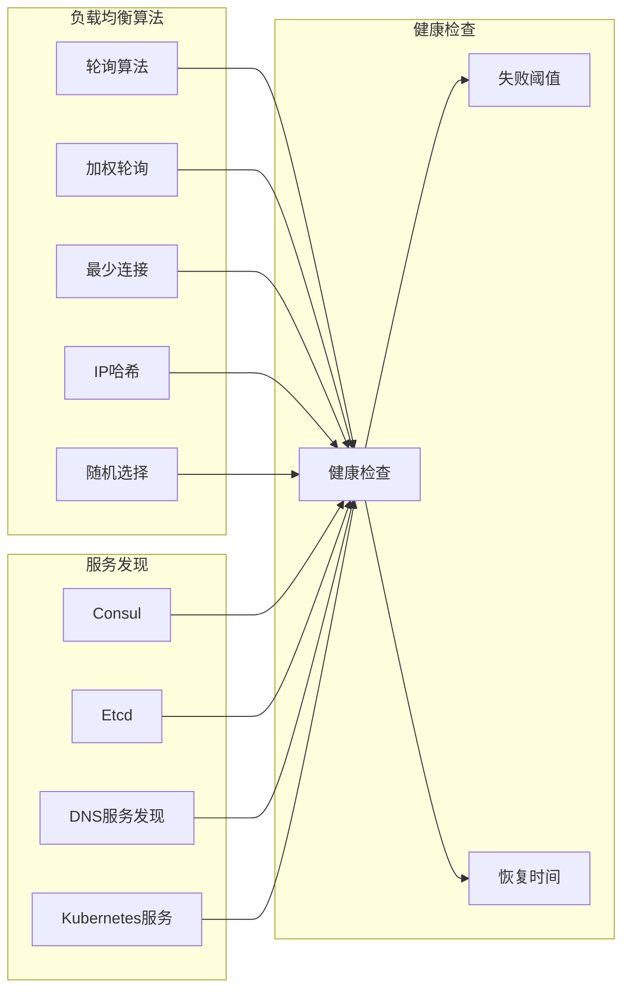
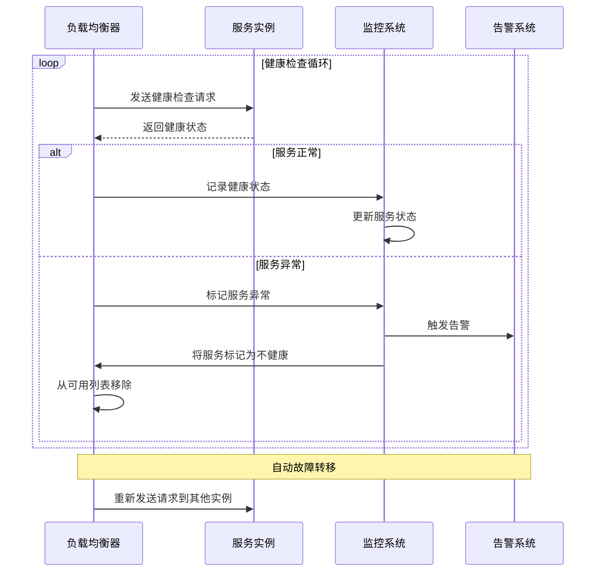
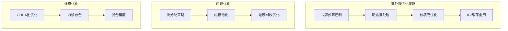
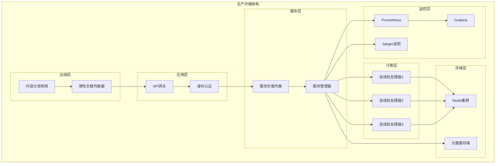

# 水平扩展

<cite>
**本文档中引用的文件**
- [continuous_batching.py](file://examples/pytorch/continuous_batching.py)
- [continuous_batching_simple.py](file://examples/pytorch/continuous_batching_simple.py)
- [scheduler.py](file://src/transformers/generation/continuous_batching/scheduler.py)
- [cache.py](file://src/transformers/generation/continuous_batching/cache.py)
- [requests.py](file://src/transformers/generation/continuous_batching/requests.py)
- [continuous_api.py](file://src/transformers/generation/continuous_batching/continuous_api.py)
- [docker-compose.yml](file://examples/metrics-monitoring/docker-compose.yml)
- [prometheus.yml](file://examples/metrics-monitoring/prometheus.yml)
- [test_continuous_batching.py](file://tests/generation/test_continuous_batching.py)
- [configuration_utils.py](file://src/transformers/distributed/configuration_utils.py)
</cite>

## 目录
1. [简介](#简介)
2. [系统架构概览](#系统架构概览)
3. [连续批处理调度器](#连续批处理调度器)
4. [缓存管理系统](#缓存管理系统)
5. [请求生命周期管理](#请求生命周期管理)
6. [多节点部署配置](#多节点部署配置)
7. [负载均衡与服务发现](#负载均衡与服务发现)
8. [健康检查与故障转移](#健康检查与故障转移)
9. [性能优化策略](#性能优化策略)
10. [监控与指标](#监控与指标)
11. [最佳实践](#最佳实践)
12. [故障排除](#故障排除)

## 简介

本指南详细介绍了基于Hugging Face Transformers框架中continuous_batching模块的水平扩展实现。该系统通过智能调度器、高效的缓存管理和分布式架构设计，实现了高吞吐量的推理服务。系统支持多种调度策略（FIFO、PrefillFirst），动态内存分配，并提供了完整的监控和故障处理机制。

## 系统架构概览

连续批处理系统采用分层架构设计，包含以下核心组件：



**图表来源**
- [continuous_api.py](file://src/transformers/generation/continuous_batching/continuous_api.py#L1-L100)
- [scheduler.py](file://src/transformers/generation/continuous_batching/scheduler.py#L1-L50)

**章节来源**
- [continuous_api.py](file://src/transformers/generation/continuous_batching/continuous_api.py#L1-L200)
- [scheduler.py](file://src/transformers/generation/continuous_batching/scheduler.py#L1-L100)

## 连续批处理调度器

### 调度器架构

调度器是连续批处理系统的核心组件，负责管理请求的优先级和批处理策略。系统提供两种主要调度策略：



**图表来源**
- [scheduler.py](file://src/transformers/generation/continuous_batching/scheduler.py#L20-L80)
- [requests.py](file://src/transformers/generation/continuous_batching/requests.py#L80-L150)

### FIFO调度器

FIFO调度器按照请求到达顺序处理，具有安全边际机制防止缓存耗尽：



**图表来源**
- [scheduler.py](file://src/transformers/generation/continuous_batching/scheduler.py#L154-L298)

### 预填充优先调度器

预填充优先调度器确保部分处理的请求能够完成，然后处理新的解码请求：



**图表来源**
- [scheduler.py](file://src/transformers/generation/continuous_batching/scheduler.py#L238-L298)

**章节来源**
- [scheduler.py](file://src/transformers/generation/continuous_batching/scheduler.py#L154-L298)

## 缓存管理系统

### 分页注意力缓存

缓存系统采用分层管理策略，支持混合注意力类型：

```mermaid
graph TD
subgraph "缓存层次结构"
Page[页面<br/>最小单位<br/>[num_heads, head_size]]
Block[块<br/>分配单元<br/>block_size个页面]
Tensor[缓存张量<br/>物理存储<br/>多个块]
end
subgraph "注意力类型分组"
FA[全注意力组<br/>full_attention]
SA[滑动窗口组<br/>sliding_attention]
end
subgraph "内存管理"
FreeBlocks[空闲块队列]
Alloc[分配器]
Dealloc[释放器]
end
Page --> Block
Block --> Tensor
Tensor --> FA
Tensor --> SA
FreeBlocks --> Alloc
Alloc --> Dealloc
```

**图表来源**
- [cache.py](file://src/transformers/generation/continuous_batching/cache.py#L60-L150)

### 动态内存分配

缓存系统根据可用GPU内存自动调整大小：



**图表来源**
- [cache.py](file://src/transformers/generation/continuous_batching/cache.py#L400-L500)

**章节来源**
- [cache.py](file://src/transformers/generation/continuous_batching/cache.py#L60-L200)

## 请求生命周期管理

### 请求状态转换

请求在系统中的生命周期包含多个状态转换：



**图表来源**
- [requests.py](file://src/transformers/generation/continuous_batching/requests.py#L40-L60)

### 请求状态数据结构

每个请求的状态由RequestState类维护：

| 属性 | 类型 | 描述 | 默认值 |
|------|------|------|--------|
| request_id | str | 请求唯一标识符 | 自动生成 |
| full_prompt_ids | list[int] | 完整提示词序列 | None |
| prompt_ids | list[int] | 当前处理的提示词 | None |
| remaining_prompt_ids | list[int] | 待处理的剩余提示词 | [] |
| static_outputs | list[int] | 已生成的令牌 | [] |
| allocated_blocks | int | 分配的缓存块数量 | 0 |
| position_offset | int | 序列中的当前位置 | 0 |
| status | RequestStatus | 当前请求状态 | PENDING |
| max_new_tokens | int | 最大新生成令牌数 | 20 |
| eos_token_id | int | 结束标记令牌ID | -1 |
| streaming | bool | 是否流式输出 | False |

**章节来源**
- [requests.py](file://src/transformers/generation/continuous_batching/requests.py#L80-L200)

## 多节点部署配置

### Docker Compose配置

以下是多节点部署的Docker Compose配置示例：

```yaml
version: '3.8'

services:
  # 负载均衡器
  nginx:
    image: nginx:alpine
    ports:
      - "80:80"
      - "443:443"
    volumes:
      - ./nginx.conf:/etc/nginx/nginx.conf
    depends_on:
      - service1
      - service2
      - service3
  
  # 服务实例1
  service1:
    image: transformers:latest
    environment:
      - SERVICE_NAME=service1
      - PORT=8000
      - MAX_BATCH_TOKENS=2048
      - NUM_BLOCKS=1024
      - CACHE_TYPE=paged
    ports:
      - "8001:8000"
    volumes:
      - ./models:/app/models
      - ./configs:/app/configs
    deploy:
      resources:
        limits:
          memory: 16G
          cpus: '4'
  
  # 服务实例2
  service2:
    image: transformers:latest
    environment:
      - SERVICE_NAME=service2
      - PORT=8000
      - MAX_BATCH_TOKENS=2048
      - NUM_BLOCKS=1024
      - CACHE_TYPE=paged
    ports:
      - "8002:8000"
    volumes:
      - ./models:/app/models
      - ./configs:/app/configs
    deploy:
      resources:
        limits:
          memory: 16G
          cpus: '4'
  
  # 服务实例3
  service3:
    image: transformers:latest
    environment:
      - SERVICE_NAME=service3
      - PORT=8000
      - MAX_BATCH_TOKENS=2048
      - NUM_BLOCKS=1024
      - CACHE_TYPE=paged
    ports:
      - "8003:8000"
    volumes:
      - ./models:/app/models
      - ./configs:/app/configs
    deploy:
      resources:
        limits:
          memory: 16G
          cpus: '4'
  
  # 数据库集群
  redis-master:
    image: redis:6-alpine
    ports:
      - "6379:6379"
    command: redis-server --save 20 1 --loglevel warning
  
  redis-slave:
    image: redis:6-alpine
    command: redis-server --slaveof redis-master 6379 --loglevel warning
    depends_on:
      - redis-master
  
  # 监控系统
  prometheus:
    image: prom/prometheus:latest
    ports:
      - "9090:9090"
    volumes:
      - ./prometheus.yml:/etc/prometheus/prometheus.yml
    command:
      - '--config.file=/etc/prometheus/prometheus.yml'
      - '--storage.tsdb.path=/prometheus'
      - '--web.console.libraries=/etc/prometheus/console_libraries'
      - '--web.console.templates=/etc/prometheus/consoles'
      - '--web.enable-lifecycle'
  
  grafana:
    image: grafana/grafana:latest
    ports:
      - "3000:3000"
    environment:
      - GF_SECURITY_ADMIN_PASSWORD=admin
    volumes:
      - grafana-data:/var/lib/grafana
    depends_on:
      - prometheus
```

### Kubernetes部署配置

```yaml
apiVersion: apps/v1
kind: Deployment
metadata:
  name: transformers-service
spec:
  replicas: 3
  selector:
    matchLabels:
      app: transformers
  template:
    metadata:
      labels:
        app: transformers
    spec:
      containers:
      - name: transformers
        image: transformers:latest
        ports:
        - containerPort: 8000
        env:
        - name: MAX_BATCH_TOKENS
          value: "2048"
        - name: NUM_BLOCKS
          value: "1024"
        - name: CACHE_TYPE
          value: "paged"
        resources:
          limits:
            memory: "16Gi"
            cpu: "4"
          requests:
            memory: "8Gi"
            cpu: "2"
        volumeMounts:
        - name: models
          mountPath: /app/models
        - name: configs
          mountPath: /app/configs
      volumes:
      - name: models
        persistentVolumeClaim:
          claimName: models-pvc
      - name: configs
        configMap:
          name: transformers-config
---
apiVersion: v1
kind: Service
metadata:
  name: transformers-service
spec:
  selector:
    app: transformers
  ports:
  - protocol: TCP
    port: 80
    targetPort: 8000
  type: LoadBalancer
```

**章节来源**
- [docker-compose.yml](file://examples/metrics-monitoring/docker-compose.yml#L1-L56)

## 负载均衡与服务发现

### 负载均衡策略

系统支持多种负载均衡策略：



### 服务注册与发现

```python
# 服务注册示例
class ServiceRegistry:
    def __init__(self, backend='consul'):
        self.backend = backend
        self.services = {}
    
    def register_service(self, service_name, host, port, metadata=None):
        """注册服务到服务发现系统"""
        service_id = f"{service_name}-{host}-{port}"
        service_info = {
            'id': service_id,
            'name': service_name,
            'host': host,
            'port': port,
            'metadata': metadata or {},
            'last_heartbeat': time.time()
        }
        
        # 注册到后端
        if self.backend == 'consul':
            self.consul_register(service_info)
        elif self.backend == 'etcd':
            self.etcd_register(service_info)
        
        self.services[service_id] = service_info
        return service_id
    
    def discover_services(self, service_name):
        """发现指定名称的服务实例"""
        if self.backend == 'consul':
            return self.consul_discover(service_name)
        elif self.backend == 'etcd':
            return self.etcd_discover(service_name)
        elif self.backend == 'k8s':
            return self.k8s_discover(service_name)
    
    def health_check(self, service_id):
        """执行健康检查"""
        service = self.services.get(service_id)
        if not service:
            return False
        
        # 检查最后心跳时间
        time_since_last_heartbeat = time.time() - service['last_heartbeat']
        if time_since_last_heartbeat > 30:  # 30秒超时
            return False
        
        # 执行具体健康检查
        return self.perform_health_check(service)
```

## 健康检查与故障转移

### 健康检查机制



### 故障转移策略

```python
class FaultToleranceManager:
    def __init__(self, max_failures=3, recovery_timeout=30):
        self.max_failures = max_failures
        self.recovery_timeout = recovery_timeout
        self.service_failures = {}
        self.blacklisted_services = set()
    
    def should_route_request(self, service_id):
        """判断是否应该将请求路由到指定服务"""
        if service_id in self.blacklisted_services:
            return False
        
        failures = self.service_failures.get(service_id, 0)
        return failures < self.max_failures
    
    def report_failure(self, service_id, error=None):
        """报告服务失败"""
        self.service_failures[service_id] = self.service_failures.get(service_id, 0) + 1
        
        if self.should_blacklist(service_id):
            self.blacklist_service(service_id)
            self.notify_admins(f"服务 {service_id} 已被加入黑名单")
    
    def should_blacklist(self, service_id):
        """判断是否应该将服务加入黑名单"""
        failures = self.service_failures.get(service_id, 0)
        return failures >= self.max_failures
    
    def blacklist_service(self, service_id):
        """将服务加入黑名单"""
        self.blacklisted_services.add(service_id)
        
        # 设置定时器，在恢复时间后移除黑名单
        threading.Timer(self.recovery_timeout, 
                       lambda: self.remove_from_blacklist(service_id)).start()
    
    def remove_from_blacklist(self, service_id):
        """从黑名单中移除服务"""
        self.blacklisted_services.discard(service_id)
        self.service_failures[service_id] = 0
    
    def get_available_services(self, all_services):
        """获取可用的服务实例"""
        return [svc for svc in all_services 
                if svc not in self.blacklisted_services]
```

**章节来源**
- [test_continuous_batching.py](file://tests/generation/test_continuous_batching.py#L520-L548)

## 性能优化策略

### 批处理优化

系统采用多种策略优化批处理性能：



### 内存管理优化

```python
class MemoryOptimizer:
    def __init__(self, target_utilization=0.9):
        self.target_utilization = target_utilization
        self.memory_stats = {}
    
    def optimize_cache_size(self, current_usage, max_memory):
        """根据当前使用情况优化缓存大小"""
        current_utilization = current_usage / max_memory
        
        if current_utilization > self.target_utilization:
            # 减少缓存大小
            new_blocks = int(current_usage / (max_memory * self.target_utilization))
            return new_blocks
        elif current_utilization < self.target_utilization * 0.8:
            # 增加缓存大小
            new_blocks = int(current_usage / (max_memory * self.target_utilization * 0.8))
            return new_blocks
        else:
            return None  # 不需要调整
    
    def optimize_batch_size(self, current_batch_size, token_budget):
        """优化批处理大小"""
        # 基于令牌预算和可用内存进行调整
        optimal_size = min(current_batch_size, token_budget)
        
        # 考虑GPU利用率
        gpu_utilization = self.get_gpu_utilization()
        if gpu_utilization < 0.7:
            optimal_size = min(optimal_size * 1.2, token_budget)
        elif gpu_utilization > 0.9:
            optimal_size = max(optimal_size * 0.8, 1)
        
        return optimal_size
    
    def get_gpu_utilization(self):
        """获取GPU利用率"""
        if torch.cuda.is_available():
            return torch.cuda.utilization()
        return 0.0
```

### 并行处理优化

```python
class ParallelOptimizer:
    def __init__(self):
        self.optimal_configs = {}
    
    def optimize_tensor_parallel(self, model_size, gpu_count):
        """优化张量并行配置"""
        # 基于模型大小和GPU数量计算最优配置
        if model_size <= 1e9:  # 1B参数以下
            return 1
        elif model_size <= 1e10:  # 1B-10B参数
            return min(gpu_count, 4)
        else:  # 10B以上参数
            return min(gpu_count, 8)
    
    def optimize_pipeline_parallel(self, model_layers, gpu_count):
        """优化流水线并行配置"""
        # 确保每片至少有2层
        layers_per_stage = max(2, model_layers // gpu_count)
        stages = min(gpu_count, model_layers // layers_per_stage)
        return stages
    
    def optimize_context_parallel(self, sequence_length, max_sequence_length):
        """优化上下文并行配置"""
        # 基于序列长度和最大序列长度计算
        if sequence_length <= max_sequence_length:
            return 1
        else:
            return math.ceil(sequence_length / max_sequence_length)
```

## 监控与指标

### 关键性能指标

系统监控的关键指标包括：

| 指标类别 | 具体指标 | 描述 | 阈值建议 |
|----------|----------|------|----------|
| 吞吐量 | 请求/秒 | 每秒处理的请求数量 | >100 RPS |
| 延迟 | 平均响应时间 | 请求处理的平均时间 | <100ms |
| 延迟 | 99百分位延迟 | 99%请求的响应时间 | <500ms |
| 资源使用 | GPU利用率 | GPU计算资源使用率 | 70-90% |
| 资源使用 | 内存利用率 | GPU内存使用率 | <90% |
| 缓存效率 | 缓存命中率 | KV缓存命中比例 | >95% |
| 错误率 | 失败请求率 | 失败请求占总请求的比例 | <1% |
| 可用性 | 服务可用率 | 服务正常运行的时间比例 | >99.9% |

### 监控仪表板配置

```yaml
# Prometheus配置示例
global:
  scrape_interval: 15s
  evaluation_interval: 15s

rule_files:
  - "continuous_batching_rules.yml"

scrape_configs:
  - job_name: 'transformers-services'
    static_configs:
      - targets: ['service1:8000', 'service2:8000', 'service3:8000']
    metrics_path: '/metrics'
    scrape_interval: 10s

  - job_name: 'gpu-metrics'
    static_configs:
      - targets: ['gpu-exporter:9100']

alerting:
  alertmanagers:
    - static_configs:
        - targets:
          - alertmanager:9093
```

### 告警规则配置

```yaml
groups:
  - name: transformers-alerts
    rules:
      - alert: HighResponseLatency
        expr: histogram_quantile(0.95, rate(transformers_response_time_seconds_bucket[5m])) > 0.5
        for: 2m
        labels:
          severity: warning
        annotations:
          summary: "High response latency detected"
          description: "95th percentile response time is {{ $value }} seconds"
      
      - alert: HighGPUMemoryUsage
        expr: transformers_gpu_memory_usage_ratio > 0.9
        for: 1m
        labels:
          severity: critical
        annotations:
          summary: "GPU memory usage is critically high"
          description: "GPU memory usage is {{ $value | humanizePercentage }}"
      
      - alert: ServiceDown
        expr: up{job="transformers-services"} == 0
        for: 30s
        labels:
          severity: critical
        annotations:
          summary: "Transformer service is down"
          description: "Service {{ $labels.instance }} is not responding"
```

**章节来源**
- [docker-compose.yml](file://examples/metrics-monitoring/docker-compose.yml#L1-L56)
- [prometheus.yml](file://examples/metrics-monitoring/prometheus.yml#L1-L1)

## 最佳实践

### 配置优化建议

1. **缓存配置优化**
   ```python
   # 推荐的缓存配置
   generation_config = GenerationConfig(
       max_batch_tokens=2048,      # 根据GPU内存调整
       num_blocks=1024,           # 初始块数量
       block_size=32,             # 块大小
       max_memory=0.9,            # 最大内存使用率
       sliding_window=4096        # 滑动窗口大小
   )
   ```

2. **调度器选择**
   - 对于低延迟要求：使用FIFOScheduler，设置较小的安全边际
   - 对于高吞吐量要求：使用PrefillFirstScheduler
   - 对于混合工作负载：根据具体需求调整调度策略

3. **资源分配**
   - GPU内存：预留20%用于系统开销
   - CPU：至少4核用于批处理管理
   - 网络：千兆网卡确保服务间通信

### 部署架构建议



### 安全配置

1. **网络安全**
   - 使用TLS加密所有通信
   - 配置防火墙规则限制访问
   - 实施VPN或专用网络连接

2. **身份认证**
   ```python
   # JWT认证示例
   class TransformerAuth:
       def __init__(self, jwt_secret, jwt_algorithm='HS256'):
           self.jwt_secret = jwt_secret
           self.jwt_algorithm = jwt_algorithm
       
       def generate_token(self, user_id, roles):
           payload = {
               'user_id': user_id,
               'roles': roles,
               'exp': datetime.utcnow() + timedelta(hours=1),
               'iat': datetime.utcnow()
           }
           return jwt.encode(payload, self.jwt_secret, algorithm=self.jwt_algorithm)
       
       def verify_token(self, token):
           try:
               payload = jwt.decode(token, self.jwt_secret, algorithms=[self.jwt_algorithm])
               return payload
           except jwt.ExpiredSignatureError:
               raise AuthenticationError('Token expired')
           except jwt.InvalidTokenError:
               raise AuthenticationError('Invalid token')
   ```

## 故障排除

### 常见问题及解决方案

1. **内存不足错误**
   ```
   解决方案：
   - 减少max_batch_tokens
   - 增加num_blocks
   - 降低max_memory使用率
   - 启用梯度检查点
   ```

2. **缓存耗尽**
   ```
   解决方案：
   - 调整安全边际参数
   - 实现请求优先级机制
   - 增加缓存容量
   - 优化请求处理流程
   ```

3. **性能下降**
   ```
   解决方案：
   - 检查GPU利用率
   - 优化批处理大小
   - 调整调度策略
   - 监控网络延迟
   ```

### 调试工具

```python
class DebugHelper:
    def __init__(self, scheduler, cache):
        self.scheduler = scheduler
        self.cache = cache
    
    def dump_scheduler_state(self):
        """导出调度器状态"""
        state = {
            'active_requests': len(self.scheduler.active_requests),
            'waiting_requests': len(self.scheduler.waiting_requests),
            'waiting_order': list(self.scheduler.waiting_requests_order),
            'total_requests': len(self.scheduler.active_requests) + len(self.scheduler.waiting_requests)
        }
        return state
    
    def dump_cache_state(self):
        """导出缓存状态"""
        state = {
            'total_blocks': self.cache.num_blocks,
            'free_blocks': self.cache.get_num_free_blocks(),
            'allocated_blocks': self.cache.num_blocks - self.cache.get_num_free_blocks(),
            'block_size': self.cache.block_size,
            'memory_utilization': (self.cache.num_blocks - self.cache.get_num_free_blocks()) / self.cache.num_blocks
        }
        return state
    
    def validate_consistency(self):
        """验证系统一致性"""
        errors = []
        
        # 检查请求状态一致性
        for req_id, req_state in self.scheduler.active_requests.items():
            if req_state.request_id != req_id:
                errors.append(f"请求ID不匹配: {req_id}")
        
        # 检查缓存分配一致性
        total_allocated = sum(req.allocated_blocks for req in self.scheduler.active_requests.values())
        if total_allocated > self.cache.num_blocks - self.cache.get_num_free_blocks():
            errors.append("缓存分配超限")
        
        return errors
```

### 日志记录

```python
import logging
from logging.handlers import RotatingFileHandler

class LoggingConfigurator:
    @staticmethod
    def configure_logging(log_level=logging.INFO, log_file='transformers.log'):
        """配置日志记录"""
        logger = logging.getLogger('transformers')
        logger.setLevel(log_level)
        
        # 文件处理器
        file_handler = RotatingFileHandler(
            log_file, maxBytes=10*1024*1024, backupCount=5
        )
        file_handler.setLevel(log_level)
        
        # 控制台处理器
        console_handler = logging.StreamHandler()
        console_handler.setLevel(log_level)
        
        # 格式化器
        formatter = logging.Formatter(
            '%(asctime)s - %(name)s - %(levelname)s - %(message)s'
        )
        file_handler.setFormatter(formatter)
        console_handler.setFormatter(formatter)
        
        # 添加处理器
        logger.addHandler(file_handler)
        logger.addHandler(console_handler)
        
        return logger
```

**章节来源**
- [continuous_batching.py](file://examples/pytorch/continuous_batching.py#L1-L100)
- [test_continuous_batching.py](file://tests/generation/test_continuous_batching.py#L1-L150)

## 结论

本指南详细介绍了基于Hugging Face Transformers框架的连续批处理系统的水平扩展实现。通过智能调度器、高效缓存管理和完善的监控体系，系统能够实现高吞吐量、低延迟的推理服务。关键要点包括：

1. **灵活的调度策略**：支持FIFO和PrefillFirst两种调度模式，可根据不同场景选择最优策略
2. **动态资源管理**：自动调整缓存大小和批处理参数，最大化资源利用率
3. **完善的监控体系**：提供全面的指标监控和告警机制
4. **高可用架构**：支持多节点部署和自动故障转移
5. **性能优化**：多层次的性能优化策略确保最佳系统表现

通过遵循本指南的最佳实践，用户可以构建一个稳定、高效、可扩展的分布式推理服务架构，满足大规模生产环境的需求。