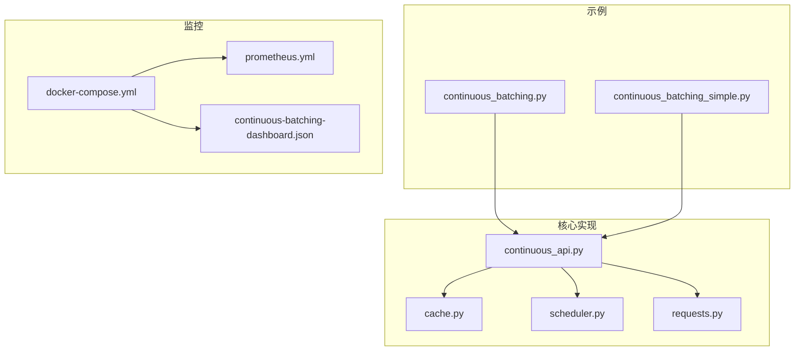
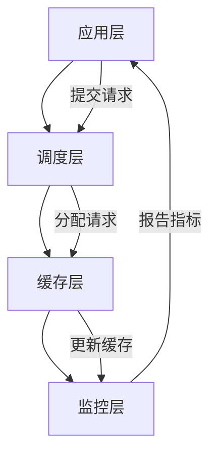
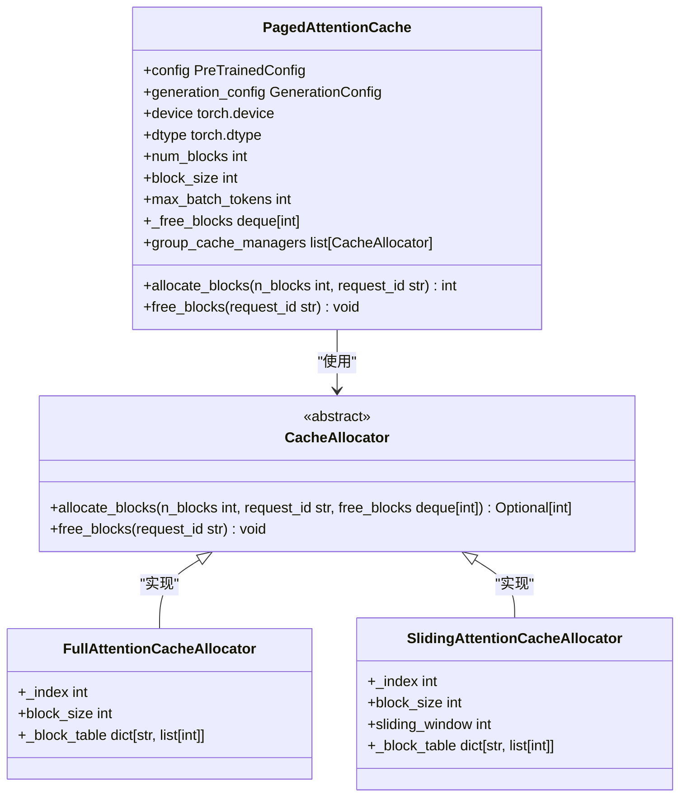
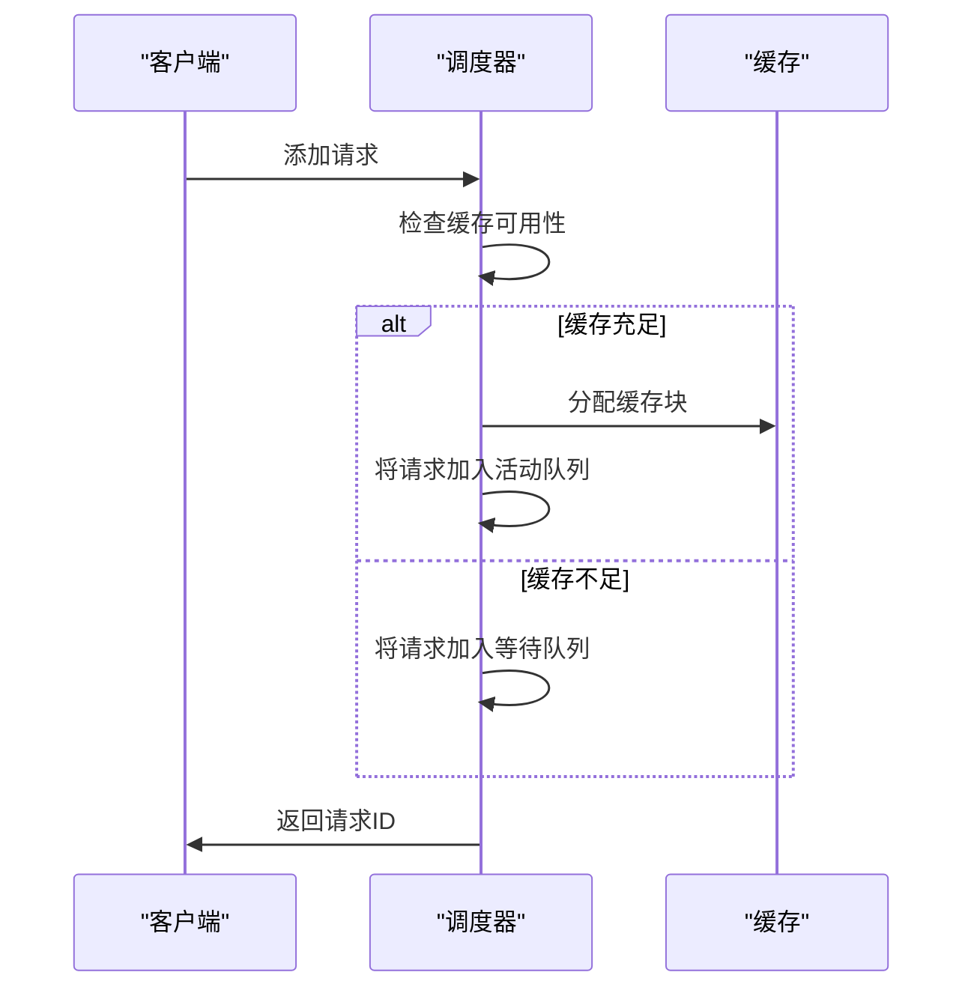
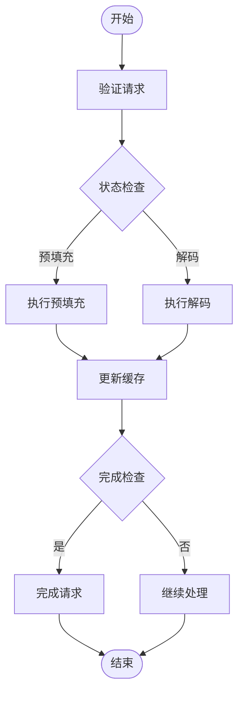
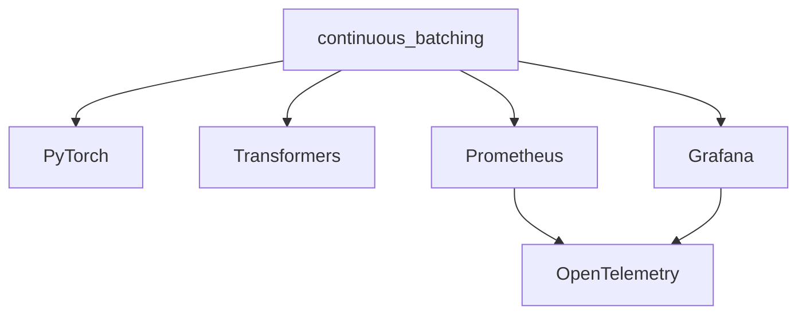

# 自动扩展

<cite>
**本文档中引用的文件**  
- [continuous_batching.py](file://examples/pytorch/continuous_batching.py)
- [continuous_batching_simple.py](file://examples/pytorch/continuous_batching_simple.py)
- [cache.py](file://src/transformers/generation/continuous_batching/cache.py)
- [continuous_api.py](file://src/transformers/generation/continuous_batching/continuous_api.py)
- [scheduler.py](file://src/transformers/generation/continuous_batching/scheduler.py)
- [requests.py](file://src/transformers/generation/continuous_batching/requests.py)
- [docker-compose.yml](file://examples/metrics-monitoring/docker-compose.yml)
- [prometheus.yml](file://examples/metrics-monitoring/prometheus.yml)
- [continuous-batching-dashboard.json](file://examples/metrics-monitoring/continuous-batching-dashboard.json)
</cite>

## 目录
1. [简介](#简介)
2. [项目结构](#项目结构)
3. [核心组件](#核心组件)
4. [架构概述](#架构概述)
5. [详细组件分析](#详细组件分析)
6. [依赖分析](#依赖分析)
7. [性能考虑](#性能考虑)
8. [故障排除指南](#故障排除指南)
9. [结论](#结论)

## 简介
本文档提供了基于 `continuous_batching` 模块的自动扩展详细指南，重点介绍如何根据负载动态调整服务容量。文档深入探讨了负载监控、扩展策略和资源调度的实现机制，涵盖阈值配置、扩展策略设计和成本优化的最佳实践，帮助用户构建能够自动适应流量变化的弹性系统。

## 项目结构
连续批处理功能主要分布在 `examples/pytorch` 和 `src/transformers/generation/continuous_batching` 目录中。`examples/pytorch` 包含使用示例和性能基准测试脚本，而 `src/transformers/generation/continuous_batching` 包含核心实现，包括缓存管理、请求处理、调度和监控组件。

**图表来源**
- [continuous_batching.py](file://examples/pytorch/continuous_batching.py)
- [continuous_batching_simple.py](file://examples/pytorch/continuous_batching_simple.py)
- [continuous_api.py](file://src/transformers/generation/continuous_batching/continuous_api.py)
- [cache.py](file://src/transformers/generation/continuous_batching/cache.py)
- [scheduler.py](file://src/transformers/generation/continuous_batching/scheduler.py)
- [requests.py](file://src/transformers/generation/continuous_batching/requests.py)
- [docker-compose.yml](file://examples/metrics-monitoring/docker-compose.yml)
- [prometheus.yml](file://examples/metrics-monitoring/prometheus.yml)
- [continuous-batching-dashboard.json](file://examples/metrics-monitoring/continuous-batching-dashboard.json)

**章节来源**
- [examples/pytorch/continuous_batching.py](file://examples/pytorch/continuous_batching.py)
- [src/transformers/generation/continuous_batching/continuous_api.py](file://src/transformers/generation/continuous_batching/continuous_api.py)
- [examples/metrics-monitoring/docker-compose.yml](file://examples/metrics-monitoring/docker-compose.yml)

## 核心组件
连续批处理系统的核心组件包括缓存管理器、调度器、请求处理器和监控系统。缓存管理器负责高效管理KV缓存，调度器决定请求的处理顺序，请求处理器执行生成任务，监控系统提供实时性能指标。

**章节来源**
- [cache.py](file://src/transformers/generation/continuous_batching/cache.py)
- [scheduler.py](file://src/transformers/generation/continuous_batching/scheduler.py)
- [continuous_api.py](file://src/transformers/generation/continuous_batching/continuous_api.py)
- [requests.py](file://src/transformers/generation/continuous_batching/requests.py)

## 架构概述
系统采用分层架构，从上到下包括应用层、调度层、缓存层和监控层。应用层通过 `generate_batch` API 提交请求，调度层根据策略选择请求，缓存层管理KV缓存，监控层收集和报告性能指标。

**图表来源**
- [continuous_api.py](file://src/transformers/generation/continuous_batching/continuous_api.py)
- [scheduler.py](file://src/transformers/generation/continuous_batching/scheduler.py)
- [cache.py](file://src/transformers/generation/continuous_batching/cache.py)

## 详细组件分析
### 缓存管理分析
缓存管理器采用分页注意力机制，将缓存划分为固定大小的块，减少内存碎片。它支持混合注意力类型，将层分组以优化缓存分配。

**图表来源**
- [cache.py](file://src/transformers/generation/continuous_batching/cache.py)
- [cache_manager.py](file://src/transformers/generation/continuous_batching/cache_manager.py)

**章节来源**
- [cache.py](file://src/transformers/generation/continuous_batching/cache.py)
- [cache_manager.py](file://src/transformers/generation/continuous_batching/cache_manager.py)

### 调度器分析
调度器管理请求的生命周期，从等待队列到处理完成。它支持多种调度策略，包括FIFO和预填充优先。

**图表来源**
- [scheduler.py](file://src/transformers/generation/continuous_batching/scheduler.py)
- [requests.py](file://src/transformers/generation/continuous_batching/requests.py)

**章节来源**
- [scheduler.py](file://src/transformers/generation/continuous_batching/scheduler.py)
- [requests.py](file://src/transformers/generation/continuous_batching/requests.py)

### 请求处理分析
请求处理器执行生成任务，管理请求状态和生成输出。

**图表来源**
- [continuous_api.py](file://src/transformers/generation/continuous_batching/continuous_api.py)
- [requests.py](file://src/transformers/generation/continuous_batching/requests.py)

**章节来源**
- [continuous_api.py](file://src/transformers/generation/continuous_batching/continuous_api.py)
- [requests.py](file://src/transformers/generation/continuous_batching/requests.py)

## 依赖分析
系统依赖于PyTorch进行张量计算，Hugging Face Transformers库提供模型和分词器，以及Prometheus和Grafana进行监控。

**图表来源**
- [go.mod](file://go.mod)
- [requirements.txt](file://requirements.txt)

**章节来源**
- [go.mod](file://go.mod)
- [requirements.txt](file://requirements.txt)

## 性能考虑
系统通过分页注意力和缓存管理优化内存使用，通过调度策略优化请求处理效率。监控系统提供实时性能指标，帮助识别瓶颈和优化系统。

## 故障排除指南
常见问题包括缓存不足、请求超时和性能下降。解决方案包括调整缓存大小、优化调度策略和增加监控指标。

**章节来源**
- [cache.py](file://src/transformers/generation/continuous_batching/cache.py)
- [scheduler.py](file://src/transformers/generation/continuous_batching/scheduler.py)
- [requests.py](file://src/transformers/generation/continuous_batching/requests.py)

## 结论
本文档详细介绍了基于 `continuous_batching` 模块的自动扩展机制，包括负载监控、扩展策略和资源调度的实现。通过合理配置阈值和优化策略，可以构建高效、弹性的生成服务系统。