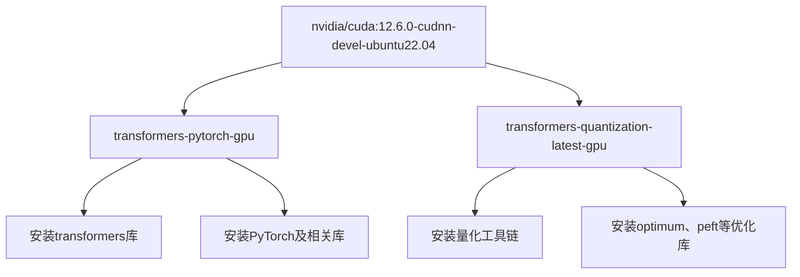
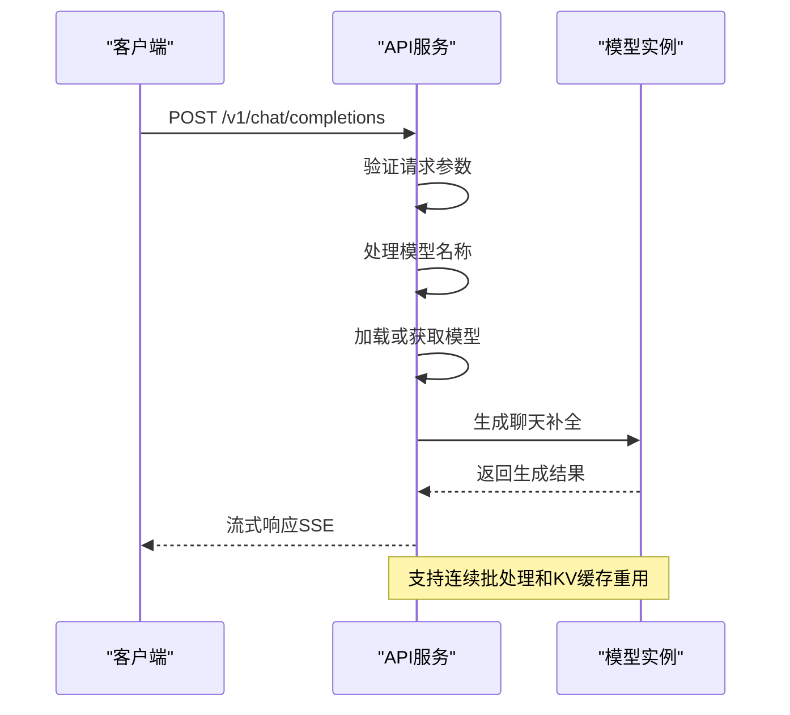
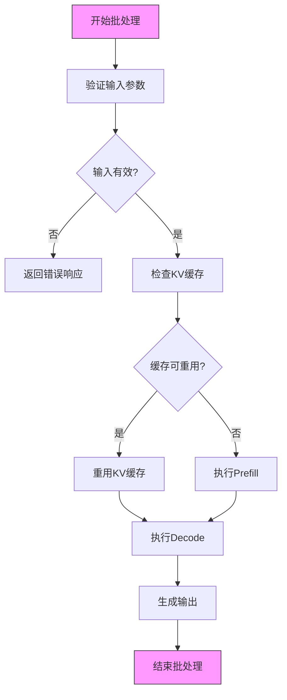
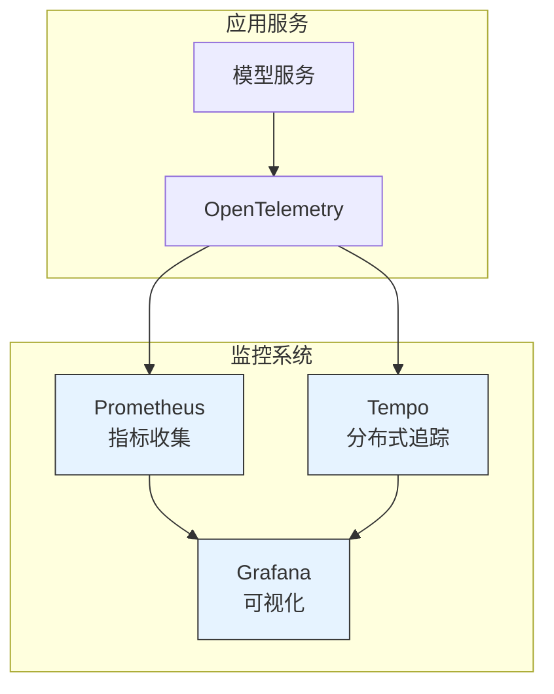
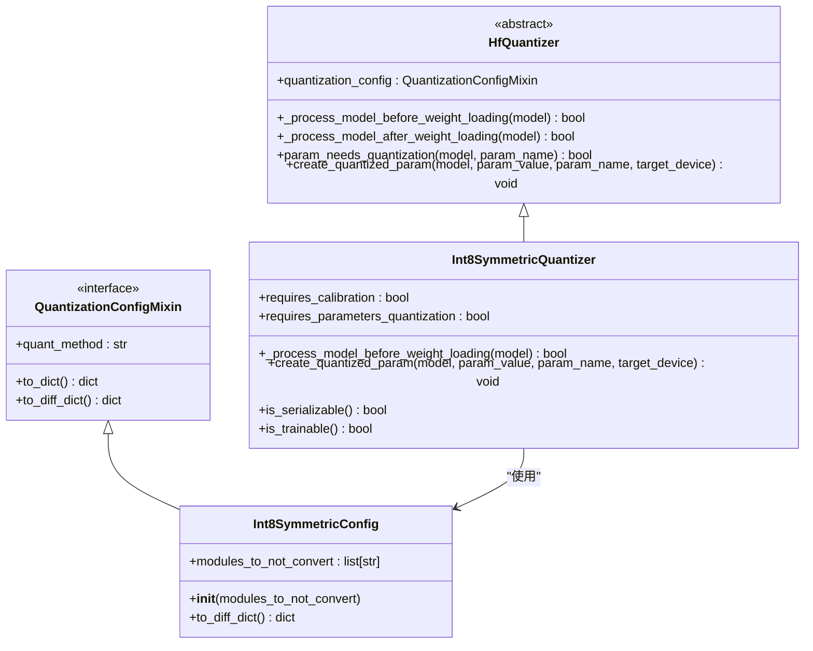

# 模型部署最佳实践

<cite>
**本文档中引用的文件**  
- [docker/README.md](file://docker/README.md)
- [docker/transformers-pytorch-gpu/Dockerfile](file://docker/transformers-pytorch-gpu/Dockerfile)
- [docker/transformers-quantization-latest-gpu/Dockerfile](file://docker/transformers-quantization-latest-gpu/Dockerfile)
- [examples/pytorch/continuous_batching.py](file://examples/pytorch/continuous_batching.py)
- [examples/metrics-monitoring/docker-compose.yml](file://examples/metrics-monitoring/docker-compose.yml)
- [examples/metrics-monitoring/prometheus.yml](file://examples/metrics-monitoring/prometheus.yml)
- [examples/metrics-monitoring/grafana-dashboard.yaml](file://examples/metrics-monitoring/grafana-dashboard.yaml)
- [examples/quantization/custom_quantization.py](file://examples/quantization/custom_quantization.py)
- [examples/quantization/custom_quantization_int8_example.py](file://examples/quantization/custom_quantization_int8_example.py)
- [src/transformers/cli/serve.py](file://src/transformers/cli/serve.py)
</cite>

## 目录
1. [简介](#简介)
2. [Docker容器化部署](#docker容器化部署)
3. [API服务构建](#api服务构建)
4. [连续批处理配置](#连续批处理配置)
5. [监控系统集成](#监控系统集成)
6. [模型量化部署](#模型量化部署)
7. [可扩展性设计](#可扩展性设计)
8. [安全考虑](#安全考虑)
9. [渐进式部署指南](#渐进式部署指南)
10. [结论](#结论)

## 简介
本文档详细介绍了将transformers模型部署到生产环境的最佳实践。基于docker目录和examples中的实际示例，重点阐述了Docker容器化部署、API服务构建、监控系统集成和可扩展性设计。文档解释了不同部署场景的最佳实践，包括高并发服务中的连续批处理配置和资源受限环境中的模型量化部署。提供了具体的部署架构建议，涵盖负载均衡、自动扩展和故障恢复机制。同时包含了安全考虑，如API认证、输入验证和模型保护。为不同规模的部署需求提供了从简单到复杂的渐进式指南。

## Docker容器化部署

transformers项目提供了多种Docker镜像配置，适用于不同的部署场景。项目中的docker目录包含了各种Dockerfile，分为两类：位于根目录下的dockerfiles用于快速CI任务，适合仅需CPU的任务；子文件夹中的Dockerfiles用于慢速CI，可支持GPU任务。

对于GPU环境的部署，`transformers-pytorch-gpu`镜像基于nvidia/cuda基础镜像构建，预装了PyTorch、transformers库及必要的依赖项。该镜像使用CUDA 12.6.0和Ubuntu 22.04作为基础环境，通过git clone方式获取transformers代码库，并安装开发和测试所需的额外依赖。

对于量化模型的部署，`transformers-quantization-latest-gpu`镜像包含了多种量化工具的依赖，如bitsandbytes、autoawq、quanto、torchao等，为量化模型的部署提供了完整的环境支持。这种模块化的Docker镜像设计使得用户可以根据具体需求选择合适的镜像进行部署。

**图示来源**
- [docker/transformers-pytorch-gpu/Dockerfile](file://docker/transformers-pytorch-gpu/Dockerfile)
- [docker/transformers-quantization-latest-gpu/Dockerfile](file://docker/transformers-quantization-latest-gpu/Dockerfile)

**节来源**
- [docker/README.md](file://docker/README.md)

## API服务构建

transformers提供了`transformers serve`命令行工具，用于快速构建生产级的API服务。该工具基于FastAPI和Uvicorn构建，提供了符合OpenAI API规范的接口，支持聊天补全、响应生成和音频转录等功能。

API服务的核心是`Serve`类，它管理模型的加载、卸载和推理过程。服务支持多种配置选项，包括设备选择、数据类型、远程代码信任、注意力实现方式、量化方法等。通过`--continuous-batching`参数可以启用连续批处理功能，显著提高高并发场景下的吞吐量。

服务实现了完整的请求验证机制，包括输入验证、字段验证和未使用字段检查。对于聊天补全请求，服务会验证请求中是否包含未支持的字段，并在严格模式下拒绝包含这些字段的请求。这种设计确保了API的稳定性和安全性。

**图示来源**
- [src/transformers/cli/serve.py](file://src/transformers/cli/serve.py)

**节来源**
- [src/transformers/cli/serve.py](file://src/transformers/cli/serve.py)

## 连续批处理配置

连续批处理（Continuous Batching）是提高LLM服务吞吐量的关键技术。transformers通过`model.generate_batch`方法实现了连续批处理功能，允许在单个前向传递中处理多个不同长度的序列。

在高并发服务中，连续批处理配置需要考虑两个关键参数：`num_blocks`和`max_batch_tokens`。`num_blocks`定义了KV缓存的块数，而`max_batch_tokens`限制了批处理中token的总数。合理的参数配置可以平衡内存使用和吞吐量。

连续批处理的实现基于分页注意力机制（Paged Attention），将KV缓存划分为固定大小的块。这种方法避免了传统批处理中由于填充（padding）造成的计算资源浪费，特别适合处理长度差异较大的请求。

**图示来源**
- [examples/pytorch/continuous_batching.py](file://examples/pytorch/continuous_batching.py)

**节来源**
- [examples/pytorch/continuous_batching.py](file://examples/pytorch/continuous_batching.py)

## 监控系统集成

transformers提供了完整的监控系统集成方案，基于Prometheus、Tempo和Grafana构建。`examples/metrics-monitoring`目录中的docker-compose配置文件定义了监控组件的容器化部署。

监控系统包括三个核心组件：Prometheus负责指标收集，Tempo负责分布式追踪，Grafana负责可视化展示。通过OpenTelemetry协议，模型推理过程中的性能指标和追踪信息可以实时发送到监控系统。

关键监控指标包括：KV缓存内存使用、生成速度（tokens/秒）、请求延迟、GPU利用率等。这些指标对于性能调优和故障排查至关重要。Grafana仪表板提供了直观的可视化界面，可以实时监控服务的健康状况。

**图示来源**
- [examples/metrics-monitoring/docker-compose.yml](file://examples/metrics-monitoring/docker-compose.yml)

**节来源**
- [examples/metrics-monitoring/docker-compose.yml](file://examples/metrics-monitoring/docker-compose.yml)
- [examples/metrics-monitoring/README.md](file://examples/metrics-monitoring/README.md)

## 模型量化部署

在资源受限环境中，模型量化是降低内存占用和提高推理速度的有效方法。transformers支持多种量化技术，包括8位量化、4位量化和自定义量化方案。

`examples/quantization`目录提供了量化部署的示例代码。通过`register_quantization_config`和`register_quantizer`装饰器，可以定义自定义的量化配置和量化器。量化器负责在模型加载前替换标准线性层为量化版本，并在权重加载时执行量化操作。

对于INT8对称量化，系统会计算每个权重矩阵的缩放因子，并将浮点权重转换为8位整数。这种方法可以在保持较高精度的同时，显著减少模型大小和内存带宽需求。

**图示来源**
- [examples/quantization/custom_quantization_int8_example.py](file://examples/quantization/custom_quantization_int8_example.py)

**节来源**
- [examples/quantization/custom_quantization.py](file://examples/quantization/custom_quantization.py)
- [examples/quantization/custom_quantization_int8_example.py](file://examples/quantization/custom_quantization_int8_example.py)

## 可扩展性设计

transformers的部署架构设计考虑了可扩展性需求。通过Docker容器化部署，可以轻松实现服务的水平扩展。结合Kubernetes等容器编排系统，可以实现自动扩缩容，根据负载动态调整实例数量。

服务内置了模型超时机制，长时间未使用的模型会自动从内存中卸载，释放资源供其他请求使用。这种设计使得单个实例可以服务多个模型，提高了资源利用率。

对于高可用性需求，建议部署多个服务实例，并通过负载均衡器分发请求。可以配置健康检查端点`/health`来监控实例状态，确保流量只被路由到健康的实例。

故障恢复机制包括：请求重试、超时控制和优雅关闭。服务支持在关闭时清理资源，确保KV缓存等资源被正确释放。

## 安全考虑

API服务的安全性是生产部署的关键考虑因素。transformers的`serve`工具提供了多种安全特性：

1. **输入验证**：通过`--input-validation`参数启用严格输入验证，检查请求中的意外字段和未使用字段。
2. **CORS支持**：通过`--enable-cors`参数启用跨域资源共享，但建议在生产环境中谨慎使用。
3. **请求ID追踪**：每个请求都会分配唯一的请求ID，便于日志追踪和问题排查。
4. **模型访问控制**：通过`--force-model`参数可以强制使用特定模型，防止用户访问未授权的模型。

建议在生产环境中部署API网关，实现更高级的安全功能，如速率限制、身份认证和请求审计。

## 渐进式部署指南

根据不同的部署需求，提供以下渐进式指南：

### 小规模部署（开发/测试）
1. 使用`transformers-pytorch-gpu` Docker镜像
2. 启动单个API实例
3. 使用默认配置，禁用连续批处理
4. 通过本地网络访问服务

### 中等规模部署（预生产）
1. 使用`transformers-quantization-latest-gpu`镜像部署量化模型
2. 启用连续批处理，优化`num_blocks`和`max_batch_tokens`参数
3. 部署监控系统，收集性能指标
4. 配置负载均衡，部署多个实例

### 大规模部署（生产）
1. 基于官方Dockerfile定制专用镜像
2. 集成到Kubernetes集群，实现自动扩缩容
3. 部署完整的监控和告警系统
4. 实现蓝绿部署或金丝雀发布策略
5. 配置CDN和边缘计算节点，降低延迟

## 结论

transformers提供了全面的模型部署解决方案，从Docker容器化到API服务构建，从性能优化到监控集成。通过合理配置连续批处理、模型量化和可扩展架构，可以在不同场景下实现高效的模型服务。安全考虑和渐进式部署指南为从开发到生产的平滑过渡提供了保障。建议根据具体需求选择合适的部署策略，并持续监控和优化服务性能。